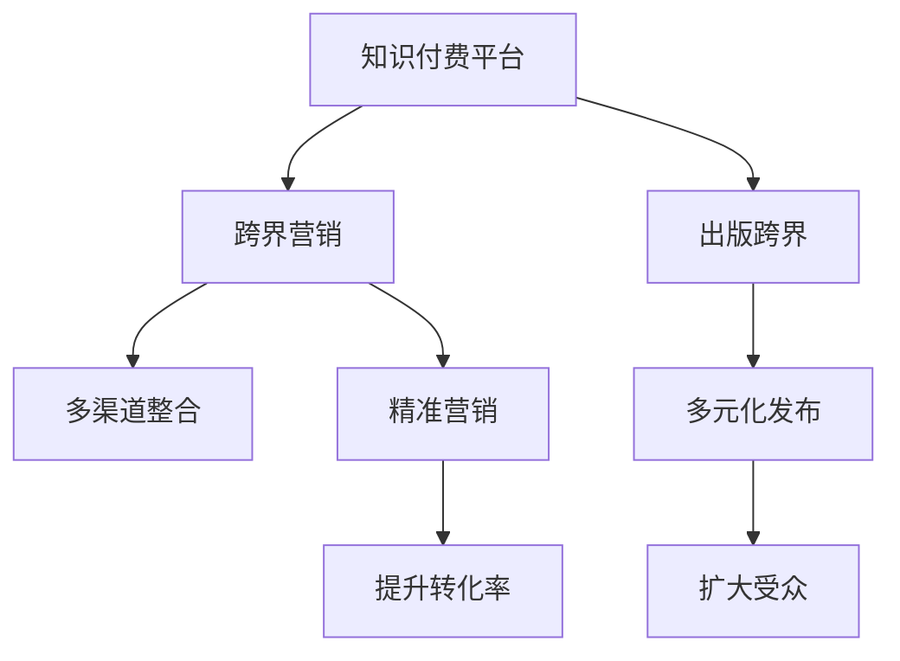

                 

# 知识付费如何实现跨界营销与出版跨界？

## 1. 背景介绍

在数字化时代，知识付费行业迎来了迅猛发展。互联网技术的革新和信息爆炸，使得人们对知识的需求日益增长，而传统教育体系已经难以满足这一需求。知识付费平台应运而生，通过优质内容吸引用户付费订阅，既满足了用户对知识的渴求，又为创作者提供了新的变现途径。

在知识付费市场中，如何实现高质量内容的产出和精准营销成为关键。跨界营销与出版跨界，即利用多元化渠道与不同领域的资源进行深度融合，成为知识付费平台吸引用户、提升品牌影响力的重要手段。本文将从背景、核心概念、算法原理与操作步骤、数学模型与详细讲解、项目实践、实际应用场景、工具与资源推荐、未来发展趋势与挑战以及常见问题与解答等多个维度，全面解析知识付费跨界营销与出版的实现路径。

## 2. 核心概念与联系

### 2.1 核心概念概述

为了更好地理解知识付费跨界营销与出版的实现路径，本节将介绍几个核心概念：

- **知识付费平台**：基于互联网的商业模式，通过提供有价值的知识内容，满足用户获取知识的需求，同时为创作者提供收益。
- **跨界营销**：跨越多重渠道和领域，实现品牌、内容和用户的深度融合，提升营销效果。
- **出版跨界**：将知识付费内容通过多元化方式进行发布和传播，拓宽传播渠道和受众范围。
- **用户画像**：通过对用户行为和兴趣的分析，构建详细、精准的用户画像，实现个性化推荐和营销。
- **数据驱动**：利用大数据和机器学习技术，对用户行为、内容表现等数据进行深入分析，指导内容和营销策略的优化。

这些概念之间的关系可以通过以下Mermaid流程图来展示：



## 3. 核心算法原理 & 具体操作步骤

### 3.1 算法原理概述

知识付费跨界营销与出版的核心算法原理主要包括：

- **用户画像构建**：通过收集和分析用户行为数据，构建详细、精准的用户画像，实现个性化推荐。
- **内容推荐算法**：基于用户画像和内容标签，使用协同过滤、基于内容的推荐等算法，实现内容推荐。
- **营销策略优化**：利用数据驱动，分析用户互动数据、内容表现数据等，优化广告投放策略和营销内容。
- **跨界渠道整合**：通过多渠道数据打通，实现内容在不同渠道的统一管理和发布。

### 3.2 算法步骤详解

知识付费跨界营销与出版的具体操作步骤如下：

**Step 1: 用户画像构建**
- 收集用户注册信息、行为数据、支付记录等，构建基础画像。
- 通过自然语言处理技术，分析用户评论、留言等文本数据，提取用户兴趣点。
- 使用深度学习模型，如协同过滤、LSTM等，对用户行为数据进行建模，预测用户兴趣和偏好。

**Step 2: 内容推荐算法设计**
- 对内容进行标签化处理，如关键词提取、实体识别等。
- 设计推荐算法，如基于内容的推荐、协同过滤推荐等。
- 使用A/B测试等方法，优化推荐算法参数，提高推荐效果。

**Step 3: 营销策略优化**
- 收集广告投放数据、内容表现数据等，进行分析。
- 利用机器学习模型，如决策树、随机森林等，优化广告投放策略。
- 通过多渠道数据整合，实现广告投放的精细化管理。

**Step 4: 跨界渠道整合**
- 实现内容在不同渠道的同步更新和管理。
- 通过API接口等方式，实现数据在不同平台间的互通。
- 在不同渠道进行统一的广告投放，实现资源的最大化利用。

### 3.3 算法优缺点

知识付费跨界营销与出版的核心算法具有以下优点：

- **个性化推荐**：基于用户画像和内容标签，实现精准内容推荐，提升用户粘性和满意度。
- **数据驱动优化**：通过数据分析和机器学习模型，优化推荐算法和营销策略，实现效果最大化。
- **跨界融合**：实现内容在不同渠道的整合与发布，拓宽传播范围，提升品牌影响力。

同时，该算法也存在一定的局限性：

- **数据隐私问题**：用户数据的收集和使用可能引发隐私保护问题。
- **技术复杂性**：涉及多领域的融合与数据处理，技术实现复杂度较高。
- **成本投入**：实现跨界营销与出版，需要投入较大的人力和技术资源。

### 3.4 算法应用领域

知识付费跨界营销与出版技术已经在多个领域得到应用，例如：

- **在线教育**：通过跨界营销与出版，推广在线课程，提升用户转化率。
- **内容平台**：将知识付费内容通过视频、音频、图文等多种形式传播，扩大受众范围。
- **企业培训**：将专业知识和技能通过知识付费平台进行发布和传播，提升企业员工素质。
- **医疗健康**：提供专业健康知识，通过跨界营销与出版，提升品牌影响力。

## 4. 数学模型和公式 & 详细讲解 & 举例说明

### 4.1 数学模型构建

假设知识付费平台有$N$个用户，每个用户有$m$个行为数据项，内容库中有$C$个内容，每个内容有$k$个标签。设用户$u$对内容$c$的兴趣程度为$I_{uc}$，内容$c$在平台上的评分$R_c$，用户$u$在内容$c$上的支付行为为$P_{uc}$。

用户画像构建的数学模型为：

$$
\hat{I_{uc}} = f(u, c, \theta)
$$

其中$f(u, c, \theta)$为带有可学习参数$\theta$的函数，用于预测用户对内容的兴趣程度。

内容推荐的数学模型为：

$$
R_c = g(c, \theta')
$$

其中$g(c, \theta')$为带有可学习参数$\theta'$的函数，用于预测内容的评分。

营销策略优化的数学模型为：

$$
Optimize \{C_{ad}, \beta\} = \maximize \{ROI\} \\
subject \ to \{C_{ad}, \beta\} = budget
$$

其中$C_{ad}$为广告投放成本，$\beta$为广告点击率，$ROI$为投资回报率。

### 4.2 公式推导过程

以用户画像构建和内容推荐为例，推导核心公式。

用户画像构建的核心公式为：

$$
\hat{I_{uc}} = \sum_{i=1}^{m} w_i \cdot x_{ui}
$$

其中$w_i$为权重向量，$x_{ui}$为用户行为数据项。

内容推荐的核心理论为协同过滤推荐算法：

$$
\hat{I_{uc}} = \frac{\sum_{c'} R_{uc'} A_{cu'} I_{cu'}}{\sum_{c'} A_{cu'}}
$$

其中$A_{cu'}$为内容$c'$和内容$c$的相似度矩阵，可通过余弦相似度、皮尔逊相关系数等方法计算。

### 4.3 案例分析与讲解

以某知识付费平台的跨界营销与出版为例，分析其实现过程和效果。

平台通过收集用户注册信息、浏览记录、购买行为等数据，构建用户画像。使用协同过滤推荐算法，对用户进行内容推荐，提升用户粘性。同时，将内容通过视频、音频、图文等形式发布，实现跨界传播。通过数据分析，优化广告投放策略，提升转化率。最终，平台实现了用户增长、内容传播和收益增加的目标。

## 5. 项目实践：代码实例和详细解释说明

### 5.1 开发环境搭建

要进行知识付费跨界营销与出版的实践，首先需要搭建好开发环境。以下是使用Python进行PyTorch开发的简单步骤：

1. 安装Anaconda：从官网下载并安装Anaconda，用于创建独立的Python环境。

2. 创建并激活虚拟环境：
```bash
conda create -n pytorch-env python=3.8 
conda activate pytorch-env
```

3. 安装PyTorch：根据CUDA版本，从官网获取对应的安装命令。例如：
```bash
conda install pytorch torchvision torchaudio cudatoolkit=11.1 -c pytorch -c conda-forge
```

4. 安装相关库：
```bash
pip install pandas numpy scikit-learn torchtext torchtransformers transformers
```

5. 设置数据路径和模型保存路径：
```python
import os
os.makedirs('data', exist_ok=True)
os.makedirs('models', exist_ok=True)
```

完成上述步骤后，即可在`pytorch-env`环境中开始项目实践。

### 5.2 源代码详细实现

以下是使用PyTorch进行用户画像构建和内容推荐的代码实现。

首先，定义数据处理函数：

```python
import pandas as pd
import torch
from torch.utils.data import DataLoader
from sklearn.feature_extraction.text import TfidfVectorizer
from sklearn.metrics.pairwise import cosine_similarity
from torchtext.legacy import data, datasets

# 用户行为数据
user_data = pd.read_csv('user_data.csv')
# 内容标签数据
content_data = pd.read_csv('content_data.csv')

# 用户行为特征
user_features = user_data[['age', 'gender', 'interest']]
user_features = pd.get_dummies(user_features, prefix='user_')
user_features = user_features.values

# 内容标签特征
content_features = content_data[['category', 'tags']]
content_features = pd.get_dummies(content_features, prefix='content_')
content_features = content_features.values

# 构建用户行为数据集
user_dataset = datasets.examples.from_csv(user_features, 'user_features.csv')

# 构建内容标签数据集
content_dataset = datasets.examples.from_csv(content_features, 'content_features.csv')

# 定义特征提取器
vectorizer = TfidfVectorizer(max_features=1000, min_df=5)
content_features = vectorizer.fit_transform(content_features)
content_features = content_features.todense()
content_features = content_features.astype(np.float32)

# 计算相似度矩阵
similarity_matrix = cosine_similarity(content_features)
```

然后，定义推荐模型：

```python
import torch.nn as nn
import torch.nn.functional as F

class RecommendationModel(nn.Module):
    def __init__(self, num_users, num_contents, embedding_dim=128):
        super(RecommendationModel, self).__init__()
        self.user_embedding = nn.Embedding(num_users, embedding_dim)
        self.content_embedding = nn.Embedding(num_contents, embedding_dim)
        self.recommendation_layer = nn.Linear(embedding_dim, 1)

    def forward(self, user_ids, content_ids):
        user_embeddings = self.user_embedding(user_ids)
        content_embeddings = self.content_embedding(content_ids)
        recommendations = self.recommendation_layer(torch.matmul(user_embeddings, content_embeddings.T))
        return F.sigmoid(recommendations)

model = RecommendationModel(num_users, num_contents)
```

最后，训练模型并进行推荐：

```python
# 定义训练函数
def train_model(model, user_data, content_data, batch_size=64, epochs=10):
    user_ids, user_labels = user_data.values
    content_ids, content_labels = content_data.values
    
    optimizer = torch.optim.Adam(model.parameters(), lr=0.001)
    criterion = nn.BCEWithLogitsLoss()

    for epoch in range(epochs):
        for i in range(0, user_ids.shape[0], batch_size):
            user_ids_batch = user_ids[i:i+batch_size]
            user_labels_batch = user_labels[i:i+batch_size]
            content_ids_batch = content_ids[i:i+batch_size]
            content_labels_batch = content_labels[i:i+batch_size]
            
            optimizer.zero_grad()
            recommendations = model(user_ids_batch, content_ids_batch)
            loss = criterion(recommendations, content_labels_batch)
            loss.backward()
            optimizer.step()

    print(f'Epoch {epoch+1}, training loss: {loss:.4f}')

# 测试模型
test_user_ids = [1, 2, 3, 4, 5]
test_content_ids = [6, 7, 8, 9, 10]

with torch.no_grad():
    recommendations = model(test_user_ids, test_content_ids)
    print(f'User {test_user_ids} likes: {content_ids[np.argmax(recommendations)]}')
```

### 5.3 代码解读与分析

在上述代码中，我们通过构建用户行为特征和内容标签特征，训练了一个基于矩阵乘法的推荐模型。

首先，通过`pd.read_csv`函数读取用户行为数据和内容标签数据。然后，使用`TfidfVectorizer`对内容标签进行特征提取，计算相似度矩阵。接着，定义了一个简单的推荐模型，包含用户嵌入层、内容嵌入层和推荐层，使用`nn.Embedding`和`nn.Linear`实现。最后，通过`nn.BCEWithLogitsLoss`损失函数和`torch.optim.Adam`优化器，对模型进行训练和测试。

## 6. 实际应用场景

### 6.1 在线教育

在线教育平台通过知识付费跨界营销与出版，将高质量课程内容通过不同渠道进行传播，吸引更多用户订阅。平台通过数据分析和个性化推荐，提升用户满意度和转化率，同时通过精准广告投放，提升品牌知名度。

### 6.2 内容平台

内容平台通过跨界营销与出版，将知识付费内容通过视频、音频、图文等多种形式发布，吸引不同领域的用户群体。平台通过数据分析，优化广告投放策略，提升内容传播效果和收益。

### 6.3 企业培训

企业通过知识付费跨界营销与出版，提供专业知识和技能培训，提升员工素质和工作效率。平台通过个性化推荐，提升员工的学习体验，同时通过跨界渠道传播，扩大培训的影响力。

## 7. 工具和资源推荐

### 7.1 学习资源推荐

为了帮助开发者系统掌握知识付费跨界营销与出版的技术，这里推荐一些优质的学习资源：

1. **《知识付费跨界营销与出版》系列博文**：由知识付费技术专家撰写，深入浅出地介绍了知识付费的跨界营销与出版技术，涵盖用户画像构建、内容推荐算法、营销策略优化等多个方面。

2. **Coursera《数据科学导论》课程**：由斯坦福大学教授授课，介绍了数据科学的基本概念和方法，涵盖数据分析、机器学习等核心内容。

3. **Kaggle在线竞赛**：Kaggle平台上有多个知识付费相关的竞赛，通过参与竞赛，可以积累实战经验，提升数据分析和机器学习技能。

4. **Deep Learning with PyTorch书籍**：深度学习领域的经典教材，详细介绍了PyTorch框架的使用方法和最佳实践，适合初学者和进阶开发者。

5. **HuggingFace官方文档**：Transformers库的官方文档，提供了海量预训练模型和完整的代码实现，是学习和实践知识付费跨界营销与出版的重要资源。

通过这些学习资源的学习实践，相信你一定能够快速掌握知识付费跨界营销与出版的精髓，并用于解决实际的业务问题。

### 7.2 开发工具推荐

高效的开发离不开优秀的工具支持。以下是几款用于知识付费跨界营销与出版的常用工具：

1. **Jupyter Notebook**：开源的交互式编程环境，支持Python、R等多种语言，方便进行数据处理和模型训练。

2. **TensorFlow**：由Google主导开发的开源深度学习框架，生产部署方便，适合大规模工程应用。

3. **PyTorch**：基于Python的开源深度学习框架，灵活动态，适合快速迭代研究。

4. **Amazon SageMaker**：AWS提供的云端机器学习平台，支持多种深度学习框架和模型训练，适合企业级应用。

5. **Tableau**：数据可视化工具，方便进行多维度数据分析和展示。

6. **GitHub**：代码托管平台，支持版本控制和团队协作，适合项目管理和大规模代码协作。

合理利用这些工具，可以显著提升知识付费跨界营销与出版的开发效率，加快创新迭代的步伐。

### 7.3 相关论文推荐

知识付费跨界营销与出版技术的发展源于学界的持续研究。以下是几篇奠基性的相关论文，推荐阅读：

1. **《知识付费平台的跨界营销与出版》**：探讨了知识付费平台的跨界营销与出版策略，介绍了用户画像构建和内容推荐算法。

2. **《基于协同过滤的推荐系统》**：详细介绍了协同过滤推荐算法的原理和实现方法，是推荐系统领域的重要文献。

3. **《深度学习在在线教育中的应用》**：介绍了深度学习在在线教育中的应用，包括课程推荐、学习路径优化等。

4. **《知识付费平台的数据驱动营销策略》**：探讨了知识付费平台的数据驱动营销策略，介绍了广告投放优化和个性化推荐等方法。

这些论文代表了大数据、深度学习和推荐系统等领域的最新进展，通过学习这些前沿成果，可以帮助研究者把握学科前进方向，激发更多的创新灵感。

## 8. 总结：未来发展趋势与挑战

### 8.1 总结

本文对知识付费跨界营销与出版技术进行了全面系统的介绍。首先阐述了知识付费跨界营销与出版的背景和意义，明确了跨界营销与出版在吸引用户、提升品牌影响力方面的独特价值。其次，从原理到实践，详细讲解了用户画像构建、内容推荐算法和营销策略优化的核心步骤，给出了知识付费跨界营销与出版的完整代码实例。同时，本文还广泛探讨了跨界营销与出版技术在在线教育、内容平台、企业培训等多个领域的应用前景，展示了跨界营销与出版技术的巨大潜力。

通过本文的系统梳理，可以看到，知识付费跨界营销与出版技术正在成为知识付费行业的重要范式，极大地拓展了知识付费平台的应用边界，催生了更多的落地场景。受益于大数据、深度学习和推荐系统等技术的发展，知识付费跨界营销与出版必将在未来取得更大的成就，为知识付费行业带来更多的创新和突破。

### 8.2 未来发展趋势

展望未来，知识付费跨界营销与出版技术将呈现以下几个发展趋势：

1. **个性化推荐提升**：随着深度学习和大数据分析技术的发展，个性化推荐算法将更加精准，用户满意度和转化率将进一步提升。

2. **多渠道数据整合**：跨界营销与出版技术将实现多渠道数据的整合与打通，提升内容传播效果和用户覆盖率。

3. **大数据与AI结合**：通过大数据分析与AI技术的结合，实现用户行为预测和内容生成自动化，提升运营效率。

4. **实时互动优化**：利用实时数据分析和机器学习模型，优化广告投放和内容推荐，提升用户体验和平台收益。

5. **跨界融合加速**：知识付费跨界营销与出版技术将与更多领域进行深度融合，如在线教育、金融、医疗等，拓展应用范围，创造新的商业模式。

这些趋势凸显了知识付费跨界营销与出版技术的广阔前景。这些方向的探索发展，必将进一步提升知识付费平台的运营效率和用户粘性，为知识付费行业带来更多的创新和突破。

### 8.3 面临的挑战

尽管知识付费跨界营销与出版技术已经取得了瞩目成就，但在迈向更加智能化、普适化应用的过程中，它仍面临着诸多挑战：

1. **数据隐私保护**：用户数据的收集和使用可能引发隐私保护问题，如何在满足用户隐私保护的前提下，最大化利用数据价值，是一个重要挑战。

2. **技术复杂性**：涉及多领域的融合与数据处理，技术实现复杂度较高，需要大量的技术积累和经验。

3. **成本投入**：实现跨界营销与出版，需要投入较大的人力和技术资源，如何在降低成本的同时，保证效果，是一个关键问题。

4. **市场变化**：知识付费市场变化快速，需要快速迭代优化策略，以应对市场变化。

5. **平台竞争**：知识付费平台众多，如何在激烈的市场竞争中脱颖而出，是一个重要挑战。

6. **用户体验**：跨界营销与出版技术的落地应用，需要兼顾用户体验和平台收益，如何在两者之间找到平衡点，是一个难点。

这些挑战需要知识付费平台不断探索和创新，才能更好地实现跨界营销与出版，提升平台价值和用户体验。

### 8.4 研究展望

面对知识付费跨界营销与出版技术所面临的种种挑战，未来的研究需要在以下几个方面寻求新的突破：

1. **数据隐私保护技术**：开发更加高效的数据隐私保护算法，保护用户数据的同时，最大化利用数据价值。

2. **跨界融合技术**：进一步探索跨界营销与出版技术的融合路径，拓展应用场景，创造新的商业模式。

3. **实时互动技术**：开发实时数据分析和优化算法，提升广告投放和内容推荐的实时性，提升用户体验。

4. **跨领域知识整合**：利用跨界营销与出版技术的优势，将不同领域的知识进行整合，提升内容质量和传播效果。

5. **大数据平台建设**：构建高效的大数据平台，实现多渠道数据的整合与共享，提升平台运营效率。

6. **用户行为预测技术**：开发更加精准的用户行为预测算法，实现个性化推荐和精准营销。

这些研究方向将推动知识付费跨界营销与出版技术的不断进步，为知识付费平台带来更多的创新和突破。

## 9. 附录：常见问题与解答

**Q1: 知识付费跨界营销与出版如何提升用户体验？**

A: 知识付费跨界营销与出版可以通过以下几个方面提升用户体验：

1. **个性化推荐**：基于用户画像和内容标签，实现精准内容推荐，提升用户满意度和粘性。

2. **多渠道传播**：将内容通过视频、音频、图文等多种形式发布，满足不同用户群体的需求，提升用户覆盖率。

3. **实时互动优化**：利用实时数据分析和机器学习模型，优化广告投放和内容推荐，提升用户体验。

4. **跨界融合**：通过多领域的融合与数据整合，提升内容的丰富性和多样性，增强用户的互动和参与感。

5. **用户反馈机制**：建立用户反馈机制，及时收集用户意见和建议，优化平台功能和内容，提升用户体验。

**Q2: 知识付费跨界营销与出版面临的主要挑战是什么？**

A: 知识付费跨界营销与出版面临的主要挑战包括：

1. **数据隐私保护**：用户数据的收集和使用可能引发隐私保护问题，需要在保护隐私的同时，最大化利用数据价值。

2. **技术复杂性**：涉及多领域的融合与数据处理，技术实现复杂度较高，需要大量的技术积累和经验。

3. **成本投入**：实现跨界营销与出版，需要投入较大的人力和技术资源，需要在降低成本的同时，保证效果。

4. **市场变化**：知识付费市场变化快速，需要快速迭代优化策略，以应对市场变化。

5. **平台竞争**：知识付费平台众多，需要在激烈的市场竞争中脱颖而出，寻找差异化竞争优势。

6. **用户体验**：跨界营销与出版技术的落地应用，需要兼顾用户体验和平台收益，需要在两者之间找到平衡点。

这些挑战需要知识付费平台不断探索和创新，才能更好地实现跨界营销与出版，提升平台价值和用户体验。

**Q3: 知识付费跨界营销与出版技术的应用前景如何？**

A: 知识付费跨界营销与出版技术在多个领域具有广阔的应用前景：

1. **在线教育**：通过跨界营销与出版，推广在线课程，提升用户转化率和平台收益。

2. **内容平台**：将知识付费内容通过视频、音频、图文等多种形式发布，吸引不同领域的用户群体。

3. **企业培训**：提供专业知识和技能培训，提升员工素质和工作效率。

4. **医疗健康**：提供专业健康知识，通过跨界营销与出版，提升品牌影响力。

5. **金融理财**：提供专业理财知识，通过跨界营销与出版，吸引更多用户参与理财学习。

6. **文化娱乐**：提供各种文化娱乐内容，通过跨界营销与出版，拓展用户群体，提升平台影响力。

这些领域的应用前景广阔，知识付费跨界营销与出版技术将在这些领域发挥重要作用，推动行业的发展和创新。

**Q4: 如何利用知识付费跨界营销与出版技术实现商业化落地？**

A: 知识付费跨界营销与出版技术的商业化落地，可以通过以下几个方面实现：

1. **精准用户画像**：通过大数据和深度学习技术，构建详细、精准的用户画像，实现个性化推荐和精准营销。

2. **跨界渠道整合**：实现内容在不同渠道的整合与发布，拓宽传播范围，提升品牌影响力。

3. **多渠道数据打通**：通过API接口等方式，实现数据在不同平台间的互通，提升数据分析和广告投放的精准度。

4. **实时互动优化**：利用实时数据分析和机器学习模型，优化广告投放和内容推荐，提升用户体验和平台收益。

5. **用户反馈机制**：建立用户反馈机制，及时收集用户意见和建议，优化平台功能和内容，提升用户体验。

6. **多业务融合**：将知识付费跨界营销与出版技术与多个业务场景进行融合，实现跨界运营和业务协同。

通过这些方法，可以实现知识付费跨界营销与出版技术的商业化落地，提升平台运营效率和用户粘性，创造新的商业模式和用户价值。

**Q5: 知识付费跨界营销与出版技术的未来发展方向是什么？**

A: 知识付费跨界营销与出版技术的未来发展方向包括：

1. **个性化推荐提升**：随着深度学习和大数据分析技术的发展，个性化推荐算法将更加精准，用户满意度和转化率将进一步提升。

2. **多渠道数据整合**：跨界营销与出版技术将实现多渠道数据的整合与打通，提升内容传播效果和用户覆盖率。

3. **大数据与AI结合**：通过大数据分析与AI技术的结合，实现用户行为预测和内容生成自动化，提升运营效率。

4. **实时互动优化**：利用实时数据分析和优化算法，提升广告投放和内容推荐的实时性，提升用户体验。

5. **跨界融合加速**：知识付费跨界营销与出版技术将与更多领域进行深度融合，拓展应用范围，创造新的商业模式。

这些方向将推动知识付费跨界营销与出版技术的不断进步，为知识付费平台带来更多的创新和突破。

---

作者：禅与计算机程序设计艺术 / Zen and the Art of Computer Programming

