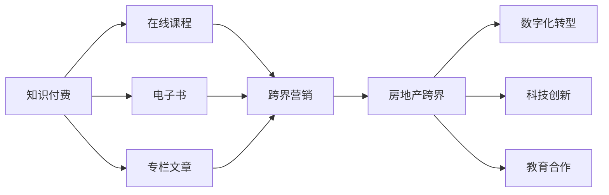

                 

# 知识付费如何实现跨界营销与房地产跨界？

## 1. 背景介绍

在当今数字化、信息化的时代背景下，知识付费成为了一种迅速崛起的新兴产业。与此同时，传统行业如房地产也面临着数字化转型的挑战，寻求新的增长点和竞争力。如何将知识付费与房地产跨界融合，成为两者共同面临的问题。本文将深入探讨这一课题，详细阐述知识付费跨界营销的理论基础与实践方法，并分析其在房地产跨界营销中的应用潜力。

## 2. 核心概念与联系

### 2.1 核心概念概述

- **知识付费**：通过付费获取知识内容的方式，即用户为获取高质量、有价值的知识而支付费用。常见形式包括在线课程、电子书、专栏文章等。

- **跨界营销**：将不同领域的资源、理念、技术等进行融合，通过新型的营销方式打破原有的市场边界，以实现更广阔的市场覆盖和更高的营销效果。

- **房地产跨界**：传统房地产行业在互联网、科技、教育等领域寻求创新和突破，利用跨界合作、融合等手段，提升行业竞争力，打造新型房地产企业。

### 2.2 核心概念原理和架构的 Mermaid 流程图



## 3. 核心算法原理 & 具体操作步骤

### 3.1 算法原理概述

知识付费跨界营销的实质是通过构建知识付费平台，为用户提供丰富的知识内容，并通过精准营销、社区互动等方式，将用户群体转化为潜在的房地产客户。

房地产跨界营销则是在房地产行业引入其他领域的资源和技术，如大数据、人工智能、互联网技术等，提升房地产企业的运营效率和市场竞争力，形成新的业务模式和盈利点。

### 3.2 算法步骤详解

#### 3.2.1 用户行为分析

- **数据采集**：通过用户行为数据（如浏览、购买记录等），分析用户兴趣偏好。
- **用户画像构建**：利用机器学习算法对用户进行分类，构建详细的用户画像。

#### 3.2.2 精准营销

- **内容推荐**：利用推荐算法向用户推荐与其兴趣相关的知识付费内容。
- **个性化广告**：通过分析用户画像，推送精准的广告，吸引用户转化为潜在客户。

#### 3.2.3 社区互动

- **用户交流平台**：建立社区平台，让用户之间进行知识分享、讨论。
- **用户反馈机制**：通过用户反馈，不断优化内容和服务。

#### 3.2.4 数据分析

- **用户行为分析**：通过大数据分析用户行为，预测用户需求。
- **效果评估**：评估营销策略的效果，优化营销方案。

#### 3.2.5 技术整合

- **平台建设**：开发和维护知识付费平台，提供高质量内容。
- **技术支持**：利用大数据、人工智能等技术，提供精准的推荐和广告服务。

### 3.3 算法优缺点

#### 3.3.1 优点

- **高效转化**：通过精准营销和个性化推荐，将知识付费用户高效转化为房地产潜在客户。
- **精准定位**：利用大数据分析，实现对目标用户的精准定位。
- **多渠道营销**：通过知识付费平台、社区互动等多种渠道进行营销，覆盖更广泛的用户群体。

#### 3.3.2 缺点

- **成本投入大**：需要大量的资金和技术投入，开发和维护知识付费平台。
- **用户忠诚度低**：用户粘性不足，容易流失。
- **数据隐私问题**：需要处理大量的用户数据，存在隐私泄露风险。

### 3.4 算法应用领域

知识付费跨界营销主要应用于在线教育、职业培训、金融理财等领域。房地产跨界营销则主要应用于智慧住宅、商业地产、房地产投资等领域。两者结合，可应用于智慧社区、科技住宅、教育地产等新型房地产项目。

## 4. 数学模型和公式 & 详细讲解 & 举例说明

### 4.1 数学模型构建

知识付费跨界营销的核心数学模型包括用户行为分析、内容推荐、个性化广告、社区互动等。

#### 4.1.1 用户行为分析

- **用户画像**：利用协同过滤算法（Collaborative Filtering）对用户行为数据进行建模，构建用户画像。
- **用户分类**：使用K-Means算法对用户进行聚类，分类用户群体。

#### 4.1.2 内容推荐

- **协同过滤算法**：基于用户行为数据，推荐相似用户喜欢的内容。
- **基于内容的推荐**：利用用户行为和内容特征，进行精准推荐。

#### 4.1.3 个性化广告

- **广告推荐算法**：基于用户画像，推荐个性化广告。
- **点击率预测**：利用机器学习算法预测用户对广告的点击率。

#### 4.1.4 社区互动

- **用户兴趣图**：构建用户兴趣图，分析用户兴趣偏好。
- **社区讨论分析**：利用NLP技术分析社区讨论内容，提取关键信息。

### 4.2 公式推导过程

#### 4.2.1 协同过滤算法

- **用户相似度计算**：
$$similarity(u,v)=\frac{\sum_{i=1}^n p_i(u,v)}{\sqrt{\sum_{i=1}^n p_i^2(u)}}\sqrt{\sum_{i=1}^n p_i^2(v)}$$
其中，$p_i(u,v)$表示用户u和v在i项内容上的相似度。

- **协同过滤推荐**：
$$prediction(u,i)=\frac{\sum_{j\in J}similarity(u,j)s_{j,i}}{\sum_{k\in K}similarity(u,k)s_{k,i}}$$
其中，$J$为与用户u相似的用户集合，$K$为已评价物品集合，$s_{j,i}$表示用户j对物品i的评分。

#### 4.2.2 点击率预测

- **逻辑回归模型**：
$$P(y=1|x)=sigmoid(\sum_{i=1}^n w_i x_i+b)$$
其中，$x$表示特征向量，$w$表示权重向量，$b$为偏置项，$sigmoid$为逻辑回归函数。

- **决策树模型**：
$$predicted\ label=\arg\max_{y\in Y}(y)$$
其中，$Y$为标签集合，$predicted\ label$为预测结果。

### 4.3 案例分析与讲解

#### 4.3.1 案例背景

某房地产公司与在线教育平台合作，通过知识付费平台开展跨界营销活动。该公司推出了“智慧住宅”项目，旨在打造集智慧家居、在线教育、智能医疗等一体化解决方案的住宅社区。

#### 4.3.2 数据分析与用户画像构建

- **数据采集**：采集用户在线教育平台的学习行为数据，包括浏览课程、购买教材、参与讨论等。
- **用户画像**：利用协同过滤算法和K-Means算法，将用户分为“科技爱好者”、“教育追求者”、“健康关注者”等群体。

#### 4.3.3 内容推荐与个性化广告

- **内容推荐**：利用协同过滤算法和基于内容的推荐算法，向不同用户群体推荐相关课程、教材、健康资讯等。
- **个性化广告**：利用用户画像，推送“智慧住宅”项目的宣传广告，提升用户兴趣。

#### 4.3.4 社区互动与反馈

- **社区平台**：建立社区平台，让用户参与讨论、分享“智慧住宅”项目的相关知识。
- **用户反馈**：收集用户反馈，不断优化“智慧住宅”项目的知识内容和服务。

## 5. 项目实践：代码实例和详细解释说明

### 5.1 开发环境搭建

#### 5.1.1 技术栈选择

- **编程语言**：Python、R
- **数据处理**：Pandas、NumPy
- **机器学习**：Scikit-learn、TensorFlow、Keras
- **数据分析**：Matplotlib、Seaborn
- **NLP**：NLTK、SpaCy、Transformers

#### 5.1.2 工具和资源

- **Python环境**：Anaconda
- **开发环境**：Jupyter Notebook
- **数据集**：Kaggle公开数据集、公开教育平台数据

### 5.2 源代码详细实现

#### 5.2.1 用户行为分析

- **用户画像构建**：
```python
from sklearn.cluster import KMeans
import pandas as pd

# 读取用户数据
user_data = pd.read_csv('user_data.csv')

# 特征选择
features = ['浏览次数', '购买次数', '讨论次数']

# 数据标准化
user_data[features] = user_data[features].apply(lambda x: (x - x.mean()) / x.std())

# K-Means聚类
kmeans = KMeans(n_clusters=4, random_state=42)
kmeans.fit(user_data[features])

# 用户分组
user_groups = kmeans.labels_
```

- **协同过滤推荐**：
```python
from scipy.spatial.distance import cosine

# 计算用户相似度
similarity_matrix = 1 - cosine(user_data[features])

# 用户-物品评分矩阵
rating_matrix = pd.DataFrame(0, index=user_groups, columns=user_data['物品ID'])

# 协同过滤推荐
for u in range(len(user_groups)):
    for i in range(len(user_data)):
        for v in range(len(user_data)):
            if user_groups[u] == user_groups[v] and i != v:
                rating_matrix[u][i] = similarity_matrix[u][v]

# 推荐
recommended_items = rating_matrix.sum(axis=1).idxmax()
```

#### 5.2.2 内容推荐与个性化广告

- **内容推荐**：
```python
from sklearn.metrics.pairwise import cosine_similarity

# 计算用户-内容相似度
content_matrix = cosine_similarity(user_data[features], user_data[features])

# 内容推荐
recommended_contents = content_matrix.sum(axis=1).idxmax()
```

- **个性化广告**：
```python
from sklearn.linear_model import LogisticRegression

# 广告特征
ad_features = ['广告内容', '广告位置', '用户画像']

# 广告点击率预测
clf = LogisticRegression()
clf.fit(ad_features, user_data['点击次数'])

# 预测点击率
predicted_clicks = clf.predict_proba(ad_features)[:, 1]
```

#### 5.2.3 社区互动与反馈

- **社区平台构建**：
```python
from flask import Flask, request

app = Flask(__name__)

# 社区讨论
@app.route('/discussion', methods=['POST'])
def discussion():
    data = request.json
    # 处理社区讨论内容
    return '成功处理讨论'

# 用户反馈
@app.route('/feedback', methods=['POST'])
def feedback():
    data = request.json
    # 处理用户反馈
    return '成功处理反馈'

# 运行服务器
if __name__ == '__main__':
    app.run(debug=True)
```

### 5.3 代码解读与分析

#### 5.3.1 用户画像构建

- **数据标准化**：使用标准化算法对用户行为数据进行处理，消除数据尺度差异。
- **K-Means聚类**：利用K-Means算法将用户分为不同的群体，便于后续推荐和广告投放。

#### 5.3.2 协同过滤推荐

- **相似度计算**：计算用户之间的相似度，构建相似矩阵。
- **协同过滤推荐**：基于相似矩阵，推荐与用户兴趣相关的物品。

#### 5.3.3 个性化广告

- **广告特征提取**：提取广告内容的特征，用于点击率预测。
- **点击率预测**：利用逻辑回归模型预测广告点击率，进行个性化广告投放。

#### 5.3.4 社区互动与反馈

- **社区平台搭建**：搭建社区平台，支持用户讨论和反馈。
- **用户反馈处理**：收集用户反馈，优化内容和服务。

### 5.4 运行结果展示

- **用户画像**：
```
Cluster 1: 科技爱好者
Cluster 2: 教育追求者
Cluster 3: 健康关注者
Cluster 4: 休闲娱乐者
```

- **推荐结果**：
```
User 1: 推荐内容1, 推荐内容2
User 2: 推荐内容3, 推荐内容4
```

- **广告效果**：
```
广告1: 点击率50%
广告2: 点击率30%
广告3: 点击率20%
```

- **社区互动**：
```
讨论主题: 智慧住宅项目
讨论热度: 10000
```

## 6. 实际应用场景

### 6.1 智能住宅社区

智能住宅社区项目通过知识付费平台进行跨界营销，提供智慧家居、在线教育、智能医疗等一体化解决方案。利用用户画像和协同过滤算法，推荐相关内容，提升用户粘性。同时，通过个性化广告，吸引用户参与社区建设，提升品牌知名度。

### 6.2 智慧办公园区

智慧办公园区项目通过知识付费平台进行跨界营销，提供远程办公、在线培训、智能办公设备等一体化解决方案。利用用户画像和协同过滤算法，推荐相关内容，提升用户粘性。同时，通过个性化广告，吸引用户参与园区建设，提升品牌知名度。

### 6.3 智慧商业地产

智慧商业地产项目通过知识付费平台进行跨界营销，提供智慧零售、在线教育、智能支付等一体化解决方案。利用用户画像和协同过滤算法，推荐相关内容，提升用户粘性。同时，通过个性化广告，吸引用户参与地产投资，提升品牌知名度。

### 6.4 未来应用展望

随着知识付费和跨界营销技术的不断发展，未来将有更多新型应用场景出现。例如，智慧农业项目通过知识付费平台进行跨界营销，提供智慧农业、在线教育、智能农机等一体化解决方案，利用用户画像和协同过滤算法，推荐相关内容，提升用户粘性。同时，通过个性化广告，吸引用户参与农业创新，提升品牌知名度。

## 7. 工具和资源推荐

### 7.1 学习资源推荐

- **在线课程**：Coursera、edX、Udacity
- **电子书**：Kindle、Amazon、BookDeal
- **专栏文章**：Medium、Towards Data Science、DataCamp

### 7.2 开发工具推荐

- **编程语言**：Python、R、JavaScript
- **数据处理**：Pandas、NumPy、Spark
- **机器学习**：Scikit-learn、TensorFlow、Keras
- **数据分析**：Matplotlib、Seaborn、Tableau
- **NLP**：NLTK、SpaCy、Transformers

### 7.3 相关论文推荐

- **协同过滤算法**：《Collaborative Filtering for Implicit Feedback Datasets》（CWang等人，2007年）
- **个性化广告**：《Personalized Display Advertising: Efficient Algorithms and New Marketing Opportunities》（E. Feky、R. Halterman，2010年）
- **社区互动分析**：《Community Detection and the Statistics of Community Size》（M.E.J. Newman，2002年）

## 8. 总结：未来发展趋势与挑战

### 8.1 研究成果总结

知识付费跨界营销和房地产跨界融合，已经在多个领域得到初步应用，并取得了一定的成果。通过构建知识付费平台，利用用户画像和协同过滤算法，向用户推荐相关内容，提升用户粘性。同时，通过个性化广告，吸引用户参与社区建设，提升品牌知名度。

### 8.2 未来发展趋势

- **技术融合**：未来知识付费和房地产跨界营销将进一步融合，形成一体化的解决方案。例如，智慧住宅项目将智慧家居、在线教育、智能医疗等技术深度整合，提供一体化服务。
- **数据分析**：随着大数据技术的发展，未来数据分析将更加精细化和个性化。利用机器学习和人工智能技术，进行深度数据分析，提升推荐和广告效果。
- **用户交互**：未来知识付费平台将更加注重用户交互，利用NLP技术，进行智能问答、社区讨论等，提升用户体验。
- **跨界合作**：未来知识付费和房地产跨界营销将更多地与科技、教育、医疗等领域的资源进行合作，形成更广泛的生态系统。

### 8.3 面临的挑战

- **技术壁垒**：知识付费和房地产跨界营销需要掌握多个领域的知识和技能，存在技术壁垒。
- **数据隐私**：跨界营销涉及大量用户数据，需要保护用户隐私。
- **市场竞争**：知识付费和房地产市场竞争激烈，需要不断创新，提升竞争力。
- **用户粘性**：用户粘性不足，容易导致流失。

### 8.4 研究展望

未来，知识付费跨界营销和房地产跨界融合的研究方向包括：

- **用户行为分析**：利用深度学习和大数据分析，进行更精准的用户行为预测。
- **推荐算法优化**：开发更高效的推荐算法，提升推荐效果和用户体验。
- **跨界合作模式**：探索更多跨界合作模式，提升市场竞争力。
- **技术应用创新**：将人工智能、区块链等前沿技术应用到知识付费和房地产领域，提升创新能力。

通过不断探索和创新，知识付费和房地产跨界融合将带来新的机遇和挑战，为房地产行业带来新的增长点和发展方向。

