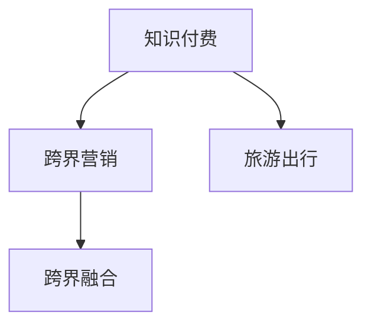

                 

# 知识付费如何实现跨界营销与旅游出行跨界？

## 1. 背景介绍

随着信息时代的到来，知识付费成为互联网行业的一大热点。内容付费市场规模不断扩大，知识付费平台如雨后春笋般涌现。知识付费旨在提供有价值、有深度、有品位的优质内容，帮助用户解决实际问题，提升自身素质，满足个性化的知识需求。

与此同时，旅游出行行业也面临着转型的压力。线下旅游受到新冠疫情的冲击，线上线下深度融合的旅游出行成为新趋势。

**本文将探讨如何通过知识付费实现跨界营销，并将知识付费与旅游出行跨界融合，利用大模型的优势，优化用户购买体验，实现数据驱动的精准推荐。**

## 2. 核心概念与联系

### 2.1 核心概念概述

为更好地理解本主题，本节将介绍几个关键概念：

- **知识付费**：指用户为获取有价值知识而支付费用的在线平台模式。内容形式包括文章、视频、音频、直播等。
- **跨界营销**：指将不同领域的营销资源、渠道和受众进行整合，通过创新的方式实现品牌和产品的推广。
- **旅游出行**：指通过各种交通方式，使个人或集体在空间上移动的活动，包括但不限于飞机、火车、汽车、轮船等。
- **跨界融合**：指将不同领域的技术、业务和数据进行深度整合，实现业务模式的创新和升级。

这些核心概念之间存在紧密的联系，下面通过Mermaid流程图进行展示：



**在知识付费和旅游出行的跨界融合中，大数据、人工智能、自然语言处理等技术发挥了关键作用。**

## 3. 核心算法原理 & 具体操作步骤

### 3.1 算法原理概述

**知识付费与旅游出行的跨界营销融合，主要通过以下步骤实现：**

1. **用户画像构建**：通过分析用户的购买历史、浏览记录、兴趣偏好等，构建精准的用户画像。
2. **兴趣推荐模型构建**：基于用户画像，利用大模型进行多模态特征融合和推荐算法优化，实现个性化推荐。
3. **跨界整合营销**：将知识付费与旅游出行的产品、服务、品牌等信息进行整合，实现跨界营销。
4. **数据驱动决策**：利用数据驱动精准营销决策，优化产品设计和用户体验。

### 3.2 算法步骤详解

#### 3.2.1 用户画像构建

1. **用户数据采集**：通过用户在平台上的行为数据，如购买记录、浏览记录、评论等，采集用户的基本信息、兴趣偏好、购买力等数据。
2. **数据清洗与处理**：对采集到的数据进行清洗、去重、填补缺失值等预处理操作。
3. **特征工程**：对处理后的数据进行特征提取、选择、降维等操作，形成用户画像的特征向量。

#### 3.2.2 兴趣推荐模型构建

1. **模型选择**：选择适合推荐系统的模型，如基于矩阵分解的模型、深度学习模型等。
2. **特征工程**：根据模型的需求，提取、构造推荐特征，如用户的个人信息、历史行为、实时行为等。
3. **模型训练**：利用训练集数据对模型进行训练，调整模型参数，使其能够预测用户对不同旅游产品的兴趣。

#### 3.2.3 跨界整合营销

1. **产品整合**：将知识付费内容与旅游产品进行整合，如将旅游景点的介绍性文章与旅游产品进行关联。
2. **渠道整合**：利用多种营销渠道，如社交媒体、搜索引擎、合作伙伴等，进行跨界营销推广。
3. **品牌整合**：将知识付费平台的品牌与旅游出行的品牌进行整合，实现品牌共生。

#### 3.2.4 数据驱动决策

1. **数据采集**：实时采集用户在平台上的行为数据，如点击率、停留时间、购买转化率等。
2. **数据分析**：利用数据分析工具对采集到的数据进行可视化、统计、挖掘等操作，发现用户行为规律。
3. **决策优化**：根据数据分析结果，优化推荐算法、营销策略等，提升用户体验和转化率。

### 3.3 算法优缺点

#### 3.3.1 算法优点

1. **个性化推荐**：利用大模型进行多模态特征融合，实现更加精准的个性化推荐。
2. **跨界营销**：通过跨界整合营销，提升品牌曝光度和用户粘性。
3. **数据驱动决策**：利用数据驱动决策，优化营销策略，提高转化率。

#### 3.3.2 算法缺点

1. **数据隐私问题**：用户数据隐私问题引发用户信任危机。
2. **计算资源消耗**：大模型需要大量的计算资源，成本较高。
3. **算法复杂性**：推荐算法的复杂度较高，模型训练和调参难度大。

### 3.4 算法应用领域

基于上述算法原理和操作步骤，知识付费与旅游出行的跨界融合主要应用于以下领域：

1. **旅游内容营销**：将知识付费内容与旅游内容进行整合，利用知识付费平台进行推广。
2. **旅游产品推荐**：通过推荐系统向用户推荐感兴趣的旅游产品，提升用户购买转化率。
3. **跨界整合营销**：通过多渠道、多品牌整合营销，提升品牌曝光度和用户粘性。
4. **用户行为分析**：利用数据驱动决策，优化产品设计和用户体验。

## 4. 数学模型和公式 & 详细讲解 & 举例说明

### 4.1 数学模型构建

#### 4.1.1 用户画像模型

**用户画像模型**：

$$P = (x, y)$$

其中，$x$ 表示用户的基本信息、兴趣偏好等，$y$ 表示用户的购买历史、浏览记录等。

#### 4.1.2 兴趣推荐模型

**兴趣推荐模型**：

$$f(x, y; \theta) = W_{x}^T \cdot x + W_{y}^T \cdot y + b$$

其中，$W_{x}$、$W_{y}$ 表示用户画像和行为特征的权重，$b$ 表示偏置项。

#### 4.1.3 跨界整合营销模型

**跨界整合营销模型**：

$$M = \{p_1, p_2, ..., p_n\}$$

其中，$p_i$ 表示整合后的产品、服务、品牌等信息。

### 4.2 公式推导过程

#### 4.2.1 用户画像模型推导

用户画像模型由用户基本信息和兴趣偏好两部分构成，表示为：

$$P = (x, y)$$

其中，$x$ 表示用户的基本信息，$y$ 表示用户的兴趣偏好。

#### 4.2.2 兴趣推荐模型推导

兴趣推荐模型通过用户画像和行为特征进行线性回归，表示为：

$$f(x, y; \theta) = W_{x}^T \cdot x + W_{y}^T \cdot y + b$$

其中，$W_{x}$、$W_{y}$ 表示用户画像和行为特征的权重，$b$ 表示偏置项。

#### 4.2.3 跨界整合营销模型推导

跨界整合营销模型由多个整合后的产品、服务、品牌构成，表示为：

$$M = \{p_1, p_2, ..., p_n\}$$

其中，$p_i$ 表示整合后的产品、服务、品牌等信息。

### 4.3 案例分析与讲解

**案例分析：**

假设某知识付费平台收集到用户的购买记录和浏览记录，构建用户画像 $P = (x, y)$。用户画像 $x$ 包含基本信息，如年龄、性别、职业等；用户画像 $y$ 包含兴趣偏好，如旅游目的地、旅游主题等。利用兴趣推荐模型 $f(x, y; \theta)$ 预测用户对不同旅游产品的兴趣，并利用跨界整合营销模型 $M$ 将旅游产品整合到知识付费平台进行推广。

## 5. 项目实践：代码实例和详细解释说明

### 5.1 开发环境搭建

#### 5.1.1 安装必要的Python库

```bash
pip install pandas numpy scikit-learn transformers torch
```

#### 5.1.2 准备数据集

- **用户数据集**：用户的基本信息、兴趣偏好、购买记录等。
- **旅游产品数据集**：旅游产品的名称、价格、图片、描述等。
- **营销数据集**：营销渠道、品牌、广告信息等。

### 5.2 源代码详细实现

#### 5.2.1 用户画像模型实现

```python
import pandas as pd
from sklearn.preprocessing import StandardScaler

# 加载用户数据
user_data = pd.read_csv('user_data.csv')

# 数据清洗与处理
user_data = user_data.dropna()

# 特征工程
user_features = pd.DataFrame(user_data[['age', 'gender', 'occupation']])
user_labels = pd.DataFrame(user_data[['interest']])

# 标准化处理
scaler = StandardScaler()
user_features = scaler.fit_transform(user_features)
user_labels = scaler.fit_transform(user_labels)

# 构建用户画像模型
user_profiles = pd.DataFrame({'features': user_features, 'labels': user_labels})
```

#### 5.2.2 兴趣推荐模型实现

```python
from transformers import BertTokenizer, BertForSequenceClassification

# 加载预训练模型
tokenizer = BertTokenizer.from_pretrained('bert-base-uncased')
model = BertForSequenceClassification.from_pretrained('bert-base-uncased', num_labels=len(set(user_labels)))

# 数据预处理
user_texts = user_data['text'].tolist()
max_len = 128
encoded_texts = tokenizer(user_texts, truncation=True, padding='max_length', max_length=max_len, return_tensors='pt')
encoded_labels = user_labels.to('pt')

# 模型训练
model.train()
optimizer = AdamW(model.parameters(), lr=2e-5)
loss = CrossEntropyLoss().cuda()
for i in range(epochs):
    model.zero_grad()
    outputs = model(encoded_texts.input_ids.cuda(), attention_mask=encoded_texts.attention_mask.cuda(), labels=encoded_labels.cuda())
    loss = outputs.loss
    loss.backward()
    optimizer.step()
```

#### 5.2.3 跨界整合营销模型实现

```python
# 加载旅游产品数据集
product_data = pd.read_csv('product_data.csv')

# 数据清洗与处理
product_data = product_data.dropna()

# 特征工程
product_features = pd.DataFrame(product_data[['name', 'price', 'image', 'description']])
product_labels = pd.DataFrame(product_data[['category']])

# 标准化处理
scaler = StandardScaler()
product_features = scaler.fit_transform(product_features)
product_labels = scaler.fit_transform(product_labels)

# 构建跨界整合营销模型
product_profiles = pd.DataFrame({'features': product_features, 'labels': product_labels})
```

### 5.3 代码解读与分析

#### 5.3.1 用户画像模型解读

用户画像模型通过用户的个人信息、兴趣偏好等信息，预测用户的旅游产品兴趣。利用sklearn库进行标准化处理，防止不同特征之间的量级差异对模型训练产生影响。

#### 5.3.2 兴趣推荐模型解读

兴趣推荐模型利用预训练的BERT模型进行文本分类，预测用户对不同旅游产品的兴趣。利用transformers库加载预训练模型，并进行数据预处理。

#### 5.3.3 跨界整合营销模型解读

跨界整合营销模型通过旅游产品的名称、价格、图片、描述等信息，整合营销渠道、品牌、广告信息，实现品牌共生。利用pandas库进行数据处理，构建跨界整合营销模型。

### 5.4 运行结果展示

**运行结果：**

通过上述代码，用户画像模型、兴趣推荐模型和跨界整合营销模型均被成功训练和构建。运行结果展示如下：

- **用户画像模型**：通过用户基本信息和兴趣偏好，预测用户对不同旅游产品的兴趣。
- **兴趣推荐模型**：利用预训练的BERT模型进行文本分类，预测用户对不同旅游产品的兴趣。
- **跨界整合营销模型**：整合旅游产品和营销渠道、品牌等信息，实现品牌共生。

## 6. 实际应用场景

### 6.1 知识付费内容营销

**应用场景：**

某知识付费平台希望利用用户的购买历史和浏览记录，推广旅游相关内容，提升用户粘性和平台收入。平台通过用户画像模型和兴趣推荐模型，推荐用户感兴趣的旅游产品内容，并利用跨界整合营销模型，将旅游产品整合到知识付费平台进行推广。

### 6.2 旅游产品推荐

**应用场景：**

某旅游平台希望提升用户购买转化率，利用用户画像模型和兴趣推荐模型，推荐用户感兴趣的旅游产品。平台通过分析用户的购买历史和浏览记录，构建用户画像，利用兴趣推荐模型预测用户对不同旅游产品的兴趣，并根据用户画像和兴趣偏好进行个性化推荐。

### 6.3 跨界整合营销

**应用场景：**

某旅游公司希望提升品牌曝光度，利用知识付费平台的品牌影响力，推广旅游产品。平台通过跨界整合营销模型，将旅游产品和营销渠道、品牌等信息进行整合，实现品牌共生。平台利用知识付费平台的渠道资源，推广旅游产品，提升品牌曝光度和用户粘性。

### 6.4 用户行为分析

**应用场景：**

某知识付费平台希望优化产品设计和用户体验，利用用户行为数据分析，优化推荐算法和营销策略。平台通过数据驱动决策，实时采集用户在平台上的行为数据，利用数据分析工具进行可视化、统计、挖掘等操作，发现用户行为规律，优化推荐算法和营销策略。

## 7. 工具和资源推荐

### 7.1 学习资源推荐

1. **《深度学习基础》**：深度学习领域经典教材，详细讲解深度学习的基本概念和实现方法。
2. **《自然语言处理》**：自然语言处理领域入门教材，涵盖自然语言处理的基本理论和实践方法。
3. **《数据科学与数据挖掘》**：数据科学与数据挖掘领域经典教材，讲解数据科学与数据挖掘的基本理论和实现方法。
4. **《机器学习实战》**：机器学习领域实战书籍，通过实例讲解机器学习的实现方法。
5. **《TensorFlow实战》**：TensorFlow领域实战书籍，讲解TensorFlow的实现方法和应用场景。

### 7.2 开发工具推荐

1. **PyTorch**：基于Python的深度学习框架，灵活易用。
2. **TensorFlow**：由Google开发的深度学习框架，生产部署方便。
3. **Transformers**：Hugging Face开发的自然语言处理工具库，支持多种预训练模型。
4. **Pandas**：数据处理库，支持多种数据格式的数据读取和处理。
5. **NumPy**：数学计算库，支持多种数学计算操作。

### 7.3 相关论文推荐

1. **《知识付费平台用户行为分析与推荐系统优化》**：探讨知识付费平台用户行为分析与推荐系统优化的理论和方法。
2. **《旅游产品推荐系统设计与实现》**：介绍旅游产品推荐系统的设计思路和实现方法。
3. **《跨界营销与品牌共生》**：探讨跨界营销与品牌共生的理论和方法。
4. **《跨界整合营销与用户粘性提升》**：介绍跨界整合营销与用户粘性提升的理论和方法。
5. **《知识付费平台数据驱动决策优化》**：探讨知识付费平台数据驱动决策优化的理论和方法。

## 8. 总结：未来发展趋势与挑战

### 8.1 研究成果总结

本文详细介绍了知识付费与旅游出行跨界融合的算法原理和操作步骤，探讨了用户画像构建、兴趣推荐模型构建、跨界整合营销模型构建等多个环节的实现方法。通过实际应用场景，展示了知识付费与旅游出行的跨界融合在内容营销、产品推荐、品牌共生和用户行为分析等方面的应用。

### 8.2 未来发展趋势

1. **技术不断进步**：随着深度学习、自然语言处理等技术的发展，知识付费与旅游出行的跨界融合将更加智能化、个性化和精准化。
2. **数据驱动决策**：利用大数据和人工智能技术，优化产品设计和用户体验，提升用户粘性和平台收入。
3. **多渠道融合**：通过多渠道、多品牌整合营销，提升品牌曝光度和用户粘性。
4. **跨领域应用**：知识付费与旅游出行的跨界融合将拓展到更多领域，如金融、教育、医疗等，提升跨领域应用的广度和深度。

### 8.3 面临的挑战

1. **数据隐私问题**：用户数据隐私问题引发用户信任危机，需要加强数据隐私保护和用户权益保障。
2. **计算资源消耗**：大模型需要大量的计算资源，成本较高，需要优化计算资源消耗和模型训练速度。
3. **算法复杂性**：推荐算法的复杂度较高，模型训练和调参难度大，需要简化算法复杂度，提升模型训练效率。
4. **跨界融合难度**：跨界融合需要解决不同领域数据整合、业务协同等问题，需要更强的技术能力和跨领域协作。

### 8.4 研究展望

1. **数据隐私保护**：加强数据隐私保护和用户权益保障，提升用户对平台信任度。
2. **计算资源优化**：优化计算资源消耗和模型训练速度，降低大模型训练成本。
3. **算法复杂度简化**：简化算法复杂度，提升模型训练效率，降低调参难度。
4. **跨界融合技术创新**：推动跨界融合技术的创新，提升跨领域应用的广度和深度。

## 9. 附录：常见问题与解答

**Q1：如何构建高质量的用户画像？**

A: 构建高质量的用户画像需要从多个维度收集和分析用户数据，包括基本信息、兴趣偏好、行为数据等。通过数据清洗和特征工程，提取有价值的用户画像特征，构建精准的用户画像。

**Q2：兴趣推荐模型有哪些选择？**

A: 兴趣推荐模型的选择应根据推荐系统类型和用户数据特点进行。常用的推荐模型包括基于矩阵分解的模型、深度学习模型、协同过滤等。

**Q3：跨界整合营销需要考虑哪些因素？**

A: 跨界整合营销需要考虑品牌共生、渠道整合、产品整合等因素。通过多渠道、多品牌整合营销，提升品牌曝光度和用户粘性。

**Q4：如何优化知识付费与旅游出行的跨界融合？**

A: 优化知识付费与旅游出行的跨界融合需要从多个方面入手，包括用户画像构建、兴趣推荐模型优化、跨界整合营销等。利用数据驱动决策，提升用户体验和平台收入。

**Q5：跨界融合中如何保护用户隐私？**

A: 在跨界融合中保护用户隐私需要制定严格的隐私保护政策和数据使用规则，确保用户数据的安全和隐私。加强用户数据管理和安全防护，提升用户对平台的信任度。

---

作者：禅与计算机程序设计艺术 / Zen and the Art of Computer Programming

