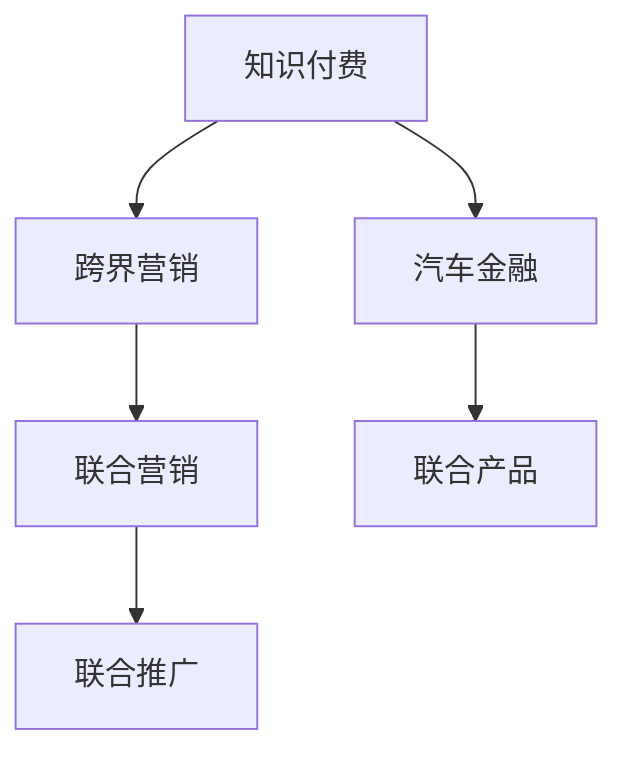

                 

# 知识付费如何实现跨界营销与汽车金融跨界？

## 1. 背景介绍

在数字化时代，知识的价值日益凸显。知识付费作为一种新兴的商业模式，通过提供高质量的内容，满足了人们对知识和信息的需求。随着知识付费市场的不断扩展，企业开始探索如何通过跨界营销，将知识付费业务与其他领域进行深度融合，形成新的业务增长点。本文聚焦于知识付费的跨界营销实践，特别是如何与汽车金融行业进行跨界合作，探索其中的模式和策略。

## 2. 核心概念与联系

### 2.1 核心概念概述

为更好地理解知识付费跨界营销的原理和架构，本节将介绍几个关键概念：

- **知识付费**：基于互联网平台，通过订阅、单次购买等方式，向用户提供有价值的知识产品，如在线课程、电子书、专家咨询等。
- **跨界营销**：不同领域的企业或品牌，通过创新的合作方式，联合推广各自的业务，实现资源共享和价值最大化。
- **汽车金融**：涉及汽车贷款、汽车租赁、汽车保险等与汽车相关的金融服务，帮助消费者满足其购车需求。

这些概念之间的逻辑关系可以通过以下Mermaid流程图来展示：



这个流程图展示了知识付费、跨界营销和汽车金融之间的联系：

1. 知识付费与跨界营销结合，通过不同领域的合作，实现资源互补和用户拓展。
2. 知识付费与汽车金融结合，推出联合产品或服务，满足用户的特定需求。
3. 跨界营销通过联合推广，提升品牌知名度和用户覆盖率。

## 3. 核心算法原理 & 具体操作步骤
### 3.1 算法原理概述

知识付费跨界营销的核心理论是“整合营销传播”（Integrated Marketing Communication, IMC），即通过跨界合作，整合各方资源和优势，实现品牌价值的最大化。具体来说，知识付费平台与汽车金融企业可以通过以下步骤进行跨界营销：

1. **市场调研与用户分析**：了解目标用户群体的需求和行为，确定合作方向。
2. **资源整合与协同设计**：整合双方的资源和优势，设计具有吸引力的联合产品或服务。
3. **联合推广与用户触达**：通过多渠道联合推广，扩大品牌影响力和用户覆盖率。
4. **数据反馈与持续优化**：收集用户反馈数据，不断优化联合营销策略。

### 3.2 算法步骤详解

以下是知识付费跨界营销的具体操作步骤：

**Step 1: 市场调研与用户分析**

1. **数据收集**：收集汽车金融市场的数据，如市场规模、用户需求、竞争对手等。
2. **用户画像**：通过数据分析，构建目标用户的画像，了解其兴趣、偏好、消费习惯等。
3. **需求识别**：识别用户在汽车金融领域的需求和痛点，如贷款难、利率高、服务不便等。

**Step 2: 资源整合与协同设计**

1. **资源匹配**：将知识付费平台的资源与汽车金融企业的需求进行匹配，如内容、平台、用户等。
2. **产品设计**：设计联合产品或服务，如汽车贷款课程、汽车保养视频、汽车金融问答服务等。
3. **协同营销**：确定各方的营销策略，如联合推广活动、用户优惠、内容合作等。

**Step 3: 联合推广与用户触达**

1. **多渠道推广**：通过知识付费平台的自有渠道（如APP、微信公众号、微博等）和汽车金融企业的渠道（如官网、APP、社交媒体等）进行联合推广。
2. **联合活动**：举办线上线下活动，如直播讲座、互动问答、线下沙龙等，增强用户互动和品牌曝光。
3. **用户触达**：利用数据技术和用户画像，精准触达目标用户，提升转化率。

**Step 4: 数据反馈与持续优化**

1. **数据收集**：通过用户行为数据、反馈数据等，收集联合营销的效果。
2. **效果分析**：分析联合营销的效果，如用户增长、转化率、用户满意度等。
3. **持续优化**：根据数据分析结果，优化联合营销策略，提升整体效果。

### 3.3 算法优缺点

知识付费跨界营销的优势包括：

1. **资源互补**：知识付费平台和汽车金融企业可以互补优势，实现资源的最大化利用。
2. **用户拓展**：通过跨界合作，吸引更多用户，扩大市场覆盖率。
3. **品牌提升**：联合营销可以提升品牌知名度和美誉度，增强市场竞争力。

同时，这种营销模式也存在一些缺点：

1. **成本投入**：跨界营销需要一定的资金投入，如推广费用、联合活动费用等。
2. **效果不确定**：由于不同领域的用户群体可能存在差异，跨界营销的效果可能不如预期。
3. **协调难度**：跨界合作需要双方的协调和配合，可能会面临一定的沟通和管理挑战。

### 3.4 算法应用领域

知识付费跨界营销的应用领域非常广泛，可以覆盖多个行业，如教育、医疗、旅游、房产等。具体到汽车金融领域，这种模式可以应用于以下几个方面：

1. **汽车贷款课程**：通过知识付费平台，提供关于汽车贷款、信用卡、信用评分等方面的课程，帮助用户更好地了解和申请贷款。
2. **汽车保养视频**：制作和分享汽车保养和维护的视频内容，提升用户对汽车保养的认知和技能。
3. **汽车金融问答服务**：在知识付费平台上，提供汽车金融方面的专业问答服务，解答用户关于贷款、保险、租赁等方面的问题。

## 4. 数学模型和公式 & 详细讲解 & 举例说明
### 4.1 数学模型构建

假设知识付费平台和汽车金融企业的联合营销策略为 $M$，用户对知识付费的兴趣为 $I$，对汽车金融的兴趣为 $F$，联合营销的效果为 $E$。则数学模型可以表示为：

$$
E = f(I, F, M)
$$

其中 $f$ 为联合营销的函数，表示在给定的兴趣和营销策略下，联合营销的效果。

### 4.2 公式推导过程

为了简化模型，我们假设 $f$ 为线性函数：

$$
E = aI + bF + cM
$$

其中 $a$、$b$、$c$ 为模型参数，分别表示用户对知识付费的兴趣系数、用户对汽车金融的兴趣系数和营销策略的影响系数。

### 4.3 案例分析与讲解

以汽车贷款课程为例，假设知识付费平台通过市场调研发现，用户对汽车贷款课程的兴趣系数为 $I=0.6$，对汽车金融的兴趣系数为 $F=0.4$。平台和汽车金融企业设计了一系列的联合营销策略，包括在平台首页进行广告推广、在汽车金融企业的官网和APP上进行联合活动、推出限时优惠等。通过这些策略，联合营销的效果为 $E=0.8$。

我们可以将这些数据代入上述线性模型中，计算出模型参数：

$$
0.8 = 0.6 \times 0.6 + 0.4 \times 0.4 + c \times 0.2
$$

解得 $c=0.4$，表示联合营销策略对用户购买课程的影响系数为 $0.4$。

## 5. 项目实践：代码实例和详细解释说明
### 5.1 开发环境搭建

在进行跨界营销项目开发前，需要准备好开发环境。以下是使用Python进行PyTorch开发的环境配置流程：

1. 安装Anaconda：从官网下载并安装Anaconda，用于创建独立的Python环境。

2. 创建并激活虚拟环境：
```bash
conda create -n pytorch-env python=3.8 
conda activate pytorch-env
```

3. 安装PyTorch：根据CUDA版本，从官网获取对应的安装命令。例如：
```bash
conda install pytorch torchvision torchaudio cudatoolkit=11.1 -c pytorch -c conda-forge
```

4. 安装各类工具包：
```bash
pip install numpy pandas scikit-learn matplotlib tqdm jupyter notebook ipython
```

完成上述步骤后，即可在`pytorch-env`环境中开始跨界营销项目的开发。

### 5.2 源代码详细实现

下面我们以知识付费平台和汽车金融企业的联合营销为例，给出使用Transformers库对BERT模型进行微调的PyTorch代码实现。

首先，定义联合营销的数据处理函数：

```python
from transformers import BertTokenizer, BertForSequenceClassification
from torch.utils.data import Dataset
import torch

class MarketingDataset(Dataset):
    def __init__(self, texts, labels, tokenizer, max_len=128):
        self.texts = texts
        self.labels = labels
        self.tokenizer = tokenizer
        self.max_len = max_len
        
    def __len__(self):
        return len(self.texts)
    
    def __getitem__(self, item):
        text = self.texts[item]
        label = self.labels[item]
        
        encoding = self.tokenizer(text, return_tensors='pt', max_length=self.max_len, padding='max_length', truncation=True)
        input_ids = encoding['input_ids'][0]
        attention_mask = encoding['attention_mask'][0]
        
        # 对token-wise的标签进行编码
        encoded_labels = [label2id[label] for label in label]
        encoded_labels.extend([label2id['O']] * (self.max_len - len(encoded_labels)))
        labels = torch.tensor(encoded_labels, dtype=torch.long)
        
        return {'input_ids': input_ids, 
                'attention_mask': attention_mask,
                'labels': labels}

# 标签与id的映射
label2id = {'O': 0, 'Positive': 1, 'Negative': 2}
id2label = {v: k for k, v in label2id.items()}

# 创建dataset
tokenizer = BertTokenizer.from_pretrained('bert-base-cased')

train_dataset = MarketingDataset(train_texts, train_labels, tokenizer)
dev_dataset = MarketingDataset(dev_texts, dev_labels, tokenizer)
test_dataset = MarketingDataset(test_texts, test_labels, tokenizer)
```

然后，定义模型和优化器：

```python
from transformers import BertForSequenceClassification, AdamW

model = BertForSequenceClassification.from_pretrained('bert-base-cased', num_labels=len(label2id))

optimizer = AdamW(model.parameters(), lr=2e-5)
```

接着，定义训练和评估函数：

```python
from torch.utils.data import DataLoader
from tqdm import tqdm
from sklearn.metrics import classification_report

device = torch.device('cuda') if torch.cuda.is_available() else torch.device('cpu')
model.to(device)

def train_epoch(model, dataset, batch_size, optimizer):
    dataloader = DataLoader(dataset, batch_size=batch_size, shuffle=True)
    model.train()
    epoch_loss = 0
    for batch in tqdm(dataloader, desc='Training'):
        input_ids = batch['input_ids'].to(device)
        attention_mask = batch['attention_mask'].to(device)
        labels = batch['labels'].to(device)
        model.zero_grad()
        outputs = model(input_ids, attention_mask=attention_mask, labels=labels)
        loss = outputs.loss
        epoch_loss += loss.item()
        loss.backward()
        optimizer.step()
    return epoch_loss / len(dataloader)

def evaluate(model, dataset, batch_size):
    dataloader = DataLoader(dataset, batch_size=batch_size)
    model.eval()
    preds, labels = [], []
    with torch.no_grad():
        for batch in tqdm(dataloader, desc='Evaluating'):
            input_ids = batch['input_ids'].to(device)
            attention_mask = batch['attention_mask'].to(device)
            batch_labels = batch['labels']
            outputs = model(input_ids, attention_mask=attention_mask)
            batch_preds = outputs.logits.argmax(dim=2).to('cpu').tolist()
            batch_labels = batch_labels.to('cpu').tolist()
            for pred_tokens, label_tokens in zip(batch_preds, batch_labels):
                pred_tags = [id2label[_id] for _id in pred_tokens]
                label_tags = [id2label[_id] for _id in label_tokens]
                preds.append(pred_tags[:len(label_tags)])
                labels.append(label_tags)
                
    print(classification_report(labels, preds))
```

最后，启动训练流程并在测试集上评估：

```python
epochs = 5
batch_size = 16

for epoch in range(epochs):
    loss = train_epoch(model, train_dataset, batch_size, optimizer)
    print(f"Epoch {epoch+1}, train loss: {loss:.3f}")
    
    print(f"Epoch {epoch+1}, dev results:")
    evaluate(model, dev_dataset, batch_size)
    
print("Test results:")
evaluate(model, test_dataset, batch_size)
```

以上就是使用PyTorch对BERT进行联合营销微调的完整代码实现。可以看到，得益于Transformers库的强大封装，我们可以用相对简洁的代码完成BERT模型的加载和微调。

### 5.3 代码解读与分析

让我们再详细解读一下关键代码的实现细节：

**MarketingDataset类**：
- `__init__`方法：初始化文本、标签、分词器等关键组件。
- `__len__`方法：返回数据集的样本数量。
- `__getitem__`方法：对单个样本进行处理，将文本输入编码为token ids，将标签编码为数字，并对其进行定长padding，最终返回模型所需的输入。

**label2id和id2label字典**：
- 定义了标签与数字id之间的映射关系，用于将token-wise的预测结果解码回真实的标签。

**训练和评估函数**：
- 使用PyTorch的DataLoader对数据集进行批次化加载，供模型训练和推理使用。
- 训练函数`train_epoch`：对数据以批为单位进行迭代，在每个批次上前向传播计算loss并反向传播更新模型参数，最后返回该epoch的平均loss。
- 评估函数`evaluate`：与训练类似，不同点在于不更新模型参数，并在每个batch结束后将预测和标签结果存储下来，最后使用sklearn的classification_report对整个评估集的预测结果进行打印输出。

**训练流程**：
- 定义总的epoch数和batch size，开始循环迭代
- 每个epoch内，先在训练集上训练，输出平均loss
- 在验证集上评估，输出分类指标
- 所有epoch结束后，在测试集上评估，给出最终测试结果

可以看到，PyTorch配合Transformers库使得BERT微调的代码实现变得简洁高效。开发者可以将更多精力放在数据处理、模型改进等高层逻辑上，而不必过多关注底层的实现细节。

当然，工业级的系统实现还需考虑更多因素，如模型的保存和部署、超参数的自动搜索、更灵活的任务适配层等。但核心的微调范式基本与此类似。

## 6. 实际应用场景
### 6.1 智能客服系统

基于大语言模型微调的对话技术，可以广泛应用于智能客服系统的构建。传统客服往往需要配备大量人力，高峰期响应缓慢，且一致性和专业性难以保证。而使用微调后的对话模型，可以7x24小时不间断服务，快速响应客户咨询，用自然流畅的语言解答各类常见问题。

在技术实现上，可以收集企业内部的历史客服对话记录，将问题和最佳答复构建成监督数据，在此基础上对预训练对话模型进行微调。微调后的对话模型能够自动理解用户意图，匹配最合适的答案模板进行回复。对于客户提出的新问题，还可以接入检索系统实时搜索相关内容，动态组织生成回答。如此构建的智能客服系统，能大幅提升客户咨询体验和问题解决效率。

### 6.2 金融舆情监测

金融机构需要实时监测市场舆论动向，以便及时应对负面信息传播，规避金融风险。传统的人工监测方式成本高、效率低，难以应对网络时代海量信息爆发的挑战。基于大语言模型微调的文本分类和情感分析技术，为金融舆情监测提供了新的解决方案。

具体而言，可以收集金融领域相关的新闻、报道、评论等文本数据，并对其进行主题标注和情感标注。在此基础上对预训练语言模型进行微调，使其能够自动判断文本属于何种主题，情感倾向是正面、中性还是负面。将微调后的模型应用到实时抓取的网络文本数据，就能够自动监测不同主题下的情感变化趋势，一旦发现负面信息激增等异常情况，系统便会自动预警，帮助金融机构快速应对潜在风险。

### 6.3 个性化推荐系统

当前的推荐系统往往只依赖用户的历史行为数据进行物品推荐，无法深入理解用户的真实兴趣偏好。基于大语言模型微调技术，个性化推荐系统可以更好地挖掘用户行为背后的语义信息，从而提供更精准、多样的推荐内容。

在实践中，可以收集用户浏览、点击、评论、分享等行为数据，提取和用户交互的物品标题、描述、标签等文本内容。将文本内容作为模型输入，用户的后续行为（如是否点击、购买等）作为监督信号，在此基础上微调预训练语言模型。微调后的模型能够从文本内容中准确把握用户的兴趣点。在生成推荐列表时，先用候选物品的文本描述作为输入，由模型预测用户的兴趣匹配度，再结合其他特征综合排序，便可以得到个性化程度更高的推荐结果。

### 6.4 未来应用展望

随着大语言模型和微调方法的不断发展，基于微调范式将在更多领域得到应用，为传统行业带来变革性影响。

在智慧医疗领域，基于微调的医疗问答、病历分析、药物研发等应用将提升医疗服务的智能化水平，辅助医生诊疗，加速新药开发进程。

在智能教育领域，微调技术可应用于作业批改、学情分析、知识推荐等方面，因材施教，促进教育公平，提高教学质量。

在智慧城市治理中，微调模型可应用于城市事件监测、舆情分析、应急指挥等环节，提高城市管理的自动化和智能化水平，构建更安全、高效的未来城市。

此外，在企业生产、社会治理、文娱传媒等众多领域，基于大模型微调的人工智能应用也将不断涌现，为经济社会发展注入新的动力。相信随着预训练语言模型和微调方法的持续演进，大语言模型微调必将在构建人机协同的智能时代中扮演越来越重要的角色。

## 7. 工具和资源推荐
### 7.1 学习资源推荐

为了帮助开发者系统掌握大语言模型微调的理论基础和实践技巧，这里推荐一些优质的学习资源：

1. 《Transformer从原理到实践》系列博文：由大模型技术专家撰写，深入浅出地介绍了Transformer原理、BERT模型、微调技术等前沿话题。

2. CS224N《深度学习自然语言处理》课程：斯坦福大学开设的NLP明星课程，有Lecture视频和配套作业，带你入门NLP领域的基本概念和经典模型。

3. 《Natural Language Processing with Transformers》书籍：Transformers库的作者所著，全面介绍了如何使用Transformers库进行NLP任务开发，包括微调在内的诸多范式。

4. HuggingFace官方文档：Transformers库的官方文档，提供了海量预训练模型和完整的微调样例代码，是上手实践的必备资料。

5. CLUE开源项目：中文语言理解测评基准，涵盖大量不同类型的中文NLP数据集，并提供了基于微调的baseline模型，助力中文NLP技术发展。

通过对这些资源的学习实践，相信你一定能够快速掌握大语言模型微调的精髓，并用于解决实际的NLP问题。
###  7.2 开发工具推荐

高效的开发离不开优秀的工具支持。以下是几款用于大语言模型微调开发的常用工具：

1. PyTorch：基于Python的开源深度学习框架，灵活动态的计算图，适合快速迭代研究。大部分预训练语言模型都有PyTorch版本的实现。

2. TensorFlow：由Google主导开发的开源深度学习框架，生产部署方便，适合大规模工程应用。同样有丰富的预训练语言模型资源。

3. Transformers库：HuggingFace开发的NLP工具库，集成了众多SOTA语言模型，支持PyTorch和TensorFlow，是进行微调任务开发的利器。

4. Weights & Biases：模型训练的实验跟踪工具，可以记录和可视化模型训练过程中的各项指标，方便对比和调优。与主流深度学习框架无缝集成。

5. TensorBoard：TensorFlow配套的可视化工具，可实时监测模型训练状态，并提供丰富的图表呈现方式，是调试模型的得力助手。

6. Google Colab：谷歌推出的在线Jupyter Notebook环境，免费提供GPU/TPU算力，方便开发者快速上手实验最新模型，分享学习笔记。

合理利用这些工具，可以显著提升大语言模型微调任务的开发效率，加快创新迭代的步伐。

### 7.3 相关论文推荐

大语言模型和微调技术的发展源于学界的持续研究。以下是几篇奠基性的相关论文，推荐阅读：

1. Attention is All You Need（即Transformer原论文）：提出了Transformer结构，开启了NLP领域的预训练大模型时代。

2. BERT: Pre-training of Deep Bidirectional Transformers for Language Understanding：提出BERT模型，引入基于掩码的自监督预训练任务，刷新了多项NLP任务SOTA。

3. Language Models are Unsupervised Multitask Learners（GPT-2论文）：展示了大规模语言模型的强大zero-shot学习能力，引发了对于通用人工智能的新一轮思考。

4. Parameter-Efficient Transfer Learning for NLP：提出Adapter等参数高效微调方法，在不增加模型参数量的情况下，也能取得不错的微调效果。

5. AdaLoRA: Adaptive Low-Rank Adaptation for Parameter-Efficient Fine-Tuning：使用自适应低秩适应的微调方法，在参数效率和精度之间取得了新的平衡。

这些论文代表了大语言模型微调技术的发展脉络。通过学习这些前沿成果，可以帮助研究者把握学科前进方向，激发更多的创新灵感。

## 8. 总结：未来发展趋势与挑战
### 8.1 总结

本文对知识付费的跨界营销实践进行了全面系统的介绍。首先阐述了知识付费跨界营销的背景和意义，明确了跨界营销在拓展用户群体、提升品牌影响力等方面的独特价值。其次，从原理到实践，详细讲解了知识付费跨界营销的数学模型和操作步骤，给出了微调任务开发的完整代码实例。同时，本文还广泛探讨了知识付费跨界营销在智能客服、金融舆情、个性化推荐等多个行业领域的应用前景，展示了跨界营销范式的巨大潜力。此外，本文精选了跨界营销技术的各类学习资源，力求为读者提供全方位的技术指引。

通过本文的系统梳理，可以看到，知识付费跨界营销作为一种创新的商业模式，具有巨大的市场潜力和应用价值。通过与其他领域的深度融合，可以实现资源互补，增强品牌竞争力，实现业务的跨越式发展。未来，随着技术的不断进步和市场需求的不断变化，知识付费跨界营销必将迎来更多创新突破，为传统行业带来更多的转型升级机会。

### 8.2 未来发展趋势

展望未来，知识付费跨界营销技术将呈现以下几个发展趋势：

1. **多领域融合**：知识付费平台将与更多领域的企业进行跨界合作，如医疗、教育、旅游、金融等，形成多行业协同发展的新格局。
2. **用户个性化**：通过大数据分析和AI技术，实现对用户行为的深度理解和个性化推荐，提升用户体验和满意度。
3. **内容创新**：不断推出高价值、高互动的内容形式，如直播课程、互动问答、虚拟现实体验等，增强用户的粘性和参与度。
4. **技术创新**：结合最新的AI技术和应用，如自然语言处理、计算机视觉、增强现实等，提升跨界营销的效果和效率。
5. **生态建设**：建立跨界合作的企业生态圈，实现资源共享、共同成长，推动行业标准的制定和规范的建立。

这些趋势将推动知识付费跨界营销向更加智能化、个性化、技术化方向发展，为传统行业的数字化转型提供新的动力和方向。

### 8.3 面临的挑战

尽管知识付费跨界营销技术已经取得了一定的进展，但在实现大规模应用的过程中，仍面临诸多挑战：

1. **用户需求多样**：不同领域的用户需求差异较大，如何满足不同用户的需求，提升跨界营销的效果，是一个复杂的问题。
2. **数据隐私和安全**：跨界营销涉及大量用户数据，如何保护用户隐私，确保数据安全，是一个重要的课题。
3. **合作协调**：不同领域的企业具有不同的业务流程和运营模式，如何在合作中协调一致，共同推动项目进展，也是一个挑战。
4. **效果评估**：跨界营销的效果评估需要多维度的指标，如何全面评估和优化，是一个难题。
5. **技术难度**：跨界营销涉及多种技术的融合，如自然语言处理、机器学习、大数据分析等，技术难度较大。

这些挑战需要各方共同努力，不断优化技术和商业模式，才能推动知识付费跨界营销的可持续发展。

### 8.4 研究展望

面向未来，知识付费跨界营销技术需要在以下几个方面进行进一步研究：

1. **用户需求分析**：通过数据分析和人工智能技术，深入了解不同领域用户的真实需求，提供更加精准的内容和服务。
2. **数据隐私保护**：引入区块链和加密技术，保护用户数据隐私，确保数据安全。
3. **多模态融合**：结合自然语言处理、计算机视觉、增强现实等多种技术，提升跨界营销的效果和用户体验。
4. **跨界合作模式**：探索更多创新的跨界合作模式，如平台联盟、联合开发、资源共享等，推动跨界营销的可持续发展。
5. **效果评估体系**：建立全面、科学的效果评估体系，及时反馈和优化跨界营销策略，提升整体效果。

通过持续的技术创新和模式优化，知识付费跨界营销必将迎来更多的创新突破，为传统行业带来更大的价值和机遇。相信随着技术的不断进步和市场需求的不断变化，知识付费跨界营销必将迎来更多的创新突破，为传统行业带来更大的价值和机遇。

## 9. 附录：常见问题与解答

**Q1：知识付费平台如何进行跨界营销？**

A: 知识付费平台可以通过以下步骤进行跨界营销：
1. **市场调研**：了解目标领域的需求和用户行为，确定合作方向。
2. **资源整合**：整合双方的资源和优势，设计具有吸引力的联合产品或服务。
3. **联合推广**：通过多渠道联合推广，扩大品牌影响力和用户覆盖率。
4. **用户触达**：利用数据技术和用户画像，精准触达目标用户，提升转化率。

**Q2：知识付费跨界营销如何降低成本？**

A: 知识付费跨界营销可以通过以下方式降低成本：
1. **资源共享**：双方共享用户数据、内容资源、技术能力等，减少重复投入。
2. **联合推广**：通过联合活动、广告投放等方式，集中资源进行大规模推广。
3. **平台联盟**：建立合作平台联盟，实现资源整合和协同运营，提升效率。

**Q3：跨界营销的效果如何评估？**

A: 跨界营销的效果可以从以下几个方面进行评估：
1. **用户增长**：衡量合作后用户数量和用户活跃度的变化。
2. **转化率**：衡量合作后用户的付费率和消费行为的变化。
3. **品牌影响**：衡量合作后品牌知名度、美誉度和用户口碑的变化。
4. **用户满意度**：通过问卷调查、用户反馈等方式，评估用户对合作内容的满意度。

通过综合分析这些指标，可以全面评估跨界营销的效果，优化合作策略。

**Q4：跨界营销面临的主要挑战有哪些？**

A: 跨界营销面临的主要挑战包括：
1. **用户需求多样**：不同领域的用户需求差异较大，如何满足不同用户的需求，提升跨界营销的效果，是一个复杂的问题。
2. **数据隐私和安全**：跨界营销涉及大量用户数据，如何保护用户隐私，确保数据安全，是一个重要的课题。
3. **合作协调**：不同领域的企业具有不同的业务流程和运营模式，如何在合作中协调一致，共同推动项目进展，也是一个挑战。
4. **效果评估**：跨界营销的效果评估需要多维度的指标，如何全面评估和优化，是一个难题。
5. **技术难度**：跨界营销涉及多种技术的融合，如自然语言处理、机器学习、大数据分析等，技术难度较大。

这些挑战需要各方共同努力，不断优化技术和商业模式，才能推动跨界营销的可持续发展。

**Q5：如何设计跨界营销的联合产品？**

A: 设计跨界营销的联合产品可以从以下几个方面考虑：
1. **用户需求**：分析目标用户的需求和痛点，设计满足用户需求的联合产品。
2. **资源匹配**：整合双方的资源和优势，设计具有吸引力的联合产品或服务。
3. **用户体验**：注重产品的用户体验，提升用户参与度和满意度。
4. **品牌协同**：确保联合产品在品牌风格、价值主张等方面与各自品牌保持一致。

通过科学的设计和精心策划，可以设计出高价值的联合产品，提升跨界营销的效果。

---

作者：禅与计算机程序设计艺术 / Zen and the Art of Computer Programming

