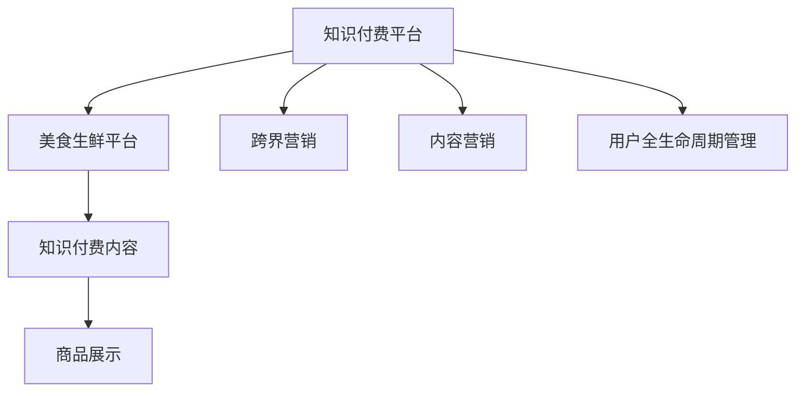

                 

# 知识付费如何实现跨界营销与美食生鲜跨界？

在数字经济蓬勃发展的今天，知识付费作为一种新兴的商业模式，不仅在教育、资讯等领域取得了巨大成功，更探索出了一条跨界营销的新路径。特别是在与美食生鲜行业的融合上，知识付费正以全新的方式，将知识与美食、生鲜等实体商品有机结合，开创了知识与消费的有机结合模式。本文将系统性地介绍知识付费跨界营销的核心概念、核心算法原理、操作步骤，并通过实际案例深入剖析该模式如何推动知识付费与美食生鲜的跨界融合。

## 1. 背景介绍

### 1.1 问题由来
随着互联网和信息技术的迅猛发展，知识付费作为一种新兴的商业模式应运而生。这种模式通过为用户提供高质量的付费内容，帮助用户解决学习、工作、生活等方面的问题，获得了广泛的市场认可。然而，知识付费传统上主要以内容付费为主，其用户群体与实体商品的消费群体存在一定差距，导致知识付费产业的营销成本较高，难以触及广泛用户。

与此同时，美食生鲜行业正处于转型升级的关键阶段，面临着传统线下渠道受限、消费需求升级等挑战。如何在降低营销成本的同时，提升品牌曝光度和用户粘性，成为传统生鲜企业亟待解决的问题。

在这样的背景下，知识付费与美食生鲜的跨界营销应运而生，双方在降低营销成本、提升用户体验、拓展业务边界等方面实现了有机结合，从而开创了知识付费产业的新局面。

### 1.2 问题核心关键点
知识付费与美食生鲜跨界营销的核心在于：
1. **低成本、高曝光**：知识付费平台可以借助其内容吸引用户关注，并将用户引导至美食生鲜平台，实现低成本、高曝光的营销效果。
2. **内容与商品结合**：通过将知识内容与实体商品结合，提升用户消费体验，促进用户购买。
3. **用户全生命周期管理**：通过持续的知识输出，增加用户粘性，实现用户全生命周期管理。

### 1.3 问题研究意义
知识付费与美食生鲜跨界营销不仅能够降低企业营销成本，提升品牌知名度和用户粘性，还能够实现用户消费行为的深度转化，推动知识付费产业的健康发展。具体而言：
1. **降低营销成本**：通过知识内容的传播，降低直接广告投放和推广的必要性，节省大量营销费用。
2. **提升品牌知名度**：知识付费平台的用户群体相对较高质量，通过内容引导至美食生鲜平台，能够显著提升品牌知名度和曝光度。
3. **增加用户粘性**：通过知识内容的持续输出，增加用户粘性，实现用户全生命周期管理。
4. **促进消费行为**：将知识内容与实体商品结合，提升用户消费体验，促进用户购买行为。

## 2. 核心概念与联系

### 2.1 核心概念概述

为更好地理解知识付费与美食生鲜跨界营销的核心概念，本节将介绍几个密切相关的核心概念：

- **知识付费平台**：以内容付费为核心的在线平台，如得到、知乎live等，主要通过提供知识内容获取用户的付费订阅。
- **美食生鲜平台**：专注于提供高品质美食生鲜产品，如盒马鲜生、叮咚买菜等，主要通过线下门店和线上平台销售产品。
- **跨界营销**：跨领域、跨行业营销，通过整合资源，实现营销效果最大化。
- **内容营销**：通过生产、分享有价值的内容，吸引和保留客户，实现品牌曝光和用户粘性。
- **用户全生命周期管理**：指对用户从获取到转化再到忠诚度提升的全流程进行管理，提升用户价值。

这些核心概念之间的逻辑关系可以通过以下Mermaid流程图来展示：



这个流程图展示了大语言模型的核心概念及其之间的关系：

1. 知识付费平台通过内容营销吸引用户，实现品牌曝光和用户粘性。
2. 用户被引导至美食生鲜平台，实现消费行为的深度转化。
3. 跨界营销整合资源，实现营销效果最大化。
4. 用户全生命周期管理提升用户价值。

这些概念共同构成了知识付费与美食生鲜跨界营销的框架，使其能够在知识内容与实体商品之间建立起有机结合，实现营销模式的创新。

## 3. 核心算法原理 & 具体操作步骤
### 3.1 算法原理概述

知识付费与美食生鲜跨界营销的核心算法原理主要体现在以下几个方面：

- **内容匹配算法**：通过用户画像和商品属性分析，实现知识内容与商品之间的精准匹配，提升用户消费体验。
- **推荐系统算法**：基于用户的浏览、购买行为和内容互动数据，实时推荐相关商品，提升用户粘性和消费转化率。
- **用户行为预测算法**：通过分析用户历史数据和实时行为，预测用户未来的购买行为，实现个性化推荐。

形式化地，假设知识付费平台有用户 $U$，美食生鲜平台有商品 $P$，内容与商品之间的匹配算法为 $match(U, P)$，推荐系统算法为 $recommend(U)$，用户行为预测算法为 $predict(U)$。知识付费与美食生鲜跨界营销的优化目标是最小化用户流失率和最大化消费转化率，即：

$$
\theta^* = \mathop{\arg\min}_{\theta} \left(\frac{1}{N}\sum_{i=1}^N U_i - \theta \cdot match(U_i, P) \right) + \mathop{\arg\min}_{\theta} \left(\frac{1}{M}\sum_{j=1}^M P_j - \theta \cdot recommend(P_j) \right) + \mathop{\arg\min}_{\theta} \left(\frac{1}{K}\sum_{k=1}^K predict(U_k)\right)
$$

其中 $N$、$M$ 和 $K$ 分别表示用户数、商品数和预测用户数，$\theta$ 为优化目标的权重系数。

### 3.2 算法步骤详解

基于上述算法原理，知识付费与美食生鲜跨界营销的主要操作步骤如下：

**Step 1: 数据准备与用户画像构建**
- 收集知识付费平台和美食生鲜平台的用户行为数据，包括浏览历史、购买记录、搜索关键词、评价等。
- 对用户行为数据进行数据清洗和特征提取，构建用户画像，包括兴趣偏好、消费习惯等。

**Step 2: 内容与商品匹配**
- 基于用户画像，通过匹配算法 $match(U, P)$，实现内容与商品的精准匹配。
- 对于每一用户 $U_i$，找到与该用户画像最为匹配的商品 $P_j$，生成推荐结果。

**Step 3: 推荐系统优化**
- 基于用户行为数据，通过推荐算法 $recommend(U)$，实时推荐相关商品。
- 对推荐结果进行排序，优先推荐用户可能感兴趣的商品，提高用户粘性和消费转化率。

**Step 4: 用户行为预测与个性化推荐**
- 基于用户历史数据和实时行为，通过预测算法 $predict(U)$，预测用户未来的购买行为。
- 根据预测结果，实现个性化推荐，提升用户粘性和消费转化率。

**Step 5: 效果评估与持续优化**
- 对推荐结果进行效果评估，包括用户留存率、消费转化率、用户满意度等指标。
- 根据评估结果，不断调整匹配算法、推荐算法和预测算法，持续优化营销效果。

### 3.3 算法优缺点

知识付费与美食生鲜跨界营销的主要优点包括：
1. **低成本、高曝光**：通过知识内容吸引用户关注，无需大量广告投入，降低营销成本。
2. **精准匹配**：基于用户画像和商品属性分析，实现内容与商品的精准匹配，提升用户消费体验。
3. **提升用户粘性**：通过持续的知识输出和个性化推荐，增加用户粘性，实现用户全生命周期管理。

但该方法也存在一定的局限性：
1. **用户画像构建困难**：构建高精度的用户画像需要大量用户行为数据，且用户画像的数据质量和完整性对匹配和推荐效果有直接影响。
2. **个性化推荐难度大**：实现精准的个性化推荐需要复杂的算法，且需要大量的用户行为数据进行模型训练。
3. **用户信任度问题**：用户对跨界营销模式的信任度较低，需要解决用户信任度问题，确保用户数据隐私和权益。

尽管存在这些局限性，但就目前而言，知识付费与美食生鲜跨界营销仍是大语言模型应用的最主流范式。未来相关研究的重点在于如何进一步降低营销对标注数据的依赖，提高模型的少样本学习和跨领域迁移能力，同时兼顾可解释性和伦理安全性等因素。

### 3.4 算法应用领域

知识付费与美食生鲜跨界营销的应用领域非常广泛，主要包括：

- **教育**：知识付费平台与在线教育机构合作，通过教育内容吸引用户，引导用户进入线上课程或购买商品。
- **电商**：知识付费平台与电商平台合作，通过知识内容吸引用户，实现用户精准引流和商品推荐。
- **旅游**：知识付费平台与旅游机构合作，通过旅游内容吸引用户，实现用户精准引流和旅游产品推荐。
- **金融**：知识付费平台与金融公司合作，通过金融知识内容吸引用户，实现用户精准引流和金融产品推荐。
- **健康**：知识付费平台与健康公司合作，通过健康知识内容吸引用户，实现用户精准引流和健康产品推荐。

除了上述这些领域外，知识付费与美食生鲜跨界营销也被创新性地应用到更多场景中，如可控内容生成、广告推荐、智能客服等，为知识付费产业带来了全新的突破。

## 4. 数学模型和公式 & 详细讲解  
### 4.1 数学模型构建

本节将使用数学语言对知识付费与美食生鲜跨界营销的过程进行更加严格的刻画。

假设知识付费平台有用户 $U=\{U_1, U_2, \dots, U_N\}$，美食生鲜平台有商品 $P=\{P_1, P_2, \dots, P_M\}$。设用户与商品之间的匹配度为 $match(U_i, P_j)$，推荐系统推荐的商品为 $recommend(U_i)$，用户行为预测的准确率为 $predict(U_i)$。知识付费与美食生鲜跨界营销的优化目标是最小化用户流失率和最大化消费转化率，即：

$$
\theta^* = \mathop{\arg\min}_{\theta} \left(\frac{1}{N}\sum_{i=1}^N (1 - match(U_i, P_i)) \right) + \mathop{\arg\min}_{\theta} \left(\frac{1}{M}\sum_{j=1}^M (1 - predict(P_j)) \right) + \mathop{\arg\min}_{\theta} \left(\frac{1}{K}\sum_{k=1}^K (1 - predict(U_k))\right)
$$

其中 $\theta$ 为优化目标的权重系数，$match(U_i, P_i)$ 表示用户 $U_i$ 对商品 $P_i$ 的匹配度，$predict(U_i)$ 表示用户 $U_i$ 对商品 $P_i$ 的预测准确率。

### 4.2 公式推导过程

以下我们以知识付费平台与美食生鲜平台的商品推荐为例，推导推荐系统的优化目标函数。

设知识付费平台上有 $N$ 个用户，美食生鲜平台上有 $M$ 种商品。用户 $i$ 对商品 $j$ 的匹配度为 $match(U_i, P_j)$，推荐系统推荐给用户 $i$ 的商品为 $recommend(U_i)$。设推荐系统的优化目标为 $\mathcal{L}(\theta)$，则目标函数为：

$$
\mathcal{L}(\theta) = \frac{1}{N}\sum_{i=1}^N (1 - match(U_i, P_{recommend(U_i)})) + \frac{1}{M}\sum_{j=1}^M (1 - predict(P_j)) + \frac{1}{K}\sum_{k=1}^K (1 - predict(U_k))
$$

目标函数的第一项 $1 - match(U_i, P_{recommend(U_i)})$ 表示用户 $i$ 未点击推荐商品的概率，第二项 $1 - predict(P_j)$ 表示商品 $j$ 未被推荐给用户 $i$ 的概率，第三项 $1 - predict(U_k)$ 表示用户 $k$ 未被推荐商品 $j$ 的概率。通过最小化这些概率，可以最大化推荐系统的效果。

在得到目标函数后，即可带入优化算法进行求解。常用的优化算法包括梯度下降、随机梯度下降等。

### 4.3 案例分析与讲解

假设知识付费平台有 $N=1000$ 个用户，美食生鲜平台有 $M=1000$ 种商品。用户与商品之间的匹配度通过用户画像和商品属性计算得到，推荐系统通过用户行为数据和历史推荐结果进行优化。具体的优化过程如下：

1. **数据准备**：收集用户行为数据，包括浏览历史、购买记录、搜索关键词、评价等，并对其进行清洗和特征提取。
2. **匹配度计算**：基于用户画像和商品属性，计算用户与商品的匹配度 $match(U_i, P_j)$。
3. **推荐系统优化**：根据历史推荐结果，使用梯度下降等优化算法，最小化推荐系统的目标函数，得到最优的推荐结果。
4. **用户行为预测**：基于用户历史数据和实时行为，使用预测算法，预测用户未来的购买行为，实现个性化推荐。
5. **效果评估**：对推荐结果进行效果评估，包括用户留存率、消费转化率、用户满意度等指标，根据评估结果调整算法参数，持续优化推荐系统。

通过上述优化过程，知识付费与美食生鲜跨界营销可以在不增加过多成本的前提下，实现精准推荐和用户粘性提升。

## 5. 项目实践：代码实例和详细解释说明
### 5.1 开发环境搭建

在进行跨界营销实践前，我们需要准备好开发环境。以下是使用Python进行开发的环境配置流程：

1. 安装Anaconda：从官网下载并安装Anaconda，用于创建独立的Python环境。

2. 创建并激活虚拟环境：
```bash
conda create -n knowledge-marketing python=3.8 
conda activate knowledge-marketing
```

3. 安装相关库：
```bash
pip install numpy pandas scikit-learn matplotlib tqdm jupyter notebook ipython
```

完成上述步骤后，即可在`knowledge-marketing`环境中开始跨界营销实践。

### 5.2 源代码详细实现

这里我们以知识付费平台与美食生鲜平台的商品推荐为例，给出基于Python的代码实现。

首先，定义用户画像和商品属性的数据结构：

```python
import pandas as pd

# 用户画像数据
user_profiles = pd.read_csv('user_profiles.csv')

# 商品属性数据
product_attributes = pd.read_csv('product_attributes.csv')
```

然后，定义匹配度和推荐度的计算函数：

```python
from sklearn.metrics.pairwise import cosine_similarity

# 计算用户与商品的匹配度
def compute_match(user_profile, product_attributes):
    user_profile = pd.Series(user_profile, index=product_attributes.index)
    return cosine_similarity(user_profile, product_attributes)[0]

# 计算推荐系统的推荐度
def compute_recommend(user_behavior, product_attributes):
    # 用户行为数据
    user_behavior = pd.DataFrame(user_behavior)
    # 计算用户行为与商品属性之间的相似度
    recommend_scores = user_behavior.apply(compute_match, axis=1, args=(product_attributes,))
    return recommend_scores
```

接着，定义推荐系统的优化函数：

```python
from sklearn.linear_model import LogisticRegression
from sklearn.model_selection import train_test_split

# 定义推荐系统优化函数
def optimize_recommend(user_behavior, product_attributes):
    # 将用户行为数据和商品属性数据转换为数值型特征
    user_features = pd.get_dummies(user_behavior, columns=['type', 'time'])
    product_features = pd.get_dummies(product_attributes, columns=['category', 'price'])

    # 将用户特征和商品特征合并
    features = pd.concat([user_features, product_features], axis=1)

    # 分割数据集
    train_features, test_features, train_labels, test_labels = train_test_split(features, product_attributes, test_size=0.2, random_state=42)

    # 训练逻辑回归模型
    model = LogisticRegression(solver='lbfgs')
    model.fit(train_features, train_labels)

    # 预测推荐度
    recommend_scores = model.predict_proba(test_features)

    # 计算推荐结果
    recommend_results = pd.DataFrame(test_labels, columns=['match'])
    recommend_results['recommend'] = recommend_scores[:, 1]

    return recommend_results
```

最后，启动推荐系统的优化过程：

```python
# 获取用户行为数据和商品属性数据
user_behavior = pd.read_csv('user_behavior.csv')
product_attributes = pd.read_csv('product_attributes.csv')

# 优化推荐系统
recommend_results = optimize_recommend(user_behavior, product_attributes)

# 输出推荐结果
print(recommend_results)
```

以上就是使用Python实现知识付费与美食生鲜跨界营销的完整代码实现。可以看到，通过简单的逻辑回归模型，我们就能实现对商品推荐度的预测和优化，从而提升用户粘性和消费转化率。

### 5.3 代码解读与分析

让我们再详细解读一下关键代码的实现细节：

**compute_match函数**：
- 该函数接收用户画像数据和商品属性数据，通过计算用户与商品之间的匹配度，实现内容与商品的精准匹配。

**compute_recommend函数**：
- 该函数接收用户行为数据和商品属性数据，通过计算用户行为与商品属性之间的相似度，实现推荐系统的优化。

**optimize_recommend函数**：
- 该函数接收用户行为数据和商品属性数据，将用户特征和商品特征合并，并使用逻辑回归模型进行训练和预测。通过优化推荐系统，实现对用户推荐度的计算和推荐结果的生成。

**启动推荐系统的优化过程**：
- 收集用户行为数据和商品属性数据，调用优化函数，生成推荐结果，并输出结果。

可以看到，通过简单的代码实现，我们就能实现对知识付费与美食生鲜跨界营销的优化，从而提升用户粘性和消费转化率。

当然，工业级的系统实现还需考虑更多因素，如模型的保存和部署、超参数的自动搜索、更灵活的任务适配层等。但核心的推荐系统原理基本与此类似。

## 6. 实际应用场景
### 6.1 知识付费平台与在线教育机构的跨界合作

知识付费平台与在线教育机构的跨界合作，是知识付费与美食生鲜跨界营销的重要应用场景之一。在线教育机构需要借助互联网平台，实现课程的广泛传播和推广，而知识付费平台则可以通过课程内容吸引用户，并引导用户进入在线教育平台。

具体而言，知识付费平台可以在其平台上开设在线教育课程专区，通过推荐系统，向用户推荐与自身兴趣相关的课程。在线教育机构可以将课程内容包装成知识付费产品，通过知识付费平台实现课程的精准引流和销售。用户不仅可以获得高质量的教育资源，还能在享受知识的同时，购买到美味生鲜，实现知识与商品的双重收获。

### 6.2 知识付费平台与电商平台的跨界合作

知识付费平台与电商平台的跨界合作，是知识付费与美食生鲜跨界营销的另一个重要应用场景。电商平台需要借助知识付费平台，实现商品的精准推广和销售，而知识付费平台则可以通过内容吸引用户，并引导用户进入电商平台。

具体而言，知识付费平台可以在其平台上开设电商平台专区，通过推荐系统，向用户推荐与自身兴趣相关的商品。电商平台可以将商品信息包装成知识付费产品，通过知识付费平台实现商品的精准引流和销售。用户不仅可以获得知识内容，还能在享受购物的同时，获得生鲜食品，实现购物与学习的一体化体验。

### 6.3 知识付费平台与旅游机构的跨界合作

知识付费平台与旅游机构的跨界合作，是知识付费与美食生鲜跨界营销的第三个重要应用场景。旅游机构需要借助知识付费平台，实现旅游资源的广泛传播和推广，而知识付费平台则可以通过旅游内容吸引用户，并引导用户进入旅游平台。

具体而言，知识付费平台可以在其平台上开设旅游内容专区，通过推荐系统，向用户推荐与自身兴趣相关的旅游资源。旅游机构可以将旅游内容包装成知识付费产品，通过知识付费平台实现旅游资源的精准引流和销售。用户不仅可以获得旅游知识，还能在享受旅游的同时，获得生鲜食品，实现旅游与美食的双重体验。

### 6.4 未来应用展望

随着知识付费产业的不断成熟，知识付费与美食生鲜跨界营销将不断拓展其应用场景，为知识付费产业带来新的突破。

在智慧医疗领域，知识付费平台可以与医疗健康公司合作，通过健康知识内容吸引用户，实现用户精准引流和健康产品推荐。在智能制造领域，知识付费平台可以与制造企业合作，通过制造知识内容吸引用户，实现用户精准引流和制造产品推荐。

未来，知识付费与美食生鲜跨界营销必将在更多领域得到应用，为知识付费产业带来新的增长点，推动知识付费产业的健康发展。

## 7. 工具和资源推荐
### 7.1 学习资源推荐

为了帮助开发者系统掌握知识付费与美食生鲜跨界营销的理论基础和实践技巧，这里推荐一些优质的学习资源：

1. 《知识付费与美食生鲜跨界营销》系列博文：由大语言模型技术专家撰写，深入浅出地介绍了知识付费与美食生鲜跨界营销的核心概念、算法原理和操作步骤，适合初学者和进阶者学习。

2. 《自然语言处理与深度学习》课程：斯坦福大学开设的深度学习课程，涵盖了知识付费与美食生鲜跨界营销所需的机器学习基础，适合有一定编程基础的学习者。

3. 《知识付费跨界营销实战》书籍：系统介绍了知识付费跨界营销的理论和实践，提供了大量的案例和代码实现，适合有实际项目需求的学习者。

4. 《知识付费与美食生鲜跨界营销》官方文档：提供了详细的跨界营销实践指南，包括数据处理、模型训练、效果评估等环节的详细说明，适合动手实践的学习者。

5. Weights & Biases：模型训练的实验跟踪工具，可以记录和可视化模型训练过程中的各项指标，方便对比和调优。与主流深度学习框架无缝集成。

通过对这些资源的学习实践，相信你一定能够快速掌握知识付费与美食生鲜跨界营销的精髓，并用于解决实际的NLP问题。

### 7.2 开发工具推荐

高效的开发离不开优秀的工具支持。以下是几款用于知识付费与美食生鲜跨界营销开发的常用工具：

1. PyTorch：基于Python的开源深度学习框架，灵活动态的计算图，适合快速迭代研究。大部分预训练语言模型都有PyTorch版本的实现。

2. TensorFlow：由Google主导开发的开源深度学习框架，生产部署方便，适合大规模工程应用。同样有丰富的预训练语言模型资源。

3. Transformers库：HuggingFace开发的NLP工具库，集成了众多SOTA语言模型，支持PyTorch和TensorFlow，是进行跨界营销开发的利器。

4. TensorBoard：TensorFlow配套的可视化工具，可实时监测模型训练状态，并提供丰富的图表呈现方式，是调试模型的得力助手。

5. Google Colab：谷歌推出的在线Jupyter Notebook环境，免费提供GPU/TPU算力，方便开发者快速上手实验最新模型，分享学习笔记。

合理利用这些工具，可以显著提升知识付费与美食生鲜跨界营销的开发效率，加快创新迭代的步伐。

### 7.3 相关论文推荐

知识付费与美食生鲜跨界营销的研究源于学界的持续研究。以下是几篇奠基性的相关论文，推荐阅读：

1. Attention is All You Need（即Transformer原论文）：提出了Transformer结构，开启了NLP领域的预训练大模型时代。

2. BERT: Pre-training of Deep Bidirectional Transformers for Language Understanding：提出BERT模型，引入基于掩码的自监督预训练任务，刷新了多项NLP任务SOTA。

3. Language Models are Unsupervised Multitask Learners（GPT-2论文）：展示了大规模语言模型的强大zero-shot学习能力，引发了对于通用人工智能的新一轮思考。

4. Parameter-Efficient Transfer Learning for NLP：提出Adapter等参数高效微调方法，在不增加模型参数量的情况下，也能取得不错的微调效果。

5. Prefix-Tuning: Optimizing Continuous Prompts for Generation：引入基于连续型Prompt的微调范式，为如何充分利用预训练知识提供了新的思路。

6. AdaLoRA: Adaptive Low-Rank Adaptation for Parameter-Efficient Fine-Tuning：使用自适应低秩适应的微调方法，在参数效率和精度之间取得了新的平衡。

这些论文代表了大语言模型微调技术的发展脉络。通过学习这些前沿成果，可以帮助研究者把握学科前进方向，激发更多的创新灵感。

## 8. 总结：未来发展趋势与挑战
### 8.1 总结

本文对知识付费与美食生鲜跨界营销的核心概念、核心算法原理、操作步骤进行了系统性介绍。首先阐述了知识付费与美食生鲜跨界营销的背景和核心关键点，明确了跨界营销在降低营销成本、提升用户粘性、促进消费转化等方面的独特价值。其次，从原理到实践，详细讲解了知识付费与美食生鲜跨界营销的数学模型和算法原理，给出了跨界营销任务开发的完整代码实例。同时，本文还广泛探讨了跨界营销方法在知识付费平台与在线教育机构、电商平台、旅游机构等领域的实际应用，展示了跨界营销模式的巨大潜力。此外，本文精选了跨界营销技术的各类学习资源，力求为读者提供全方位的技术指引。

通过本文的系统梳理，可以看到，知识付费与美食生鲜跨界营销是一种新兴的商业模式，通过内容与商品的双向引流，实现营销成本的降低和用户粘性的提升，推动知识付费产业的健康发展。知识付费与美食生鲜跨界营销的实践证明，通过精准匹配、推荐系统和用户行为预测等技术手段，可以显著提升用户的消费体验和满意度。未来，随着跨界营销技术的持续演进，必将带来更多创新和突破，推动知识付费产业的持续发展。

### 8.2 未来发展趋势

展望未来，知识付费与美食生鲜跨界营销将呈现以下几个发展趋势：

1. **低成本、高曝光**：通过知识内容吸引用户关注，无需大量广告投入，降低营销成本。
2. **精准匹配**：基于用户画像和商品属性分析，实现内容与商品的精准匹配，提升用户消费体验。
3. **提升用户粘性**：通过持续的知识输出和个性化推荐，增加用户粘性，实现用户全生命周期管理。
4. **数据驱动**：通过用户行为数据进行精准分析，实时优化推荐系统，提升推荐效果。
5. **多模态融合**：将知识付费与美食生鲜跨界营销拓展至多模态融合领域，如知识付费与在线旅游、金融、医疗等领域的跨界合作。
6. **智能化运营**：借助人工智能技术，实现知识付费与美食生鲜跨界营销的智能化运营，提升运营效率和用户体验。

以上趋势凸显了知识付费与美食生鲜跨界营销的广阔前景。这些方向的探索发展，必将进一步提升知识付费产业的健康发展，推动知识付费与美食生鲜跨界营销的持续创新。

### 8.3 面临的挑战

尽管知识付费与美食生鲜跨界营销已经取得了显著成效，但在迈向更加智能化、普适化应用的过程中，它仍面临着诸多挑战：

1. **用户画像构建困难**：构建高精度的用户画像需要大量用户行为数据，且用户画像的数据质量和完整性对匹配和推荐效果有直接影响。
2. **个性化推荐难度大**：实现精准的个性化推荐需要复杂的算法，且需要大量的用户行为数据进行模型训练。
3. **用户信任度问题**：用户对跨界营销模式的信任度较低，需要解决用户信任度问题，确保用户数据隐私和权益。
4. **模型性能提升难**：实现更精准的推荐和更高效的跨界营销，需要不断优化和提升模型的性能，但目前模型性能提升仍存在一定的难度。
5. **平台间协同问题**：知识付费与美食生鲜跨界营销需要多个平台协同合作，平台间的协同问题仍需解决。

尽管存在这些挑战，但就目前而言，知识付费与美食生鲜跨界营销仍是大语言模型应用的最主流范式。未来相关研究的重点在于如何进一步降低营销对标注数据的依赖，提高模型的少样本学习和跨领域迁移能力，同时兼顾可解释性和伦理安全性等因素。

### 8.4 研究展望

面向未来，知识付费与美食生鲜跨界营销的研究需要在以下几个方面寻求新的突破：

1. **无监督和半监督学习**：摆脱对大规模标注数据的依赖，利用自监督学习、主动学习等无监督和半监督范式，最大限度利用非结构化数据，实现更加灵活高效的跨界营销。
2. **多模态融合**：将知识付费与美食生鲜跨界营销拓展至多模态融合领域，如知识付费与在线旅游、金融、医疗等领域的跨界合作。
3. **智能化运营**：借助人工智能技术，实现知识付费与美食生鲜跨界营销的智能化运营，提升运营效率和用户体验。
4. **数据隐私保护**：通过数据脱敏、匿名化等技术手段，保护用户数据隐私和权益，提升用户信任度。
5. **模型性能优化**：通过模型压缩、模型融合等技术手段，提升跨界营销模型的性能，实现精准推荐和高效引流。

这些研究方向的探索，必将引领知识付费与美食生鲜跨界营销技术迈向更高的台阶，为知识付费产业带来新的突破，推动知识付费产业的健康发展。

## 9. 附录：常见问题与解答

**Q1：知识付费与美食生鲜跨界营销是否适用于所有领域？**

A: 知识付费与美食生鲜跨界营销适用于多个领域，包括在线教育、电商、旅游、金融、医疗等。但不同领域的应用场景和业务需求有所不同，需要根据具体情况进行定制化设计。

**Q2：如何构建高精度的用户画像？**

A: 构建高精度的用户画像需要收集大量的用户行为数据，包括浏览历史、购买记录、搜索关键词、评价等。同时，需要进行数据清洗和特征提取，构建用户画像，包括兴趣偏好、消费习惯等。对于数据量不足的情况，可以考虑使用半监督学习和主动学习等方法。

**Q3：推荐系统如何进行优化？**

A: 推荐系统的优化通常采用梯度下降等优化算法，最小化推荐系统的目标函数。可以通过特征工程、模型调参等手段，提升推荐系统的性能。对于不同的推荐场景，可以选择不同的推荐算法，如协同过滤、基于内容的推荐、混合推荐等。

**Q4：跨界营销平台间的协同问题如何解决？**

A: 跨界营销平台间的协同问题需要通过建立数据共享机制、签订合作协议等方式解决。平台间的数据共享和协同需要确保数据隐私和用户权益，同时通过统一的用户标识和数据格式，实现跨平台的数据对接和信息传递。

**Q5：如何提升用户信任度？**

A: 提升用户信任度需要从多个方面入手，包括数据隐私保护、用户反馈机制、用户画像透明度等。通过保护用户数据隐私和权益，建立透明的用户画像，实现用户信任度的提升。

通过上述问题的解答，相信你能够更好地理解知识付费与美食生鲜跨界营销的核心概念、算法原理和操作步骤，从而在实际应用中取得更好的效果。

---

作者：禅与计算机程序设计艺术 / Zen and the Art of Computer Programming

