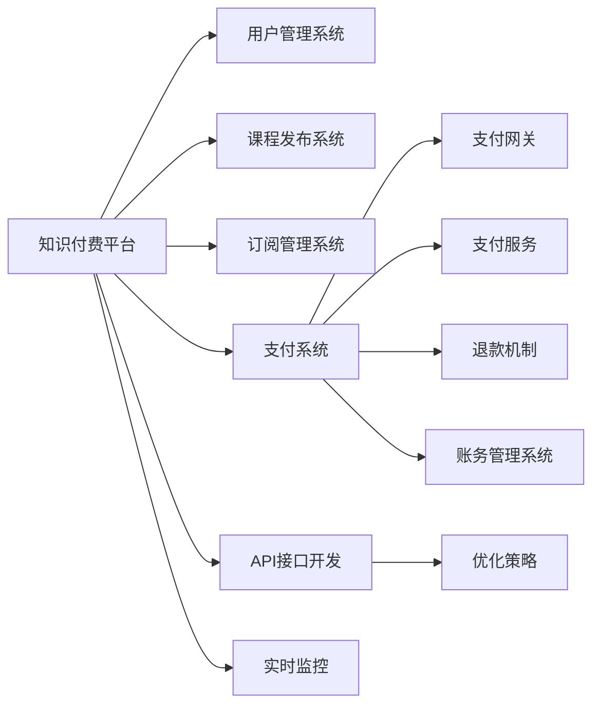

                 

# 知识付费平台的支付系统集成与优化

> 关键词：知识付费,支付系统,系统集成,优化策略,API开发,安全支付,实时监控

## 1. 背景介绍

随着互联网时代的深入发展，知识付费平台成为了连接知识创作者与消费者的重要桥梁。平台通过对高价值知识的付费订阅，保障了内容创作者的合法权益，也提升了用户的学习体验和知识获取效率。支付系统作为知识付费平台的核心组件之一，不仅负责资金流的管理，更是保障交易安全和用户体验的关键环节。因此，如何高效、稳定地集成支付系统，并不断进行优化，是知识付费平台面临的重要问题。

## 2. 核心概念与联系

### 2.1 核心概念概述

为更好地理解知识付费平台支付系统的集成与优化方法，本节将介绍几个密切相关的核心概念：

- 知识付费平台：基于互联网的，为用户提供高质量知识内容的付费服务模式。平台通常涉及内容生产、内容审核、用户订阅、内容发布、交易管理等多个环节。
- 支付系统：负责处理交易资金流的系统，包括支付网关、支付服务、退款机制、账务管理等功能模块。
- 系统集成：将不同系统、应用或服务连接起来的工程实践。在知识付费平台中，支付系统与内部系统如用户管理系统、课程发布系统、订阅管理系统的集成是必不可少的。
- 优化策略：通过技术手段提升支付系统性能和用户体验的方法。包括但不限于API接口优化、支付流程简化、安全支付策略、交易实时监控等。

这些核心概念之间具有密切联系，共同构成了知识付费平台支付系统集成的基础架构。接下来，我们将详细探讨这些概念的原理和联系。

### 2.2 核心概念原理和架构的 Mermaid 流程图



这个流程图展示了大语言模型的核心概念及其之间的关系：

1. 知识付费平台通过API接口与用户管理系统、课程发布系统、订阅管理系统、支付系统等模块进行交互。
2. 支付系统作为核心模块，与支付网关、支付服务、退款机制、账务管理系统等组件紧密联系，确保资金流的安全、高效管理。
3. 优化策略贯穿于API接口开发、支付流程简化、安全支付策略、交易实时监控等各个环节，提升系统整体性能和用户体验。
4. 实时监控与优化策略配合，构建闭环反馈系统，保障支付系统的稳定性和持续改进。

## 3. 核心算法原理 & 具体操作步骤

### 3.1 算法原理概述

支付系统的核心算法原理主要围绕资金流管理和交易安全展开。其核心在于：

- 通过API接口将支付请求发送到第三方支付平台（如支付宝、微信支付等），完成资金的转移。
- 对支付请求进行加密处理，防止支付信息在传输过程中被篡改或窃取。
- 在支付完成后的确认机制中，确保交易的准确性和资金的及时到账。
- 通过交易监控和风险管理，防止欺诈行为和异常交易，保护用户利益。

### 3.2 算法步骤详解

支付系统的核心算法步骤包括：

1. **API接口开发与调用**：
   - 使用HTTPS协议进行API接口的开发与部署。
   - 设计统一的API接口规范，确保不同系统的兼容性。
   - 调用第三方支付平台提供的API接口，完成资金支付的请求和响应。

2. **加密处理**：
   - 使用RSA、AES等加密算法对支付信息进行加密处理。
   - 通过SSL/TLS协议确保传输过程中的数据加密和安全传输。
   - 对加密后的支付信息进行数字签名，防止中间人攻击。

3. **交易确认机制**：
   - 在支付请求完成后，通过异步通知机制获取支付平台返回的支付结果。
   - 验证支付结果的完整性和有效性，确保交易的准确性。
   - 更新交易状态，及时通知用户支付结果。

4. **实时监控与风险管理**：
   - 实时监控支付系统的运行状态，发现异常交易及时预警。
   - 根据交易行为和历史数据，建立异常交易检测模型，识别欺诈行为。
   - 实施风险管理策略，如交易限额、风控模型等，保护用户利益。

### 3.3 算法优缺点

支付系统的核心算法具有以下优点：

- 安全性高：通过加密处理和数字签名，确保支付信息在传输过程中的安全性和完整性。
- 交易效率高：API接口和异步通知机制保证了支付流程的快速响应和资金的及时到账。
- 灵活性高：API接口的统一规范和标准的支付流程，使得支付系统易于集成和扩展。

同时，这些算法也存在一些局限性：

- 技术复杂：加密算法和支付协议的实现需要较高的技术水平。
- 维护成本高：随着业务的发展，支付系统的复杂度不断增加，维护成本也相应增加。
- 数据依赖性强：支付系统的安全性高度依赖于第三方支付平台的服务质量和稳定性。

### 3.4 算法应用领域

支付系统的核心算法不仅在知识付费平台中有着广泛的应用，同样在其他在线支付场景中也发挥着重要作用。以下是几个常见的应用领域：

1. **电子商务**：
   - 通过支付系统的API接口，完成商品的交易和支付流程。
   - 使用支付系统的加密算法和数字签名，确保交易的安全性。

2. **金融行业**：
   - 应用于银行和支付服务，实现跨行转账、信用卡支付等功能。
   - 使用支付系统的实时监控和风险管理，防止欺诈行为和异常交易。

3. **社交网络**：
   - 在社交网络平台上，完成礼物、红包、打赏等支付行为。
   - 使用支付系统的交易确认机制，确保支付行为的准确性和及时性。

4. **在线教育**：
   - 实现课程订阅和付费学习的支付流程。
   - 通过支付系统的实时监控和风控策略，保护用户利益。

支付系统的核心算法在这些领域中得到了广泛的应用，极大地提升了在线支付的效率和安全性。

## 4. 数学模型和公式 & 详细讲解 & 举例说明

### 4.1 数学模型构建

支付系统的核心算法涉及多种数学模型和公式，以下是对几个关键模型的详细讲解：

1. **加密模型**：
   - RSA加密算法：使用公钥和私钥进行数据加密和解密。公钥公开，私钥保密，确保数据传输的安全性。
   - AES对称加密算法：使用相同的密钥对数据进行加密和解密，速度快，适用于大量数据的加密。

2. **数字签名模型**：
   - 使用SHA算法对支付信息进行摘要，生成数字签名。
   - 接收方使用相同的算法对摘要进行验证，确保支付信息的完整性。

3. **支付流程模型**：
   - 支付请求：发送支付指令，包括支付金额、商品信息、支付信息等。
   - 支付处理：第三方支付平台接收支付请求，进行资金扣减和支付处理。
   - 支付结果通知：支付平台将支付结果通知给知识付费平台，并进行交易状态更新。

### 4.2 公式推导过程

以下是对RSA加密算法和数字签名模型的公式推导：

**RSA加密算法**：

设公钥为$(k_e, n_e)$，私钥为$(k_d, n_d)$，其中$n_e = p \times q$，$p$和$q$为素数，$e$和$d$为整数。RSA加密算法的公式为：

$$
C = M^e \bmod n
$$

其中，$M$为明文，$C$为密文。

**数字签名模型**：

设消息$M$，发送方对$M$进行SHA摘要，得到摘要$h(M)$，然后对$h(M)$使用私钥$d_s$进行加密，生成数字签名$S$。接收方对$M$进行SHA摘要，得到摘要$h(M)$，然后使用发送方的公钥$k_e$对$h(M)$进行解密，生成$h(M)$。若$S$与$h(M)$相等，则验证通过。

$$
S = (h(M))^{d_s} \bmod n_s
$$

其中，$n_s$为私钥长度。

### 4.3 案例分析与讲解

以一个具体的知识付费平台支付系统为例，展示支付系统的工作流程：

1. **用户订阅**：
   - 用户在知识付费平台上选择订阅课程，填写支付信息。
   - 平台调用API接口，将支付信息发送到支付平台。

2. **支付处理**：
   - 支付平台接收到支付请求，进行支付处理，完成资金扣减。
   - 支付平台将支付结果通过API接口返回给知识付费平台。

3. **交易确认**：
   - 知识付费平台验证支付结果的完整性和有效性，更新交易状态。
   - 平台通过异步通知机制通知用户支付结果，确认订单。

4. **实时监控与风险管理**：
   - 平台实时监控支付系统的运行状态，发现异常交易及时预警。
   - 根据交易行为和历史数据，建立异常交易检测模型，识别欺诈行为。
   - 实施风险管理策略，如交易限额、风控模型等，保护用户利益。

## 5. 项目实践：代码实例和详细解释说明

### 5.1 开发环境搭建

在进行支付系统集成与优化实践前，我们需要准备好开发环境。以下是使用Python进行API开发的环境配置流程：

1. 安装Python：下载并安装最新版本的Python，推荐使用Python 3.8或以上版本。
2. 安装必要的依赖包：使用pip安装requests、urllib3等依赖包，用于HTTP请求和加密处理。
3. 搭建开发环境：使用Python自带的venv工具，创建一个虚拟环境，保证项目依赖的独立性。
4. 配置开发环境：在虚拟环境中配置HTTPS协议和SSL/TLS证书，确保数据传输的安全性。

### 5.2 源代码详细实现

下面我们以知识付费平台的支付系统API接口为例，给出使用Python和Flask框架进行开发的代码实现。

```python
from flask import Flask, request, jsonify
import requests
import hashlib

app = Flask(__name__)

# 支付请求处理函数
@app.route('/payment', methods=['POST'])
def payment():
    data = request.json
    # 调用第三方支付平台API
    response = requests.post('https://api.paypal.com/payment', data=data)
    # 处理支付结果
    if response.status_code == 200:
        # 更新交易状态
        transaction_status = update_transaction_status(response.json())
        # 返回支付结果
        return jsonify({'status': 'success', 'transaction_status': transaction_status})
    else:
        # 返回支付错误信息
        return jsonify({'status': 'error', 'error_message': response.json().text}), 500

# 更新交易状态函数
def update_transaction_status(payment_data):
    # 使用RSA加密算法对支付数据进行加密
    encrypted_data = encrypt_data(payment_data)
    # 使用数字签名算法对加密数据进行签名
    signature = sign_data(encrypted_data)
    # 验证支付数据完整性和有效性
    if verify_data(encrypted_data, signature):
        # 更新交易状态为已支付
        return 'paid'
    else:
        # 更新交易状态为未支付
        return 'unpaid'

# RSA加密函数
def encrypt_data(data):
    # 将数据转换为明文字节数组
    data_bytes = data.encode('utf-8')
    # 使用RSA算法进行加密
    encrypted_data = rsa.encrypt(data_bytes, public_key)
    return encrypted_data

# 数字签名函数
def sign_data(data):
    # 使用SHA算法对数据进行摘要
    data_hash = hashlib.sha256(data.encode('utf-8')).digest()
    # 使用私钥对摘要进行加密，生成数字签名
    return rsa.sign(data_hash, private_key)

# 验证数据函数
def verify_data(data, signature):
    # 使用SHA算法对数据进行摘要
    data_hash = hashlib.sha256(data.encode('utf-8')).digest()
    # 使用公钥对数字签名进行解密
    decrypted_signature = rsa.decrypt(signature, public_key)
    # 验证摘要和解密后的数字签名是否匹配
    return decrypted_signature == data_hash
```

### 5.3 代码解读与分析

让我们再详细解读一下关键代码的实现细节：

**API接口**：
- 使用Flask框架搭建API接口，接受POST请求，处理支付请求。
- 通过requests库调用第三方支付平台的API接口，完成支付处理。
- 根据支付结果更新交易状态，并返回支付结果。

**加密处理函数**：
- 使用RSA算法对支付数据进行加密，确保数据传输的安全性。
- 使用SHA算法对加密数据进行摘要，生成数字签名。
- 使用私钥对摘要进行加密，生成数字签名。

**验证数据函数**：
- 使用SHA算法对数据进行摘要，生成摘要。
- 使用公钥对数字签名进行解密，生成解密后的数字签名。
- 验证摘要和解密后的数字签名是否匹配，确保数据的完整性和有效性。

**交易状态更新函数**：
- 根据支付结果，更新交易状态为已支付或未支付。

以上代码实现了一个简单的知识付费平台支付系统的API接口。通过Flask框架和requests库，实现了与第三方支付平台的接口调用，同时通过RSA和SHA算法实现了加密处理和数字签名，确保支付数据的安全性和完整性。

## 6. 实际应用场景

### 6.1 智能客服系统

知识付费平台的支付系统可以应用于智能客服系统，提升用户支付体验和客服效率。用户在进行课程订阅或支付时，可以自动接入支付系统，快速完成支付流程。支付系统通过API接口将支付请求发送到第三方支付平台，完成资金扣减和支付处理。支付结果通过异步通知机制返回给知识付费平台，并及时通知用户支付结果，确认订单。

### 6.2 电商平台

支付系统同样适用于电商平台的商品交易，确保支付流程的安全性和高效性。电商平台通过API接口调用支付系统的接口，完成商品的交易和支付流程。支付系统通过加密处理和数字签名，确保支付信息的安全性和完整性。电商平台通过实时监控和风险管理，防止欺诈行为和异常交易，保护用户利益。

### 6.3 银行金融系统

支付系统可以应用于银行的金融系统，实现跨行转账、信用卡支付等功能。银行通过API接口调用支付系统的接口，完成资金的转移和支付处理。支付系统通过加密处理和数字签名，确保支付信息的安全性和完整性。银行通过实时监控和风险管理，防止欺诈行为和异常交易，保护用户利益。

### 6.4 未来应用展望

随着支付系统的发展，未来将会有更多的应用场景。以下是几个可能的未来应用方向：

1. **跨链支付**：
   - 实现不同区块链平台之间的支付互通，满足不同用户对支付方式的需求。

2. **移动支付**：
   - 通过移动终端完成支付流程，提高支付的便利性和速度。

3. **加密货币支付**：
   - 支持加密货币的支付，满足用户对加密货币的需求。

4. **智能合约支付**：
   - 通过智能合约实现自动化的支付和交易管理，提高支付流程的自动化和智能化水平。

支付系统的未来发展将更加多样化，满足不同用户和场景的需求，提升支付流程的效率和安全性。

## 7. 工具和资源推荐

### 7.1 学习资源推荐

为了帮助开发者系统掌握支付系统的集成与优化理论基础和实践技巧，这里推荐一些优质的学习资源：

1. **《微服务架构设计》**：这是一本系统介绍微服务架构的书籍，涵盖API设计、微服务调用、服务治理等内容，适合理解API接口的开发和集成。
2. **《分布式系统设计》**：这本书详细讲解了分布式系统设计的原理和实践，涵盖负载均衡、分布式缓存、分布式数据库等内容，适合理解支付系统的架构设计。
3. **《加密算法与数字签名》**：这本书详细讲解了RSA、SHA等加密算法的原理和实现方法，适合理解加密处理和数字签名的实现。

### 7.2 开发工具推荐

高效的开发离不开优秀的工具支持。以下是几款用于支付系统集成的常用工具：

1. **Python**：Python是一种高级编程语言，简单易学，适合开发API接口和支付系统。
2. **Flask**：Flask是一个轻量级的Web框架，可以快速搭建API接口，支持RESTful API设计。
3. **requests**：requests是一个Python的HTTP库，可以方便地进行API接口调用和HTTP请求处理。
4. **RSA加密库**：RSA加密库提供了RSA算法的实现，支持加密处理和数字签名。

### 7.3 相关论文推荐

支付系统的集成与优化涉及多个研究方向，以下是几篇相关论文，推荐阅读：

1. **《PAC：一种分布式支付架构》**：这篇论文提出了一种分布式支付架构，通过API网关和负载均衡器实现了支付系统的稳定性和可靠性。
2. **《区块链支付系统的设计》**：这篇论文详细讲解了区块链支付系统的设计原理和实现方法，适合理解区块链支付的原理和应用。
3. **《智能合约技术与安全》**：这篇论文详细讲解了智能合约技术的安全性和应用，适合理解智能合约支付的实现方法。

## 8. 总结：未来发展趋势与挑战

### 8.1 总结

本文对知识付费平台的支付系统集成与优化方法进行了全面系统的介绍。首先阐述了支付系统在知识付费平台中的重要性和核心算法原理，明确了支付系统集成的基础架构。其次，从原理到实践，详细讲解了支付系统的API接口开发、加密处理、数字签名、交易确认和实时监控等核心算法步骤，给出了支付系统集成的完整代码实现。同时，本文还广泛探讨了支付系统在智能客服、电商平台、银行金融等领域的实际应用，展示了支付系统的广泛应用价值。最后，本文精选了支付系统的学习资源、开发工具和相关论文，力求为读者提供全方位的技术指引。

通过本文的系统梳理，可以看到，支付系统集成与优化在大规模知识付费平台的落地应用中具有重要意义。未来的发展方向将围绕API接口的优化、加密处理和数字签名的高效实现、交易确认和实时监控等关键环节展开，不断提升支付系统的性能和用户体验。

### 8.2 未来发展趋势

展望未来，支付系统的集成与优化技术将呈现以下几个发展趋势：

1. **API接口优化**：
   - 随着API接口的使用场景增多，未来的API设计将更加灵活和可扩展。
   - 引入Swagger等API文档工具，提升API接口的可读性和可维护性。

2. **加密处理和数字签名**：
   - 引入最新的加密算法和数字签名算法，提高支付系统的安全性和效率。
   - 引入硬件加密设备，提高加密处理的速度和安全性。

3. **交易确认和实时监控**：
   - 引入区块链技术，提高交易确认的可靠性和实时性。
   - 引入AI和大数据分析技术，建立更加智能化的风险管理体系。

4. **多币种支付**：
   - 支持多种货币的支付，满足不同地区和场景的需求。

5. **跨境支付**：
   - 支持跨境支付，实现不同国家的资金流动。

以上趋势凸显了支付系统集成与优化技术的广阔前景。这些方向的探索发展，将进一步提升支付系统的性能和安全性，为知识付费平台提供更加稳定、高效、安全的支付服务。

### 8.3 面临的挑战

尽管支付系统的集成与优化技术已经取得了瞩目成就，但在迈向更加智能化、普适化应用的过程中，它仍面临着诸多挑战：

1. **技术复杂度高**：
   - 加密处理和数字签名的实现需要较高的技术水平，涉及复杂的算法和密钥管理。

2. **安全性要求高**：
   - 支付系统的安全性直接关系到用户的利益，需要高度的可靠性和安全性保障。

3. **系统集成难度大**：
   - 支付系统需要与多个系统进行集成，涉及复杂的接口调用和数据传输。

4. **业务场景复杂**：
   - 支付系统需要应对不同的业务场景和需求，需要灵活的设计和实现。

5. **数据隐私问题**：
   - 支付系统涉及大量的用户隐私数据，需要严格的数据保护和隐私管理。

6. **跨平台兼容性**：
   - 支付系统需要在不同的平台和设备上实现互通，需要考虑跨平台的兼容性和标准化。

以上挑战需要在未来的研究中不断探索和解决，以确保支付系统的安全性和高效性。

### 8.4 研究展望

面对支付系统集成与优化所面临的挑战，未来的研究需要在以下几个方面寻求新的突破：

1. **多币种支付技术**：
   - 研究多币种支付的实现方法，提高支付系统的灵活性和便利性。

2. **区块链支付技术**：
   - 研究区块链支付的原理和应用，提升支付系统的可靠性和实时性。

3. **智能合约技术**：
   - 研究智能合约技术的安全性和应用，实现自动化的支付和交易管理。

4. **安全防护技术**：
   - 研究支付系统的安全防护技术，防止欺诈行为和异常交易。

5. **数据隐私保护技术**：
   - 研究数据隐私保护技术，确保用户隐私数据的安全性。

6. **跨平台兼容技术**：
   - 研究跨平台兼容技术，实现不同平台和设备的互通。

这些研究方向的探索，将引领支付系统集成与优化技术迈向更高的台阶，为知识付费平台提供更加稳定、高效、安全的支付服务。面向未来，支付系统需要与其他人工智能技术进行更深入的融合，如自然语言处理、机器学习等，协同发力，共同推动支付系统的进步。只有勇于创新、敢于突破，才能不断拓展支付系统的边界，让支付服务更加智能和人性化。

## 9. 附录：常见问题与解答

**Q1: 支付系统集成时需要注意哪些问题？**

A: 支付系统集成时需要注意以下几个问题：
1. API接口的设计：需要根据业务需求，设计灵活、可扩展的API接口，确保系统兼容性和可维护性。
2. 数据传输的安全性：需要使用HTTPS协议和SSL/TLS证书，确保数据传输的安全性。
3. 加密和数字签名的实现：需要选择合适的加密算法和数字签名算法，确保支付数据的安全性和完整性。
4. 交易确认机制：需要建立完善的交易确认机制，确保支付结果的准确性和及时性。
5. 实时监控和风险管理：需要建立实时监控和风险管理体系，防止欺诈行为和异常交易，保护用户利益。

**Q2: 支付系统优化时需要考虑哪些因素？**

A: 支付系统优化时需要考虑以下几个因素：
1. 性能优化：需要优化API接口调用、数据传输、加密处理等环节，提高系统的响应速度和处理能力。
2. 安全性提升：需要引入最新的加密算法和数字签名算法，提高支付系统的安全性。
3. 可靠性保证：需要建立完善的交易确认和实时监控机制，确保支付系统的稳定性和可靠性。
4. 用户体验优化：需要简化支付流程，提高用户体验，提升用户的支付效率和满意度。
5. 成本控制：需要优化系统架构，降低硬件和运维成本，提高支付系统的经济性和可持续性。

**Q3: 支付系统在多币种支付时需要注意哪些问题？**

A: 支付系统在多币种支付时需要注意以下几个问题：
1. 货币转换：需要实现货币转换功能，确保支付金额的准确性。
2. 汇率管理：需要实时获取和更新汇率信息，确保汇率转换的准确性。
3. 汇率波动：需要建立汇率波动风险管理机制，确保支付系统的稳定性和可靠性。
4. 跨境支付：需要研究跨境支付的原理和实现方法，确保跨境支付的可靠性和实时性。

**Q4: 支付系统在跨境支付时需要注意哪些问题？**

A: 支付系统在跨境支付时需要注意以下几个问题：
1. 外汇管理：需要了解不同国家和地区的货币政策和外汇管理规定，确保支付系统的合规性。
2. 外汇交易：需要研究外汇交易的原理和实现方法，确保支付系统的实时性和准确性。
3. 外汇风险：需要建立外汇风险管理体系，防止外汇风险对支付系统造成影响。
4. 跨境支付网络：需要研究跨境支付网络的结构和设计，确保支付系统的稳定性和可靠性。

**Q5: 支付系统在智能合约支付时需要注意哪些问题？**

A: 支付系统在智能合约支付时需要注意以下几个问题：
1. 智能合约管理：需要建立智能合约管理系统，确保智能合约的可靠性和安全性。
2. 智能合约执行：需要研究智能合约的执行原理和实现方法，确保智能合约的准确性和及时性。
3. 智能合约风险：需要建立智能合约风险管理体系，防止智能合约的漏洞和风险。
4. 智能合约网络：需要研究智能合约网络的结构和设计，确保智能合约支付的稳定性和可靠性。

这些问题的解答，将帮助开发者在实际应用中更好地理解支付系统集成与优化的方法和策略，提升支付系统的性能和用户体验。

---

作者：禅与计算机程序设计艺术 / Zen and the Art of Computer Programming

