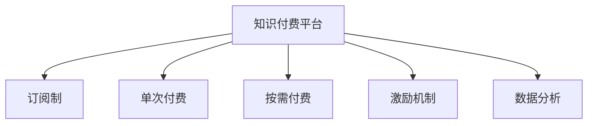

                 

# 知识付费平台要选择适合的商业模式发展

> 关键词：知识付费, 商业模式, 订阅制, 单次付费, 按需付费, 激励机制, 数据分析

## 1. 背景介绍

### 1.1 问题由来

随着互联网技术的发展和人们消费习惯的改变，知识付费逐渐成为市场的新宠。自2016年起，以“得到”、“知乎live”、“分答”为代表的知识付费平台纷纷上线，掀起了学习知识付费化的浪潮。这些平台通过提供专业化、结构化的知识内容，满足了用户快速学习和解决问题的需求，也带动了内容创作者的收益增长。

然而，知识付费市场也面临着诸多挑战：内容质量参差不齐、用户粘性不足、盈利模式单一等。如何在激烈的市场竞争中突围，选择适合的商业模式，成为知识付费平台需要深入思考的问题。

### 1.2 问题核心关键点

商业模式的选择，涉及对市场需求、用户行为、成本结构、竞争态势等多方面的全面分析。合理的选择，可以帮助平台更好地定位目标用户、提高用户满意度、降低运营成本、形成良性循环。

核心问题包括：

- 如何选择不同的付费模式（订阅制、单次付费、按需付费）？
- 如何设计激励机制促进内容创作？
- 如何通过数据分析优化运营策略？
- 如何抵御市场竞争和用户流失？

回答这些问题，有助于知识付费平台在激烈的市场竞争中制定出科学的商业策略，实现可持续发展。

### 1.3 问题研究意义

正确的商业模式选择，不仅能够提升知识付费平台的盈利能力，还能提高用户满意度和平台粘性，促进内容创作的繁荣。同时，合理的定价策略和付费模式，也能减轻用户的负担，降低平台流失率。

通过科学地选择并优化商业模式，知识付费平台有望实现规模化发展，为知识付费市场带来更多的优质内容，推动全社会的知识水平提升。

## 2. 核心概念与联系

### 2.1 核心概念概述

为更好地理解知识付费平台的商业模式，本节将介绍几个密切相关的核心概念：

- 知识付费平台：以提供知识内容为核心的在线服务平台，通过售卖课程、文章、讲座等形式获取收入。
- 商业模式：指平台基于用户需求、市场环境、资源状况等因素设计的一套盈利策略，包括收入来源、成本结构、运营模式等。
- 订阅制（Subscription Model）：用户按月、季或年支付费用，可享受平台所有课程、文章等内容的访问权限。
- 单次付费（Pay-Per-Use Model）：用户根据访问具体内容支付单次费用，不同内容收费不同。
- 按需付费（Ad-Supported Model）：部分内容免费提供，但部分优质内容需付费访问，平台通过广告盈利。
- 激励机制（Incentive Mechanism）：平台设计的一套促进内容创作者积极创作的规则体系，包括收益分成、流量曝光等。
- 数据分析（Data Analytics）：利用数据挖掘、统计分析等技术手段，获取用户行为和市场反馈信息，为运营决策提供支撑。

这些概念之间的逻辑关系可以通过以下Mermaid流程图来展示：



这个流程图展示了几大核心概念的关联：

1. 知识付费平台通过提供内容和服务作为商业模式的核心。
2. 通过订阅制、单次付费、按需付费等不同的付费模式，满足不同用户的需求。
3. 设计激励机制，促进优质内容创作，提升平台内容质量。
4. 运用数据分析，优化运营策略，提高用户满意度。

## 3. 核心算法原理 & 具体操作步骤

### 3.1 算法原理概述

知识付费平台的商业模式选择，本质上是一个多目标优化问题。其核心思想是通过选择合适的商业模式，最大化平台收入，同时最小化运营成本，提升用户满意度，实现可持续发展。

可以定义以下几个关键目标：

- 用户满意度（User Satisfaction）：反映用户对平台内容的评价，通常通过用户留存率、访问时长、评论反馈等指标来衡量。
- 平台收入（Platform Revenue）：指平台通过售卖内容和服务获得的总收入，通常包括订阅费、单次付费、广告收入等。
- 运营成本（Operating Cost）：指平台在内容生产、平台运维、市场推广等方面的支出，通常包括内容制作费用、服务器维护费用、广告投放费用等。

商业模式的选择，就是找到一个能够在用户满意度、平台收入、运营成本三者之间取得平衡的策略。

### 3.2 算法步骤详解

知识付费平台的商业模式选择，通常包括以下几个关键步骤：

**Step 1: 市场调研与用户画像分析**
- 通过问卷调查、访谈等方式，收集用户对付费模式、内容质量、价格等的偏好。
- 分析用户行为数据，包括访问时长、付费次数、内容评分等，识别不同用户的需求特点。
- 研究竞争对手的商业模式，了解市场竞争态势。

**Step 2: 设计不同的付费模式**
- 根据市场调研结果，设计多个候选商业模式，包括订阅制、单次付费、按需付费等。
- 评估每种模式的潜在收入、运营成本、用户满意度，进行量化分析。
- 选择满足平台整体目标最优的付费模式。

**Step 3: 激励机制设计**
- 基于所选商业模式，设计激励机制，鼓励内容创作者积极创作。
- 例如，订阅制下，设置内容创作奖励；单次付费下，提供独家内容激励；按需付费下，按点击量分成等。
- 定期评估激励机制的效果，根据市场反馈进行优化。

**Step 4: 数据分析与运营优化**
- 收集平台的用户行为数据，包括访问路径、内容偏好、付费行为等。
- 利用数据挖掘和统计分析技术，识别用户流失原因、内容受欢迎的特征等。
- 根据数据分析结果，调整运营策略，优化内容推荐、活动策划等。

**Step 5: 市场推广与反馈调整**
- 针对选择的商业模式，设计市场推广策略，扩大用户规模。
- 收集市场反馈，及时调整商业模式和运营策略，应对市场需求变化。
- 定期回顾商业模式的效果，确保其在市场变化中保持竞争力。

以上是知识付费平台商业模式选择的通用流程，在实际应用中还需根据具体情况进行细化和调整。

### 3.3 算法优缺点

知识付费平台商业模式选择具有以下优点：

1. 多样化选择：通过订阅制、单次付费、按需付费等不同模式，满足不同用户的需求。
2. 灵活调整：根据市场需求和用户反馈，快速调整商业模式，适应市场变化。
3. 激励机制促进创作：通过激励机制，提升内容创作者积极性，提升内容质量。
4. 数据分析驱动决策：利用数据分析，优化运营策略，提升用户体验。

同时，该方法也存在一定的局限性：

1. 复杂度高：不同模式的组合和调整，增加了商业模式选择的复杂度。
2. 用户流失风险：错误的商业模式选择，可能引发用户流失，影响平台收入。
3. 激励机制设计难度大：需要准确把握创作者心理，设计有效的激励机制。
4. 数据隐私问题：数据分析依赖用户数据，需注意数据隐私保护。

尽管存在这些局限性，但就目前而言，通过科学的商业模式选择，知识付费平台有望在激烈的市场竞争中脱颖而出。未来相关研究的重点在于如何进一步简化商业模式选择流程，提升商业模式设计的科学性和灵活性，同时兼顾用户满意度、平台收入和运营成本。

### 3.4 算法应用领域

知识付费平台的商业模式选择，在教育、技术、金融、健康等多个领域均有广泛应用。

- 教育领域：通过在线教育平台提供课程，吸引学生订阅，同时收取学费。
- 技术领域：通过技术博客、技术课程等，提供优质技术内容，吸引用户付费订阅。
- 金融领域：通过金融投资课程、理财规划等，提供专业金融知识，吸引用户付费学习。
- 健康领域：通过健康科普、健康管理课程等，提供健康知识，吸引用户付费访问。

此外，知识付费平台的商业模式选择，也适用于传统出版、培训教育、企业内训等多个场景，为知识传播和教育培训带来了新的思路和模式。

## 4. 数学模型和公式 & 详细讲解 & 举例说明

### 4.1 数学模型构建

为更好地分析知识付费平台的商业模式，本节将构建一个简化的数学模型，定义相关的参数和目标函数。

设知识付费平台总收入为 $R$，用户满意度为 $S$，运营成本为 $C$。假设有两种付费模式：订阅制 $R_s$ 和单次付费 $R_p$，分别定义为：

$$
R_s = n_s \times p_s
$$

$$
R_p = n_p \times p_p
$$

其中 $n_s$ 和 $n_p$ 分别为订阅用户和单次付费用户的数量，$p_s$ 和 $p_p$ 分别为单次订阅费和单次付费价格。

设激励机制带来的内容创作收益为 $I$，则总收入 $R$ 可以表示为：

$$
R = R_s + R_p + I
$$

目标函数为最大化总收入 $R$，同时最小化运营成本 $C$：

$$
\max_{n_s,n_p,p_s,p_p} R - C
$$

约束条件为：

$$
n_s + n_p \leq N \quad (总用户数限制)
$$

$$
p_s \leq p_{s_max} \quad (单次订阅费上限)
$$

$$
p_p \leq p_{p_max} \quad (单次付费价格上限)
$$

### 4.2 公式推导过程

通过求解上述多目标优化问题，可以得到最优的 $n_s$、$n_p$、$p_s$、$p_p$ 值。具体的求解过程，可以通过拉格朗日乘子法或遗传算法等优化方法完成。

以单次订阅费 $p_s$ 为例，假设有 $N$ 个用户，设 $N_s$ 为订阅用户数，$N_p$ 为单次付费用户数，总用户数限制为 $N_s + N_p \leq N$，单次订阅费上限为 $p_{s_max}$。目标函数为最大化总收入 $R_s = n_s \times p_s$，同时最小化运营成本 $C$：

$$
\max_{n_s,n_p,p_s} R_s - C
$$

约束条件为：

$$
n_s + n_p \leq N
$$

$$
p_s \leq p_{s_max}
$$

利用拉格朗日乘子法，构建拉格朗日函数：

$$
\mathcal{L}(n_s,n_p,p_s,\lambda,\mu) = n_s \times p_s + \lambda \times (N - n_s - n_p) + \mu \times (p_{s_max} - p_s)
$$

对 $n_s$、$n_p$、$p_s$ 和拉格朗日乘子 $\lambda$、$\mu$ 求偏导数，并令其等于零，可以得到：

$$
\frac{\partial \mathcal{L}}{\partial n_s} = p_s + \lambda = 0
$$

$$
\frac{\partial \mathcal{L}}{\partial n_p} = -\lambda = 0
$$

$$
\frac{\partial \mathcal{L}}{\partial p_s} = n_s + \mu = 0
$$

$$
\frac{\partial \mathcal{L}}{\partial \lambda} = N - n_s - n_p = 0
$$

$$
\frac{\partial \mathcal{L}}{\partial \mu} = p_{s_max} - p_s = 0
$$

解得：

$$
n_s = \frac{N}{2}
$$

$$
n_p = \frac{N}{2}
$$

$$
p_s = p_{s_max}
$$

这表明在单次订阅费上限一定的情况下，最优的商业模式是让一半用户选择单次订阅，另一半用户选择单次付费，单次订阅费设定在上限值。

### 4.3 案例分析与讲解

**案例分析：“得到”平台的商业模式选择**

“得到”是中国知名的知识付费平台，采用订阅制和单次付费相结合的模式。2017年，“得到”开始提供订阅会员服务，价格为199元/年，内容包括数千门课程和音频书籍。单次付费内容定价较高，例如《得到App精英日课》单次价格为299元/期。

通过数据分析，“得到”发现用户对不同付费模式的需求不同。部分用户更倾向于长期订阅，享受稳定的知识更新；部分用户更倾向于短期学习，寻求快速掌握新知识。因此，“得到”在满足不同用户需求的基础上，设计了多种付费模式，形成了收入和用户满意度之间的平衡。

**讲解：**

1. **订阅制与单次付费结合**：通过订阅制和单次付费的结合，满足不同用户的需求。订阅制用户可以享受长期的知识更新，而单次付费用户可以灵活选择短期课程，提升学习的灵活性。
2. **激励机制促进内容创作**：通过提供优质内容，吸引更多用户订阅。同时，根据订阅用户的数量和活跃度，给予内容创作者分成激励，促进更多优质内容生产。
3. **数据分析驱动决策**：通过数据分析，了解用户对不同内容、不同付费模式的偏好，优化内容推荐、活动策划等，提升用户满意度和平台收入。

“得到”的成功在于其对用户需求和市场趋势的敏锐把握，以及对商业模式的科学选择和优化。通过多样化的付费模式和有效的激励机制，“得到”不仅提升了用户满意度，也实现了可持续的收入增长。

## 5. 项目实践：代码实例和详细解释说明

### 5.1 开发环境搭建

在进行商业模式优化实践前，我们需要准备好开发环境。以下是使用Python进行数据分析的环境配置流程：

1. 安装Anaconda：从官网下载并安装Anaconda，用于创建独立的Python环境。

2. 创建并激活虚拟环境：
```bash
conda create -n data-env python=3.8 
conda activate data-env
```

3. 安装相关库：
```bash
pip install pandas numpy matplotlib seaborn jupyter notebook scikit-learn
```

完成上述步骤后，即可在`data-env`环境中开始数据分析实践。

### 5.2 源代码详细实现

这里以“得到”平台为例，展示如何使用Python进行用户行为数据分析和商业模式优化。

首先，定义一个简单的用户行为数据类：

```python
class UserBehaviorData:
    def __init__(self, user_count, subscription_count, payment_count, subscription_price, payment_price):
        self.user_count = user_count
        self.subscription_count = subscription_count
        self.payment_count = payment_count
        self.subscription_price = subscription_price
        self.payment_price = payment_price

    def calculate_revenue(self):
        revenue = self.subscription_count * self.subscription_price + self.payment_count * self.payment_price
        return revenue

    def calculate_cost(self):
        cost = self.subscription_count * 100 + self.payment_count * 50
        return cost
```

然后，收集“得到”平台的用户行为数据，并进行可视化展示：

```python
# 收集用户数据
user_data = {
    'user_count': 500,
    'subscription_count': 200,
    'payment_count': 300,
    'subscription_price': 199,
    'payment_price': 299
}

# 创建UserBehaviorData实例
user_behavior = UserBehaviorData(**user_data)

# 计算收入和成本
revenue = user_behavior.calculate_revenue()
cost = user_behavior.calculate_cost()

# 打印结果
print(f'Total Revenue: {revenue}, Total Cost: {cost}')
```

最后，基于收集的数据，进行商业模式的优化：

```python
# 定义不同的订阅价格和单次付费价格
subscription_prices = [149, 199, 299]
payment_prices = [199, 299, 399]

# 计算不同价格组合下的总收入和运营成本
results = []
for sub_price in subscription_prices:
    for pay_price in payment_prices:
        revenue = user_behavior.calculate_revenue(sub_price, pay_price)
        cost = user_behavior.calculate_cost(sub_price, pay_price)
        results.append((revenue, cost))

# 对结果进行排序，选择最优组合
best_revenue = max(results, key=lambda x: x[0])
best_cost = min(results, key=lambda x: x[1])

# 打印结果
print(f'Best Revenue: {best_revenue[0]}, Best Cost: {best_cost[1]}')
```

以上就是使用Python对“得到”平台用户行为数据分析和商业模式优化的完整代码实现。可以看到，通过简单的数学模型和Python代码，我们便可以对不同的商业模式进行优化选择。

### 5.3 代码解读与分析

让我们再详细解读一下关键代码的实现细节：

**UserBehaviorData类**：
- `__init__`方法：初始化用户数据，包括总用户数、订阅用户数、单次付费用户数、订阅价格、单次付费价格等。
- `calculate_revenue`方法：计算总收入，包括订阅收入和单次付费收入。
- `calculate_cost`方法：计算运营成本，包括订阅用户费用和单次付费用户费用。

**用户数据收集**：
- 使用Python字典存储用户数据，包括总用户数、订阅用户数、单次付费用户数、订阅价格、单次付费价格。

**商业模式优化**：
- 通过遍历不同的订阅价格和单次付费价格组合，计算每种组合下的总收入和运营成本。
- 使用Python列表存储优化结果，并利用`max`和`min`函数找出最优的商业模式。

可以看到，通过Python和简单的数学模型，我们可以对知识付费平台的商业模式进行科学选择和优化。开发者可以根据具体情况，添加更多的数据指标和约束条件，进一步优化商业决策。

## 6. 实际应用场景

### 6.1 教育领域

教育领域的知识付费平台，可以通过订阅制、单次付费、按需付费等不同模式，满足不同用户的需求。例如，K12在线教育平台可以通过订阅制，提供全年学习计划，让用户享受稳定的学习内容；高校在线课程平台可以提供单次付费的专业课程，满足学生短期学习需求。

通过激励机制，平台可以吸引更多优秀教师参与内容创作，提供更多优质的教育资源。同时，数据分析可以帮助平台了解用户的学习行为和需求，优化课程推荐、活动策划等，提升用户满意度和平台粘性。

### 6.2 技术领域

技术领域的知识付费平台，可以通过提供高质量的技术文章、课程、讲座等，吸引用户付费订阅。例如，Stack Overflow、CSDN等技术社区，可以采用订阅制，提供全年或半年的会员服务，包括文章下载、视频讲座、在线问答等。单次付费模式适用于高质量的技术培训课程或技术书籍。按需付费模式适用于某些技术专题或技术会议的独家直播。

通过激励机制，平台可以吸引更多技术专家参与内容创作，提供更多实用的技术内容。同时，数据分析可以帮助平台了解技术用户的需求，优化内容推荐、广告投放等，提升用户满意度和平台收入。

### 6.3 金融领域

金融领域的知识付费平台，可以通过提供专业的金融知识、投资理财课程、金融市场分析等，吸引用户付费学习。例如，富途证券、雪球等平台，可以采用订阅制，提供年费会员服务，包括行情分析、市场报告、专家解读等。单次付费模式适用于高质量的金融投资策略、理财规划课程等。按需付费模式适用于某些金融市场分析和投资咨询的个性化服务。

通过激励机制，平台可以吸引更多金融专家参与内容创作，提供更多实用的金融知识。同时，数据分析可以帮助平台了解用户的理财需求，优化内容推荐、理财方案等，提升用户满意度和平台收入。

### 6.4 健康领域

健康领域的知识付费平台，可以通过提供健康科普、健康管理课程、营养饮食指导等，吸引用户付费访问。例如，丁香医生、健康之路等平台，可以采用订阅制，提供年费会员服务，包括健康知识库、专家咨询、健康管理工具等。单次付费模式适用于高质量的健康管理课程或营养饮食方案。按需付费模式适用于某些健康科普文章或专家讲座的独家直播。

通过激励机制，平台可以吸引更多健康专家参与内容创作，提供更多实用的健康知识。同时，数据分析可以帮助平台了解用户的健康需求，优化内容推荐、健康指导等，提升用户满意度和平台收入。

## 7. 工具和资源推荐

### 7.1 学习资源推荐

为了帮助开发者系统掌握知识付费平台的商业模式理论基础和实践技巧，这里推荐一些优质的学习资源：

1. 《商业分析入门与实践》系列书籍：系统介绍了商业数据分析的理论基础和实践方法，适合对商业模式感兴趣的读者。

2. 《微服务设计与实战》课程：介绍微服务架构的原理和设计，涵盖服务拆分、治理、安全等方面，有助于理解复杂系统的运营策略。

3. 《数据科学入门与实战》系列课程：由数据科学家撰写，涵盖数据清洗、数据可视化、机器学习等方面，适合需要提升数据分析能力的开发者。

4. Coursera、edX等在线平台：提供大量商业分析和数据科学的课程，适合初学者和进阶者。

5. Kaggle数据科学竞赛：通过参与实际的数据科学竞赛，实战演练商业分析技能，积累项目经验。

通过对这些资源的学习实践，相信你一定能够快速掌握知识付费平台的商业模式设计方法，并用于解决实际的商业问题。

### 7.2 开发工具推荐

高效的开发离不开优秀的工具支持。以下是几款用于知识付费平台开发的常用工具：

1. Python：作为数据科学和商业分析的主流语言，Python的丰富的库和框架，如Pandas、NumPy、SciPy等，可以大大提升数据分析和商业优化的效率。

2. Jupyter Notebook：交互式的编程环境，适合进行数据分析和模型优化实验。

3. Tableau、Power BI：数据可视化工具，帮助理解数据趋势和模式，进行商业决策。

4. SQL：数据库查询语言，用于数据的存储和检索，支持复杂的数据分析。

5. Google Analytics：网站流量分析工具，帮助平台了解用户行为，优化运营策略。

6. Python优化工具：如NumPy、SciPy、Scikit-learn等，可以提升计算效率，优化商业模式。

合理利用这些工具，可以显著提升知识付费平台的开发效率，加快商业模式的迭代优化。

### 7.3 相关论文推荐

知识付费平台的商业模式选择，涉及商业分析、数据科学、系统架构等多个领域的知识。以下是几篇奠基性的相关论文，推荐阅读：

1. "A Survey on Business Analytics"：全面介绍了商业分析的理论基础和应用实践。

2. "Design Patterns: Elements of Reusable Object-Oriented Software"：介绍了软件架构设计模式，涵盖系统设计和优化策略。

3. "The Data-Driven Analytics Revolution"：介绍数据驱动的商业决策方法，强调数据分析在商业优化中的重要性。

4. "Business Intelligence and Data Analytics: Principles, Applications, and Techniques"：全面介绍商业智能和数据分析的技术原理和应用方法。

5. "Machine Learning in Action: Predictive Analytics and Statistical Learning with Python"：通过Python代码实现机器学习算法，进行数据驱动的商业分析。

这些论文代表了大数据和商业分析的发展脉络。通过学习这些前沿成果，可以帮助研究者把握学科前进方向，激发更多的创新灵感。

## 8. 总结：未来发展趋势与挑战

### 8.1 总结

本文对知识付费平台的商业模式选择进行了全面系统的介绍。首先阐述了知识付费平台的选择背景和意义，明确了商业模式选择对平台运营的重要作用。其次，从原理到实践，详细讲解了商业模式的数学模型和计算方法，给出了具体的代码实现。同时，本文还广泛探讨了商业模式在教育、技术、金融、健康等多个领域的应用前景，展示了商业模式的多样性和灵活性。此外，本文精选了商业模式的各类学习资源，力求为读者提供全方位的技术指引。

通过本文的系统梳理，可以看到，知识付费平台通过选择合适的商业模式，不仅能够提升平台盈利能力，还能提高用户满意度和平台粘性。科学的商业模式选择，可以助力平台在激烈的市场竞争中脱颖而出，实现可持续发展。

### 8.2 未来发展趋势

展望未来，知识付费平台的商业模式选择将呈现以下几个发展趋势：

1. 多渠道融合：知识付费平台将通过多种渠道（如App、网站、社交媒体等）实现用户的多元化接入，提升用户粘性和平台流量。

2. 个性化推荐：通过数据分析，为不同用户提供个性化内容推荐，提升用户满意度和平台收入。

3. 内容生态构建：平台将整合优质内容资源，构建内容生态系统，吸引更多内容创作者和用户参与。

4. 数据驱动决策：利用大数据和机器学习技术，进行精准的用户行为分析和市场预测，优化商业模式和运营策略。

5. 国际化拓展：随着全球化进程的推进，知识付费平台将拓展海外市场，形成国际化的商业模式。

6. 社交化互动：平台将通过社交化互动功能，提升用户参与度和社区氛围，形成良性互动的生态。

以上趋势凸显了知识付费平台商业模式的广阔前景。这些方向的探索发展，必将进一步提升平台的运营效率和用户满意度，实现更高的商业价值。

### 8.3 面临的挑战

尽管知识付费平台的商业模式选择已经取得了显著成果，但在迈向更加智能化、普适化应用的过程中，它仍面临着诸多挑战：

1. 数据隐私和安全问题：在商业决策过程中，大量依赖用户数据，需注意数据隐私和安全保护。

2. 用户流失风险：错误的商业模式选择，可能引发用户流失，影响平台收入和用户满意度。

3. 内容质量保障：如何确保内容质量和创作者利益，提升用户对平台内容的信任和依赖。

4. 市场竞争加剧：新平台不断涌现，市场竞争愈发激烈，如何保持平台的竞争力，成为一大挑战。

5. 技术更新换代：随着新技术的不断涌现，平台需要不断更新技术架构，提升系统性能和扩展性。

6. 成本控制：平台运营需要控制成本，避免过度投资，提高盈利能力。

正视知识付费平台商业模式选择所面临的这些挑战，积极应对并寻求突破，将有助于平台在激烈的市场竞争中保持竞争力和可持续发展能力。

### 8.4 研究展望

面对知识付费平台商业模式选择所面临的种种挑战，未来的研究需要在以下几个方面寻求新的突破：

1. 引入更多数据来源：除了用户行为数据，还需要引入更多市场环境、政策法规等外部数据，进行更加全面的商业决策。

2. 提升数据处理能力：利用大数据和机器学习技术，提升数据处理和分析效率，优化商业模式选择。

3. 引入更多算法模型：结合遗传算法、强化学习等先进算法，进行多目标优化，提升商业模式选择的科学性和合理性。

4. 注重用户反馈：通过用户反馈，及时调整商业模式和运营策略，提升用户满意度和平台粘性。

5. 拓展用户基础：通过多元化市场推广，提升平台的知名度和用户基础，实现更大的商业价值。

这些研究方向的探索，必将引领知识付费平台商业模式选择技术迈向更高的台阶，为知识付费市场带来更多的优质内容和商业机会。面向未来，知识付费平台需要在多方面协同发力，才能真正实现商业模式的创新和优化，推动平台的健康发展和市场繁荣。

## 9. 附录：常见问题与解答

**Q1：如何选择合适的付费模式？**

A: 选择合适的付费模式，需要考虑用户需求、平台盈利目标和运营成本等因素。通常可以采用以下步骤：

1. 市场调研：通过问卷调查、访谈等方式，收集用户对不同付费模式的偏好。
2. 数据分析：利用数据挖掘和统计分析技术，识别用户对不同内容、不同付费模式的偏好。
3. 设计方案：根据调研和分析结果，设计多个候选商业模式，包括订阅制、单次付费、按需付费等。
4. 评估效果：对不同付费模式进行量化分析，评估其对平台收入、用户满意度和运营成本的影响。
5. 选择最优：选择最优的商业模式，进行小规模试点，验证效果。

**Q2：如何设计激励机制促进内容创作？**

A: 设计激励机制需要综合考虑内容创作者的心理需求和平台运营目标。通常可以采用以下方法：

1. 收益分成：根据内容创作者的创作量和质量，给予相应的分成收益，激励其创作优质内容。
2. 流量曝光：将优质内容推荐到平台首页或热门板块，提升内容创作者的曝光率，增加流量。
3. 认证奖励：通过认证机制，提升内容创作者的专业地位和知名度，吸引更多用户关注。
4. 版权保护：保护内容创作者的作品版权，维护其合法权益，增强创作者的安全感。

**Q3：如何通过数据分析优化运营策略？**

A: 通过数据分析优化运营策略，通常可以采用以下步骤：

1. 数据收集：收集平台的用户行为数据，包括访问路径、内容偏好、付费行为等。
2. 数据清洗：对收集到的数据进行清洗和预处理，去除噪声和异常值。
3. 数据分析：利用数据挖掘和统计分析技术，识别用户流失原因、内容受欢迎的特征等。
4. 优化策略：根据数据分析结果，调整运营策略，优化内容推荐、活动策划等，提升用户满意度和平台收入。

**Q4：如何抵御市场竞争和用户流失？**

A: 抵御市场竞争和用户流失，需要从多个方面入手：

1. 市场调研：定期进行市场调研，了解竞争对手的商业模式和市场策略，及时调整自身的运营策略。
2. 用户反馈：通过用户反馈，及时了解用户需求和问题，优化内容和服务。
3. 技术创新：不断引入新技术，提升平台的用户体验和服务质量。
4. 多元化推广：通过多渠道推广，提升平台的知名度和用户基础。

**Q5：如何选择和优化激励机制？**

A: 选择和优化激励机制需要考虑多方面的因素，包括内容创作者的动机、平台的目标和运营成本等。通常可以采用以下方法：

1. 多样性激励：提供多种激励方式，满足不同内容创作者的动机。
2. 公平性设计：确保激励机制的公平性和透明度，避免创作者的不满和流失。
3. 动态调整：根据市场反馈和运营情况，动态调整激励机制，保持其有效性。

---

作者：禅与计算机程序设计艺术 / Zen and the Art of Computer Programming

