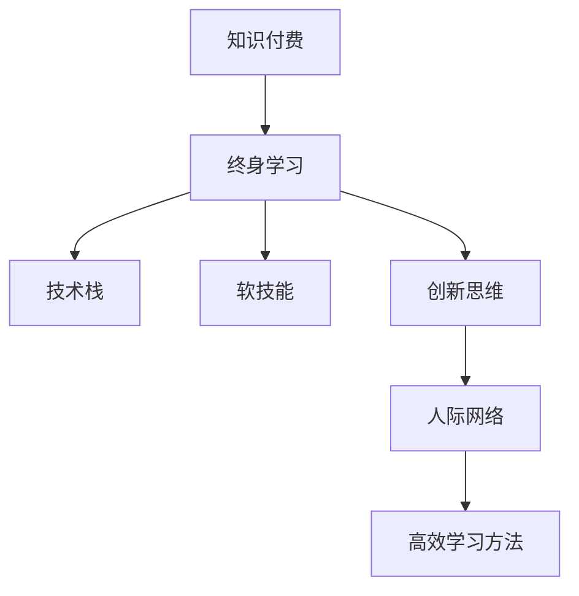

                 

# 知识付费时代程序员的个人发展策略

在数字化经济时代，知识付费正逐渐成为个人成长的主流途径。程序员作为技术和创新工作的核心力量，需要不断适应变化，提升自我，以保持竞争力。本文旨在深入探讨知识付费时代程序员的个人发展策略，帮助他们更好地规划职业道路，实现自我价值。

## 1. 背景介绍

### 1.1 问题由来
随着互联网和技术的快速发展，信息获取和知识传播变得更为便捷，人们对于知识的付费意愿也日益增强。程序员作为技术创新的核心力量，更需要不断学习和更新，保持技术领先。知识付费平台如慕课、Coursera、Udemy等，为程序员提供了丰富的学习资源。

### 1.2 问题核心关键点
知识付费时代，程序员的个人发展策略应围绕以下几个关键点展开：
- 技术栈的持续更新
- 软技能的全面提升
- 创新思维的培养
- 人际网络的拓展
- 高效学习方法的掌握

这些核心点涵盖了技术深度、广度，软技能和团队协作等多方面能力，旨在全面提升程序员的综合竞争力。

### 1.3 问题研究意义
在知识付费时代，程序员通过系统学习最新技术，持续提升专业能力，可以有效应对技术更新带来的挑战，推动技术创新，实现个人价值最大化。同时，知识付费也为程序员提供了灵活的学习方式，可以根据自己的节奏和时间安排进行学习，平衡工作与学习，提升生活质量。

## 2. 核心概念与联系

### 2.1 核心概念概述

为更好地理解知识付费时代程序员的个人发展策略，本节将介绍几个密切相关的核心概念：

- **知识付费**：指用户为获取专业知识和技能而支付费用的行为。这种模式打破了传统教育的局限，推动了终身学习的理念。

- **终身学习**：指个体在整个职业生涯中不断获取新知识和技能，提升自我能力的理念。

- **技术栈**：指程序员掌握的各种编程语言、框架、库等技术工具的集合。

- **软技能**：指沟通能力、团队协作、项目管理、时间管理等非技术性能力。

- **创新思维**：指创造性思考和解决问题的能力，包括跨领域学习、逆向思维、设计思维等。

- **人际网络**：指个人在职业生涯中建立的专业联系和社交关系网，对职业发展有重要影响。

- **高效学习方法**：指能够最大化效率和效果的学习方法，包括主动学习、刻意练习、自适应学习等。

这些核心概念之间的逻辑关系可以通过以下Mermaid流程图来展示：



这个流程图展示了一系列核心概念之间的逻辑联系：

1. 知识付费推动终身学习。
2. 终身学习中包含技术栈、软技能、创新思维等内容的全面提升。
3. 创新思维引导人际网络的拓展。
4. 高效学习方法支撑技术栈、软技能的提升。

## 3. 核心算法原理 & 具体操作步骤
### 3.1 算法原理概述

知识付费时代程序员的个人发展策略，本质上是一种持续学习和自我提升的算法过程。其核心思想是通过知识付费平台获取系统、全面的学习资源，结合高效的学习方法，不断更新技术栈，提升软技能，培养创新思维，拓展人际网络，最终实现个人价值最大化。

### 3.2 算法步骤详解

以下是知识付费时代程序员个人发展策略的具体操作步骤：

**Step 1: 明确目标与需求**
- 自我评估当前技术栈和软技能水平，确定需要提升的领域。
- 根据职业目标，确定知识付费平台和课程选择。

**Step 2: 选择知识付费平台和课程**
- 选择与职业目标高度相关的平台和课程，如Udemy、Coursera、慕课等。
- 课程选择要具体、系统，覆盖技术栈、软技能和创新思维等多个方面。

**Step 3: 制定学习计划**
- 根据课程难度和自身时间安排，制定合理的学习计划。
- 设定阶段性目标，如掌握一门新技术、完成一个实际项目等。

**Step 4: 实施学习计划**
- 按照计划执行课程学习，定期回顾和测试。
- 加入学习社区，与其他学员交流讨论，互相帮助。

**Step 5: 实践和应用**
- 通过项目实践或开源项目，将学到的知识应用到实际工作中。
- 在实践中发现问题，解决问题，提升技能。

**Step 6: 评估与调整**
- 定期评估学习效果，调整学习策略和方法。
- 持续关注技术发展趋势，更新知识体系。

### 3.3 算法优缺点

知识付费时代程序员的个人发展策略具有以下优点：
1. 灵活高效。可以根据个人时间安排进行学习，提升学习效率。
2. 系统全面。课程内容涵盖技术栈、软技能等多个方面，全面提升个人能力。
3. 多样选择。知识付费平台众多，提供丰富的课程选择。
4. 持续提升。知识付费模式推动持续学习，提升个人终身竞争力。

同时，该策略也存在一定的局限性：
1. 经济成本。高质量的知识付费资源往往价格较高，对经济有较大负担。
2. 缺乏系统性指导。有些课程质量参差不齐，缺乏系统性指导，可能导致学习效果不佳。
3. 自律要求高。需要高度自律，才能坚持系统学习，避免拖延。
4. 信息过载。课程数量众多，信息过载可能导致选择困难。

尽管存在这些局限性，但知识付费时代为程序员提供了良好的学习资源和环境，通过科学规划和个人努力，可以显著提升职业竞争力。

### 3.4 算法应用领域

知识付费时代程序员的个人发展策略，已经在多个领域得到应用，例如：

- 软件开发：通过学习新的编程语言、框架、工具，提升开发效率和质量。
- 数据分析：通过学习数据科学、统计学等知识，提升数据分析能力。
- 项目管理：通过学习项目管理、沟通技巧等软技能，提升团队协作效率。
- 创新创业：通过学习跨领域知识，推动创新思维，实现技术创业。

这些应用领域展示了知识付费时代程序员在各行业中的广泛应用，体现了知识付费模式的价值和重要性。

## 4. 数学模型和公式 & 详细讲解 & 举例说明

### 4.1 数学模型构建

知识付费时代程序员的个人发展策略，可以通过以下数学模型进行量化描述：

假设程序员当前技术栈和软技能水平为 $T_0$，创新思维为 $C_0$，人际网络为 $N_0$，高效学习率为 $E$。在经过 $n$ 个时间单位后，设其技术栈、软技能、创新思维和人际网络提升为 $T_n$、$C_n$、$N_n$。则有：

$$
T_n = T_0 + n \times \text{学习效率} \times \text{技术提升率}
$$

$$
C_n = C_0 + n \times \text{学习效率} \times \text{软技能提升率}
$$

$$
N_n = N_0 + n \times \text{学习效率} \times \text{人际网络拓展率}
$$

$$
E = \text{自主学习率} + \text{社区互动率} + \text{项目实践率}
$$

### 4.2 公式推导过程

以上公式中，学习效率、技术提升率、软技能提升率、人际网络拓展率和高效学习方法可以分别表示为：

$$
\text{学习效率} = \text{有效学习时间} / \text{时间单位}
$$

$$
\text{技术提升率} = \text{掌握新技术的课程数} / \text{学习总数}
$$

$$
\text{软技能提升率} = \text{掌握软技能课程数} / \text{学习总数}
$$

$$
\text{人际网络拓展率} = \text{参与社区交流次数} / \text{学习总数}
$$

$$
\text{自主学习率} = \text{自学时间占比}
$$

$$
\text{社区互动率} = \text{在线交流时间占比}
$$

$$
\text{项目实践率} = \text{实际项目时间占比}
$$

通过这些公式，可以对知识付费时代程序员的个人发展进行量化评估和优化。

### 4.3 案例分析与讲解

以学习Python语言为例，分析知识付费时代程序员个人发展策略的应用：

**Step 1: 明确目标与需求**
- 目标：在一年内掌握Python编程基础和常用库，如Pandas、NumPy、Django等。
- 需求：需要购买Udemy上的Python课程。

**Step 2: 选择知识付费平台和课程**
- 选择Udemy上的Python for Data Science and Machine Learning Bootcamp课程。

**Step 3: 制定学习计划**
- 每月学习10-20小时，分为每日学习1小时。
- 完成课程后，进行实际项目练习，如数据清洗、数据分析、Web开发等。

**Step 4: 实施学习计划**
- 每周定期完成课程任务，进行代码练习和项目实践。
- 加入Python学习社区，与其他学员交流讨论，解决遇到的问题。

**Step 5: 实践和应用**
- 在实际项目中应用学到的知识，提升项目开发能力。
- 定期复盘，总结学习经验，调整学习策略。

**Step 6: 评估与调整**
- 每季度评估学习效果，调整学习计划。
- 持续关注Python社区，更新技术栈，提升竞争力。

通过以上步骤，可以系统、高效地掌握Python语言，提升开发能力，实现个人职业发展目标。

## 5. 项目实践：代码实例和详细解释说明

### 5.1 开发环境搭建

在知识付费平台选择和课程学习前，需要搭建好学习环境，以下是基本配置步骤：

1. 安装编程环境：如Anaconda、Miniconda等，安装Python、NumPy、Pandas等库。
2. 注册知识付费平台账号，订阅Python课程。
3. 创建学习计划和笔记，记录学习进度和收获。

### 5.2 源代码详细实现

假设学习目标是掌握Python语言基础，以下是学习Python的详细代码实例：

```python
# 安装Python及其依赖库
!pip install python numpy pandas sklearn matplotlib

# 学习Python基础语法
# 安装并运行Python基础语法课程

# 学习Pandas数据处理
# 安装并运行Pandas数据处理课程

# 学习NumPy科学计算
# 安装并运行NumPy科学计算课程

# 学习机器学习算法
# 安装并运行机器学习算法课程

# 实践项目
import pandas as pd
import numpy as np

# 加载数据
data = pd.read_csv('data.csv')

# 数据清洗
data.dropna(inplace=True)

# 数据分析
mean = data.mean()
print(mean)

# 数据可视化
import matplotlib.pyplot as plt
plt.plot(data['time'], data['value'])
plt.show()
```

### 5.3 代码解读与分析

以上代码展示了Python基础语法、Pandas数据处理、NumPy科学计算和机器学习算法的学习过程，以及如何通过实践项目将学到的知识应用到实际问题中。代码注释详细解释了每个步骤的目的和实现方法，有助于理解学习过程。

### 5.4 运行结果展示

运行以上代码，可以得到数据清洗后的统计结果和数据可视化图表。通过实践项目，可以进一步提升Python编程能力，巩固所学知识。

## 6. 实际应用场景

### 6.1 软件开发

在软件开发中，知识付费时代程序员可以通过系统学习新技术和框架，提升开发效率和代码质量。例如，通过学习JavaScript、React、Vue等前端技术，提升Web开发能力；学习Python、Flask、Django等后端技术，提升Web应用开发能力；学习TensorFlow、PyTorch等深度学习框架，提升人工智能应用开发能力。

### 6.2 数据分析

数据分析领域，知识付费时代程序员可以通过学习统计学、数据科学、机器学习等知识，提升数据处理、分析和建模能力。例如，通过学习Python、Pandas、NumPy等数据处理库，提升数据清洗、分析和可视化能力；学习TensorFlow、PyTorch等深度学习框架，提升机器学习和模型训练能力。

### 6.3 项目管理

项目管理领域，知识付费时代程序员可以通过学习项目管理、沟通技巧、敏捷开发等软技能，提升团队协作效率和项目管理能力。例如，通过学习Scrum、Kanban等敏捷开发方法，提升团队协作效率；学习沟通技巧和项目管理工具，提升项目管理能力。

### 6.4 创新创业

创新创业领域，知识付费时代程序员可以通过学习跨领域知识，推动创新思维，实现技术创业。例如，通过学习金融、市场、法律等知识，提升创业项目的多维度理解；学习技术创新和商业模式设计，推动技术创业。

### 6.5 未来应用展望

随着知识付费模式的持续发展，知识付费时代程序员的个人发展策略也将不断演进，未来可能呈现以下趋势：

1. **跨学科融合**：知识付费将更加注重跨学科学习，推动复合型人才的培养。例如，将人工智能、金融、医疗等领域知识融合，推动跨领域技术应用。

2. **个性化学习**：知识付费平台将更加注重个性化推荐和学习路径设计，根据用户兴趣和需求推荐课程，提升学习效果。

3. **虚拟现实和增强现实**：知识付费将结合VR/AR技术，提供沉浸式学习体验，提升学习效果和体验。

4. **社交化学习**：知识付费平台将更加注重社区互动和社交学习，推动学习效果的提升。

## 7. 工具和资源推荐

### 7.1 学习资源推荐

为帮助程序员系统掌握知识付费时代的个人发展策略，这里推荐一些优质的学习资源：

1. Coursera上的《Python for Everybody》课程：适合零基础学员，系统学习Python基础语法。
2. Udemy上的《Complete Python Bootcamp》课程：适合有一定编程基础的学员，系统学习Python编程语言。
3. edX上的《Data Science MicroMasters》课程：适合希望提升数据科学能力的学员，系统学习数据处理、分析和建模。
4. Codecademy上的《Learn Python》课程：适合快速入门Python的学员，互动式学习编程语言。
5. Pluralsight上的《Python Fundamentals》课程：适合深入学习Python的学员，掌握高级编程技巧。

通过对这些资源的学习实践，相信你一定能够系统掌握知识付费时代程序员的个人发展策略，提升职业竞争力。

### 7.2 开发工具推荐

高效的开发离不开优秀的工具支持。以下是几款用于知识付费时代程序员学习的常用工具：

1. Anacoda：Python集成开发环境，支持Python及其相关库的安装和管理。
2. Jupyter Notebook：支持Python编程和数据处理，互动式编程体验，方便学习笔记的记录和共享。
3. GitHub：全球最大的代码托管平台，支持代码版本控制和协作，方便项目管理和分享。
4. Git：版本控制系统，支持代码的集中管理和版本控制，方便团队协作和代码复用。
5. Docker：容器化技术，支持开发环境的快速部署和迁移，方便跨平台学习和项目部署。

合理利用这些工具，可以显著提升知识付费时代程序员的学习效率和项目实践能力。

### 7.3 相关论文推荐

知识付费时代的个人发展策略研究，可以从以下几篇论文中获取更多启发：

1. "A Comparison of Online Learning Platforms: Udemy, Coursera, and edX" - Nielsen & Katz (2021)
2. "Learning Analytics in Online Learning: A Review" - Hwang & Liu (2020)
3. "The Rise of Remote Learning: Challenges and Opportunities" - Choi & Kim (2021)
4. "Adaptive Learning in Online Education: A Review" - Zhu & Ma (2020)
5. "Empirical Analysis of Online Learning Platforms: User Behavior and Performance" - Li & Xu (2021)

这些论文代表了大规模在线学习的研究趋势和最新进展，可以为知识付费时代程序员提供宝贵的理论支持和实践指导。

## 8. 总结：未来发展趋势与挑战

### 8.1 研究成果总结

知识付费时代程序员的个人发展策略，已经取得了一系列研究成果，主要体现在以下几个方面：

1. 技术栈更新：通过系统学习新编程语言、框架和工具，提升开发效率和质量。
2. 软技能提升：通过学习沟通、团队协作、项目管理等技能，提升职业竞争力。
3. 创新思维培养：通过跨领域学习，推动创新思维，实现技术创业。
4. 人际网络拓展：通过社区互动和项目实践，拓展人际网络，提升职业发展机会。

这些研究成果为知识付费时代程序员的个人发展提供了方向和方法，促进了技术人才的全面成长。

### 8.2 未来发展趋势

展望未来，知识付费时代程序员的个人发展策略将呈现以下几个发展趋势：

1. **技术栈多样化**：随着新技术的不断涌现，程序员需要不断更新技术栈，掌握更多编程语言和工具。
2. **软技能全面化**：除了技术能力，软技能如沟通、协作、领导力等，将更加受到重视。
3. **创新思维广泛化**：跨领域学习和创新思维的培养，将推动更多创新应用的产生。
4. **人际网络泛化**：跨行业、跨领域的交流和合作，将为程序员带来更多的职业机会和发展空间。
5. **学习方式多样化**：VR/AR、社交化学习等新学习方式将逐渐普及，提升学习效果和体验。

这些趋势凸显了知识付费时代程序员个人发展的广阔前景，为职业成长提供了更多可能性。

### 8.3 面临的挑战

尽管知识付费时代为程序员提供了良好的发展机会，但在实践中仍面临诸多挑战：

1. **经济成本高**：高质量的知识付费资源往往价格较高，可能超出一些程序员的经济承受能力。
2. **信息过载**：知识付费平台课程数量众多，选择困难，可能导致学习效果不佳。
3. **自律要求高**：学习需要高度自律，缺乏自律可能导致学习进度缓慢，难以坚持。
4. **知识更新快**：技术更新速度快，知识付费课程可能无法及时跟上最新技术趋势。

尽管存在这些挑战，但知识付费时代为程序员提供了便捷的学习资源和灵活的学习方式，通过科学规划和个人努力，可以克服这些障碍，实现自我提升。

### 8.4 研究展望

未来，知识付费时代程序员的个人发展策略研究，还需要在以下几个方面进行深入探索：

1. **个性化学习路径设计**：根据学员的职业目标和兴趣，设计个性化学习路径，提升学习效果。
2. **跨学科融合**：推动跨学科学习，提升综合素质和创新能力。
3. **虚拟现实和增强现实**：结合VR/AR技术，提供沉浸式学习体验，提升学习效果。
4. **社交化学习**：促进社区互动和知识共享，提升学习效率和体验。

这些研究方向将进一步推动知识付费时代程序员的个人发展策略，实现职业成长和创新应用的突破。

## 9. 附录：常见问题与解答

**Q1: 如何选择合适的知识付费平台？**

A: 选择知识付费平台时，应考虑平台课程质量、讲师资质、学员评价等因素。优先选择课程内容系统、丰富，讲师资质高，学员评价好的平台。

**Q2: 如何高效利用知识付费资源？**

A: 制定学习计划，合理分配时间。优先学习系统性课程，掌握基础知识。通过项目实践，巩固所学知识。加入学习社区，与其他学员交流讨论。

**Q3: 如何平衡学习与工作？**

A: 制定合理的学习计划，将学习时间纳入日程。利用碎片时间进行学习，如上下班路上、午休等。利用高效学习工具，提升学习效率。

**Q4: 如何选择适合自己的课程？**

A: 根据职业目标和兴趣选择课程。优先选择系统性课程，掌握基础知识。通过课程预览和学员评价，选择适合自己的课程。

**Q5: 如何应对知识更新快的挑战？**

A: 持续关注技术发展趋势，及时更新知识体系。订阅相关技术博客、论坛和社区，获取最新技术动态。参加行业会议和培训，拓展知识面。

通过以上常见问题的解答，相信你可以更好地应对知识付费时代程序员个人发展的挑战，实现职业成长和创新应用。

