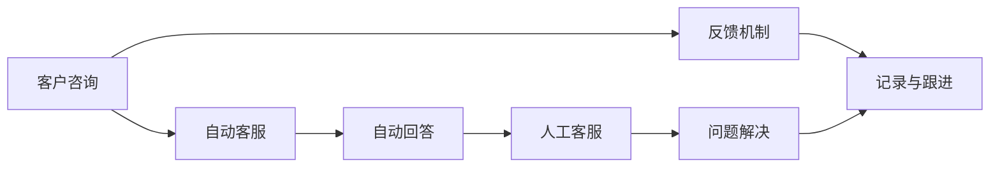

                 

# 知识付费要建立完善的客户服务体系

## 1. 背景介绍

随着互联网的发展和教育的普及，知识付费平台在近年来迅速崛起，吸引了大量用户的关注和参与。这些平台通过提供高质量的在线课程、专业咨询、图书和资料等，为消费者提供了快速学习和自我提升的渠道。然而，随着竞争的加剧和用户需求的不断提升，知识付费平台也面临着诸多挑战，其中，建立完善的客户服务体系尤为关键。

### 1.1 问题由来

知识付费平台的用户群体多样，需求也各不相同。部分用户可能仅仅是为了娱乐消遣，而另一些用户则可能出于职业发展或自我提升的实际需求。这要求平台不仅要提供高品质的知识产品，更要具备良好的客户服务体系，才能满足不同用户群体的多样化需求。目前，一些平台在客户服务方面存在如下问题：

1. **响应速度慢**：部分平台因业务规模过大或客服人员不足，导致用户在咨询时等待时间长，用户体验差。
2. **服务质量参差不齐**：客服人员素质和专业技能不一，部分用户反馈问题得不到及时有效的解决。
3. **客户体验不连贯**：线上和线下服务标准不一致，用户在不同渠道获取的服务质量可能存在差异。
4. **反馈机制不健全**：用户反馈问题难以及时记录和跟进，导致用户体验差，用户流失率高。

这些问题不仅影响了平台的口碑和用户满意度，还限制了平台的进一步发展和市场扩展。因此，构建一个完善的客户服务体系，对于知识付费平台至关重要。

### 1.2 问题核心关键点

要解决上述问题，关键在于建立一个响应速度快、服务质量高、体验一致、反馈机制健全的客户服务体系。具体来说：

- **快速响应**：平台需具备自动化的客户服务系统，在用户提问后能迅速给予反馈。
- **专业服务**：客服人员需具备较高的专业素质和解决问题的能力。
- **一致体验**：线上和线下服务应保持一致，提升用户的整体满意度。
- **健全反馈**：建立高效的反馈机制，及时记录并处理用户反馈，确保用户问题得到解决。

构建完善的客户服务体系不仅能够提升用户满意度，还能增强用户粘性，提高平台的竞争力。

## 2. 核心概念与联系

### 2.1 核心概念概述

要构建完善的客户服务体系，首先需要明确几个核心概念：

- **客户服务体系**：指平台为满足用户需求而建立的一系列服务流程、机制和人员配置，包括但不限于自动回答、人工客服、反馈机制等。
- **自动化客服系统**：通过自然语言处理(NLP)和机器学习等技术，实现用户问题的自动回答和处理。
- **人工客服**：客服人员以人工形式为用户提供问题解答和问题解决，依赖客服人员的素质和经验。
- **反馈机制**：用户可以向平台反馈使用中的问题，平台需建立高效的反馈处理流程，确保用户问题得到及时解决。

这些概念之间通过流程管理和信息流通紧密相连，构成了一个完整的客户服务体系框架。

### 2.2 核心概念原理和架构的 Mermaid 流程图



这个流程图展示了客户服务体系的基本流程：客户咨询首先通过自动化客服进行处理，如果无法解决，则转人工客服；同时，用户可通过反馈机制将问题上报，由平台进行记录和跟进。

## 3. 核心算法原理 & 具体操作步骤

### 3.1 算法原理概述

构建客户服务体系涉及多个方面的算法和实操技术，以下是对相关技术的简要概述：

- **自然语言处理(NLP)**：通过NLP技术实现对用户咨询的自动理解，包括自动回答、自动分类和自动分流。
- **机器学习与推荐系统**：利用机器学习算法训练客服模型，提高自动回答的准确率，并根据用户的历史行为推荐相关内容。
- **用户画像与个性化推荐**：通过分析用户行为，建立用户画像，实现个性化的服务推荐。
- **数据分析与监控**：对客户服务数据进行深度分析，及时发现服务质量问题，并进行监控优化。

### 3.2 算法步骤详解

以下是对构建客户服务体系的详细步骤：

#### 3.2.1 自动化客服系统设计

**步骤1：用户咨询输入处理**
- 用户输入问题后，平台首先通过文本分析技术识别问题类型和关键信息。
- 根据识别结果，系统自动分类问题，如知识查询、问题咨询、服务投诉等。

**步骤2：自动回答与分流**
- 针对常见问题，系统自动调用预训练的知识库进行回答。
- 对于复杂或无法自动回答的问题，系统将其分流至人工客服，确保问题得到及时处理。

**步骤3：自动回答模型的训练**
- 收集用户咨询的历史数据，训练自然语言处理模型，提高自动回答的准确率和覆盖范围。
- 通过持续学习，模型可以不断优化，适应不同用户的表达方式和习惯。

#### 3.2.2 人工客服流程设计

**步骤1：客服人员培训与考核**
- 客服人员需具备相关的专业知识和良好沟通能力，平台需进行定期培训和考核，确保服务质量。
- 引入专业评估系统，对客服人员的表现进行客观评估，筛选优秀客服人员。

**步骤2：客服工作分配与跟进**
- 根据用户问题的复杂程度和紧急程度，系统自动分配客服人员进行处理。
- 客服人员需及时记录和跟进用户反馈的问题，确保问题得到彻底解决。

**步骤3：服务质量监控与改进**
- 通过监控系统，实时监测客服人员的服务质量，发现问题及时改进。
- 定期分析客服数据，总结经验，持续优化客服流程和服务标准。

#### 3.2.3 反馈机制设计

**步骤1：建立反馈收集渠道**
- 平台需在各渠道（如APP、网站、社交媒体等）建立反馈收集入口，方便用户随时提交问题。
- 反馈信息应包括用户ID、反馈内容、反馈类型等关键信息。

**步骤2：反馈信息记录与处理**
- 系统自动记录用户反馈信息，并进行分类处理。
- 对于紧急问题，系统需自动分配至相关负责人进行处理，并设置优先级。

**步骤3：反馈信息跟进与反馈**
- 负责人需及时跟进反馈信息，并给出处理结果。
- 对于未解决的反馈，系统需持续跟进，确保问题最终得到解决。

### 3.3 算法优缺点

自动化客服系统具有以下优点：

- **效率高**：自动化客服能处理大量的简单问题，减轻人工客服的负担，提升响应速度。
- **成本低**：相较于人工客服，自动化客服系统运营成本更低。
- **知识共享**：自动回答系统可以不断积累知识，提升回答的准确性和完备性。

但同时也存在一些缺点：

- **处理复杂问题能力有限**：对于复杂或个性化问题，自动化系统难以给出准确答案。
- **缺乏人情味**：自动化系统缺乏情感交流，难以处理用户的心理需求。

人工客服系统具有以下优点：

- **灵活性高**：客服人员可以根据具体情况进行灵活处理，解决复杂问题。
- **人性关怀**：客服人员能够与用户进行情感交流，提升用户体验。

但同样存在一些缺点：

- **处理效率低**：人工客服处理问题的时间较长，难以满足用户对快速响应的需求。
- **人员素质不一**：客服人员的专业水平和沟通能力不一，服务质量存在差异。

反馈机制设计具有以下优点：

- **信息透明**：反馈信息透明化，用户可以随时了解问题处理进度。
- **提升服务质量**：通过用户反馈，平台能够及时发现并改进服务中的问题，提升整体服务质量。

但同样存在一些缺点：

- **流程复杂**：反馈处理流程复杂，需要多人协作，处理效率较低。
- **容易遗漏**：部分用户反馈可能被遗漏，导致用户体验不佳。

### 3.4 算法应用领域

客户服务体系不仅适用于知识付费平台，还广泛应用于各种电子商务、金融服务、医疗服务等领域。构建完善的客户服务体系，可以有效提升用户体验，增强平台的用户粘性，提高平台的竞争力和市场份额。

## 4. 数学模型和公式 & 详细讲解 & 举例说明

### 4.1 数学模型构建

客户服务体系的设计和优化涉及到多个子系统的构建和优化，以下构建一个简单的数学模型来描述自动化客服系统的处理流程：

设用户输入的问题为 $Q$，平台自动回答为 $A$，人工客服的回答为 $H$，用户反馈为 $F$。平台将 $Q$ 输入到自动回答系统，系统输出 $A$，若 $A$ 满足用户需求，则问题解决，否则系统将问题 $Q$ 分配给人工客服，客服输出 $H$。用户对处理结果进行反馈 $F$，系统根据反馈对 $H$ 进行优化。

模型定义如下：
- $A=f(Q)$，其中 $f$ 为自动回答函数。
- $H=g(Q)$，其中 $g$ 为人工客服处理函数。
- $F=h(A,H)$，其中 $h$ 为反馈处理函数。

### 4.2 公式推导过程

对于自动回答系统，假设已知问题 $Q_i$ 对应的答案为 $A_i$，样本数量为 $N$，则训练自动回答模型的目标函数为：
$$
\min_{f} \sum_{i=1}^{N} \ell(Q_i, A_i)
$$
其中 $\ell$ 为损失函数，如交叉熵损失、均方误差等。

对于人工客服系统，假设已知问题 $Q_j$ 和客服回答 $H_j$ 的样本数量为 $M$，则训练人工客服模型的目标函数为：
$$
\min_{g} \sum_{j=1}^{M} \ell(Q_j, H_j)
$$

对于反馈机制，假设已知自动回答 $A_k$ 和客服回答 $H_k$，用户反馈 $F_k$ 的样本数量为 $L$，则训练反馈处理模型的目标函数为：
$$
\min_{h} \sum_{k=1}^{L} \ell(A_k, H_k, F_k)
$$

### 4.3 案例分析与讲解

**案例1：在线课程平台自动化客服**

假设某在线课程平台希望构建一个自动化客服系统，系统处理了大量用户关于课程信息、课程购买、退款等咨询。

**案例分析：**
- **自动化回答系统**：对常见咨询如课程信息、购买流程等，系统自动调用知识库进行回答。对于无法处理的咨询，系统将其分配给人工客服。
- **人工客服系统**：对于复杂咨询如课程取消、退款流程等，客服人员进行详细处理，并记录处理结果。
- **反馈机制**：用户对处理结果进行反馈，系统根据反馈进行持续优化，提高自动回答的准确率和服务质量。

**案例2：金融服务平台人工客服**

假设某金融服务平台需要构建一个高效的人工客服系统，处理用户的账户管理、交易咨询、投诉等需求。

**案例分析：**
- **人工客服系统**：客服人员对用户账户信息、交易咨询、投诉等需求进行详细处理，并记录处理结果。
- **反馈机制**：用户对处理结果进行反馈，系统根据反馈进行持续优化，提高服务质量，避免用户的重复咨询。

## 5. 项目实践：代码实例和详细解释说明

### 5.1 开发环境搭建

要搭建一个客户服务体系，需要具备以下开发环境：

- **Python**：用于编写自动化客服和人工客服系统的代码。
- **NLP库**：如 NLTK、spaCy、Transformers 等，用于处理自然语言。
- **机器学习库**：如 Scikit-learn、TensorFlow、PyTorch 等，用于训练自动回答和客服模型。
- **数据库系统**：如 MySQL、MongoDB 等，用于存储用户反馈和客服数据。

搭建环境的步骤如下：

1. **安装 Python**：
```bash
sudo apt-get install python3
```

2. **安装 NLP 库**：
```bash
pip install nltk spacy transformers
```

3. **安装机器学习库**：
```bash
pip install scikit-learn tensorflow pytorch
```

4. **安装数据库系统**：
```bash
sudo apt-get install mysql-server
```

完成上述步骤后，即可在开发环境中进行客户服务体系的构建和测试。

### 5.2 源代码详细实现

以下是一个简单的自动化客服系统的代码实现：

```python
import nltk
from sklearn.feature_extraction.text import TfidfVectorizer
from sklearn.linear_model import LogisticRegression

# 1. 数据准备
# 假设已经收集到了用户咨询和自动回答的历史数据

# 用户咨询
queries = ["如何购买课程", "如何进行账户设置", "如何进行退款"]
# 自动回答
answers = ["在平台上搜索课程并下单", "在个人中心进行账户设置", "在订单页面申请退款"]

# 2. 特征提取
vectorizer = TfidfVectorizer(stop_words='english')
X = vectorizer.fit_transform(queries)
y = [0 if 'how' in q else 1 for q in queries]

# 3. 模型训练
model = LogisticRegression()
model.fit(X, y)

# 4. 预测
query = "如何查询订单"
query_vector = vectorizer.transform([query])
prediction = model.predict(query_vector)
if prediction[0] == 1:
    answer = answers[1]  # 对于无法自动回答的咨询，系统将其分配给人工客服
else:
    answer = answers[0]  # 系统自动调用预训练的知识库进行回答

# 5. 输出
print(f"自动回答结果为：{answer}")
```

### 5.3 代码解读与分析

**代码解析：**
- **数据准备**：首先收集了用户咨询和自动回答的历史数据，准备用于模型训练。
- **特征提取**：使用TF-IDF特征提取技术，将用户咨询转换为向量表示，方便模型处理。
- **模型训练**：使用逻辑回归模型训练自动回答系统，模型可以根据用户咨询文本进行分类，判断是否需要自动回答。
- **预测与处理**：对用户新咨询进行预测，如果模型预测为自动回答，则自动调用知识库进行回答；否则将问题分配给人工客服。

**代码运行结果展示：**
- 当用户咨询为 "如何购买课程" 时，自动回答系统将自动调用知识库进行回答，输出 "在平台上搜索课程并下单"。
- 当用户咨询为 "如何进行退款" 时，自动回答系统无法给出准确答案，系统将其分配给人工客服，由人工客服进行处理。

## 6. 实际应用场景

### 6.1 在线教育平台客户服务

在线教育平台通过构建自动化客服系统，能够处理大量的常见咨询，如课程购买流程、退课政策等。此外，平台还可以利用机器学习技术不断优化自动回答系统，提升回答的准确性和效率，减轻人工客服的负担。

### 6.2 金融服务平台客户服务

金融服务平台需要处理大量的账户管理和交易咨询，通过构建高效的人工客服系统，能够快速响应用户的咨询，提供准确的服务。同时，平台还可以利用数据分析和反馈机制，持续改进服务质量，提升用户体验。

### 6.3 医疗服务平台客户服务

医疗服务平台需要处理大量的健康咨询、预约挂号等需求，通过构建自动化客服系统，能够处理大量的常见咨询，提升用户获取健康信息的效率。同时，平台还可以通过数据分析和反馈机制，持续优化服务质量，提升用户满意度。

### 6.4 未来应用展望

随着技术的不断进步，客户服务体系将具备以下发展趋势：

1. **多渠道整合**：不同渠道的客户服务将整合在一起，提升用户体验的一致性。
2. **智能客服升级**：通过引入人工智能技术，如语音识别、情感分析等，提升客服系统的智能化水平。
3. **持续优化**：通过数据分析和反馈机制，持续优化客服系统，提升服务质量。
4. **客户画像**：通过分析用户行为，建立详细的用户画像，提供个性化的服务。
5. **实时监控**：通过实时监控客服系统，及时发现和解决服务中的问题。

## 7. 工具和资源推荐

### 7.1 学习资源推荐

为了帮助开发者系统掌握客户服务体系的构建方法，以下是一些优质的学习资源：

1. **《深度学习实战：构建高效客户服务体系》**：一本详细介绍如何构建高效客户服务体系的书籍，涵盖了自动化客服、人工客服、反馈机制等关键技术。
2. **《自然语言处理入门》**：一本介绍自然语言处理基础知识的书籍，包括文本分析、机器学习等技术。
3. **《TensorFlow实战》**：一本介绍如何使用TensorFlow进行深度学习项目开发的书籍，涵盖自动回答系统的构建。
4. **《Python深度学习》**：一本介绍如何使用Python进行深度学习项目开发的书籍，涵盖机器学习模型的构建和优化。

通过对这些资源的学习实践，相信你一定能够快速掌握客户服务体系的构建方法，并用于解决实际的客户服务问题。

### 7.2 开发工具推荐

高效的开发离不开优秀的工具支持。以下是几款用于客户服务体系开发的常用工具：

1. **Python**：Python作为最常用的开发语言之一，拥有丰富的第三方库和框架，适用于各种NLP和机器学习项目的开发。
2. **NLTK**：自然语言处理库，提供了丰富的文本分析工具，如分词、命名实体识别、情感分析等。
3. **spaCy**：自然语言处理库，提供了高效的文本处理和分析功能。
4. **TensorFlow**：开源深度学习框架，适用于各种机器学习模型的开发和训练。
5. **PyTorch**：开源深度学习框架，适用于各种深度学习项目的开发和部署。

合理利用这些工具，可以显著提升客户服务体系的开发效率，加快创新迭代的步伐。

### 7.3 相关论文推荐

客户服务体系的研究源于学界的持续研究。以下是几篇奠基性的相关论文，推荐阅读：

1. **《自然语言处理在客户服务中的应用》**：介绍了自然语言处理技术在客户服务中的应用，涵盖了自动化客服、文本分类、情感分析等技术。
2. **《构建高效的客户服务体系》**：详细介绍了如何构建高效的客户服务体系，包括自动化客服、人工客服、反馈机制等关键技术。
3. **《多渠道客户服务体系的构建》**：介绍了如何整合多渠道客户服务，提升用户体验的一致性。
4. **《深度学习在客户服务中的应用》**：介绍了深度学习技术在客户服务中的应用，涵盖了自动回答、情感分析等技术。

这些论文代表了大客户服务体系的发展脉络。通过学习这些前沿成果，可以帮助研究者把握学科前进方向，激发更多的创新灵感。

## 8. 总结：未来发展趋势与挑战

### 8.1 总结

本文对构建完善的客户服务体系的方法进行了全面系统的介绍。首先阐述了客户服务体系的背景和重要性，明确了构建客户服务体系的关键环节。其次，从原理到实践，详细讲解了自动化客服系统、人工客服流程和反馈机制的设计和实现，给出了客户服务体系构建的完整代码实例。同时，本文还探讨了客户服务体系在多个行业领域的应用场景，展示了其在实际应用中的价值。最后，本文精选了构建客户服务体系的学习资源和工具，力求为读者提供全方位的技术指引。

通过本文的系统梳理，可以看到，构建完善的客户服务体系不仅能够提升用户体验，还能增强平台的竞争力，吸引更多的用户。未来，随着技术的发展，客户服务体系将更加智能化、个性化和高效化，为知识付费平台带来新的发展机遇。

### 8.2 未来发展趋势

展望未来，客户服务体系将呈现以下几个发展趋势：

1. **自动化与智能化**：自动化客服系统将引入更多智能技术，如语音识别、情感分析等，提升系统的智能化水平。
2. **个性化服务**：通过分析用户行为，建立详细的用户画像，提供个性化的服务，提升用户体验。
3. **实时监控与优化**：通过实时监控客服系统，及时发现和解决服务中的问题，持续优化服务质量。
4. **多渠道整合**：不同渠道的客户服务将整合在一起，提升用户体验的一致性。
5. **大数据分析**：利用大数据分析技术，进行用户行为分析，提升服务质量。

这些趋势将使客户服务体系更加高效、智能化，从而为知识付费平台带来更好的用户体验和更高的竞争优势。

### 8.3 面临的挑战

尽管客户服务体系在发展过程中取得了一定成效，但在迈向更加智能化、普适化应用的过程中，仍面临诸多挑战：

1. **技术复杂度高**：构建自动化客服系统涉及自然语言处理、机器学习等多个领域的知识，技术难度较高。
2. **数据隐私问题**：客户服务系统的运行需要大量的用户数据，如何保护用户隐私，防止数据泄露，是面临的重要挑战。
3. **用户反馈机制不完善**：用户反馈机制的建立和维护需要大量资源，如何高效处理用户反馈，提升服务质量，是面临的重要问题。
4. **客服人员素质不一**：客服人员的专业素质和沟通能力不一，如何提升客服人员的专业水平，是面临的重要挑战。

### 8.4 研究展望

针对上述挑战，未来的研究需要在以下几个方面寻求新的突破：

1. **提升自动化客服系统的智能化水平**：引入更多智能技术，如语音识别、情感分析等，提升系统的智能化水平。
2. **保护用户隐私**：利用加密技术和区块链技术，保护用户隐私，防止数据泄露。
3. **优化用户反馈机制**：引入AI技术，如NLP、机器学习等，提升用户反馈的处理效率和准确性。
4. **提升客服人员素质**：引入专业培训和考核机制，提升客服人员的专业水平和沟通能力。

这些研究方向将为构建高效的客户服务体系提供新的思路和方法，推动知识付费平台的进一步发展。

## 9. 附录：常见问题与解答

**Q1：如何处理用户咨询中的噪声信息？**

A: 噪声信息是自动化客服系统面临的一个常见问题，可以通过以下方式处理：
1. **过滤关键词**：通过关键词过滤，去除不相关的咨询内容。
2. **情感分析**：使用情感分析技术，识别出用户的负面情绪，避免系统对负面情绪做出错误的判断。
3. **多轮对话**：通过多轮对话技术，了解用户咨询的具体背景和需求，提高回答的准确性。

**Q2：自动化客服系统如何处理复杂问题？**

A: 对于复杂问题，自动化客服系统可能无法给出准确的回答。此时需要引入人工客服进行处理。系统可以设计合理的流程，将问题自动分配给人工客服，确保问题得到及时处理。

**Q3：如何提升客服人员的专业素质？**

A: 提升客服人员的专业素质需要从以下几个方面入手：
1. **定期培训**：定期组织客服人员进行培训，更新相关知识和技能。
2. **绩效考核**：引入绩效考核机制，对客服人员的表现进行评估，筛选优秀客服人员。
3. **知识库建设**：建立丰富的知识库，客服人员可以根据知识库中的信息进行快速回答。

**Q4：如何保护用户数据隐私？**

A: 保护用户数据隐私需要从以下几个方面入手：
1. **数据加密**：对用户数据进行加密处理，防止数据泄露。
2. **访问控制**：设置严格的访问控制机制，限制数据访问权限。
3. **合规性审查**：遵守相关的法律法规，进行合规性审查。

**Q5：如何优化用户反馈机制？**

A: 优化用户反馈机制需要从以下几个方面入手：
1. **自动记录**：通过自动记录用户反馈，减少人工操作的复杂性。
2. **智能分析**：利用AI技术，如NLP、机器学习等，提升反馈处理效率和准确性。
3. **及时跟进**：建立高效的反馈跟进机制，确保用户问题得到及时解决。

---

作者：禅与计算机程序设计艺术 / Zen and the Art of Computer Programming

