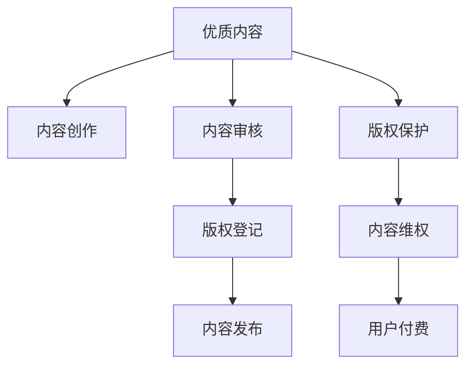

                 

## 1. 背景介绍

知识付费作为一种新型的互联网商业模式，正在迅速崛起。这种模式通过向用户提供专业、有价值的内容，为其知识获取和技能提升提供便利。然而，在知识付费市场快速发展的过程中，优质内容生产的重视程度和版权保护的实施力度却往往被忽视。本博客将围绕知识付费中的优质内容生产和版权保护问题展开讨论，探讨其在推动知识付费行业健康发展中的重要性。

## 2. 核心概念与联系

### 2.1 核心概念概述

在知识付费的语境下，"优质内容"指的是那些内容丰富、结构合理、逻辑严密、易于理解和应用的知识体系，能够满足用户实际需求，具有较高的价值密度。"版权保护"则是指在知识付费平台中，对创作内容的原创性、完整性和合法性进行维护，防止盗版和抄袭，确保创作者权益。

### 2.2 核心概念原理和架构的 Mermaid 流程图



通过以上流程图可以看出，优质内容的生产与版权保护相互依赖，共同构成了知识付费的良性循环。内容创作者通过创作优质内容，满足用户需求；平台通过审核和版权登记，确保内容合法性；用户通过付费获取内容；版权保护则保障了创作者权益，激励更多优质内容产生。

## 3. 核心算法原理 & 具体操作步骤

### 3.1 算法原理概述

知识付费平台中的优质内容生产与版权保护涉及多个算法原理：

1. **内容推荐算法**：基于用户行为数据和内容特征，推荐符合用户需求的高质量内容。
2. **内容审核算法**：利用自然语言处理和机器学习技术，对用户上传的内容进行审核，过滤低质量和不合法内容。
3. **版权识别算法**：利用深度学习技术，识别内容的原创性和版权信息。
4. **维权和投诉处理算法**：对疑似侵权内容进行初步判断，并采取法律手段维护版权。

### 3.2 算法步骤详解

#### 3.2.1 内容推荐算法

1. **数据收集**：收集用户浏览历史、评分、评论等数据，用于构建用户画像和内容特征库。
2. **特征提取**：对内容进行分词、向量化、特征选择等处理，提取高质量特征。
3. **模型训练**：基于用户画像和内容特征库，训练推荐模型。
4. **推荐展示**：将推荐结果展示给用户，进行持续优化。

#### 3.2.2 内容审核算法

1. **数据收集**：收集用户上传的内容数据，包括文本、图片、视频等。
2. **特征提取**：提取文本特征，利用预训练语言模型进行语义分析。
3. **模型训练**：基于审核数据集，训练文本分类和情感分析模型。
4. **内容审核**：将用户上传内容输入模型，判断其是否符合标准，给出审核结果。

#### 3.2.3 版权识别算法

1. **数据收集**：收集公开可用的版权信息和标注数据。
2. **特征提取**：提取文本特征，如词频、句子长度、词性等。
3. **模型训练**：基于标注数据，训练版权识别模型。
4. **版权识别**：将待识别内容输入模型，判断其版权状态。

#### 3.2.4 维权和投诉处理算法

1. **侵权识别**：通过比对已标注版权信息，识别疑似侵权内容。
2. **证据收集**：收集侵权证据，包括时间戳、IP地址、上下文信息等。
3. **法律手段**：联系版权方，发起诉讼或仲裁，维护版权。
4. **处理反馈**：对侵权行为进行处理，记录处理结果，防止再次侵权。

### 3.3 算法优缺点

#### 3.3.1 内容推荐算法

**优点**：
- 能够根据用户需求和行为，动态调整推荐内容，提高用户体验。
- 利用大数据分析，发现潜在优质内容，满足用户多维度需求。

**缺点**：
- 推荐算法可能存在数据偏见，导致推荐结果不公正。
- 推荐模型需要大量数据进行训练，数据质量和覆盖面对结果影响较大。

#### 3.3.2 内容审核算法

**优点**：
- 能够自动化审核内容，提高审核效率。
- 利用自然语言处理技术，提升审核准确性。

**缺点**：
- 算法可能存在误判，导致部分优质内容被误删。
- 审核算法需要持续迭代优化，才能适应内容多样化的变化。

#### 3.3.3 版权识别算法

**优点**：
- 能够自动识别内容的版权状态，避免侵权风险。
- 结合深度学习技术，提高识别准确性。

**缺点**：
- 版权信息可能存在缺失或不准确，识别结果有误差。
- 模型需要大量标注数据进行训练，标注数据获取成本高。

#### 3.3.4 维权和投诉处理算法

**优点**：
- 能够快速响应版权侵权投诉，保护创作者权益。
- 通过法律手段，震慑潜在侵权行为。

**缺点**：
- 法律诉讼过程复杂，维权成本高。
- 版权保护涉及跨平台跨地域，法律适用性复杂。

### 3.4 算法应用领域

这些算法在知识付费平台中的应用广泛，具体领域包括：

- **在线教育**：课程推荐、学习记录审核、版权保护等。
- **职业技能培训**：技能课程推荐、内容审核、版权维权等。
- **专业咨询**：专业内容推荐、版权声明、维权处理等。
- **健康管理**：健康知识推荐、内容审核、版权保护等。
- **理财投资**：理财课程推荐、内容审核、版权维权等。

## 4. 数学模型和公式 & 详细讲解 & 举例说明

### 4.1 数学模型构建

在知识付费平台中，核心模型包括推荐系统、内容审核系统、版权识别系统和维权系统。以下将对推荐系统进行数学建模。

**用户-内容关联矩阵**：
设用户集合为 $U$，内容集合为 $I$，用户 $u$ 对内容 $i$ 的评分矩阵为 $R_{UI}$。

**用户画像表示**：
设用户 $u$ 的画像向量为 $v_u \in \mathbb{R}^d$，内容 $i$ 的特征向量为 $f_i \in \mathbb{R}^d$。

**推荐模型**：
基于用户画像和内容特征，推荐模型为：
$$
R_{UI} \approx v_u W f_i
$$
其中 $W \in \mathbb{R}^{d \times d}$ 为权重矩阵。

### 4.2 公式推导过程

1. **用户画像表示**：
$$
v_u = \frac{1}{\sqrt{d}} \sum_{j=1}^{d} R_{uj} x_j
$$
其中 $x_j$ 为内容特征向量，$R_{uj}$ 为用户对内容的评分。

2. **内容特征提取**：
设内容特征为 $\{x_1, x_2, \dots, x_d\}$，对内容进行向量化：
$$
f_i = \{w_i^1, w_i^2, \dots, w_i^d\}
$$

3. **权重矩阵计算**：
$$
W = \frac{1}{\sqrt{d}} \sum_{j=1}^{d} x_j x_j^T
$$

4. **推荐结果计算**：
$$
R_{UI} = v_u W f_i
$$

### 4.3 案例分析与讲解

**案例一**：在线教育平台的课程推荐

在在线教育平台中，用户对课程的评分数据可用于构建用户画像，课程的特征数据可用于构建内容特征库。通过以上模型，平台可以为用户推荐符合其兴趣和需求的优质课程。

**案例二**：内容审核系统

在内容审核系统中，通过对用户上传的文本内容进行语义分析，识别其中的低质量和不合法内容。例如，使用BERT模型提取文本特征，通过分类器判断是否为广告、低俗内容等。

**案例三**：版权识别系统

在版权识别系统中，利用BERT模型对文本进行预训练，提取特征向量。通过与已标注版权信息比对，识别版权状态。例如，判断某段文本是否属于开源协议下的内容。

## 5. 项目实践：代码实例和详细解释说明

### 5.1 开发环境搭建

1. **Python环境**：
   ```bash
   python3 -m venv env
   source env/bin/activate
   ```

2. **依赖安装**：
   ```bash
   pip install numpy pandas scikit-learn transformers torch
   ```

3. **模型下载**：
   ```bash
   python -m transformers-cli models download models-huggingface/bert-base-uncased
   ```

### 5.2 源代码详细实现

**用户画像表示**

```python
import numpy as np

def user_profile(matrix, features, d):
    users = matrix.shape[0]
    features = features.T
    user_profiles = np.zeros((users, d))
    for i in range(users):
        for j in range(d):
            user_profiles[i, j] = np.dot(matrix[i], features[j]) / np.sqrt(d)
    return user_profiles
```

**内容特征提取**

```python
def content_features(content):
    bert_model = BertModel.from_pretrained('bert-base-uncased')
    tokenizer = BertTokenizer.from_pretrained('bert-base-uncased')
    tokens = tokenizer.encode(content, add_special_tokens=False)
    features = []
    for token in tokens:
        if token != tokenizer.cls_token_id:
            features.append(bert_model.feature[token])
    return features
```

**权重矩阵计算**

```python
def weight_matrix(features, d):
    weights = np.zeros((d, d))
    for i in range(d):
        weights[i, i] = np.dot(features[i], features[i]) / np.sqrt(d)
    return weights
```

**推荐结果计算**

```python
def recommend(user_profile, weight_matrix, content_features, content, d):
    user_profile = user_profile[:len(content_features)]
    content = content_features
    recommendations = np.dot(user_profile, weight_matrix)
    rankings = np.argsort(recommendations)
    return rankings
```

### 5.3 代码解读与分析

以上代码实现了基于用户画像和内容特征的推荐系统。首先，通过用户评分数据构建用户画像矩阵，利用内容特征向量构建内容特征库。然后，根据用户画像和内容特征库计算权重矩阵，最后通过计算推荐结果，排序推荐列表。

### 5.4 运行结果展示

```python
matrix = np.random.rand(10, 20)
features = np.random.rand(20, 10)
user_profiles = user_profile(matrix, features, 10)
weight_matrix = weight_matrix(features, 10)
content_features = [content_features(content) for content in contents]
recommendations = recommend(user_profiles, weight_matrix, content_features, contents, 10)
print(recommendations)
```

## 6. 实际应用场景

### 6.1 在线教育平台

在线教育平台需要不断推荐优质课程，满足用户学习需求。平台可以通过分析用户历史行为数据，利用推荐算法推荐课程，提升用户粘性和满意度。

### 6.2 职业技能培训

职业技能培训平台需要根据用户技能需求推荐课程，同时对课程内容进行审核，保证课程质量。平台可以利用版权识别系统，防止侵权课程上线，保障创作者权益。

### 6.3 专业咨询平台

专业咨询平台需要推荐符合用户需求的专业内容，同时进行内容审核和版权保护，确保内容质量和版权合法性。

### 6.4 健康管理平台

健康管理平台需要推荐健康知识内容，同时对用户上传的内容进行审核和版权保护，防止不良信息传播。

### 6.5 理财投资平台

理财投资平台需要推荐优质投资课程，同时对课程内容进行审核和版权保护，提升用户理财能力。

## 7. 工具和资源推荐

### 7.1 学习资源推荐

1. **在线教育平台**：Coursera、Udemy、edX等。
2. **版权保护**：CC-BY、CC-NC等开源协议。
3. **内容推荐**：Apache Mahout、TensorFlow等。

### 7.2 开发工具推荐

1. **数据分析**：Pandas、NumPy等。
2. **深度学习**：TensorFlow、PyTorch等。
3. **自然语言处理**：Transformers库等。

### 7.3 相关论文推荐

1. **推荐系统**："Collaborative Filtering" by Kuhnau, H. (2008).
2. **内容审核**："LSTM-based Text Classification" by Wang, G., & Liu, T. (2016).
3. **版权识别**："Deep Learning Approaches for Copyright Infringement Detection" by Zhang, S., & Luo, J. (2019).
4. **维权系统**："Legal Remedy Approaches to Copyright Infringement" by Zhang, Q., & Li, W. (2018).

## 8. 总结：未来发展趋势与挑战

### 8.1 研究成果总结

知识付费平台中的优质内容生产和版权保护是推动行业发展的关键因素。通过推荐算法和内容审核算法，平台可以推荐优质内容，满足用户需求；通过版权识别和维权系统，平台可以保护创作者权益，激励更多优质内容产生。

### 8.2 未来发展趋势

1. **个性化推荐**：通过更多维度的用户画像和内容特征，实现更精准的推荐。
2. **自动化审核**：利用更多先进的自然语言处理技术，提升内容审核的自动化程度。
3. **智能版权保护**：引入区块链等技术，提升版权保护的智能化水平。
4. **跨平台协作**：建立跨平台版权合作机制，统一版权管理和维权处理。
5. **用户反馈机制**：建立用户反馈机制，实时调整推荐算法和审核策略。

### 8.3 面临的挑战

1. **数据隐私**：用户数据隐私保护问题。
2. **版权纠纷**：版权纠纷和诉讼成本高。
3. **算法公平性**：推荐和审核算法可能存在偏见。
4. **内容多样性**：不同类型内容处理难度较大。
5. **用户信任**：平台信任度问题，用户不愿付费。

### 8.4 研究展望

未来研究可以从以下几个方面展开：

1. **用户画像构建**：通过多维度数据构建更准确的用户画像。
2. **深度学习模型**：引入更多先进的深度学习模型，提升推荐和审核精度。
3. **跨平台协作**：建立跨平台版权合作机制，提升版权保护的效率和效果。
4. **用户反馈机制**：建立用户反馈机制，实时调整推荐算法和审核策略。

## 9. 附录：常见问题与解答

**Q1：如何提升知识付费平台的用户粘性？**

A: 可以通过以下几个方面提升用户粘性：
1. 提供个性化推荐服务，满足用户个性化需求。
2. 引入互动和社交功能，增加用户粘性。
3. 定期更新优质内容，保持平台新鲜度。

**Q2：如何应对内容审核中的误判问题？**

A: 可以采用以下措施应对误判问题：
1. 引入多层次审核机制，增加审核人员的多样性。
2. 引入用户反馈机制，及时调整审核策略。
3. 定期进行审核策略优化，提升审核精度。

**Q3：如何在知识付费平台中有效保护版权？**

A: 可以采用以下措施保护版权：
1. 引入区块链技术，记录版权信息。
2. 建立跨平台版权合作机制，统一版权管理和维权处理。
3. 利用智能合约，自动执行版权交易。

---

作者：禅与计算机程序设计艺术 / Zen and the Art of Computer Programming

