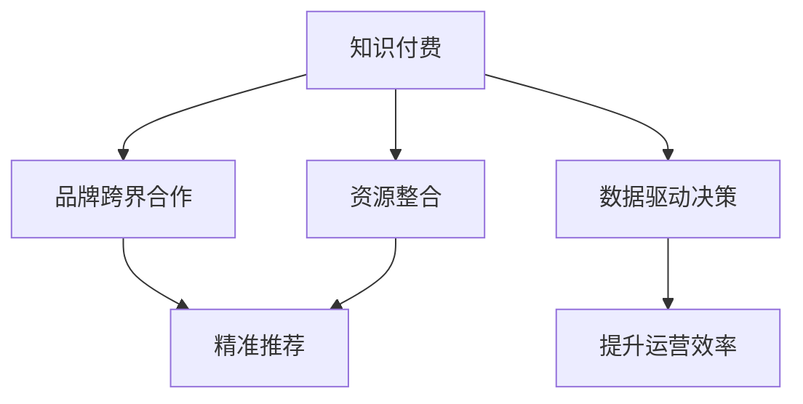

                 

# 知识付费赚钱的品牌跨界合作与资源整合策略

## 1. 背景介绍

### 1.1 问题由来
随着互联网的普及和知识的爆炸式增长，知识付费行业日益兴起，成为许多人获取高质量教育资源的重要渠道。然而，由于内容质量和获取成本的差异，知识付费平台和内容提供商的盈利模式和合作模式也面临着严峻的挑战。

一方面，内容提供商面临着高质量内容创作的瓶颈，难以持续稳定输出优质的课程、文章等知识产品。另一方面，知识付费平台面临着内容版权和用户获取成本的压力，难以找到差异化的商业模式和盈利点。

在这种情况下，品牌跨界合作与资源整合成为一种有效的解决方案，既能提升内容质量，又能优化用户获取成本，从而实现共赢。

### 1.2 问题核心关键点
品牌跨界合作与资源整合的核心在于，通过多品牌合作和资源共享，实现知识资源的高效整合与再利用。具体而言，包括以下几个关键点：

- 多方资源整合：集各家之所长，提供多元化、高品质的知识产品。
- 精准用户匹配：通过算法推荐，将合适的内容推荐给最合适的人群。
- 数据驱动决策：利用用户行为数据，指导内容优化和平台运营。
- 模式创新突破：探索知识付费的新模式，提升用户满意度和平台盈利能力。

## 2. 核心概念与联系

### 2.1 核心概念概述

为更好地理解品牌跨界合作与资源整合策略，本节将介绍几个密切相关的核心概念：

- 知识付费：通过在线付费的方式，获取高质量、专业化的教育资源。
- 品牌跨界合作：指不同行业品牌之间的合作，通过优势互补，实现共赢。
- 资源整合：指将分散的资源集中起来，进行有效的规划和利用，以提升整体效率和效益。
- 精准推荐：通过算法分析用户行为和需求，实现个性化推荐，提升用户满意度和粘性。
- 数据驱动决策：利用数据进行科学决策，提升运营效率和盈利能力。

这些核心概念之间的逻辑关系可以通过以下Mermaid流程图来展示：



这个流程图展示了两类核心概念及其之间的联系：

1. 知识付费与品牌跨界合作：通过品牌跨界合作，实现知识资源的共享和互补。
2. 资源整合与精准推荐：通过资源整合，实现知识产品的优化和精准推荐。
3. 数据驱动决策与运营效率提升：通过数据分析，指导平台的运营决策和资源配置。

## 3. 核心算法原理 & 具体操作步骤
### 3.1 算法原理概述

品牌跨界合作与资源整合的原理，可以概括为以下三个方面：

1. **多品牌资源整合**：通过整合不同品牌的内容和资源，形成多样化、高品质的知识产品。
2. **精准用户推荐**：利用用户行为数据和推荐算法，将最合适的内容推荐给最合适的人。
3. **数据驱动决策**：利用用户行为数据，指导内容优化和平台运营，提升整体效率和效益。

### 3.2 算法步骤详解

品牌跨界合作与资源整合的步骤如下：

1. **品牌选择与合作**：选择具有高品牌价值和内容生产能力的合作伙伴，进行跨界合作。

2. **内容整合与优化**：整合不同品牌的内容，进行差异化处理和内容优化，确保内容的品质和适用性。

3. **平台搭建与用户推荐**：搭建知识付费平台，实现用户行为数据的采集和分析，利用推荐算法进行精准推荐。

4. **数据驱动决策**：通过用户行为数据，指导内容优化和平台运营，提升整体效率和效益。

### 3.3 算法优缺点

品牌跨界合作与资源整合具有以下优点：

1. **多元化内容**：通过多品牌合作，提供多样化的知识产品，满足用户不同的需求。
2. **高效整合资源**：实现资源的共享和优化，减少内容创作的重复劳动，提升内容创作效率。
3. **精准用户推荐**：通过数据分析，实现个性化推荐，提升用户满意度和粘性。

同时，该方法也存在一定的局限性：

1. **品牌协同困难**：不同品牌之间的合作，需要协调沟通，存在一定的协同难度。
2. **数据隐私问题**：用户行为数据的收集和分析，涉及隐私问题，需要严格的数据保护措施。
3. **用户推荐偏差**：推荐算法可能存在偏差，导致某些用户群体获取不到合适的知识产品。

### 3.4 算法应用领域

品牌跨界合作与资源整合主要应用于以下几个领域：

- 教育培训：通过跨界合作，提供更加多样化和专业的教育资源，满足不同用户的需求。
- 职业发展：提供行业前沿的课程和文章，帮助用户提升职业技能。
- 健康医疗：提供健康管理、疾病预防等方面的知识产品，提升用户健康素养。
- 金融理财：提供理财知识、投资策略等方面的知识产品，帮助用户提升财务素养。
- 生活娱乐：提供日常生活、休闲娱乐等方面的知识产品，提升用户的生活质量。

## 4. 数学模型和公式 & 详细讲解  
### 4.1 数学模型构建

品牌跨界合作与资源整合的数学模型可以概括为以下几个方面：

1. **品牌选择与合作模型**：定义品牌的质量、内容生产能力等属性，通过多目标优化模型选择最优合作伙伴。
2. **内容整合与优化模型**：定义内容的质量、适用性等属性，通过线性规划等优化模型实现内容的整合与优化。
3. **用户推荐模型**：定义用户的行为特征、偏好等属性，通过协同过滤、基于内容的推荐等算法实现精准推荐。
4. **数据驱动决策模型**：定义用户行为数据的特征、影响等属性，通过回归分析、聚类分析等方法指导内容优化和平台运营。

### 4.2 公式推导过程

以下以用户推荐模型为例，推导协同过滤推荐算法的公式。

设用户$u$对$n$个商品$v$的评分矩阵为$R_{u \times v}$，用户$u$对商品$v$的评分$R_{uv}$。推荐系统希望找到用户$u$最感兴趣的$k$个商品$v$。

协同过滤推荐算法的基本思路是找到与用户$u$最相似的其他用户$w$，并计算商品$v$在用户$w$上的评分$R_{wv}$，作为推荐给用户$u$的评分。推荐模型为：

$$
\hat{R}_{uv}=\sum_{w \in N_u} \alpha_w \frac{\sum_{v \in V} R_{wv} R_{uv}}{\sqrt{\sum_{v \in V} R_{wv}^2} \sqrt{\sum_{v \in V} R_{uv}^2}}
$$

其中$N_u$为与用户$u$相似的其他用户集合，$\alpha_w$为相似度系数。

### 4.3 案例分析与讲解

以一个教育培训平台为例，分析品牌跨界合作与资源整合的应用。

假设该平台与三家品牌（ABC）合作，提供教育课程和资料。平台希望通过合作，实现知识产品的多样化，并提升用户的满意度。

1. **品牌选择与合作**：平台选择ABC品牌合作，ABC品牌分别提供基础课程、进阶课程和实战课程。

2. **内容整合与优化**：平台将ABC品牌的课程进行整合，去除重复和低质量的内容，增加个性化和实用性的内容。同时，平台根据用户反馈，进行内容优化和更新。

3. **平台搭建与用户推荐**：平台搭建用户推荐系统，利用协同过滤和基于内容的推荐算法，为用户推荐最合适的课程。推荐算法根据用户的行为数据（如浏览、点击、评分等），计算用户与课程之间的相似度，推荐最匹配的课程。

4. **数据驱动决策**：平台利用用户行为数据，进行数据分析和用户画像构建，指导课程内容和平台的运营决策。例如，通过分析用户的行为数据，发现某类课程的访问量增加，平台可以及时增加该类课程的推广和内容更新。

## 5. 项目实践：代码实例和详细解释说明
### 5.1 开发环境搭建

在进行品牌跨界合作与资源整合实践前，我们需要准备好开发环境。以下是使用Python进行Django开发的环境配置流程：

1. 安装Anaconda：从官网下载并安装Anaconda，用于创建独立的Python环境。

2. 创建并激活虚拟环境：
```bash
conda create -n myenv python=3.8 
conda activate myenv
```

3. 安装Django：使用pip安装Django框架及其相关依赖。
```bash
pip install django
```

4. 安装NLP库：使用pip安装Natural Language Toolkit（NLTK）、spaCy等NLP工具库，用于文本处理和推荐算法实现。
```bash
pip install nltk spacy
```

5. 安装第三方推荐库：使用pip安装scikit-learn、pandas等第三方推荐库，用于实现协同过滤、基于内容的推荐等算法。
```bash
pip install scikit-learn pandas
```

完成上述步骤后，即可在`myenv`环境中开始品牌跨界合作与资源整合的实践。

### 5.2 源代码详细实现

下面我们以一个简单的推荐系统为例，给出使用Django进行品牌跨界合作与资源整合的代码实现。

首先，定义推荐系统的数据模型：

```python
from django.db import models

class User(models.Model):
    id = models.AutoField(primary_key=True)
    name = models.CharField(max_length=50)
    age = models.IntegerField()
    gender = models.CharField(max_length=10)
    # 其他用户属性...

class Course(models.Model):
    id = models.AutoField(primary_key=True)
    name = models.CharField(max_length=100)
    description = models.TextField()
    # 其他课程属性...

class UserCourse(models.Model):
    user = models.ForeignKey(User, on_delete=models.CASCADE)
    course = models.ForeignKey(Course, on_delete=models.CASCADE)
    rating = models.FloatField()
    timestamp = models.DateTimeField(auto_now_add=True)
    # 用户课程评分关系...
```

然后，定义推荐算法：

```python
from sklearn.metrics.pairwise import cosine_similarity
from sklearn.feature_extraction.text import TfidfVectorizer

class RecommendationEngine:
    def __init__(self):
        self.vectorizer = TfidfVectorizer(stop_words='english')
        self.similarity_matrix = None
    
    def fit(self, courses):
        # 计算课程之间的相似度
        X = self.vectorizer.fit_transform([course.description for course in courses])
        self.similarity_matrix = cosine_similarity(X)
    
    def predict(self, user, top_n=5):
        # 计算用户与课程的相似度
        X = self.vectorizer.transform([course.description for course in user.course_set.all()])
        similarity = cosine_similarity(X, self.similarity_matrix)
        
        # 计算推荐结果
        recommendations = []
        for course, score in zip(user.course_set.all(), similarity[0]):
            recommendations.append((course, score))
        
        # 排序推荐结果
        recommendations.sort(key=lambda x: x[1], reverse=True)
        
        # 返回前n个推荐结果
        return [recommendation[0] for recommendation in recommendations[:top_n]]
```

最后，定义推荐视图：

```python
from django.shortcuts import render
from .models import User, Course
from .recommendation_engine import RecommendationEngine

def home(request):
    user = request.user
    recommendations = RecommendationEngine().predict(user)
    
    # 渲染推荐结果
    return render(request, 'home.html', {'recommendations': recommendations})
```

以上就是一个简单的品牌跨界合作与资源整合的代码实现。可以看到，通过Django和第三方推荐库，可以较为简洁地实现推荐系统。

### 5.3 代码解读与分析

让我们再详细解读一下关键代码的实现细节：

**UserCourse模型**：
- 定义了用户和课程之间的评分关系，用于存储用户对课程的评分数据。

**RecommendationEngine类**：
- `fit`方法：通过TF-IDF向量化和余弦相似度计算，得到课程之间的相似度矩阵。
- `predict`方法：计算用户与课程之间的相似度，返回最匹配的课程列表。

**home视图**：
- 根据用户对象，调用推荐引擎进行推荐，并将推荐结果传递给前端页面。

**home模板**：
- 渲染推荐结果，展示给用户。

可以看到，Django和第三方推荐库使得品牌跨界合作与资源整合的代码实现变得简洁高效。开发者可以将更多精力放在业务逻辑和数据处理上，而不必过多关注底层的实现细节。

当然，实际系统的实现还需考虑更多因素，如推荐算法的优化、用户隐私保护等。但核心的推荐范式基本与此类似。

## 6. 实际应用场景
### 6.1 教育培训平台

品牌跨界合作与资源整合技术，可以广泛应用于教育培训平台的知识产品推荐和优化。

教育培训平台往往面临着内容多样性和用户个性化需求的双重挑战。品牌跨界合作与资源整合技术，通过多品牌内容整合和精准推荐，可以极大地提升平台的知识产品质量和用户满意度。

例如，某教育平台与三家品牌（ABC）合作，提供数学、英语、编程课程。平台通过数据分析和推荐算法，为用户推荐最匹配的课程，提升学习效果。同时，平台还可以根据用户的学习数据，进行个性化推荐和课程优化。

### 6.2 电商零售平台

电商零售平台也面临着内容多样性和用户个性化需求的双重挑战。品牌跨界合作与资源整合技术，通过多品牌商品整合和精准推荐，可以提升用户的购物体验和平台转化率。

例如，某电商平台与三家品牌（ABC）合作，提供电子产品、服装、美妆等商品。平台通过数据分析和推荐算法，为用户推荐最匹配的商品，提升购物体验。同时，平台还可以根据用户的浏览、购买数据，进行个性化推荐和商品优化。

### 6.3 旅游服务平台

旅游服务平台也面临着内容多样性和用户个性化需求的双重挑战。品牌跨界合作与资源整合技术，通过多品牌景点整合和精准推荐，可以提升用户的旅游体验和平台转化率。

例如，某旅游平台与三家品牌（ABC）合作，提供国内、国外、自由行等旅游服务。平台通过数据分析和推荐算法，为用户推荐最匹配的景点和服务，提升旅游体验。同时，平台还可以根据用户的旅游历史和偏好，进行个性化推荐和服务优化。

### 6.4 未来应用展望

随着品牌跨界合作与资源整合技术的发展，其在更多领域的应用前景广阔。

在医疗健康领域，品牌跨界合作与资源整合技术，可以实现健康知识的整合和精准推荐，帮助用户进行健康管理。例如，某医疗平台与三家品牌（ABC）合作，提供健康饮食、运动锻炼、疾病预防等知识产品。平台通过数据分析和推荐算法，为用户推荐最匹配的健康建议，提升健康水平。

在金融理财领域，品牌跨界合作与资源整合技术，可以实现理财知识的整合和精准推荐，帮助用户提升财务素养。例如，某金融平台与三家品牌（ABC）合作，提供投资理财、财务规划、风险管理等知识产品。平台通过数据分析和推荐算法，为用户推荐最匹配的理财建议，提升财务收益。

在生活娱乐领域，品牌跨界合作与资源整合技术，可以实现生活知识的整合和精准推荐，提升用户的生活质量。例如，某生活平台与三家品牌（ABC）合作，提供美食、旅行、时尚等生活知识产品。平台通过数据分析和推荐算法，为用户推荐最匹配的生活建议，提升生活品质。

## 7. 工具和资源推荐
### 7.1 学习资源推荐

为了帮助开发者系统掌握品牌跨界合作与资源整合的理论基础和实践技巧，这里推荐一些优质的学习资源：

1. 《数据科学与机器学习：从算法到实践》系列博文：由数据科学家撰写，深入浅出地介绍了品牌跨界合作与资源整合的基本原理和经典案例。

2. Kaggle Kernels：Kaggle平台提供的数据科学竞赛，涉及品牌跨界合作与资源整合的实际案例，可以从中学习和借鉴。

3. Coursera《机器学习与数据科学》课程：由知名大学和专家开设的机器学习和数据科学课程，涵盖品牌跨界合作与资源整合的多种算法和模型。

4. 《推荐系统原理与实践》书籍：推荐系统领域的经典书籍，全面介绍了品牌跨界合作与资源整合的多种推荐算法和模型。

5. arXiv论文库：包含品牌跨界合作与资源整合的最新研究成果，可以从中获取前沿进展和理论突破。

通过对这些资源的学习实践，相信你一定能够快速掌握品牌跨界合作与资源整合的精髓，并用于解决实际的推荐问题。

### 7.2 开发工具推荐

高效的开发离不开优秀的工具支持。以下是几款用于品牌跨界合作与资源整合开发的常用工具：

1. Django：基于Python的开源Web框架，灵活高效，适合快速迭代研究。

2. Flask：轻量级Web框架，易于扩展和部署。

3. SQLAlchemy：Python的SQL数据库工具，支持多种数据库，方便数据管理和操作。

4. Scikit-learn：Python的机器学习库，包含多种推荐算法和模型，适合品牌跨界合作与资源整合中的数据分析和模型训练。

5. PyTorch：基于Python的深度学习框架，适合复杂推荐模型的训练和优化。

6. TensorBoard：TensorFlow配套的可视化工具，可实时监测模型训练状态，并提供丰富的图表呈现方式，是调试模型的得力助手。

合理利用这些工具，可以显著提升品牌跨界合作与资源整合任务的开发效率，加快创新迭代的步伐。

### 7.3 相关论文推荐

品牌跨界合作与资源整合技术的发展源于学界的持续研究。以下是几篇奠基性的相关论文，推荐阅读：

1. Collaborative Filtering for Implicit Feedback Datasets（协同过滤算法）：通过用户行为数据，实现精准推荐，是品牌跨界合作与资源整合中的经典算法。

2. Content-Based Recommendation Systems（基于内容的推荐算法）：通过分析物品的特征和属性，实现个性化推荐，是品牌跨界合作与资源整合中的另一种重要算法。

3. Multi-Objective Optimization for Recommendation Systems（多目标优化推荐算法）：通过优化多个指标，实现品牌跨界合作与资源整合中的最佳选择。

4. Recommendation Systems with Deep Neural Networks（深度学习推荐算法）：利用深度神经网络，提升推荐算法的精度和效率。

5. Context-Aware Recommendations（上下文感知推荐算法）：通过引入用户、物品、时间等上下文信息，实现更加精准的推荐。

这些论文代表了大品牌跨界合作与资源整合技术的发展脉络。通过学习这些前沿成果，可以帮助研究者把握学科前进方向，激发更多的创新灵感。

## 8. 总结：未来发展趋势与挑战
### 8.1 总结

本文对品牌跨界合作与资源整合方法进行了全面系统的介绍。首先阐述了品牌跨界合作与资源整合的研究背景和意义，明确了多品牌合作与资源整合在提升知识产品品质和用户体验方面的独特价值。其次，从原理到实践，详细讲解了品牌跨界合作与资源整合的数学原理和关键步骤，给出了推荐系统开发的完整代码实例。同时，本文还广泛探讨了品牌跨界合作与资源整合方法在教育培训、电商零售、旅游服务等多个行业领域的应用前景，展示了其广阔的应用前景。此外，本文精选了品牌跨界合作与资源整合技术的各类学习资源，力求为读者提供全方位的技术指引。

通过本文的系统梳理，可以看到，品牌跨界合作与资源整合技术正在成为品牌合作和资源整合的重要范式，极大地拓展了知识付费平台的内容品质和用户体验，催生了更多的落地场景。受益于数据科学和机器学习技术的不断进步，品牌跨界合作与资源整合必将在更多领域大放异彩，深刻影响各行各业的发展。

### 8.2 未来发展趋势

展望未来，品牌跨界合作与资源整合技术将呈现以下几个发展趋势：

1. 数据驱动决策更加深入：通过深度学习和大数据分析，实现更加精准的用户画像和推荐，提升平台运营效率。

2. 个性化推荐更加丰富：利用自然语言处理和语音识别等技术，实现更加多样化的推荐方式，提升用户体验。

3. 多模态推荐更加广泛：融合文本、图像、语音等多模态数据，实现更加全面的推荐，提升推荐质量。

4. 智能推荐更加智能：利用知识图谱和因果推理等技术，实现更加智能化的推荐，提升推荐精度。

5. 推荐系统更加透明：通过可解释性技术和用户反馈机制，提升推荐系统的透明度和可信度。

6. 推荐系统更加安全：通过隐私保护技术和安全认证机制，保障用户数据和推荐系统的安全。

以上趋势凸显了品牌跨界合作与资源整合技术的广阔前景。这些方向的探索发展，必将进一步提升推荐系统的精度和效率，为用户和平台带来更大的价值。

### 8.3 面临的挑战

尽管品牌跨界合作与资源整合技术已经取得了瞩目成就，但在迈向更加智能化、普适化应用的过程中，它仍面临着诸多挑战：

1. 协同难度大：品牌跨界合作需要协调沟通，不同品牌之间的数据格式、业务逻辑等可能存在差异，协同难度较大。

2. 用户隐私保护：品牌跨界合作需要收集和分析大量用户数据，涉及隐私保护问题，需要严格的数据保护措施。

3. 数据质量问题：品牌跨界合作需要高质量的数据支持，数据缺失、噪声等问题会影响推荐效果。

4. 推荐算法复杂：推荐算法涉及深度学习、协同过滤、多目标优化等多种复杂技术，需要高水平的技术团队支持。

5. 推荐效果评估：推荐效果评估涉及多种指标，如准确率、召回率、覆盖率等，需要科学合理的评估标准。

6. 用户体验优化：推荐系统需要与用户界面、应用场景等相结合，提升用户体验。

正视品牌跨界合作与资源整合面临的这些挑战，积极应对并寻求突破，将是大品牌跨界合作与资源整合走向成熟的必由之路。相信随着学界和产业界的共同努力，这些挑战终将一一被克服，品牌跨界合作与资源整合必将在构建人机协同的智能时代中扮演越来越重要的角色。

### 8.4 研究展望

面对品牌跨界合作与资源整合所面临的种种挑战，未来的研究需要在以下几个方面寻求新的突破：

1. 探索更加高效的数据整合和协同方法：利用分布式计算和大数据技术，实现更加高效的品牌跨界合作与资源整合。

2. 研究更加科学合理的推荐算法：结合领域知识，设计更加科学合理的推荐算法，提升推荐精度和效率。

3. 引入更加全面的上下文信息：利用上下文感知技术和多模态数据，实现更加全面、多样化的推荐。

4. 开发更加透明的推荐系统：通过可解释性技术和用户反馈机制，提升推荐系统的透明度和可信度。

5. 强化隐私保护和数据安全：利用隐私保护技术和安全认证机制，保障用户数据和推荐系统的安全。

这些研究方向的探索，必将引领品牌跨界合作与资源整合技术迈向更高的台阶，为构建人机协同的智能系统铺平道路。面向未来，品牌跨界合作与资源整合技术还需要与其他人工智能技术进行更深入的融合，如知识表示、因果推理、强化学习等，多路径协同发力，共同推动自然语言理解和智能交互系统的进步。只有勇于创新、敢于突破，才能不断拓展品牌跨界合作与资源整合的边界，让智能技术更好地造福人类社会。

## 9. 附录：常见问题与解答

**Q1：品牌跨界合作与资源整合是否适用于所有行业领域？**

A: 品牌跨界合作与资源整合适用于多种行业领域，如教育培训、电商零售、旅游服务、金融理财、医疗健康等。通过多品牌合作和资源共享，可以实现知识资源的优化和再利用，提升整体效率和效益。

**Q2：品牌跨界合作与资源整合中的协同难度如何缓解？**

A: 品牌跨界合作中的协同难度可以通过以下方式缓解：

1. 建立合作关系框架：明确品牌合作的业务目标和分工，制定清晰的合作协议。

2. 利用协同平台：建立协同平台，实现数据的共享和协同处理，减少人工沟通成本。

3. 设计标准接口：设计标准的数据接口和业务接口，简化品牌跨界合作的复杂度。

4. 引入第三方协调：引入第三方协调机构或技术平台，协助品牌跨界合作中的沟通和协调。

5. 定期沟通机制：建立定期沟通机制，及时解决合作中的问题和挑战，确保合作顺利进行。

**Q3：品牌跨界合作与资源整合中的隐私保护如何实现？**

A: 品牌跨界合作与资源整合中的隐私保护可以通过以下方式实现：

1. 数据匿名化：对用户数据进行匿名化处理，确保数据无法直接追溯到个人身份。

2. 数据加密：采用数据加密技术，保障数据在传输和存储过程中的安全。

3. 访问控制：采用访问控制机制，确保只有授权用户才能访问敏感数据。

4. 数据审计：建立数据审计机制，监控和记录数据的使用和访问情况。

5. 合规标准：遵循数据保护法规，确保品牌跨界合作与资源整合中的数据处理符合法律法规要求。

**Q4：品牌跨界合作与资源整合中的推荐算法如何优化？**

A: 品牌跨界合作与资源整合中的推荐算法可以通过以下方式优化：

1. 引入深度学习技术：利用深度神经网络，提升推荐算法的精度和效率。

2. 结合领域知识：结合领域知识，设计更加科学合理的推荐算法，提升推荐效果。

3. 多目标优化：通过多目标优化算法，实现品牌跨界合作与资源整合中的最佳选择。

4. 利用上下文信息：利用上下文感知技术和多模态数据，实现更加全面、多样化的推荐。

5. 实时学习：利用在线学习技术，及时更新推荐算法，适应用户需求的变化。

**Q5：品牌跨界合作与资源整合中的用户体验如何优化？**

A: 品牌跨界合作与资源整合中的用户体验可以通过以下方式优化：

1. 个性化推荐：利用用户行为数据和推荐算法，实现个性化推荐，提升用户体验。

2. 多样化的推荐方式：利用自然语言处理和语音识别等技术，实现更加多样化的推荐方式，提升用户体验。

3. 直观的推荐界面：设计直观的推荐界面，使用户能够快速理解推荐结果和操作方式。

4. 及时反馈机制：建立及时反馈机制，根据用户反馈调整推荐算法，提升推荐效果。

5. 透明化的推荐系统：通过可解释性技术和用户反馈机制，提升推荐系统的透明度和可信度。

---

作者：禅与计算机程序设计艺术 / Zen and the Art of Computer Programming

