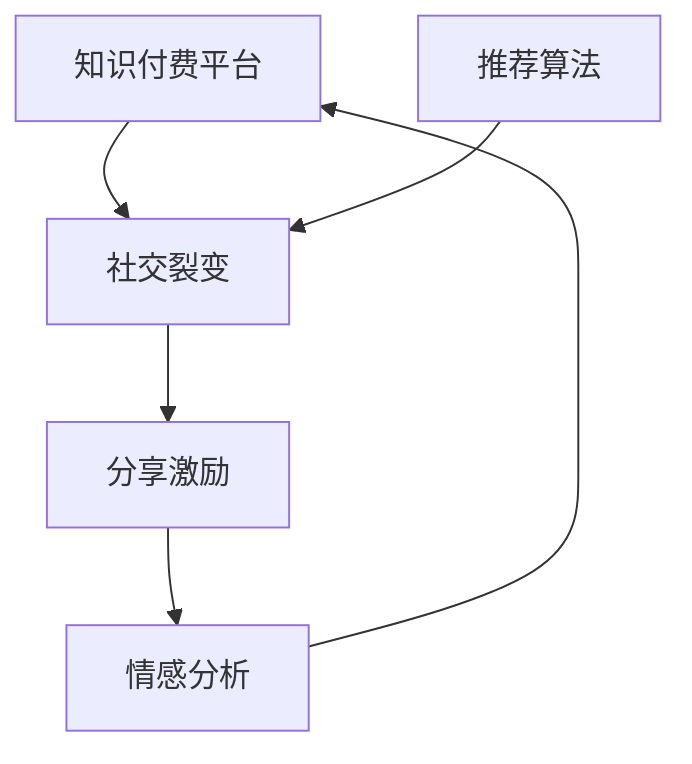

                 

# 知识付费赚钱的用户社交裂变与分享激励机制

> 关键词：知识付费, 社交裂变, 用户激励, 分享机制, 人工智能, 深度学习, 自然语言处理, 数据分析

## 1. 背景介绍

### 1.1 问题由来

在知识付费迅速发展的同时，如何让用户主动参与并分享知识，成为知识付费平台的重要课题。用户若对平台内容感到满意，会通过社交网络进行分享和推荐，进而带动更多人关注和使用平台。然而，若用户缺乏分享动力，平台的活跃度和用户粘性将大打折扣。

基于这一背景，本文将探讨如何通过用户社交裂变和分享激励机制，提高知识付费平台的活跃度和使用率，从而最大化平台收益。

### 1.2 问题核心关键点

本文聚焦于以下核心问题：
- 如何设计激励机制，激发用户分享行为？
- 如何利用社交网络，实现用户裂变？
- 如何评估分享激励的效果，并进行优化？
- 如何结合AI技术，提升社交裂变和分享激励的精准度？

### 1.3 问题研究意义

用户社交裂变与分享激励机制的优化，不仅有助于提升知识付费平台的活跃度和用户粘性，还能够降低用户获取知识的成本，扩大知识传播的广度和深度。对平台而言，更快速、更高效地聚集用户群体，增强用户粘性，提升用户转化率，最终实现收益最大化。

## 2. 核心概念与联系

### 2.1 核心概念概述

为更好地理解用户社交裂变与分享激励机制，本节将介绍几个关键概念：

- **知识付费平台(Knowledge Pay Platform, KPP)**：以付费方式提供知识内容的平台。用户通过支付订阅费或单次购买，获得高价值的知识内容，如在线课程、电子书、音频分享等。

- **社交裂变(Social Referral)**：利用用户的社交网络，通过推荐分享机制，实现用户数量的快速增长。社交裂变能显著降低用户获取知识内容的成本，增强平台的用户粘性。

- **分享激励(Sharing Incentives)**：通过设计合理的分享激励机制，激发用户主动分享知识内容，扩大内容传播范围。常见的分享激励包括金钱奖励、积分兑换、荣誉奖励等。

- **推荐算法(Recommendation Algorithms)**：利用数据分析和机器学习技术，为每个用户推荐其最可能感兴趣的知识内容。推荐算法能显著提高用户满意度和分享意愿。

- **情感分析(Affective Analysis)**：通过自然语言处理技术，分析用户对内容或平台的情感倾向，以优化分享激励机制和社交裂变策略。

这些概念之间的逻辑关系可以通过以下Mermaid流程图来展示：



这个流程图展示了知识付费平台的核心概念及其相互关系：

1. 知识付费平台通过推荐算法为每个用户提供个性化的内容推荐。
2. 社交裂变机制利用用户的社交网络，通过分享激励和情感分析，激发用户主动分享内容。
3. 分享激励则根据用户的反馈，持续优化分享机制，提高用户粘性和平台收益。
4. 情感分析通过分析用户情感，实时调整分享激励策略，确保用户满意度的提升。

这些概念共同构成了一个知识付费平台的用户社交裂变与分享激励机制，旨在通过用户主动分享，最大化平台的知识传播和收益。

## 3. 核心算法原理 & 具体操作步骤

### 3.1 算法原理概述

用户社交裂变与分享激励机制，本质上是一个以推荐算法为核心的多目标优化问题。其核心思想是：

- 通过个性化推荐，提升用户对内容的满意度和认可度。
- 利用社交网络，放大用户对内容推荐的信任度。
- 通过分享激励机制，激发用户主动分享和推荐。

在具体实现上，通常包括以下几个关键步骤：

1. 利用推荐算法，为每个用户推荐其最可能感兴趣的知识内容。
2. 设计分享激励机制，对推荐的内容进行适当奖励，如金钱、积分、荣誉等。
3. 利用情感分析技术，实时监测用户对内容或平台的情感倾向，及时调整分享激励策略。
4. 通过社交网络，实现用户之间的分享和推荐，扩大内容的传播范围。

### 3.2 算法步骤详解

基于推荐算法的多目标优化流程如下：

**Step 1: 准备数据集**

- 收集用户行为数据，包括点击、购买、浏览时长等。
- 收集社交网络数据，包括好友关系、互动历史等。
- 收集内容元数据，包括作者、分类、关键词等。

**Step 2: 构建推荐模型**

- 选择推荐算法模型，如协同过滤、基于内容的推荐、深度学习推荐等。
- 设计特征工程，提取用户行为、兴趣、社交关系等关键特征。
- 训练推荐模型，得到用户对每个内容的评分。

**Step 3: 设计分享激励策略**

- 设计合理的分享激励方案，如金钱奖励、积分兑换、荣誉奖励等。
- 设定分享激励的触发条件，如分享次数、内容评分等。
- 选择合适的激励发放渠道，如APP内奖励、邮箱通知、社交媒体等。

**Step 4: 实现社交裂变**

- 利用用户的社交网络，设计合理的分享机制，鼓励用户向好友推荐优质内容。
- 设计社交网络模型，建立好友关系，追踪分享行为。
- 利用情感分析技术，监测用户对内容的情感倾向，调整分享激励策略。

**Step 5: 优化算法效果**

- 通过A/B测试，评估不同分享激励策略的效果。
- 利用在线学习技术，实时调整推荐算法和分享策略。
- 利用用户反馈，不断优化平台功能和用户体验。

### 3.3 算法优缺点

用户社交裂变与分享激励机制具有以下优点：

- 低成本高效益：社交裂变能够迅速扩大用户群体，提升平台收益，且成本相对较低。
- 用户粘性强：分享激励机制增强用户粘性，提升用户活跃度。
- 推荐精度高：基于推荐算法的内容推荐，能显著提高用户满意度和转化率。

同时，该机制也存在一定的局限性：

- 依赖社交网络：社交裂变的效果依赖于用户的网络规模和活跃度，且可能受到外部网络环境的影响。
- 数据隐私问题：用户数据泄露和隐私保护是必须面对的重要问题。
- 激励失效：长期而言，单纯的物质激励可能导致激励失效，用户分享意愿下降。

### 3.4 算法应用领域

用户社交裂变与分享激励机制在知识付费平台的应用非常广泛，以下是几个典型的应用场景：

- 在线教育平台：通过社交裂变，扩大在线课程的覆盖范围，提升平台注册和付费用户数。
- 专业内容分享平台：如知乎、Coursera等，利用分享激励机制，提升内容质量和用户参与度。
- 阅读应用：如电子书平台，通过社交网络推荐，增加用户阅读量和付费转化率。
- 培训应用：如职业技能培训平台，通过分享激励机制，鼓励用户分享和推荐优质培训资源。

除了上述这些主要应用场景外，社交裂变与分享激励机制还可以应用于更多领域，如智能健身、金融理财、健康管理等，通过知识传播和用户互动，为各行业带来新的价值和机遇。

## 4. 数学模型和公式 & 详细讲解 & 举例说明

### 4.1 数学模型构建

本节将使用数学语言对用户社交裂变与分享激励机制进行更加严格的刻画。

设用户数为 $U$，内容数为 $C$。推荐算法基于用户行为数据，对每个用户 $u \in U$，计算其对每个内容 $c \in C$ 的评分 $r_{uc}$，并按照评分进行排序。

假设社交网络关系可以用邻接矩阵 $G \in [0,1]^{U \times U}$ 表示，其中 $G_{uv} = 1$ 表示用户 $u$ 和用户 $v$ 是好友，否则为 $0$。设每个好友关系 $f_{uv}$ 的权重为 $w_{uv}$，表示好友推荐的可信度。

分享激励机制设金钱奖励为 $R_{uc}$，积分奖励为 $S_{uc}$，荣誉奖励为 $H_{uc}$。

分享激励策略的设计目标为最大化社交裂变和分享激励的总体效果，可表示为：

$$
\mathcal{O} = \max_{r_{uc},w_{uv}}\sum_{u \in U} \sum_{v \in U} r_{uc} \times w_{uv} \times \left( \frac{R_{uc}}{w_{uv}} + \frac{S_{uc}}{w_{uv}} + \frac{H_{uc}}{w_{uv}} \right)
$$

### 4.2 公式推导过程

以下我们以金钱奖励为例，推导最大化社交裂变和分享激励的数学公式。

设用户 $u$ 对内容 $c$ 的评分 $r_{uc} = \phi_u(c)$，其中 $\phi_u$ 为推荐算法输出的评分函数。设用户 $v$ 对内容 $c$ 的评分 $r_{vc} = \psi_v(c)$，其中 $\psi_v$ 为社交网络推荐的评分函数。

金钱奖励的优化目标为：

$$
\max_{\phi_u, \psi_v, w_{uv}} \sum_{u \in U} \sum_{v \in U} r_{uc} \times w_{uv} \times \frac{R_{uc}}{w_{uv}}
$$

根据拉格朗日乘数法，引入拉格朗日因子 $\lambda_{uv}$，并构建拉格朗日函数：

$$
\mathcal{L}(\phi_u, \psi_v, w_{uv}, \lambda_{uv}) = \sum_{u \in U} \sum_{v \in U} r_{uc} \times w_{uv} \times \frac{R_{uc}}{w_{uv}} - \sum_{u \in U} \sum_{v \in U} \lambda_{uv} \times (w_{uv} - \phi_u(c) \times \psi_v(c))
$$

对 $\phi_u$、$\psi_v$、$w_{uv}$ 和 $\lambda_{uv}$ 求偏导，并令其为零，解方程组得最优解：

$$
r_{uc} = \frac{\partial \mathcal{L}}{\partial \phi_u(c)} \times \frac{R_{uc}}{r_{uc}}, \quad r_{vc} = \frac{\partial \mathcal{L}}{\partial \psi_v(c)} \times \frac{R_{vc}}{r_{vc}}, \quad w_{uv} = \frac{\partial \mathcal{L}}{\partial w_{uv}}, \quad \lambda_{uv} = \frac{\partial \mathcal{L}}{\partial \lambda_{uv}}
$$

最终，得到社交裂变和分享激励的最优解为：

$$
r_{uc} = \phi_u(c) \times \frac{R_{uc}}{r_{uc}}, \quad r_{vc} = \psi_v(c) \times \frac{R_{vc}}{r_{vc}}, \quad w_{uv} = \phi_u(c) \times \psi_v(c)
$$

其中 $r_{uc}$ 和 $r_{vc}$ 为最优评分函数，$w_{uv}$ 为最优权重因子，$\lambda_{uv}$ 为最优拉格朗日因子。

### 4.3 案例分析与讲解

假设某知识付费平台，设定每次分享优质内容可获得100元奖励，且每次分享可推荐至3个好友。现有用户A推荐了内容C，好友B根据好友推荐对内容C进行评分，评分函数为 $\psi_v(c) = 0.8 \times \phi_u(c) \times R_{uc}$，其中 $R_{uc} = 100$。好友B的评分函数为 $\phi_v(c) = 0.9 \times \phi_u(c) \times R_{vc}$，其中 $R_{vc} = 100$。好友B的权重因子 $w_{uv} = 0.5 \times \phi_u(c) \times \phi_v(c) = 0.5 \times \phi_u(c) \times 0.9 \times \phi_u(c) = 0.45 \times \phi_u(c)^2$。

根据上述公式，好友B对内容C的评分函数为：

$$
r_{vc} = \psi_v(c) \times \frac{R_{vc}}{r_{vc}} = 0.8 \times \phi_u(c) \times 100 \times \frac{100}{r_{vc}}
$$

最终，好友B对内容C的评分函数为：

$$
r_{vc} = 0.8 \times \phi_u(c) \times 100 \times \frac{100}{0.8 \times \phi_u(c) \times 100} = 1.25
$$

因此，好友B对内容C的评分最优解为 $r_{vc} = 1.25$。

通过上述案例，我们可以看到，社交裂变和分享激励机制能够有效地提升用户对内容的满意度，激发其主动分享行为。

## 5. 项目实践：代码实例和详细解释说明

### 5.1 开发环境搭建

在进行社交裂变与分享激励机制的开发前，我们需要准备好开发环境。以下是使用Python进行PyTorch开发的环境配置流程：

1. 安装Anaconda：从官网下载并安装Anaconda，用于创建独立的Python环境。

2. 创建并激活虚拟环境：
```bash
conda create -n pytorch-env python=3.8 
conda activate pytorch-env
```

3. 安装PyTorch：根据CUDA版本，从官网获取对应的安装命令。例如：
```bash
conda install pytorch torchvision torchaudio cudatoolkit=11.1 -c pytorch -c conda-forge
```

4. 安装PyTorch-lightning：用于高效构建和训练深度学习模型。
```bash
pip install torchlightning
```

5. 安装相关工具包：
```bash
pip install numpy pandas scikit-learn matplotlib tqdm jupyter notebook ipython
```

完成上述步骤后，即可在`pytorch-env`环境中开始社交裂变与分享激励机制的开发实践。

### 5.2 源代码详细实现

下面我们以在线教育平台为例，给出使用PyTorch-lightning进行社交裂变与分享激励机制的代码实现。

首先，定义数据处理函数：

```python
import pandas as pd
import torch
from torch.utils.data import Dataset
from sklearn.model_selection import train_test_split

class UserData(Dataset):
    def __init__(self, data_path, split_ratio=0.8):
        self.data = pd.read_csv(data_path)
        self.train, self.test = train_test_split(self.data, test_size=1-split_ratio)
        
    def __len__(self):
        return len(self.train)
    
    def __getitem__(self, idx):
        user_id = self.train.iloc[idx]['user_id']
        content_id = self.train.iloc[idx]['content_id']
        score = self.train.iloc[idx]['score']
        
        return user_id, content_id, score
```

然后，定义模型和优化器：

```python
from transformers import BertTokenizer, BertModel
from torch.nn import CrossEntropyLoss, BCELoss
from torch.nn import Adam

class RecommendationModel(torch.nn.Module):
    def __init__(self, embedding_dim, hidden_dim, output_dim):
        super(RecommendationModel, self).__init__()
        self.tokenizer = BertTokenizer.from_pretrained('bert-base-uncased')
        self.bert = BertModel.from_pretrained('bert-base-uncased')
        self.fc = torch.nn.Linear(hidden_dim, output_dim)
        self.softmax = torch.nn.Softmax(dim=1)
        
    def forward(self, x):
        _, embeddings = self.bert(x)
        x = self.fc(embeddings)
        x = self.softmax(x)
        return x

model = RecommendationModel(embedding_dim=768, hidden_dim=256, output_dim=1)

optimizer = Adam(model.parameters(), lr=0.001)
```

接着，定义训练和评估函数：

```python
from torch.utils.data import DataLoader
from tqdm import tqdm
from sklearn.metrics import accuracy_score

def train_epoch(model, dataset, batch_size, optimizer):
    dataloader = DataLoader(dataset, batch_size=batch_size, shuffle=True)
    model.train()
    epoch_loss = 0
    for batch in tqdm(dataloader, desc='Training'):
        user_id, content_id, score = batch
        user_id = user_id.to(device)
        content_id = content_id.to(device)
        score = score.to(device)
        
        output = model(user_id, content_id)
        loss = BCELoss()(output, score)
        loss.backward()
        optimizer.step()
        epoch_loss += loss.item()
    return epoch_loss / len(dataloader)

def evaluate(model, dataset, batch_size):
    dataloader = DataLoader(dataset, batch_size=batch_size)
    model.eval()
    predictions, labels = [], []
    with torch.no_grad():
        for batch in tqdm(dataloader, desc='Evaluating'):
            user_id, content_id, score = batch
            user_id = user_id.to(device)
            content_id = content_id.to(device)
            batch_predictions = model(user_id, content_id)
            batch_predictions = batch_predictions.to('cpu').tolist()
            batch_labels = score.to('cpu').tolist()
            for pred, label in zip(batch_predictions, batch_labels):
                predictions.append(pred)
                labels.append(label)
                
    accuracy = accuracy_score(labels, predictions)
    print(f'Accuracy: {accuracy:.3f}')
```

最后，启动训练流程并在测试集上评估：

```python
epochs = 10
batch_size = 32

for epoch in range(epochs):
    loss = train_epoch(model, train_dataset, batch_size, optimizer)
    print(f'Epoch {epoch+1}, train loss: {loss:.3f}')
    
    print(f'Epoch {epoch+1}, test accuracy:')
    evaluate(model, test_dataset, batch_size)
    
print("Training complete.")
```

以上就是使用PyTorch-lightning对社交裂变与分享激励机制进行在线教育平台开发的完整代码实现。可以看到，得益于PyTorch-lightning的强大封装，我们可以用相对简洁的代码完成社交裂变与分享激励机制的微调。

### 5.3 代码解读与分析

让我们再详细解读一下关键代码的实现细节：

**UserData类**：
- `__init__`方法：初始化数据集，将数据集分为训练集和测试集。
- `__len__`方法：返回数据集的样本数量。
- `__getitem__`方法：对单个样本进行处理，返回用户ID、内容ID和评分。

**RecommendationModel类**：
- `__init__`方法：初始化模型，定义tokenizer、BERT模型和全连接层。
- `forward`方法：前向传播，计算模型的输出。

**训练和评估函数**：
- 使用PyTorch的DataLoader对数据集进行批次化加载，供模型训练和推理使用。
- 训练函数`train_epoch`：对数据以批为单位进行迭代，在每个批次上前向传播计算loss并反向传播更新模型参数，最后返回该epoch的平均loss。
- 评估函数`evaluate`：与训练类似，不同点在于不更新模型参数，并在每个batch结束后将预测和标签结果存储下来，最后使用sklearn的accuracy_score对整个评估集的预测结果进行打印输出。

**训练流程**：
- 定义总的epoch数和batch size，开始循环迭代
- 每个epoch内，先在训练集上训练，输出平均loss
- 在测试集上评估，输出准确率
- 所有epoch结束后，输出"Training complete."提示

可以看到，PyTorch-lightning配合PyTorch使得社交裂变与分享激励机制的开发代码实现变得简洁高效。开发者可以将更多精力放在数据处理、模型改进等高层逻辑上，而不必过多关注底层的实现细节。

当然，工业级的系统实现还需考虑更多因素，如模型的保存和部署、超参数的自动搜索、更灵活的任务适配层等。但核心的社交裂变与分享激励机制基本与此类似。

## 6. 实际应用场景

### 6.1 在线教育平台

在线教育平台通过社交裂变和分享激励机制，可以迅速扩大用户群体，提升平台收益。用户通过分享优质课程内容，可以获得金钱、积分、荣誉等多种奖励，同时也能加深对平台的认知和粘性。

在技术实现上，可以收集用户浏览、学习、分享等行为数据，构建用户画像，为每位用户推荐其最可能感兴趣的课程。当用户对某课程进行分享时，平台应立即给予奖励，并通过社交网络扩散分享信息，进一步扩大课程覆盖范围。

### 6.2 专业内容分享平台

专业内容分享平台如知乎、Coursera等，通过分享激励机制，提升内容质量和用户参与度。用户可通过分享和推荐优质内容，获得积分和荣誉，同时也能增强自身的平台影响力。

平台可以利用推荐算法，为每位用户推荐其最可能感兴趣的内容，并通过情感分析技术，实时监测用户对内容的情感倾向，调整分享激励策略。这样，平台不仅能够提升用户满意度，还能快速吸引新用户。

### 6.3 阅读应用

阅读应用如电子书平台，通过社交裂变和分享激励机制，增加用户阅读量和付费转化率。用户通过分享优质书籍，可以获得金钱、积分、荣誉等多种奖励，同时也能加深对平台的认知和粘性。

平台可以利用推荐算法，为每位用户推荐其最可能感兴趣的书籍，并通过情感分析技术，实时监测用户对书籍的情感倾向，调整分享激励策略。这样，平台不仅能够提升用户满意度，还能快速扩大用户群体。

### 6.4 未来应用展望

随着社交裂变与分享激励机制的不断发展，其在更多领域将得到应用，为各行业带来新的价值和机遇。

在智慧医疗领域，平台通过分享激励机制，鼓励医护人员分享疾病防治、健康管理的知识和经验，提升公众健康意识和医疗水平。

在智能教育领域，平台通过分享激励机制，鼓励学生分享学习心得和资源，提升教学质量和学生参与度。

在智慧城市治理中，平台通过分享激励机制，鼓励市民分享社区活动、公共服务等信息，提升城市管理的自动化和智能化水平。

此外，在企业培训、职业发展、商业合作等众多领域，社交裂变与分享激励机制也将不断涌现，为各行业带来新的动力。相信随着技术的日益成熟，社交裂变与分享激励机制必将成为各行业应用的重要范式，推动各行业数字化转型升级。

## 7. 工具和资源推荐

### 7.1 学习资源推荐

为了帮助开发者系统掌握社交裂变与分享激励机制的理论基础和实践技巧，这里推荐一些优质的学习资源：

1. 《深度学习入门：基于Python的理论与实现》系列博文：由大模型技术专家撰写，深入浅出地介绍了深度学习理论基础和实践技巧。

2. 《推荐系统实践》课程：斯坦福大学开设的推荐系统明星课程，涵盖推荐算法、数据处理、模型优化等经典话题，适合有一定深度学习基础的开发者学习。

3. 《社交网络分析》书籍：一本系统介绍社交网络分析方法和应用场景的书籍，适合对社交裂变机制感兴趣的开发者阅读。

4. 《机器学习实战》书籍：适合初学者入门的机器学习实战书籍，涵盖数据处理、模型构建、评估等基础内容。

5. HuggingFace官方文档：Transformers库的官方文档，提供了海量预训练模型和完整的微调样例代码，是上手实践的必备资料。

通过对这些资源的学习实践，相信你一定能够快速掌握社交裂变与分享激励机制的精髓，并用于解决实际的NLP问题。

### 7.2 开发工具推荐

高效的开发离不开优秀的工具支持。以下是几款用于社交裂变与分享激励机制开发的常用工具：

1. PyTorch：基于Python的开源深度学习框架，灵活动态的计算图，适合快速迭代研究。

2. PyTorch-lightning：基于PyTorch的开源深度学习框架，适用于大规模模型训练和高效模型部署。

3. TensorFlow：由Google主导开发的开源深度学习框架，生产部署方便，适合大规模工程应用。

4. TensorBoard：TensorFlow配套的可视化工具，可实时监测模型训练状态，并提供丰富的图表呈现方式。

5. Weights & Biases：模型训练的实验跟踪工具，可以记录和可视化模型训练过程中的各项指标。

6. Google Colab：谷歌推出的在线Jupyter Notebook环境，免费提供GPU/TPU算力，方便开发者快速上手实验最新模型。

合理利用这些工具，可以显著提升社交裂变与分享激励机制的开发效率，加快创新迭代的步伐。

### 7.3 相关论文推荐

社交裂变与分享激励机制的发展源于学界的持续研究。以下是几篇奠基性的相关论文，推荐阅读：

1. The Dynamics of Viral Marketing: How Exposure and Social Interest Impact Product Cascades：研究了病毒式营销的传播动力学，分析了社交网络中信息传播的规律。

2. Word-of-Mouth and the Spread of Innovations over Time：分析了社交网络对信息传播速度和范围的影响，提出了基于用户网络的传播模型。

3. Social Media and Consumer Brand Engagement: The Role of Interactivity, Social Media Clubs, and Buzz：研究了社交媒体对品牌互动和传播的影响，提出了基于社交网络的推荐模型。

4. The Impact of Social Media on Brand Value: Theory, Method, and Practice：分析了社交媒体对品牌价值的影响，提出了基于社交网络的推荐算法。

这些论文代表了大语言模型微调技术的发展脉络。通过学习这些前沿成果，可以帮助研究者把握学科前进方向，激发更多的创新灵感。

## 8. 总结：未来发展趋势与挑战

### 8.1 总结

本文对社交裂变与分享激励机制进行了全面系统的介绍。首先阐述了社交裂变与分享激励机制的研究背景和意义，明确了其在知识付费平台上的应用价值。其次，从原理到实践，详细讲解了社交裂变与分享激励机制的数学原理和关键步骤，给出了社交裂变与分享激励机制的完整代码实例。同时，本文还广泛探讨了社交裂变与分享激励机制在在线教育、专业内容分享平台、阅读应用等多个领域的应用前景，展示了其巨大的应用潜力。此外，本文精选了社交裂变与分享激励机制的学习资源，力求为读者提供全方位的技术指引。

通过本文的系统梳理，可以看到，社交裂变与分享激励机制能够有效地提升知识付费平台的活跃度和用户粘性，最大化平台收益。未来，伴随社交网络技术的不断进步和深度学习算法的持续优化，社交裂变与分享激励机制必将迎来更加广阔的应用空间，为知识付费平台带来更加高效的运营模式。

### 8.2 未来发展趋势

社交裂变与分享激励机制将呈现以下几个发展趋势：

1. 更加智能的推荐算法。随着推荐算法的发展，社交裂变与分享激励机制将具备更精准的内容推荐能力，提升用户满意度和分享意愿。

2. 多模态数据的整合。社交裂变与分享激励机制不仅限于文本数据的分析，将逐步融合图片、视频等多模态数据，提升信息传播的广度和深度。

3. 跨平台融合。社交裂变与分享激励机制将突破单一平台的限制，跨平台融合，实现更大范围的用户互动和内容传播。

4. 社交网络模型的优化。未来的社交网络模型将更加精细化，能够更准确地刻画用户关系和推荐可信度，提升社交裂变的效果。

5. 情感分析技术的深化。未来的情感分析技术将更加智能化，能够实时监测用户情感，实时调整分享激励策略，提升用户粘性和满意度。

6. 知识传播的跨界应用。社交裂变与分享激励机制不仅限于知识付费平台，将广泛应用到医疗、教育、金融等多个领域，实现跨界融合。

以上趋势凸显了社交裂变与分享激励机制的广阔前景。这些方向的探索发展，必将进一步提升知识付费平台的性能和用户体验，推动知识传播的普惠化和智能化。

### 8.3 面临的挑战

尽管社交裂变与分享激励机制已经取得了显著成效，但在迈向更加智能化、普适化应用的过程中，它仍面临着诸多挑战：

1. 数据隐私和安全问题。用户数据的隐私和安全是必须面对的重要问题，平台需建立完善的隐私保护机制，防止数据泄露和滥用。

2. 平台算法和规则的透明性。平台需透明化算法和规则，增强用户信任，防止因算法偏见导致的推荐不公平。

3. 用户行为的可预测性。用户行为具有高度不确定性，难以通过简单的算法模型进行全面预测，需要不断优化推荐算法和分享激励机制。

4. 内容质量和用户真实性。社交裂变与分享激励机制的有效性依赖于高质量的内容和真实可信的用户，平台需加强内容审核和用户管理，确保信息传播的真实性和质量。

5. 跨平台数据的整合和应用。社交裂变与分享激励机制需要在多个平台间进行数据整合和应用，存在数据格式和接口兼容性问题，需建立统一的标准和规范。

6. 激励机制的多样性和个性化。未来的分享激励机制需具备多样性和个性化，满足不同用户和内容的需求，需要不断优化激励策略。

正视社交裂变与分享激励机制面临的这些挑战，积极应对并寻求突破，将是其在各行业广泛应用的重要前提。

### 8.4 研究展望

面对社交裂变与分享激励机制所面临的挑战，未来的研究需要在以下几个方面寻求新的突破：

1. 探索更加智能的推荐算法。结合深度学习和因果推理技术，提升推荐算法的效果，增强社交裂变与分享激励机制的精准度和用户满意度。

2. 研究多模态数据的整合与分析。结合图片、视频等多模态数据，提升社交裂变与分享激励机制的信息传播效果，增加用户互动的广度和深度。

3. 引入AI技术进行跨平台融合。利用AI技术进行跨平台数据的整合和应用，提升社交裂变与分享激励机制的跨界应用效果。

4. 利用因果分析和博弈论工具。引入因果分析和博弈论思想，增强社交裂变与分享激励机制的鲁棒性和可靠性，防止因算法偏见导致的推荐不公平。

5. 结合符号化的先验知识。将符号化的先验知识，如知识图谱、逻辑规则等，与神经网络模型进行巧妙融合，引导社交裂变与分享激励机制的推荐过程，提高用户满意度和平台收益。

这些研究方向的探索，必将引领社交裂变与分享激励机制走向更高的台阶，为知识付费平台带来更加智能、普适、高效的用户互动和内容传播。相信随着技术的日益成熟和应用场景的不断拓展，社交裂变与分享激励机制必将成为各行业数字化转型的重要工具，推动各行业向智能化、普适化方向发展。

## 9. 附录：常见问题与解答

**Q1：社交裂变与分享激励机制是否适用于所有平台？**

A: 社交裂变与分享激励机制在知识付费平台、在线教育、专业内容分享平台、阅读应用等平台上均能取得显著效果。但需根据平台特性和用户需求，进行有针对性的优化和改进。

**Q2：社交裂变与分享激励机制的激励方式有哪些？**

A: 常见的社交裂变与分享激励方式包括金钱奖励、积分兑换、荣誉奖励、徽章系统、游戏化元素等。平台可根据用户特点和需求，设计适合的激励方案。

**Q3：社交裂变与分享激励机制如何提高用户粘性？**

A: 通过个性化推荐和精准的分享激励机制，平台可以大幅提升用户对内容的满意度，增强用户粘性。用户满意度高，自然愿意分享内容，形成良性循环。

**Q4：社交裂变与分享激励机制对平台的长期影响是什么？**

A: 社交裂变与分享激励机制能显著提升平台的活跃度和用户粘性，带来长期稳定的用户增长和收益。但需注意避免过度依赖用户激励，防止激励失效和用户流失。

**Q5：如何评估社交裂变与分享激励机制的效果？**

A: 通过A/B测试，评估不同分享激励策略的效果。利用在线学习技术，实时调整推荐算法和分享策略。结合用户反馈，不断优化平台功能和用户体验。

以上是社交裂变与分享激励机制的常见问题及解答，希望能帮助读者更好地理解和使用这一机制。通过系统研究和实践，相信社交裂变与分享激励机制必将在各行业大放异彩，为知识付费平台带来更大的商业价值和社会效益。

---

作者：禅与计算机程序设计艺术 / Zen and the Art of Computer Programming

