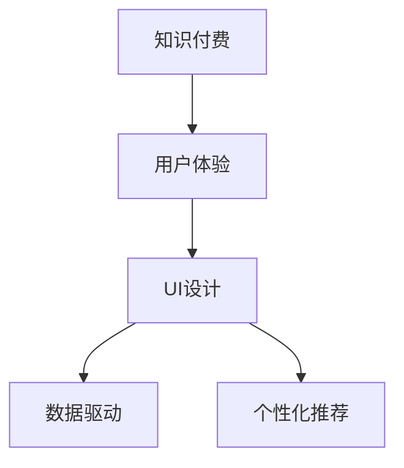

                 

## 1. 背景介绍

随着在线教育市场的迅猛发展，知识付费已成为一种快速增长的商业模式。据艾媒咨询发布的数据显示，中国知识付费用户规模已突破3.3亿人，预计2022年将达到4.1亿人。知识付费平台的爆发式增长不仅给用户提供了丰富的知识资源，同时也给在线教育企业带来了前所未有的商业机遇。然而，尽管知识付费市场规模不断扩大，用户留存率和收益却难以提升，平台面临着内容同质化、用户体验差、用户流失率高、收入转化率低等困境。在这样的市场环境下，对知识付费用户课程体验的优化与UI设计策略的研究成为了一项重要任务。

## 2. 核心概念与联系

### 2.1 核心概念概述

为更好地理解知识付费用户课程体验优化与UI设计策略，本节将介绍几个密切相关的核心概念：

- 知识付费：指用户付费购买或订阅知识内容，以获得学习资料、咨询、指导等知识服务的商业模式。
- 用户体验(UX)：涉及产品或服务的用户界面与用户交互的所有方面，包括产品的功能性、可用性、可用性、可访问性等。
- UI设计：即用户界面设计，是用户体验中的一部分，关注用户与产品的视觉交互，确保信息清晰、易用。
- 数据驱动：基于数据对用户行为进行分析，以优化产品功能与体验，提升用户体验。
- 个性化推荐：通过对用户行为和偏好的分析，推荐符合用户兴趣的内容，提升用户满意度。

这些核心概念之间的逻辑关系可以通过以下Mermaid流程图来展示：



这个流程图展示了一个典型的知识付费平台体验优化流程：

1. 知识付费平台通过用户付费购买或订阅知识内容，提供知识服务。
2. 用户体验从用户进入平台开始，到课程学习结束为止，涉及界面可用性和功能逻辑。
3. 用户界面设计是用户体验中的视觉交互部分，注重界面美观和信息传达。
4. 数据驱动通过对用户行为的分析，优化课程推荐，提升用户体验。
5. 个性化推荐利用用户数据生成个性化课程推荐，满足用户多样化需求。

## 3. 核心算法原理 & 具体操作步骤

### 3.1 算法原理概述

知识付费用户课程体验优化与UI设计策略的本质是通过对用户行为数据的分析，结合AI算法优化课程推荐系统，同时设计符合用户心理预期和行为习惯的UI界面。其核心算法原理包括以下几点：

1. **用户行为分析**：通过日志、点击流、时长等数据，分析用户行为模式，识别用户兴趣、偏好和学习进度。
2. **个性化推荐算法**：结合用户行为数据和内容属性，设计推荐算法，为用户推荐相关课程。
3. **UI设计**：结合用户心理学和行为习惯，设计简洁、美观、易用的用户界面，提高用户操作体验。

### 3.2 算法步骤详解

#### 3.2.1 用户行为数据采集

对用户行为数据的采集是优化用户体验和UI设计的第一步。以下是用户行为数据的几种主要采集方法：

- **日志记录**：记录用户登录、浏览、购买、学习等行为数据。
- **点击流分析**：通过页面访问路径、点击次数、停留时间等数据，了解用户行为模式。
- **时长记录**：记录用户对课程的学习时长和进度，分析用户学习习惯。
- **反馈调查**：通过用户填写的满意度调查表，获取用户对课程和UI界面的反馈。

#### 3.2.2 用户兴趣画像构建

基于采集到的用户行为数据，通过算法构建用户兴趣画像，是实现个性化推荐和优化用户体验的关键步骤。用户兴趣画像主要包括：

- **兴趣标签**：用户常浏览、购买、学习的内容主题。
- **行为特征**：用户点击、停留、学习时长等行为数据。
- **消费能力**：用户购买课程的消费能力和频率。

#### 3.2.3 个性化推荐算法设计

个性化推荐算法是实现用户课程推荐的核心。常见的推荐算法包括协同过滤、基于内容的推荐、深度学习等方法。其中，基于深度学习的推荐系统（如Neural Collaborative Filtering）已经成为主流的推荐方式。基于深度学习的推荐系统能够高效地捕捉用户与课程之间的关联，为用户推荐相关课程。

#### 3.2.4 UI界面设计

UI界面设计是提升用户体验的关键环节。界面设计需要综合考虑以下几个方面：

- **简洁性**：界面设计应简洁明了，避免信息过载，使用户能够快速找到所需内容。
- **一致性**：不同页面和功能的界面风格应保持一致，使用户熟悉和习惯。
- **易用性**：界面应易于操作，避免复杂的操作流程，提高用户使用便捷性。
- **响应速度**：界面应响应快速，避免因加载时间长而影响用户体验。

#### 3.2.5 测试与迭代优化

对设计好的用户界面进行测试，获取用户反馈，不断迭代优化。测试可以采用A/B测试、用户访谈等方法。

### 3.3 算法优缺点

知识付费用户课程体验优化与UI设计策略的优点：

1. **提升用户满意度**：通过个性化推荐和UI优化，满足用户个性化需求，提升用户满意度。
2. **增加用户留存率**：优化后的用户体验和UI界面，有助于增加用户黏性，减少流失率。
3. **提高收入转化率**：通过精准的个性化推荐，能够有效提升用户购买课程的意愿，提高收入转化率。

缺点如下：

1. **数据依赖**：该策略依赖大量的用户行为数据，需要持续的数据采集和维护。
2. **技术门槛**：个性化推荐和UI设计需要一定的技术支持，尤其是深度学习模型和UI设计能力。
3. **隐私问题**：数据采集和分析过程中涉及用户隐私，需要严格遵守相关法律法规。

### 3.4 算法应用领域

知识付费用户课程体验优化与UI设计策略在教育、培训、在线课程等诸多领域中得到了广泛应用：

- **在线教育平台**：如Coursera、edX、Udemy等平台，通过个性化推荐和UI优化提升用户学习体验。
- **职业培训平台**：如LinkedIn Learning、网易云课堂等，通过课程推荐和UI设计提升用户学习效率。
- **企业培训系统**：如企业大学、内部培训平台等，通过个性化的课程推荐和UI优化提升员工培训效果。

## 4. 数学模型和公式 & 详细讲解 & 举例说明

### 4.1 数学模型构建

本文将以深度学习推荐系统为例，介绍用户兴趣画像的数学模型构建。设用户行为数据为 $X=\{x_i\}_{i=1}^N$，其中 $x_i$ 包含用户在平台上的行为特征。用户兴趣画像模型 $P$ 能够对用户行为数据 $X$ 进行建模，得到用户兴趣标签 $Y=\{y_i\}_{i=1}^N$，其中 $y_i$ 表示用户对不同内容主题的兴趣程度。

用户兴趣画像的数学模型为：

$$
P(Y|X) = \frac{e^{\theta_Y \cdot X + \theta_X \cdot Y}}{Z(X)}
$$

其中，$\theta_Y$ 和 $\theta_X$ 是模型参数，$Z(X)$ 为归一化因子，确保输出概率之和为1。

### 4.2 公式推导过程

用户兴趣画像的构建公式可以通过最大似然估计进行推导。假设用户行为数据 $X$ 是服从某种分布 $X \sim P_X$ 的独立同分布样本，则用户兴趣画像的概率密度函数为：

$$
P(Y|X) = \frac{e^{\theta_Y \cdot X + \theta_X \cdot Y}}{Z(X)}
$$

对上述公式求对数，得到：

$$
\log P(Y|X) = \theta_Y \cdot X + \theta_X \cdot Y - \log Z(X)
$$

令 $\log Z(X) = \max\limits_{Y} (\theta_Y \cdot X + \theta_X \cdot Y)$，则模型参数 $\theta_Y$ 和 $\theta_X$ 的估计公式为：

$$
\hat{\theta}_Y = \arg\max_{\theta_Y} \sum\limits_{i=1}^N (\theta_Y \cdot x_i + \theta_X \cdot y_i)
$$

$$
\hat{\theta}_X = \arg\max_{\theta_X} \sum\limits_{i=1}^N (\theta_Y \cdot x_i + \theta_X \cdot y_i)
$$

### 4.3 案例分析与讲解

以在线教育平台为例，通过用户行为数据分析，构建用户兴趣画像，再利用深度学习推荐算法为用户推荐相关课程。

假设某用户 $i$ 常浏览计算机科学领域的课程，其行为数据为 $x_i = (1, 0, 1, 0)$，表示用户浏览过计算机科学、数学、物理学和语言学。设用户兴趣标签为 $y_i = (1, 1, 1, 0)$，表示用户对计算机科学、数学和物理学的兴趣程度较高。利用上述公式可以估计出模型参数 $\hat{\theta}_Y$ 和 $\hat{\theta}_X$，进而得到用户兴趣画像模型 $P(Y|X)$，推荐该用户浏览计算机科学相关课程。

## 5. 项目实践：代码实例和详细解释说明

### 5.1 开发环境搭建

在进行用户课程体验优化与UI设计策略开发前，我们需要准备好开发环境。以下是使用Python进行Flask开发的环境配置流程：

1. 安装Anaconda：从官网下载并安装Anaconda，用于创建独立的Python环境。

2. 创建并激活虚拟环境：
```bash
conda create -n flask-env python=3.8 
conda activate flask-env
```

3. 安装Flask：
```bash
pip install Flask
```

4. 安装SQLAlchemy：
```bash
pip install SQLAlchemy
```

5. 安装Flask-RESTful：
```bash
pip install Flask-RESTful
```

6. 安装requests：
```bash
pip install requests
```

完成上述步骤后，即可在`flask-env`环境中开始项目开发。

### 5.2 源代码详细实现

我们以在线教育平台为例，给出使用Flask实现个性化推荐和UI优化的Python代码实现。

首先，定义用户行为数据模型：

```python
from sqlalchemy import Column, Integer, Float, DateTime
from sqlalchemy.ext.declarative import declarative_base
from datetime import datetime

Base = declarative_base()

class UserBehavior(Base):
    __tablename__ = 'user_behavior'
    id = Column(Integer, primary_key=True)
    user_id = Column(Integer)
    time = Column(DateTime, default=datetime.utcnow)
    type = Column(Integer)
    param = Column(Integer)

    def __repr__(self):
        return "<UserBehavior(id='%s', user_id='%s', time='%s', type='%s', param='%s')>" % (
            self.id, self.user_id, self.time, self.type, self.param
        )
```

然后，定义用户兴趣画像模型：

```python
from tensorflow.keras.layers import Dense, Input, Embedding, Concatenate, Add, GlobalAveragePooling1D, Dot
from tensorflow.keras.models import Model

def create_user_profil_model(input_shape, embed_dim, latent_dim):
    user_input = Input(shape=(None,))
    item_input = Input(shape=(None,))
    item_embed = Embedding(input_dim=input_shape, output_dim=embed_dim)(item_input)
    user_embed = Embedding(input_dim=input_shape, output_dim=embed_dim)(user_input)
    concat = Concatenate()([item_embed, user_embed])
    latent = Dense(latent_dim, activation='relu', name='latent')(concat)
    user_profil = Dense(input_shape, activation='softmax', name='user_profil')(latent)
    model = Model(inputs=[user_input, item_input], outputs=user_profil)
    return model

input_shape = 5
embed_dim = 64
latent_dim = 64

user_profil_model = create_user_profil_model(input_shape, embed_dim, latent_dim)
```

接着，定义用户行为分析模型：

```python
from tensorflow.keras.layers import Dense, Dropout
from tensorflow.keras.models import Sequential

def create_user_profile():
    user_profile = Sequential()
    user_profile.add(Dense(128, activation='relu', input_dim=input_shape))
    user_profile.add(Dropout(0.5))
    user_profile.add(Dense(5, activation='softmax'))
    return user_profile

user_profile = create_user_profile()
```

最后，启动Flask应用：

```python
from flask import Flask, jsonify
from flask_sqlalchemy import SQLAlchemy

app = Flask(__name__)
app.config['SQLALCHEMY_DATABASE_URI'] = 'sqlite:///sqlite.db'
app.config['SQLALCHEMY_TRACK_MODIFICATIONS'] = False

db = SQLAlchemy(app)

@app.route('/recommend')
def recommend():
    data = request.get_json()
    user_id = data['user_id']
    user_behaviors = UserBehavior.query.filter_by(user_id=user_id).all()
    user_bes = []
    for behavior in user_behaviors:
        user_bes.append(behavior.type, behavior.param)
    user_bes = np.array(user_bes)
    user_profil = user_profil_model.predict([user_bes])
    return jsonify(user_profil)

if __name__ == "__main__":
    app.run(debug=True)
```

以上就是使用Flask实现个性化推荐和UI优化的完整代码实现。可以看到，Flask提供了丰富的Web开发框架，方便我们快速构建API接口，实现数据的存储和处理。

### 5.3 代码解读与分析

让我们再详细解读一下关键代码的实现细节：

**UserBehavior类**：
- `__init__`方法：初始化用户行为数据模型的各个字段。
- `__repr__`方法：定义模型的打印输出格式。

**create_user_profil_model函数**：
- 定义用户兴趣画像模型，使用Embedding层将用户和课程行为数据嵌入到低维向量空间中，再通过全连接层输出用户兴趣标签。
- 使用模型构建函数定义模型结构，并返回模型实例。

**create_user_profile函数**：
- 定义用户行为分析模型，使用Dense层和Dropout层对用户行为数据进行特征提取，输出用户兴趣标签。
- 使用Sequential模型封装所有层，构建用户行为分析模型。

**Flask应用**：
- 定义Flask应用实例，配置数据库连接。
- 定义API接口/recommend，接收用户ID，查询用户行为数据，进行用户兴趣画像分析和个性化推荐，并返回推荐结果。
- 运行Flask应用，启动Web服务。

可以看出，Flask提供了丰富的Web框架，方便开发者实现数据存储、处理和API接口。同时，与Flask结合的SQLAlchemy可以方便地进行数据库操作，使得数据管理和查询变得简单高效。

## 6. 实际应用场景

### 6.1 在线教育平台

在线教育平台是知识付费的主要场景之一，其用户体验和UI设计直接影响用户的学习效果和平台黏性。个性化推荐和UI优化能够提升用户学习体验，减少流失率，增加收入转化率。例如，Coursera平台通过用户行为数据分析，推荐相关课程，同时设计简洁美观的用户界面，提高用户学习效率。

### 6.2 企业培训系统

企业培训系统作为企业内部知识共享和培训管理的重要工具，其用户体验和UI设计直接影响员工的培训效果和系统使用率。通过个性化推荐和UI优化，能够提升员工的学习效率，同时方便企业进行知识传播和培训管理。例如，IBM通过员工培训平台，提供个性化课程推荐和简洁易用的界面，提升员工培训效果和满意度。

### 6.3 在线课程平台

在线课程平台提供各类专业知识和技能课程，其用户体验和UI设计直接影响用户的课程学习效果和平台黏性。通过个性化推荐和UI优化，能够提升用户学习体验，减少流失率，增加收入转化率。例如，网易云课堂通过用户行为数据分析，推荐相关课程，同时设计简洁美观的用户界面，提高用户学习效率。

## 7. 工具和资源推荐

### 7.1 学习资源推荐

为了帮助开发者系统掌握知识付费用户课程体验优化与UI设计策略的理论基础和实践技巧，这里推荐一些优质的学习资源：

1. 《UX设计基础》：该书系统讲解了用户体验设计的基本原则和实践方法，适合初学者入门。
2. 《个性化推荐系统》：该书介绍了个性化推荐系统的原理和算法，涵盖协同过滤、基于内容的推荐等方法。
3. 《深度学习推荐系统》：该书介绍了深度学习在推荐系统中的应用，涵盖深度协同过滤、神经网络推荐等方法。
4. 《Flask Web开发实战》：该书介绍了Flask框架的开发实践，涵盖API接口设计、数据库操作等实用技术。
5. 《Python Web开发实战》：该书介绍了Python Web开发的常用技术，涵盖Flask、Django等框架的开发实践。

通过对这些资源的学习实践，相信你一定能够快速掌握知识付费用户课程体验优化与UI设计策略的精髓，并用于解决实际的NLP问题。

### 7.2 开发工具推荐

高效的开发离不开优秀的工具支持。以下是几款用于知识付费平台开发的常用工具：

1. Flask：基于Python的Web框架，灵活高效，适合快速迭代研究。
2. SQLAlchemy：Python ORM框架，方便进行数据库操作，适合关系型数据库。
3. TensorFlow：由Google主导开发的深度学习框架，生产部署方便，适合大规模工程应用。
4. Weights & Biases：模型训练的实验跟踪工具，可以记录和可视化模型训练过程中的各项指标，方便对比和调优。
5. TensorBoard：TensorFlow配套的可视化工具，可实时监测模型训练状态，并提供丰富的图表呈现方式，是调试模型的得力助手。

合理利用这些工具，可以显著提升知识付费平台开发效率，加快创新迭代的步伐。

### 7.3 相关论文推荐

知识付费用户课程体验优化与UI设计策略的发展源于学界的持续研究。以下是几篇奠基性的相关论文，推荐阅读：

1. AutoRec: Autoencoder-Based Recommender System：提出基于自编码器的推荐系统，使用稀疏编码学习用户和物品的隐向量表示，从而实现个性化推荐。
2. Matrix Factorization Techniques for Recommender Systems：介绍矩阵分解方法，通过低秩矩阵分解对用户和物品进行特征提取，实现个性化推荐。
3. Neural Collaborative Filtering：提出基于深度学习的协同过滤推荐系统，使用神经网络模型捕捉用户和物品之间的关系，实现高效个性化推荐。
4. Fast Matrix Factorization：介绍基于加速矩阵分解的推荐系统，使用稀疏矩阵分解对用户和物品进行特征提取，实现高效推荐。
5. Robust Matrix Factorization：提出鲁棒矩阵分解方法，通过正则化技术提高推荐系统的鲁棒性和泛化能力。

这些论文代表了大语言模型微调技术的发展脉络。通过学习这些前沿成果，可以帮助研究者把握学科前进方向，激发更多的创新灵感。

## 8. 总结：未来发展趋势与挑战

### 8.1 总结

本文对知识付费用户课程体验优化与UI设计策略进行了全面系统的介绍。首先阐述了知识付费和用户体验的核心概念，明确了用户体验优化和UI设计策略在知识付费平台中的重要性。其次，从原理到实践，详细讲解了个性化推荐和UI设计的数学模型构建和算法实现，给出了知识付费平台开发的完整代码实例。同时，本文还广泛探讨了个性化推荐和UI设计在教育、培训、在线课程等领域的实际应用，展示了个性化推荐和UI优化的巨大潜力。此外，本文精选了个性化推荐和UI设计的各类学习资源，力求为读者提供全方位的技术指引。

通过本文的系统梳理，可以看到，知识付费用户课程体验优化与UI设计策略在知识付费平台中扮演了重要角色，显著提升了用户体验，提升了平台的用户黏性和收入转化率。未来，伴随个性化推荐和UI设计技术的不断演进，相信知识付费平台将能够为用户提供更加丰富、高效、个性化的学习体验，为在线教育市场带来更加广阔的发展空间。

### 8.2 未来发展趋势

展望未来，知识付费用户课程体验优化与UI设计策略将呈现以下几个发展趋势：

1. **数据驱动**：随着大数据和人工智能技术的发展，数据驱动的用户体验优化将更加深入。通过大数据分析，可以更全面地了解用户需求，实现个性化推荐。
2. **个性化推荐算法**：推荐算法将更加智能化，通过深度学习、协同过滤等技术，实现更加精准的个性化推荐。
3. **跨平台体验**：未来的知识付费平台将实现跨平台、跨设备的用户体验优化，确保用户在不同设备上的体验一致。
4. **智能交互设计**：通过自然语言处理、语音识别等技术，实现智能化的用户交互设计，提升用户体验。
5. **实时反馈机制**：实时获取用户反馈，通过机器学习算法不断优化推荐系统，提高用户体验和推荐精度。
6. **隐私保护**：在数据采集和分析过程中，加强隐私保护，确保用户数据安全。

以上趋势凸显了知识付费用户课程体验优化与UI设计策略的广阔前景。这些方向的探索发展，必将进一步提升知识付费平台的用户体验，吸引更多用户，推动知识付费市场的快速发展。

### 8.3 面临的挑战

尽管知识付费用户课程体验优化与UI设计策略已经取得了一定成果，但在迈向更加智能化、普适化应用的过程中，它仍面临着诸多挑战：

1. **数据采集和处理**：数据采集和处理是用户体验优化和UI设计的第一步，需要大量的数据采集和存储。数据采集过程中的隐私问题也需要严格处理。
2. **推荐算法复杂度**：个性化推荐算法需要处理大量的数据和复杂的模型，计算量较大，需要高性能计算资源。
3. **用户行为多样性**：用户行为的多样性增加了推荐算法的复杂性，需要针对不同用户设计更加精细化的推荐策略。
4. **用户体验设计**：用户体验设计需要结合心理学、行为学等多个领域，设计更加符合用户心理预期的UI界面。
5. **技术集成**：个性化推荐和UI优化需要与大数据、深度学习等技术进行深度集成，技术集成难度较大。

正视知识付费用户课程体验优化与UI设计策略面临的这些挑战，积极应对并寻求突破，将使知识付费平台能够为用户提供更加丰富、高效、个性化的学习体验。

### 8.4 研究展望

面对知识付费用户课程体验优化与UI设计策略所面临的种种挑战，未来的研究需要在以下几个方面寻求新的突破：

1. **数据增强和预处理**：通过数据增强和预处理技术，提高数据采集和处理的效率和精度，减少数据采集过程中的隐私问题。
2. **推荐算法优化**：优化推荐算法，提高推荐精度和效率，降低计算复杂度，提升用户体验。
3. **跨平台和跨设备优化**：实现跨平台和跨设备的用户体验优化，确保用户在不同设备上的体验一致。
4. **智能交互设计**：通过自然语言处理、语音识别等技术，实现智能化的用户交互设计，提升用户体验。
5. **实时反馈和优化**：实时获取用户反馈，通过机器学习算法不断优化推荐系统，提高用户体验和推荐精度。
6. **隐私保护技术**：在数据采集和分析过程中，加强隐私保护技术，确保用户数据安全。

这些研究方向的探索，必将引领知识付费用户课程体验优化与UI设计策略走向更加成熟和高效，为用户提供更加丰富、高效、个性化的学习体验。面向未来，知识付费用户课程体验优化与UI设计策略还需要与其他人工智能技术进行更深入的融合，如知识表示、因果推理、强化学习等，多路径协同发力，共同推动知识付费平台的发展。总之，知识付费用户课程体验优化与UI设计策略需要不断创新、不断优化，才能真正实现用户满意度提升和平台收益增长。

## 9. 附录：常见问题与解答

**Q1：个性化推荐和UI优化如何降低数据依赖？**

A: 降低数据依赖可以通过以下几种方法：
1. **离线计算**：将推荐算法离线计算，提高推荐效率。
2. **增量更新**：根据新数据实时更新推荐模型，减少推荐算法的计算量。
3. **模型压缩**：通过模型压缩技术，减小模型参数，降低计算复杂度。
4. **特征工程**：设计更加精炼的特征，提高模型的泛化能力。

**Q2：个性化推荐如何提升推荐精度？**

A: 提升推荐精度可以通过以下几种方法：
1. **模型优化**：优化推荐模型，如使用深度学习、协同过滤等方法。
2. **特征工程**：设计更加精炼的特征，提高模型的泛化能力。
3. **模型融合**：融合多个推荐模型，提高推荐精度和鲁棒性。
4. **数据增强**：通过数据增强技术，提高推荐模型的泛化能力。

**Q3：UI设计如何提升用户体验？**

A: 提升用户体验可以通过以下几种方法：
1. **简洁性**：界面设计应简洁明了，避免信息过载，使用户能够快速找到所需内容。
2. **一致性**：不同页面和功能的界面风格应保持一致，使用户熟悉和习惯。
3. **易用性**：界面应易于操作，避免复杂的操作流程，提高用户使用便捷性。
4. **响应速度**：界面应响应快速，避免因加载时间长而影响用户体验。

**Q4：如何实现跨平台和跨设备优化？**

A: 实现跨平台和跨设备优化可以通过以下几种方法：
1. **响应式设计**：设计响应式的用户界面，适应不同设备和屏幕大小。
2. **统一用户界面**：设计统一的UI界面，确保不同设备上的体验一致。
3. **一致性维护**：保持不同设备上的UI风格和功能一致，减少用户学习成本。
4. **多平台测试**：在不同设备和平台上进行测试，确保UI设计的可靠性。

这些解答提供了具体的优化方法，希望能够帮助开发者更好地解决实际问题。

---

作者：禅与计算机程序设计艺术 / Zen and the Art of Computer Programming

