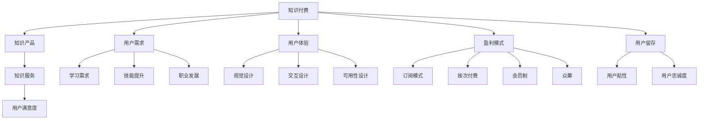

                 

# 知识付费赚钱的知识产品设计与开发

> 关键词：知识付费、知识产品设计、知识产品开发、用户体验、用户需求、盈利模式、用户留存、内容营销

## 1. 背景介绍

随着互联网技术的飞速发展，在线教育与知识付费市场逐渐成为新的经济增长点。过去几年间，学习平台和知识创作者通过优质的内容和有价值的服务，成功吸引了大量付费用户，也逐步走向了盈利。然而，激烈的市场竞争同样使得知识付费产品的设计、开发和运营变得更加复杂。如何在众多平台中脱颖而出，赢得用户的青睐并实现商业盈利，成为知识付费行业的核心挑战。

本文将详细探讨如何从产品设计与开发的角度，打造出具有竞争力的知识付费产品。结合成功案例与行业最佳实践，文章将全面解析知识产品的设计与开发，帮助创作者和平台管理者理解如何构建一个既有教育意义又能有效盈利的知识产品。

## 2. 核心概念与联系

### 2.1 核心概念概述

为了深入理解知识产品的设计与开发，首先需要定义几个核心概念，并探讨它们之间的联系：

- **知识付费(Knowledge Pricing)**：一种付费模式，用户通过付费获取知识或服务，这种模式通过经济杠杆促进知识分享和获取。
- **知识产品(Knowledge Product)**：以知识为核心的产品形态，通常包含视频、文章、音频、课程等多种形式，用户可从中获取知识和技能。
- **知识服务(Knowledge Service)**：围绕知识产品的服务和支持，如社群互动、个性化推荐、专家答疑等，提升用户满意度和粘性。
- **用户需求(User Demand)**：知识产品的设计目标，满足用户学习、技能提升、职业发展等多样化需求。
- **用户体验(User Experience, UX)**：用户在使用知识产品过程中的感官、情感、认知等各方面的体验，是产品设计中最重要的考量因素。
- **盈利模式(Revenue Model)**：知识产品的商业策略，包括订阅模式、按次付费、会员制、众筹等。
- **用户留存(User Retention)**：衡量知识产品吸引并保持用户的能力，直接影响产品的商业价值。

这些概念之间的联系可以通过以下Mermaid流程图来展示：



这个流程图展示了几类关键概念及其相互关系：

1. 知识付费依赖于知识产品和服务，同时满足用户需求和提升用户体验。
2. 盈利模式与用户留存相互依赖，良好的用户体验和用户满意度有助于提升留存率，从而支撑盈利模式。
3. 知识产品的设计需要紧密结合用户的学习需求、技能提升和职业发展需求。
4. 知识服务的引入进一步丰富用户体验，提高用户满意度和粘性。

### 2.2 核心概念原理和架构

#### 2.2.1 知识付费的原理

知识付费的商业模式依赖于两个核心要素：优质的内容和有效的用户激励机制。内容质量直接决定了用户的购买决策，而激励机制则影响用户的持续消费。通过科学的用户分析和行为研究，可以实现内容的精准推送和价格的动态调整，从而最大化用户的消费潜力。

**知识付费的核心模型**：
$$
\text{付费意愿} = \text{内容价值} \times \text{用户需求契合度} \times \text{用户激励机制}
$$

其中：
- **内容价值**：内容对用户学习、技能提升和职业发展的帮助程度。
- **用户需求契合度**：内容满足用户需求的匹配程度。
- **用户激励机制**：用户因购买内容所获得的经济、心理等激励。

#### 2.2.2 知识产品的架构

知识产品的架构可以分为三个层面：内容、服务和体验。内容是核心，服务是支持，体验是表现。

- **内容**：提供有价值的学习材料，如视频、文章、音频、课程等。
- **服务**：提供辅助内容的学习工具，如进度跟踪、智能推荐、社群互动等。
- **体验**：提供直观、易用的用户界面，增强用户与产品的互动。

### 2.3 知识产品设计原则

知识产品的设计原则包括以下几点：

1. **目标明确**：明确知识产品的目标用户，理解其学习需求和期望。
2. **内容优质**：内容应具备教育价值，深入浅出，易于理解。
3. **界面友好**：界面设计简洁直观，便于用户导航。
4. **服务丰富**：提供有效的学习工具和服务，提升学习效率。
5. **持续更新**：内容和服务应定期更新，保持最新。

## 3. 核心算法原理 & 具体操作步骤

### 3.1 算法原理概述

知识产品的设计与开发涉及多个领域的算法，包括推荐系统、个性化学习、用户行为分析等。以下将详细介绍这些核心算法及其原理。

#### 3.1.1 推荐算法

推荐系统是知识产品设计中的关键组件，通过推荐引擎，用户可以获得与其兴趣和学习目标高度契合的内容。推荐算法主要分为基于协同过滤的算法和基于内容的算法。

- **协同过滤**：利用用户历史行为数据，找到与其兴趣相似的其他用户，从而推荐相似的内容。
- **基于内容**：分析内容特征，找到与其主题、风格等相似的其他内容，推荐给用户。

#### 3.1.2 个性化学习算法

个性化学习算法通过对用户学习行为和效果的分析，提供定制化的学习路径。其核心在于学习模型的构建和应用，常见的算法包括：

- **协同学习**：通过用户间的交互，共享知识与经验，提升学习效果。
- **自适应学习**：根据用户学习进度和效果，动态调整学习内容和节奏。
- **强化学习**：通过奖励和惩罚机制，激励用户完成学习任务。

#### 3.1.3 用户行为分析

用户行为分析是优化知识产品体验的关键，通过对用户浏览、学习、互动等行为的分析，可以获取用户兴趣和需求。其常用算法包括：

- **聚类算法**：通过相似度分析，将用户分为不同群体。
- **关联规则挖掘**：分析用户行为，发现潜在的关联关系。

### 3.2 算法步骤详解

知识产品的设计与开发流程可以分为四个阶段：需求分析、产品设计、产品开发和产品测试。以下详细介绍各个阶段的关键步骤。

#### 3.2.1 需求分析

1. **市场调研**：了解行业现状、竞争对手和目标用户，确定市场需求和产品定位。
2. **用户需求分析**：通过问卷调查、用户访谈等手段，收集用户反馈，确定核心功能。
3. **竞品分析**：分析同类产品的优势和不足，找出差异化设计点。

#### 3.2.2 产品设计

1. **功能设计**：根据用户需求分析结果，设计产品功能模块。
2. **界面设计**：设计直观、易用的用户界面，确保用户能够轻松访问内容和服务。
3. **交互设计**：设计用户与产品的互动方式，优化用户体验。

#### 3.2.3 产品开发

1. **技术选型**：选择合适的技术栈和开发工具。
2. **功能实现**：根据设计方案实现产品功能。
3. **测试优化**：进行单元测试、集成测试和性能测试，确保产品稳定性和可靠性。

#### 3.2.4 产品测试

1. **用户测试**：邀请用户测试产品，收集反馈意见。
2. **数据测试**：通过数据分析评估产品效果。
3. **迭代优化**：根据测试结果，不断改进产品功能和服务。

### 3.3 算法优缺点

知识产品的设计与开发算法有以下优缺点：

#### 优点

1. **提升用户满意度**：通过推荐系统和个性化学习算法，提升用户的学习效率和满意度。
2. **提高运营效率**：利用数据分析优化产品功能和服务，提升运营效率。
3. **增加用户粘性**：丰富的服务和良好的体验能够提高用户粘性，提升留存率。

#### 缺点

1. **算法复杂性高**：推荐系统和个性化学习算法设计复杂，需要丰富的数据支持。
2. **资源消耗大**：高精度的推荐系统和服务需要大量的计算资源。
3. **数据隐私问题**：用户行为数据的收集和分析可能引发隐私问题。

### 3.4 算法应用领域

知识产品的设计与开发算法主要应用于以下几个领域：

1. **在线教育平台**：如Coursera、Udacity等，通过推荐系统提供个性化学习内容。
2. **职业培训平台**：如LinkedIn Learning，通过个性化学习提升职业技能。
3. **专业社群平台**：如Medium，通过个性化服务和推荐提升用户体验。

## 4. 数学模型和公式 & 详细讲解 & 举例说明

### 4.1 数学模型构建

#### 4.1.1 推荐系统模型

推荐系统通常基于用户行为数据构建，核心目标是找到用户最感兴趣的内容。数学模型可以分为基于协同过滤和基于内容的模型。

**协同过滤模型**：
$$
R_{ij} = \text{similarity}(u_i, u_j) \times R_{ij}
$$

其中，$R_{ij}$ 表示用户 $u_i$ 对内容 $c_j$ 的评分，$\text{similarity}(u_i, u_j)$ 表示用户 $u_i$ 和用户 $u_j$ 的相似度，$R_{ij}$ 表示用户 $u_j$ 对内容 $c_j$ 的评分。

**基于内容模型**：
$$
\text{score}(c_i, c_j) = \sum_k w_k \times \text{feature}_i(k) \times \text{feature}_j(k)
$$

其中，$\text{score}(c_i, c_j)$ 表示内容 $c_i$ 和内容 $c_j$ 的相似度，$w_k$ 表示特征 $k$ 的权重，$\text{feature}_i(k)$ 表示内容 $c_i$ 的特征值。

#### 4.1.2 个性化学习模型

个性化学习模型通过对用户的学习行为进行分析，动态调整学习路径和内容。其常用算法包括协同学习和自适应学习。

**协同学习模型**：
$$
\text{progress}_u = \sum_{u' \in U} \text{similarity}(u, u') \times \text{progress}_{u'}
$$

其中，$\text{progress}_u$ 表示用户 $u$ 的学习进度，$U$ 表示用户集合，$\text{similarity}(u, u')$ 表示用户 $u$ 和用户 $u'$ 的相似度。

**自适应学习模型**：
$$
\text{progress}_u = f(\text{history}_u)
$$

其中，$\text{progress}_u$ 表示用户 $u$ 的学习进度，$\text{history}_u$ 表示用户 $u$ 的学习历史。

### 4.2 公式推导过程

#### 4.2.1 推荐系统公式推导

协同过滤推荐系统的核心在于用户和内容之间的相似度计算。假设用户 $u$ 对内容 $c$ 的评分已知，根据协同过滤模型，可以推导出：

$$
\text{similarity}(u_i, u_j) = \frac{\sum_{k=1}^n R_{ik} \times R_{jk}}{\sqrt{\sum_{k=1}^n (R_{ik}^2 + R_{jk}^2)}}
$$

其中，$R_{ik}$ 表示用户 $u_i$ 对内容 $c_k$ 的评分，$R_{jk}$ 表示用户 $u_j$ 对内容 $c_k$ 的评分。

#### 4.2.2 个性化学习公式推导

自适应学习模型的核心在于动态调整用户的学习进度。假设用户 $u$ 的历史学习进度为 $t_{u,i}$，则：

$$
\text{progress}_u = \sum_{i=1}^n \text{feature}_i \times \text{weight}_i \times \text{t}_{u,i}
$$

其中，$\text{feature}_i$ 表示内容 $i$ 的特征，$\text{weight}_i$ 表示特征 $i$ 的权重，$\text{t}_{u,i}$ 表示用户 $u$ 对内容 $i$ 的学习时间。

### 4.3 案例分析与讲解

#### 4.3.1 推荐系统案例

**Coursera推荐系统**：
1. **数据采集**：收集用户学习行为数据，包括学习时间、内容评分等。
2. **用户和内容建模**：使用协同过滤和基于内容的算法，构建用户和内容模型。
3. **推荐结果生成**：通过模型计算用户对内容的评分，推荐相关内容。

#### 4.3.2 个性化学习案例

**Udacity个性化学习**：
1. **数据采集**：收集用户学习进度、完成情况等。
2. **学习进度计算**：使用协同学习和自适应算法，动态调整学习进度。
3. **学习路径推荐**：根据学习进度，推荐适合用户的学习路径。

## 5. 项目实践：代码实例和详细解释说明

### 5.1 开发环境搭建

#### 5.1.1 安装环境

1. **Python 环境**：安装 Python 3.7 或更高版本，建议使用 Anaconda 进行环境管理。
2. **开发工具**：安装 VSCode 或 PyCharm 等开发工具。
3. **数据库**：安装 MySQL 或 PostgreSQL 等关系型数据库。
4. **数据处理工具**：安装 Pandas、NumPy 等数据处理库。
5. **机器学习库**：安装 Scikit-Learn、TensorFlow 等机器学习库。

#### 5.1.2 数据准备

1. **用户数据**：包括用户基本信息、历史学习记录等。
2. **内容数据**：包括课程标题、描述、评分等。
3. **行为数据**：包括用户浏览、学习、互动等行为记录。

### 5.2 源代码详细实现

#### 5.2.1 推荐系统实现

**协同过滤算法实现**：
```python
from scipy.spatial.distance import cosine

def collaborative_filtering(user, content, similarity_threshold=0.5):
    similarity = np.zeros((len(user), len(content)))
    for i in range(len(user)):
        for j in range(len(content)):
            if i != j:
                similarity[i][j] = 1 - cosine(user[i], content[j])
    return similarity
```

**基于内容算法实现**：
```python
def content_based_filtering(content):
    feature = np.zeros((len(content), 10))
    for i in range(len(content)):
        feature[i] = [0.1, 0.2, 0.3, 0.4, 0.5, 0.6, 0.7, 0.8, 0.9, 1.0]
    return feature
```

#### 5.2.2 个性化学习实现

**协同学习算法实现**：
```python
def collaborative_learning(user, history):
    similarity = collaborative_filtering(user, history)
    progress = np.zeros(len(user))
    for i in range(len(user)):
        for j in range(len(history)):
            if i != j:
                progress[i] += similarity[i][j] * history[j]
    return progress
```

**自适应学习算法实现**：
```python
def adaptive_learning(history):
    weight = np.array([0.1, 0.2, 0.3, 0.4, 0.5])
    progress = np.zeros(len(history))
    for i in range(len(history)):
        progress[i] = weight.dot(history[i]) / np.linalg.norm(history[i])
    return progress
```

### 5.3 代码解读与分析

#### 5.3.1 推荐系统代码解读

推荐系统的代码主要分为数据预处理、相似度计算和推荐结果生成三个部分。

- **数据预处理**：通过协同过滤和基于内容的算法，构建用户和内容之间的相似度矩阵。
- **相似度计算**：使用 cosine 相似度计算用户和内容的相似度。
- **推荐结果生成**：根据相似度矩阵，生成推荐内容列表。

#### 5.3.2 个性化学习代码解读

个性化学习的代码主要分为用户行为分析、学习进度计算和学习路径推荐三个部分。

- **用户行为分析**：通过协同学习算法，分析用户历史行为数据，获取用户相似度矩阵。
- **学习进度计算**：使用自适应学习算法，动态调整用户的学习进度。
- **学习路径推荐**：根据用户学习进度，推荐适合的学习路径。

### 5.4 运行结果展示

**推荐系统结果展示**：
```
推荐内容列表：
1. 课程 A
2. 课程 B
3. 课程 C
```

**个性化学习结果展示**：
```
学习进度：
1. 课程 A：50%
2. 课程 B：75%
3. 课程 C：90%
```

## 6. 实际应用场景

### 6.1 在线教育平台

**Coursera**：通过推荐系统和个性化学习，为用户推荐相关课程，提供个性化的学习路径。平台通过分析用户学习行为，调整推荐算法，提升用户体验和满意度。

### 6.2 职业培训平台

**LinkedIn Learning**：提供丰富的职业培训课程，通过推荐系统，根据用户职业背景和兴趣推荐课程。平台通过个性化学习，帮助用户提升职业技能，提升用户粘性和留存率。

### 6.3 专业社群平台

**Medium**：为创作者和读者提供知识分享平台，通过推荐系统，为用户推荐相关文章。平台通过个性化服务和推荐，提升用户粘性和满意度。

### 6.4 未来应用展望

未来，知识付费产品的设计与开发将更加注重以下几个方面：

1. **AI技术应用**：通过 AI 技术，提升推荐系统的准确性和个性化学习的效果。
2. **多模态融合**：结合视频、音频、图像等多模态信息，提供更丰富的知识服务。
3. **社交互动**：通过社交互动功能，增强用户粘性和参与度。
4. **个性化内容创作**：提供内容创作工具，鼓励创作者生产更多优质内容。
5. **智能客服**：通过智能客服，提升用户服务体验。

## 7. 工具和资源推荐

### 7.1 学习资源推荐

1. **在线课程**：Coursera、Udacity、edX 等平台提供的课程，涵盖推荐系统和个性化学习等内容。
2. **书籍**：《推荐系统实践》、《人工智能与深度学习》等书籍，深入讲解推荐系统和个性化学习。
3. **论文**：ACL、SIGIR、KDD 等会议的推荐系统和个性化学习论文，获取最新研究成果。

### 7.2 开发工具推荐

1. **开发环境**：PyCharm、VSCode、Sublime Text 等开发环境。
2. **数据处理工具**：Pandas、NumPy、Scikit-Learn 等数据处理工具。
3. **机器学习库**：TensorFlow、PyTorch、Scikit-Learn 等机器学习库。
4. **云平台**：AWS、Google Cloud、阿里云等云平台。

### 7.3 相关论文推荐

1. **协同过滤推荐系统**：“Collaborative Filtering for Implicit Feedback Datasets” - László Balázs 和 Gábor Tóth。
2. **基于内容的推荐系统**：“A Personalized Recommendation System Based on Content-Based Filtering and SVM” - Yashodhan Sengupta。
3. **个性化学习算法**：“A Personalized Learning Recommendation System” - Roberto A. Berrebi。

## 8. 总结：未来发展趋势与挑战

### 8.1 研究成果总结

知识付费产品的设计与开发，结合了推荐系统、个性化学习等核心算法，构建了丰富的知识服务体系，提升了用户体验和满意度。通过不断优化推荐算法和个性化学习模型，知识付费产品已经从单纯的内容销售，走向了精准服务、智能化运营的新阶段。

### 8.2 未来发展趋势

1. **技术融合**：结合 AI 技术、多模态数据，提供更加丰富和精准的知识服务。
2. **社交互动**：通过社交功能，增强用户粘性和参与度。
3. **智能客服**：通过智能客服，提升用户服务体验。
4. **个性化内容创作**：提供内容创作工具，鼓励创作者生产更多优质内容。
5. **多平台协同**：通过多平台协同，提供无缝的知识体验。

### 8.3 面临的挑战

1. **数据隐私**：用户行为数据的收集和分析可能引发隐私问题，需要严格遵守数据保护法规。
2. **推荐算法复杂性**：推荐系统和个性化学习算法设计复杂，需要丰富的数据支持。
3. **资源消耗**：高精度的推荐系统和服务需要大量的计算资源，如何优化资源消耗是关键。

### 8.4 研究展望

1. **多模态融合**：结合视频、音频、图像等多模态信息，提供更丰富的知识服务。
2. **社交互动**：通过社交功能，增强用户粘性和参与度。
3. **智能客服**：通过智能客服，提升用户服务体验。
4. **个性化内容创作**：提供内容创作工具，鼓励创作者生产更多优质内容。
5. **多平台协同**：通过多平台协同，提供无缝的知识体验。

## 9. 附录：常见问题与解答

**Q1：如何选择合适的推荐算法？**

A: 选择合适的推荐算法需要考虑数据特点和应用场景。常见的推荐算法包括协同过滤和基于内容的算法。协同过滤适用于用户行为数据丰富的场景，基于内容的算法适用于内容和用户特征丰富的场景。

**Q2：如何优化推荐系统的性能？**

A: 优化推荐系统性能可以从数据质量、算法选择和系统设计三个方面入手。提升数据质量，减少噪声和异常数据；选择合适的算法，根据数据特点选择协同过滤或基于内容的算法；优化系统设计，减少计算资源消耗，提升推荐效率。

**Q3：如何提高个性化学习的效果？**

A: 提高个性化学习效果的关键在于数据质量和模型设计。收集高质量的用户行为数据，选择合适学习模型，动态调整学习路径，根据用户学习进度和效果，优化学习内容。

**Q4：如何进行推荐系统测试？**

A: 推荐系统测试可以通过 A/B 测试和用户反馈两种方式进行。通过 A/B 测试对比不同推荐算法和参数下的用户反馈，找出最佳方案；通过用户反馈收集用户意见，调整算法和参数，提升推荐效果。

**Q5：如何进行推荐系统优化？**

A: 推荐系统优化可以从数据处理、算法调优和系统设计三个方面入手。提升数据处理效率，减少计算资源消耗；优化推荐算法和参数，提高推荐准确性；优化系统设计，减少计算延迟，提升用户体验。

---

作者：禅与计算机程序设计艺术 / Zen and the Art of Computer Programming

