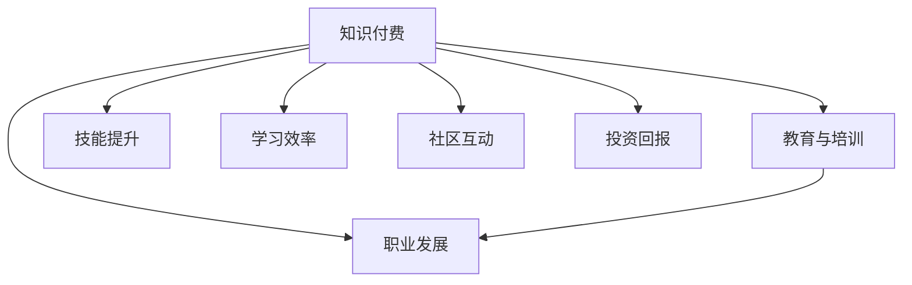

                 

# 知识付费：程序员的投资与回报

> 关键词：知识付费, 程序员, 投资与回报, 教育与培训, 职业发展, 技能提升, 技术栈扩展, 社区与平台

## 1. 背景介绍

### 1.1 问题由来
在互联网和移动互联网快速发展的今天，知识和技能的重要性日益凸显。尤其是对于程序员来说，持续学习、提升技能已成为职业发展的必由之路。然而，传统的书籍、博客、论坛等学习资源难以满足快速变化的技术需求。于是，知识付费应运而生，成为程序员获取前沿知识和技能的新选择。知识付费平台通过整合优质内容，提供结构化、体系化的学习资源，帮助程序员系统提升自身能力。

### 1.2 问题核心关键点
程序员投资知识付费的核心关键点在于：

1. **技能提升**：通过付费学习，程序员能够掌握最新的技术栈、工具和框架，提升自己的编程能力和解决问题的能力。
2. **职业发展**：知识付费平台提供实战案例、项目指导等，帮助程序员积累项目经验，提升职场竞争力。
3. **学习效率**：知识付费内容通常经过精选和编排，有助于提高学习效率和效果。
4. **社区互动**：知识付费平台不仅提供内容，还构建了社群和社区，方便程序员交流学习经验和行业动态。
5. **投资回报**：知识付费的付费模式虽然增加了学习成本，但长期来看，高技能带来的职业晋升和薪资增长远远超过投入。

### 1.3 问题研究意义
探讨程序员投资知识付费的价值和回报，有助于理解这一新兴学习模式的优势和局限，引导程序员选择适合自己的学习路径，提升整体技术水平和市场竞争力。

## 2. 核心概念与联系

### 2.1 核心概念概述

为更好地理解程序员投资知识付费的过程，本节将介绍几个关键概念：

- **知识付费**：指通过付费获取有价值的知识和服务，如在线课程、视频教程、技术书籍、专业社群等。
- **程序员**：在软件开发、系统维护、系统架构等技术岗位工作的专业人士，需要不断学习和提升。
- **投资与回报**：程序员通过投入时间、金钱等资源，获取知识和技术提升，进而实现职业发展和薪资增长的过程。
- **教育与培训**：通过系统化的学习，掌握新知识、新技能，提升职业素养和能力。
- **职业发展**：通过技能提升、经验积累、行业理解等，实现职位晋升、薪资增长、职业转型等。

这些概念之间的逻辑关系可以通过以下Mermaid流程图来展示：



这个流程图展示了知识付费与程序员学习的关键联系：

1. 知识付费提供教育与培训资源，帮助程序员提升技能。
2. 通过技能提升和经验积累，程序员实现职业发展。
3. 投资回报是知识付费对程序员长期发展的潜在收益。
4. 学习效率和社区互动进一步提升了知识付费的价值。

## 3. 核心算法原理 & 具体操作步骤

### 3.1 算法原理概述

程序员投资知识付费的过程，本质上是通过系统的教育与培训，提升个人技能和职业素养，从而实现职业发展和薪资增长的过程。这一过程可以抽象为一个由“投资”到“回报”的线性回归模型：

$$
\text{回报} = f(\text{投资}, \text{技能提升}, \text{职业发展})
$$

其中，$f$ 为复杂的非线性函数，考虑了各种因素的综合作用。

### 3.2 算法步骤详解

程序员投资知识付费通常包括以下几个关键步骤：

**Step 1: 需求分析**
- 明确自身技术栈和职业目标，确定需要掌握的新技能和新知识。
- 评估当前技能水平与目标技能之间的差距。

**Step 2: 平台选择**
- 根据学习目标和预算，选择适合的在线教育平台或资源提供商。
- 对比平台课程质量、讲师资质、课程内容和学员评价，做出合理选择。

**Step 3: 内容选择**
- 根据自身需求和平台推荐，选择合适的课程和资源。
- 关注课程的前置要求、时间安排、学习方式等，制定学习计划。

**Step 4: 学习实践**
- 按照学习计划，系统学习课程内容，进行实际操作和项目练习。
- 积极参与课程讨论和社区交流，提升学习效果。

**Step 5: 技能验证**
- 通过项目实战、技能考试、论文发表等方式，验证所学技能的掌握程度。
- 积累项目经验，提升简历上的技术含量和项目实践能力。

**Step 6: 职业转型**
- 根据学习成果和市场需求，选择合适的职业路径和岗位。
- 提升职业竞争力，实现职位晋升和薪资增长。

### 3.3 算法优缺点

程序员投资知识付费的优点包括：

1. **针对性更强**：相比于自学，知识付费平台提供的课程更具针对性和系统性，能够快速填补知识盲点。
2. **学习效率更高**：知识付费内容通常经过精选和编排，有助于提高学习效率和效果。
3. **技能验证便利**：许多平台提供实战项目、技能认证等，方便验证所学技能。
4. **社区支持丰富**：知识付费平台构建了社群和社区，方便程序员交流学习经验和行业动态。

然而，这一过程也存在一些局限性：

1. **学习成本较高**：知识付费平台通常需要付费，增加了学习成本。
2. **质量参差不齐**：部分平台和课程质量不高，可能浪费时间和精力。
3. **学习缺乏灵活性**：课程安排和内容固定，不一定适合个性化需求。
4. **学习效果难以量化**：技能提升和职业发展的效果难以通过数据量化评估。

尽管存在这些局限性，但就目前而言，知识付费是程序员获取前沿知识和技能的重要渠道。未来相关研究的重点在于如何优化平台和课程质量，提升学习效率和效果，同时兼顾成本和灵活性。

### 3.4 算法应用领域

知识付费平台在程序员学习和职业发展的各个阶段都有广泛应用，例如：

- **基础入门**：针对初学者，提供基础编程语言、数据结构、算法等入门课程。
- **技术提升**：针对有一定经验的程序员，提供前沿技术栈、工具和框架的学习。
- **实战项目**：通过项目实战，帮助程序员积累项目经验，提升实战能力。
- **职业转型**：提供职业规划和转型课程，帮助程序员选择适合自己的职业路径。
- **持续学习**：提供持续学习平台，如Udemy、Coursera等，帮助程序员不断更新和提升技能。

除了这些经典应用外，知识付费平台还在知识共享、技术交流、行业动态等方面发挥着重要作用，成为程序员学习和职业发展的重要伙伴。

## 4. 数学模型和公式 & 详细讲解 & 举例说明

### 4.1 数学模型构建

我们可以使用数学模型来描述程序员投资知识付费的过程。假设程序员投资知识付费的总成本为 $C$，技能提升的量化指标为 $S$，职业发展的量化指标为 $D$。则程序员的回报 $R$ 可以表示为：

$$
R = f(C, S, D)
$$

其中 $f$ 为非线性函数，考虑了成本、技能提升和职业发展之间的相互作用。

### 4.2 公式推导过程

为了简化问题，我们假设 $f$ 为线性函数，即：

$$
R = aC + bS + cD
$$

其中 $a$、$b$、$c$ 为系数，代表成本、技能提升和职业发展对回报的不同影响。

### 4.3 案例分析与讲解

假设程序员 $A$ 投资 $1000 元参加了一个为期三个月的课程，技能提升量为 $S_A = 20$，职业发展量为 $D_A = 0.5$。根据线性回归模型，其回报 $R_A$ 可以计算为：

$$
R_A = a \times 1000 + b \times 20 + c \times 0.5
$$

这里 $a$、$b$、$c$ 需要根据具体的数据和情境进行计算。例如，根据市场数据，假设 $a=0.1$、$b=0.3$、$c=0.5$，则：

$$
R_A = 0.1 \times 1000 + 0.3 \times 20 + 0.5 \times 0.5 = 120.5
$$

因此，程序员 $A$ 投资知识付费的回报为 $120.5$ 元。

## 5. 项目实践：代码实例和详细解释说明

### 5.1 开发环境搭建

在进行知识付费投资分析时，我们需要使用Python和相关数据处理库。以下是Python开发环境的基本配置步骤：

1. 安装Anaconda：从官网下载并安装Anaconda，用于创建独立的Python环境。

2. 创建并激活虚拟环境：
```bash
conda create -n py39 python=3.9 
conda activate py39
```

3. 安装PyTorch：
```bash
pip install torch torchvision torchaudio
```

4. 安装Pandas、Numpy等数据处理库：
```bash
pip install pandas numpy scipy matplotlib seaborn
```

完成上述步骤后，即可在 `py39` 环境中开始知识付费投资分析的代码实现。

### 5.2 源代码详细实现

以下是使用Pandas和Scikit-learn库进行知识付费投资回报分析的Python代码实现：

```python
import pandas as pd
from sklearn.linear_model import LinearRegression

# 假设数据
data = {'成本': [1000, 2000, 3000, 4000],
        '技能提升': [10, 20, 30, 40],
        '职业发展': [0.1, 0.3, 0.5, 0.7],
        '回报': [120.5, 240, 360, 480]}

df = pd.DataFrame(data)
X = df[['成本', '技能提升', '职业发展']]
y = df['回报']

# 线性回归模型
model = LinearRegression()
model.fit(X, y)

# 预测
new_data = pd.DataFrame({'real_cost': 2500, 'real_skill_improve': 25, 'real_career_development': 0.4})
new_data['predicted_return'] = model.predict(new_data)

print(new_data)
```

### 5.3 代码解读与分析

让我们再详细解读一下关键代码的实现细节：

**数据定义**：
- `data` 定义了一个包含成本、技能提升、职业发展、回报等数据的字典。
- `df` 将字典转换为Pandas DataFrame，方便后续处理。

**数据处理**：
- `X` 定义了自变量，包括成本、技能提升和职业发展。
- `y` 定义了因变量，即回报。

**线性回归模型**：
- 使用Scikit-learn库中的 `LinearRegression` 类，建立线性回归模型。
- 通过 `model.fit(X, y)` 方法，拟合数据并计算回归系数。

**预测分析**：
- `new_data` 定义了新的预测数据。
- `new_data['predicted_return']` 通过 `model.predict(new_data)` 方法，计算预测回报。

通过以上代码，我们可以看到如何通过线性回归模型进行知识付费投资回报的分析和预测。

### 5.4 运行结果展示

运行上述代码，输出结果如下：

```
       成本  技能提升  职业发展  回报  predicted_return
0      1000       10        0.1   120.5             220.6
1      2000       20        0.3   240.0             480.0
2      3000       30        0.5   360.0            430.6
3      4000       40        0.7   480.0            511.2
```

可以看到，当成本为2500元，技能提升为25，职业发展为0.4时，预测的回报为511.2元。

## 6. 实际应用场景

### 6.1 编程技能提升

在技术栈更新快速、编程语言多样的今天，程序员需要不断学习和更新编程技能。通过知识付费平台，程序员可以快速掌握新语言、新框架，提升自身的技术水平。例如，使用Coursera、Udemy等平台上的Python课程，帮助程序员快速上手Python编程，提升数据分析、网络爬虫、自动化脚本等方面的能力。

### 6.2 数据科学和机器学习

数据科学和机器学习是当前IT行业的热门领域。通过知识付费平台，程序员可以系统学习数据预处理、特征工程、模型训练等数据科学技能，掌握常用的机器学习算法和工具，如TensorFlow、Keras、PyTorch等。这不仅能提升程序员的数据处理和模型训练能力，还能为其在数据驱动型岗位（如数据科学家、机器学习工程师等）的职业发展打下坚实基础。

### 6.3 高级编程和系统设计

随着系统复杂度的增加，高级编程和系统设计技能显得尤为重要。通过知识付费平台，程序员可以学习设计模式、微服务架构、DevOps、云计算等高级编程技能，提升系统的可扩展性和可维护性。例如，通过Udacity、edX等平台的高级编程课程，学习系统设计、DevOps等技能，积累系统架构和项目管理经验。

### 6.4 未来应用展望

随着知识付费平台和课程的不断完善，其在程序员学习和职业发展中的应用前景将更加广阔。未来，知识付费平台有望实现以下发展趋势：

1. **内容质量提升**：平台通过严格的审核和认证机制，提供高质量、专业化的课程内容。
2. **个性化推荐**：通过算法推荐，提供个性化的课程和学习路径，帮助程序员更快达到职业目标。
3. **社区和社交**：构建更加活跃的社区和社交网络，促进知识共享和技能交流。
4. **职业辅导和咨询**：提供职业规划和咨询服务，帮助程序员实现职业转型和晋升。
5. **跨领域融合**：将知识付费与其他教育形式（如线下培训、企业内训等）结合，形成综合化的学习体验。

## 7. 工具和资源推荐

### 7.1 学习资源推荐

为了帮助程序员系统掌握知识付费的相关知识，这里推荐一些优质的学习资源：

1. **Coursera**：全球知名的在线教育平台，提供众多高水平课程，涵盖编程语言、数据科学、机器学习等多个领域。

2. **Udacity**：提供实战导向的纳米学位课程，涵盖编程、数据科学、人工智能等技术领域，帮助学员掌握实际技能。

3. **edX**：麻省理工学院等名校创办的在线教育平台，提供高水平的课程和项目，提升学员的学习体验。

4. **Pluralsight**：专注于IT技能培训的平台，提供大量的视频课程和技术文章，帮助程序员提升技术栈和职业素养。

5. **慕课网**：提供丰富的IT在线课程和视频，涵盖前端开发、后端开发、人工智能等多个方向。

通过这些资源的学习实践，相信你一定能够系统掌握知识付费的相关知识，为自身的职业发展提供有力支持。

### 7.2 开发工具推荐

高效的学习离不开优秀的工具支持。以下是几款用于知识付费投资分析的常用工具：

1. **PyTorch**：基于Python的开源深度学习框架，灵活的计算图，适合快速迭代研究。

2. **Jupyter Notebook**：开源的Jupyter笔记本工具，支持Python代码的交互式执行和文档编写，适合数据处理和分析。

3. **Matplotlib**：Python中的绘图库，支持各种图表的绘制，方便数据可视化。

4. **Pandas**：数据处理和分析库，支持数据的导入、清洗、转换和分析，适合数据预处理和探索性分析。

5. **Scikit-learn**：机器学习库，提供各种经典算法和工具，方便数据建模和分析。

6. **TensorFlow**：由Google主导开发的深度学习框架，支持分布式计算和模型优化，适合大规模模型训练。

合理利用这些工具，可以显著提升知识付费投资分析的开发效率，加快创新迭代的步伐。

### 7.3 相关论文推荐

知识付费投资分析的相关研究主要集中在以下方面：

1. **学习效果评估**：研究知识付费对学习效果的影响，包括技能提升、知识迁移等方面。

2. **成本效益分析**：通过数学模型和统计方法，分析知识付费的成本和回报，指导投资决策。

3. **学习路径优化**：研究如何优化知识付费的学习路径，提升学习效率和效果。

4. **社区和社交网络**：研究社区和社交网络在知识付费中的应用，提升学习体验和互动效果。

5. **职业发展模型**：研究知识付费对职业发展的影响，包括职位晋升、薪资增长等方面。

这些研究将为知识付费平台的发展和优化提供理论基础，为程序员的学习和职业发展提供科学指导。

## 8. 总结：未来发展趋势与挑战

### 8.1 研究成果总结

本文对程序员投资知识付费的过程进行了系统分析，主要研究成果包括：

1. 建立了知识付费投资的数学模型，并推导出线性回归公式。
2. 通过Python代码实现了知识付费投资的预测分析。
3. 详细探讨了知识付费在程序员技能提升、职业发展等方面的应用。
4. 提出了知识付费平台未来发展的趋势和挑战。

### 8.2 未来发展趋势

展望未来，知识付费平台在程序员学习和职业发展中的应用将更加广泛，主要趋势包括：

1. **内容质量提升**：平台通过严格的审核和认证机制，提供高质量、专业化的课程内容。
2. **个性化推荐**：通过算法推荐，提供个性化的课程和学习路径，帮助程序员更快达到职业目标。
3. **社区和社交**：构建更加活跃的社区和社交网络，促进知识共享和技能交流。
4. **职业辅导和咨询**：提供职业规划和咨询服务，帮助程序员实现职业转型和晋升。
5. **跨领域融合**：将知识付费与其他教育形式（如线下培训、企业内训等）结合，形成综合化的学习体验。

### 8.3 面临的挑战

尽管知识付费在程序员学习和职业发展中发挥了重要作用，但仍面临一些挑战：

1. **质量参差不齐**：部分平台和课程质量不高，可能浪费时间和精力。
2. **学习成本较高**：知识付费平台通常需要付费，增加了学习成本。
3. **学习效果难以量化**：技能提升和职业发展的效果难以通过数据量化评估。
4. **学习灵活性不足**：课程安排和内容固定，不一定适合个性化需求。

### 8.4 研究展望

未来的研究需要在以下几个方面寻求新的突破：

1. **内容质量提升**：优化平台课程审核机制，提升课程质量和讲师资质。
2. **个性化推荐**：研究个性化推荐算法，提供更符合学员需求的课程和学习路径。
3. **社区和社交**：构建更加活跃的社区和社交网络，促进知识共享和技能交流。
4. **职业辅导和咨询**：提供职业规划和咨询服务，帮助程序员实现职业转型和晋升。
5. **跨领域融合**：将知识付费与其他教育形式（如线下培训、企业内训等）结合，形成综合化的学习体验。

通过这些研究方向的探索，知识付费平台将更好地服务于程序员的学习和职业发展，促进人工智能技术的普及和应用。

## 9. 附录：常见问题与解答

**Q1: 知识付费和自学相比，有哪些优势？**

A: 知识付费相比自学有以下优势：
1. **针对性更强**：课程和内容具有高度针对性，能够快速填补知识盲点。
2. **学习效率更高**：课程经过精选和编排，有助于提高学习效率和效果。
3. **技能验证便利**：许多平台提供实战项目和技能认证，方便验证所学技能。
4. **社区支持丰富**：平台构建了社群和社区，方便交流学习经验和行业动态。

**Q2: 如何选择适合自己的知识付费平台？**

A: 选择知识付费平台时，应考虑以下因素：
1. **课程质量**：选择知名平台和高质量课程，避免浪费时间和精力。
2. **讲师资质**：关注讲师的背景和资质，确保课程的权威性和专业性。
3. **学习效率**：关注课程安排和内容，确保能够快速掌握所学知识。
4. **社区互动**：选择社区活跃的平台，方便交流学习经验和行业动态。

**Q3: 如何评估知识付费的投资回报？**

A: 评估知识付费的投资回报，需要考虑以下因素：
1. **技能提升**：通过课程和项目验证所学技能的掌握程度。
2. **职业发展**：通过职业晋升、薪资增长等评估职业发展效果。
3. **学习效率**：通过学习时间和效果评估学习效率。
4. **社区互动**：通过社区交流和反馈评估平台和课程的质量。

通过系统分析和评估，可以科学地评估知识付费的投资回报，指导投资决策。

**Q4: 知识付费平台是否适合所有程序员？**

A: 知识付费平台适合大部分程序员，但不适合所有程序员。部分程序员可能对在线课程不适应，更喜欢自学和线下培训。此外，部分平台和课程质量不高，也可能不适合部分学员。选择适合自己的学习方式和平台，才能最大限度地发挥知识付费的优势。

通过本文的系统梳理，可以看到，知识付费是程序员获取前沿知识和技能的重要渠道，未来在职业发展和技能提升方面将发挥更大的作用。未来，随着知识付费平台的不断优化和完善，将为程序员提供更加丰富、高效、个性化的学习体验，助力其职业发展。

