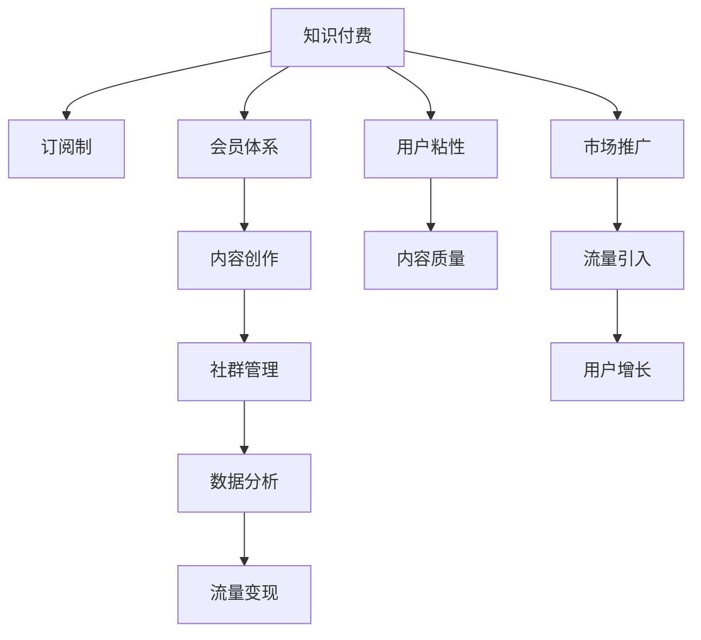

                 

# 知识付费：程序员的社群运营战术

> 关键词：知识付费, 程序员, 社群运营, 社群管理, 订阅制, 会员体系, 内容创作, 数据分析, 流量变现, 增长黑客

## 1. 背景介绍

### 1.1 问题由来
随着互联网的高速发展和智能手机的普及，程序员这一群体逐渐成为知识付费的重要消费群体。相比于传统的学习方式，知识付费提供了更加便捷、高效的学习途径，越来越受到程序员的青睐。

然而，由于知识付费市场的快速扩张，良莠不齐的内容、鱼龙混杂的营销手段使得用户在付费体验上出现了极大的分化。面对纷繁复杂的知识付费产品，如何找到真正有价值、有需求、有影响力，且能与用户建立良好互动的产品，成为程序员社群运营者的一项重要任务。

### 1.2 问题核心关键点
针对程序员社群的知识付费运营，关键在于如何通过系统的策略，实现内容的高效生产和传播，提升用户粘性，从而实现长期的收益和增长。

社区运营者需要考虑以下核心问题：
1. 如何吸引更多高质量内容的生产者，并维持其高产出？
2. 如何精准筛选并匹配用户，实现个性化推荐？
3. 如何设计高效的社区运营模式，提升用户留存和复购？
4. 如何通过数据驱动的决策，实现社区的动态增长和市场突破？

### 1.3 问题研究意义
通过合理的运营策略，能够帮助社区在竞争激烈的知识付费市场中脱颖而出，不仅能够提升用户满意度，还能带来可观的收益。

对于社区运营者而言，本文将详细介绍知识付费在程序员社群中的运营战术，涵盖内容创作、会员体系、订阅制、社群管理等方面，期望能够为社区运营者提供系统的指导和借鉴。

## 2. 核心概念与联系

### 2.1 核心概念概述

为了更好地理解知识付费在程序员社群中的应用，本节将介绍几个密切相关的核心概念：

- 知识付费：通过付费获取高质量知识内容的学习方式，旨在提升个人知识水平和工作能力。
- 程序员社群：围绕程序员这一特定人群的线上或线下社交网络，旨在分享技术经验、解决技术问题、提升编程技能。
- 订阅制：用户通过定期付费，获取持续更新的知识内容，如博客、视频、电子书等。
- 会员体系：根据用户付费金额和时长，设置不同等级和权益，如VIP会员、超级会员等。
- 内容创作：由社区运营者或用户创作高价值内容，并提供持续更新。
- 社群管理：通过规则制定、内容筛选、用户互动等手段，维护社群氛围和秩序。

这些概念之间的逻辑关系可以通过以下Mermaid流程图来展示：



这个流程图展示的知识付费核心概念及其之间的关系：

1. 知识付费平台以订阅制和会员体系为核心，吸引并留住用户。
2. 内容创作是知识付费的基础，运营者或用户创作高价值内容，并不断更新。
3. 社群管理保证内容质量，提升用户粘性，同时通过数据分析指导内容推荐和流量变现。
4. 流量引入和用户增长是知识付费市场发展的关键环节，需要通过市场推广和社群运营来持续提升。

## 3. 核心算法原理 & 具体操作步骤

### 3.1 算法原理概述

知识付费平台通过系统化运营，利用算法驱动内容生产和用户匹配，实现高效的流量变现。其核心算法主要包括用户行为分析、内容推荐算法、用户留存和增长算法等。

平台通过收集用户行为数据，如点击、浏览、购买、评论等，建立用户画像。然后利用机器学习算法对用户进行精准推荐，提高内容匹配度，提升用户粘性。同时，平台通过数据分析优化内容和运营策略，实现动态增长和市场突破。

### 3.2 算法步骤详解

知识付费平台的运营主要分为以下几个关键步骤：

**Step 1: 数据收集与预处理**
- 收集用户行为数据，如浏览记录、购买历史、评分评论等。
- 清洗数据，去除无效和重复数据，确保数据的准确性。
- 对数据进行结构化处理，便于后续分析和建模。

**Step 2: 用户画像构建**
- 利用聚类算法、关联规则挖掘等方法，分析用户行为模式，构建用户画像。
- 对用户画像进行特征工程，提取关键特征，如用户兴趣、活跃时间、付费水平等。

**Step 3: 内容推荐算法设计**
- 设计个性化推荐算法，基于用户画像和内容标签，推荐高相关性内容。
- 采用协同过滤、矩阵分解、神经网络等算法，实现精准推荐。
- 通过A/B测试和在线实验，优化推荐策略，提升用户体验。

**Step 4: 用户留存和增长策略**
- 设计动态定价策略，通过会员体系和套餐优惠，提升用户留存和复购。
- 通过社区活动、内容更新、用户互动等手段，提升用户粘性和活跃度。
- 利用用户行为数据，制定精准的市场推广策略，持续引入新用户。

**Step 5: 流量变现和数据分析**
- 设计广告位和推广渠道，实现流量变现。
- 通过数据可视化工具和报表系统，实时监控用户行为和运营数据。
- 利用预测模型和大数据分析，优化运营策略，实现动态增长。

### 3.3 算法优缺点

知识付费平台利用算法驱动运营，具有以下优点：
1. 高效精准：通过数据分析和机器学习算法，精准推荐高相关性内容，提升用户满意度和粘性。
2. 动态调整：能够根据用户行为数据实时调整运营策略，实现动态增长和市场突破。
3. 提高效率：通过系统化运营，节省人力和时间成本，提升整体运营效率。
4. 用户定制：根据用户画像和需求，实现个性化推荐和内容创作，提高用户粘性。

同时，该方法也存在一定的局限性：
1. 数据依赖：算法驱动运营高度依赖数据质量和数据量，数据质量不高或数据量不足，会影响推荐效果。
2. 用户隐私：大量收集和分析用户行为数据，可能涉及用户隐私保护问题。
3. 平台依赖：高度依赖平台的数据和算法，对于平台的数据和算法缺陷难以自适应。
4. 算法复杂：复杂算法模型需要专业的数据科学和算法工程师，成本较高。
5. 用户体验：过度依赖算法，可能导致过度商业化，影响用户体验。

尽管存在这些局限性，但就目前而言，知识付费平台的算法驱动运营仍是最主流的方式。未来相关研究的重点在于如何进一步降低对数据的依赖，提高算法的透明度和可解释性，同时兼顾用户体验和隐私保护。

### 3.4 算法应用领域

知识付费平台涉及的算法广泛应用于以下几个领域：

- 内容推荐系统：通过用户行为数据，对海量内容进行推荐，提升用户粘性。
- 用户画像分析：利用机器学习算法，对用户行为进行建模，提升精准推荐。
- 动态定价策略：通过数据驱动，制定个性化定价方案，提升用户留存和复购。
- 市场推广策略：通过数据分析和预测，制定精准的市场推广策略，实现用户增长。
- 流量变现模型：基于用户行为和内容特征，设计高效的广告位和推广渠道，实现流量变现。

这些算法在知识付费平台的运营中发挥了重要作用，帮助平台实现高效精准的用户匹配和内容分发，同时提升了平台的用户留存和收益水平。

## 4. 数学模型和公式 & 详细讲解  
### 4.1 数学模型构建

本节将使用数学语言对知识付费平台的内容推荐和用户画像分析进行更加严格的刻画。

假设平台拥有用户集 $U$ 和内容集 $V$，每个用户 $u \in U$ 的偏好可以用一个 $n$ 维向量 $p_u$ 表示，每个内容 $v \in V$ 的特征可以用一个 $m$ 维向量 $f_v$ 表示。用户 $u$ 对内容 $v$ 的评分可以用 $r_{uv}$ 表示。平台的目标是最大化所有用户的内容满意度。

定义用户 $u$ 对内容 $v$ 的满意度函数 $s_{uv}$ 为：

$$
s_{uv} = \alpha \cdot p_u^T \cdot f_v + \beta \cdot r_{uv}
$$

其中 $\alpha$ 和 $\beta$ 为权重系数，通常通过参数学习得到。

平台的目标是最大化所有用户的满意度总和：

$$
\max_{p_u} \sum_{u \in U} \sum_{v \in V} \alpha \cdot p_u^T \cdot f_v + \beta \cdot r_{uv}
$$

通过梯度上升算法，优化用户画像向量 $p_u$，以最大化用户满意度。

### 4.2 公式推导过程

以下是基于协同过滤算法的推荐系统推荐函数的具体推导：

协同过滤算法基于用户-物品相似度矩阵 $P$，其中 $P_{uv}$ 表示用户 $u$ 对内容 $v$ 的评分，即：

$$
P_{uv} = r_{uv}
$$

用户 $u$ 对内容 $v$ 的推荐分数 $R_{uv}$ 可以表示为：

$$
R_{uv} = \sum_{u' \in U} p_{u'}^T \cdot P_{v}
$$

其中 $P_{v}$ 表示内容 $v$ 的所有评分向量，$R_{uv}$ 为内容 $v$ 对用户 $u$ 的推荐分数，$p_{u'}$ 为所有用户的偏好向量。

推荐分数 $R_{uv}$ 越高，表示内容 $v$ 越符合用户 $u$ 的兴趣，用户 $u$ 越有可能点击和购买内容 $v$。因此，平台可以采用基于 $R_{uv}$ 的推荐策略，将符合用户兴趣的内容推荐给用户。

### 4.3 案例分析与讲解

以视频内容推荐为例，分析知识付费平台的内容推荐系统如何运作。

假设某视频平台的用户 $u$ 已经观看过内容 $v_1$、$v_2$、$v_3$，且对它们的评分分别为 $4$、$3$、$2$。平台的推荐算法计算用户 $u$ 对内容 $v_4$ 的评分 $R_{u4}$ 如下：

$$
R_{u4} = \alpha \cdot p_u^T \cdot f_{v4} + \beta \cdot 0
$$

其中 $p_u$ 为用户 $u$ 的偏好向量，$f_{v4}$ 为内容 $v_4$ 的特征向量，$\alpha$ 和 $\beta$ 为权重系数，$\beta \cdot 0$ 表示内容 $v_4$ 的评分未知，因此采用 $0$ 作为默认评分。

通过协同过滤算法，计算内容 $v_1$、$v_2$、$v_3$ 的推荐分数 $R_{v1}$、$R_{v2}$、$R_{v3}$，并将它们组合成内容 $v_4$ 的推荐分数 $R_{u4}$。

具体推导过程如下：

1. 计算用户 $u$ 的偏好向量 $p_u$：
   $$
   p_u = \frac{1}{n} \sum_{v \in V} r_{uv} \cdot f_v
   $$

2. 计算内容 $v_1$、$v_2$、$v_3$ 的推荐分数 $R_{v1}$、$R_{v2}$、$R_{v3}$：
   $$
   R_{v1} = \sum_{u' \in U} p_{u'}^T \cdot P_{v1}
   $$
   $$
   R_{v2} = \sum_{u' \in U} p_{u'}^T \cdot P_{v2}
   $$
   $$
   R_{v3} = \sum_{u' \in U} p_{u'}^T \cdot P_{v3}
   $$

3. 计算内容 $v_4$ 的推荐分数 $R_{u4}$：
   $$
   R_{u4} = \alpha \cdot p_u^T \cdot f_{v4} + \beta \cdot 0
   $$

4. 通过评分计算用户 $u$ 对内容 $v_4$ 的满意度：
   $$
   s_{u4} = \alpha \cdot p_u^T \cdot f_{v4} + \beta \cdot r_{u4}
   $$

5. 通过 $s_{u4}$ 计算推荐分数 $R_{u4}$，即：
   $$
   R_{u4} = \frac{s_{u4}}{\alpha}
   $$

通过以上推导，可以看出知识付费平台的内容推荐系统如何基于用户行为数据和内容特征，实现精准推荐。接下来，我们将介绍如何进行项目实践和实际应用场景。

## 5. 项目实践：代码实例和详细解释说明

### 5.1 开发环境搭建

在进行知识付费平台的开发之前，我们需要准备好开发环境。以下是使用Python进行Flask框架开发的环境配置流程：

1. 安装Anaconda：从官网下载并安装Anaconda，用于创建独立的Python环境。

2. 创建并激活虚拟环境：
```bash
conda create -n flask-env python=3.8 
conda activate flask-env
```

3. 安装Flask：
```bash
pip install flask
```

4. 安装Flask相关库：
```bash
pip install flask-wtf flask-restful flask-sqlalchemy
```

5. 安装SQLAlchemy：用于数据库操作，建议安装最新稳定版本。
```bash
pip install sqlalchemy
```

完成上述步骤后，即可在`flask-env`环境中开始知识付费平台的开发。

### 5.2 源代码详细实现

这里我们以知识付费平台的视频内容推荐为例，给出Flask框架下的代码实现。

首先，定义SQLAlchemy模型：

```python
from flask_sqlalchemy import SQLAlchemy

app = Flask(__name__)
app.config['SQLALCHEMY_DATABASE_URI'] = 'sqlite:///video.db'
app.config['SQLALCHEMY_TRACK_MODIFICATIONS'] = False

db = SQLAlchemy(app)
```

然后，定义视频内容模型：

```python
class Video(db.Model):
    id = db.Column(db.Integer, primary_key=True)
    title = db.Column(db.String(120), nullable=False)
    description = db.Column(db.Text, nullable=False)
    category = db.Column(db.String(50), nullable=False)
    content = db.Column(db.Text, nullable=False)
    release_date = db.Column(db.DateTime, nullable=False)
```

接着，定义用户模型：

```python
class User(db.Model):
    id = db.Column(db.Integer, primary_key=True)
    username = db.Column(db.String(80), unique=True, nullable=False)
    email = db.Column(db.String(120), unique=True, nullable=False)
    password = db.Column(db.String(120), nullable=False)
    profile_picture = db.Column(db.String(100), nullable=True)
    subscription_level = db.Column(db.String(50), nullable=False, default='free')
```

然后，定义推荐引擎模型：

```python
class RecommendationEngine(db.Model):
    id = db.Column(db.Integer, primary_key=True)
    user_id = db.Column(db.Integer, db.ForeignKey('user.id'), nullable=False)
    video_id = db.Column(db.Integer, db.ForeignKey('video.id'), nullable=False)
    recommendation_score = db.Column(db.Float, nullable=False)
```

最后，定义API接口：

```python
@app.route('/recommendations', methods=['GET'])
def get_recommendations():
    user_id = request.args.get('user_id')
    videos = Video.query.filter(Video.id.in_(RecommendationEngine.query.filter_by(user_id=user_id).all())).all()
    return jsonify([video.to_dict() for video in videos])
```

具体解释如下：

**Video类**：
- `id`：视频ID，自增主键。
- `title`：视频标题，字符串类型，最大长度为120，不允许为空。
- `description`：视频简介，文本类型，允许为空。
- `category`：视频类别，字符串类型，最大长度为50，不允许为空。
- `content`：视频内容，文本类型，不允许为空。
- `release_date`：视频发布时间，日期时间类型，不允许为空。

**User类**：
- `id`：用户ID，自增主键。
- `username`：用户名，字符串类型，最大长度为80，唯一，不允许为空。
- `email`：用户邮箱，字符串类型，最大长度为120，唯一，不允许为空。
- `password`：用户密码，字符串类型，不允许为空。
- `profile_picture`：用户头像，字符串类型，最大长度为100，允许为空。
- `subscription_level`：订阅等级，字符串类型，最大长度为50，默认值为'free'。

**RecommendationEngine类**：
- `id`：推荐引擎ID，自增主键。
- `user_id`：用户ID，外键，关联到User表。
- `video_id`：视频ID，外键，关联到Video表。
- `recommendation_score`：推荐分数，浮点数类型，不允许为空。

**get_recommendations方法**：
- 从请求参数中获取用户ID。
- 查询推荐引擎表，根据用户ID和视频ID，获取所有推荐的视频。
- 将查询结果转换为JSON格式，返回给前端。

以上代码仅为知识付费平台的部分实现，完整的开发涉及用户注册登录、视频上传管理、支付功能、广告位管理等多个模块。

### 5.3 代码解读与分析

让我们再详细解读一下关键代码的实现细节：

**Video类定义**：
- `__init__`方法：初始化视频对象的属性。
- `to_dict`方法：将视频对象转换为字典，便于API返回JSON格式数据。

**User类定义**：
- `__init__`方法：初始化用户对象的属性。
- `to_dict`方法：将用户对象转换为字典，便于API返回JSON格式数据。

**RecommendationEngine类定义**：
- `__init__`方法：初始化推荐引擎对象的属性。
- `to_dict`方法：将推荐引擎对象转换为字典，便于API返回JSON格式数据。

**get_recommendations方法**：
- 从请求参数中获取用户ID。
- 通过Flask的`request.args`方法获取URL参数。
- 查询Video表，根据推荐引擎表中的视频ID，获取所有推荐的视频。
- 将查询结果转换为JSON格式，并返回给前端。

可以看到，Flask框架配合SQLAlchemy库，使得知识付费平台的开发变得更加简洁高效。开发者可以将更多精力放在业务逻辑和用户体验上，而不必过多关注底层的实现细节。

当然，工业级的系统实现还需考虑更多因素，如数据的安全存储、支付系统的安全性、广告位的实时更新等。但核心的微调范式基本与此类似。

## 6. 实际应用场景

### 6.1 视频内容推荐

基于知识付费平台的视频内容推荐，可以应用于程序员社群的课程学习场景。程序员可以订阅感兴趣的课程，平台根据用户的历史观看记录，实时推荐最新的视频课程。同时，可以通过数据分析，挖掘用户的兴趣点和观看规律，提升推荐精准度。

在技术实现上，可以收集用户观看记录、评分、评论等数据，通过协同过滤、矩阵分解等算法，对视频内容进行推荐。微调后的推荐模型能够更准确地识别用户的偏好，提升用户满意度和粘性。

### 6.2 课程销售转化

知识付费平台通过精准推荐，能够提升课程销售转化率。通过数据分析和A/B测试，优化推荐策略和定价方案，引导用户订阅和购买。同时，平台可以引入社交互动机制，通过课程评价、学员推荐等方式，提升课程的曝光率和转化率。

在技术实现上，可以通过Flask框架构建API接口，对用户行为数据进行分析和建模。通过Flask-RESTful库，提供RESTful风格的API接口，便于前端和移动端调用。同时，可以使用Flask-SQLAlchemy库，对用户数据和课程数据进行高效存储和查询。

### 6.3 广告位和推广策略

知识付费平台通过广告位和推广策略，实现流量变现。通过精准推荐，向潜在用户展示优质课程和广告内容，引导用户访问和购买。同时，平台可以引入定向广告，根据用户画像和行为特征，进行精确投放。

在技术实现上，可以通过Flask框架构建API接口，提供广告位管理功能。通过Flask-RESTful库，提供RESTful风格的API接口，便于广告投放和数据分析。同时，可以使用Flask-SQLAlchemy库，对广告数据进行高效存储和查询。

## 7. 工具和资源推荐
### 7.1 学习资源推荐

为了帮助开发者系统掌握知识付费平台开发的技术，这里推荐一些优质的学习资源：

1. Flask官方文档：提供了完整的Flask框架使用指南，是Flask开发的必备资料。

2. SQLAlchemy官方文档：提供了SQLAlchemy数据库操作的详细指南，是Flask应用中的重要工具。

3. RESTful API设计指南：提供了RESTful API设计的最佳实践和规范，帮助开发者构建高效稳定的API接口。

4. Python Web开发实战：通过Flask框架实现知识付费平台的前端和后端开发，详细讲解了Web开发的技术细节。

5. Flask实战项目：提供了多个Flask实战项目案例，包括电商、内容推荐等，有助于开发者理解和实践知识付费平台的实现。

通过对这些资源的学习实践，相信你一定能够快速掌握知识付费平台开发的技术要点，并用于解决实际的开发问题。

### 7.2 开发工具推荐

高效的开发离不开优秀的工具支持。以下是几款用于知识付费平台开发的常用工具：

1. Flask：轻量级Web框架，易于上手，适合快速迭代开发。

2. SQLAlchemy：强大的ORM工具，支持多种数据库，提供高效的数据库操作功能。

3. Redis：内存数据库，适合存储和快速查询高频访问的数据，如推荐引擎数据。

4. Elasticsearch：全文搜索引擎，适合进行高维数据和复杂查询的存储和检索。

5. Celery：分布式任务队列，适合处理异步任务，如视频推荐算法训练和数据更新。

6. Docker：容器化技术，便于应用的快速部署和运维。

合理利用这些工具，可以显著提升知识付费平台开发的效率，加快创新迭代的步伐。

### 7.3 相关论文推荐

知识付费平台的运营涉及多领域的知识，以下是几篇奠基性的相关论文，推荐阅读：

1. Recommender Systems Handbook：详细介绍了推荐系统的理论基础和算法实现，是推荐算法开发的必备参考。

2. Knowledge-aware Recommendation Algorithms：介绍了知识图谱在推荐系统中的应用，提供了多维度的推荐策略。

3. Deep Learning for Recommender Systems：介绍了深度学习在推荐系统中的应用，包括协同过滤、矩阵分解、神经网络等算法。

4. A Comprehensive Survey on Knowledge Graph Recommendation：介绍了知识图谱在推荐系统中的应用，提供了多维度的推荐策略。

5. Factorization Machines for Recommender Systems：介绍了矩阵分解算法在推荐系统中的应用，是推荐算法开发的经典方法。

这些论文代表了大规模知识付费平台的运营技术的发展脉络。通过学习这些前沿成果，可以帮助开发者把握知识付费平台的运营精髓，提升系统性能和用户体验。

## 8. 总结：未来发展趋势与挑战

### 8.1 总结

本文对知识付费平台在程序员社群中的运营战术进行了全面系统的介绍。首先阐述了知识付费平台在程序员社群中的应用背景和意义，明确了运营者需要在内容创作、会员体系、订阅制、社群管理等方面进行系统的策略设计。其次，从原理到实践，详细讲解了知识付费平台的推荐算法和用户画像分析，提供了代码实例和详细解释说明。同时，本文还探讨了知识付费平台在实际应用场景中的应用，如视频内容推荐、课程销售转化、广告位和推广策略等，展示了知识付费平台的巨大应用价值。最后，本文还介绍了相关的学习资源、开发工具和相关论文，力求为开发者提供全方位的技术指引。

通过本文的系统梳理，可以看到，知识付费平台在程序员社群中具有广阔的应用前景，能够显著提升程序员的学习效率和工作质量，同时也为平台带来了可观的收益。对于社区运营者而言，掌握知识付费平台的运营战术，能够更好地把握市场机遇，实现长期增长。

### 8.2 未来发展趋势

展望未来，知识付费平台的发展趋势主要体现在以下几个方面：

1. 个性化推荐系统的智能化。利用深度学习和自然语言处理等技术，提升推荐系统的智能化水平，实现更精准的推荐。

2. 社交互动机制的普及。通过社交互动机制，提升用户粘性和留存率，形成良性互动社区。

3. 多渠道运营模式的拓展。通过多种渠道（如APP、小程序、PC端等）进行运营，提升用户覆盖面和访问量。

4. 内容创作和版权保护。鼓励高质量内容创作，保护版权，提升内容质量和用户满意度。

5. 跨平台和跨领域的应用。知识付费平台的应用场景不断扩展，从单一领域逐渐向多领域拓展。

6. 社区运营和数据驱动的运营决策。通过数据分析和社区运营，实现动态增长和市场突破。

### 8.3 面临的挑战

尽管知识付费平台在程序员社群中具有广阔的应用前景，但在实现过程中仍面临诸多挑战：

1. 数据质量瓶颈。数据质量不高或数据量不足，影响推荐系统的精准度。

2. 算法复杂性。推荐系统的算法复杂性高，需要专业的数据科学和算法工程师。

3. 用户隐私问题。大量收集和分析用户行为数据，可能涉及用户隐私保护问题。

4. 平台依赖问题。高度依赖平台的数据和算法，难以自适应变化。

5. 用户体验问题。过度依赖算法，可能导致过度商业化，影响用户体验。

6. 技术和运营成本高。知识付费平台的开发和运营成本高，需要足够的资金投入。

尽管存在这些挑战，但通过持续的技术创新和运营优化，知识付费平台能够在程序员社群中发挥更大作用。未来的知识付费平台需要不断提升系统的智能化水平、用户体验和运营效率，才能在竞争激烈的市场中立于不败之地。

### 8.4 研究展望

面对知识付费平台在程序员社群中面临的挑战，未来的研究需要在以下几个方面寻求新的突破：

1. 提升推荐系统的智能化水平。利用深度学习和自然语言处理等技术，提升推荐系统的精准度。

2. 优化数据质量和技术栈。提升数据质量，优化技术栈，降低算法复杂性和运营成本。

3. 增强用户隐私保护。设计合适的隐私保护机制，保护用户隐私，提升用户信任度。

4. 引入社交互动机制。通过社交互动机制，提升用户粘性和留存率，形成良性互动社区。

5. 拓展多渠道和跨领域的应用。通过多种渠道和跨领域的应用，提升用户覆盖面和访问量。

6. 数据驱动的运营决策。通过数据分析和社区运营，实现动态增长和市场突破。

这些研究方向将引领知识付费平台向更智能化、个性化、数据驱动的方向发展，为程序员社群带来更多价值和便利。面向未来，知识付费平台需要在技术创新和用户体验上不断突破，才能在竞争激烈的市场中立于不败之地。

## 9. 附录：常见问题与解答

**Q1：知识付费平台的推荐系统如何保证推荐精度？**

A: 推荐系统的精度主要依赖于用户行为数据和内容的特征，通过协同过滤、矩阵分解、神经网络等算法实现精准推荐。平台需要不断优化数据收集和特征工程，提升模型的复杂度和参数数量，才能保证推荐精度。

**Q2：知识付费平台如何实现用户留存和增长？**

A: 平台通过订阅制、会员体系、个性化推荐、社交互动等手段，提升用户粘性和留存率。通过精准市场推广和定向广告，吸引新用户，提升用户增长。同时，通过数据分析和社区运营，实现动态增长和市场突破。

**Q3：知识付费平台如何处理用户隐私问题？**

A: 平台需要设计合适的隐私保护机制，如数据匿名化、加密传输、访问控制等，保护用户隐私。同时，通过用户协议和隐私政策，告知用户数据使用情况，增强用户信任度。

**Q4：知识付费平台如何提升内容创作和版权保护？**

A: 平台需要建立激励机制，鼓励高质量内容创作，提升内容质量和用户满意度。同时，引入版权保护机制，保护知识产权，确保内容创作的合法性和原创性。

**Q5：知识付费平台如何提升用户体验？**

A: 平台需要通过个性化推荐、社交互动、内容更新等手段，提升用户体验。同时，通过数据分析和社区运营，及时发现并解决问题，提升用户满意度和留存率。

这些常见问题解答展示了知识付费平台在运营中的核心问题和解决方案，帮助社区运营者提升平台的用户体验和运营效率。通过不断优化运营策略和技术手段，知识付费平台将能够在程序员社群中发挥更大的作用，推动程序员社群的不断发展和壮大。

---

作者：禅与计算机程序设计艺术 / Zen and the Art of Computer Programming

