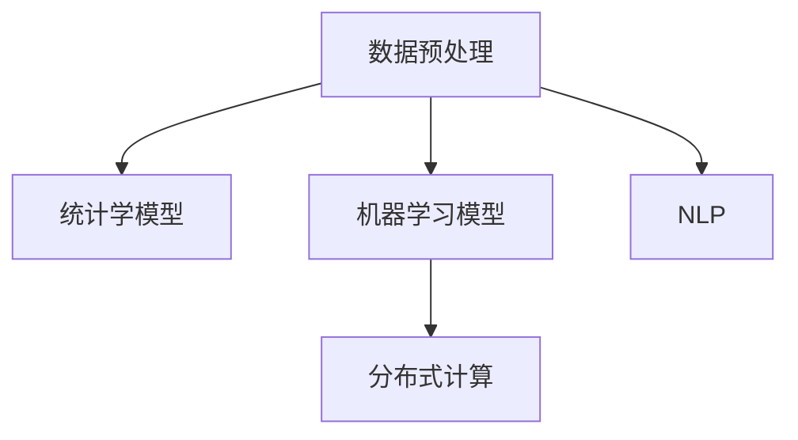

                 

# 知识发现引擎与人类认知极限的突破

## 1. 背景介绍

### 1.1 问题由来

随着信息技术的高速发展，人类进入了“数据爆炸”的时代。全球每年产生的数据量以指数级增长，涵盖了医疗、金融、社交、电商等各个领域。这些数据蕴藏着巨大的价值，但传统的数据处理方式难以高效提取和利用。知识发现引擎(Knowledge Discovery Engine, KDE)应运而生，作为一项先进的数据挖掘技术，它通过自动分析海量数据，挖掘出有价值的知识模式和洞察力，辅助人类决策。

然而，知识发现引擎的应用也面临挑战。人类认知能力有限，难以处理如此庞大数据量的信息。当前的知识发现引擎依赖复杂的算法和庞大的计算资源，难以实现全面的覆盖和深度的理解。如何突破人类认知极限，提升知识发现的效率和准确性，成为亟待解决的问题。

### 1.2 问题核心关键点

知识发现引擎的核心在于从海量数据中提取知识，以辅助人类决策。但其瓶颈在于：

- **数据量庞大**：现代企业每天产生的数据量动辄数TB甚至数PB，难以人工处理。
- **数据多样性**：数据形式多样，包括结构化、半结构化、非结构化数据，处理难度高。
- **数据质量差**：数据存在缺失、噪声、异常等质量问题，难以直接使用。
- **知识表达复杂**：知识发现需要结合领域知识，难以自动生成精确、全面的知识模式。
- **模型复杂度**：知识发现依赖复杂的统计学和机器学习模型，难以高效应用。

本节旨在探讨如何通过技术手段突破上述挑战，提升知识发现引擎的性能和应用价值。

## 2. 核心概念与联系

### 2.1 核心概念概述

为更好地理解知识发现引擎，本节将介绍几个关键概念：

- **知识发现引擎(KDE)**：利用数据挖掘和机器学习算法，从大量数据中提取和发现知识模式的工具。
- **数据预处理**：对原始数据进行清洗、归一化、特征工程等处理，提高数据质量。
- **统计学模型**：如回归分析、聚类分析、分类算法等，用于挖掘数据中的规律和模式。
- **机器学习模型**：如神经网络、支持向量机、决策树等，用于自动构建知识模式。
- **自然语言处理(NLP)**：处理文本数据的工具，用于从非结构化文本中提取信息。
- **分布式计算**：通过并行计算，提高数据处理和模型训练的效率。

这些概念之间的关系可以通过以下Mermaid流程图来展示：



这个流程图展示了一组核心概念及其之间的关系：

1. 数据预处理将原始数据转化为高质量数据。
2. 统计学模型和机器学习模型在预处理后的数据上，挖掘出有价值的知识模式。
3. NLP处理文本数据，提取关键信息。
4. 分布式计算加速数据处理和模型训练，提高效率。

## 3. 核心算法原理 & 具体操作步骤

### 3.1 算法原理概述

知识发现引擎的原理主要分为以下几个步骤：

1. **数据收集与预处理**：收集海量数据，并对数据进行清洗、归一化、特征工程等预处理操作，以提高数据质量。
2. **模型训练与验证**：在预处理后的数据上，选择适合的统计学或机器学习模型进行训练，并通过验证集评估模型性能。
3. **知识发现与解释**：在训练好的模型上，利用分布式计算等手段，高效地进行知识发现。最后，通过解释模型输出，生成易于理解的报告和可视化结果。

### 3.2 算法步骤详解

以下是知识发现引擎的核心算法步骤：

**Step 1: 数据收集与预处理**
- **数据收集**：利用网络爬虫、API接口、数据库导入等方式，收集所需的数据集。
- **数据清洗**：去除重复、缺失、异常数据，确保数据完整性。
- **数据归一化**：将不同格式的数据统一转化为标准格式，方便模型处理。
- **特征工程**：选择合适的特征，提取特征值，构建特征矩阵。

**Step 2: 模型训练与验证**
- **选择合适的模型**：根据数据特点，选择适合的统计学或机器学习模型。如线性回归、随机森林、神经网络等。
- **模型训练**：在训练集上训练模型，使用梯度下降等优化算法更新模型参数。
- **模型验证**：在验证集上评估模型性能，调整模型参数，防止过拟合。

**Step 3: 知识发现与解释**
- **分布式计算**：使用分布式计算框架，如Hadoop、Spark等，加速模型训练和数据处理。
- **知识发现**：利用训练好的模型对大数据进行推理和预测，发现知识模式。
- **结果解释**：对模型输出进行解释，生成易于理解的报告和可视化结果。

### 3.3 算法优缺点

知识发现引擎的主要优点：
1. 自动化处理：自动提取、分析和解释数据，节省大量人工成本。
2. 发现未知知识：发现隐藏在数据中的规律和模式，辅助决策。
3. 应用广泛：适用于金融、医疗、电商等多个领域，具有广泛的应用前景。

同时，该方法也存在一些局限：
1. 数据质量要求高：数据预处理难度大，需大量资源进行清洗和归一化。
2. 模型复杂度高：统计学和机器学习模型计算复杂，难以高效应用。
3. 结果解释性差：模型输出难以解释，无法提供直观的决策依据。
4. 数据隐私问题：处理敏感数据时，需确保数据隐私和安全。

尽管存在这些局限，但知识发现引擎在数据驱动决策中仍具有重要的价值，特别是在大数据时代，其作用不容忽视。

### 3.4 算法应用领域

知识发现引擎已经在多个领域得到广泛应用，例如：

- **金融领域**：用于风险评估、客户细分、投资策略等。通过分析金融数据，发现潜在风险和投资机会。
- **医疗领域**：用于疾病诊断、患者分类、治疗方案等。通过分析患者数据，发现疾病模式和治疗方案。
- **零售电商**：用于用户画像、产品推荐、销售预测等。通过分析用户行为数据，发现消费规律和预测销售趋势。
- **社交网络**：用于用户行为分析、社区发现、情感分析等。通过分析社交数据，发现用户行为模式和社区结构。
- **智能制造**：用于设备监控、故障预测、生产优化等。通过分析制造数据，发现设备运行模式和生产瓶颈。

## 4. 数学模型和公式 & 详细讲解

### 4.1 数学模型构建

知识发现引擎的数学模型构建主要涉及以下几种：

- **线性回归模型**：用于预测连续型变量，公式为 $y=\beta_0+\sum_{i=1}^n\beta_ix_i$。
- **逻辑回归模型**：用于分类问题，公式为 $\log\frac{P(y=1)}{1-P(y=1)}=\sum_{i=1}^n\beta_ix_i$。
- **支持向量机(SVM)**：用于分类和回归问题，通过寻找最大间隔超平面进行分类，公式为 $w\cdot x+b=0$。
- **决策树模型**：用于分类和回归问题，通过构建树形结构进行决策，公式为 $f(x)=\sum_{i=1}^m\lambda_iG_i(x)$。
- **神经网络模型**：用于复杂的分类和回归问题，公式为 $y=f(\sum_{i=1}^n\beta_ix_i+\beta_0)$。

这些模型在知识发现引擎中的应用将会在后文进行详细讲解。

### 4.2 公式推导过程

这里以线性回归模型为例，推导其公式。

假设数据集为 $(x_1,y_1),(x_2,y_2),\ldots,(x_n,y_n)$，其中 $x_i=(x_{i1},x_{i2},\ldots,x_{in})$ 为特征向量，$y_i$ 为标签值。

线性回归模型的目标是最小化损失函数：

$$
L(w,b)=\frac{1}{2}\sum_{i=1}^n(y_i-\beta_0-\sum_{j=1}^n\beta_jx_{ij})^2
$$

其中 $w=(w_1,w_2,\ldots,w_n)$ 为模型参数。

求导后得到参数的更新公式：

$$
\begin{align*}
\frac{\partial L}{\partial \beta_0} &= -\sum_{i=1}^n(y_i-\beta_0-\sum_{j=1}^n\beta_jx_{ij}) \\
\frac{\partial L}{\partial \beta_j} &= -\sum_{i=1}^n(x_{ij}-\sum_{k=1}^n\beta_kx_{ik})y_i
\end{align*}
$$

结合梯度下降算法，更新参数值：

$$
\begin{align*}
\beta_0 &\leftarrow \beta_0-\eta\frac{\partial L}{\partial \beta_0} \\
\beta_j &\leftarrow \beta_j-\eta\frac{\partial L}{\partial \beta_j}
\end{align*}
$$

其中 $\eta$ 为学习率。

### 4.3 案例分析与讲解

以金融领域的信用风险评估为例，分析知识发现引擎的应用。

**数据准备**：收集贷款申请数据，包括个人基本信息、收入情况、贷款金额等。

**特征选择**：选择年龄、收入、贷款金额等关键特征。

**模型选择**：选择逻辑回归模型进行分类。

**模型训练**：在训练集上训练逻辑回归模型，使用交叉验证评估模型性能。

**知识发现**：在测试集上评估模型预测结果，发现贷款违约的预测规则。

**结果解释**：将预测结果可视化，生成易于理解的报告，辅助决策。

## 5. 项目实践：代码实例和详细解释说明

### 5.1 开发环境搭建

在进行知识发现引擎实践前，我们需要准备好开发环境。以下是使用Python进行Scikit-Learn开发的环境配置流程：

1. 安装Anaconda：从官网下载并安装Anaconda，用于创建独立的Python环境。

2. 创建并激活虚拟环境：
```bash
conda create -n sklearn-env python=3.8 
conda activate sklearn-env
```

3. 安装Scikit-Learn：
```bash
conda install scikit-learn
```

4. 安装必要的工具包：
```bash
pip install numpy pandas matplotlib jupyter notebook ipython
```

完成上述步骤后，即可在`sklearn-env`环境中开始实践。

### 5.2 源代码详细实现

下面以信用风险评估为例，给出使用Scikit-Learn进行知识发现的PyTorch代码实现。

首先，定义数据处理函数：

```python
import pandas as pd
from sklearn.model_selection import train_test_split
from sklearn.preprocessing import StandardScaler

def load_data():
    data = pd.read_csv('loan_data.csv')
    X = data.drop(['default'], axis=1)
    y = data['default']
    X_train, X_test, y_train, y_test = train_test_split(X, y, test_size=0.2, random_state=42)
    scaler = StandardScaler()
    X_train = scaler.fit_transform(X_train)
    X_test = scaler.transform(X_test)
    return X_train, X_test, y_train, y_test
```

然后，定义模型训练函数：

```python
from sklearn.linear_model import LogisticRegression

def train_model(X_train, X_test, y_train, y_test):
    model = LogisticRegression()
    model.fit(X_train, y_train)
    y_pred = model.predict(X_test)
    accuracy = accuracy_score(y_test, y_pred)
    return accuracy
```

最后，启动训练流程并在测试集上评估：

```python
from sklearn.metrics import accuracy_score

X_train, X_test, y_train, y_test = load_data()
accuracy = train_model(X_train, X_test, y_train, y_test)
print(f"Accuracy: {accuracy:.2f}")
```

以上代码实现了使用Scikit-Learn进行信用风险评估的逻辑回归模型训练和评估。可以看到，Scikit-Learn提供了丰富的数据处理和机器学习工具，极大地简化了模型的实现和调试过程。

### 5.3 代码解读与分析

让我们再详细解读一下关键代码的实现细节：

**load_data函数**：
- 读取贷款数据集，处理并分割成训练集和测试集。
- 对特征进行标准化处理，以便更好地拟合模型。

**train_model函数**：
- 定义逻辑回归模型。
- 使用训练集数据拟合模型，并使用测试集数据评估模型性能。
- 返回模型的准确率。

**主程序**：
- 加载数据集，调用训练函数进行模型训练。
- 输出模型在测试集上的准确率。

可以看到，Scikit-Learn在简化代码实现的同时，还提供了强大的工具和丰富的算法库，使得知识发现引擎的开发更加高效便捷。

## 6. 实际应用场景

### 6.1 智能制造

知识发现引擎在智能制造领域的应用非常广泛。通过分析生产数据，可以发现设备运行模式和生产瓶颈，从而优化生产流程，提高生产效率和产品质量。

具体而言，可以收集设备传感器数据、生产记录、质量检验记录等数据，使用知识发现引擎进行故障预测、设备维护、生产优化等。通过分析设备运行数据，可以发现异常操作和设备故障，及时进行维护和修理，减少停机时间和成本。通过分析生产数据，可以发现生产瓶颈和流程瓶颈，优化生产流程，提高生产效率。通过分析质量检验数据，可以发现质量问题，改进产品质量。

### 6.2 智慧城市

智慧城市是知识发现引擎的重要应用场景之一。通过分析城市数据，可以发现城市运行模式和问题，从而优化城市管理，提升城市生活质量。

具体而言，可以收集城市交通数据、环境数据、公共设施数据等，使用知识发现引擎进行交通流量预测、能源消耗分析、公共安全监测等。通过分析交通数据，可以发现交通拥堵点和优化路线，减少交通拥堵。通过分析环境数据，可以发现污染源和污染程度，进行环境治理。通过分析公共设施数据，可以发现资源分配问题，优化公共资源配置。

### 6.3 医疗诊断

知识发现引擎在医疗诊断领域也有广泛应用。通过分析患者数据，可以发现疾病模式和诊断方法，从而提高诊断准确性和治疗效果。

具体而言，可以收集患者病历数据、实验室检测数据、影像数据等，使用知识发现引擎进行疾病诊断、治疗方案推荐等。通过分析病历数据，可以发现疾病模式和诊断规则，提高诊断准确性。通过分析实验室检测数据，可以发现病情变化趋势，进行疾病预测。通过分析影像数据，可以发现异常部位和病变类型，进行早期诊断。

## 7. 工具和资源推荐

### 7.1 学习资源推荐

为了帮助开发者系统掌握知识发现引擎的理论基础和实践技巧，这里推荐一些优质的学习资源：

1. 《数据挖掘导论》书籍：由凯莱·米特尼克和约翰·金格曼所著，介绍了数据挖掘的基本概念和常用技术。
2. 《机器学习实战》书籍：由彼得·哈顿和杰弗里·基尔南所著，提供了丰富的机器学习算法和实践案例。
3. Coursera《数据科学导论》课程：由斯坦福大学开设，涵盖数据科学的基本概念和常用工具。
4. Kaggle竞赛平台：提供了丰富的数据集和竞赛任务，可用于实践和展示技能。
5. DataCamp在线学习平台：提供了丰富的数据科学和机器学习课程，适合自学。

通过对这些资源的学习实践，相信你一定能够快速掌握知识发现引擎的精髓，并用于解决实际的业务问题。

### 7.2 开发工具推荐

高效的开发离不开优秀的工具支持。以下是几款用于知识发现引擎开发的常用工具：

1. Scikit-Learn：基于Python的机器学习库，提供丰富的机器学习算法和工具。
2. TensorFlow：由Google主导开发的深度学习框架，适合大规模工程应用。
3. PyTorch：基于Python的深度学习框架，灵活高效。
4. Weights & Biases：模型训练的实验跟踪工具，可以记录和可视化模型训练过程中的各项指标。
5. TensorBoard：TensorFlow配套的可视化工具，可实时监测模型训练状态，并提供丰富的图表呈现方式。
6. Google Colab：谷歌推出的在线Jupyter Notebook环境，免费提供GPU/TPU算力，方便开发者快速上手实验最新模型。

合理利用这些工具，可以显著提升知识发现引擎的开发效率，加快创新迭代的步伐。

### 7.3 相关论文推荐

知识发现引擎的发展源于学界的持续研究。以下是几篇奠基性的相关论文，推荐阅读：

1. ID3: A Program for Multivalued Decision Trees（ID3决策树算法）：标志着数据挖掘的开端，奠定了决策树算法的基础。
2. A Framework for Bunching Knowledge into Fixed-Width Bins（束知识算法）：提出了束知识算法，用于数据分箱和挖掘知识。
3. Associa: A General Associative Memory Algorithm for Association Rule Learning（关联规则学习算法）：提出了关联规则学习算法，用于挖掘频繁项集和关联规则。
4. Knowledge Discovery in Databases: Algorithms, Interfaces, and Applications（KDD会议论文集）：介绍了数据挖掘的算法、工具和应用，是数据挖掘领域的权威综述。
5. Web Mining: Survey and Experiments Towards an Understanding of Data Mining on the Web（Web挖掘综述）：介绍了Web挖掘的常用技术和应用，适用于数据挖掘在Web领域的应用。

这些论文代表了大数据挖掘技术的发展脉络。通过学习这些前沿成果，可以帮助研究者把握学科前进方向，激发更多的创新灵感。

## 8. 总结：未来发展趋势与挑战

### 8.1 总结

本文对知识发现引擎的原理和应用进行了全面系统的介绍。首先阐述了知识发现引擎的研究背景和意义，明确了其在大数据时代的重要性。其次，从原理到实践，详细讲解了知识发现引擎的数学模型和算法步骤，给出了完整的代码实例。同时，本文还探讨了知识发现引擎在智能制造、智慧城市、医疗诊断等领域的实际应用，展示了其广阔的应用前景。此外，本文精选了知识发现引擎的学习资源、开发工具和相关论文，力求为读者提供全方位的技术指引。

通过本文的系统梳理，可以看到，知识发现引擎在数据驱动决策中具有重要的价值，特别是在大数据时代，其作用不可替代。未来，伴随技术手段的不断进步，知识发现引擎必将在更多领域发挥重要作用，为人类决策提供更加精准、高效的支持。

### 8.2 未来发展趋势

展望未来，知识发现引擎将呈现以下几个发展趋势：

1. 自动化程度提升：通过自动化数据清洗、特征选择和模型训练，提高知识发现的效率和准确性。
2. 跨领域知识融合：结合多领域知识库和规则库，构建更全面、准确的模型。
3. 多模态数据挖掘：融合视觉、文本、音频等多模态数据，提高知识发现的深度和广度。
4. 实时数据处理：引入流计算和实时数据处理技术，实现知识发现的实时性和动态性。
5. 交互式学习：结合用户反馈和交互式学习技术，提高知识发现的适应性和实用性。
6. 联邦学习：通过分布式计算和联邦学习技术，保护数据隐私的同时，实现知识发现的大规模协同。

这些趋势将进一步提升知识发现引擎的性能和应用价值，为人类决策提供更加强大的支持。

### 8.3 面临的挑战

尽管知识发现引擎在数据驱动决策中具有重要价值，但其在实际应用中也面临诸多挑战：

1. 数据质量问题：数据存在缺失、噪声、异常等质量问题，难以直接使用。
2. 数据量庞大：数据量庞大，处理难度大，需要高效的算法和工具。
3. 模型复杂度高：统计学和机器学习模型计算复杂，难以高效应用。
4. 结果解释性差：模型输出难以解释，无法提供直观的决策依据。
5. 数据隐私问题：处理敏感数据时，需确保数据隐私和安全。
6. 应用场景多样：不同领域的数据特点和业务需求差异较大，难以一概而论。

尽管存在这些挑战，但知识发现引擎在数据驱动决策中仍具有重要的价值，特别是在大数据时代，其作用不可替代。

### 8.4 研究展望

未来的研究需要在以下几个方面寻求新的突破：

1. 探索更高效的数据预处理和特征选择算法。开发更高效的数据清洗和特征选择算法，减少预处理时间和计算资源消耗。
2. 开发更灵活的模型选择和融合机制。结合多领域知识库和规则库，构建更全面、准确的模型。
3. 引入更多的跨领域数据挖掘技术。结合多模态数据和多领域知识，提高知识发现的深度和广度。
4. 开发实时数据处理和交互式学习算法。结合流计算和交互式学习技术，提高知识发现的实时性和适应性。
5. 探索分布式计算和联邦学习技术。通过分布式计算和联邦学习技术，实现知识发现的大规模协同。
6. 研究模型解释和隐私保护技术。提高模型的可解释性和数据隐私保护能力，确保输出符合人类价值观和伦理道德。

这些研究方向的探索，必将引领知识发现引擎技术迈向更高的台阶，为人类决策提供更加精准、高效的支持。

## 9. 附录：常见问题与解答

**Q1：知识发现引擎是否适用于所有领域？**

A: 知识发现引擎在大多数领域都能取得不错的效果，特别是对于数据量较大的领域。但对于一些特定领域，如生物医学、金融等领域，其数据特点和业务需求特殊，需要结合领域知识进行定制化设计。

**Q2：如何选择适合的知识发现模型？**

A: 选择合适的知识发现模型需要结合数据特点和业务需求。一般而言，对于结构化数据，可以选择统计学模型如线性回归、逻辑回归等。对于文本数据，可以选择NLP模型如TF-IDF、LDA等。对于非结构化数据，可以选择机器学习模型如SVM、随机森林等。

**Q3：知识发现引擎的输出结果是否可以解释？**

A: 知识发现引擎的输出结果通常难以解释，需要通过可视化、报告等方式进行解释。在实际应用中，需要结合业务知识进行解释，才能更好地理解模型的输出结果。

**Q4：如何处理数据质量问题？**

A: 数据质量问题需要通过数据清洗、归一化、特征选择等预处理手段解决。在数据清洗过程中，可以使用缺失值处理、异常值检测等方法，提高数据质量。在特征选择过程中，可以使用特征工程技术，去除无关特征，提取关键特征。

**Q5：知识发现引擎如何处理多模态数据？**

A: 多模态数据可以通过数据融合和跨领域数据挖掘技术处理。例如，可以将文本数据和图像数据进行融合，构建多模态模型进行挖掘。

---

作者：禅与计算机程序设计艺术 / Zen and the Art of Computer Programming

