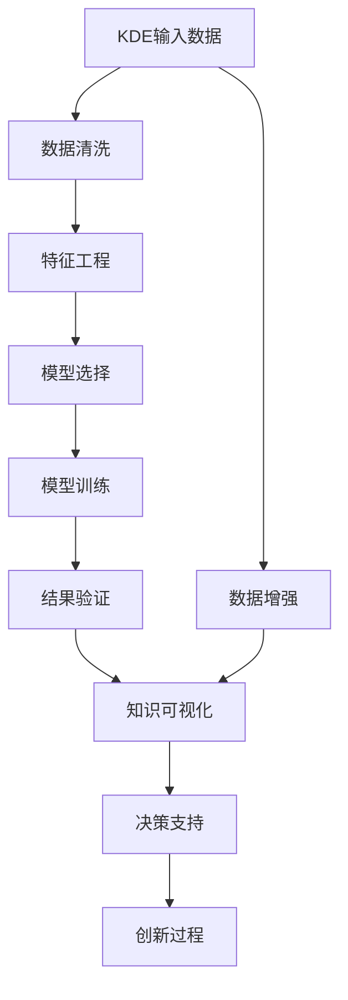

                 

## 1. 背景介绍

### 1.1 问题由来
在信息爆炸的21世纪，人类面临着一个前所未有的数据时代。海量数据正成为企业、政府、科研机构的宝贵资产，同时也带来了前所未有的知识发现和创新思维的机遇与挑战。传统的分析方法和思维模式已无法满足新的需求。知识发现引擎（Knowledge Discovery Engine, KDE）作为一种新兴的智能技术，正逐步成为创新思维和知识发掘的新引擎。

知识发现引擎通过处理、分析和挖掘大规模数据集，从中提取出具有价值的模式、关系和知识，从而支持决策、优化和创新。然而，如何利用KDE技术支持创新思维，实现从数据到知识的有效转化，是一个颇具挑战性的问题。本文将深入探讨这一问题，并提出一系列的解决方案。

### 1.2 问题核心关键点
KDE的核心目标是挖掘数据中隐藏的有用知识，这与创新思维的核心理念——发现新奇、创新和独特的解决方案——有着紧密的联系。然而，知识发现是一个复杂的过程，涉及到数据清洗、特征工程、模型选择、结果解释等多个环节，且易受到人类主观偏见的影响。如何将KDE技术与创新思维相结合，引导和支持创新过程，是本文探讨的重点。

## 2. 核心概念与联系

### 2.1 核心概念概述

为更好地理解知识发现引擎与创新思维的关系，本节将介绍几个密切相关的核心概念：

- **知识发现引擎(KDE)**：利用人工智能、数据挖掘、统计学等技术，从大规模数据集中自动发现有用知识的过程。常见的KDE方法包括聚类、分类、关联规则挖掘、异常检测等。

- **创新思维**：一种主动探索未知领域，发现新奇、新颖解决方案的思维方式。涉及创意思维、逆向思维、系统思维等多样化的方法。

- **数据驱动决策**：基于数据分析和KDE技术，辅助决策制定和创新过程。

- **数据增强**：通过引入更多样化和高质量的数据，提升KDE的准确性和创新潜力。

- **知识可视化**：将KDE发现的知识以图形、表格等方式展示，便于理解和创新思维的灵感启发。

这些概念之间存在紧密的联系，共同构成了从数据到知识再到创新的整个流程。

### 2.2 核心概念原理和架构的 Mermaid 流程图



这个流程图展示了KDE从数据输入到知识可视化的全过程，以及如何通过决策支持驱动创新思维。

## 3. 核心算法原理 & 具体操作步骤

### 3.1 算法原理概述

知识发现引擎的核心算法包括数据预处理、特征提取、模型训练、结果验证等多个步骤。其基本原理是利用机器学习、数据挖掘等算法，从原始数据中发现模式、关系和知识。以下详细介绍算法原理及具体操作步骤。

### 3.2 算法步骤详解

**Step 1: 数据预处理**
- 数据清洗：剔除噪声数据、缺失值、异常值等。
- 数据整合：将不同来源、不同格式的数据整合为统一的格式。
- 数据增强：通过回译、数据生成等技术扩充数据集，增加数据多样性。

**Step 2: 特征工程**
- 特征选择：根据问题需求，选择最相关的特征。
- 特征提取：通过PCA、LDA等降维技术简化数据。
- 特征转换：将数值特征转换为文本、图像等形式，便于模型处理。

**Step 3: 模型选择**
- 选择适合的算法，如决策树、神经网络、聚类等。
- 模型参数设定：根据问题特点设定模型参数。

**Step 4: 模型训练**
- 将处理好的数据输入模型，进行训练。
- 调参优化：通过网格搜索、贝叶斯优化等方法寻找最优参数。

**Step 5: 结果验证**
- 在验证集上评估模型性能。
- 迭代调整模型，直至达到满意结果。

**Step 6: 知识可视化**
- 将模型发现的知识以图形、表格等形式展示。
- 使用交互式工具，便于用户理解和分析。

**Step 7: 决策支持**
- 将模型结果应用于实际决策过程。
- 实时监控模型效果，根据新数据迭代优化。

### 3.3 算法优缺点

KDE的优点包括：
- 自动化程度高：自动化处理数据、选择特征、训练模型，减少人为干预。
- 准确性高：通过算法优化和参数调优，可以挖掘出高质量的有用知识。
- 适用范围广：可以应用于不同类型的数据和问题。

其缺点包括：
- 对数据质量敏感：数据质量差、噪声多时，KDE效果不佳。
- 易受人类偏见影响：人类在数据清洗、特征选择等环节中可能引入主观偏见。
- 解释性差：KDE模型往往是"黑盒"，难以解释其内部逻辑。

### 3.4 算法应用领域

知识发现引擎的应用领域非常广泛，包括但不限于：

- **医疗健康**：从患者病历中挖掘疾病关联、治疗方案等知识。
- **金融风险管理**：分析交易数据，预测市场趋势、检测风险。
- **市场营销**：从用户行为数据中发现市场细分、客户偏好等。
- **智能制造**：从设备运行数据中提取操作流程、维护策略等。
- **环境保护**：从环境监测数据中发现污染源、治理方案等。

KDE在各个领域中的应用，不仅能够提升效率、降低成本，更能在创新过程中提供强有力的支撑。

## 4. 数学模型和公式 & 详细讲解

### 4.1 数学模型构建

KDE的数学模型包括数据预处理模型、特征提取模型、模型训练模型和结果验证模型。以下详细介绍每个模型的数学构建。

**数据预处理模型**：
- 数据清洗模型：通过均值中位数、离群点检测等技术，去除噪声数据。
- 数据增强模型：引入数据生成算法，如SMOTE、GAN等，生成新的样本数据。

**特征提取模型**：
- 特征选择模型：通过方差分析、信息增益等方法选择最相关特征。
- 特征转换模型：通过PCA、LDA等降维技术简化数据。

**模型训练模型**：
- 分类模型：如逻辑回归、决策树等，用于分类问题。
- 聚类模型：如K-means、DBSCAN等，用于无监督学习。
- 关联规则模型：如Apriori、FP-growth等，用于发现数据项之间的关联关系。

**结果验证模型**：
- 验证集模型：通过交叉验证、留出验证等方法评估模型性能。
- 预测模型：通过测试集验证模型准确性。

### 4.2 公式推导过程

以K-means聚类算法为例，介绍聚类模型的数学公式推导。

设 $X$ 为 $n \times m$ 的样本矩阵，$k$ 为聚类簇数，则K-means算法步骤如下：

1. 初始化聚类中心 $C_0^{(1)}$，$C_0^{(2)}$，...，$C_0^{(k)}$。

2. 对于每个样本 $x_i$，计算其到各聚类中心的距离 $d_i^{(j)}$：

   $$
   d_i^{(j)} = \| x_i - C_0^{(j)} \|
   $$

3. 将每个样本 $x_i$ 分配到距离最近的聚类中心 $C_0^{(j)}$ 对应的簇 $j$。

4. 更新聚类中心 $C_0^{(j)}$，使得簇内样本的均值最小：

   $$
   C_0^{(j)} = \frac{1}{|N_j|} \sum_{x_i \in N_j} x_i
   $$
   
   其中 $N_j$ 为簇 $j$ 中的样本集合。

5. 重复步骤2-4，直到聚类中心不再变化或达到最大迭代次数。

### 4.3 案例分析与讲解

**案例1: 医疗健康领域的KDE应用**
假设我们有一份包含1000个患者病历的数据集，目标是从中发现疾病的关联关系，指导个性化治疗方案。

1. **数据预处理**：对病历数据进行清洗，去除异常值和缺失值。

2. **特征提取**：选择病历中与疾病相关的数值特征，如年龄、性别、血压等。

3. **模型训练**：使用Apriori算法挖掘数据项之间的关联规则。

4. **结果验证**：在验证集上评估模型性能，使用交叉验证方法。

5. **知识可视化**：将挖掘出的关联规则以图形形式展示，帮助医生理解。

**案例2: 市场营销领域的KDE应用**
假设我们有一份包含1万条用户行为数据的数据集，目标是发现用户分群、推荐商品。

1. **数据预处理**：对用户行为数据进行清洗，去除无效数据。

2. **特征提取**：提取用户的基本信息、购买记录、浏览历史等特征。

3. **模型训练**：使用K-means算法对用户进行聚类，发现用户分群。

4. **结果验证**：在测试集上评估模型性能，使用精确率、召回率等指标。

5. **知识可视化**：将聚类结果以图形形式展示，帮助市场营销团队制定策略。

## 5. 项目实践：代码实例和详细解释说明

### 5.1 开发环境搭建

在进行KDE实践前，我们需要准备好开发环境。以下是使用Python进行Scikit-learn开发的环境配置流程：

1. 安装Anaconda：从官网下载并安装Anaconda，用于创建独立的Python环境。

2. 创建并激活虚拟环境：
```bash
conda create -n kde-env python=3.8 
conda activate kde-env
```

3. 安装Scikit-learn：
```bash
conda install scikit-learn
```

4. 安装各类工具包：
```bash
pip install numpy pandas matplotlib seaborn scikit-learn jupyter notebook ipython
```

完成上述步骤后，即可在`kde-env`环境中开始KDE实践。

### 5.2 源代码详细实现

下面我们以K-means聚类算法为例，给出使用Scikit-learn库进行聚类的PyTorch代码实现。

首先，定义聚类函数：

```python
from sklearn.cluster import KMeans
from sklearn.preprocessing import StandardScaler

def kmeans_clustering(X, n_clusters=3, max_iter=300, n_init=10):
    scaler = StandardScaler()
    X_scaled = scaler.fit_transform(X)
    
    kmeans = KMeans(n_clusters=n_clusters, max_iter=max_iter, n_init=n_init)
    kmeans.fit(X_scaled)
    
    return kmeans.labels_, kmeans.cluster_centers_
```

然后，定义数据处理函数：

```python
from sklearn.datasets import load_iris
from sklearn.decomposition import PCA
import pandas as pd
import numpy as np

def load_and_process_data():
    iris_data = load_iris()
    X = iris_data.data
    y = iris_data.target
    
    # 数据标准化
    scaler = StandardScaler()
    X_scaled = scaler.fit_transform(X)
    
    # PCA降维
    pca = PCA(n_components=2)
    X_pca = pca.fit_transform(X_scaled)
    
    return X_pca, y
```

接着，定义可视化函数：

```python
import matplotlib.pyplot as plt
import seaborn as sns

def plot_clusters(X_pca, labels, centroids):
    sns.scatterplot(x=X_pca[:, 0], y=X_pca[:, 1], hue=labels, s=100, alpha=0.7)
    for c, centroid in zip(set(labels), centroids):
        plt.scatter(centroid[0], centroid[1], marker='o', s=200, c='r', zorder=10)
    
    plt.xlabel('Principal Component 1')
    plt.ylabel('Principal Component 2')
    plt.title('K-means Clustering')
    plt.show()
```

最后，启动KDE流程：

```python
X_pca, y = load_and_process_data()
labels, centroids = kmeans_clustering(X_pca)

plot_clusters(X_pca, labels, centroids)
```

以上就是使用Scikit-learn库进行K-means聚类的完整代码实现。可以看到，Scikit-learn库提供了丰富的机器学习算法和数据处理工具，使得KDE开发变得简洁高效。

### 5.3 代码解读与分析

让我们再详细解读一下关键代码的实现细节：

**load_and_process_data函数**：
- `load_iris`函数：从sklearn.datasets库中加载鸢尾花数据集，包含4个特征和3个类别。
- `StandardScaler`类：对特征进行标准化，使得各特征均值为0，方差为1。
- `PCA`类：使用PCA降维技术，将4维数据降到2维。

**kmeans_clustering函数**：
- `KMeans`类：使用K-means算法进行聚类，指定簇数、最大迭代次数、随机初始化次数等参数。
- `fit_transform`方法：将标准化后的数据作为输入，训练模型并进行聚类。

**plot_clusters函数**：
- `sns.scatterplot`：使用seaborn库绘制散点图，根据聚类结果为每个样本着色。
- `plt.scatter`：绘制聚类中心，用红色圆点表示。

**启动KDE流程**：
- 加载并处理数据，使用PCA降维。
- 运行K-means聚类算法，获取聚类结果。
- 可视化聚类结果，显示簇内样本和聚类中心。

通过上述代码实现，可以看出Scikit-learn库的便捷性和易用性。开发者可以根据具体问题，快速迭代和优化算法，提升KDE的效果。

## 6. 实际应用场景

### 6.1 医疗健康

在医疗健康领域，KDE可以用于疾病诊断、治疗方案优化、药物研发等。例如，通过分析大量患者病历数据，挖掘出疾病的关联关系和治疗方案的有效性，为医生提供决策支持。

**应用场景**：
- **疾病关联关系挖掘**：从患者病历数据中发现疾病之间的关联关系，指导个性化治疗。
- **治疗方案优化**：评估不同治疗方案的效果，选择最佳方案。
- **药物研发**：预测新药物的疗效和副作用，指导药物开发。

### 6.2 金融风险管理

在金融领域，KDE可以用于风险预测、异常检测、信用评估等。例如，通过分析交易数据，挖掘出市场趋势、预测违约风险，为金融机构提供决策支持。

**应用场景**：
- **市场趋势预测**：分析历史交易数据，发现市场变化趋势，指导投资策略。
- **违约风险预测**：预测企业、个人违约的可能性，提前采取防范措施。
- **信用评估**：评估贷款申请人的信用风险，降低坏账率。

### 6.3 市场营销

在市场营销领域，KDE可以用于用户分群、市场细分、产品推荐等。例如，通过分析用户行为数据，挖掘出用户分群和兴趣偏好，为市场营销团队提供决策支持。

**应用场景**：
- **用户分群**：将用户按照兴趣、行为等特征分成不同的群体，进行个性化营销。
- **市场细分**：根据不同用户群体的特征，进行市场细分，制定不同的市场策略。
- **产品推荐**：根据用户行为数据，推荐用户可能感兴趣的产品。

### 6.4 智能制造

在智能制造领域，KDE可以用于设备维护、生产优化、质量控制等。例如，通过分析设备运行数据，挖掘出操作流程和维护策略，为生产流程优化提供支持。

**应用场景**：
- **设备维护**：预测设备故障，提前进行维护，减少停机时间。
- **生产优化**：优化生产流程，提高生产效率。
- **质量控制**：检测产品质量问题，提高产品合格率。

### 6.5 环境保护

在环境保护领域，KDE可以用于污染源监测、环境治理、资源管理等。例如，通过分析环境监测数据，发现污染源、评估环境治理效果，为环保部门提供决策支持。

**应用场景**：
- **污染源监测**：通过分析环境监测数据，发现污染源和污染程度。
- **环境治理效果评估**：评估不同治理措施的效果，优化治理方案。
- **资源管理**：分析资源使用数据，优化资源配置。

## 7. 工具和资源推荐

### 7.1 学习资源推荐

为了帮助开发者系统掌握KDE的理论基础和实践技巧，这里推荐一些优质的学习资源：

1. 《Python数据科学手册》系列博文：由大数据专家撰写，涵盖数据清洗、特征工程、模型训练等KDE必备技能。

2. 《机器学习实战》课程：由知名机器学习专家开设的线上课程，涵盖KDE、聚类、分类等经典算法。

3. 《数据科学导论》书籍：全面介绍了数据科学的基础理论和经典算法，包括KDE、PCA、SVM等。

4. Coursera K-means聚类课程：斯坦福大学开设的K-means聚类专题课程，深入浅出地介绍了K-means算法的原理和实现。

5. Kaggle机器学习竞赛：通过参加Kaggle的机器学习竞赛，实践KDE算法，提升技能。

通过对这些资源的学习实践，相信你一定能够快速掌握KDE的精髓，并用于解决实际的创新问题。

### 7.2 开发工具推荐

高效的开发离不开优秀的工具支持。以下是几款用于KDE开发的常用工具：

1. Jupyter Notebook：交互式编程环境，便于迭代开发和数据可视化。

2. Scikit-learn：Python开源机器学习库，提供了丰富的机器学习算法和工具。

3. Pandas：Python数据处理库，便于数据清洗和特征提取。

4. Matplotlib：Python绘图库，便于数据可视化。

5. TensorBoard：TensorFlow配套的可视化工具，便于模型训练和调试。

6. PyTorch：开源深度学习框架，便于模型实现和优化。

合理利用这些工具，可以显著提升KDE任务的开发效率，加快创新迭代的步伐。

### 7.3 相关论文推荐

KDE技术的发展源于学界的持续研究。以下是几篇奠基性的相关论文，推荐阅读：

1. An Introduction to Statistical Learning（《统计学习方法》）：统计学大师李航的入门书籍，介绍了KDE的基本原理和应用。

2. K-Means Clustering（《K-均值聚类算法》）：统计学大师R. Joy Bhattacharyya的经典论文，介绍了K-means算法的原理和实现。

3. Clustering by Passing Messages Between Data Points（《通过数据点间传递信息进行聚类》）：UC Berkeley教授Michael Jordan的论文，介绍了基于消息传递的聚类算法。

4. Density-Based Clustering（《基于密度的聚类》）：UC Berkeley教授Anirban Dasgupta的论文，介绍了基于密度的聚类算法，如DBSCAN。

5. Association Rules in Databases（《数据库中的关联规则》）：UC Berkeley教授Rajeev Motwani的论文，介绍了Apriori等关联规则算法。

这些论文代表了大数据聚类和关联规则挖掘技术的发展脉络。通过学习这些前沿成果，可以帮助研究者把握学科前进方向，激发更多的创新灵感。

## 8. 总结：未来发展趋势与挑战

### 8.1 总结

本文对知识发现引擎（KDE）在创新思维中的应用进行了全面系统的介绍。首先阐述了KDE的基本原理和操作步骤，详细讲解了KDE从数据预处理、特征工程、模型训练到结果可视化的全过程，并给出了实际应用场景和开发资源推荐。通过本文的系统梳理，可以看到KDE技术在各个领域的应用价值和创新潜力。

通过深入分析KDE与创新思维的关系，本文探讨了如何利用KDE技术支持创新思维，实现从数据到知识的有效转化。具体而言，本文提出了数据驱动决策、数据增强、知识可视化等策略，帮助KDE在创新过程中发挥更大作用。

### 8.2 未来发展趋势

展望未来，KDE技术将呈现以下几个发展趋势：

1. **数据质量提升**：随着数据采集技术的进步，数据质量将得到显著提升，有助于KDE挖掘出更多有价值的知识。

2. **算法多样性增加**：未来将涌现更多高效、鲁棒的KDE算法，如基于深度学习的聚类算法、基于图结构的聚类算法等。

3. **跨领域应用扩展**：KDE将从传统的商业、医疗、金融等领域向更多领域扩展，如城市管理、农业、能源等。

4. **实时化、自动化**：KDE将进一步实现实时化、自动化，通过在线分析和机器学习，支持实时决策和智能推荐。

5. **知识融合与创新**：KDE将与更多领域知识融合，如知识图谱、领域本体、专家知识等，形成更加全面、准确的创新知识。

6. **伦理与安全**：随着KDE在更多领域的广泛应用，伦理与安全问题将受到更多关注，需要在算法和应用层面进行更深入的探讨。

这些趋势展示了KDE技术的广阔前景，相信KDE将在推动创新思维和知识发现方面发挥更大的作用。

### 8.3 面临的挑战

尽管KDE技术已经取得了瞩目成就，但在迈向更加智能化、普适化应用的过程中，它仍面临着诸多挑战：

1. **数据隐私保护**：KDE依赖于大量数据，如何在保护数据隐私的前提下进行数据处理和知识挖掘，是一个重要问题。

2. **模型复杂度**：随着数据量和维度增加，KDE模型复杂度将大幅提升，如何在高效计算和模型精度之间取得平衡，是一个挑战。

3. **多模态数据融合**：KDE通常处理单一数据类型，如何融合不同模态的数据（如文本、图像、声音），是一个重要研究方向。

4. **算法解释性**：KDE模型往往被视为"黑盒"，难以解释其内部工作机制和决策逻辑，如何增强模型解释性，将是一个重要的研究课题。

5. **伦理与安全**：KDE模型在应用过程中可能引入偏见、歧视等伦理问题，如何在模型设计和应用层面确保公平、安全，是一个重要问题。

这些挑战需要KDE研究者不断创新和优化，才能使KDE技术真正在各个领域落地应用，为创新思维提供强有力的支持。

### 8.4 研究展望

面对KDE面临的这些挑战，未来的研究需要在以下几个方面寻求新的突破：

1. **多模态数据融合**：开发更多融合不同模态数据的KDE算法，如跨模态聚类、跨模态关联规则挖掘等。

2. **模型解释性**：引入可解释性技术，如特征重要性分析、模型可视化等，增强KDE模型的解释性。

3. **公平性与伦理**：在KDE算法设计和应用过程中，引入公平性、透明性、可解释性等伦理导向，减少偏见和歧视。

4. **实时化、自动化**：研究在线学习和在线优化技术，实现KDE模型的实时化、自动化，提高模型应用效率。

5. **跨领域应用**：探索KDE在更多领域的创新应用，如智能制造、智慧城市、环境保护等，推动KDE技术在更多领域落地。

6. **伦理与安全**：在KDE应用过程中，构建伦理框架和安全机制，确保KDE系统的公平性、透明性和安全性。

这些研究方向将进一步推动KDE技术的发展，使其在创新思维和知识发现中发挥更大的作用，为人类认知智能的进化带来深远影响。

## 9. 附录：常见问题与解答

**Q1：什么是知识发现引擎？**

A: 知识发现引擎（KDE）是一种利用人工智能、数据挖掘、统计学等技术，从大规模数据集中自动发现有用知识的过程。

**Q2：知识发现引擎在创新思维中如何发挥作用？**

A: KDE可以提供数据驱动的决策支持，通过数据分析和知识挖掘，发现新奇、新颖的解决方案，支持创新思维的过程。

**Q3：知识发现引擎有哪些核心算法？**

A: 知识发现引擎的核心算法包括数据预处理算法、特征提取算法、模型训练算法、结果验证算法等。如K-means聚类、PCA降维、关联规则挖掘等。

**Q4：知识发现引擎的应用领域有哪些？**

A: 知识发现引擎的应用领域非常广泛，包括医疗健康、金融风险管理、市场营销、智能制造、环境保护等。

**Q5：知识发现引擎在应用过程中需要考虑哪些问题？**

A: 知识发现引擎在应用过程中需要考虑数据质量、数据隐私、模型复杂度、算法解释性、伦理与安全等问题。

通过上述常见问题的解答，相信你对KDE技术有了更全面、深入的理解。

