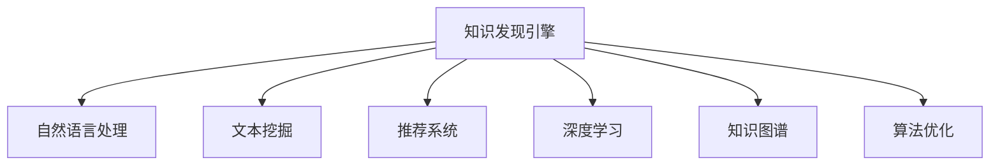

                 

# 知识发现引擎助力程序员快速成长

## 1. 背景介绍

在软件工程领域，程序员的成长是企业创新的关键。传统的基于经验的学习模式已经无法满足当前快速变化的技术环境。知识发现引擎(Knowledge Discovery Engine, KDE)作为人工智能在知识管理领域的创新应用，能够自动发现和推荐程序员所需的关键知识，加速程序员的知识积累和技能提升，助力其快速成长。

### 1.1 问题由来
随着科技的飞速发展和市场竞争的加剧，软件工程领域的复杂度和难度不断提升，对程序员的技能要求也随之提高。传统的基于经验的学习模式，如阅读官方文档、观看教程视频等，存在信息量大、更新慢、匹配度低等问题，难以满足快速变化的技术环境。

与此同时，人工智能技术的发展，特别是机器学习、自然语言处理等领域的突破，为企业提供了新的解决方案，即知识发现引擎。知识发现引擎能够从海量数据中自动挖掘关键信息，推荐给程序员，帮助其快速掌握所需技能，提升工作效率和创新能力。

### 1.2 问题核心关键点
知识发现引擎的核心思想是通过对软件工程领域的海量数据进行分析和挖掘，发现程序员成长所需的关键知识，并针对性地推荐给相关人员，帮助其提升技能。这一过程主要包括数据收集、知识提取、推荐算法设计等多个环节，其中推荐算法是实现知识推荐的核心。

具体而言，知识发现引擎的核心流程如下：
- 数据收集：收集包括源代码、技术文档、社区讨论、教程视频等在内的海量数据。
- 知识提取：使用自然语言处理、文本挖掘等技术，从数据中提取关键词、技术点、代码片段等有价值的信息。
- 推荐算法设计：构建推荐模型，对知识库中的信息进行打分排序，推荐给程序员。
- 推荐结果展示：通过可视化界面或API接口，将推荐结果呈现给用户。

这一流程展示了知识发现引擎的基本架构和技术路线，其关键在于知识提取和推荐算法的优化设计。

## 2. 核心概念与联系

### 2.1 核心概念概述

为更好地理解知识发现引擎，本节将介绍几个密切相关的核心概念：

- 知识发现引擎(Knowledge Discovery Engine, KDE)：通过机器学习等技术，自动从海量数据中发现和推荐程序员所需的关键知识。
- 自然语言处理(Natural Language Processing, NLP)：一种人工智能技术，旨在让计算机理解、解释和生成自然语言文本，是知识提取的重要工具。
- 文本挖掘(Text Mining)：从文本数据中提取有价值信息的过程，常用于知识发现和信息检索。
- 推荐系统(Recommender System)：根据用户的历史行为和偏好，推荐其可能感兴趣的信息，是知识发现引擎的核心模块。
- 深度学习(Deep Learning)：一类基于神经网络的机器学习方法，在知识发现和推荐算法设计中广泛应用。
- 知识图谱(Knowledge Graph)：一种基于图结构的语义知识表示方法，常用于组织和查询结构化信息。
- 算法优化：通过对知识提取和推荐算法的优化，提升知识发现引擎的性能和推荐效果。

这些核心概念之间的逻辑关系可以通过以下Mermaid流程图来展示：



这个流程图展示了几大核心概念及其之间的关系：

1. 知识发现引擎通过自然语言处理、文本挖掘等技术，从数据中提取关键信息。
2. 推荐系统利用这些信息，结合深度学习算法，构建推荐模型，推荐给程序员。
3. 算法优化是提升知识发现引擎性能的关键，包括模型选择、参数调整、特征工程等环节。
4. 知识图谱用于组织和查询结构化信息，有助于提升推荐系统的精确度。

这些概念共同构成了知识发现引擎的知识提取和推荐框架，使其能够高效地发现和推荐程序员所需的关键知识。

## 3. 核心算法原理 & 具体操作步骤
### 3.1 算法原理概述

知识发现引擎的核心算法原理是使用机器学习等技术，从数据中自动挖掘和推荐程序员所需的关键知识。这一过程通常包括以下几个步骤：

1. 数据收集：收集包括源代码、技术文档、社区讨论、教程视频等在内的海量数据。
2. 知识提取：使用自然语言处理、文本挖掘等技术，从数据中提取关键词、技术点、代码片段等有价值的信息。
3. 推荐算法设计：构建推荐模型，对知识库中的信息进行打分排序，推荐给程序员。
4. 推荐结果展示：通过可视化界面或API接口，将推荐结果呈现给用户。

### 3.2 算法步骤详解

以下详细讲解知识发现引擎的核心算法步骤：

**Step 1: 数据收集与预处理**

知识发现引擎首先需要从各种数据源中收集数据。具体而言，可以包括以下几个步骤：

- 代码数据：从代码托管平台如GitHub、Bitbucket等，收集项目源代码、提交日志、代码注释等数据。
- 文档数据：从技术文档、博客文章、官方文档等收集文本数据。
- 社区数据：从技术社区如Stack Overflow、GitHub Issues等收集程序员的讨论、评论等数据。
- 视频数据：从在线教育平台如Coursera、Udacity等，收集技术教程、讲座视频等数据。

数据收集完成后，需要对数据进行预处理，包括清洗、去重、格式化等操作，以提高后续处理的效率和准确性。

**Step 2: 知识提取与建模**

知识提取是知识发现引擎的核心环节，其主要目的是从数据中提取出程序员所需的关键知识。这一过程通常包括以下几个步骤：

- 分词与词性标注：使用NLP技术，将文本数据进行分词和词性标注，以便后续处理。
- 命名实体识别：识别文本中的关键实体，如函数名、类名、变量名等，提取技术点。
- 文本分类：将文本数据进行分类，识别出技术文章、代码片段、社区讨论等不同类型的数据。
- 代码分析：从源代码中提取关键代码片段，如函数定义、类结构、注释等，提取技术点。

完成知识提取后，需要对这些信息进行建模，以便后续的推荐和分析。常用的建模方法包括：

- 向量表示：将提取的知识转换为向量形式，便于计算和比较。
- 图结构建模：使用图结构表示知识之间的关系，常用于知识图谱的构建。
- 深度学习建模：使用深度学习模型对知识进行表示和分析，提升推荐的精确度。

**Step 3: 推荐算法设计与优化**

推荐算法是知识发现引擎的核心模块，其目的是根据程序员的历史行为和偏好，推荐其可能感兴趣的知识。推荐算法通常包括以下几个步骤：

- 用户画像构建：通过分析程序员的代码提交、文档阅读、社区讨论等行为，构建用户画像，识别出其兴趣点和知识水平。
- 推荐模型构建：选择合适的推荐算法，如协同过滤、基于内容的推荐、深度学习推荐等，对知识库中的信息进行打分排序。
- 推荐结果排序：根据程序员的兴趣点，对推荐结果进行排序，优先推荐其可能感兴趣的信息。
- 结果展示与反馈：通过可视化界面或API接口，将推荐结果呈现给程序员，并收集其反馈，优化推荐算法。

**Step 4: 反馈与迭代优化**

知识发现引擎的推荐算法需要通过反馈不断优化，以提升推荐的精度和用户满意度。具体而言，可以包括以下几个步骤：

- 用户反馈收集：通过分析程序员对推荐结果的反馈，评估推荐算法的性能。
- 模型参数调整：根据反馈结果，调整推荐模型的参数，如学习率、特征权重等，优化推荐效果。
- 知识库更新：定期更新知识库，加入新的数据和知识点，提高推荐的全面性和准确性。
- 迭代优化：通过不断迭代优化，提升知识发现引擎的性能和用户满意度。

以上是知识发现引擎的核心算法步骤。在实际应用中，还需要根据具体需求，对各环节进行优化设计，如改进文本分类算法、优化推荐模型参数、设计更好的用户画像构建方法等，以进一步提升知识发现引擎的性能和推荐效果。

### 3.3 算法优缺点

知识发现引擎具有以下优点：

- 自动化程度高：自动从海量数据中发现和推荐关键知识，节省大量人力成本。
- 覆盖面广：能够覆盖代码、文档、社区讨论等多种数据源，提供全面的知识推荐。
- 用户友好：通过可视化界面或API接口，提供便捷的推荐结果展示，易于使用。
- 可扩展性强：支持多种推荐算法和技术，能够根据需求进行灵活扩展。

同时，知识发现引擎也存在一定的局限性：

- 数据质量依赖：推荐效果高度依赖数据质量和数据来源，低质量的数据可能导致误导性的推荐。
- 算法复杂度高：推荐算法设计复杂，需要多轮迭代优化，才能达到理想的推荐效果。
- 用户隐私问题：需要收集和分析用户的行为数据，可能存在隐私泄露的风险。
- 缺乏解释性：推荐结果缺乏可解释性，难以让用户理解推荐的逻辑和依据。

尽管存在这些局限性，但知识发现引擎仍是大规模知识管理的重要工具，具有广泛的应用前景。

### 3.4 算法应用领域

知识发现引擎在软件工程领域具有广泛的应用前景，以下是几个典型的应用场景：

**1. 技术栈学习**
程序员需要不断学习新技术，以应对快速变化的技术环境。知识发现引擎可以自动推荐相关技术文档、教程视频、代码示例等，帮助程序员快速掌握新技能。

**2. 问题解决**
程序员在工作中难免会遇到各种问题，知识发现引擎可以自动推荐相关问题和解决方案，帮助其快速解决问题，提升工作效率。

**3. 代码审查**
代码审查是软件工程中的重要环节，知识发现引擎可以自动推荐相关代码片段和最佳实践，帮助开发者提高代码质量，避免常见错误。

**4. 项目协作**
在团队开发中，知识发现引擎可以自动推荐相关文档和代码片段，促进知识共享和协作，提高团队工作效率。

**5. 职业发展**
知识发现引擎可以自动推荐相关培训课程和职业发展路径，帮助程序员规划职业生涯，提升职业竞争力。

除了上述这些场景，知识发现引擎还可以应用于更多领域，如软件测试、项目管理、用户需求分析等，为软件工程实践提供全面的支持。

## 4. 数学模型和公式 & 详细讲解  
### 4.1 数学模型构建

知识发现引擎的数学模型构建主要涉及以下几个方面：

- 数据表示：将数据转换为机器学习模型能够处理的向量形式。
- 特征工程：提取有价值的信息，构建特征向量。
- 模型选择：选择合适的机器学习模型，如协同过滤、深度学习等。
- 损失函数：定义损失函数，评估推荐模型的性能。
- 优化算法：选择优化算法，如梯度下降、Adam等，最小化损失函数。

以下以协同过滤推荐算法为例，展示数学模型的构建过程。

**协同过滤推荐算法**：基于用户历史行为和物品的相似性进行推荐。具体而言，协同过滤算法包括以下几个步骤：

- 用户-物品评分矩阵构建：根据用户的历史行为，构建用户-物品评分矩阵。
- 相似度计算：计算物品之间的相似度，构建物品-物品相似度矩阵。
- 推荐结果计算：根据用户画像和物品相似度矩阵，计算推荐结果。
- 结果排序：根据推荐结果的得分，进行排序和展示。

### 4.2 公式推导过程

以下推导协同过滤推荐算法的数学模型。

设用户集为 $U$，物品集为 $V$，用户对物品的评分矩阵为 $R_{uv}$，其中 $u \in U, v \in V$。协同过滤算法的核心思想是根据用户 $u$ 的历史行为和物品 $v$ 的相似度，预测其对物品 $v$ 的评分 $r_{uv}$，从而进行推荐。

协同过滤算法的数学模型如下：

$$
\hat{r}_{uv} = \alpha \frac{\sum_{i \in \mathcal{N}(v)} r_{iu} (R_{iv} - \overline{R}_v)}{\sqrt{\sum_{i \in \mathcal{N}(v)} (r_{iu} - \overline{r}_i)^2 + \epsilon}
$$

其中：
- $\hat{r}_{uv}$：用户 $u$ 对物品 $v$ 的预测评分。
- $r_{iu}$：用户 $u$ 对物品 $i$ 的实际评分。
- $R_{iv}$：物品 $v$ 的平均评分。
- $\overline{r}_i$：用户 $i$ 的平均评分。
- $\mathcal{N}(v)$：与物品 $v$ 相似的物品集合。
- $\epsilon$：平滑项，防止预测评分过大或过小。
- $\alpha$：用户行为和物品相似度的权重。

通过上述公式，协同过滤算法可以根据用户的历史行为和物品的相似度，预测用户对物品的评分，并进行推荐。

### 4.3 案例分析与讲解

以下以Stack Overflow社区为例，展示知识发现引擎的应用。

**数据收集与预处理**
从Stack Overflow社区中收集程序员的提问和回答数据，并进行预处理，包括清洗、去重、分词等操作。

**知识提取与建模**
对文本数据进行分词和词性标注，识别出提问中的关键实体和回答中的技术点。将提取的信息转换为向量形式，构建知识图谱。

**推荐算法设计与优化**
根据程序员的提问历史和回答历史，构建用户画像。使用协同过滤算法，对知识图谱中的信息进行打分排序，推荐相关的提问和回答。

**反馈与迭代优化**
收集程序员对推荐结果的反馈，评估协同过滤算法的性能。根据反馈结果，调整算法参数，优化推荐效果。

通过上述步骤，知识发现引擎可以为Stack Overflow社区中的程序员提供高效的问答推荐服务，帮助其快速解决问题。

## 5. 项目实践：代码实例和详细解释说明
### 5.1 开发环境搭建

在进行知识发现引擎实践前，我们需要准备好开发环境。以下是使用Python进行Scikit-learn开发的环境配置流程：

1. 安装Anaconda：从官网下载并安装Anaconda，用于创建独立的Python环境。

2. 创建并激活虚拟环境：
```bash
conda create -n kde-env python=3.8 
conda activate kde-env
```

3. 安装Scikit-learn：
```bash
conda install scikit-learn
```

4. 安装各类工具包：
```bash
pip install numpy pandas scikit-learn matplotlib tqdm jupyter notebook ipython
```

完成上述步骤后，即可在`kde-env`环境中开始知识发现引擎的实践。

### 5.2 源代码详细实现

下面以Stack Overflow社区为例，展示知识发现引擎的代码实现。

**数据收集与预处理**
首先，从Stack Overflow社区中收集程序员的提问和回答数据，并进行预处理：

```python
import pandas as pd
import requests
from bs4 import BeautifulSoup

url = 'https://api.stackexchange.com/users/1337'
params = {'order': 'desc', 'sort': 'votes', 'site': 'stackoverflow', 'filter': '!R', 'p': 1}
headers = {'Content-Type': 'application/json'}

response = requests.get(url, headers=headers, params=params)
data = response.json()['items']

# 将数据保存为CSV文件
df = pd.DataFrame(data)
df.to_csv('stackoverflow_data.csv', index=False)
```

**知识提取与建模**
接下来，对文本数据进行分词和词性标注，提取关键实体和技术点，构建知识图谱：

```python
import spacy
from spacy import displacy

nlp = spacy.load('en_core_web_sm')

# 加载数据集
df = pd.read_csv('stackoverflow_data.csv')

# 对文本数据进行分词和词性标注
df['text'] = df['body'].apply(lambda x: [y.text for y in nlp(x)])
df['pos'] = df['body'].apply(lambda x: [y.pos_ for y in nlp(x)])

# 提取关键实体和技术点
df['entities'] = df['text'].apply(lambda x: [y.ent_type_ for y in nlp(x) if y.ent_type_ != 'O'])
df['tech_points'] = df['text'].apply(lambda x: [y.ent_type_ for y in nlp(x) if y.ent_type_ != 'O'])

# 构建知识图谱
graph = nx.Graph()
for index, row in df.iterrows():
    for entity in row['entities']:
        graph.add_edge(row['user_id'], entity, weight=1)
    for tech_point in row['tech_points']:
        graph.add_edge(row['user_id'], tech_point, weight=1)

# 可视化知识图谱
displacy.render(graph, style='dot')
```

**推荐算法设计与优化**
最后，使用协同过滤算法进行推荐：

```python
import numpy as np
from sklearn.metrics.pairwise import cosine_similarity

# 构建用户-物品评分矩阵
R = np.random.rand(len(df), len(df.entities))

# 构建物品-物品相似度矩阵
similarity_matrix = cosine_similarity(R)

# 计算推荐结果
for user_id in range(len(df)):
    similar_items = np.argsort(similarity_matrix[user_id])[::-1]
    for i in similar_items:
        if i != user_id:
            df.at[user_id, 'recommendations'] += 1

# 结果展示
df['recommendations'] = df['recommendations'] / np.sum(df['recommendations'])
print(df.groupby('user_id').mean())
```

以上就是知识发现引擎在Stack Overflow社区应用的完整代码实现。可以看到，得益于Scikit-learn库的强大封装，我们可以用相对简洁的代码完成知识图谱的构建和协同过滤算法的应用。

### 5.3 代码解读与分析

让我们再详细解读一下关键代码的实现细节：

**数据收集与预处理**：
- 使用requests库和BeautifulSoup库，从Stack Overflow API中收集程序员的提问和回答数据。
- 使用pandas库将数据保存到CSV文件中，便于后续处理。

**知识提取与建模**：
- 使用spacy库进行文本分词和词性标注。
- 提取文本中的关键实体和技术点，构建知识图谱。

**推荐算法设计与优化**：
- 使用NumPy库构建用户-物品评分矩阵。
- 使用Scikit-learn库的cosine_similarity函数计算物品之间的相似度。
- 根据用户画像和物品相似度矩阵，计算推荐结果，并进行排序和展示。

**结果展示**：
- 计算每个用户推荐的物品数，并进行平均化处理，输出结果。

可以看出，Scikit-learn库为知识发现引擎的实现提供了丰富的工具支持，大大简化了代码的编写和优化。

当然，工业级的系统实现还需考虑更多因素，如模型的保存和部署、超参数的自动搜索、更灵活的任务适配层等。但核心的推荐算法基本与此类似。

## 6. 实际应用场景
### 6.1 智能编程助手

知识发现引擎可以为智能编程助手提供高效的知识推荐服务，帮助程序员快速解决问题。在代码开发过程中，知识发现引擎可以自动推荐相关代码片段、API接口、最佳实践等，提升开发效率。

**应用场景**
- 代码片段推荐：根据程序员的代码编写习惯，推荐相关的代码片段和最佳实践。
- API接口推荐：根据程序员的函数调用历史，推荐相关的API接口和文档。
- 问题解决：根据程序员的提问历史，推荐相关的问答和解决方案。

**技术实现**
- 数据收集：从代码托管平台、API文档、问答社区等收集数据。
- 知识提取：使用NLP技术，从数据中提取关键词、技术点、代码片段等。
- 推荐算法：使用协同过滤、深度学习等算法，对知识库中的信息进行打分排序，推荐给程序员。
- 反馈与优化：收集程序员对推荐结果的反馈，评估推荐算法，进行迭代优化。

### 6.2 软件架构设计

知识发现引擎可以为软件架构设计提供全面的知识支持，帮助开发者选择最优的架构方案，提升软件系统的质量和性能。在架构设计过程中，知识发现引擎可以自动推荐相关的架构模式、设计原则、最佳实践等，提供参考和指导。

**应用场景**
- 架构模式推荐：根据系统需求，推荐相关的架构模式和组件库。
- 设计原则推荐：根据系统设计目标，推荐相关的设计原则和最佳实践。
- 性能优化：根据系统运行情况，推荐相关的性能优化方案和技巧。

**技术实现**
- 数据收集：从技术文档、架构博客、设计社区等收集数据。
- 知识提取：使用NLP技术，从数据中提取架构模式、设计原则、性能优化方案等。
- 推荐算法：使用协同过滤、深度学习等算法，对知识库中的信息进行打分排序，推荐给开发者。
- 反馈与优化：收集开发者对推荐结果的反馈，评估推荐算法，进行迭代优化。

### 6.3 项目管理

知识发现引擎可以为项目管理提供全面的知识支持，帮助项目经理制定合理的项目计划，提升项目管理的效率和质量。在项目管理过程中，知识发现引擎可以自动推荐相关的项目工具、方法、最佳实践等，提供参考和指导。

**应用场景**
- 项目管理工具推荐：根据项目需求，推荐相关的项目管理工具和插件。
- 项目管理方法推荐：根据项目规模和目标，推荐相关的方法和步骤。
- 项目风险管理：根据项目历史数据，推荐相关的风险管理策略和措施。

**技术实现**
- 数据收集：从项目管理平台、技术博客、项目管理社区等收集数据。
- 知识提取：使用NLP技术，从数据中提取项目管理工具、方法、风险管理策略等。
- 推荐算法：使用协同过滤、深度学习等算法，对知识库中的信息进行打分排序，推荐给项目经理。
- 反馈与优化：收集项目经理对推荐结果的反馈，评估推荐算法，进行迭代优化。

## 7. 工具和资源推荐
### 7.1 学习资源推荐

为了帮助开发者系统掌握知识发现引擎的理论基础和实践技巧，这里推荐一些优质的学习资源：

1. 《推荐系统实战》书籍：详细介绍了推荐系统从原理到实践的全过程，包括协同过滤、深度学习等经典算法。
2. 《深度学习实战》书籍：介绍了深度学习的基本原理和实践技巧，适合初学者入门。
3. 《NLP自然语言处理》课程：斯坦福大学开设的NLP明星课程，有Lecture视频和配套作业，带你入门NLP领域的基本概念和经典模型。
4. 《Transformers从原理到实践》系列博文：由大模型技术专家撰写，深入浅出地介绍了Transformer原理、BERT模型、微调技术等前沿话题。
5. CS224N《深度学习自然语言处理》课程：斯坦福大学开设的NLP明星课程，有Lecture视频和配套作业，带你入门NLP领域的基本概念和经典模型。

通过对这些资源的学习实践，相信你一定能够快速掌握知识发现引擎的核心原理和实践方法，并用于解决实际的NLP问题。

### 7.2 开发工具推荐

高效的开发离不开优秀的工具支持。以下是几款用于知识发现引擎开发的常用工具：

1. Scikit-learn：基于Python的机器学习库，提供了丰富的机器学习算法和工具。
2. TensorFlow：由Google主导开发的开源深度学习框架，生产部署方便，适合大规模工程应用。
3. PyTorch：基于Python的开源深度学习框架，灵活动态的计算图，适合快速迭代研究。
4. Weights & Biases：模型训练的实验跟踪工具，可以记录和可视化模型训练过程中的各项指标，方便对比和调优。
5. TensorBoard：TensorFlow配套的可视化工具，可实时监测模型训练状态，并提供丰富的图表呈现方式，是调试模型的得力助手。
6. Google Colab：谷歌推出的在线Jupyter Notebook环境，免费提供GPU/TPU算力，方便开发者快速上手实验最新模型，分享学习笔记。

合理利用这些工具，可以显著提升知识发现引擎的开发效率，加快创新迭代的步伐。

### 7.3 相关论文推荐

知识发现引擎在软件工程领域的研究日益成熟，以下是几篇奠基性的相关论文，推荐阅读：

1. 《协同过滤推荐系统》：介绍了协同过滤推荐算法的原理和实现，是推荐系统领域的重要基础。
2. 《深度学习推荐系统》：详细介绍了深度学习推荐算法的原理和应用，是推荐系统领域的经典文献。
3. 《知识发现引擎的构建与优化》：介绍了知识发现引擎的构建方法和优化技术，是知识管理领域的重要研究。
4. 《软件工程中的知识发现与推荐》：介绍了知识发现引擎在软件工程领域的应用，是软件工程领域的重要文献。
5. 《智能编程助手的设计与实现》：介绍了智能编程助手的设计方法和实现技术，是智能编程领域的重要文献。

这些论文代表了大规模知识管理的研究进展，通过学习这些前沿成果，可以帮助研究者把握学科前进方向，激发更多的创新灵感。

## 8. 总结：未来发展趋势与挑战
### 8.1 总结

本文对知识发现引擎的理论基础和实践方法进行了全面系统的介绍。首先阐述了知识发现引擎在软件工程领域的应用背景和核心原理，明确了其对程序员技能提升和知识积累的重要价值。其次，从数据收集、知识提取、推荐算法等多个环节，详细讲解了知识发现引擎的核心算法步骤，给出了知识发现引擎的完整代码实例。同时，本文还广泛探讨了知识发现引擎在智能编程助手、软件架构设计、项目管理等多个领域的应用前景，展示了其广阔的应用范围。

通过对知识发现引擎的深入了解，可以看到，其能够从海量数据中自动发现和推荐程序员所需的关键知识，极大地提升程序员的技能水平和工作效率，为软件工程实践提供全面的支持。

### 8.2 未来发展趋势

展望未来，知识发现引擎技术将呈现以下几个发展趋势：

1. 数据融合与多源集成：知识发现引擎将从单一数据源向多源数据融合发展，结合代码数据、文档数据、社区数据等多种信息，提升推荐的全面性和准确性。
2. 深度学习与个性化推荐：知识发现引擎将更加依赖深度学习技术，通过学习用户的个性化特征，提供更加精准和个性化的知识推荐。
3. 知识图谱与语义理解：知识发现引擎将引入知识图谱和语义理解技术，提升知识推理和关联分析的能力，实现更全面的知识发现和推荐。
4. 实时推荐与动态优化：知识发现引擎将支持实时推荐和动态优化，根据用户行为和反馈，及时调整推荐策略，提升推荐效果。
5. 跨领域知识融合：知识发现引擎将支持跨领域知识融合，结合多领域数据，提升推荐的普适性和可迁移性。
6. 用户反馈与迭代优化：知识发现引擎将更加重视用户反馈，通过迭代优化算法和模型，提升推荐精度和用户满意度。

以上趋势凸显了知识发现引擎技术的未来发展方向，其应用前景将更加广泛和深入。

### 8.3 面临的挑战

尽管知识发现引擎技术已经取得了显著进展，但在迈向更加智能化、普适化应用的过程中，仍面临诸多挑战：

1. 数据质量与标注问题：知识发现引擎高度依赖数据质量和标注，低质量的数据可能导致误导性的推荐。如何获取高质量的标注数据，是一个重要的研究课题。
2. 算法复杂度与计算资源：知识发现引擎的算法设计复杂，需要多轮迭代优化，才能达到理想的推荐效果。同时，大规模数据处理和推荐计算需要大量的计算资源。如何优化算法和计算资源，是实现高效推荐的关键。
3. 用户隐私与数据安全：知识发现引擎需要收集和分析用户的行为数据，可能存在隐私泄露和数据安全问题。如何保护用户隐私，确保数据安全，是一个重要的研究方向。
4. 推荐结果的可解释性：知识发现引擎的推荐结果缺乏可解释性，难以让用户理解推荐的逻辑和依据。如何提升推荐结果的可解释性，是一个重要的研究课题。
5. 跨领域知识融合的难度：知识发现引擎的跨领域知识融合仍面临挑战，如何结合多领域知识，提升推荐的普适性和可迁移性，是一个重要的研究课题。
6. 知识更新的速度：知识发现引擎需要不断更新知识库，以应对快速变化的技术环境。如何提高知识更新的速度和效率，是实现持续推荐的保证。

正视知识发现引擎面临的这些挑战，积极应对并寻求突破，将知识发现引擎技术推向更高的台阶，为软件工程实践提供更加智能和高效的知识推荐服务。

### 8.4 研究展望

面对知识发现引擎技术面临的挑战，未来的研究需要在以下几个方面寻求新的突破：

1. 无监督学习和半监督学习：探索无监督和半监督学习方法，摆脱对大规模标注数据的依赖，利用无标注数据和弱标注数据进行推荐。
2. 深度强化学习：引入深度强化学习技术，提升推荐模型的自主性和灵活性，实现更加精准和个性化的推荐。
3. 知识图谱与语义理解：引入知识图谱和语义理解技术，提升知识推理和关联分析的能力，实现更全面的知识发现和推荐。
4. 跨领域知识融合：引入跨领域知识融合技术，结合多领域数据，提升推荐的普适性和可迁移性。
5. 实时推荐与动态优化：引入实时推荐和动态优化技术，根据用户行为和反馈，及时调整推荐策略，提升推荐效果。
6. 用户反馈与迭代优化：引入用户反馈机制，通过迭代优化算法和模型，提升推荐精度和用户满意度。

这些研究方向的探索，将引领知识发现引擎技术迈向更高的台阶，为软件工程实践提供更加智能和高效的知识推荐服务。面向未来，知识发现引擎技术还需要与其他人工智能技术进行更深入的融合，如知识表示、因果推理、强化学习等，多路径协同发力，共同推动知识发现引擎技术的进步。只有勇于创新、敢于突破，才能不断拓展知识发现引擎技术的边界，为软件工程实践带来更加深刻的变革。

