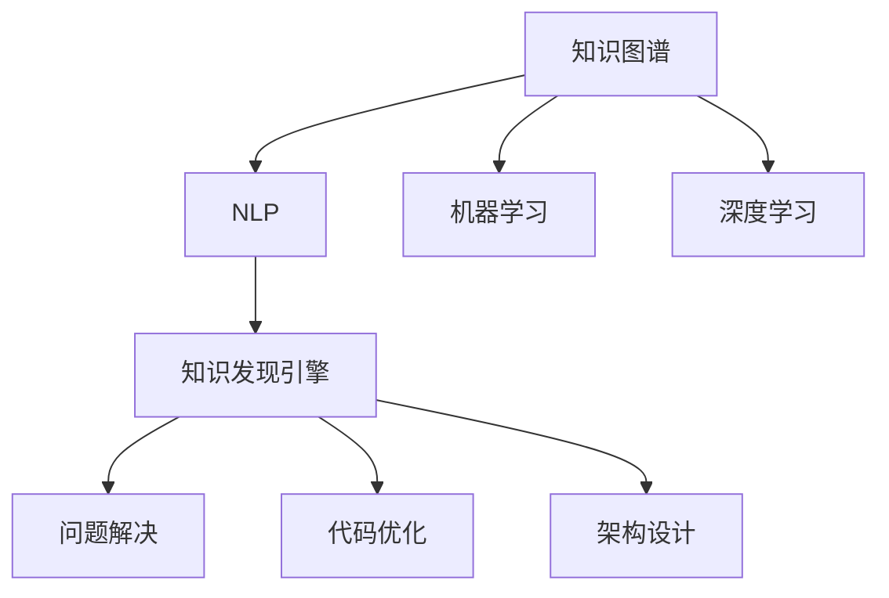

                 

# 知识发现引擎助力程序员技能迭代升级

## 1. 背景介绍

### 1.1 问题由来

在现代软件开发中，技术的快速发展对程序员的专业技能提出了更高的要求。程序员不仅需要掌握主流编程语言和框架，还需要了解新兴技术，如人工智能、区块链、云计算等。同时，随着软件规模的扩大，系统设计和架构设计的复杂性也在增加，这要求程序员具备更强的分析和设计能力。然而，当前技术教育和培训的方式往往滞后于技术进步，难以跟上快速变化的市场需求。

### 1.2 问题核心关键点

为了提升程序员技能，需要构建一种能够快速发现知识、传授知识和应用知识的系统。这种系统应具备以下特点：

- **知识发现能力**：能够从海量技术文献、教程、开源项目中自动抽取有价值的信息。
- **知识呈现能力**：将复杂技术知识简化为易于理解和掌握的形式，如博客、文档、视频等。
- **知识应用能力**：通过知识图谱等工具，帮助程序员快速解决问题、优化代码、设计架构。
- **自适应能力**：能够根据程序员的学习进度和掌握情况，动态调整学习计划和内容。

### 1.3 问题研究意义

构建知识发现引擎，将显著提升程序员的学习效率和技能水平，加速其职业发展。具体来说：

1. **加速学习曲线**：通过自动化的知识发现和呈现，程序员可以快速掌握新技术和新工具，缩短学习时间。
2. **提升问题解决能力**：知识发现引擎能够快速定位问题，提供解决方案和代码示例，减少调试时间。
3. **促进知识共享**：构建知识共享平台，加速技术知识的传播和应用，推动技术社区的繁荣。
4. **推动技术创新**：通过知识图谱等工具，帮助程序员进行知识整合和创新，加速技术应用落地。

## 2. 核心概念与联系

### 2.1 核心概念概述

为更好地理解知识发现引擎，本节将介绍几个密切相关的核心概念：

- **知识图谱(Knowledge Graph)**：一种结构化的知识表示方法，将实体、属性、关系等知识元素组织成图结构，便于理解和应用。
- **自然语言处理(Natural Language Processing, NLP)**：使用计算机技术处理和分析人类语言，包括文本挖掘、情感分析、实体识别等。
- **机器学习(Machine Learning)**：一种通过数据和算法自动学习和提升的计算方法，包括监督学习、无监督学习、强化学习等。
- **深度学习(Deep Learning)**：一种基于神经网络的机器学习方法，能够自动提取数据中的高层次特征。
- **知识发现引擎(Knowledge Discovery Engine)**：一种自动化的知识抽取、表示、呈现和应用系统，帮助用户快速获取知识、解决问题。

这些核心概念之间的逻辑关系可以通过以下Mermaid流程图来展示：



这个流程图展示了一些核心概念之间的联系：

1. 知识图谱由NLP技术从海量文本中提取，再通过机器学习和深度学习技术进行结构化表示。
2. 知识发现引擎整合了知识图谱，利用NLP和机器学习技术，发现和呈现知识。
3. 知识发现引擎通过知识图谱帮助程序员解决实际问题、优化代码、设计架构。

## 3. 核心算法原理 & 具体操作步骤

### 3.1 算法原理概述

知识发现引擎的核心算法原理主要涉及以下几个方面：

- **知识抽取**：从大量文本数据中自动抽取实体、关系、属性等知识元素。
- **知识表示**：使用知识图谱等结构化方法，将抽取的知识元素组织成图结构，便于存储和应用。
- **知识呈现**：将复杂的技术知识简化为易于理解和掌握的形式，如博客、文档、视频等。
- **知识应用**：通过知识图谱等工具，帮助程序员快速解决问题、优化代码、设计架构。

这些算法通常结合了NLP、机器学习和深度学习的技术，以实现自动化的知识发现和应用。

### 3.2 算法步骤详解

构建知识发现引擎的一般步骤如下：

**Step 1: 数据收集与预处理**
- 收集各种技术文献、教程、开源项目、技术博客等数据。
- 对数据进行清洗和预处理，去除噪声和无关信息。

**Step 2: 知识抽取**
- 使用NLP技术从文本中抽取实体、关系、属性等知识元素。
- 通过命名实体识别、关系抽取、属性抽取等技术，生成知识图谱的实体节点和关系边。

**Step 3: 知识表示**
- 使用知识图谱等结构化方法，将抽取的知识元素组织成图结构。
- 确定节点类型、属性和关系类型，建立实体之间的关系。

**Step 4: 知识呈现**
- 将知识图谱转换为易于理解和应用的形式，如博客、文档、视频等。
- 设计友好的用户界面，提供搜索、浏览、推荐等功能。

**Step 5: 知识应用**
- 将知识图谱与编程环境、问题解决工具等集成。
- 通过自动化的代码搜索、问题定位、解决方案推荐等，辅助程序员进行问题解决和代码优化。

### 3.3 算法优缺点

知识发现引擎具有以下优点：

- **自动化的知识发现和呈现**：能够快速获取大量技术知识，并简化呈现，提升学习效率。
- **集成化应用**：通过与编程环境、问题解决工具等集成，提供一站式的知识应用解决方案。
- **自适应能力**：能够根据用户的学习进度和掌握情况，动态调整学习计划和内容。

同时，该方法也存在一些局限性：

- **数据质量依赖**：知识抽取和表示的质量依赖于数据的质量和预处理效果。
- **知识图谱构建复杂**：知识图谱的构建需要大量的领域知识，可能需要人工参与。
- **系统集成难度高**：知识发现引擎需要与多种工具和平台进行集成，可能面临较高的系统集成难度。
- **应用场景局限**：适用于特定领域的知识发现，可能不适用于所有技术领域。

尽管存在这些局限性，但知识发现引擎作为一种自动化的知识发现和应用系统，为程序员提供了高效的学习和解决问题手段，具备广阔的应用前景。

### 3.4 算法应用领域

知识发现引擎在软件开发和计算机科学教育领域有着广泛的应用，具体包括：

- **软件开发辅助**：提供代码搜索、问题定位、解决方案推荐等功能，提升开发效率和质量。
- **教育培训**：通过自动化的知识发现和呈现，帮助学生快速掌握技术知识，加速学习进程。
- **技术文档管理**：构建技术文档库，提供搜索、浏览、推荐等功能，方便开发者查阅和使用。
- **技术社区构建**：通过知识图谱等工具，构建技术社区，促进技术交流和知识传播。
- **技术创新加速**：通过知识整合和图谱分析，帮助研究人员和开发者进行技术创新和应用落地。

## 4. 数学模型和公式 & 详细讲解 & 举例说明

### 4.1 数学模型构建

知识发现引擎的核心模型主要涉及以下数学模型：

- **知识抽取模型**：使用命名实体识别、关系抽取等NLP技术，从文本中抽取知识元素。
- **知识表示模型**：使用知识图谱等方法，将知识元素组织成图结构。
- **知识呈现模型**：使用文本生成、视频生成等技术，将复杂知识简化为易于理解的形式。
- **知识应用模型**：使用推荐系统、代码搜索等技术，辅助程序员解决问题和优化代码。

这些模型通常基于深度学习框架进行实现，如TensorFlow、PyTorch等。

### 4.2 公式推导过程

以知识抽取模型为例，推导命名实体识别的公式。

设文本为 $S$，命名实体识别模型为 $M$，其参数为 $\theta$。则模型的输出为 $M(S;\theta)$，表示文本中所有可能的实体节点。假设实体节点的类型为 $T$，实体的属性为 $A$。则实体节点的表示为 $M(S;\theta) = (N_1, N_2, ..., N_k)$，其中 $N_i = (n_i, a_i)$，$n_i$ 表示实体的类型，$a_i$ 表示实体的属性。

推导过程如下：

1. 文本 $S$ 通过预处理后，得到特征向量 $F$。
2. 特征向量 $F$ 输入到命名实体识别模型 $M$，输出模型参数为 $\theta$ 的表示 $H$。
3. 对 $H$ 进行分类，确定每个实体的类型和属性。

具体公式如下：

$$
H = M(F;\theta) \\
(n_i, a_i) = classify(H_i) \\
M(S;\theta) = (N_1, N_2, ..., N_k) \\
N_i = (n_i, a_i)
$$

### 4.3 案例分析与讲解

以Google Colab为例，展示知识发现引擎的实际应用。

**案例背景**：

某开源项目维护人员希望快速定位和修复代码中的bug，提升项目维护效率。

**解决方案**：

构建一个基于知识图谱的知识发现引擎，集成到Google Colab中。具体步骤如下：

1. 收集项目代码、文档、问题报告等数据。
2. 对数据进行清洗和预处理，去除噪声和无关信息。
3. 使用命名实体识别、关系抽取等技术，从代码和文档中抽取实体和关系。
4. 构建知识图谱，表示代码、问题和解决方案之间的关系。
5. 集成知识图谱到Google Colab，提供代码搜索、问题定位、解决方案推荐等功能。

**效果评估**：

- 代码搜索：通过知识图谱，可以在代码中快速定位相关问题和解决方案，减少调试时间。
- 问题定位：通过实体和关系抽取，能够快速定位问题所在的代码段和模块，提升问题解决速度。
- 解决方案推荐：根据问题和代码的特征，推荐最合适的解决方案和代码示例，提升代码优化效果。

通过知识发现引擎，该项目维护人员显著提升了代码维护效率，降低了问题解决时间。

## 5. 项目实践：代码实例和详细解释说明

### 5.1 开发环境搭建

在进行知识发现引擎实践前，我们需要准备好开发环境。以下是使用Python进行知识图谱构建的环境配置流程：

1. 安装Anaconda：从官网下载并安装Anaconda，用于创建独立的Python环境。

2. 创建并激活虚拟环境：
```bash
conda create -n knowledge-graph-env python=3.8 
conda activate knowledge-graph-env
```

3. 安装相关依赖：
```bash
pip install tensorflow tensorflow_hub transformers pytorch-timm
```

4. 安装知识图谱构建工具：
```bash
pip install gnnpy
```

完成上述步骤后，即可在`knowledge-graph-env`环境中开始知识图谱构建实践。

### 5.2 源代码详细实现

这里我们以知识抽取和表示为例，给出使用TensorFlow构建知识图谱的PyTorch代码实现。

首先，定义知识图谱的节点和关系：

```python
from gnnpy import GraphNetwork

# 定义节点和关系
node_type = "Person"
relation_type = "knows"

# 创建图网络
graph_network = GraphNetwork(node_type=node_type, relation_type=relation_type)
```

接着，构建知识图谱的表示：

```python
from transformers import BertTokenizer, BertForTokenClassification
import tensorflow as tf
import tensorflow_hub as hub

# 加载预训练模型
tokenizer = BertTokenizer.from_pretrained('bert-base-cased')
model = BertForTokenClassification.from_pretrained('bert-base-cased', num_labels=len(tag2id))

# 构建知识抽取模型
class KnowledgeExtractor(tf.keras.Model):
    def __init__(self, graph_network):
        super(KnowledgeExtractor, self).__init__()
        self.graph_network = graph_network

    def call(self, input_ids, attention_mask, labels=None):
        with tf.graph.control_dependencies(None):
            features = model(input_ids, attention_mask=attention_mask, labels=labels)
            features = features['pooler_output']
        return features

# 定义知识抽取函数
def extract_knowledge(input_text):
    text_features = extractor(input_text)
    knowledge = graph_network.predict(text_features)
    return knowledge
```

最后，测试知识抽取函数：

```python
# 构建知识抽取器
extractor = KnowledgeExtractor(graph_network)

# 测试知识抽取
text = "Bert is developed by Google and published in 2018."
knowledge = extract_knowledge(text)
print(knowledge)
```

### 5.3 代码解读与分析

让我们再详细解读一下关键代码的实现细节：

**GraphNetwork类**：
- 定义了知识图谱的节点类型和关系类型。
- 提供了构建知识图谱的方法。

**KnowledgeExtractor类**：
- 继承自tf.keras.Model，用于构建知识抽取模型。
- 在`call`方法中，使用Bert模型提取文本特征，并将其输入知识图谱进行预测。

**extract_knowledge函数**：
- 将输入文本转换为Bert模型所需的格式，输入模型进行特征提取。
- 使用知识图谱对特征进行预测，返回知识图谱的表示。

**测试代码**：
- 构建知识抽取器，将文本输入知识抽取器进行特征提取。
- 将提取的特征输入知识图谱进行预测，返回知识图谱的表示。

通过上述代码，可以看出知识抽取和表示的实现过程。在实际应用中，可以根据具体需求设计更复杂、更灵活的知识抽取模型。

## 6. 实际应用场景

### 6.1 软件公司技术支持

技术支持团队面临大量的技术问题和用户咨询，如何快速定位问题和提供解决方案是关键。通过知识发现引擎，可以将公司的技术文档、代码库、历史问题等数据进行知识抽取和表示，构建知识图谱。技术支持人员可以使用知识图谱进行代码搜索、问题定位和解决方案推荐，显著提升支持效率和用户满意度。

### 6.2 高校计算机科学教育

高校计算机科学教育需要构建丰富的课程资源和实验室环境。通过知识发现引擎，可以从海量技术文献、教程、开源项目中抽取知识，构建知识图谱和课程资源库。学生可以使用知识图谱进行问题解答、代码调试和项目开发，提升学习效果和实践能力。

### 6.3 开源项目开发

开源项目通常具有大规模的代码库和文档库，需要高效的知识管理和代码搜索工具。通过知识发现引擎，可以对项目文档和代码进行知识抽取和表示，构建知识图谱和代码搜索系统。开发人员可以使用知识图谱进行代码搜索、问题定位和解决方案推荐，加速项目开发和维护。

### 6.4 未来应用展望

随着知识图谱技术和自然语言处理技术的不断进步，知识发现引擎将在更多领域得到应用，为技术创新和知识传播提供新的工具。

在智慧城市治理中，知识发现引擎可以用于智能交通、智慧环保、公共安全等领域，提供城市事件监测、舆情分析、应急指挥等功能。在医疗健康领域，知识发现引擎可以用于医学知识库构建、病历分析、药物研发等，提升医疗服务的智能化水平。

## 7. 工具和资源推荐

### 7.1 学习资源推荐

为了帮助开发者系统掌握知识发现引擎的理论基础和实践技巧，这里推荐一些优质的学习资源：

1. 《深度学习与自然语言处理》系列课程：斯坦福大学和密歇根大学开设的深度学习和自然语言处理课程，涵盖深度学习、自然语言处理、知识图谱等多个主题。

2. 《知识图谱与推荐系统》书籍：系统介绍知识图谱和推荐系统的构建方法和应用场景，提供丰富的案例和实验代码。

3. TensorFlow官方文档：TensorFlow的官方文档，提供了详细的API接口和示例代码，是深度学习应用开发的必备资源。

4. PyTorch官方文档：PyTorch的官方文档，提供了丰富的深度学习模型和工具，适用于自然语言处理等任务。

5. Arxiv和Google Scholar：深度学习领域的顶级会议和期刊，涵盖最新的研究成果和技术进展。

通过对这些资源的学习实践，相信你一定能够快速掌握知识发现引擎的精髓，并用于解决实际的NLP问题。

### 7.2 开发工具推荐

高效的开发离不开优秀的工具支持。以下是几款用于知识图谱构建和应用开发的常用工具：

1. TensorFlow：基于Python的开源深度学习框架，支持分布式计算和自动微分，适用于大规模知识图谱的构建和应用。

2. PyTorch：基于Python的开源深度学习框架，灵活的计算图设计，适用于复杂知识图谱的构建和应用。

3. Graph Neural Network (GNN)：一种用于图数据处理的深度学习模型，适用于构建复杂知识图谱和图神经网络模型。

4. Jupyter Notebook：交互式编程环境，支持Python、R等语言，提供丰富的数据可视化和代码执行功能。

5. Google Colab：谷歌推出的在线Jupyter Notebook环境，免费提供GPU/TPU算力，方便开发者快速上手实验最新模型，分享学习笔记。

合理利用这些工具，可以显著提升知识图谱构建和应用开发的效率，加快创新迭代的步伐。

### 7.3 相关论文推荐

知识图谱和知识发现引擎的发展源于学界的持续研究。以下是几篇奠基性的相关论文，推荐阅读：

1. Knowledge Graphs: What, Why and How（Ian Pottinger等）：定义了知识图谱的概念和应用场景，阐述了知识图谱的构建方法和应用案例。

2. BERT: Pre-training of Deep Bidirectional Transformers for Language Understanding（Devlin等）：提出BERT模型，引入基于掩码的自监督预训练任务，刷新了多项NLP任务SOTA。

3. Attention is All You Need（Vaswani等）：提出Transformer结构，开启了NLP领域的预训练大模型时代。

4. GNN: Graph Neural Networks（Scarselli等）：提出图神经网络，用于处理图数据，适用于构建知识图谱和图神经网络模型。

这些论文代表了大语言模型微调技术的发展脉络。通过学习这些前沿成果，可以帮助研究者把握学科前进方向，激发更多的创新灵感。

## 8. 总结：未来发展趋势与挑战

### 8.1 总结

本文对知识发现引擎进行了全面系统的介绍。首先阐述了知识图谱和知识发现引擎的研究背景和意义，明确了知识发现引擎在加速学习、提升问题解决能力、促进知识共享等方面的独特价值。其次，从原理到实践，详细讲解了知识发现引擎的构建过程，提供了知识抽取、知识表示、知识呈现、知识应用等关键步骤的代码实例。同时，本文还广泛探讨了知识发现引擎在软件开发、教育培训、开源项目开发等多个领域的应用前景，展示了知识发现引擎的广阔应用潜力。最后，本文精选了知识发现引擎的相关学习资源，力求为读者提供全方位的技术指引。

通过本文的系统梳理，可以看到，知识发现引擎正在成为知识获取和应用的重要工具，其自动化的知识抽取、表示和呈现能力，将显著提升程序员的学习效率和问题解决能力，加速技术创新和知识传播。未来，随着知识图谱技术和自然语言处理技术的不断进步，知识发现引擎必将在更多领域得到应用，为技术创新和知识传播提供新的手段。

### 8.2 未来发展趋势

展望未来，知识发现引擎将呈现以下几个发展趋势：

1. **知识图谱规模增大**：随着技术进步和数据量增加，知识图谱的规模将持续扩大，涵盖更多的实体和关系，提供更丰富的知识资源。

2. **深度学习应用深入**：深度学习技术将进一步应用于知识抽取和表示，提升知识图谱的构建质量和应用效果。

3. **跨领域知识融合**：知识图谱将更多地融合跨领域的知识，如视觉、音频、文本等多模态信息，提升知识图谱的全面性和实用价值。

4. **知识图谱动态更新**：知识图谱将具备动态更新能力，能够实时吸收新知识和数据，保持知识的最新性。

5. **知识图谱工具普及**：知识图谱和知识发现引擎将更多地集成到开发环境中，提供一站式的知识获取和应用解决方案。

6. **知识图谱伦理规范**：知识图谱将引入伦理规范，确保知识的正确性和公平性，避免误导性信息和偏见。

以上趋势凸显了知识图谱和知识发现引擎的广阔前景。这些方向的探索发展，必将进一步提升知识图谱和知识发现引擎的应用价值，为知识获取和应用提供更加全面和智能的手段。

### 8.3 面临的挑战

尽管知识发现引擎已经取得了显著进展，但在迈向更加智能化、普适化应用的过程中，仍面临诸多挑战：

1. **数据质量和完整性**：知识抽取和表示的质量依赖于数据的质量和完整性。如何保证数据来源可靠、内容全面，是一个重要挑战。

2. **知识图谱构建复杂**：知识图谱的构建需要大量的领域知识和人工参与，需要付出较大的时间和成本。

3. **系统集成难度高**：知识图谱和知识发现引擎需要与多种工具和平台进行集成，可能面临较高的系统集成难度。

4. **知识图谱更新和维护**：知识图谱需要持续更新和维护，确保知识的时效性和准确性。

5. **知识图谱应用效果**：知识图谱的应用效果依赖于数据质量和模型设计，如何提升知识图谱的实用性和应用效果，是一个重要课题。

6. **知识图谱伦理和安全**：知识图谱的应用需要考虑伦理和安全问题，确保知识的正确性和公平性。

这些挑战需要研究者和开发者共同应对，通过技术创新和优化，推动知识图谱和知识发现引擎的应用普及和价值提升。

### 8.4 研究展望

面对知识图谱和知识发现引擎所面临的挑战，未来的研究需要在以下几个方面寻求新的突破：

1. **知识图谱自动化构建**：开发自动化的知识抽取和表示方法，减少人工干预和提高构建效率。

2. **知识图谱多模态融合**：融合视觉、音频、文本等多模态信息，提升知识图谱的全面性和实用价值。

3. **知识图谱动态更新机制**：开发动态更新机制，确保知识图谱的时效性和准确性。

4. **知识图谱伦理和安全机制**：引入伦理和安全机制，确保知识图谱的正确性和公平性。

5. **知识图谱应用优化**：优化知识图谱的应用效果，提升知识发现和知识应用的能力。

6. **知识图谱智能推理**：引入智能推理技术，提升知识图谱的推理能力和应用效果。

这些研究方向将推动知识图谱和知识发现引擎向更加智能和普适化方向发展，为知识获取和应用提供更加全面和高效的手段。

## 9. 附录：常见问题与解答

**Q1：知识发现引擎是否适用于所有领域？**

A: 知识发现引擎在大多数技术领域都能够应用，特别是对于需要大量技术知识支持的领域。但对于一些非技术领域，如社会科学、艺术等，其应用效果和价值可能有限。

**Q2：知识发现引擎在构建知识图谱时，如何保证数据的准确性和完整性？**

A: 数据准确性和完整性是知识抽取和表示的基础。在数据收集和预处理阶段，需要严格筛选数据源，去除噪声和无关信息。同时，通过多轮迭代和人工审核，提升数据质量和完整性。

**Q3：知识发现引擎在实际应用中，如何优化知识图谱的应用效果？**

A: 知识图谱的应用效果依赖于数据质量和模型设计。可以通过增加训练数据、改进模型结构和算法、优化特征提取等手段，提升知识图谱的应用效果。

**Q4：知识发现引擎在应用中，如何确保知识图谱的正确性和公平性？**

A: 知识图谱的正确性和公平性是应用中的重要问题。可以通过引入伦理规范、建立专家审核机制、动态更新知识图谱等手段，确保知识图谱的正确性和公平性。

**Q5：知识发现引擎在应用中，如何实现知识的动态更新？**

A: 知识图谱的动态更新机制是保证知识时效性的关键。可以通过定期更新数据、引入实时数据流、开发自动更新算法等手段，实现知识图谱的动态更新。

通过以上问题和解答，可以看出知识发现引擎在实际应用中还面临许多挑战，需要研究者和开发者共同应对，通过技术创新和优化，推动知识图谱和知识发现引擎的应用普及和价值提升。总之，知识发现引擎作为知识获取和应用的重要工具，其自动化的知识抽取、表示和呈现能力，将显著提升程序员的学习效率和问题解决能力，加速技术创新和知识传播。面向未来，知识图谱和知识发现引擎将在更多领域得到应用，为技术创新和知识传播提供新的手段。

