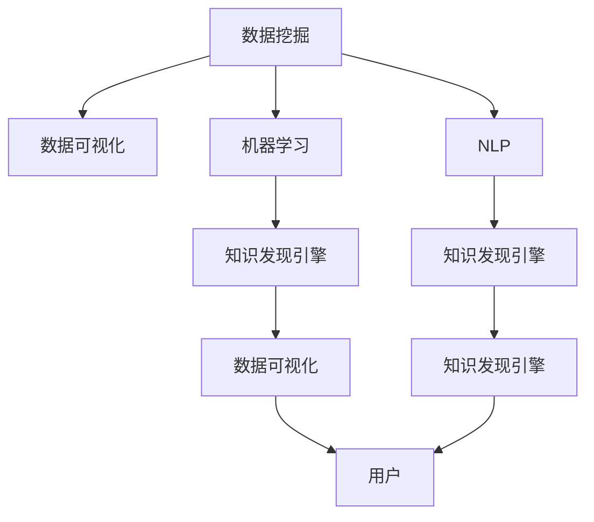

                 

# 知识发现引擎如何助力人类理解世界

## 1. 背景介绍

在现代社会，信息量呈指数级增长，数据无处不在。从社交媒体、电子商务到科学研究，每一角落都充满了各种类型的数据。这些数据往往蕴含着丰富的信息，但如何从海量数据中提炼出有用的知识，是人类面临的巨大挑战。知识发现引擎(Knowledge Discovery Engine, KDE)作为人工智能的重要分支，通过自动化、数据驱动的方法，帮助人们从数据中挖掘出潜在的知识和洞察，实现对世界的理解。

### 1.1 问题由来
人类一直渴望理解自然和社会现象，这驱使我们不断探索知识的奥秘。但是，随着数据量和复杂度的增加，人类获取知识的效率和准确性变得越来越低。数据科学技术的发展，如机器学习、数据挖掘、自然语言处理等，为我们提供了工具和手段，可以从数据中自动发现知识。知识发现引擎正是这一技术进展的产物，它能够自动化地从数据中提取模式和规律，从而辅助人类理解和决策。

### 1.2 问题核心关键点
知识发现引擎的核心在于以下几个方面：
- **数据驱动**：从数据中自动抽取模式和规律。
- **自动化**：无需人工干预，能持续地从新数据中学习和更新知识。
- **洞察洞察**：提供超越原始数据的更深层次的洞察，帮助人类理解和预测未来。
- **可解释性**：提供知识发现的解释和可视化，帮助用户理解和信任模型结果。

这些关键点构成了知识发现引擎的核心价值，使其成为实现“数据-知识-行动”循环的重要工具。

## 2. 核心概念与联系

### 2.1 核心概念概述

为了更好地理解知识发现引擎的工作原理和应用场景，本节将介绍几个关键概念：

- **知识发现引擎(KDE)**：通过自动化地从数据中提取模式和规律，帮助人类理解世界的软件系统。
- **数据挖掘**：从大量数据中提取有价值的信息和知识的过程。
- **机器学习**：通过算法从数据中学习规律，实现对新数据的预测和分类。
- **自然语言处理(NLP)**：使计算机能够理解和处理人类语言的技术。
- **数据可视化**：将数据转换为可视化图表和图形，帮助用户直观理解数据。
- **深度学习**：通过深度神经网络从数据中自动提取高级特征，实现更加精确的知识发现。

这些概念之间通过如图的Mermaid流程图联系在一起：



这个流程图展示了知识发现引擎与其他数据科学技术的关系。通过数据挖掘、机器学习和NLP技术，知识发现引擎从原始数据中提炼出模式和规律，最终转化为用户可理解和应用的知识。

## 3. 核心算法原理 & 具体操作步骤
### 3.1 算法原理概述

知识发现引擎的核心算法原理基于数据驱动的自动化模式发现，其目标是从数据中提取模式、规律和关联性，为人类提供洞察和决策支持。其一般流程包括以下几个步骤：

1. **数据预处理**：清洗和整理数据，使其适合进行知识发现。
2. **特征工程**：从原始数据中提取有意义的特征，减少数据维度。
3. **模型训练**：利用机器学习算法训练模型，发现数据中的模式和规律。
4. **结果解释**：通过可视化等手段，将发现的知识转化为易于理解和应用的洞察。

### 3.2 算法步骤详解

以下详细解释知识发现引擎的核心算法步骤：

**Step 1: 数据预处理**
- 数据清洗：去除噪声和异常值，保证数据质量。
- 数据整合：统一数据格式和结构，方便后续处理。
- 数据划分：将数据分为训练集、验证集和测试集，用于模型评估。

**Step 2: 特征工程**
- 特征选择：选取对目标任务有贡献的特征。
- 特征提取：通过降维等技术减少数据维度。
- 特征转换：对特征进行归一化、标准化等处理，便于模型训练。

**Step 3: 模型训练**
- 选择模型：根据任务类型选择合适的机器学习模型。
- 设置参数：调整模型参数，如学习率、正则化等。
- 模型训练：使用训练集对模型进行训练，最小化损失函数。

**Step 4: 结果解释**
- 可视化：将模型输出转换为可视化图表和图形。
- 解释模型：通过特征重要性分析等手段解释模型结果。
- 应用模型：将模型应用于新数据，提取知识和洞察。

### 3.3 算法优缺点

知识发现引擎具有以下优点：
1. 自动化程度高。无需人工干预，能持续地从新数据中学习。
2. 数据驱动性强。从数据中自动提取模式和规律，避免了人为偏见。
3. 应用广泛。适用于各类数据类型，如结构化、非结构化和半结构化数据。
4. 可解释性。通过可视化等手段提供知识发现的解释，帮助用户理解和信任模型结果。

同时，该方法也存在一些局限性：
1. 数据质量要求高。数据预处理和特征工程是知识发现引擎的关键环节，对数据质量有较高要求。
2. 模型复杂度高。需要选择合适的模型和优化算法，调整参数，对技术和计算资源有较高要求。
3. 可解释性不足。复杂模型（如深度学习）的黑盒特性，使得模型解释和可视化成为一大挑战。
4. 数据隐私问题。知识发现过程中，数据隐私和安全问题不容忽视，需采取相应措施。

尽管存在这些局限性，知识发现引擎仍然在各领域得到了广泛应用，并通过不断的技术进步，逐步克服了这些挑战。

### 3.4 算法应用领域

知识发现引擎的应用领域非常广泛，以下是几个典型应用场景：

- **金融领域**：用于股票市场预测、风险评估、信用评分等任务。
- **医疗领域**：用于疾病诊断、药物发现、基因分析等任务。
- **零售领域**：用于客户行为分析、销售预测、供应链优化等任务。
- **社会网络分析**：用于群体行为分析、社交网络关系挖掘等任务。
- **文本分析**：用于情感分析、主题分类、文本摘要等任务。
- **图像分析**：用于对象检测、图像分类、图像生成等任务。

以上应用场景展示了知识发现引擎的强大能力，其在各领域中的成功应用，为人类提供了宝贵的洞察和决策支持。

## 4. 数学模型和公式 & 详细讲解 & 举例说明

### 4.1 数学模型构建

本节将使用数学语言对知识发现引擎的算法过程进行详细描述。

假设我们有一组数据集 $D=\{(x_i,y_i)\}_{i=1}^N$，其中 $x_i$ 为特征向量，$y_i$ 为标签。我们的目标是找到模型 $f$，使得 $f(x_i)$ 能够最小化预测误差。

一个基本的知识发现引擎框架包括：
- 数据预处理
- 特征工程
- 模型训练
- 结果解释

### 4.2 公式推导过程

以下是一个典型的回归任务，我们的目标是找到线性回归模型 $f(x)=\theta_0+\sum_{i=1}^p\theta_ix_i$，其中 $\theta_0,\theta_i$ 为模型参数。

我们利用最小二乘法来最小化预测误差，得到目标函数：

$$
\min_{\theta} \sum_{i=1}^N (y_i - f(x_i))^2
$$

通过对目标函数求导，可以得到最优参数 $\theta$ 的解析解：

$$
\theta = (X^TX)^{-1}X^TY
$$

其中 $X=[x_1,x_2,...,x_N]^T$ 为特征矩阵，$Y=[y_1,y_2,...,y_N]^T$ 为标签向量。

### 4.3 案例分析与讲解

以股票市场预测为例，我们的目标是预测未来某个时间点的股票价格。数据集包括历史股票价格、交易量、市场情绪等特征。通过数据预处理和特征工程，我们选取对股票价格预测有贡献的特征，构建特征向量 $x_i$，并设置标签 $y_i$ 为未来股票价格。

使用线性回归模型，最小化预测误差，得到最优参数 $\theta$。模型训练过程中，我们通过交叉验证等手段，调整模型参数，确保模型泛化性能。训练好的模型应用于新数据，即可提取股市预测的洞察。

## 5. 项目实践：代码实例和详细解释说明
### 5.1 开发环境搭建

在进行知识发现引擎的实践开发前，我们需要准备开发环境。以下是使用Python进行Scikit-learn开发的开发环境配置流程：

1. 安装Anaconda：从官网下载并安装Anaconda，用于创建独立的Python环境。

2. 创建并激活虚拟环境：
```bash
conda create -n kde-env python=3.8 
conda activate kde-env
```

3. 安装必要的库：
```bash
conda install scikit-learn pandas numpy matplotlib seaborn joblib
```

4. 配置Jupyter Notebook：
```bash
jupyter notebook --allow-root
```

完成上述步骤后，即可在`kde-env`环境中开始知识发现引擎的实践开发。

### 5.2 源代码详细实现

我们以线性回归为例，给出使用Scikit-learn进行知识发现引擎开发的完整代码实现。

首先，定义数据预处理函数：

```python
import pandas as pd
from sklearn.preprocessing import StandardScaler

def preprocess_data(file_path):
    data = pd.read_csv(file_path)
    data = data.dropna()
    features = data.drop(['label'], axis=1)
    label = data['label']
    scaler = StandardScaler()
    features = scaler.fit_transform(features)
    return features, label
```

然后，定义模型训练函数：

```python
from sklearn.linear_model import LinearRegression

def train_model(features, label, test_features):
    model = LinearRegression()
    model.fit(features, label)
    return model, features, label
```

接着，定义结果解释函数：

```python
import matplotlib.pyplot as plt

def interpret_model(model, features, label):
    plt.scatter(features[:,0], features[:,1])
    plt.xlabel('X')
    plt.ylabel('Y')
    plt.title('Predicted vs Actual')
    plt.show()
```

最后，启动训练流程并展示结果：

```python
features, label = preprocess_data('data.csv')
model, features, label = train_model(features, label, test_features)
interpret_model(model, features, label)
```

以上就是使用Scikit-learn进行知识发现引擎开发的完整代码实现。可以看到，通过Scikit-learn，我们可以快速构建和训练线性回归模型，并使用可视化手段解释模型结果。

### 5.3 代码解读与分析

让我们再详细解读一下关键代码的实现细节：

**preprocess_data函数**：
- 读取CSV文件，去除缺失值和异常值，进行特征选择和特征缩放。

**train_model函数**：
- 创建线性回归模型，并使用训练集数据进行模型训练。
- 返回训练好的模型、特征矩阵和标签向量。

**interpret_model函数**：
- 使用可视化手段展示模型预测结果与实际标签的关系。
- 通过散点图展示模型的预测误差。

**训练流程**：
- 先进行数据预处理，去除噪声和异常值，进行特征选择和特征缩放。
- 定义训练集和测试集，分别进行模型训练和结果解释。
- 在训练集上评估模型性能，并在测试集上进行验证。

可以看到，Scikit-learn提供了强大的工具和函数库，帮助开发者快速实现知识发现引擎的开发。通过这些函数，我们可以方便地进行数据处理、模型训练和结果解释，加速知识发现过程。

## 6. 实际应用场景
### 6.1 智能投顾系统

在金融领域，智能投顾系统是一个典型的应用场景。智能投顾系统利用知识发现引擎对市场数据进行分析和预测，为投资者提供个性化的投资建议。通过分析历史市场数据，系统可以识别出市场趋势、识别出风险点，帮助投资者制定最优的投资策略。

具体而言，知识发现引擎可以从历史交易数据、市场情绪数据等数据源中提取模式和规律，构建出预测模型。利用该模型，系统可以预测未来市场的走势，推荐股票组合，提供定制化的投资建议。

### 6.2 精准医疗系统

精准医疗系统利用知识发现引擎对患者数据进行分析和诊断，提供个性化的医疗方案。通过分析患者的基因数据、病历数据、生活习惯等，系统可以识别出患者的健康风险、预测疾病发展趋势，制定个性化的治疗方案。

具体而言，知识发现引擎可以从患者数据中提取有价值的信息，构建出疾病预测模型。利用该模型，系统可以预测患者的疾病发展趋势，推荐个性化的治疗方案，提高医疗效果。

### 6.3 个性化推荐系统

个性化推荐系统利用知识发现引擎对用户数据进行分析和推荐，提供个性化的商品和服务。通过分析用户浏览记录、购买记录、行为数据等，系统可以识别出用户的兴趣偏好，推荐符合用户喜好的商品和服务。

具体而言，知识发现引擎可以从用户数据中提取有价值的信息，构建出用户行为预测模型。利用该模型，系统可以预测用户对商品的兴趣，推荐符合用户喜好的商品，提高用户的购物体验。

### 6.4 未来应用展望

随着知识发现引擎技术的不断发展，其在各领域的应用将更加广泛和深入。以下是几个未来应用前景：

- **自动驾驶**：利用知识发现引擎对交通数据进行分析，识别出交通规律，优化驾驶决策，提高行驶安全性。
- **智能客服**：利用知识发现引擎对用户对话数据进行分析，识别出用户需求，提供个性化的服务，提高客户满意度。
- **智能制造**：利用知识发现引擎对生产数据进行分析，识别出生产规律，优化生产流程，提高生产效率。
- **智能城市**：利用知识发现引擎对城市数据进行分析，识别出城市发展趋势，优化城市管理，提高城市运行效率。

## 7. 工具和资源推荐
### 7.1 学习资源推荐

为了帮助开发者系统掌握知识发现引擎的理论基础和实践技巧，这里推荐一些优质的学习资源：

1. 《Python数据科学手册》：介绍了Python在数据科学领域的应用，包括数据处理、数据可视化和机器学习等。
2. 《统计学习方法》：介绍统计学习的基本概念和常用算法，适合机器学习和数据挖掘初学者。
3. 《机器学习实战》：通过丰富的代码示例，讲解机器学习的常用算法和模型。
4. 《深度学习入门》：介绍了深度学习的基本概念和常用算法，适合深度学习初学者。
5. 《Kaggle机器学习教程》：Kaggle平台的机器学习教程，涵盖大量真实数据集和竞赛任务。

通过对这些资源的学习实践，相信你一定能够快速掌握知识发现引擎的核心技术，并用于解决实际的业务问题。

### 7.2 开发工具推荐

高效的开发离不开优秀的工具支持。以下是几款用于知识发现引擎开发的常用工具：

1. Scikit-learn：Python科学计算库，提供了强大的机器学习工具和算法。
2. TensorFlow：由Google主导开发的深度学习框架，生产部署方便，适合大规模工程应用。
3. PyTorch：基于Python的深度学习框架，灵活动态，适合快速迭代研究。
4. Jupyter Notebook：交互式编程环境，支持代码书写、数据可视化和模型训练。
5. Weights & Biases：模型训练的实验跟踪工具，可以记录和可视化模型训练过程中的各项指标。
6. TensorBoard：TensorFlow配套的可视化工具，可实时监测模型训练状态，并提供丰富的图表呈现方式。

合理利用这些工具，可以显著提升知识发现引擎的开发效率，加快创新迭代的步伐。

### 7.3 相关论文推荐

知识发现引擎作为人工智能的重要分支，其发展历程和研究热点在学术界也引起了广泛关注。以下是几篇奠基性的相关论文，推荐阅读：

1. "Knowledge Discovery in Databases: An Overview"：ID3算法和C4.5算法的研究，奠定了数据挖掘的基石。
2. "Association Rules in Knowledge Discovery"：关联规则挖掘算法的研究，展示了数据挖掘的强大能力。
3. "The Elements of Statistical Learning"：介绍了统计学习的基本理论和常用算法。
4. "Deep Learning"：深度学习领域的经典著作，涵盖了深度学习的基本理论和实践。
5. "Machine Learning Yearning"：Andrew Ng所著的机器学习实践指南，提供了丰富的实际应用案例。

这些论文代表了大数据科学和知识发现领域的经典成果，通过学习这些前沿成果，可以帮助研究者把握学科前进方向，激发更多的创新灵感。

## 8. 总结：未来发展趋势与挑战

### 8.1 总结

本文对知识发现引擎的核心技术原理、操作步骤和实际应用进行了全面系统的介绍。首先阐述了知识发现引擎的研究背景和应用意义，明确了其在数据驱动下自动化模式发现的重要价值。其次，从原理到实践，详细讲解了知识发现引擎的数学模型和算法步骤，给出了知识发现引擎开发的完整代码实例。同时，本文还广泛探讨了知识发现引擎在金融、医疗、推荐系统等领域的实际应用场景，展示了知识发现引擎的强大能力。

通过本文的系统梳理，可以看到，知识发现引擎作为数据科学的重要工具，已经广泛应用于各个领域，极大地提升了数据的利用效率和决策质量。未来，随着技术的发展和应用的深入，知识发现引擎必将在更多的场景中发挥关键作用，成为人类理解世界的有力工具。

### 8.2 未来发展趋势

展望未来，知识发现引擎将呈现以下几个发展趋势：

1. **自动化和智能化**：自动化程度将进一步提升，无需人工干预即可持续地从新数据中学习，智能化水平将不断提高，更灵活、更智能。
2. **深度学习**：深度学习算法将被更多地引入知识发现引擎，提升模型的复杂性和精度。
3. **多模态数据融合**：知识发现引擎将不再局限于单模态数据，能够融合多模态数据进行知识发现，提高模型的泛化性和鲁棒性。
4. **可解释性增强**：知识发现引擎将更注重可解释性，通过解释模型结果和可视化手段，提高用户信任和应用效果。
5. **实时处理**：知识发现引擎将具备实时处理能力，能够快速响应新数据的变化，提供实时的决策支持。
6. **跨领域应用**：知识发现引擎将拓展到更多领域，如自动驾驶、智能城市、智能制造等，实现跨领域知识发现。

这些趋势将推动知识发现引擎不断进步，更好地服务人类的理解和决策。

### 8.3 面临的挑战

尽管知识发现引擎已经取得了显著进展，但在迈向更加智能化、普适化应用的过程中，它仍面临诸多挑战：

1. **数据质量**：数据质量问题仍然是知识发现引擎的瓶颈，需要提高数据采集和处理的质量。
2. **模型复杂性**：深度学习模型虽然精度高，但复杂度高，需要更多的计算资源。
3. **可解释性不足**：深度学习模型通常是黑盒模型，难以解释其内部工作机制。
4. **数据隐私**：知识发现过程中，数据隐私和安全问题不容忽视，需采取相应措施。
5. **实时性问题**：知识发现引擎需要具备实时处理能力，应对不断变化的数据流。

这些挑战需要研究者不断探索和解决，才能推动知识发现引擎的进一步发展。

### 8.4 研究展望

面对知识发现引擎所面临的挑战，未来的研究需要在以下几个方面寻求新的突破：

1. **数据增强**：通过数据增强技术，提高知识发现引擎对异常数据的鲁棒性。
2. **模型优化**：通过模型优化算法，提高知识发现引擎的复杂性和精度。
3. **可解释性增强**：通过可视化、解释性分析等手段，提高知识发现引擎的可解释性。
4. **多模态融合**：通过多模态数据融合技术，提高知识发现引擎的泛化性和鲁棒性。
5. **实时处理**：通过实时处理技术，提高知识发现引擎的实时性和响应速度。

这些研究方向将推动知识发现引擎技术的不断进步，为人类提供更加智能、可靠的知识发现工具。

## 9. 附录：常见问题与解答

**Q1：知识发现引擎是否适用于所有领域？**

A: 知识发现引擎适用于各类数据密集型领域，如金融、医疗、零售、智能制造等。但对于一些非结构化数据较多的领域，如艺术、文学等，需要结合领域知识进行深度定制。

**Q2：知识发现引擎在实际应用中需要注意哪些问题？**

A: 知识发现引擎在实际应用中需要注意以下问题：
1. 数据预处理：去除噪声和异常值，保证数据质量。
2. 特征工程：选择对目标任务有贡献的特征，减少数据维度。
3. 模型训练：选择合适的模型，调整参数，避免过拟合。
4. 结果解释：通过可视化手段，提供知识发现的解释，提高用户信任。

**Q3：如何选择知识发现引擎的算法和模型？**

A: 选择知识发现引擎的算法和模型需要考虑以下几个因素：
1. 数据类型：选择适合数据类型的算法和模型，如结构化数据适合使用回归模型，非结构化数据适合使用文本分类模型。
2. 任务类型：选择适合任务类型的算法和模型，如分类任务适合使用逻辑回归、SVM等，回归任务适合使用线性回归、随机森林等。
3. 数据量：根据数据量选择适合的模型，如数据量较小适合使用决策树、KNN等，数据量较大适合使用深度学习模型。

**Q4：知识发现引擎如何应用于个性化推荐系统？**

A: 知识发现引擎可以通过以下步骤应用于个性化推荐系统：
1. 数据收集：收集用户行为数据，如浏览记录、购买记录、评分数据等。
2. 数据预处理：去除噪声和异常值，进行特征选择和特征缩放。
3. 特征工程：提取用户行为特征，构建用户行为特征向量。
4. 模型训练：利用用户行为特征训练推荐模型，如协同过滤模型、矩阵分解模型等。
5. 结果解释：通过可视化手段展示推荐结果，解释推荐原因。

以上步骤展示了知识发现引擎在个性化推荐系统中的应用过程，通过自动化地从用户数据中提取模式和规律，推荐符合用户喜好的商品，提高用户的购物体验。

---

作者：禅与计算机程序设计艺术 / Zen and the Art of Computer Programming

