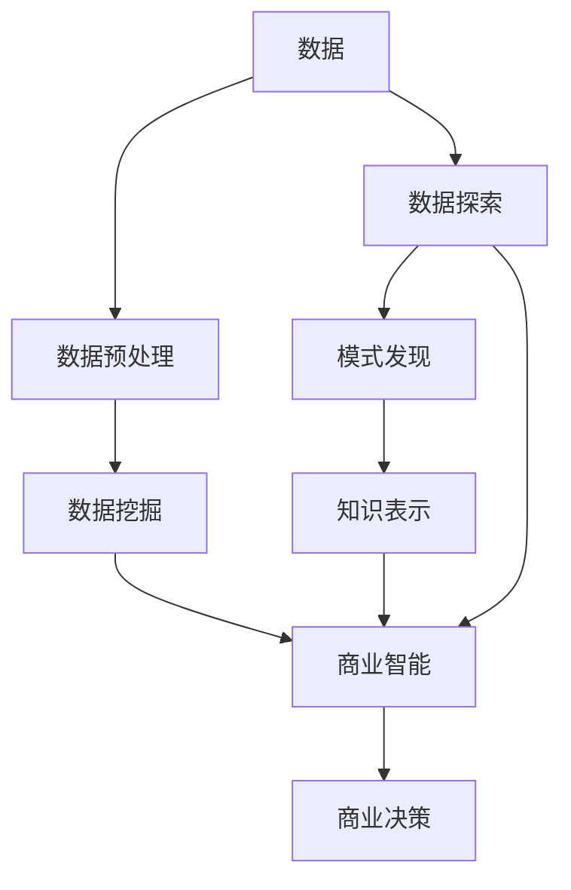

                 

# 知识发现引擎对商业决策的影响

> 关键词：知识发现,商业决策,商业智能,数据挖掘,深度学习

## 1. 背景介绍

在现代社会，数据已成为商业竞争中不可或缺的重要资源。如何高效地从海量数据中发现有用知识，并将其转化为实际商业决策，成为了各个企业关注的焦点。知识发现引擎(Knowledge Discovery Engine, KDE)作为商业智能(Business Intelligence, BI)的核心组成部分，通过自动化地挖掘数据中的模式和知识，支持企业的战略制定和运营优化。本文将深入探讨知识发现引擎对商业决策的影响，并分析其在现代商业环境中的重要性和应用潜力。

## 2. 核心概念与联系

### 2.1 核心概念概述

为更好地理解知识发现引擎对商业决策的影响，本节将介绍几个关键概念：

- 知识发现引擎(KDE)：一种自动化数据挖掘工具，用于从大量数据中发现潜在的知识和模式。KDE主要包括数据预处理、数据探索、模式发现和知识表示等多个模块，涵盖从原始数据到最终知识发现的完整过程。
- 商业决策：企业在日常运营中，根据当前环境、目标和资源，通过分析和推理，选择最优行动方案的过程。商业决策的正确性直接影响企业的盈利能力和市场竞争力。
- 商业智能(BI)：通过信息技术手段，对企业运营数据进行收集、整理、分析和报告，辅助决策者制定战略和运营决策。BI技术包括数据仓库、数据挖掘、OLAP等。
- 数据挖掘(Data Mining)：从数据中自动地发现模式、知识或规律的过程。数据挖掘常用于预测、分类、聚类、关联规则发现等任务。
- 深度学习(Deep Learning)：一种基于神经网络的机器学习方法，通过多层神经网络模拟人脑处理信息的方式，实现对复杂非线性问题的建模。深度学习在图像识别、语音识别、自然语言处理等领域已取得重大突破。

这些核心概念之间的逻辑关系可以通过以下Mermaid流程图来展示：



这个流程图展示了一整个知识发现的过程，从原始数据到最终的商业决策：

1. 原始数据首先经过数据预处理，去除噪声、填补缺失值等。
2. 数据探索通过统计分析和可视化工具，对数据进行初步了解。
3. 模式发现利用数据挖掘技术，识别出数据中的规律和模式。
4. 知识表示将挖掘到的知识进行结构化表示，便于后续分析和应用。
5. 最后，商业智能系统将这些知识应用于商业决策支持，提升决策质量。

## 3. 核心算法原理 & 具体操作步骤
### 3.1 算法原理概述

知识发现引擎对商业决策的影响，核心在于其能够自动地从数据中提取有用信息，并将这些信息转化为可用的知识。知识发现引擎的算法原理包括以下几个关键步骤：

1. **数据预处理**：清洗数据，去除噪声，填补缺失值，将数据转换为分析友好形式。
2. **数据探索**：通过统计描述、图形展示等方法，揭示数据的分布、趋势和异常。
3. **模式发现**：利用数据挖掘算法，识别出数据中的规律、关联和异常。
4. **知识表示**：将挖掘出的模式和规律转换为结构化的知识，用于后续的决策支持。

### 3.2 算法步骤详解

以下是知识发现引擎的详细操作步骤：

#### Step 1: 数据收集与清洗

知识发现引擎的第一步是收集数据，并对数据进行预处理。数据收集的来源包括企业内部的业务系统、客户反馈、市场调研等。数据清洗的目的是确保数据的质量和一致性，具体步骤如下：

1. **数据提取**：从各个数据源中抽取数据，并进行归档。
2. **数据转换**：将不同格式的数据转换为统一的格式，以便后续处理。
3. **数据清洗**：处理数据中的噪声、重复、缺失等异常情况。
4. **数据集成**：将来自不同来源的数据进行合并，形成统一视图。

#### Step 2: 数据探索与分析

数据探索的目的是揭示数据的内在结构，常用的方法包括：

1. **描述性统计**：计算数据的均值、方差、分布等基本统计量，描述数据特性。
2. **可视化分析**：利用图表、图形等可视化工具，展示数据分布、趋势、异常等。
3. **关联规则分析**：通过频繁项集和关联规则发现，揭示数据中的内在关联。

#### Step 3: 模式发现与知识提取

模式发现是知识发现引擎的核心步骤，主要利用数据挖掘算法，从数据中提取有价值的模式和规律。常用的算法包括：

1. **分类算法**：如决策树、逻辑回归、支持向量机等，用于将数据分为不同的类别。
2. **聚类算法**：如K-Means、层次聚类等，用于发现数据中的自然分组。
3. **关联规则算法**：如Apriori、FP-growth等，用于揭示数据项之间的关联关系。
4. **异常检测算法**：如孤立森林、局部离群因子等，用于发现数据中的异常点。

#### Step 4: 知识表示与呈现

知识发现引擎的最终目标是将挖掘出的模式和规律，转换为结构化的知识，并呈现给用户。常用的知识表示方法包括：

1. **决策树**：将决策过程以树状结构表示，方便理解和应用。
2. **规则库**：将关联规则和异常检测规则，存储在规则库中，供后续决策参考。
3. **数据仓库**：将整理好的数据存储在数据仓库中，支持OLAP分析和报告生成。

### 3.3 算法优缺点

知识发现引擎在商业决策中具有以下优点：

1. **自动性**：通过自动化的数据挖掘和模式发现，减少人工干预，提高效率。
2. **全面性**：覆盖从数据预处理到知识表示的完整流程，保证知识发现的全面性和准确性。
3. **实时性**：基于数据仓库和OLAP技术，支持实时查询和分析，满足商业决策的实时性需求。

但同时也存在一些缺点：

1. **数据依赖性**：知识发现的准确性和有效性高度依赖于数据的质量和完整性。
2. **复杂度**：数据挖掘算法复杂，需要较高的计算资源和技术水平。
3. **可解释性**：自动化的发现过程难以解释，需要额外的工具和技巧辅助解释。

### 3.4 算法应用领域

知识发现引擎在商业决策中的应用领域非常广泛，具体包括：

- 市场营销：通过分析客户购买行为和市场趋势，制定精准的市场营销策略。
- 金融风险管理：利用异常检测算法，识别欺诈和风险交易，提高金融安全。
- 供应链优化：通过关联规则分析，优化供应链的库存管理和物流调拨。
- 客户关系管理(CRM)：利用聚类算法，细分客户群体，实现个性化营销和服务。
- 人力资源管理：通过关联规则分析，优化招聘、培训和绩效评估流程。
- 产品研发：利用分类算法，预测市场需求和用户偏好，指导产品设计和迭代。

## 4. 数学模型和公式 & 详细讲解 & 举例说明

### 4.1 数学模型构建

知识发现引擎的数学模型构建，主要包括数据的统计描述和挖掘算法的形式化表示。以分类算法为例，其数学模型可以表示为：

$$
y = f(x;\theta)
$$

其中 $x$ 为输入特征向量，$y$ 为分类结果，$f$ 为分类函数，$\theta$ 为模型参数。常用的分类算法包括：

1. **决策树**：通过树状结构表示分类决策过程，分类函数可以表示为：
$$
f(x;\theta) = \begin{cases}
C_1 & \text{if} \quad x \in R_1 \\
C_2 & \text{if} \quad x \in R_2 \\
\vdots & \\
C_n & \text{if} \quad x \in R_n
\end{cases}
$$

2. **逻辑回归**：通过线性模型进行分类，分类函数可以表示为：
$$
f(x;\theta) = \sigma(\theta^T x)
$$
其中 $\sigma$ 为逻辑函数。

### 4.2 公式推导过程

以下是分类算法的公式推导过程：

#### 决策树

决策树的构建过程包括选择最佳划分特征、划分点和剪枝等步骤。以ID3算法为例，其推导过程如下：

1. **选择划分特征**：计算信息增益（Information Gain）或信息增益比（Information Gain Ratio），选择信息增益最大的特征进行划分。
$$
Gain(D, A) = \frac{I(D)}{I(D|A)} = \frac{H(D) - H(D|A)}{H(D)}
$$

2. **划分点确定**：在选定的特征上，选择最优的划分点，使得划分后的信息熵最小。
$$
D = \{(x_1, y_1), (x_2, y_2), \ldots, (x_n, y_n)\}
$$
$$
A = \{a_1, a_2, \ldots, a_k\}
$$
$$
Gain(D, A) = \frac{1}{|D|}\sum_{i=1}^n \frac{1}{|x_i|}\sum_{j=1}^{|x_i|} \delta_j(I(x_i))
$$

3. **剪枝**：防止过拟合，通过限制树的大小或验证集误差等方法，剪枝决策树。

#### 逻辑回归

逻辑回归的模型参数求解，通常使用最大似然估计或梯度下降等方法。以梯度下降为例，其推导过程如下：

1. **定义损失函数**：使用对数损失（Log Loss）或交叉熵损失（Cross-Entropy Loss），定义损失函数。
$$
L(\theta) = -\frac{1}{N}\sum_{i=1}^N [y_i\log f(x_i) + (1-y_i)\log (1-f(x_i))]
$$

2. **梯度下降**：通过梯度下降算法，最小化损失函数。
$$
\theta = \theta - \eta\nabla_{\theta}L(\theta)
$$

其中 $\eta$ 为学习率，$\nabla_{\theta}L(\theta)$ 为损失函数对模型参数的梯度。

### 4.3 案例分析与讲解

以金融风险管理为例，分析知识发现引擎如何帮助企业识别欺诈交易。

**数据准备**：

1. **数据收集**：收集历史交易数据，包括交易金额、时间、地点、用户信息等。
2. **数据清洗**：去除异常数据和噪声，填补缺失值。
3. **特征工程**：提取有意义的特征，如交易频率、金额分布、地理位置等。

**模型训练**：

1. **分类模型选择**：选择逻辑回归或决策树等分类算法。
2. **模型训练**：利用历史数据训练模型，优化模型参数。
3. **模型评估**：在测试集上评估模型性能，使用混淆矩阵、ROC曲线等指标。

**结果应用**：

1. **实时监测**：实时监测新交易数据，预测是否为欺诈交易。
2. **异常检测**：对异常交易进行预警和处理，提升金融安全。

## 5. 项目实践：代码实例和详细解释说明
### 5.1 开发环境搭建

在进行知识发现引擎项目实践前，我们需要准备好开发环境。以下是使用Python进行Scikit-learn开发的准备工作：

1. 安装Anaconda：从官网下载并安装Anaconda，用于创建独立的Python环境。

2. 创建并激活虚拟环境：
```bash
conda create -n kde-env python=3.8 
conda activate kde-env
```

3. 安装Scikit-learn：
```bash
conda install scikit-learn pandas numpy matplotlib seaborn scikit-optimize
```

4. 安装各类工具包：
```bash
pip install tqdm
```

5. 配置数据源：
```python
# 读取数据
import pandas as pd

data = pd.read_csv('data.csv')

# 数据清洗
data = data.dropna()

# 特征工程
X = data[['feature1', 'feature2', 'feature3']]
y = data['label']
```

完成上述步骤后，即可在`kde-env`环境中开始项目实践。

### 5.2 源代码详细实现

下面我们以分类任务为例，给出使用Scikit-learn进行决策树分类的PyTorch代码实现。

首先，定义数据集和模型：

```python
from sklearn.model_selection import train_test_split
from sklearn.tree import DecisionTreeClassifier

# 划分数据集
X_train, X_test, y_train, y_test = train_test_split(X, y, test_size=0.3)

# 定义决策树模型
model = DecisionTreeClassifier()
```

接着，训练模型并进行评估：

```python
from sklearn.metrics import accuracy_score, confusion_matrix

# 训练模型
model.fit(X_train, y_train)

# 评估模型
y_pred = model.predict(X_test)
print('Accuracy:', accuracy_score(y_test, y_pred))
print('Confusion Matrix:', confusion_matrix(y_test, y_pred))
```

最后，保存模型并进行预测：

```python
from sklearn.externals import joblib

# 保存模型
joblib.dump(model, 'model.pkl')

# 加载模型
model = joblib.load('model.pkl')

# 使用模型进行预测
new_data = pd.read_csv('new_data.csv')
X_new = new_data[['feature1', 'feature2', 'feature3']]
y_pred = model.predict(X_new)
print('Predictions:', y_pred)
```

以上就是使用Scikit-learn进行决策树分类的完整代码实现。可以看到，Scikit-learn提供了简单易用的接口，可以方便地构建、训练和评估机器学习模型。

### 5.3 代码解读与分析

让我们再详细解读一下关键代码的实现细节：

**数据集划分**：
- `train_test_split`函数用于将数据集划分为训练集和测试集。
- 根据测试集占总数据集的30%的比例进行划分，以保证模型评估的公正性。

**模型训练**：
- `DecisionTreeClassifier`类用于定义决策树模型。
- 利用训练集数据进行模型训练，优化模型参数。

**模型评估**：
- `accuracy_score`函数用于计算模型的准确率。
- `confusion_matrix`函数用于生成混淆矩阵，直观展示模型的分类效果。

**模型保存与加载**：
- `joblib.dump`函数用于将模型保存到文件中。
- `joblib.load`函数用于加载保存好的模型，便于后续使用。

**新数据预测**：
- 使用加载好的模型对新数据进行预测，得到分类结果。

可以看到，Scikit-learn提供了强大的功能和易于使用的API，使得模型构建和评估过程变得简单高效。开发者可以在此基础上，构建更为复杂的知识发现引擎，支持各种商业决策场景。

## 6. 实际应用场景

### 6.1 市场营销

在市场营销中，知识发现引擎可以帮助企业从大量客户数据中挖掘出有价值的信息，辅助制定精准的市场营销策略。例如：

1. **客户细分**：通过聚类算法，将客户分为不同的细分市场，进行有针对性的营销。
2. **购买预测**：利用分类算法，预测客户的购买行为和购买倾向，指导库存管理和促销策略。
3. **情感分析**：通过文本分析，识别客户的情感倾向，改进产品和服务的质量。

### 6.2 金融风险管理

金融行业面临着复杂的风险管理需求，知识发现引擎能够通过数据分析和模式发现，提升风险识别和控制能力。例如：

1. **欺诈检测**：利用异常检测算法，识别异常交易，防止欺诈行为。
2. **信用评估**：通过关联规则分析，评估客户的信用风险，制定贷款策略。
3. **市场预测**：利用预测模型，预测市场趋势和波动，指导投资决策。

### 6.3 供应链优化

供应链管理需要实时监控和预测，知识发现引擎可以提供有效的支持。例如：

1. **库存管理**：通过聚类算法，预测各供应商的供应情况，优化库存管理。
2. **需求预测**：利用时间序列分析，预测市场需求和变化趋势，指导生产和采购。
3. **物流调拨**：通过关联规则分析，优化物流调拨路径和运输方案。

## 7. 工具和资源推荐
### 7.1 学习资源推荐

为了帮助开发者掌握知识发现引擎的理论基础和实践技巧，这里推荐一些优质的学习资源：

1. 《数据挖掘导论》：由Jianmo Gao教授所著，全面介绍了数据挖掘的基本概念和常用算法，适合入门学习。

2. 《统计学习方法》：李航教授的经典著作，涵盖贝叶斯学习、决策树、支持向量机等算法，适合进阶学习。

3. 《Python数据科学手册》：由Jake VanderPlas著，介绍了Python在数据科学中的应用，包括数据预处理、数据探索和模型构建。

4. Kaggle机器学习竞赛平台：提供了丰富的数据集和竞赛题目，通过实战学习，提升数据挖掘和机器学习的技能。

5. Udacity数据科学纳米学位：提供了系统的数据科学课程，涵盖数据预处理、特征工程、模型评估等关键内容。

6. Coursera《数据科学与机器学习》课程：斯坦福大学开设的在线课程，涵盖数据科学的基础知识和实践技能。

通过对这些资源的学习实践，相信你一定能够快速掌握知识发现引擎的理论基础和实践技巧，并用于解决实际的商业问题。

### 7.2 开发工具推荐

高效的开发离不开优秀的工具支持。以下是几款用于知识发现引擎开发的常用工具：

1. Python：作为数据科学的首选语言，Python有丰富的数据处理和分析库，如Pandas、NumPy、Scikit-learn等，适合构建知识发现引擎。

2. R语言：作为数据科学和统计分析的常用语言，R语言提供了丰富的数据挖掘和统计分析工具，如ggplot2、dplyr、tidyverse等。

3. SQL数据库：用于数据存储和管理，支持复杂的查询和分析操作，如PostgreSQL、MySQL等。

4. OLAP工具：如Tableau、Power BI等，用于多维数据分析和可视化，支持商业智能报表和仪表盘。

5. Jupyter Notebook：作为交互式编程工具，支持Python、R、SQL等多种语言，方便进行数据分析和模型验证。

6. Visual Studio Code：作为集成开发环境，提供了丰富的扩展和插件，支持Python、R等多种语言开发。

合理利用这些工具，可以显著提升知识发现引擎的开发效率，加快创新迭代的步伐。

### 7.3 相关论文推荐

知识发现引擎的研究源于学界的持续研究。以下是几篇奠基性的相关论文，推荐阅读：

1.ID3算法：J. Ross Quinlan在1986年提出的ID3决策树算法，是知识发现领域的经典算法之一。

2. C4.5算法：Quinlan在1993年提出的C4.5决策树算法，是ID3算法的扩展，支持连续型数据和多分类问题。

3. K-Means算法：Mac K-Means在1967年提出的K-Means聚类算法，是聚类分析的常用算法之一。

4. 关联规则算法：R.A. R.Agrawal在1993年提出的Apriori算法，用于挖掘数据项之间的关联关系。

5. 异常检测算法：Chandola等在2006年提出的离群点检测算法，用于识别数据中的异常点。

这些论文代表了大数据挖掘技术的发展脉络。通过学习这些前沿成果，可以帮助研究者把握学科前进方向，激发更多的创新灵感。

## 8. 总结：未来发展趋势与挑战

### 8.1 总结

本文对知识发现引擎对商业决策的影响进行了全面系统的介绍。首先阐述了知识发现引擎在商业智能中的核心作用，明确了其在数据挖掘、模式发现和知识表示等关键环节的贡献。其次，从原理到实践，详细讲解了知识发现引擎的工作流程和具体算法，给出了知识发现引擎的完整代码实现。同时，本文还广泛探讨了知识发现引擎在市场营销、金融风险管理、供应链优化等诸多商业领域的应用前景，展示了其在现代商业环境中的重要性和应用潜力。此外，本文精选了知识发现引擎的学习资源、开发工具和相关论文，力求为读者提供全方位的技术指引。

通过本文的系统梳理，可以看到，知识发现引擎在商业决策中的应用潜力巨大，不仅能够提升企业的数据分析能力，还能为决策者提供实证支持，带来更加精准、高效的商业决策。未来，伴随数据技术的不断进步和知识发现引擎的演进，相信其在商业智能领域的应用将更加广泛，助力企业实现数字化转型和智能化升级。

### 8.2 未来发展趋势

展望未来，知识发现引擎将呈现以下几个发展趋势：

1. **自动化**：知识发现引擎将进一步自动化，从数据清洗到模型训练、评估和应用，减少人工干预，提高效率。

2. **智能化**：引入人工智能技术，如深度学习、强化学习等，提升知识发现的精度和效果，增强预测和决策能力。

3. **实时化**：利用流计算和大数据技术，实现实时数据挖掘和分析，支持商业决策的动态调整。

4. **多模态化**：融合多种数据类型，如图像、文本、语音等，构建多模态知识发现引擎，提升对复杂问题的处理能力。

5. **可视化**：增强知识表示和结果呈现的可视化效果，通过图表、仪表盘等工具，帮助决策者理解和应用知识发现结果。

6. **交互化**：开发交互式知识发现工具，支持用户自定义查询和分析，提升用户体验。

这些趋势凸显了知识发现引擎的广阔前景。未来的研究将进一步推动其在商业决策中的应用，为企业的数字化转型和智能化升级提供重要支撑。

### 8.3 面临的挑战

尽管知识发现引擎在商业决策中具有显著优势，但在实际应用中仍面临一些挑战：

1. **数据质量和数量**：知识发现的准确性和有效性高度依赖于数据的质量和数量，数据噪声和缺失值等问题可能影响分析结果。
2. **算法复杂度**：知识发现算法的计算复杂度高，需要较高的计算资源和技术水平，限制了应用场景。
3. **可解释性**：自动化的发现过程难以解释，需要额外的工具和技巧辅助解释，增加了使用难度。
4. **隐私和安全**：知识发现涉及敏感数据，数据隐私和安全问题需要严格控制和保护。

### 8.4 研究展望

面对知识发现引擎面临的这些挑战，未来的研究需要在以下几个方面寻求新的突破：

1. **数据治理**：建立完善的数据质量管理体系，确保数据的完整性和一致性，减少数据噪声和缺失值对分析结果的影响。

2. **算法优化**：开发高效的算法，降低计算复杂度，提高知识发现的效率和效果，支持大规模数据处理。

3. **可解释性增强**：引入可解释性技术，如LIME、SHAP等，增强知识发现过程的可解释性和可理解性，提高用户信任和接受度。

4. **隐私保护**：采用隐私保护技术，如差分隐私、联邦学习等，确保数据隐私和安全，保护用户隐私权益。

5. **跨模态融合**：探索跨模态数据融合技术，实现多种数据类型的协同分析，提升知识发现的全面性和准确性。

这些研究方向将推动知识发现引擎的不断演进，提升其在商业决策中的应用价值，为企业的数字化转型和智能化升级提供重要支撑。总之，知识发现引擎的未来发展充满挑战，但也充满机遇，需要学界和业界共同努力，不断突破技术瓶颈，实现更加高效、精准的商业决策支持。

## 9. 附录：常见问题与解答

**Q1：知识发现引擎的准确性如何保证？**

A: 知识发现引擎的准确性高度依赖于数据质量和模型选择。为保证准确性，需要采取以下措施：
1. 数据清洗：去除噪声、填补缺失值，确保数据的完整性和一致性。
2. 特征选择：选择有意义的特征，减少噪声干扰，提高模型性能。
3. 模型优化：选择适合的算法，并进行参数调优，提升模型精度。
4. 交叉验证：通过交叉验证等方法，评估模型效果，避免过拟合。

**Q2：知识发现引擎如何处理复杂数据类型？**

A: 知识发现引擎在处理复杂数据类型时，需要结合多种数据处理和分析技术。具体措施包括：
1. 数据转换：将不同格式的数据转换为统一格式，方便处理。
2. 特征工程：提取有意义的特征，减少复杂数据带来的干扰。
3. 多模态融合：融合多种数据类型，如图像、文本、语音等，构建多模态知识发现引擎。
4. 预处理技术：如图像分割、文本向量化等，处理复杂数据类型。

**Q3：知识发现引擎在商业决策中的应用有哪些限制？**

A: 知识发现引擎在商业决策中的应用，也存在一些限制和挑战：
1. 数据隐私：知识发现涉及敏感数据，需要严格控制和保护，防止数据泄露。
2. 算法复杂度：知识发现算法的计算复杂度高，需要较高的计算资源和技术水平，限制了应用场景。
3. 模型可解释性：自动化的发现过程难以解释，需要额外的工具和技巧辅助解释，增加了使用难度。
4. 实时性要求：知识发现需要实时性支持，部分算法可能无法满足实时分析需求。

**Q4：知识发现引擎的未来发展方向是什么？**

A: 知识发现引擎的未来发展方向主要包括以下几个方面：
1. 自动化程度提升：进一步自动化数据预处理、模型训练和结果呈现等环节，减少人工干预，提高效率。
2. 智能化增强：引入人工智能技术，如深度学习、强化学习等，提升知识发现的精度和效果，增强预测和决策能力。
3. 实时化支持：利用流计算和大数据技术，实现实时数据挖掘和分析，支持商业决策的动态调整。
4. 可视化增强：增强知识表示和结果呈现的可视化效果，通过图表、仪表盘等工具，帮助决策者理解和应用知识发现结果。
5. 交互化设计：开发交互式知识发现工具，支持用户自定义查询和分析，提升用户体验。
6. 跨模态融合：探索跨模态数据融合技术，实现多种数据类型的协同分析，提升知识发现的全面性和准确性。

这些研究方向将推动知识发现引擎的不断演进，提升其在商业决策中的应用价值，为企业的数字化转型和智能化升级提供重要支撑。

---

作者：禅与计算机程序设计艺术 / Zen and the Art of Computer Programming

