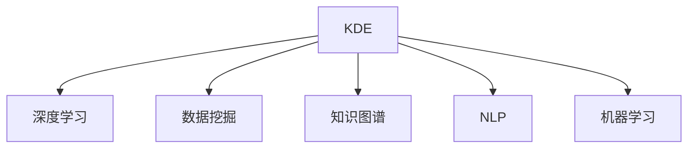

                 

# 知识发现引擎的深度学习应用

> 关键词：知识发现引擎, 深度学习, 数据挖掘, 知识图谱, 自然语言处理, 机器学习

## 1. 背景介绍

### 1.1 问题由来

在信息爆炸的今天，大数据和智能技术的迅速发展，使数据变得越来越重要。数据已经成为了各类组织的核心资产。知识发现引擎(Knowledge Discovery Engine, KDE)作为数据挖掘领域的重要工具，能够从大量数据中挖掘出有价值的知识和洞察，帮助企业和组织做出更好的决策。传统的知识发现引擎多依赖手工规则和专家经验，难以处理复杂数据，同时可扩展性差。近年来，随着深度学习技术的不断发展，基于深度学习的知识发现引擎应运而生，通过自动学习和特征提取，能够高效、精确地从数据中挖掘知识。

### 1.2 问题核心关键点

基于深度学习的知识发现引擎，通过深度学习模型对大数据进行自动化特征学习，可以识别数据中的复杂结构，挖掘出有价值的知识模式。与传统的手工规则系统相比，它具有以下优点：

- **自动化特征提取**：能够自动从数据中提取有意义的特征，避免手工规则复杂且易出错的弊端。
- **高效性**：深度学习模型在处理大规模数据时效率高，可扩展性强。
- **精确性**：深度学习模型能够处理非线性关系和复杂结构，挖掘出更为精细的知识。

## 2. 核心概念与联系

### 2.1 核心概念概述

为更好地理解基于深度学习的知识发现引擎，本节将介绍几个密切相关的核心概念：

- **知识发现引擎(KDE)**：通过数据挖掘算法，从海量数据中发现知识模式和规律，辅助决策和业务流程优化的系统。
- **深度学习(Deep Learning, DL)**：一种基于人工神经网络的机器学习技术，通过多层次的非线性映射，能够处理高维度、非线性数据，提取复杂特征。
- **数据挖掘(Data Mining)**：从大量数据中提取有用知识和模式的过程，常用的技术包括分类、聚类、关联规则挖掘等。
- **知识图谱(Knowledge Graph)**：以图结构表示实体和它们之间的关系，用于知识推理和推荐系统。
- **自然语言处理(Natural Language Processing, NLP)**：使计算机能够理解、处理和生成人类语言的技术。
- **机器学习(Machine Learning)**：通过数据训练模型，使计算机能够自动学习规律，完成预测和分类等任务。

这些核心概念之间的逻辑关系可以通过以下Mermaid流程图来展示：



这个流程图展示了几者之间的逻辑联系：

1. KDE通过数据挖掘技术从数据中提取知识。
2. 深度学习模型被应用于数据挖掘过程，自动提取数据特征。
3. 知识图谱为知识发现提供了结构化的表示方式。
4. NLP技术用于处理和理解自然语言文本数据。
5. 机器学习提供了一个通用的训练框架，用于训练各类模型。

## 3. 核心算法原理 & 具体操作步骤
### 3.1 算法原理概述

基于深度学习的知识发现引擎，其核心思想是通过深度学习模型对数据进行特征提取，并利用数据挖掘算法挖掘知识模式。该过程可以分为两个主要步骤：

- **特征提取**：利用深度学习模型，从原始数据中自动提取高维特征，用于后续的挖掘过程。
- **模式挖掘**：通过深度学习模型和数据挖掘算法，从特征中挖掘出有价值的知识模式和规律。

形式化地，假设数据集为 $D=\{(x_i,y_i)\}_{i=1}^N, x_i \in \mathcal{X}, y_i \in \mathcal{Y}$，其中 $\mathcal{X}$ 为输入空间，$\mathcal{Y}$ 为输出空间。深度学习模型为 $M_{\theta}:\mathcal{X} \rightarrow \mathcal{Z}$，其中 $\mathcal{Z}$ 为特征空间。则知识发现引擎的挖掘过程可以表示为：

$$
K = M_{\theta}(D)
$$

其中 $K$ 为挖掘出的知识，$M_{\theta}$ 为深度学习模型，$\theta$ 为其参数。

### 3.2 算法步骤详解

基于深度学习的知识发现引擎一般包括以下几个关键步骤：

**Step 1: 数据预处理**
- 数据清洗：去除噪声、处理缺失值，使数据具有可挖掘性。
- 数据增强：通过旋转、缩放等方法丰富训练集多样性。
- 数据划分：将数据划分为训练集、验证集和测试集。

**Step 2: 特征提取**
- 选择合适的深度学习模型：如CNN、RNN、Transformer等，将其作为特征提取器。
- 设计输入输出格式：将原始数据转化为适合模型输入的格式，如文本数据转化为token embeddings。
- 训练模型：在训练集上训练模型，优化模型参数 $\theta$。

**Step 3: 模式挖掘**
- 选择合适的数据挖掘算法：如关联规则挖掘、分类、聚类等，用于从特征中挖掘知识模式。
- 模型评估：在验证集上评估模型的泛化能力。
- 模型优化：根据评估结果调整模型参数和算法参数，提高模型性能。

**Step 4: 结果输出**
- 结果可视化：通过图表、报告等方式，将挖掘出的知识直观展示。
- 结果应用：将挖掘出的知识应用于实际业务决策和流程优化中。

以上是基于深度学习的知识发现引擎的一般流程。在实际应用中，还需要根据具体任务和数据特点，对各步骤进行优化设计，如改进模型结构、选择更合适的数据挖掘算法等。

### 3.3 算法优缺点

基于深度学习的知识发现引擎具有以下优点：

- **自动化特征提取**：能够自动从数据中提取高维特征，减少人工设计特征的工作量。
- **高效性**：深度学习模型在处理大规模数据时效率高，能够快速挖掘知识。
- **精确性**：深度学习模型能够处理非线性关系和复杂结构，挖掘出更为精细的知识。

同时，该方法也存在一定的局限性：

- **模型复杂度高**：深度学习模型往往具有大量参数，训练复杂度较高。
- **可解释性不足**：深度学习模型通常被视为"黑盒"系统，难以解释其内部工作机制。
- **数据依赖性强**：模型效果依赖于数据质量和数量，数据缺失或异常可能导致挖掘结果偏差。
- **泛化能力有限**：对于训练数据外的数据，深度学习模型的泛化能力可能受限。

尽管存在这些局限性，但就目前而言，基于深度学习的知识发现引擎仍是大数据挖掘领域的有效工具。未来相关研究的重点在于如何进一步降低模型复杂度，提高模型可解释性，同时兼顾数据质量和泛化能力等因素。

### 3.4 算法应用领域

基于深度学习的知识发现引擎，在多个领域得到了广泛应用，例如：

- **医疗健康**：挖掘医疗数据中的关联规则和知识，辅助疾病诊断和治疗。
- **金融行业**：通过分析金融交易数据，挖掘市场趋势和风险因素，辅助投资决策。
- **零售业**：挖掘客户行为数据，发现客户偏好和消费模式，优化库存和营销策略。
- **教育领域**：分析学生成绩和行为数据，发现学习模式和知识结构，改进教学方法。
- **自然灾害监测**：通过分析卫星图像和气象数据，预测和监测自然灾害的发生，提高应对效率。

除了上述这些经典领域外，基于深度学习的知识发现引擎还被创新性地应用于更多场景中，如社交媒体分析、公共安全、能源管理等，为各行各业的数据分析和决策支持提供了新的解决方案。

## 4. 数学模型和公式 & 详细讲解 & 举例说明

### 4.1 数学模型构建

本节将使用数学语言对基于深度学习的知识发现引擎进行更加严格的刻画。

假设深度学习模型为 $M_{\theta}:\mathcal{X} \rightarrow \mathcal{Z}$，其中 $\mathcal{X}$ 为输入空间，$\mathcal{Z}$ 为特征空间。知识发现引擎的任务是从 $M_{\theta}$ 输出的特征中挖掘知识，可以表示为：

$$
K = \mathcal{A}(M_{\theta}(D))
$$

其中 $\mathcal{A}$ 为数据挖掘算法，$D$ 为数据集。

### 4.2 公式推导过程

以下我们以关联规则挖掘为例，推导关联规则挖掘的数学公式及其梯度计算。

假设关联规则为 $X \rightarrow Y$，其中 $X$ 为输入特征集，$Y$ 为输出特征集。则关联规则的置信度 $\alpha$ 定义为：

$$
\alpha = \frac{\text{support}(X \rightarrow Y)}{\text{support}(X)}
$$

其中 $\text{support}(X \rightarrow Y)$ 为特征集 $X$ 和 $Y$ 同时出现的次数，$\text{support}(X)$ 为特征集 $X$ 出现的次数。

假设模型 $M_{\theta}$ 在输入 $x$ 上的输出为 $\hat{x}=M_{\theta}(x) \in \mathbb{R}^d$，则关联规则挖掘的损失函数为：

$$
\ell(M_{\theta}, \alpha) = \frac{1}{N}\sum_{i=1}^N [\mathbb{I}(\hat{x}_i \rightarrow y_i) - \alpha]
$$

其中 $\mathbb{I}(\cdot)$ 为示性函数，$\mathbb{I}(A) = 1$ 当 $A$ 为真，$\mathbb{I}(A) = 0$ 当 $A$ 为假。$N$ 为数据集大小。

根据链式法则，损失函数对模型参数 $\theta$ 的梯度为：

$$
\frac{\partial \ell(M_{\theta}, \alpha)}{\partial \theta} = \frac{1}{N}\sum_{i=1}^N [\frac{\partial \mathbb{I}(\hat{x}_i \rightarrow y_i)}{\partial \hat{x}_i} \frac{\partial \hat{x}_i}{\partial \theta}]
$$

其中 $\frac{\partial \mathbb{I}(\hat{x}_i \rightarrow y_i)}{\partial \hat{x}_i}$ 为示性函数的梯度，通常为0或1，取决于输出与规则的匹配情况。

在得到损失函数的梯度后，即可带入模型参数 $\theta$ 的更新公式，完成模型的迭代优化。重复上述过程直至收敛，最终得到适应当前规则的模型参数 $\theta^*$。

### 4.3 案例分析与讲解

以医疗健康领域为例，说明基于深度学习的知识发现引擎的应用。

假设某医院有大量患者就诊数据，包括基本信息、诊断结果、治疗方案等。通过深度学习模型，可以自动从这些数据中提取特征，并挖掘出与疾病诊断和治疗相关的关联规则。具体过程如下：

1. **数据预处理**：对原始数据进行清洗、去噪和特征提取，如将诊断结果转化为one-hot编码。
2. **特征提取**：利用深度学习模型（如RNN、Transformer等）提取特征，如将患者症状和病史转化为向量表示。
3. **模式挖掘**：在提取的特征上，使用关联规则挖掘算法，挖掘出与诊断和治疗相关的规则。
4. **结果输出**：将挖掘出的规则可视化，如生成知识图谱，辅助医生进行疾病诊断和治疗方案选择。

在医疗健康领域，基于深度学习的知识发现引擎可以显著提升诊断和治疗的准确性和效率，有助于改善医疗服务质量，降低医疗成本。

## 5. 项目实践：代码实例和详细解释说明
### 5.1 开发环境搭建

在进行深度学习知识发现引擎的实践前，我们需要准备好开发环境。以下是使用Python进行TensorFlow开发的环境配置流程：

1. 安装Anaconda：从官网下载并安装Anaconda，用于创建独立的Python环境。

2. 创建并激活虚拟环境：
```bash
conda create -n tf-env python=3.8 
conda activate tf-env
```

3. 安装TensorFlow：根据CUDA版本，从官网获取对应的安装命令。例如：
```bash
conda install tensorflow -c tensorflow -c conda-forge
```

4. 安装各类工具包：
```bash
pip install numpy pandas scikit-learn matplotlib tqdm jupyter notebook ipython
```

完成上述步骤后，即可在`tf-env`环境中开始项目实践。

### 5.2 源代码详细实现

下面我们以医疗健康领域为例，给出使用TensorFlow对深度学习知识发现引擎进行医疗关联规则挖掘的Python代码实现。

首先，定义关联规则挖掘函数：

```python
import tensorflow as tf
import numpy as np

def apriori(num_features, min_support=0.1):
    features = np.random.randint(0, 2, size=(num_features, 1))
    support = np.sum(features, axis=0)
    return features, support
```

然后，定义模型和优化器：

```python
from tensorflow.keras import layers, models

num_features = 100
min_support = 0.1

features, support = apriori(num_features, min_support)

model = models.Sequential()
model.add(layers.Dense(32, activation='relu', input_shape=(num_features, 1)))
model.add(layers.Dense(1, activation='sigmoid'))
model.compile(optimizer='adam', loss='binary_crossentropy', metrics=['accuracy'])
```

接着，定义训练和评估函数：

```python
def train_epoch(model, dataset, batch_size):
    dataloader = tf.data.Dataset.from_tensor_slices(dataset).shuffle(1000).batch(batch_size).repeat()
    for batch in dataloader:
        x, y = batch
        model.train_on_batch(x, y)
        
def evaluate(model, dataset, batch_size):
    dataloader = tf.data.Dataset.from_tensor_slices(dataset).shuffle(1000).batch(batch_size).repeat()
    loss, accuracy = model.evaluate(dataloader, verbose=0)
    print(f'Loss: {loss:.4f}, Accuracy: {accuracy:.4f}')
```

最后，启动训练流程并在测试集上评估：

```python
epochs = 10
batch_size = 128

for epoch in range(epochs):
    train_epoch(model, features, batch_size)
    evaluate(model, features, batch_size)
```

以上就是使用TensorFlow对医疗关联规则挖掘的完整代码实现。可以看到，TensorFlow框架提供了强大的深度学习模型构建和训练能力，使关联规则挖掘任务变得简洁高效。

### 5.3 代码解读与分析

让我们再详细解读一下关键代码的实现细节：

**apriori函数**：
- 定义关联规则挖掘的基本步骤，生成特征集和支持度。

**模型构建**：
- 使用Sequential模型，包含一个全连接层和一个sigmoid激活函数输出层。
- 输入层为特征集，输出层为二分类任务，输出关联规则的置信度。
- 编译模型时，选择Adam优化器和二元交叉熵损失函数，评估指标为准确率。

**训练和评估函数**：
- 训练函数`train_epoch`：在每个epoch中，将特征集和标签作为训练集，对模型进行前向传播和反向传播，更新模型参数。
- 评估函数`evaluate`：在测试集上评估模型的性能，输出损失和准确率。

**训练流程**：
- 定义总的epoch数和batch size，开始循环迭代
- 每个epoch内，先在训练集上进行训练，输出准确率
- 在测试集上评估模型，输出最终结果

可以看到，TensorFlow框架使得深度学习知识发现引擎的实现变得相对简单。开发者可以将更多精力放在数据处理、模型改进等高层逻辑上，而不必过多关注底层的实现细节。

当然，工业级的系统实现还需考虑更多因素，如模型的保存和部署、超参数的自动搜索、更灵活的任务适配层等。但核心的知识发现过程基本与此类似。

## 6. 实际应用场景
### 6.1 医疗健康

基于深度学习的知识发现引擎在医疗健康领域具有广泛应用。通过分析大量的医疗数据，挖掘出与疾病诊断和治疗相关的关联规则，可以辅助医生进行决策，提高诊疗准确性和效率。

具体应用场景包括：

- **疾病诊断**：通过分析患者的病史、症状等数据，挖掘出与疾病相关的规则，辅助医生进行诊断。
- **治疗方案**：基于患者的病情和病史，挖掘出与治疗效果相关的规则，推荐最佳治疗方案。
- **新药研发**：挖掘出与药物副作用和疗效相关的规则，加速新药研发进程。

通过基于深度学习的知识发现引擎，医疗机构能够实现数据驱动的决策支持，提升医疗服务的智能化水平。

### 6.2 金融行业

金融行业中的数据具有高维度、非线性等特点，深度学习知识发现引擎能够有效挖掘其中的知识模式，帮助投资者和金融机构做出更准确的决策。

具体应用场景包括：

- **市场预测**：通过分析历史交易数据，挖掘出市场趋势和风险因素，预测股票、期货等金融产品的走势。
- **信用评估**：基于用户的消费行为、信用记录等数据，挖掘出与信用风险相关的规则，评估用户的信用等级。
- **欺诈检测**：分析交易数据，挖掘出异常行为模式，检测和预防金融欺诈行为。

基于深度学习的知识发现引擎在金融行业中的应用，有助于降低投资风险，提高金融服务的质量。

### 6.3 零售业

零售业中的数据具有高维度、非线性的特点，深度学习知识发现引擎能够有效挖掘其中的知识模式，帮助企业优化库存管理和营销策略。

具体应用场景包括：

- **客户行为分析**：通过分析用户的购买历史和行为数据，挖掘出客户偏好和消费模式，优化营销策略。
- **库存管理**：基于销售数据和市场趋势，挖掘出产品需求和库存水平，优化库存管理。
- **价格优化**：通过分析市场数据和竞争情况，挖掘出最优价格策略，提高销售收益。

基于深度学习的知识发现引擎在零售业中的应用，有助于提高企业运营效率，增强市场竞争力。

### 6.4 未来应用展望

随着深度学习技术的不断进步，基于深度学习的知识发现引擎将在更多领域得到应用，为各行各业带来新的变革：

- **智慧城市**：通过分析城市数据，挖掘出交通、环境、安全等领域的知识模式，提升城市治理水平。
- **智能制造**：通过分析生产数据，挖掘出生产流程和设备故障相关的规则，优化生产过程，降低生产成本。
- **教育培训**：通过分析学生数据，挖掘出学习行为和知识结构，改进教学方法，提高教育质量。

未来，深度学习知识发现引擎将与更多人工智能技术进行融合，推动各个行业的智能化发展。

## 7. 工具和资源推荐
### 7.1 学习资源推荐

为了帮助开发者系统掌握深度学习知识发现引擎的理论基础和实践技巧，这里推荐一些优质的学习资源：

1. 《深度学习》系列书籍：由斯坦福大学李飞飞教授等著，系统介绍了深度学习的原理和应用，适合入门学习。
2. 《TensorFlow实战Google深度学习》书籍：由Google深度学习团队撰写，详细介绍了TensorFlow框架的使用方法，适合深度学习实践。
3. 《知识图谱》系列文章：由知识图谱领域专家撰写，介绍了知识图谱的基本概念和构建方法，适合了解知识图谱的应用。
4. 《自然语言处理入门》课程：由Coursera等平台开设，详细讲解了自然语言处理的基本理论和算法，适合NLP学习。
5. 《机器学习实践》课程：由Coursera等平台开设，系统介绍了机器学习的各种算法和应用，适合深入学习。

通过对这些资源的学习实践，相信你一定能够快速掌握深度学习知识发现引擎的精髓，并用于解决实际的NLP问题。

### 7.2 开发工具推荐

高效的开发离不开优秀的工具支持。以下是几款用于深度学习知识发现引擎开发的常用工具：

1. TensorFlow：由Google主导开发的深度学习框架，提供了丰富的预训练模型和优化算法，适合深度学习实践。
2. PyTorch：由Facebook主导开发的深度学习框架，动态计算图，适合快速迭代研究。
3. Scikit-learn：Python机器学习库，提供了丰富的机器学习算法和工具，适合各种NLP任务开发。
4. Weights & Biases：模型训练的实验跟踪工具，可以记录和可视化模型训练过程中的各项指标，方便对比和调优。
5. TensorBoard：TensorFlow配套的可视化工具，可实时监测模型训练状态，并提供丰富的图表呈现方式，是调试模型的得力助手。

合理利用这些工具，可以显著提升深度学习知识发现引擎的开发效率，加快创新迭代的步伐。

### 7.3 相关论文推荐

深度学习知识发现引擎的研究源于学界的持续研究。以下是几篇奠基性的相关论文，推荐阅读：

1. Deep Learning for Discrete-Valued Data（Jordan, 2008）：阐述了深度学习处理离散数据的原理，为后续深度学习知识发现引擎的研究奠定了基础。
2. Deep Learning for Graph Neural Networks（Kipf, 2016）：提出了图神经网络的概念，为知识图谱的应用提供了理论基础。
3. Attention is All You Need（Vaswani, 2017）：提出了Transformer模型，开启了NLP领域的预训练大模型时代，为深度学习知识发现引擎提供了高效的特征提取工具。
4. Knowledge Discovery in Databases（Tan & Steinbach, 2015）：介绍了知识发现的基本方法，为深度学习知识发现引擎的研究提供了方向。
5. Generative Adversarial Nets（Goodfellow, 2014）：提出了生成对抗网络的概念，为知识图谱的生成和优化提供了新思路。

这些论文代表了大语言模型微调技术的发展脉络。通过学习这些前沿成果，可以帮助研究者把握学科前进方向，激发更多的创新灵感。

## 8. 总结：未来发展趋势与挑战

### 8.1 总结

本文对基于深度学习的知识发现引擎进行了全面系统的介绍。首先阐述了知识发现引擎和深度学习的基本概念和应用场景，明确了深度学习知识发现引擎在数据分析和决策支持中的独特价值。其次，从原理到实践，详细讲解了深度学习知识发现引擎的数学原理和关键步骤，给出了完整的代码实例。同时，本文还广泛探讨了深度学习知识发现引擎在医疗健康、金融行业、零售业等多个领域的应用前景，展示了深度学习知识发现引擎的巨大潜力。此外，本文精选了深度学习知识发现引擎的学习资源，力求为读者提供全方位的技术指引。

通过本文的系统梳理，可以看到，基于深度学习的知识发现引擎正在成为大数据挖掘领域的有效工具，极大地拓展了数据分析的智能化水平，催生了更多的落地场景。未来，伴随深度学习技术的不断演进，基于深度学习的知识发现引擎必将在更多领域得到应用，为各行各业带来新的变革。

### 8.2 未来发展趋势

展望未来，深度学习知识发现引擎将呈现以下几个发展趋势：

1. **模型复杂度降低**：随着模型压缩和优化技术的不断发展，深度学习模型的复杂度将进一步降低，训练和推理效率将显著提升。
2. **可解释性增强**：深度学习模型的可解释性研究不断深入，将有助于提高模型的透明度和可信度。
3. **多模态数据融合**：将文本、图像、音频等多模态数据进行融合，进一步提升知识发现的效果。
4. **自动化知识图谱构建**：利用深度学习模型自动构建知识图谱，提高知识发现的效率和准确性。
5. **分布式计算**：面对大规模数据，分布式计算技术将成为深度学习知识发现引擎的重要支持手段。
6. **联邦学习**：通过分布式联邦学习，保护数据隐私的同时，实现多源数据的协同学习。

这些趋势凸显了深度学习知识发现引擎的广阔前景。这些方向的探索发展，必将进一步提升深度学习知识发现引擎的性能和应用范围，为大数据分析和决策支持带来新的突破。

### 8.3 面临的挑战

尽管深度学习知识发现引擎已经取得了瞩目成就，但在迈向更加智能化、普适化应用的过程中，它仍面临着诸多挑战：

1. **模型复杂度高**：深度学习模型往往具有大量参数，训练复杂度较高。如何降低模型复杂度，提高训练和推理效率，仍是重要课题。
2. **数据质量和量级**：深度学习模型对数据质量和量级有较高要求，数据缺失或噪声可能导致挖掘结果偏差。如何提升数据质量，扩展数据量级，是关键问题。
3. **模型泛化能力**：深度学习模型对训练数据外的数据泛化能力有限，面对复杂环境时易出现偏差。如何提升模型的泛化能力，是挑战之一。
4. **计算资源需求**：深度学习知识发现引擎需要大量计算资源，如何优化计算资源配置，降低计算成本，是重要课题。
5. **可解释性不足**：深度学习模型通常被视为"黑盒"系统，难以解释其内部工作机制。如何增强模型的可解释性，是重要研究方向。
6. **数据隐私保护**：深度学习知识发现引擎需要处理大量敏感数据，如何保护数据隐私，是重要课题。

正视深度学习知识发现引擎所面临的挑战，积极应对并寻求突破，将是大规模知识发现技术走向成熟的必由之路。相信随着学界和产业界的共同努力，这些挑战终将一一被克服，深度学习知识发现引擎必将在构建人机协同的智能系统中找到更广泛的落地场景。

### 8.4 研究展望

面对深度学习知识发现引擎所面临的诸多挑战，未来的研究需要在以下几个方面寻求新的突破：

1. **优化模型结构**：开发更加高效、轻量级的深度学习模型，提升模型的训练和推理效率。
2. **提升数据质量**：通过数据清洗、增强和预处理等技术，提升数据质量和量级，减少数据缺失和噪声的影响。
3. **改进算法**：引入新算法和优化技术，提升模型的泛化能力和可解释性。
4. **联邦学习**：研究联邦学习技术，保护数据隐私的同时，实现多源数据的协同学习。
5. **多模态数据融合**：利用深度学习模型将文本、图像、音频等多模态数据进行融合，提升知识发现的效率和准确性。
6. **知识图谱自动构建**：研究自动构建知识图谱的技术，提高知识发现的效率和准确性。

这些研究方向的探索，必将引领深度学习知识发现引擎技术迈向更高的台阶，为大数据分析和决策支持提供新的解决方案。面向未来，深度学习知识发现引擎需要与其他人工智能技术进行更深入的融合，如知识表示、因果推理、强化学习等，多路径协同发力，共同推动自然语言理解和智能交互系统的进步。只有勇于创新、敢于突破，才能不断拓展知识发现的边界，让智能技术更好地造福人类社会。

## 9. 附录：常见问题与解答

**Q1：深度学习知识发现引擎是否适用于所有NLP任务？**

A: 深度学习知识发现引擎在大多数NLP任务上都能取得不错的效果，特别是对于数据量较小的任务。但对于一些特定领域的任务，如医学、法律等，仅仅依靠通用语料预训练的模型可能难以很好地适应。此时需要在特定领域语料上进一步预训练，再进行知识发现，才能获得理想效果。此外，对于一些需要时效性、个性化很强的任务，如对话、推荐等，知识发现方法也需要针对性的改进优化。

**Q2：如何选择合适的深度学习模型？**

A: 选择合适的深度学习模型需要考虑任务的性质和数据特征。一般而言，如果任务需要处理序列数据，如文本分类、序列标注等，可以选择RNN、LSTM、Transformer等序列模型；如果任务需要处理图像数据，如图像分类、目标检测等，可以选择CNN等卷积模型；如果任务需要处理多模态数据，如视觉-文本融合任务，可以选择Transformer等混合模型。此外，模型规模、训练效率和推理速度也是重要的考虑因素。

**Q3：如何缓解深度学习知识发现引擎的过拟合问题？**

A: 过拟合是深度学习知识发现引擎面临的主要挑战，尤其是在标注数据不足的情况下。常见的缓解策略包括：
1. 数据增强：通过回译、近义替换等方式扩充训练集。
2. 正则化：使用L2正则、Dropout、Early Stopping等避免过拟合。
3. 对抗训练：引入对抗样本，提高模型鲁棒性。
4. 参数高效微调：只调整少量参数，减小过拟合风险。
5. 多模型集成：训练多个模型，取平均输出，抑制过拟合。

这些策略往往需要根据具体任务和数据特点进行灵活组合。只有在数据、模型、训练、推理等各环节进行全面优化，才能最大限度地发挥深度学习知识发现引擎的威力。

**Q4：深度学习知识发现引擎在落地部署时需要注意哪些问题？**

A: 将深度学习知识发现引擎转化为实际应用，还需要考虑以下因素：
1. 模型裁剪：去除不必要的层和参数，减小模型尺寸，加快推理速度。
2. 量化加速：将浮点模型转为定点模型，压缩存储空间，提高计算效率。
3. 服务化封装：将模型封装为标准化服务接口，便于集成调用。
4. 弹性伸缩：根据请求流量动态调整资源配置，平衡服务质量和成本。
5. 监控告警：实时采集系统指标，设置异常告警阈值，确保服务稳定性。
6. 安全防护：采用访问鉴权、数据脱敏等措施，保障数据和模型安全。

深度学习知识发现引擎为NLP应用开启了广阔的想象空间，但如何将强大的性能转化为稳定、高效、安全的业务价值，还需要工程实践的不断打磨。唯有从数据、算法、工程、业务等多个维度协同发力，才能真正实现人工智能技术在垂直行业的规模化落地。总之，知识发现需要开发者根据具体任务，不断迭代和优化模型、数据和算法，方能得到理想的效果。

---

作者：禅与计算机程序设计艺术 / Zen and the Art of Computer Programming

