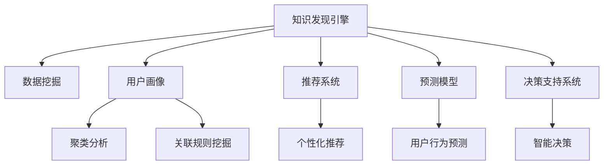

                 

# 知识发现引擎的用户画像分析与应用

> 关键词：知识发现引擎,用户画像,数据挖掘,聚类分析,个性化推荐,用户行为预测,决策支持系统

## 1. 背景介绍

### 1.1 问题由来

在信息爆炸的现代社会，企业面临的数据量呈指数级增长。如何从海量的数据中提取有价值的信息，进行精准的数据分析和用户画像构建，是企业数字化转型中的重要挑战。传统的基于规则或人工标签的数据分析方法难以满足需求，而基于数据驱动的智能分析技术，如知识发现引擎(Knowledge Discovery Engine, KDE)，成为近年来的研究热点。

知识发现引擎是一种基于数据挖掘和机器学习的智能分析工具，能够自动从海量数据中挖掘出有价值的模式、关联和趋势，为企业提供精准的用户画像、个性化推荐、决策支持等功能。但如何在复杂多变的数据环境中，高效地构建高质量的用户画像，是知识发现引擎需要解决的关键问题。

### 1.2 问题核心关键点

用户画像(User Profile)是指通过数据分析和建模，生成一个结构化的、多维度的、描述用户行为、兴趣、需求等的模型。高质量的用户画像可以用于个性化推荐、用户行为预测、营销策略优化、客户细分等应用，是企业数字化转型的重要基础。

构建用户画像的核心关键点在于：
1. 数据收集：获取全面的用户行为数据，如浏览记录、点击行为、购买记录等。
2. 数据预处理：清洗、去重、归一化处理原始数据，构建高质量的数据集。
3. 用户建模：通过聚类分析、关联规则挖掘等方法，生成不同维度的用户画像特征。
4. 画像更新：持续收集用户新数据，更新用户画像，保持画像的时效性。
5. 画像应用：结合具体应用场景，设计合适的用户画像应用模块，实现数据驱动的智能决策。

## 2. 核心概念与联系

### 2.1 核心概念概述

为了更好地理解用户画像的构建与应用，本节将介绍几个密切相关的核心概念：

- **知识发现引擎(KDE)**：基于数据挖掘和机器学习的智能分析工具，能够自动从海量数据中提取有价值的模式和关联。
- **用户画像(User Profile)**：通过数据分析和建模，生成描述用户行为、兴趣、需求等的结构化模型。
- **数据挖掘(Data Mining)**：从大规模数据中自动挖掘出有价值的模式、关联和趋势。
- **聚类分析(Clustering Analysis)**：将数据分组，使得同一组内的数据具有相似特征。
- **关联规则挖掘(Association Rule Mining)**：挖掘数据项之间的关联规则，识别频繁项集和关联规则。
- **推荐系统(Recommendation System)**：基于用户行为数据，推荐相关产品、内容或服务。
- **预测模型(Prediction Model)**：通过建模，预测未来事件或变量。

这些核心概念之间的逻辑关系可以通过以下Mermaid流程图来展示：



这个流程图展示了一些核心概念及其之间的关系：

1. 知识发现引擎通过数据挖掘获取数据模式和关联，生成用户画像。
2. 用户画像中的聚类分析和关联规则挖掘，帮助发现不同用户群体的特征。
3. 推荐系统利用用户画像进行个性化推荐，提升用户体验。
4. 预测模型对用户行为进行预测，为决策支持系统提供依据。
5. 决策支持系统结合用户画像和预测模型，做出智能决策。

这些概念共同构成了用户画像的构建和应用框架，使得知识发现引擎能够从数据中挖掘出用户行为和需求的规律，为企业提供精准的用户画像服务。

## 3. 核心算法原理 & 具体操作步骤
### 3.1 算法原理概述

用户画像的构建基于数据挖掘和机器学习算法，核心目标是通过分析用户行为数据，挖掘出有价值的模式、关联和趋势，生成一个结构化的用户特征模型。

具体来说，用户画像的构建可以分为以下几个步骤：

1. **数据收集**：获取用户行为数据，包括浏览记录、点击行为、购买记录等。
2. **数据预处理**：清洗、去重、归一化处理原始数据，构建高质量的数据集。
3. **聚类分析**：通过聚类算法将用户分成不同群体，发现不同群体之间的差异。
4. **关联规则挖掘**：挖掘数据项之间的关联规则，识别频繁项集和关联规则。
5. **用户建模**：根据聚类和关联规则挖掘结果，生成多维度用户画像。
6. **画像更新**：持续收集用户新数据，更新用户画像，保持画像的时效性。
7. **画像应用**：结合具体应用场景，设计合适的用户画像应用模块，实现数据驱动的智能决策。

### 3.2 算法步骤详解

**Step 1: 数据收集**

用户画像的构建首先需要获取全面的用户行为数据。这些数据可以来自以下几个方面：
- **浏览记录**：用户在网站或应用中的浏览路径、停留时间、页面访问深度等。
- **点击行为**：用户在网站或应用中的点击行为，如点击链接、广告等。
- **购买记录**：用户在电商平台中的购买记录，如购买商品、交易金额、购买频率等。
- **评价反馈**：用户在产品或服务上的评价、反馈、评分等。

**Step 2: 数据预处理**

数据预处理是构建高质量用户画像的基础。常用的预处理技术包括：
- **数据清洗**：删除或修正数据中的异常值和错误数据。
- **去重处理**：去除重复的数据记录，确保数据集的唯一性。
- **归一化处理**：将不同维度的数据进行归一化，确保数据集的同一尺度。
- **特征选择**：选择对用户画像构建有重要影响的特征，去除冗余特征。

**Step 3: 聚类分析**

聚类分析是将用户分成不同群体的关键技术。常用的聚类算法包括：
- **K-means聚类**：通过计算数据点之间的距离，将数据点分组到不同的簇中。
- **层次聚类**：通过合并相似的簇，构建层次结构，发现不同层次的群体。
- **DBSCAN聚类**：通过密度连接相似数据点，形成不同的簇。

**Step 4: 关联规则挖掘**

关联规则挖掘是发现数据项之间关联的重要技术。常用的关联规则挖掘算法包括：
- **Apriori算法**：通过计算频繁项集，发现关联规则。
- **FP-Growth算法**：通过构建频繁模式树，高效发现频繁项集和关联规则。
- **F-P树算法**：通过构建F-P树，发现频繁项集和关联规则。

**Step 5: 用户建模**

根据聚类和关联规则挖掘结果，生成多维度用户画像。常用的用户建模技术包括：
- **TF-IDF建模**：通过文本挖掘技术，构建用户的兴趣特征。
- **协同过滤建模**：通过分析用户行为数据，发现相似用户群体，生成推荐画像。
- **Gower距离建模**：通过距离度量，构建用户的特征向量。

**Step 6: 画像更新**

用户画像需要持续更新，以反映用户行为的最新变化。常用的画像更新技术包括：
- **增量学习**：通过新数据不断更新用户画像，保持画像的时效性。
- **在线更新**：实时收集用户新数据，实时更新用户画像。
- **分布式更新**：将用户画像分布式存储和更新，提高更新效率。

**Step 7: 画像应用**

用户画像的构建最终目的是为了应用到具体场景中，实现数据驱动的智能决策。常用的画像应用技术包括：
- **个性化推荐**：根据用户画像，推荐相关产品或内容。
- **用户行为预测**：预测用户未来行为，优化营销策略。
- **客户细分**：根据用户画像，进行客户细分和分组。
- **决策支持**：结合用户画像和预测模型，支持智能决策。

### 3.3 算法优缺点

用户画像的构建基于数据挖掘和机器学习算法，具有以下优点：
1. **自动化**：自动化分析用户行为数据，避免人工标注的繁琐过程。
2. **精度高**：基于大量数据挖掘技术，生成高质量的用户画像。
3. **可扩展**：可以适应不同应用场景和数据类型。

但同时，用户画像的构建也存在一些局限性：
1. **数据依赖**：依赖高质量的数据集，数据收集和清洗过程复杂。
2. **模型复杂**：算法模型复杂，需要专业知识才能理解和调整。
3. **隐私问题**：用户行为数据涉及隐私，数据收集和处理过程中需注意隐私保护。
4. **动态变化**：用户行为变化快，用户画像需要不断更新。

尽管存在这些局限性，但用户画像作为一种基于数据驱动的智能分析技术，在企业数字化转型中具有重要价值。未来相关研究将集中在如何提高数据挖掘的自动化水平，降低模型复杂性，保护用户隐私，以及提高用户画像的动态适应能力等方面。

### 3.4 算法应用领域

用户画像作为一种基于数据挖掘和机器学习的智能分析技术，在多个领域具有广泛的应用。以下是一些典型应用场景：

1. **电子商务**：通过用户画像进行个性化推荐、购物预测、客户细分等，提升用户购物体验，增加销售额。
2. **金融服务**：通过用户画像进行风险评估、信用评分、智能投顾等，提升金融服务的智能化水平。
3. **医疗健康**：通过用户画像进行疾病预测、个性化治疗、健康管理等，提升医疗服务的个性化水平。
4. **教育培训**：通过用户画像进行学习行为分析、个性化推荐、教学评估等，提升教育培训的智能化水平。
5. **智能交通**：通过用户画像进行出行预测、交通管理、需求分析等，提升交通系统的智能化水平。
6. **社交媒体**：通过用户画像进行内容推荐、广告定向、用户管理等，提升社交媒体的用户体验。

用户画像在各行各业中都有广泛的应用前景，通过高质量的用户画像，企业能够更好地了解用户需求，提供精准的服务，提升业务效率。

## 4. 数学模型和公式 & 详细讲解  
### 4.1 数学模型构建

本节将使用数学语言对用户画像的构建过程进行更加严格的刻画。

记用户画像数据集为 $D=\{(x_i,y_i)\}_{i=1}^N$，其中 $x_i$ 为第 $i$ 个用户的行为数据， $y_i$ 为用户画像的特征标签。假设用户画像的生成模型为 $P(y|x;\theta)$，其中 $\theta$ 为模型参数。用户画像的构建目标是最小化数据集 $D$ 的经验风险：

$$
\mathcal{L}(\theta) = -\frac{1}{N}\sum_{i=1}^N \log P(y_i|x_i;\theta)
$$

通过最大似然估计或最小化交叉熵损失函数，求解上述目标函数，即可得到用户画像模型 $P(y|x;\theta)$。

### 4.2 公式推导过程

以下我们以K-means聚类算法为例，推导其数学原理和推导过程。

K-means聚类算法的目标是将数据集分成 $k$ 个簇，使得同一簇内的数据点尽可能相似，不同簇之间的数据点尽可能不同。假设数据集 $D$ 的特征矩阵为 $X$，将数据分成 $k$ 个簇的K-means聚类算法目标函数为：

$$
\min_{C,\mu} \sum_{i=1}^N \sum_{j=1}^k I(x_i\in C_j)d(x_i,\mu_j)^2
$$

其中 $C=\{C_1,\cdots,C_k\}$ 为簇的集合，$\mu=\{\mu_1,\cdots,\mu_k\}$ 为簇的质心。$d(x_i,\mu_j)$ 表示数据点 $x_i$ 与簇 $C_j$ 的质心 $\mu_j$ 的距离。$I(x_i\in C_j)$ 表示数据点 $x_i$ 是否属于簇 $C_j$。

令 $z_i$ 表示数据点 $x_i$ 所属的簇，则目标函数可以改写为：

$$
\min_{z,\mu} \sum_{i=1}^N d(x_i,\mu_{z_i})^2
$$

上述目标函数可以使用EM算法求解。E步计算每个数据点属于每个簇的后验概率，M步更新簇的质心，直到收敛。

### 4.3 案例分析与讲解

假设有一家电商公司，收集了用户的浏览记录、点击行为、购买记录等数据，使用K-means聚类算法将其分为不同群体。具体步骤如下：

1. **数据准备**：从电商网站收集用户的浏览记录、点击行为、购买记录等数据，构建数据集 $D$。
2. **特征选择**：选择对用户画像构建有重要影响的特征，如浏览时间、点击次数、购买金额等。
3. **聚类分析**：使用K-means算法将数据集 $D$ 分成 $k=5$ 个簇，每个簇代表一个用户群体。
4. **簇分析**：对每个簇进行特征分析，发现不同簇的特征差异。例如，发现第2个簇的用户喜欢购买高端商品，点击行为较多。
5. **画像生成**：根据簇分析结果，生成多维度用户画像。例如，生成第2个簇的用户画像，特征包括：喜欢高端商品、点击行为较多、购买金额较高。

## 5. 项目实践：代码实例和详细解释说明
### 5.1 开发环境搭建

在进行用户画像构建实践前，我们需要准备好开发环境。以下是使用Python进行Scikit-Learn开发的PyTorch环境配置流程：

1. 安装Anaconda：从官网下载并安装Anaconda，用于创建独立的Python环境。

2. 创建并激活虚拟环境：
```bash
conda create -n sklearn-env python=3.8 
conda activate sklearn-env
```

3. 安装Scikit-Learn：
```bash
pip install scikit-learn
```

4. 安装TensorFlow：
```bash
pip install tensorflow
```

5. 安装相关工具包：
```bash
pip install numpy pandas matplotlib
```

完成上述步骤后，即可在`sklearn-env`环境中开始用户画像构建实践。

### 5.2 源代码详细实现

下面我们以K-means聚类算法为例，给出使用Scikit-Learn库进行用户画像构建的PyTorch代码实现。

首先，定义聚类函数：

```python
from sklearn.cluster import KMeans

def kmeans_clustering(data, n_clusters=5):
    kmeans = KMeans(n_clusters=n_clusters, random_state=42)
    return kmeans.fit_predict(data)
```

然后，定义用户画像生成函数：

```python
import pandas as pd

def generate_user_profiles(data, n_clusters=5):
    labels = kmeans_clustering(data, n_clusters)
    user_profiles = []
    for i, label in enumerate(labels):
        user_profile = data.iloc[i].to_dict()
        user_profile['cluster'] = label
        user_profiles.append(user_profile)
    return pd.DataFrame(user_profiles)
```

最后，读取数据并生成用户画像：

```python
data = pd.read_csv('user_data.csv')

user_profiles = generate_user_profiles(data, n_clusters=5)
user_profiles.to_csv('user_profiles.csv', index=False)
```

以上就是使用Scikit-Learn库进行用户画像构建的完整代码实现。可以看到，Scikit-Learn库封装了K-means聚类算法的实现，开发者可以方便地调用该算法，快速实现用户画像构建。

### 5.3 代码解读与分析

让我们再详细解读一下关键代码的实现细节：

**K-means聚类算法**：
- 使用Scikit-Learn库中的KMeans类实现K-means聚类算法，调用fit_predict方法对数据集进行聚类。
- 通过设置n_clusters参数，指定聚类的簇数。

**用户画像生成函数**：
- 使用K-means聚类算法对数据集进行聚类，得到每个数据点的聚类标签。
- 遍历每个数据点，将其转换为字典形式，并添加聚类标签。
- 将每个用户画像的特征和聚类标签存储到一个列表中。
- 将用户画像列表转换为DataFrame，保存为CSV文件。

**数据读取与保存**：
- 使用Pandas库读取用户数据，存储为DataFrame。
- 调用用户画像生成函数，生成用户画像列表。
- 将用户画像列表转换为DataFrame，并保存为CSV文件，便于后续分析和使用。

可以看到，Scikit-Learn库封装了K-means聚类算法的实现，使得用户画像构建的代码实现变得简洁高效。开发者可以将更多精力放在数据处理、模型改进等高层逻辑上，而不必过多关注底层的实现细节。

当然，工业级的系统实现还需考虑更多因素，如用户画像的分布式存储、更新策略、可视化工具等。但核心的聚类算法和用户画像构建思想基本与此类似。

## 6. 实际应用场景
### 6.1 电商推荐系统

用户画像在电商推荐系统中的应用非常广泛。通过分析用户的浏览记录、购买记录等行为数据，电商推荐系统可以生成精准的用户画像，实现个性化推荐。具体步骤如下：

1. **数据收集**：从电商网站收集用户的浏览记录、点击行为、购买记录等数据。
2. **特征选择**：选择对用户画像构建有重要影响的特征，如浏览时间、点击次数、购买金额等。
3. **聚类分析**：使用K-means算法将数据集分成不同群体，生成用户画像。
4. **画像应用**：根据用户画像，推荐相关产品或内容。例如，发现用户对高端商品感兴趣，则推荐高端商品。

电商推荐系统通过高质量的用户画像，能够实现个性化推荐，提升用户购物体验，增加销售额。

### 6.2 金融风险评估

金融领域对用户画像的需求也非常高。通过分析用户的交易记录、信用评分等数据，金融行业可以生成精准的用户画像，进行风险评估和信用评分。具体步骤如下：

1. **数据收集**：从金融系统收集用户的交易记录、信用评分等数据。
2. **特征选择**：选择对用户画像构建有重要影响的特征，如交易金额、信用评分、交易频率等。
3. **聚类分析**：使用K-means算法将数据集分成不同群体，生成用户画像。
4. **画像应用**：根据用户画像，进行风险评估和信用评分。例如，发现用户交易金额较大，信用评分较低，则认为该用户风险较高。

金融风险评估系统通过高质量的用户画像，能够实现精准的风险评估，降低金融风险，提升金融服务的智能化水平。

### 6.3 医疗健康管理

医疗健康领域对用户画像的需求也非常高。通过分析用户的健康记录、疾病史等数据，医疗机构可以生成精准的用户画像，进行疾病预测和个性化治疗。具体步骤如下：

1. **数据收集**：从医疗机构收集用户的健康记录、疾病史等数据。
2. **特征选择**：选择对用户画像构建有重要影响的特征，如病历记录、疾病史、健康指标等。
3. **聚类分析**：使用K-means算法将数据集分成不同群体，生成用户画像。
4. **画像应用**：根据用户画像，进行疾病预测和个性化治疗。例如，发现用户有心血管疾病史，则推荐心血管疾病预防措施。

医疗健康管理通过高质量的用户画像，能够实现精准的疾病预测和个性化治疗，提升医疗服务的智能化水平。

### 6.4 未来应用展望

随着用户画像技术的不断发展，其在更多领域的应用前景将更加广阔。以下是一些未来可能的应用场景：

1. **智能交通**：通过分析用户的出行记录、交通模式等数据，生成精准的用户画像，实现智能交通管理。例如，发现用户高峰期使用公共交通工具较多，则调整公共交通运行计划。
2. **教育培训**：通过分析学生的学习行为、学习成果等数据，生成精准的用户画像，实现个性化教育培训。例如，发现学生对某个学科感兴趣，则推荐相关学习资源。
3. **社交媒体**：通过分析用户的浏览记录、评论内容等数据，生成精准的用户画像，实现个性化内容推荐和广告定向。例如，发现用户喜欢科技类内容，则推荐相关科技新闻。
4. **智能制造**：通过分析设备的运行数据、维护记录等数据，生成精准的机器画像，实现智能设备管理和维护。例如，发现设备运行异常，则及时进行维护。

未来，用户画像技术将进一步拓展其应用范围，结合大数据、人工智能等技术，为各行各业提供精准的用户画像服务，提升业务智能化水平。

## 7. 工具和资源推荐
### 7.1 学习资源推荐

为了帮助开发者系统掌握用户画像的构建与应用的理论基础和实践技巧，这里推荐一些优质的学习资源：

1. **《机器学习》**：周志华著，全面介绍了机器学习的基础理论和技术方法。
2. **《Python数据科学手册》**：Jake VanderPlas著，介绍了Python在数据科学中的应用，包括数据预处理、数据可视化等。
3. **Coursera《数据科学导论》**：由斯坦福大学开设的入门课程，涵盖数据挖掘、机器学习等基本概念和技能。
4. **Kaggle**：全球最大的数据科学竞赛平台，提供了大量公开数据集和竞赛题目，实践应用的机会。
5. **Scikit-Learn官方文档**：Scikit-Learn库的官方文档，提供了丰富的算法实现和案例应用，是学习的必备资料。

通过对这些资源的学习实践，相信你一定能够快速掌握用户画像的构建与应用的精髓，并用于解决实际的业务问题。
### 7.2 开发工具推荐

高效的开发离不开优秀的工具支持。以下是几款用于用户画像构建开发的常用工具：

1. **Scikit-Learn**：基于Python的开源数据挖掘和机器学习库，提供了丰富的算法实现和工具，适用于多种数据分析任务。
2. **TensorFlow**：由Google主导开发的深度学习框架，支持大规模深度学习模型的训练和推理，适合工业级应用。
3. **Pandas**：基于Python的数据处理库，提供了高效的数据读写、数据清洗、数据统计等功能，适用于数据预处理。
4. **Jupyter Notebook**：基于Web的交互式编程环境，支持Python、R等多种编程语言，适合开发和实验。
5. **Tableau**：数据可视化工具，支持多种数据源，适用于数据探索和展示。
6. **RapidMiner**：开源数据科学平台，集成了数据预处理、模型构建、结果评估等功能，适用于数据挖掘和机器学习任务。

合理利用这些工具，可以显著提升用户画像构建的开发效率，加快创新迭代的步伐。

### 7.3 相关论文推荐

用户画像技术的不断发展离不开学界的持续研究。以下是几篇奠基性的相关论文，推荐阅读：

1. **K-means: A Method for Clustering Data**：哈特（Hart）等人在1977年提出的K-means算法，是聚类分析的基础算法。
2. **Feature Selection for Knowledge Discovery**：唐国栋等人在2001年提出的特征选择方法，通过选择对用户画像构建有重要影响的特征，减少计算量，提高用户画像的质量。
3. **Scalable Clustering of Large Data Sets via Subspace Clustering**：为解决大规模数据集的聚类问题，李威（Lee）等人在2004年提出了子空间聚类方法，提高了聚类的效率和准确性。
4. **A Survey of Techniques for Clustering High Dimensional Data**：李东烨等人在2017年总结了高维数据的聚类方法，包括层次聚类、谱聚类、密度聚类等，为聚类分析提供了全面的方法论。
5. **Deep Clustering Learning: From Feature Extraction to Feature Learning**：苏炜（Su）等人在2020年提出了深度聚类学习，通过神经网络提取特征，提高了聚类的效果和可解释性。

这些论文代表了大规模数据挖掘技术的发展脉络，通过学习这些前沿成果，可以帮助研究者把握学科前进方向，激发更多的创新灵感。

## 8. 总结：未来发展趋势与挑战

### 8.1 总结

本文对用户画像的构建与应用的理论基础和实践技巧进行了全面系统的介绍。首先阐述了用户画像在企业数字化转型中的重要价值，明确了用户画像构建的五个关键步骤：数据收集、数据预处理、聚类分析、关联规则挖掘和用户建模。其次，从原理到实践，详细讲解了用户画像构建的数学原理和关键步骤，给出了用户画像构建的完整代码实例。同时，本文还广泛探讨了用户画像在电商、金融、医疗等众多领域的应用前景，展示了用户画像技术的广阔前景。

通过对这些资源的学习实践，相信你一定能够快速掌握用户画像构建的精髓，并用于解决实际的业务问题。

### 8.2 未来发展趋势

用户画像技术的不断发展，将呈现出以下趋势：

1. **自动化水平提升**：未来用户画像的构建将更加自动化，通过自动化数据收集、数据预处理和聚类分析，提高用户画像构建的效率和精度。
2. **动态适应能力增强**：用户画像需要根据用户行为的最新变化，实时更新，保持画像的时效性。未来的用户画像系统将具备更强的动态适应能力。
3. **跨模态融合**：用户画像将结合多种模态数据，如文本、图像、语音等，构建多维度、多模态的用户画像，提升用户画像的全面性和准确性。
4. **智能推荐技术进步**：基于用户画像的推荐系统将更加智能化，通过深度学习等技术，提升推荐结果的个性化程度。
5. **隐私保护技术加强**：用户画像的构建涉及用户隐私，未来的用户画像系统将加强隐私保护技术，确保用户隐私安全。

以上趋势凸显了用户画像技术的广阔前景。这些方向的探索发展，必将进一步提升用户画像构建的自动化水平，提高用户画像的质量和时效性，增强推荐系统的智能化程度，保护用户隐私安全。

### 8.3 面临的挑战

尽管用户画像技术在企业数字化转型中具有重要价值，但在实际应用中也面临诸多挑战：

1. **数据获取难度大**：高质量的数据获取难度大，需要企业在数据收集和处理方面投入大量资源。
2. **数据质量和完整性问题**：数据质量和完整性问题，如数据缺失、异常值等，影响用户画像的精度。
3. **算法模型复杂**：用户画像构建的算法模型复杂，需要专业知识才能理解和调整。
4. **隐私保护问题**：用户画像的构建涉及用户隐私，数据收集和处理过程中需注意隐私保护。
5. **动态适应能力不足**：用户画像需要不断更新，保持其时效性，但动态适应能力不足。

尽管存在这些挑战，但用户画像作为一种基于数据驱动的智能分析技术，在企业数字化转型中具有重要价值。未来相关研究需要在数据获取、数据质量、算法模型、隐私保护和动态适应能力等方面寻求新的突破，以提高用户画像的构建效率和质量。

### 8.4 研究展望

面向未来，用户画像技术需要在以下几个方面寻求新的突破：

1. **多模态数据融合**：将文本、图像、语音等数据融合，构建多维度、多模态的用户画像，提升用户画像的全面性和准确性。
2. **自动化数据处理**：提高数据收集、数据预处理和聚类分析的自动化水平，降低人工干预，提高用户画像构建的效率和精度。
3. **隐私保护技术**：加强隐私保护技术，确保用户隐私安全，建立用户信任。
4. **动态适应能力**：提高用户画像的动态适应能力，根据用户行为的最新变化，实时更新用户画像。
5. **跨领域应用推广**：将用户画像技术推广到更多领域，如智能交通、智能制造等，提高其应用价值。

这些研究方向的探索，必将引领用户画像技术迈向更高的台阶，为各行各业提供更精准、高效的用户画像服务，提升业务智能化水平。

## 9. 附录：常见问题与解答

**Q1：用户画像的构建需要哪些数据？**

A: 用户画像的构建需要收集全面的用户行为数据，如浏览记录、点击行为、购买记录等。具体数据来源包括：
- **网站和应用**：用户浏览记录、点击行为、购买记录等。
- **电商平台**：用户购买记录、交易金额、交易频率等。
- **社交媒体**：用户点赞、评论、分享等行为。
- **金融系统**：用户交易记录、信用评分等。

这些数据可以通过日志、API接口、数据库等方式收集，构建高质量的用户画像。

**Q2：用户画像构建过程中如何处理异常值和噪声？**

A: 用户画像构建过程中，异常值和噪声会影响用户画像的精度，需进行以下处理：
- **数据清洗**：删除或修正数据中的异常值和错误数据。
- **去重处理**：去除重复的数据记录，确保数据集的唯一性。
- **归一化处理**：将不同维度的数据进行归一化，确保数据集的同一尺度。
- **特征选择**：选择对用户画像构建有重要影响的特征，去除冗余特征。

通过数据清洗、去重、归一化、特征选择等步骤，可以有效去除异常值和噪声，提高用户画像的质量。

**Q3：用户画像的更新频率如何确定？**

A: 用户画像需要根据用户行为的最新变化，实时更新，保持画像的时效性。通常情况下，用户画像的更新频率取决于以下因素：
- **数据更新频率**：数据更新频率越高，用户画像的更新频率也应该越高。
- **用户行为变化速度**：用户行为变化速度越快，用户画像的更新频率也应该越高。
- **业务需求**：不同业务对用户画像的时效性要求不同，更新频率也应该不同。

通常情况下，可以根据数据更新频率和业务需求，确定用户画像的更新频率。

**Q4：用户画像的可视化工具有哪些？**

A: 用户画像的可视化工具有很多，常用的工具包括：
- **Tableau**：数据可视化工具，支持多种数据源，适用于数据探索和展示。
- **Power BI**：微软推出的商业智能工具，支持多种数据源和可视化效果。
- **Grafana**：开源数据可视化工具，支持多种数据源和可视化效果。
- **Kibana**：开源数据可视化工具，适用于日志数据和实时数据可视化。
- **Plotly**：基于Python的数据可视化工具，支持多种数据源和可视化效果。

合理利用这些可视化工具，可以更好地展示用户画像的结果，帮助业务决策。

**Q5：用户画像的可视化结果如何解释？**

A: 用户画像的可视化结果通常包含以下几个部分：
- **用户基本信息**：用户的基本信息，如年龄、性别、地区等。
- **用户行为数据**：用户的行为数据，如浏览记录、点击行为、购买记录等。
- **用户画像特征**：用户画像的特征，如兴趣、需求、行为模式等。

解释用户画像的可视化结果，可以从以下几个方面进行：
- **数据分布**：查看不同用户群体的数据分布情况，分析其行为差异。
- **特征分析**：分析用户画像的特征，了解用户的兴趣和需求。
- **模式识别**：识别用户的行为模式，发现潜在的用户需求和行为规律。

通过分析用户画像的可视化结果，可以更好地理解用户的行为和需求，为业务决策提供依据。

