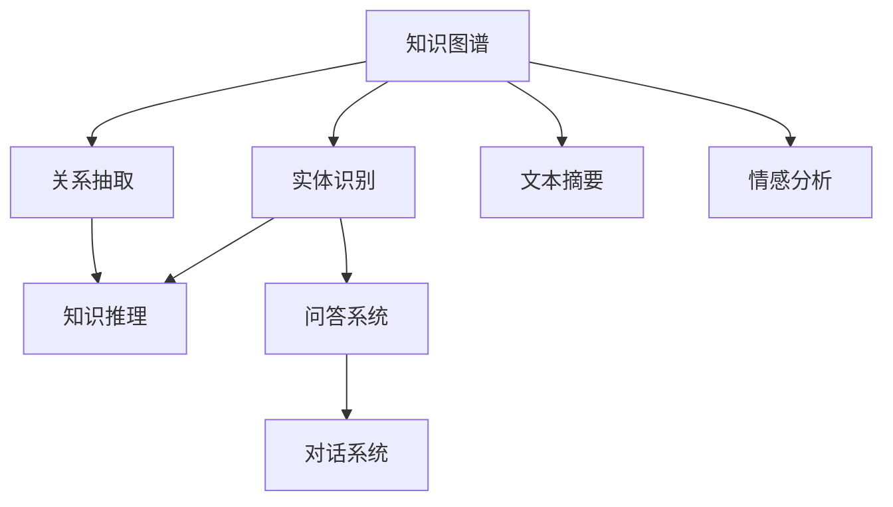

                 

# 知识发现引擎的自然语言处理技术

> 关键词：知识图谱, 自然语言处理(NLP), 问答系统, 文本摘要, 情感分析, 信息检索

## 1. 背景介绍

### 1.1 问题由来
随着互联网时代的到来，信息量呈爆炸式增长。如何从海量文本数据中挖掘出有价值的知识和信息，成为了当前智能信息处理领域的核心问题。知识发现(Knowledge Discovery)指的是从数据中发现有用知识和模式的过程，而自然语言处理(Natural Language Processing, NLP)则是处理和理解自然语言的技术，两者结合产生了知识发现引擎(Knowledge Discovery Engine, KDE)，即利用自然语言处理技术从文本中提取、组织、检索和生成知识，辅助用户发现和利用隐含在文本数据中的有用信息。

知识发现引擎能够解决传统信息检索系统的局限，其不仅能够提供精确的信息检索服务，还能通过语义理解和逻辑推理，帮助用户发现与查询相关的知识图谱(Knowledge Graph)节点和关系，进而进行深入分析。这种强大的知识融合能力使得KDE在教育、医疗、金融、情报等多个领域得到了广泛应用。

### 1.2 问题核心关键点
本节将介绍知识发现引擎中的自然语言处理技术，核心包括以下几个方面：

- 知识图谱的构建和维护：如何构建和维护结构化的知识图谱，以存储和表示文本数据中的实体和关系。
- 实体识别与关系抽取：如何从文本中识别出具体的实体和它们之间的关系，为后续的知识推理和应用奠定基础。
- 知识推理与融合：如何通过逻辑推理和融合多源知识，提升知识发现引擎的准确性和完备性。
- 问答系统与对话系统：如何构建能够理解自然语言问题，并返回准确答案的问答系统，或者实现与人自然交互的对话系统。
- 文本摘要与情感分析：如何从长文本中提炼出关键信息，并分析其情感倾向，为用户提供快速理解和判断的能力。

## 2. 核心概念与联系

### 2.1 核心概念概述

为更好地理解知识发现引擎中的自然语言处理技术，本节将介绍几个密切相关的核心概念：

- 知识图谱(Knowledge Graph)：一种结构化的语义表示，由节点和边组成，用于表示实体和它们之间的关系。
- 实体识别(Entity Recognition)：从文本中识别出具有特定意义的实体，如人名、地名、组织名等。
- 关系抽取(Relationship Extraction)：从文本中抽取实体之间的关系，如"张三与李四是同事"。
- 知识推理(Knowledge Reasoning)：利用逻辑规则和事实，进行推理得出新的知识，如"张三和李四都工作于XYZ公司"。
- 问答系统(Question Answering System)：能够理解自然语言问题，并返回准确答案的系统，如IBM的Watson。
- 对话系统(Chatbot)：能够与用户进行自然语言对话的系统，如微软的Bing Chat。
- 文本摘要(Text Summarization)：从长文本中提取出关键信息，生成简洁的摘要。
- 情感分析(Sentiment Analysis)：分析文本的情感倾向，判断其情绪正面、负面或中性。

这些核心概念之间的逻辑关系可以通过以下Mermaid流程图来展示：



这个流程图展示了知识图谱与其他核心概念的联系：

1. 知识图谱是其他NLP技术的基础，提供了实体和关系的基本信息。
2. 实体识别和关系抽取是构建知识图谱的关键环节，有助于知识图谱的丰富和完善。
3. 知识推理通过逻辑规则和事实，不断扩充和修正知识图谱，增强其准确性和完备性。
4. 问答系统和对话系统是知识图谱的直接应用，能够通过知识图谱提供精准的查询和对话服务。
5. 文本摘要和情感分析是文本数据预处理的关键技术，有助于提高后续NLP任务的效果。

## 3. 核心算法原理 & 具体操作步骤
### 3.1 算法原理概述

知识发现引擎中的自然语言处理技术，本质上是通过构建知识图谱，并在此基础上进行知识抽取、推理和应用的过程。其中，知识抽取和推理是核心部分，通过从文本中识别实体和关系，并通过逻辑推理获得新的知识。

具体地，知识抽取和推理的算法原理如下：

1. **实体识别**：通过自然语言处理技术，识别出文本中的实体，并将实体映射到知识图谱中的节点。这通常依赖于预训练的语言模型，如BERT、GPT等，通过序列标注任务进行实体识别。

2. **关系抽取**：抽取文本中实体之间的关系，如"张三与李四是同事"，这可以通过关系抽取模型（如TransE、RotatE等），结合语义和上下文信息，进行关系预测。

3. **知识推理**：在知识图谱中，根据已有的知识和规则，进行逻辑推理，生成新的知识。这可以通过基于规则的推理引擎、神经符号混合推理方法等进行。

4. **问答系统**：构建能够理解自然语言问题，并返回准确答案的系统。这依赖于检索和推理技术的结合，首先通过知识图谱检索相关知识，然后进行推理得出答案。

5. **对话系统**：通过多轮对话理解用户意图，并生成合适的回答。这依赖于对话管理模块和自然语言生成模块，结合上下文信息生成自然语言回复。

6. **文本摘要**：从长文本中提取出关键信息，生成简洁的摘要。这可以通过文本摘要模型（如BART、T5等），结合注意力机制和序列生成技术进行。

7. **情感分析**：分析文本的情感倾向，判断其情绪正面、负面或中性。这通常通过预训练的情感分类模型，结合情感词典和上下文信息进行。

### 3.2 算法步骤详解

知识发现引擎中的自然语言处理技术，通常包含以下几个关键步骤：

**Step 1: 构建和维护知识图谱**
- 定义知识图谱的节点和关系类型，设计本体论模型。
- 通过文本数据或已有的知识库，自动或手动创建节点和关系，并进行实体和关系抽取。
- 定期更新知识图谱，确保其时效性和准确性。

**Step 2: 数据预处理**
- 对原始文本数据进行清洗、分词、去停用词等预处理步骤，得到规范化的文本。
- 将文本转化为词向量表示，方便后续的NLP模型处理。

**Step 3: 实体识别与关系抽取**
- 使用预训练的语言模型，如BERT、GPT等，进行实体识别和关系抽取。
- 利用知识图谱中的已知信息，对模型输出进行进一步修正和补充。

**Step 4: 知识推理**
- 构建知识推理引擎，如基于规则的推理引擎、神经符号推理引擎等。
- 根据已有的知识和逻辑规则，对抽取出的实体和关系进行推理，生成新的知识。

**Step 5: 问答系统与对话系统**
- 构建问答系统，将自然语言问题映射到知识图谱中的查询，并通过推理引擎返回答案。
- 构建对话系统，通过多轮对话管理模块和自然语言生成模块，生成合适的回答。

**Step 6: 文本摘要与情感分析**
- 使用文本摘要模型，对长文本进行信息抽取和生成摘要。
- 使用情感分析模型，判断文本的情感倾向，进行情感分类。

### 3.3 算法优缺点

知识发现引擎中的自然语言处理技术，具有以下优点：
1. 高效性：通过构建知识图谱，可以快速检索和推理出相关知识，提升信息检索和问答的效率。
2. 准确性：结合实体识别和关系抽取，提升知识图谱的准确性，降低人工干预的频率。
3. 可扩展性：通过持续更新知识图谱和逻辑规则，不断提升系统的知识和推理能力。
4. 应用广泛：适用于问答、对话、文本摘要、情感分析等多个NLP领域，具有广泛的适用性。

同时，该技术也存在一些局限性：
1. 数据依赖：知识图谱的构建和维护依赖于高质量的文本数据和已有的知识库，数据获取和处理成本较高。
2. 推理复杂性：复杂的逻辑推理和推理引擎设计，增加了系统的实现难度和维护成本。
3. 知识偏见：知识图谱中的固有偏见和漏洞，可能影响系统的公正性和可靠性。
4. 可解释性不足：复杂的推理过程和模型黑盒特性，使得系统的解释性不足，难以调试和优化。

尽管存在这些局限性，但知识发现引擎中的自然语言处理技术，仍然是大规模文本数据处理和知识提取的重要工具，具有广阔的应用前景。

### 3.4 算法应用领域

知识发现引擎中的自然语言处理技术，在多个领域得到了广泛应用，例如：

- 问答系统：如IBM的Watson、微软的Azure Cognitive Services等，通过构建知识图谱，提供精准的自然语言问答服务。
- 对话系统：如谷歌的对话AI、微软的Bing Chat等，通过多轮对话理解用户意图，生成自然语言回复。
- 文本摘要：如Aqua、Preter等，从长文本中提炼出关键信息，生成简洁的摘要。
- 情感分析：如Affectiva、IBM Watson等，分析文本的情感倾向，判断其情绪正面、负面或中性。
- 信息检索：如Elasticsearch、Amazon Comprehend等，利用知识图谱进行更精准的信息检索。
- 智能推荐：如Amazon、Spotify等，通过分析用户兴趣和行为，进行个性化的信息推荐。

除了上述这些经典应用外，知识发现引擎中的自然语言处理技术，还被创新性地应用于社交网络分析、舆情监控、舆情分析等多个领域，为智能信息处理带来了新的突破。

## 4. 数学模型和公式 & 详细讲解
### 4.1 数学模型构建

本节将使用数学语言对知识发现引擎中的自然语言处理技术进行更加严格的刻画。

记文本数据为 $D=\{x_i\}_{i=1}^N$，其中 $x_i$ 为第 $i$ 个文本样本，表示为一个字符串。知识图谱中的实体为 $E$，关系为 $R$，节点和边之间的权重为 $W_{e_r}$。实体识别和关系抽取的目标是将文本 $x_i$ 中的实体 $e_i$ 和关系 $r_i$ 映射到知识图谱中的节点和边，即：

$$
\hat{e_i}, \hat{r_i} = \text{EntityRecognition}(x_i), \text{RelationshipExtraction}(x_i)
$$

其中 $\hat{e_i}$ 和 $\hat{r_i}$ 表示模型预测的实体和关系。

### 4.2 公式推导过程

以下我们以实体识别为例，推导基于BERT模型的实体识别模型。

假设实体识别任务为序列标注任务，其中每个实体用标签 $T$ 标记，即 $T=\{B-PER, I-PER, B-ORG, I-ORG, B-LOC, I-LOC\}$，其中 $B-PER$ 表示人名实体开始，$I-PER$ 表示人名实体中间，$B-ORG$ 表示组织名实体开始，$I-ORG$ 表示组织名实体中间，$B-LOC$ 表示地名实体开始，$I-LOC$ 表示地名实体中间。

使用BERT模型的序列标注任务模型 $M_{\theta}(x)$，其中 $\theta$ 为模型参数，$x$ 为输入文本。模型输出为：

$$
\text{Pred}(x) = \text{Softmax}(M_{\theta}(x))
$$

其中 $\text{Softmax}$ 为softmax函数，将模型输出转化为概率分布。实体识别任务的目标是最小化损失函数：

$$
\mathcal{L}(\theta) = -\frac{1}{N} \sum_{i=1}^N \sum_{t \in T} \log P_{\theta}(y_i=t|x_i)
$$

其中 $y_i$ 为第 $i$ 个样本的标签向量，$P_{\theta}(y_i=t|x_i)$ 为模型预测第 $i$ 个样本在标签 $t$ 上的概率。

通过最小化损失函数 $\mathcal{L}(\theta)$，训练模型参数 $\theta$，使得模型能够准确地标注出文本中的实体。

## 5. 项目实践：代码实例和详细解释说明
### 5.1 开发环境搭建

在进行知识发现引擎中的自然语言处理技术实践前，我们需要准备好开发环境。以下是使用Python进行SpaCy和HuggingFace Transformers库开发的环境配置流程：

1. 安装Anaconda：从官网下载并安装Anaconda，用于创建独立的Python环境。

2. 创建并激活虚拟环境：
```bash
conda create -n kde-env python=3.8 
conda activate kde-env
```

3. 安装必要的库：
```bash
conda install spacy transformers
```

4. 下载预训练模型：
```bash
python -m spacy download en_core_web_sm
python -m transformers download model --model_type bert --model_name bert-base-cased
```

完成上述步骤后，即可在`kde-env`环境中开始项目实践。

### 5.2 源代码详细实现

下面我们以命名实体识别(NER)任务为例，给出使用SpaCy和Transformers库对BERT模型进行实体识别的PyTorch代码实现。

首先，定义NER任务的训练数据集和标签：

```python
from spacy import displacy
from transformers import BertTokenizer, BertForTokenClassification
from torch.utils.data import Dataset, DataLoader

class NERDataset(Dataset):
    def __init__(self, texts, tags, tokenizer):
        self.texts = texts
        self.tags = tags
        self.tokenizer = tokenizer
        
    def __len__(self):
        return len(self.texts)
    
    def __getitem__(self, item):
        text = self.texts[item]
        tags = self.tags[item]
        
        encoding = self.tokenizer(text, return_tensors='pt', truncation=True)
        input_ids = encoding['input_ids'][0]
        attention_mask = encoding['attention_mask'][0]
        
        # 对token-wise的标签进行编码
        encoded_tags = [tag2id[tag] for tag in tags] 
        encoded_tags.extend([tag2id['O']] * (len(encoding['input_ids'][0]) - len(encoded_tags)))
        labels = torch.tensor(encoded_tags, dtype=torch.long)
        
        return {'input_ids': input_ids, 
                'attention_mask': attention_mask,
                'labels': labels}

# 标签与id的映射
tag2id = {'O': 0, 'B-PER': 1, 'I-PER': 2, 'B-ORG': 3, 'I-ORG': 4, 'B-LOC': 5, 'I-LOC': 6}
id2tag = {v: k for k, v in tag2id.items()}

# 创建dataset
tokenizer = BertTokenizer.from_pretrained('bert-base-cased')

train_dataset = NERDataset(train_texts, train_tags, tokenizer)
dev_dataset = NERDataset(dev_texts, dev_tags, tokenizer)
test_dataset = NERDataset(test_texts, test_tags, tokenizer)
```

然后，定义模型和优化器：

```python
from transformers import BertForTokenClassification, AdamW

model = BertForTokenClassification.from_pretrained('bert-base-cased', num_labels=len(tag2id))

optimizer = AdamW(model.parameters(), lr=2e-5)
```

接着，定义训练和评估函数：

```python
from tqdm import tqdm
from sklearn.metrics import classification_report

device = torch.device('cuda') if torch.cuda.is_available() else torch.device('cpu')
model.to(device)

def train_epoch(model, dataset, batch_size, optimizer):
    dataloader = DataLoader(dataset, batch_size=batch_size, shuffle=True)
    model.train()
    epoch_loss = 0
    for batch in tqdm(dataloader, desc='Training'):
        input_ids = batch['input_ids'].to(device)
        attention_mask = batch['attention_mask'].to(device)
        labels = batch['labels'].to(device)
        model.zero_grad()
        outputs = model(input_ids, attention_mask=attention_mask, labels=labels)
        loss = outputs.loss
        epoch_loss += loss.item()
        loss.backward()
        optimizer.step()
    return epoch_loss / len(dataloader)

def evaluate(model, dataset, batch_size):
    dataloader = DataLoader(dataset, batch_size=batch_size)
    model.eval()
    preds, labels = [], []
    with torch.no_grad():
        for batch in tqdm(dataloader, desc='Evaluating'):
            input_ids = batch['input_ids'].to(device)
            attention_mask = batch['attention_mask'].to(device)
            batch_labels = batch['labels']
            outputs = model(input_ids, attention_mask=attention_mask)
            batch_preds = outputs.logits.argmax(dim=2).to('cpu').tolist()
            batch_labels = batch_labels.to('cpu').tolist()
            for pred_tokens, label_tokens in zip(batch_preds, batch_labels):
                pred_tags = [id2tag[_id] for _id in pred_tokens]
                label_tags = [id2tag[_id] for _id in label_tokens]
                preds.append(pred_tags[:len(label_tags)])
                labels.append(label_tags)
                
    print(classification_report(labels, preds))
```

最后，启动训练流程并在测试集上评估：

```python
epochs = 5
batch_size = 16

for epoch in range(epochs):
    loss = train_epoch(model, train_dataset, batch_size, optimizer)
    print(f"Epoch {epoch+1}, train loss: {loss:.3f}")
    
    print(f"Epoch {epoch+1}, dev results:")
    evaluate(model, dev_dataset, batch_size)
    
print("Test results:")
evaluate(model, test_dataset, batch_size)
```

以上就是使用PyTorch对BERT进行命名实体识别任务实体识别的完整代码实现。可以看到，得益于SpaCy和Transformers库的强大封装，我们可以用相对简洁的代码完成BERT模型的加载和实体识别。

### 5.3 代码解读与分析

让我们再详细解读一下关键代码的实现细节：

**NERDataset类**：
- `__init__`方法：初始化文本、标签、分词器等关键组件。
- `__len__`方法：返回数据集的样本数量。
- `__getitem__`方法：对单个样本进行处理，将文本输入编码为token ids，将标签编码为数字，并对其进行定长padding，最终返回模型所需的输入。

**tag2id和id2tag字典**：
- 定义了标签与数字id之间的映射关系，用于将token-wise的预测结果解码回真实的标签。

**训练和评估函数**：
- 使用PyTorch的DataLoader对数据集进行批次化加载，供模型训练和推理使用。
- 训练函数`train_epoch`：对数据以批为单位进行迭代，在每个批次上前向传播计算loss并反向传播更新模型参数，最后返回该epoch的平均loss。
- 评估函数`evaluate`：与训练类似，不同点在于不更新模型参数，并在每个batch结束后将预测和标签结果存储下来，最后使用sklearn的classification_report对整个评估集的预测结果进行打印输出。

**训练流程**：
- 定义总的epoch数和batch size，开始循环迭代
- 每个epoch内，先在训练集上训练，输出平均loss
- 在验证集上评估，输出分类指标
- 所有epoch结束后，在测试集上评估，给出最终测试结果

可以看到，PyTorch配合SpaCy和Transformers库使得BERT实体识别的代码实现变得简洁高效。开发者可以将更多精力放在数据处理、模型改进等高层逻辑上，而不必过多关注底层的实现细节。

当然，工业级的系统实现还需考虑更多因素，如模型的保存和部署、超参数的自动搜索、更灵活的任务适配层等。但核心的实体识别范式基本与此类似。

## 6. 实际应用场景
### 6.1 智能客服系统

基于知识图谱的自然语言处理技术，可以广泛应用于智能客服系统的构建。传统客服往往需要配备大量人力，高峰期响应缓慢，且一致性和专业性难以保证。而使用知识图谱驱动的客服系统，可以7x24小时不间断服务，快速响应客户咨询，用自然流畅的语言解答各类常见问题。

在技术实现上，可以收集企业内部的历史客服对话记录，将问题和最佳答复构建成监督数据，在此基础上对知识图谱进行构建和维护。同时，构建问答系统，对自然语言问题进行检索和推理，生成合适的回答。对于客户提出的新问题，还可以接入检索系统实时搜索相关内容，动态组织生成回答。如此构建的智能客服系统，能大幅提升客户咨询体验和问题解决效率。

### 6.2 金融舆情监测

金融机构需要实时监测市场舆论动向，以便及时应对负面信息传播，规避金融风险。传统的人工监测方式成本高、效率低，难以应对网络时代海量信息爆发的挑战。基于知识图谱的自然语言处理技术，为金融舆情监测提供了新的解决方案。

具体而言，可以收集金融领域相关的新闻、报道、评论等文本数据，并对其进行主题标注和情感标注。在此基础上构建知识图谱，进行实体识别和关系抽取，构建舆情监测系统。系统能够实时抓取网络文本数据，自动监测不同主题下的情感变化趋势，一旦发现负面信息激增等异常情况，系统便会自动预警，帮助金融机构快速应对潜在风险。

### 6.3 个性化推荐系统

当前的推荐系统往往只依赖用户的历史行为数据进行物品推荐，无法深入理解用户的真实兴趣偏好。基于知识图谱的自然语言处理技术，个性化推荐系统可以更好地挖掘用户行为背后的语义信息，从而提供更精准、多样的推荐内容。

在实践中，可以收集用户浏览、点击、评论、分享等行为数据，提取和用户交互的物品标题、描述、标签等文本内容。将文本内容作为模型输入，用户的后续行为（如是否点击、购买等）作为监督信号，在此基础上构建知识图谱。微调预训练语言模型，使其能够从文本内容中准确把握用户的兴趣点。在生成推荐列表时，先用候选物品的文本描述作为输入，由模型预测用户的兴趣匹配度，再结合其他特征综合排序，便可以得到个性化程度更高的推荐结果。

### 6.4 未来应用展望

随着知识图谱和自然语言处理技术的不断发展，基于知识图谱的自然语言处理技术将呈现以下几个发展趋势：

1. 实体识别和关系抽取的准确性将不断提高，知识图谱的构建和维护将更加自动化和智能化。
2. 知识推理技术将更加复杂和高效，能够处理更多复杂的逻辑推理任务。
3. 知识图谱和文本数据将更加紧密结合，实现跨领域和跨模态的融合。
4. 问答系统和对话系统将更加智能和人性化，能够理解更复杂的自然语言表达。
5. 文本摘要和情感分析技术将更加精确和全面，能够更高效地从文本中提取关键信息和情感倾向。
6. 知识图谱的应用将更加广泛，涵盖医疗、教育、交通等多个领域，为智能决策提供更全面的支持。

以上趋势凸显了知识发现引擎中自然语言处理技术的广阔前景。这些方向的探索发展，必将进一步提升智能信息处理的精度和效率，为人类认知智能的进化带来深远影响。

## 7. 工具和资源推荐
### 7.1 学习资源推荐

为了帮助开发者系统掌握知识发现引擎中的自然语言处理技术的理论基础和实践技巧，这里推荐一些优质的学习资源：

1. 《自然语言处理综论》系列博文：由知识图谱领域的专家撰写，深入浅出地介绍了自然语言处理的基本概念和技术。

2. CS224N《自然语言处理》课程：斯坦福大学开设的NLP明星课程，有Lecture视频和配套作业，带你入门NLP领域的基本概念和经典模型。

3. 《深度学习与自然语言处理》书籍：该书详细介绍了深度学习在自然语言处理中的应用，包括实体识别、关系抽取、问答系统等多个方向。

4. HuggingFace官方文档：SpaCy和Transformers库的官方文档，提供了海量预训练模型和完整的自然语言处理样例代码，是上手实践的必备资料。

5. Arxiv论文：知识图谱和自然语言处理领域的最新研究成果，涵盖实体识别、关系抽取、问答系统等多个方向。

通过对这些资源的学习实践，相信你一定能够快速掌握知识发现引擎中的自然语言处理技术的精髓，并用于解决实际的智能信息处理问题。
###  7.2 开发工具推荐

高效的开发离不开优秀的工具支持。以下是几款用于知识发现引擎中自然语言处理技术开发的常用工具：

1. PyTorch：基于Python的开源深度学习框架，灵活动态的计算图，适合快速迭代研究。大部分预训练语言模型都有PyTorch版本的实现。

2. TensorFlow：由Google主导开发的开源深度学习框架，生产部署方便，适合大规模工程应用。同样有丰富的预训练语言模型资源。

3. SpaCy：一个用于工业级的自然语言处理库，提供了丰富的文本处理功能，如分词、词性标注、实体识别等。

4. HuggingFace Transformers库：提供了丰富的预训练语言模型和自然语言处理任务，方便快速搭建自然语言处理系统。

5. ELKI：一个基于Java的自然语言处理库，提供了丰富的NLP算法和工具，如实体识别、关系抽取、情感分析等。

合理利用这些工具，可以显著提升知识发现引擎中自然语言处理技术的开发效率，加快创新迭代的步伐。

### 7.3 相关论文推荐

知识发现引擎中的自然语言处理技术的发展源于学界的持续研究。以下是几篇奠基性的相关论文，推荐阅读：

1. "Knowledge-Base Populated Question Answering"：提出了基于知识图谱的问答系统，展示了知识图谱在问答系统中的应用效果。

2. "Bidirectional RNN Architectures for Large-Scale Adaptive Real-Time Named Entity Recognition"：提出双向RNN架构，显著提升了实体识别的准确性，是NLP领域经典论文之一。

3. "Hierarchical Softmax: A Network-Learning Approach to Knowledge Base Populated Question Answering"：提出层次化Softmax算法，提高了知识图谱驱动的问答系统的效率和效果。

4. "A Survey of Relation Extraction Methods"：全面综述了关系抽取方法，涵盖了基于规则、基于模型和混合方法等多个方向。

5. "Natural Language Processing (NLP) Basics"：详细介绍了自然语言处理的基本概念和技术，适合入门学习。

这些论文代表了大语言模型微调技术的发展脉络。通过学习这些前沿成果，可以帮助研究者把握学科前进方向，激发更多的创新灵感。

## 8. 总结：未来发展趋势与挑战

### 8.1 总结

本文对知识发现引擎中的自然语言处理技术进行了全面系统的介绍。首先阐述了知识图谱和自然语言处理技术的背景和意义，明确了知识图谱在大规模文本数据处理和知识提取中的核心作用。其次，从原理到实践，详细讲解了实体识别、关系抽取、知识推理等关键技术的数学模型和算法流程，给出了自然语言处理任务的代码实例。同时，本文还探讨了知识图谱在问答系统、对话系统、文本摘要、情感分析等多个NLP领域的应用前景，展示了自然语言处理技术的广泛适用性。此外，本文精选了自然语言处理技术的各类学习资源，力求为读者提供全方位的技术指引。

通过本文的系统梳理，可以看到，知识图谱和自然语言处理技术正在成为智能信息处理的重要工具，为大规模文本数据处理和知识提取提供了新的解决方案。知识图谱的构建和维护、自然语言处理模型的训练和推理，是实现智能信息处理的关键环节。只有掌握这些核心技术，才能构建高效、可靠、可解释的知识发现引擎，实现对文本数据的深度挖掘和知识融合。

### 8.2 未来发展趋势

展望未来，知识图谱和自然语言处理技术将呈现以下几个发展趋势：

1. 知识图谱的构建和维护将更加自动化和智能化。随着深度学习和知识图谱技术的不断发展，自动化的实体识别和关系抽取技术将更加成熟，知识图谱的构建和维护将更加高效。

2. 知识推理技术将更加复杂和高效。复杂的逻辑推理和推理引擎设计，能够处理更多复杂的逻辑推理任务，提升知识图谱的准确性和完备性。

3. 知识图谱和文本数据将更加紧密结合，实现跨领域和跨模态的融合。知识图谱和文本数据的融合，将使知识图谱更加丰富和全面，提升智能信息处理的精度和效率。

4. 问答系统和对话系统将更加智能和人性化。通过自然语言理解技术的提升，问答系统和对话系统将能够理解更复杂的自然语言表达，生成更自然、准确的回复。

5. 文本摘要和情感分析技术将更加精确和全面，能够更高效地从文本中提取关键信息和情感倾向。文本摘要和情感分析技术的发展，将使文本数据处理更加高效和全面。

6. 知识图谱的应用将更加广泛，涵盖医疗、教育、交通等多个领域，为智能决策提供更全面的支持。知识图谱的广泛应用，将进一步提升智能信息处理的效果和应用范围。

以上趋势凸显了知识图谱和自然语言处理技术的广阔前景。这些方向的探索发展，必将进一步提升智能信息处理的精度和效率，为人类认知智能的进化带来深远影响。

### 8.3 面临的挑战

尽管知识图谱和自然语言处理技术已经取得了瞩目成就，但在迈向更加智能化、普适化应用的过程中，仍面临诸多挑战：

1. 数据获取和标注成本高。知识图谱的构建和维护依赖于高质量的文本数据和已有的知识库，数据获取和处理成本较高。如何降低数据标注成本，提高数据质量，是知识图谱发展的关键。

2. 知识图谱的扩展性不足。现有的知识图谱规模和结构还存在局限，难以覆盖更广泛的领域和更复杂的关系。如何构建更加灵活、可扩展的知识图谱，是知识图谱发展的方向。

3. 知识图谱的鲁棒性不足。知识图谱中的固有偏见和漏洞，可能影响系统的公正性和可靠性。如何构建鲁棒的知识图谱，减少偏见和错误，是知识图谱发展的重点。

4. 推理过程中的复杂性和可解释性不足。复杂的推理过程和模型黑盒特性，使得系统的解释性不足，难以调试和优化。如何提升知识推理的可解释性，是知识图谱发展的难题。

5. 知识图谱的应用效果评估困难。如何构建有效的知识图谱评估指标，衡量知识图谱的质量和效果，是知识图谱发展的关键。

尽管存在这些挑战，但知识图谱和自然语言处理技术仍然是大规模文本数据处理和知识提取的重要工具，具有广阔的应用前景。相信随着学界和产业界的共同努力，这些挑战终将一一被克服，知识图谱和自然语言处理技术必将在构建智能信息处理系统方面发挥更大的作用。

### 8.4 研究展望

面对知识图谱和自然语言处理技术面临的挑战，未来的研究需要在以下几个方面寻求新的突破：

1. 探索半监督和无监督的实体识别和关系抽取方法。摆脱对大规模标注数据的依赖，利用自监督学习、主动学习等无监督和半监督范式，最大限度利用非结构化数据，实现更加灵活高效的实体识别和关系抽取。

2. 研究知识图谱的自动化构建和维护技术。开发自动化的实体识别和关系抽取工具，构建高质量的知识图谱。同时，研究知识图谱的自动化更新和维护技术，保证知识图谱的时效性和准确性。

3. 融合因果推断和对比学习范式。通过引入因果推断和对比学习思想，增强知识推理的稳定性和泛化能力，学习更加普适、鲁棒的语言表征。

4. 引入更多先验知识。将符号化的先验知识，如知识图谱、逻辑规则等，与神经网络模型进行巧妙融合，引导知识推理过程学习更准确、合理的语言模型。

5. 结合因果分析和博弈论工具。将因果分析方法引入知识推理引擎，识别出知识推理的关键特征，增强输出解释的因果性和逻辑性。借助博弈论工具刻画人机交互过程，主动探索并规避知识推理的脆弱点，提高系统稳定性。

6. 纳入伦理道德约束。在知识图谱构建和推理过程中，纳入伦理导向的评估指标，过滤和惩罚有偏见、有害的输出倾向。同时加强人工干预和审核，建立知识图谱的监管机制，确保输出符合人类价值观和伦理道德。

这些研究方向的探索，必将引领知识图谱和自然语言处理技术迈向更高的台阶，为构建安全、可靠、可解释、可控的智能系统铺平道路。面向未来，知识图谱和自然语言处理技术还需要与其他人工智能技术进行更深入的融合，如知识表示、因果推理、强化学习等，多路径协同发力，共同推动智能信息处理系统的进步。只有勇于创新、敢于突破，才能不断拓展知识图谱的边界，让智能技术更好地造福人类社会。

## 9. 附录：常见问题与解答

**Q1：知识图谱的构建和维护有哪些关键步骤？**

A: 知识图谱的构建和维护主要包括以下几个关键步骤：
1. 定义知识图谱的节点和关系类型，设计本体论模型。
2. 通过文本数据或已有的知识库，自动或手动创建节点和关系，并进行实体和关系抽取。
3. 定期更新知识图谱，确保其时效性和准确性。

**Q2：实体识别和关系抽取常用的预训练语言模型有哪些？**

A: 常用的预训练语言模型包括BERT、GPT、XLNet等。这些模型在序列标注任务上表现出色，可以用于实体识别和关系抽取。

**Q3：知识推理过程中常用的推理引擎有哪些？**

A: 常用的知识推理引擎包括规则引擎、基于符号的推理引擎、神经符号混合推理引擎等。这些引擎各有优缺点，需要根据具体任务选择合适的方法。

**Q4：问答系统和对话系统如何与知识图谱结合？**

A: 问答系统和对话系统可以通过查询和推理引擎，从知识图谱中检索和推理相关知识，并生成合适的回答。对话系统还需要加入多轮对话管理模块和自然语言生成模块，生成自然语言回复。

**Q5：知识图谱的应用有哪些？**

A: 知识图谱的应用非常广泛，包括问答系统、对话系统、文本摘要、情感分析、信息检索等多个领域。在知识图谱的帮助下，这些应用能够提供更加精准、全面的信息服务。

**Q6：知识图谱的应用效果如何评估？**

A: 知识图谱的应用效果可以通过多个指标进行评估，如精确度、召回率、F1分数、MRR等。同时，还需要考虑知识图谱的完整性、及时性和覆盖度等，进行综合评估。

---

作者：禅与计算机程序设计艺术 / Zen and the Art of Computer Programming

