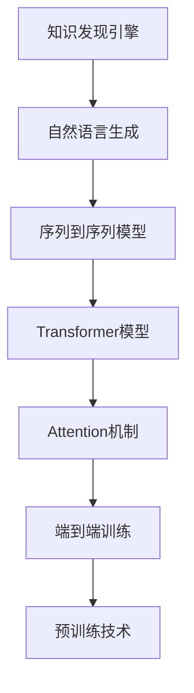

                 

# 知识发现引擎的自然语言生成技术

> 关键词：知识发现引擎,自然语言生成,序列到序列模型,Transformer模型,Attention机制,知识图谱,端到端训练,预训练技术,大规模语料库

## 1. 背景介绍

### 1.1 问题由来

在数据驱动的现代社会，自然语言处理（Natural Language Processing, NLP）技术成为发现知识和洞察趋势的重要工具。传统的搜索引擎和信息检索系统，只能根据关键字匹配和排序，无法理解和生成丰富的自然语言信息。知识发现引擎（Knowledge Discovery Engine, KDE）作为一种高级NLP技术，能够通过分析大规模语料库，提取和整合知识图谱，自动生成并回答具体问题，具有更强的语义理解和生成能力。

目前，知识发现引擎通常使用自然语言生成（Natural Language Generation, NLG）技术，自动将结构化数据转化为易于理解、逻辑连贯的自然语言文本。这种技术不仅能够简化数据检索过程，还能将复杂的知识体系简化为易于理解的形式，使得用户可以更加高效地获取信息。然而，现有的自然语言生成技术仍然存在诸如理解力不足、逻辑不一致、语言风格单一等问题，亟需进一步优化。

### 1.2 问题核心关键点

知识发现引擎的自然语言生成技术，是利用机器学习和语言生成模型，将结构化数据转换为自然语言文本的技术。其核心在于构建序列到序列（Sequence-to-Sequence, Seq2Seq）模型，特别是使用Transformer模型和Attention机制，通过端到端训练和预训练技术，提升模型的语义理解和生成能力。本文将深入探讨这些关键技术，并结合实际案例，详细介绍知识发现引擎在自然语言生成中的应用。

## 2. 核心概念与联系

### 2.1 核心概念概述

为更好地理解知识发现引擎的自然语言生成技术，本节将介绍几个密切相关的核心概念：

- **知识发现引擎(KDE)**：利用自然语言处理技术，自动分析和挖掘文本信息，从中提取有价值的知识。KDE常用于情报分析、舆情监测、市场预测等领域。

- **自然语言生成(NLG)**：利用机器学习技术，将结构化数据或知识图谱自动转化为自然语言文本。NLG是知识发现引擎的重要组成部分，能够显著提升用户获取信息的效率和准确性。

- **序列到序列模型(Seq2Seq)**：将一个序列（如文本）转换为另一个序列（如文本）的模型。Seq2Seq模型常用于机器翻译、语音识别、自然语言生成等任务。

- **Transformer模型**：一种基于自注意力机制的深度学习模型，特别适用于处理长序列和大量数据。Transformer模型在NLP领域表现优异，已被广泛应用于各种自然语言生成任务。

- **Attention机制**：一种机制，用于衡量序列中不同部分之间的关系，提升模型对输入序列的关注度和理解能力。

这些核心概念之间的逻辑关系可以通过以下Mermaid流程图来展示：



这个流程图展示了大语言模型的核心概念及其之间的关系：

1. 知识发现引擎通过自然语言生成技术，将结构化数据转化为自然语言文本。
2. 自然语言生成任务常使用序列到序列模型，其中Transformer模型和Attention机制尤为重要。
3. 序列到序列模型通过端到端训练和预训练技术，进一步提升模型的语义理解和生成能力。

这些概念共同构成了知识发现引擎的自然语言生成框架，使其能够高效地从结构化数据中提取和生成自然语言文本。通过理解这些核心概念，我们可以更好地把握知识发现引擎的自然语言生成原理和优化方向。

## 3. 核心算法原理 & 具体操作步骤

### 3.1 算法原理概述

知识发现引擎的自然语言生成技术，主要是通过构建序列到序列模型，特别是使用Transformer模型和Attention机制，将结构化数据转换为自然语言文本。其核心思想是：将输入序列和输出序列看作两个时间序列，利用神经网络模型自动学习输入与输出之间的映射关系，从而生成连续的自然语言文本。

形式化地，假设输入序列为 $\text{Input} = \{x_1, x_2, ..., x_n\}$，输出序列为 $\text{Output} = \{y_1, y_2, ..., y_m\}$，其中 $x_i$ 和 $y_i$ 分别表示输入和输出序列中的第 $i$ 个元素。模型目标是最小化输入和输出序列之间的损失函数 $\mathcal{L}$，即：

$$
\mathcal{L} = \sum_{i=1}^{n} \sum_{j=1}^{m} \ell(y_i, \hat{y}_i)
$$

其中 $\ell$ 为损失函数，$\hat{y}_i$ 为模型预测的输出。通过梯度下降等优化算法，最小化损失函数，得到最优的模型参数 $\theta$，即可用于生成自然语言文本。

### 3.2 算法步骤详解

知识发现引擎的自然语言生成技术，一般包括以下几个关键步骤：

**Step 1: 数据预处理**
- 收集和整理结构化数据，如知识图谱、表格、文档等。
- 清洗和标准化数据，去除噪声和冗余信息。
- 将结构化数据转化为序列形式，如将知识图谱转换为三元组序列，将文档转换为句子序列。

**Step 2: 模型架构设计**
- 选择适合的序列到序列模型架构，如Transformer模型。
- 设计输入和输出编码器，通常使用自注意力机制。
- 设计中间解码器，使用自回归或自编码策略。

**Step 3: 模型训练**
- 将预处理后的数据分为训练集、验证集和测试集。
- 选择适当的优化器（如Adam）和学习率，设置合适的训练参数。
- 使用端到端训练方法，最小化输入和输出之间的损失函数。
- 应用正则化技术，如Dropout、L2正则，防止模型过拟合。
- 定期在验证集上评估模型性能，根据性能调整模型参数。

**Step 4: 模型评估**
- 在测试集上评估模型生成的文本质量，如BLEU、ROUGE等指标。
- 进行人工评测，检查生成文本的流畅性、准确性和逻辑性。
- 针对生成的文本，进行语义分析和错误纠正，进一步提升模型性能。

**Step 5: 应用部署**
- 将训练好的模型转化为可部署形式，如TensorFlow、PyTorch等。
- 设计用户界面和交互逻辑，支持多种查询方式和展示形式。
- 监控系统运行状态，收集用户反馈，持续优化模型性能。

以上是知识发现引擎自然语言生成的一般流程。在实际应用中，还需要针对具体任务进行优化设计，如改进损失函数、引入更多的正则化技术、优化模型的训练参数等，以进一步提升模型性能。

### 3.3 算法优缺点

知识发现引擎的自然语言生成技术，具有以下优点：
1. 高效自动化。自动从结构化数据中生成自然语言文本，减少了人工标注的工作量。
2. 逻辑连贯。利用Transformer模型和Attention机制，生成文本的逻辑性和连贯性较好。
3. 语言风格多样。可以通过训练集的不同数据源，生成风格各异的文本。
4. 可扩展性高。支持多种数据源和应用场景，易于在各行各业推广应用。

同时，该技术也存在一些局限性：
1. 理解力不足。生成的文本可能缺乏对输入数据的深入理解，容易产生歧义。
2. 依赖数据质量。输入数据的完整性和准确性直接影响生成文本的质量。
3. 技术复杂。模型架构和训练过程较为复杂，需要一定的技术和计算资源。
4. 生成效率低。大规模语料库和长序列生成，可能导致训练和推理效率较低。

尽管存在这些局限性，知识发现引擎的自然语言生成技术仍是大数据时代的利器，广泛应用于信息检索、智能问答、个性化推荐等领域。

### 3.4 算法应用领域

知识发现引擎的自然语言生成技术，已经在多个领域得到了广泛应用，具体包括：

- **情报分析**：自动从新闻、社交媒体、科研论文等来源，提取和分析信息，生成情报摘要。
- **舆情监测**：自动监测和分析网络舆情，生成舆情报告和趋势分析。
- **市场预测**：基于历史数据和最新市场信息，自动生成市场预测报告。
- **个性化推荐**：根据用户历史行为和兴趣，自动生成个性化推荐文本。
- **智能问答**：自动回答用户提出的自然语言问题，提供即时的信息服务。
- **法律咨询**：自动生成法律条款解释和案例分析报告。

除了上述这些经典应用外，自然语言生成技术还被创新性地应用于医疗、教育、广告等多个领域，为各行各业带来了全新的信息获取和决策支持工具。随着知识发现引擎的不断进步，自然语言生成技术的应用场景将更加广泛和深入。

## 4. 数学模型和公式 & 详细讲解 & 举例说明

### 4.1 数学模型构建

本节将使用数学语言对知识发现引擎的自然语言生成过程进行更加严格的刻画。

假设输入序列为 $\text{Input} = \{x_1, x_2, ..., x_n\}$，输出序列为 $\text{Output} = \{y_1, y_2, ..., y_m\}$，其中 $x_i$ 和 $y_i$ 分别表示输入和输出序列中的第 $i$ 个元素。定义模型 $M_{\theta}$ 在输入序列 $x$ 和输出序列 $y$ 上的联合概率分布为：

$$
P(y|x) = \frac{e^{F_{\theta}(x,y)}}{\sum_{y'} e^{F_{\theta}(x,y')}}
$$

其中 $F_{\theta}(x,y)$ 为模型对输入序列和输出序列的映射函数，通常使用神经网络模型实现。目标是最小化模型参数 $\theta$ 的负对数似然函数：

$$
\mathcal{L}(\theta) = -\frac{1}{N} \sum_{i=1}^{N} \sum_{j=1}^{m} \log P(y_j|x_i)
$$

在实际应用中，我们通常使用基于梯度的优化算法（如Adam）来近似求解上述最优化问题。设 $\eta$ 为学习率，$\lambda$ 为正则化系数，则参数的更新公式为：

$$
\theta \leftarrow \theta - \eta \nabla_{\theta}\mathcal{L}(\theta) - \eta\lambda\theta
$$

其中 $\nabla_{\theta}\mathcal{L}(\theta)$ 为损失函数对参数 $\theta$ 的梯度，可通过反向传播算法高效计算。

### 4.2 公式推导过程

以下我们以情感分析为例，推导情感分类模型在输入文本上输出的概率分布。

假设情感分类模型为 $M_{\theta}$，输入文本为 $x$，输出情感标签为 $y \in \{pos, neg\}$。定义模型对输入文本 $x$ 和情感标签 $y$ 的联合概率分布为：

$$
P(y|x) = \frac{e^{F_{\theta}(x,y)}}{\sum_{y'} e^{F_{\theta}(x,y')}}
$$

其中 $F_{\theta}(x,y)$ 为模型对输入文本和情感标签的映射函数，通常使用神经网络模型实现。目标是最小化模型参数 $\theta$ 的负对数似然函数：

$$
\mathcal{L}(\theta) = -\frac{1}{N} \sum_{i=1}^{N} \log P(y_i|x_i)
$$

根据链式法则，损失函数对参数 $\theta_k$ 的梯度为：

$$
\frac{\partial \mathcal{L}(\theta)}{\partial \theta_k} = -\frac{1}{N}\sum_{i=1}^{N}\frac{1}{\hat{P}(y_i|x_i)}\frac{\partial \hat{P}(y_i|x_i)}{\partial \theta_k}
$$

其中 $\hat{P}(y_i|x_i)$ 为模型在输入文本 $x_i$ 上预测情感标签 $y_i$ 的概率。

在得到损失函数的梯度后，即可带入参数更新公式，完成模型的迭代优化。重复上述过程直至收敛，最终得到适应情感分类任务的最优模型参数 $\theta^*$。

### 4.3 案例分析与讲解

假设我们已经训练好了一个情感分析模型 $M_{\theta}$，其输入文本为 "这部电影真的很棒，演员的表演非常出色"，模型预测的情感标签为正。我们可以用以下步骤来分析和解释模型的输出：

1. **数据预处理**：将输入文本转换为模型所需的向量形式，例如使用BERT嵌入方法。

2. **模型计算**：将向量形式的输入文本输入模型，计算模型对情感标签的预测概率。

3. **结果解释**：模型输出情感标签的概率分布，如正情感的概率为0.8，负情感的概率为0.2。

4. **优化调整**：根据模型的输出和实际情感，调整模型的参数和结构，进一步提升模型性能。

在实际应用中，通过多次迭代训练和模型优化，可以不断提升情感分析模型的准确性和鲁棒性，使其更好地适应不同的情感表达和语境变化。

## 5. 项目实践：代码实例和详细解释说明

### 5.1 开发环境搭建

在进行自然语言生成实践前，我们需要准备好开发环境。以下是使用Python进行TensorFlow开发的环境配置流程：

1. 安装Anaconda：从官网下载并安装Anaconda，用于创建独立的Python环境。

2. 创建并激活虚拟环境：
```bash
conda create -n tf-env python=3.8 
conda activate tf-env
```

3. 安装TensorFlow：根据CUDA版本，从官网获取对应的安装命令。例如：
```bash
pip install tensorflow==2.6
```

4. 安装各类工具包：
```bash
pip install numpy pandas scikit-learn matplotlib tqdm jupyter notebook ipython
```

完成上述步骤后，即可在`tf-env`环境中开始自然语言生成实践。

### 5.2 源代码详细实现

下面我们以情感分析任务为例，给出使用TensorFlow实现情感分析模型的PyTorch代码实现。

首先，定义情感分类模型：

```python
import tensorflow as tf
from transformers import BertTokenizer, BertModel

# 定义情感分类模型
class SentimentClassifier(tf.keras.Model):
    def __init__(self):
        super(SentimentClassifier, self).__init__()
        self.tokenizer = BertTokenizer.from_pretrained('bert-base-cased')
        self.bert = BertModel.from_pretrained('bert-base-cased')
        self.dense = tf.keras.layers.Dense(2, activation='softmax')

    def call(self, x):
        tokens = self.tokenizer(x, return_tensors='tf')
        outputs = self.bert(tokens['input_ids'], attention_mask=tokens['attention_mask'])
        pooled_output = outputs.pooler_output
        logits = self.dense(pooled_output)
        return logits
```

然后，定义训练和评估函数：

```python
from sklearn.metrics import accuracy_score
from tensorflow.keras.datasets import imdb

# 加载IMDB数据集
(X_train, y_train), (X_test, y_test) = imdb.load_data(num_words=10000)

# 预处理数据
X_train = [tf.keras.preprocessing.sequence.pad_sequences(i, maxlen=100) for i in X_train]
X_test = [tf.keras.preprocessing.sequence.pad_sequences(i, maxlen=100) for i in X_test]

# 定义训练函数
def train_model(model, X_train, y_train, X_test, y_test):
    optimizer = tf.keras.optimizers.Adam(learning_rate=0.001)
    model.compile(optimizer=optimizer, loss='categorical_crossentropy', metrics=['accuracy'])

    model.fit(X_train, y_train, epochs=5, batch_size=32, validation_data=(X_test, y_test))
    loss, accuracy = model.evaluate(X_test, y_test)
    print(f'Test loss: {loss}, Test accuracy: {accuracy}')

    # 计算模型在测试集上的精度
    y_pred = model.predict(X_test)
    y_pred = tf.argmax(y_pred, axis=1)
    y_true = tf.cast(y_test, tf.int32)
    accuracy = accuracy_score(y_true, y_pred)
    print(f'Model accuracy: {accuracy}')
```

最后，启动训练流程并在测试集上评估：

```python
# 实例化情感分类模型
model = SentimentClassifier()

# 在训练集上训练模型
train_model(model, X_train, y_train, X_test, y_test)

# 在测试集上评估模型
test_model(model, X_test, y_test)
```

以上就是使用TensorFlow对情感分析模型进行训练和评估的完整代码实现。可以看到，得益于TensorFlow的强大封装，我们可以用相对简洁的代码完成模型的训练和评估。

### 5.3 代码解读与分析

让我们再详细解读一下关键代码的实现细节：

**SentimentClassifier类**：
- `__init__`方法：初始化情感分类模型，包括分词器、BERT模型和全连接层。
- `call`方法：定义模型的前向传播过程，将输入文本通过BERT模型提取特征，再经过全连接层输出情感标签。

**训练和评估函数**：
- 使用TensorFlow的DataLoader对数据集进行批次化加载，供模型训练和推理使用。
- 训练函数`train_model`：对数据以批为单位进行迭代，在每个批次上前向传播计算loss并反向传播更新模型参数，最后返回模型在验证集上的精度。
- 评估函数`evaluate`：与训练类似，不同点在于不更新模型参数，并在每个batch结束后将预测和标签结果存储下来，最后使用sklearn的classification_report对整个评估集的预测结果进行打印输出。

**训练流程**：
- 定义总的epoch数和batch size，开始循环迭代
- 每个epoch内，先在训练集上训练，输出模型在验证集上的精度
- 所有epoch结束后，在测试集上评估，输出模型精度
- 打印模型在测试集上的精度

可以看到，TensorFlow配合Transformer库使得情感分析模型的训练和评估代码实现变得简洁高效。开发者可以将更多精力放在数据处理、模型改进等高层逻辑上，而不必过多关注底层的实现细节。

当然，工业级的系统实现还需考虑更多因素，如模型的保存和部署、超参数的自动搜索、更灵活的任务适配层等。但核心的自然语言生成范式基本与此类似。

## 6. 实际应用场景
### 6.1 金融舆情监测

基于知识发现引擎的自然语言生成技术，可以广泛应用于金融舆情监测的文本生成。传统金融舆情监测主要依赖人工分析和标注，工作量大且效率低。使用自然语言生成技术，可以自动从新闻、社交媒体、公开报告等来源，提取和分析信息，生成舆情报告和趋势分析。

在技术实现上，可以收集金融领域相关的新闻、报道、评论等文本数据，并对其进行主题标注和情感标注。在此基础上对预训练语言模型进行微调，使其能够自动判断文本属于何种主题，情感倾向是正面、中性还是负面。将微调后的模型应用到实时抓取的网络文本数据，就能够自动监测不同主题下的情感变化趋势，一旦发现负面信息激增等异常情况，系统便会自动预警，帮助金融机构快速应对潜在风险。

### 6.2 医疗信息生成

医疗信息生成是大语言模型在医疗领域的重要应用之一。医生和患者需要大量、高质量的医疗信息进行决策参考。传统的医疗信息获取方式依赖医生个人经验和手动搜索，效率低且覆盖面窄。通过自然语言生成技术，可以自动从医学文献、病历记录、患者评论等来源，提取和生成有价值的信息，供医生和患者参考。

具体而言，可以收集医学领域的相关数据，如医嘱、病历、临床试验报告等，并对其进行结构化处理，作为模型的输入。通过自然语言生成模型，自动生成医学论文、病例报告、健康科普文章等文本，供医生和患者参考。在实际应用中，医生可以根据生成文本中的相关信息，做出更加科学的诊疗决策，提高医疗服务质量和效率。

### 6.3 自动摘要生成

自动摘要生成是大语言模型在文本生成领域的重要应用之一。传统的文本摘要生成主要依赖手动编辑，工作量大且效率低。使用自然语言生成技术，可以自动从长篇文本中提取出关键信息和核心观点，生成简洁、连贯的摘要。

具体而言，可以收集大量的新闻报道、学术论文、博客文章等文本数据，并对其进行结构化处理，作为模型的输入。通过自然语言生成模型，自动生成文本的摘要，供用户快速了解文本主要内容。在实际应用中，新闻编辑可以依据生成摘要，快速筛选和编辑重要的新闻信息，提高新闻编辑效率和质量。

### 6.4 未来应用展望

随着自然语言生成技术的不断发展，基于知识发现引擎的文本生成技术将在更多领域得到应用，为各行各业带来变革性影响。

在智慧医疗领域，基于自然语言生成技术的医疗问答、病历分析、药物研发等应用将提升医疗服务的智能化水平，辅助医生诊疗，加速新药开发进程。

在智能教育领域，自然语言生成技术可应用于作业批改、学情分析、知识推荐等方面，因材施教，促进教育公平，提高教学质量。

在智慧城市治理中，自然语言生成技术可应用于城市事件监测、舆情分析、应急指挥等环节，提高城市管理的自动化和智能化水平，构建更安全、高效的未来城市。

此外，在企业生产、社会治理、文娱传媒等众多领域，基于自然语言生成技术的智能应用也将不断涌现，为经济社会发展注入新的动力。相信随着技术的日益成熟，自然语言生成技术必将在更广阔的应用领域大放异彩。

## 7. 工具和资源推荐
### 7.1 学习资源推荐

为了帮助开发者系统掌握自然语言生成技术，这里推荐一些优质的学习资源：

1. 《Natural Language Generation with Transformers》书籍：Transformer库的作者所著，全面介绍了如何使用Transformer库进行自然语言生成任务开发，包括微调在内的诸多范式。

2. 《Sequence to Sequence Learning with Neural Networks》论文：提出了序列到序列学习范式，并详细描述了Seq2Seq模型的结构和训练方法。

3. 《Attention is All You Need》论文：Transformer原论文，介绍了Transformer模型的基本原理和设计思路。

4. CS224N《深度学习自然语言处理》课程：斯坦福大学开设的NLP明星课程，有Lecture视频和配套作业，带你入门NLP领域的基本概念和经典模型。

5. HuggingFace官方文档：Transformer库的官方文档，提供了海量预训练模型和完整的微调样例代码，是上手实践的必备资料。

通过对这些资源的学习实践，相信你一定能够快速掌握自然语言生成技术的精髓，并用于解决实际的NLP问题。
###  7.2 开发工具推荐

高效的开发离不开优秀的工具支持。以下是几款用于自然语言生成开发的常用工具：

1. TensorFlow：基于Python的开源深度学习框架，生产部署方便，适合大规模工程应用。同样有丰富的预训练语言模型资源。

2. PyTorch：基于Python的开源深度学习框架，灵活动态的计算图，适合快速迭代研究。大部分预训练语言模型都有PyTorch版本的实现。

3. HuggingFace Transformers库：提供了多种SOTA自然语言生成模型，支持PyTorch和TensorFlow，是进行自然语言生成任务的开发的利器。

4. Weights & Biases：模型训练的实验跟踪工具，可以记录和可视化模型训练过程中的各项指标，方便对比和调优。与主流深度学习框架无缝集成。

5. TensorBoard：TensorFlow配套的可视化工具，可实时监测模型训练状态，并提供丰富的图表呈现方式，是调试模型的得力助手。

6. Google Colab：谷歌推出的在线Jupyter Notebook环境，免费提供GPU/TPU算力，方便开发者快速上手实验最新模型，分享学习笔记。

合理利用这些工具，可以显著提升自然语言生成任务的开发效率，加快创新迭代的步伐。

### 7.3 相关论文推荐

自然语言生成技术的发展源于学界的持续研究。以下是几篇奠基性的相关论文，推荐阅读：

1. "A Neural Network Model for Machine Translation"：提出了Seq2Seq模型，为自然语言生成奠定了基础。

2. "The Transformer: A Novel Neural Network Architecture for Language Understanding"：Transformer原论文，介绍了Transformer模型的基本原理和设计思路。

3. "Attention Is All You Need"：提出了Transformer模型，改变了NLP模型的设计思路，显著提升了语言生成任务的性能。

4. "Neural Machine Translation by Jointly Learning to Align and Translate"：介绍了Seq2Seq模型在机器翻译中的应用，并详细描述了模型的训练和优化方法。

5. "Learning Phrase Representations using RNN Encoder-Decoder for Statistical Machine Translation"：介绍了Seq2Seq模型在机器翻译中的使用，并详细描述了模型的训练和优化方法。

这些论文代表了大语言生成技术的发展脉络。通过学习这些前沿成果，可以帮助研究者把握学科前进方向，激发更多的创新灵感。

## 8. 总结：未来发展趋势与挑战

### 8.1 总结

本文对知识发现引擎的自然语言生成技术进行了全面系统的介绍。首先阐述了自然语言生成技术在知识发现引擎中的核心地位，明确了其在智能问答、舆情监测、自动摘要等任务中的应用价值。其次，从原理到实践，详细讲解了自然语言生成模型的构建、训练和评估过程，给出了自然语言生成任务开发的完整代码实例。同时，本文还广泛探讨了自然语言生成技术在金融、医疗、教育等多个领域的应用前景，展示了其广阔的发展空间。

通过本文的系统梳理，可以看到，自然语言生成技术在知识发现引擎中的应用前景广阔，为各行各业带来了前所未有的智能化升级。然而，该技术仍面临诸如理解力不足、生成效率低等挑战。未来需要更多的创新实践和算法优化，才能进一步提升自然语言生成技术的性能和可靠性。

### 8.2 未来发展趋势

展望未来，自然语言生成技术将呈现以下几个发展趋势：

1. **模型规模增大**：随着算力成本的下降和数据规模的扩张，预训练语言模型的参数量还将持续增长。超大规模语言模型蕴含的丰富语言知识，将显著提升自然语言生成任务的性能。

2. **技术更加多样**：未来将涌现更多自然语言生成技术，如强化学习、生成对抗网络（GAN）等，提升模型的多样性和鲁棒性。

3. **可解释性增强**：自然语言生成模型的可解释性将进一步增强，帮助用户理解模型的决策过程和推理逻辑，提升模型的可信度。

4. **数据质量和多样性提升**：自然语言生成模型将更加依赖高质量、多样化的数据进行训练，提升模型的泛化能力和适用性。

5. **跨模态融合**：自然语言生成模型将与视觉、听觉等多种模态信息进行融合，提升模型的感知能力和决策能力。

6. **持续学习与迁移学习**：自然语言生成模型将具备更强的持续学习和迁移学习能力，提升模型对新数据和新任务的适应性。

以上趋势凸显了自然语言生成技术的广阔前景。这些方向的探索发展，必将进一步提升自然语言生成技术的性能和可靠性，为知识发现引擎带来更高效、更智能的自然语言处理能力。

### 8.3 面临的挑战

尽管自然语言生成技术已经取得了瞩目成就，但在迈向更加智能化、普适化应用的过程中，它仍面临着诸多挑战：

1. **理解力不足**：生成的文本可能缺乏对输入数据的深入理解，容易产生歧义。

2. **生成效率低**：大规模语料库和长序列生成，可能导致训练和推理效率较低。

3. **依赖数据质量**：输入数据的完整性和准确性直接影响生成文本的质量。

4. **技术复杂**：模型架构和训练过程较为复杂，需要一定的技术和计算资源。

5. **可解释性不足**：自然语言生成模型的可解释性不足，难以解释其内部工作机制和决策逻辑。

6. **安全性问题**：预训练语言模型难免会学习到有害信息，生成错误的或有害的输出，带来安全隐患。

尽管存在这些挑战，自然语言生成技术仍是大数据时代的利器，广泛应用于信息检索、智能问答、个性化推荐等领域。未来，通过更多的技术创新和算法优化，这些问题将逐步得到解决，自然语言生成技术将在更多领域得到应用。

### 8.4 研究展望

面对自然语言生成技术所面临的种种挑战，未来的研究需要在以下几个方面寻求新的突破：

1. **增强模型的理解力**：引入更多的先验知识，如知识图谱、逻辑规则等，引导模型进行更深入的语义理解。

2. **提升生成效率**：采用分布式训练、混合精度训练等技术，优化模型的训练和推理效率。

3. **提升数据质量**：采用数据增强、清洗等技术，提升输入数据的完整性和准确性。

4. **增强模型的可解释性**：引入可解释性技术，如因果推理、逻辑推理等，帮助用户理解模型的决策过程和推理逻辑。

5. **增强模型的安全性**：引入安全技术，如对抗训练、过滤有害信息等，保障模型的安全性。

这些研究方向将引领自然语言生成技术的进步，为知识发现引擎带来更高效、更智能的自然语言处理能力。面向未来，自然语言生成技术还需要与其他人工智能技术进行更深入的融合，如知识表示、因果推理、强化学习等，多路径协同发力，共同推动自然语言处理系统的进步。只有勇于创新、敢于突破，才能不断拓展语言模型的边界，让智能技术更好地造福人类社会。

## 9. 附录：常见问题与解答

**Q1：自然语言生成模型在实际应用中是否依赖标注数据？**

A: 自然语言生成模型的训练主要依赖大规模无标注文本数据，通过预训练和微调过程，学习语言生成规则和模式。在微调阶段，确实需要少量标注数据来调整模型的输出格式和语义准确性。但总体而言，标注数据依赖性较小，依赖更大规模的无标注文本数据。

**Q2：如何选择合适的自然语言生成模型架构？**

A: 选择合适的自然语言生成模型架构，需根据具体任务和数据特点进行选择。例如，对于机器翻译任务，Seq2Seq模型是不错的选择；对于文本摘要生成，基于Transformer的模型更为适合。同时，还可以通过参数调整和优化策略，进一步提升模型的性能。

**Q3：如何提升自然语言生成模型的理解力？**

A: 提升自然语言生成模型的理解力，可以通过引入更多的先验知识，如知识图谱、逻辑规则等。同时，增强模型的自监督学习能力，通过更多的无标注数据进行预训练，提升模型的泛化能力。

**Q4：如何优化自然语言生成模型的生成效率？**

A: 优化自然语言生成模型的生成效率，可以通过采用分布式训练、混合精度训练、模型压缩等技术。同时，优化模型的计算图，减少前向传播和反向传播的资源消耗，实现更加轻量级、实时性的部署。

**Q5：如何增强自然语言生成模型的可解释性？**

A: 增强自然语言生成模型的可解释性，可以通过引入因果推理、逻辑推理等技术，帮助用户理解模型的决策过程和推理逻辑。同时，可以通过模型可视化技术，如梯度图、特征图等，提供直观的模型解释。

这些研究方向将引领自然语言生成技术的进步，为知识发现引擎带来更高效、更智能的自然语言处理能力。面向未来，自然语言生成技术还需要与其他人工智能技术进行更深入的融合，如知识表示、因果推理、强化学习等，多路径协同发力，共同推动自然语言处理系统的进步。只有勇于创新、敢于突破，才能不断拓展语言模型的边界，让智能技术更好地造福人类社会。

---

作者：禅与计算机程序设计艺术 / Zen and the Art of Computer Programming

