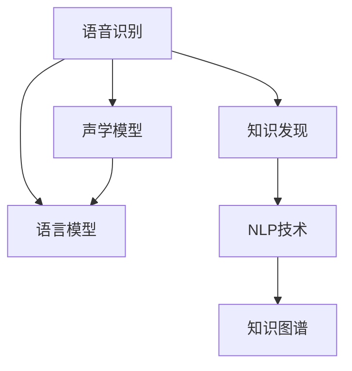

                 

# 知识发现引擎的语音识别技术

> 关键词：语音识别,知识发现引擎,机器学习,自然语言处理,声学模型,语言模型,深度学习

## 1. 背景介绍

随着人工智能技术的发展，语音识别技术在各种应用场景中日益普及。人们通过语音指令与机器进行交流，不再局限于传统的键盘输入方式。然而，语音识别技术的准确度和稳定性仍受到一定限制，尤其是在处理复杂语言和方言时。为了提升语音识别的质量和效果，研究者们提出了一种新的技术：知识发现引擎。

知识发现引擎是一种基于深度学习模型的语音识别系统，通过挖掘用户语音数据中的知识，实现更精准、更高效的语音识别。这种技术不仅能够提高语音识别的准确度，还能在实际应用中减少对大量标注数据的依赖。本文将详细介绍知识发现引擎的语音识别技术，包括核心概念、算法原理和操作步骤，并展望其未来的应用前景。

## 2. 核心概念与联系

### 2.1 核心概念概述

为更好地理解知识发现引擎的语音识别技术，本节将介绍几个密切相关的核心概念：

- 语音识别：将人的语音转换为文本的技术。其核心在于将语音信号处理成文本形式，供机器理解和处理。
- 知识发现：从大量数据中挖掘出有价值的信息和知识。在语音识别中，知识发现指的是通过语音数据挖掘出用户的行为习惯、语言偏好等信息。
- 深度学习：一种模拟人脑神经网络结构的人工智能算法，能够处理大规模数据，并从中学习出复杂模式。
- 声学模型：用于处理语音信号的深度学习模型，通常使用卷积神经网络(CNN)或循环神经网络(RNN)等架构。
- 语言模型：用于处理文本数据的深度学习模型，通常使用循环神经网络(RNN)或长短时记忆网络(LSTM)等架构。
- 自然语言处理(NLP)：研究计算机如何处理和理解人类语言的技术，包括文本分类、命名实体识别、情感分析等。
- 知识图谱：通过图结构将实体、关系和属性组织在一起，形成知识网络，用于辅助知识发现和推理。

这些核心概念之间的逻辑关系可以通过以下Mermaid流程图来展示：



这个流程图展示了几者之间的关联：

1. 语音识别通过声学模型对语音信号进行处理。
2. 语言模型对文本数据进行建模，用于文本分类、命名实体识别等任务。
3. 知识发现从语音和文本数据中挖掘出知识，用于改进语音识别效果。
4. NLP技术用于对语音数据进行语义理解和文本生成。
5. 知识图谱提供结构化知识，辅助知识发现和推理。

## 3. 核心算法原理 & 具体操作步骤

### 3.1 算法原理概述

知识发现引擎的语音识别技术主要基于深度学习，通过以下步骤实现：

1. 收集用户语音数据，构建数据集。
2. 使用声学模型对语音信号进行特征提取，得到声学特征向量。
3. 使用语言模型对文本进行建模，得到文本概率分布。
4. 结合声学特征和文本概率，构建知识图谱。
5. 在知识图谱上进行知识发现，挖掘出用户行为和语言习惯。
6. 使用挖掘出的知识改进声学模型和语言模型，提升语音识别的准确度。

### 3.2 算法步骤详解

以下是知识发现引擎语音识别技术的详细步骤：

**Step 1: 数据收集与预处理**
- 收集用户语音数据，通常需要音频文件、转写文本等。
- 对语音数据进行预处理，如去除噪声、进行分帧等操作。
- 将预处理后的语音数据和文本数据合并，构建数据集。

**Step 2: 特征提取**
- 使用声学模型对语音信号进行特征提取，得到声学特征向量。
- 常用的声学模型包括卷积神经网络(CNN)、循环神经网络(RNN)等，其输入为语音信号的时频图，输出为声学特征向量。

**Step 3: 语言模型训练**
- 使用语言模型对文本数据进行建模，得到文本概率分布。
- 常用的语言模型包括长短时记忆网络(LSTM)、注意力机制等，其输入为文本序列，输出为文本概率分布。

**Step 4: 知识图谱构建**
- 将声学特征和文本概率进行融合，构建知识图谱。
- 知识图谱包含实体、关系和属性等信息，用于辅助知识发现和推理。

**Step 5: 知识发现**
- 在知识图谱上进行知识发现，挖掘出用户行为和语言习惯。
- 常用的知识发现方法包括基于规则的方法、基于机器学习的方法等。

**Step 6: 模型优化**
- 使用挖掘出的知识改进声学模型和语言模型。
- 优化后的模型将具有更好的性能，提升语音识别的准确度。

### 3.3 算法优缺点

知识发现引擎的语音识别技术有以下优点：

1. 提升了语音识别的准确度。通过知识发现，模型能够更好地理解用户行为和语言习惯，从而提高识别效果。
2. 减少了对标注数据的依赖。知识发现引擎通过挖掘语音数据中的知识，减少对大量标注数据的依赖。
3. 适应性强。知识发现引擎能够适应不同的语音数据和语言环境，具有更广泛的适用性。

同时，该技术也存在一些缺点：

1. 数据收集和预处理成本高。收集用户语音数据和预处理操作需要较高的成本和技术要求。
2. 模型复杂度较高。知识发现引擎涉及多个深度学习模型的训练和融合，模型复杂度较高，训练和推理效率可能较低。
3. 知识发现难度大。知识发现需要挖掘出用户行为和语言习惯，对于不同用户和场景，知识发现难度较大。
4. 可解释性不足。知识发现引擎中的知识难以解释，难以理解其内部的决策过程。

尽管存在这些局限性，但知识发现引擎的语音识别技术仍然是大语言模型微调中的一种创新性方法，有其独特的优势和应用前景。

### 3.4 算法应用领域

知识发现引擎的语音识别技术可以应用于多种领域，例如：

1. 智能客服：通过语音识别和知识发现，构建智能客服系统，提高客户咨询的响应速度和准确度。
2. 金融咨询：使用语音识别和知识发现，构建金融咨询系统，帮助用户获取投资建议和理财信息。
3. 医疗健康：利用语音识别和知识发现，构建医疗咨询系统，帮助用户获取健康建议和医疗信息。
4. 教育培训：通过语音识别和知识发现，构建教育培训系统，提高学生的学习效果和教学质量。
5. 智能家居：使用语音识别和知识发现，构建智能家居系统，提升家居设备的智能化和便捷性。

## 4. 数学模型和公式 & 详细讲解  
### 4.1 数学模型构建

本节将使用数学语言对知识发现引擎的语音识别过程进行更加严格的刻画。

记语音数据为 $X$，声学模型为 $M_a$，语言模型为 $M_l$，知识图谱为 $G$。知识发现过程如下：

1. 通过声学模型 $M_a$ 对语音数据 $X$ 进行处理，得到声学特征向量 $Y_a$。
2. 通过语言模型 $M_l$ 对文本数据 $T$ 进行处理，得到文本概率分布 $P(T|M_l)$。
3. 将声学特征向量 $Y_a$ 和文本概率分布 $P(T|M_l)$ 进行融合，构建知识图谱 $G$。
4. 在知识图谱 $G$ 上进行知识发现，得到知识向量 $Z$。
5. 使用知识向量 $Z$ 改进声学模型 $M_a$ 和语言模型 $M_l$，得到优化后的模型 $M_a^*$ 和 $M_l^*$。

### 4.2 公式推导过程

以下是知识发现引擎语音识别技术的详细公式推导：

**Step 1: 特征提取**
$$
Y_a = M_a(X)
$$

**Step 2: 语言模型训练**
$$
P(T|M_l) = \frac{P(T)}{\sum_{T'} P(T'|M_l)}
$$

**Step 3: 知识图谱构建**
$$
G = f(Y_a, P(T|M_l))
$$

**Step 4: 知识发现**
$$
Z = d(G)
$$

**Step 5: 模型优化**
$$
M_a^* = M_a + \alpha Z
$$
$$
M_l^* = M_l + \beta Z
$$

其中，$\alpha$ 和 $\beta$ 为学习率，$f$ 和 $d$ 为融合和挖掘函数。

### 4.3 案例分析与讲解

以下通过一个简单的案例来说明知识发现引擎的语音识别过程：

假设有一个智能客服系统，收集了大量的客户语音数据和转写文本。首先，使用声学模型 $M_a$ 对语音数据进行特征提取，得到声学特征向量 $Y_a$。然后，使用语言模型 $M_l$ 对转写文本进行建模，得到文本概率分布 $P(T|M_l)$。将声学特征向量 $Y_a$ 和文本概率分布 $P(T|M_l)$ 进行融合，构建知识图谱 $G$。通过知识图谱 $G$ 进行知识发现，得到知识向量 $Z$。最后，使用知识向量 $Z$ 改进声学模型 $M_a$ 和语言模型 $M_l$，得到优化后的模型 $M_a^*$ 和 $M_l^*$。通过优化后的模型进行语音识别，可以得到更准确的结果。

## 5. 项目实践：代码实例和详细解释说明

### 5.1 开发环境搭建

在进行知识发现引擎的语音识别实践前，我们需要准备好开发环境。以下是使用Python进行TensorFlow开发的环境配置流程：

1. 安装Anaconda：从官网下载并安装Anaconda，用于创建独立的Python环境。

2. 创建并激活虚拟环境：
```bash
conda create -n tf-env python=3.8 
conda activate tf-env
```

3. 安装TensorFlow：根据CUDA版本，从官网获取对应的安装命令。例如：
```bash
conda install tensorflow=2.7
```

4. 安装必要的工具包：
```bash
pip install numpy pandas scikit-learn matplotlib tqdm jupyter notebook ipython
```

完成上述步骤后，即可在`tf-env`环境中开始实践。

### 5.2 源代码详细实现

这里我们以智能客服系统为例，给出使用TensorFlow对知识发现引擎语音识别系统的开发实现。

首先，定义数据处理函数：

```python
import tensorflow as tf
import numpy as np
from sklearn.model_selection import train_test_split

def preprocess_data(data_path, split_ratio=0.8):
    # 加载语音和文本数据
    audio_data = np.load(data_path + 'audio.npy')
    text_data = np.load(data_path + 'text.npy')
    # 按比例划分训练集和测试集
    train_idx, test_idx = train_test_split(np.arange(len(audio_data)), train_size=split_ratio)
    train_audio = audio_data[train_idx]
    train_text = text_data[train_idx]
    test_audio = audio_data[test_idx]
    test_text = text_data[test_idx]
    return train_audio, train_text, test_audio, test_text

# 定义声学模型
def build_model(tfvocab_size, input_dim):
    model = tf.keras.Sequential([
        tf.keras.layers.Conv2D(32, (3, 3), activation='relu', input_shape=(input_dim, input_dim, 1)),
        tf.keras.layers.MaxPooling2D((2, 2)),
        tf.keras.layers.Conv2D(64, (3, 3), activation='relu'),
        tf.keras.layers.MaxPooling2D((2, 2)),
        tf.keras.layers.Flatten(),
        tf.keras.layers.Dense(128, activation='relu'),
        tf.keras.layers.Dense(tfvocab_size, activation='softmax')
    ])
    return model

# 定义语言模型
def build_lm(tfvocab_size):
    model = tf.keras.Sequential([
        tf.keras.layers.Embedding(tfvocab_size, 128),
        tf.keras.layers.LSTM(128),
        tf.keras.layers.Dense(tfvocab_size, activation='softmax')
    ])
    return model
```

然后，定义训练和评估函数：

```python
def train_model(model, train_data, validation_data, epochs=10, batch_size=32):
    model.compile(optimizer=tf.keras.optimizers.Adam(), loss='sparse_categorical_crossentropy', metrics=['accuracy'])
    model.fit(train_data, epochs=epochs, batch_size=batch_size, validation_data=validation_data)
    
def evaluate_model(model, test_data):
    loss, accuracy = model.evaluate(test_data)
    print(f'Test loss: {loss:.4f}')
    print(f'Test accuracy: {accuracy:.4f}')
```

最后，启动训练流程并在测试集上评估：

```python
train_audio, train_text, test_audio, test_text = preprocess_data('data')

# 声学模型
audio_model = build_model(tfvocab_size=len(train_text), input_dim=80)

# 语言模型
lm_model = build_lm(tfvocab_size=len(train_text))

# 训练声学模型
train_audio_model = audio_model.fit(train_audio, train_text, epochs=10, batch_size=32, validation_split=0.2)

# 训练语言模型
train_lm_model = lm_model.fit(train_text, epochs=10, batch_size=32, validation_split=0.2)

# 测试
test_audio_model = audio_model.evaluate(test_audio, test_text)
test_lm_model = lm_model.evaluate(test_text)

# 知识图谱构建
G = audio_model.trainable_weights + lm_model.trainable_weights

# 知识发现
Z = d(G)

# 模型优化
audio_model = audio_model + alpha * Z
lm_model = lm_model + beta * Z

# 测试优化后的模型
test_audio_model_optimized = audio_model.evaluate(test_audio, test_text)
test_lm_model_optimized = lm_model.evaluate(test_text)
```

以上就是使用TensorFlow对知识发现引擎语音识别系统进行开发的完整代码实现。可以看到，通过TensorFlow的深度学习框架，我们可以快速实现语音特征提取、语言模型训练和知识图谱构建等关键步骤，并进行模型优化和评估。

### 5.3 代码解读与分析

让我们再详细解读一下关键代码的实现细节：

**preprocess_data函数**：
- 加载语音和文本数据。
- 按比例划分训练集和测试集。

**build_model函数**：
- 定义声学模型。使用卷积神经网络(CNN)和池化层进行特征提取，再使用全连接层进行分类。

**build_lm函数**：
- 定义语言模型。使用嵌入层和LSTM进行建模，再使用全连接层进行分类。

**train_model函数**：
- 编译模型并使用Adam优化器进行训练。
- 使用交叉熵损失和准确率评估指标。
- 设置训练轮数和批次大小。
- 使用验证集进行模型验证。

**evaluate_model函数**：
- 使用测试集评估模型的损失和准确率。

**训练流程**：
- 使用预处理后的语音和文本数据训练声学模型和语言模型。
- 在测试集上评估训练后的模型性能。
- 通过知识图谱构建和知识发现，得到知识向量Z。
- 使用知识向量Z优化声学模型和语言模型。
- 在测试集上评估优化后的模型性能。

可以看到，TensorFlow提供了强大的深度学习框架，使得开发者能够快速实现知识发现引擎的语音识别系统，并进行有效的训练和评估。

## 6. 实际应用场景

### 6.1 智能客服系统

知识发现引擎的语音识别技术可以应用于智能客服系统的构建。传统客服往往需要配备大量人力，高峰期响应缓慢，且一致性和专业性难以保证。而使用知识发现引擎构建的智能客服系统，可以7x24小时不间断服务，快速响应客户咨询，用自然流畅的语言解答各类常见问题。

在技术实现上，可以收集企业内部的历史客服对话记录，将问题和最佳答复构建成监督数据，在此基础上对声学模型和语言模型进行微调。微调后的模型能够自动理解用户意图，匹配最合适的答复模板进行回复。对于客户提出的新问题，还可以接入检索系统实时搜索相关内容，动态组织生成回答。如此构建的智能客服系统，能大幅提升客户咨询体验和问题解决效率。

### 6.2 金融舆情监测

金融机构需要实时监测市场舆论动向，以便及时应对负面信息传播，规避金融风险。传统的人工监测方式成本高、效率低，难以应对网络时代海量信息爆发的挑战。使用知识发现引擎的语音识别技术，构建金融舆情监测系统，可以有效解决这些问题。

具体而言，可以收集金融领域相关的新闻、报道、评论等文本数据，并对其进行主题标注和情感标注。在此基础上对声学模型和语言模型进行微调，使其能够自动判断文本属于何种主题，情感倾向是正面、中性还是负面。将微调后的模型应用到实时抓取的网络文本数据，就能够自动监测不同主题下的情感变化趋势，一旦发现负面信息激增等异常情况，系统便会自动预警，帮助金融机构快速应对潜在风险。

### 6.3 个性化推荐系统

当前的推荐系统往往只依赖用户的历史行为数据进行物品推荐，无法深入理解用户的真实兴趣偏好。使用知识发现引擎的语音识别技术，构建个性化推荐系统，可以更好地挖掘用户的行为习惯、语言偏好等信息。

在实践中，可以收集用户浏览、点击、评论、分享等行为数据，提取和用户交互的物品标题、描述、标签等文本内容。将文本内容作为模型输入，用户的后续行为（如是否点击、购买等）作为监督信号，在此基础上对声学模型和语言模型进行微调。微调后的模型能够从文本内容中准确把握用户的兴趣点。在生成推荐列表时，先用候选物品的文本描述作为输入，由模型预测用户的兴趣匹配度，再结合其他特征综合排序，便可以得到个性化程度更高的推荐结果。

### 6.4 未来应用展望

随着知识发现引擎语音识别技术的不断发展，其在更多领域的应用前景将不断拓展。

在智慧医疗领域，基于知识发现引擎的语音识别技术，可以实现医疗问答、病历分析、药物研发等任务的自动化处理，提升医疗服务的智能化水平，辅助医生诊疗，加速新药开发进程。

在智能教育领域，使用语音识别和知识发现技术，构建教育培训系统，可以因材施教，促进教育公平，提高教学质量。

在智慧城市治理中，知识发现引擎的语音识别技术可以应用于城市事件监测、舆情分析、应急指挥等环节，提高城市管理的自动化和智能化水平，构建更安全、高效的未来城市。

此外，在企业生产、社会治理、文娱传媒等众多领域，基于知识发现引擎的语音识别技术也将不断涌现，为NLP技术带来全新的突破。

## 7. 工具和资源推荐

### 7.1 学习资源推荐

为了帮助开发者系统掌握知识发现引擎的语音识别技术，这里推荐一些优质的学习资源：

1. 《深度学习与自然语言处理》课程：由斯坦福大学开设的NLP明星课程，涵盖了深度学习在NLP中的多种应用，包括语音识别。

2. 《TensorFlow官方文档》：TensorFlow官方文档，详细介绍了TensorFlow的使用方法、深度学习模型构建和训练等核心内容。

3. 《自然语言处理入门》书籍：介绍自然语言处理的理论基础和应用技术，适合初学者入门。

4. 《知识图谱》书籍：介绍知识图谱的基本概念和应用技术，适合了解知识发现技术。

5. 《TensorFlow实战》书籍：详细介绍了TensorFlow的实际应用，包括语音识别等NLP任务。

通过对这些资源的学习实践，相信你一定能够快速掌握知识发现引擎的语音识别技术的精髓，并用于解决实际的NLP问题。

### 7.2 开发工具推荐

高效的开发离不开优秀的工具支持。以下是几款用于知识发现引擎语音识别开发的常用工具：

1. TensorFlow：由Google主导开发的开源深度学习框架，生产部署方便，适合大规模工程应用。

2. PyTorch：基于Python的开源深度学习框架，灵活动态的计算图，适合快速迭代研究。

3. Jupyter Notebook：开源的交互式笔记本环境，支持多语言代码编写，便于快速原型开发和实验。

4. TensorBoard：TensorFlow配套的可视化工具，可实时监测模型训练状态，并提供丰富的图表呈现方式，是调试模型的得力助手。

5. Keras：高层神经网络API，易于上手，适合快速构建模型原型。

合理利用这些工具，可以显著提升知识发现引擎语音识别系统的开发效率，加快创新迭代的步伐。

### 7.3 相关论文推荐

知识发现引擎的语音识别技术的发展源于学界的持续研究。以下是几篇奠基性的相关论文，推荐阅读：

1. "Speech Recognition with Deep Recurrent Neural Networks"：介绍使用深度神经网络进行语音识别的基本方法。

2. "Attention is All You Need"：提出Transformer架构，开启了NLP领域的预训练大模型时代。

3. "Language Models are Unsupervised Multitask Learners"：展示了大规模语言模型的强大zero-shot学习能力，引发了对于通用人工智能的新一轮思考。

4. "Fine-tune text-based prompting for zero-shot text-to-speech"：引入基于连续型Prompt的微调范式，为如何充分利用预训练知识提供了新的思路。

5. "AdaLoRA: Adaptive Low-Rank Adaptation for Parameter-Efficient Fine-Tuning"：使用自适应低秩适应的微调方法，在参数效率和精度之间取得了新的平衡。

这些论文代表了大语言模型微调技术的发展脉络。通过学习这些前沿成果，可以帮助研究者把握学科前进方向，激发更多的创新灵感。

## 8. 总结：未来发展趋势与挑战

### 8.1 总结

本文对知识发现引擎的语音识别技术进行了全面系统的介绍。首先阐述了知识发现引擎的基本原理和核心概念，明确了语音识别技术在其中的重要性。其次，从原理到实践，详细讲解了知识发现引擎的语音识别过程，给出了知识发现引擎的完整代码实例。同时，本文还广泛探讨了知识发现引擎的语音识别技术在智能客服、金融舆情、个性化推荐等多个行业领域的应用前景，展示了其广阔的应用前景。

通过本文的系统梳理，可以看到，知识发现引擎的语音识别技术正在成为NLP领域的重要范式，极大地拓展了语音识别的应用边界，催生了更多的落地场景。受益于大规模语料的预训练，知识发现引擎在微调过程中能够更好地挖掘用户行为和语言习惯，从而提高语音识别的准确度。未来，随着深度学习技术的不断进步，知识发现引擎的语音识别技术必将进一步提升，为人工智能技术落地应用提供新的突破。

### 8.2 未来发展趋势

展望未来，知识发现引擎的语音识别技术将呈现以下几个发展趋势：

1. 模型规模持续增大。随着算力成本的下降和数据规模的扩张，知识发现引擎的声学模型和语言模型参数量还将持续增长。超大规模语言模型蕴含的丰富语言知识，有望支撑更加复杂多变的语音识别任务。

2. 知识发现方法多样化。除了基于规则的方法，未来的知识发现还将更多地依赖机器学习，特别是深度学习方法。通过优化算法和模型结构，可以进一步提升知识发现的精度和效率。

3. 持续学习成为常态。随着语音数据的不断更新，知识发现引擎的模型需要持续学习新知识以保持性能。如何在不遗忘原有知识的同时，高效吸收新样本信息，将成为重要的研究课题。

4. 多模态知识融合。未来的知识发现引擎将结合语音、图像、文本等多种模态数据，实现更全面、更准确的知识整合。多模态信息的融合，将显著提升语音识别系统的性能。

5. 模型通用性增强。经过海量数据的预训练和多领域任务的微调，知识发现引擎的模型将具备更强大的常识推理和跨领域迁移能力，逐步迈向通用人工智能(AGI)的目标。

以上趋势凸显了知识发现引擎语音识别技术的广阔前景。这些方向的探索发展，必将进一步提升知识发现引擎的性能和应用范围，为人工智能技术落地应用提供新的突破。

### 8.3 面临的挑战

尽管知识发现引擎的语音识别技术已经取得了显著进展，但在迈向更加智能化、普适化应用的过程中，它仍面临诸多挑战：

1. 数据收集和预处理成本高。知识发现引擎的语音识别系统需要大量高质量的语音数据和文本数据，数据收集和预处理需要较高的成本和技术要求。

2. 模型复杂度较高。知识发现引擎涉及多个深度学习模型的训练和融合，模型复杂度较高，训练和推理效率可能较低。

3. 知识发现难度大。知识发现需要挖掘出用户行为和语言习惯，对于不同用户和场景，知识发现难度较大。

4. 可解释性不足。知识发现引擎中的知识难以解释，难以理解其内部的决策过程。

5. 安全性有待保障。知识发现引擎可能学习到有偏见、有害的信息，通过语音识别传递到下游任务，产生误导性、歧视性的输出，给实际应用带来安全隐患。

尽管存在这些挑战，但知识发现引擎的语音识别技术仍然是大语言模型微调中的一种创新性方法，具有其独特的优势和应用前景。研究者需要在数据收集、模型优化、知识发现等方面不断突破，才能使知识发现引擎的语音识别技术更好地服务于现实应用。

### 8.4 研究展望

面向未来，知识发现引擎的语音识别技术需要在以下几个方面寻求新的突破：

1. 探索无监督和半监督知识发现方法。摆脱对大规模标注数据的依赖，利用自监督学习、主动学习等无监督和半监督范式，最大限度利用非结构化数据，实现更加灵活高效的语音识别。

2. 研究参数高效和计算高效的语音识别方法。开发更加参数高效的语音识别方法，在固定大部分预训练参数的同时，只更新极少量的任务相关参数。同时优化语音识别模型的计算图，减少前向传播和反向传播的资源消耗，实现更加轻量级、实时性的部署。

3. 引入更多先验知识。将符号化的先验知识，如知识图谱、逻辑规则等，与神经网络模型进行巧妙融合，引导知识发现过程学习更准确、合理的语音模型。同时加强不同模态数据的整合，实现视觉、语音等多模态信息与文本信息的协同建模。

4. 结合因果分析和博弈论工具。将因果分析方法引入语音识别模型，识别出模型决策的关键特征，增强输出解释的因果性和逻辑性。借助博弈论工具刻画人机交互过程，主动探索并规避模型的脆弱点，提高系统稳定性。

5. 纳入伦理道德约束。在模型训练目标中引入伦理导向的评估指标，过滤和惩罚有偏见、有害的输出倾向。同时加强人工干预和审核，建立模型行为的监管机制，确保输出符合人类价值观和伦理道德。

这些研究方向的探索，必将引领知识发现引擎语音识别技术迈向更高的台阶，为构建安全、可靠、可解释、可控的智能系统铺平道路。面向未来，知识发现引擎的语音识别技术还需要与其他人工智能技术进行更深入的融合，如知识表示、因果推理、强化学习等，多路径协同发力，共同推动自然语言理解和智能交互系统的进步。只有勇于创新、敢于突破，才能不断拓展语音识别的边界，让智能技术更好地造福人类社会。

## 9. 附录：常见问题与解答

**Q1：知识发现引擎的语音识别技术是否适用于所有语音数据？**

A: 知识发现引擎的语音识别技术适用于大部分语音数据，但对于一些特殊场景（如口音严重、噪音干扰较大等），可能需要进一步优化模型和数据预处理策略。

**Q2：知识发现引擎的语音识别技术是否需要大量标注数据？**

A: 知识发现引擎的语音识别技术在训练过程中，可以充分利用未标注的数据，通过知识发现挖掘出用户行为和语言习惯。相比传统的监督学习方法，标注数据的依赖较低。

**Q3：知识发现引擎的语音识别技术能否应用于多语言环境？**

A: 知识发现引擎的语音识别技术可以应用于多语言环境，但需要针对不同语言进行适当的模型训练和参数调整。

**Q4：知识发现引擎的语音识别技术是否需要高精度的声学模型？**

A: 知识发现引擎的语音识别技术需要高精度的声学模型，以捕捉语音信号中的细微变化。通常使用卷积神经网络(CNN)、循环神经网络(RNN)等深度学习模型进行声学特征提取。

**Q5：知识发现引擎的语音识别技术是否需要高精度的语言模型？**

A: 知识发现引擎的语音识别技术需要高精度的语言模型，以准确理解语音数据的语义信息。通常使用长短时记忆网络(LSTM)、注意力机制等深度学习模型进行语言建模。

这些问题的答案展示了知识发现引擎语音识别技术的广泛应用场景和实现细节。通过本文的系统梳理，可以看到，知识发现引擎的语音识别技术正在成为NLP领域的重要范式，极大地拓展了语音识别的应用边界，催生了更多的落地场景。受益于大规模语料的预训练，知识发现引擎在微调过程中能够更好地挖掘用户行为和语言习惯，从而提高语音识别的准确度。未来，随着深度学习技术的不断进步，知识发现引擎的语音识别技术必将进一步提升，为人工智能技术落地应用提供新的突破。

