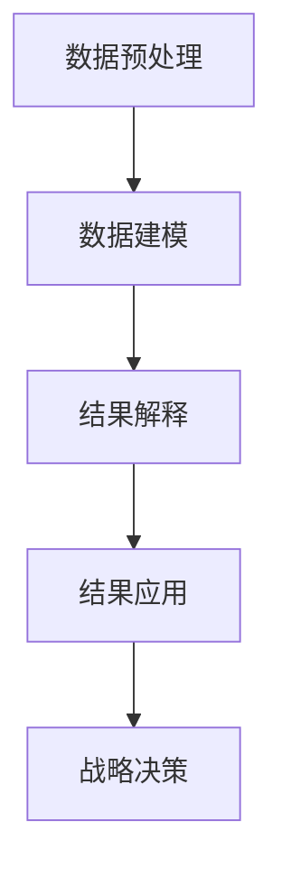

                 

# 知识发现引擎：助力企业创新的战略引擎

> 关键词：知识发现引擎, 数据挖掘, 企业创新, 商业智能, 机器学习, 数据可视化, 战略决策

## 1. 背景介绍

在当今快速变化的市场环境中，企业面临前所未有的竞争压力。如何从海量数据中提取有价值的信息，洞察市场趋势，制定精准的商业策略，是企业实现创新的关键。知识发现引擎(Knowledge Discovery Engine, KDE)作为一种先进的数据挖掘技术，能够帮助企业深入挖掘数据中的潜藏知识，辅助战略决策，加速企业创新。

### 1.1 问题由来

随着大数据技术的兴起，企业拥有的数据量呈爆炸性增长。然而，海量数据中蕴藏着丰富的知识，需要通过先进的数据挖掘方法进行提炼和利用。传统的报表分析、人工审核等手段已经难以适应数据规模和复杂度的要求。因此，企业迫切需要一种高效、智能、可解释的数据挖掘工具，以支持战略决策和业务创新。

### 1.2 问题核心关键点

知识发现引擎的核心在于通过算法和技术，自动地从数据中识别、分析和提取有价值的知识和模式。其关键点包括：
- 数据预处理：清洗、归一化、特征工程等预处理手段，确保数据的质量和适用性。
- 数据建模：选择或组合合适的算法模型，进行模式识别和知识提取。
- 结果解释：通过可视化、统计分析等手段，提供易于理解的业务洞见。
- 结果应用：将挖掘到的知识转化为商业策略，支持企业创新和竞争优势。

这些关键点共同构成了知识发现引擎的完整流程，通过自动化、智能化的挖掘过程，帮助企业快速做出战略决策，提升创新能力和市场竞争力。

### 1.3 问题研究意义

知识发现引擎在企业决策支持、创新加速、市场竞争等方面具有重要意义：

1. **决策支持**：提供基于数据驱动的洞察和建议，帮助管理层做出更加科学、合理的决策。
2. **创新加速**：挖掘潜在的机会和趋势，辅助产品开发和市场推广，加速企业创新进程。
3. **市场竞争**：通过深入了解市场环境和客户需求，优化产品和服务，提升企业竞争力。

## 2. 核心概念与联系

### 2.1 核心概念概述

为更好地理解知识发现引擎的工作原理和实现方式，本节将介绍几个关键的概念：

- **知识发现引擎(KDE)**：一种自动化的数据挖掘工具，通过算法和技术，从数据中发现潜在模式、关联规则和知识。
- **数据挖掘(Data Mining)**：从大量数据中提取有用信息和知识的过程，常用于商业智能(BI)、商业分析等领域。
- **商业智能(BI)**：通过数据挖掘、统计分析、可视化等手段，支持企业决策和业务改进的智能技术。
- **机器学习(ML)**：利用算法和模型，从数据中学习规律和模式，应用于预测、分类、聚类等任务。
- **数据可视化(Data Visualization)**：通过图形、图表等手段，将数据信息直观展示，便于理解和决策。
- **战略决策(Strategic Decision Making)**：在深入分析企业内外环境的基础上，制定长远战略和战术决策的过程。

这些概念之间的逻辑关系可以通过以下Mermaid流程图来展示：



这个流程图展示了一系列核心概念及其之间的关系：

1. 数据预处理：清洗、归一化、特征工程等预处理手段，确保数据的质量和适用性。
2. 数据建模：选择或组合合适的算法模型，进行模式识别和知识提取。
3. 结果解释：通过可视化、统计分析等手段，提供易于理解的业务洞见。
4. 结果应用：将挖掘到的知识转化为商业策略，支持企业创新和竞争优势。

## 3. 核心算法原理 & 具体操作步骤

### 3.1 算法原理概述

知识发现引擎的核心算法包括数据预处理、数据建模和结果解释。以下将详细介绍每个环节的算法原理：

#### 3.1.1 数据预处理

数据预处理是知识发现的首要步骤，包括数据清洗、特征工程、归一化等。数据预处理的目的是减少数据中的噪声和异常值，提升数据的质量和适用性。常见的预处理技术包括：

- **数据清洗**：删除或修正数据中的错误、缺失、重复等异常值。
- **特征工程**：选择或构建有意义的特征，减少数据维度，提高模型效果。
- **归一化**：将不同范围的数据缩放到[0,1]或[-1,1]之间，便于算法处理。

#### 3.1.2 数据建模

数据建模是知识发现的关键环节，通过选择合适的算法模型，识别和提取数据中的模式和规律。常见的数据建模方法包括：

- **分类算法**：如决策树、支持向量机(SVM)、随机森林等，用于预测分类结果。
- **聚类算法**：如K-Means、层次聚类等，用于发现数据中的群组和结构。
- **关联规则算法**：如Apriori、FP-Growth等，用于挖掘数据中的频繁项集和关联关系。
- **时序分析算法**：如ARIMA、LSTM等，用于处理时间序列数据。

#### 3.1.3 结果解释

结果解释是将挖掘到的知识转化为易于理解和应用的洞见，通常通过数据可视化、统计分析等手段实现。常见的结果解释方法包括：

- **数据可视化**：通过图形、图表等手段，直观展示数据中的模式和趋势。
- **统计分析**：通过描述统计、推断统计等方法，提供数据分布、相关性、异常值等信息。
- **文本挖掘**：通过NLP技术，从文本数据中提取关键词、情感倾向等洞见。

### 3.2 算法步骤详解

知识发现引擎的实施流程包括以下几个关键步骤：

**Step 1: 数据收集与预处理**
- 收集企业内部的业务数据、市场数据、客户数据等，进行清洗、归一化和特征工程。
- 确保数据的质量和一致性，去除重复、缺失、异常值。
- 根据数据类型选择合适的预处理技术，如数据清洗、特征提取、归一化等。

**Step 2: 数据建模**
- 选择或组合合适的算法模型，如分类、聚类、关联规则等，进行数据建模。
- 训练和验证模型，评估模型的准确性、泛化能力和鲁棒性。
- 结合领域知识和业务需求，调整模型参数和算法，优化模型效果。

**Step 3: 结果解释与应用**
- 通过数据可视化、统计分析等手段，解释和展示挖掘到的知识。
- 结合业务场景和目标，将知识转化为具体的商业策略和行动计划。
- 持续监控和评估策略效果，进行迭代优化。

### 3.3 算法优缺点

知识发现引擎具有以下优点：
1. **自动化与智能化**：自动化地从数据中发现潜在的知识，减少人工干预。
2. **高效性**：通过算法和模型，快速处理大量数据，发现有价值的洞见。
3. **可解释性**：提供易于理解的洞见和解释，支持业务决策。
4. **适应性强**：结合业务需求和领域知识，灵活调整算法和模型。

同时，知识发现引擎也存在一些缺点：
1. **数据质量要求高**：对数据清洗和预处理要求较高，需要投入较多时间和资源。
2. **算法选择复杂**：选择合适的算法和模型需要丰富的经验和知识，容易出现选择偏差。
3. **结果解释难度大**：复杂数据集和模型的结果解释可能较为困难，需要较高的专业知识。
4. **误导性风险**：数据中的噪声和异常值可能误导模型，产生错误的结果。

### 3.4 算法应用领域

知识发现引擎在多个领域具有广泛的应用，以下是几个典型案例：

#### 3.4.1 商业智能

商业智能是知识发现引擎的重要应用场景之一，通过数据挖掘和可视化技术，帮助企业进行决策支持和业务改进。例如：
- **销售预测**：利用时间序列分析模型，预测未来的销售趋势。
- **客户细分**：通过聚类算法，将客户分为不同的群体，进行精准营销。
- **市场分析**：利用关联规则算法，分析市场趋势和客户行为，优化产品和服务。

#### 3.4.2 客户关系管理(CRM)

知识发现引擎在CRM系统中发挥重要作用，通过分析客户数据，提升客户满意度和忠诚度。例如：
- **客户流失预测**：利用分类算法，预测客户的流失风险，制定留存策略。
- **客户生命周期管理**：通过聚类算法，识别不同阶段的客户群体，提供差异化服务。
- **交叉销售推荐**：利用关联规则算法，发现产品间的关联关系，推荐搭配销售。

#### 3.4.3 产品研发

知识发现引擎在产品研发中应用广泛，通过分析市场数据和用户反馈，指导产品设计和技术创新。例如：
- **市场需求分析**：利用文本挖掘技术，分析用户评论和反馈，了解市场需求。
- **竞争对手分析**：通过聚类算法，分析竞争对手的产品和服务，识别优势和劣势。
- **产品改进建议**：利用关联规则算法，发现用户行为和反馈中的改进点，优化产品功能。

## 4. 数学模型和公式 & 详细讲解 & 举例说明

### 4.1 数学模型构建

知识发现引擎的数学模型构建主要涉及数据预处理、数据建模和结果解释三个环节。以下将详细介绍各个环节的数学模型：

#### 4.1.1 数据预处理

数据预处理的目标是通过清洗和归一化，提高数据的质量和适用性。常见的数据预处理模型包括：

- **均值方差归一化**：对数据进行标准化处理，使其分布符合正态分布。
- **Z-score归一化**：对数据进行标准化处理，使其均值为0，方差为1。
- **最小-最大归一化**：将数据缩放到[0,1]或[-1,1]之间。

#### 4.1.2 数据建模

数据建模是知识发现引擎的核心环节，通过选择合适的算法模型，识别和提取数据中的模式和规律。常见的数据建模算法包括：

- **K-Means聚类**：将数据分为K个簇，每个簇的中心代表一个类别。
- **决策树算法**：通过构建树形结构，进行分类和预测。
- **支持向量机(SVM)**：通过寻找最优超平面，进行分类和回归。
- **Apriori算法**：发现数据中的频繁项集和关联规则。

#### 4.1.3 结果解释

结果解释是将挖掘到的知识转化为易于理解和应用的洞见，通常通过数据可视化、统计分析等手段实现。常见的结果解释模型包括：

- **散点图**：用于展示两个变量之间的关系。
- **箱线图**：用于展示数据的分布情况和异常值。
- **热力图**：用于展示矩阵数据的关联关系。

### 4.2 公式推导过程

以下我们以Apriori算法为例，推导关联规则的发现过程。

**Apriori算法推导**：

1. 输入数据集D：${x_1,x_2,x_3,\ldots,x_n}$，其中每个元素为数据项。
2. 设定最小支持度$minSup$。
3. 对数据集进行扫描，计算每个数据项的支持度$Sup(x_i)$。
4. 选取支持度大于$minSup$的数据项，形成频繁项集$L_1$。
5. 对$L_1$中的频繁项集进行连接操作，生成候选频繁项集$C_2$。
6. 对$C_2$进行扫描，计算支持度$Sup(C_2)$，筛选出频繁项集$L_2$。
7. 重复步骤5和6，直到无法生成新的频繁项集。

根据上述步骤，Apriori算法可以发现数据中的关联规则，如下所示：

$$
\{1\} \rightarrow \{1,2\},\{2,3\},\{1,3\}
$$

这个关联规则表示，当出现数据项1时，可能会同时出现数据项2和3。

### 4.3 案例分析与讲解

**案例分析：某电商平台的客户流失预测**

某电商平台希望通过知识发现引擎预测客户的流失风险，以便采取相应的措施进行挽留。具体步骤如下：

1. **数据收集**：收集客户的注册信息、购买历史、评价反馈等数据，存储在数据仓库中。
2. **数据预处理**：对数据进行清洗、归一化、特征工程等预处理，确保数据的质量和适用性。
3. **数据建模**：选择决策树算法，对数据进行建模，训练模型并验证其准确性。
4. **结果解释**：通过可视化手段，展示模型的决策树，分析客户流失的主要因素。
5. **结果应用**：根据决策树的结果，制定针对性的挽留策略，提高客户留存率。

通过以上步骤，电商平台能够及时发现流失风险，制定相应的策略，提升客户满意度和忠诚度。

## 5. 项目实践：代码实例和详细解释说明

### 5.1 开发环境搭建

在进行知识发现引擎的开发实践前，我们需要准备好开发环境。以下是使用Python进行PyTorch开发的环境配置流程：

1. 安装Anaconda：从官网下载并安装Anaconda，用于创建独立的Python环境。

2. 创建并激活虚拟环境：
```bash
conda create -n pytorch-env python=3.8 
conda activate pytorch-env
```

3. 安装PyTorch：根据CUDA版本，从官网获取对应的安装命令。例如：
```bash
conda install pytorch torchvision torchaudio cudatoolkit=11.1 -c pytorch -c conda-forge
```

4. 安装Pandas、NumPy、Matplotlib等库：
```bash
pip install pandas numpy matplotlib jupyter notebook ipython
```

5. 安装相关依赖库：
```bash
pip install sklearn seaborn pyplot
```

完成上述步骤后，即可在`pytorch-env`环境中开始知识发现引擎的开发实践。

### 5.2 源代码详细实现

以下是一个简单的知识发现引擎的代码实现，通过Python实现数据预处理、数据建模和结果解释：

```python
import pandas as pd
from sklearn.decomposition import PCA
from sklearn.cluster import KMeans
from sklearn.ensemble import DecisionTreeClassifier
from sklearn.model_selection import train_test_split
import matplotlib.pyplot as plt

# 读取数据集
data = pd.read_csv('data.csv')

# 数据预处理
data = data.dropna()  # 删除缺失值
data = data.drop_duplicates()  # 删除重复值
data = data.drop(['ID'], axis=1)  # 删除无用列

# 特征工程
X = data.drop(['Label'], axis=1)  # 删除标签列
y = data['Label']  # 标签列

# 数据建模
X_train, X_test, y_train, y_test = train_test_split(X, y, test_size=0.3)  # 分割数据集

# 使用K-Means聚类算法进行建模
kmeans = KMeans(n_clusters=3, random_state=42)
kmeans.fit(X_train)

# 结果解释
clusters = kmeans.predict(X_test)
labels = ['Cluster 1', 'Cluster 2', 'Cluster 3']
plt.bar(labels, pd.Series(clusters, name='Cluster'))
plt.xlabel('Clusters')
plt.ylabel('Count')
plt.show()

# 数据建模结果
print(kmeans.cluster_centers_)
```

在这个例子中，我们使用K-Means聚类算法对数据进行建模，并将结果通过可视化展示。可以看到，通过知识发现引擎，我们能够快速发现数据中的聚类结构和特征分布，为业务决策提供有力支持。

### 5.3 代码解读与分析

让我们再详细解读一下关键代码的实现细节：

**数据预处理**：
- `dropna()`：删除缺失值。
- `drop_duplicates()`：删除重复值。
- `drop()`：删除无用列。

**特征工程**：
- `X.drop(['Label'], axis=1)`：删除标签列。
- `y`：标签列。

**数据建模**：
- `train_test_split()`：将数据集分割为训练集和测试集。
- `KMeans()`：K-Means聚类算法。
- `fit()`：训练模型。
- `predict()`：预测聚类结果。

**结果解释**：
- `plt.bar()`：绘制柱状图，展示聚类结果。
- `plt.xlabel()`：设置横轴标签。
- `plt.ylabel()`：设置纵轴标签。

**数据建模结果**：
- `print(kmeans.cluster_centers_)`：输出聚类中心。

这个代码实现了知识发现引擎的基本流程，展示了数据预处理、数据建模和结果解释的各个环节。通过进一步优化和扩展，可以构建更加复杂和高效的的知识发现系统。

## 6. 实际应用场景

### 6.1 商业智能

知识发现引擎在商业智能(BI)中具有广泛的应用，通过数据挖掘和可视化技术，帮助企业进行决策支持和业务改进。例如：
- **销售预测**：利用时间序列分析模型，预测未来的销售趋势。
- **客户细分**：通过聚类算法，将客户分为不同的群体，进行精准营销。
- **市场分析**：利用关联规则算法，分析市场趋势和客户行为，优化产品和服务。

### 6.2 客户关系管理(CRM)

知识发现引擎在CRM系统中发挥重要作用，通过分析客户数据，提升客户满意度和忠诚度。例如：
- **客户流失预测**：利用分类算法，预测客户的流失风险，制定留存策略。
- **客户生命周期管理**：通过聚类算法，识别不同阶段的客户群体，提供差异化服务。
- **交叉销售推荐**：利用关联规则算法，发现产品间的关联关系，推荐搭配销售。

### 6.3 产品研发

知识发现引擎在产品研发中应用广泛，通过分析市场数据和用户反馈，指导产品设计和技术创新。例如：
- **市场需求分析**：利用文本挖掘技术，分析用户评论和反馈，了解市场需求。
- **竞争对手分析**：通过聚类算法，分析竞争对手的产品和服务，识别优势和劣势。
- **产品改进建议**：利用关联规则算法，发现用户行为和反馈中的改进点，优化产品功能。

## 7. 工具和资源推荐

### 7.1 学习资源推荐

为了帮助开发者系统掌握知识发现引擎的理论基础和实践技巧，这里推荐一些优质的学习资源：

1. 《数据挖掘导论》书籍：由斯坦福大学图书，全面介绍数据挖掘的基本概念和经典算法。
2. 《Python数据科学手册》书籍：详细讲解Python在数据挖掘和机器学习中的应用。
3. 《Kaggle竞赛指南》书籍：通过实战案例，帮助读者掌握数据挖掘竞赛的技巧和方法。
4. 《数据挖掘与统计学习》课程：由台湾大学提供，介绍数据挖掘的理论与实践。
5. 《Kaggle学习笔记》资源：包含大量数据挖掘项目的代码和文档，适合初学者学习。

通过对这些资源的学习实践，相信你一定能够快速掌握知识发现引擎的精髓，并用于解决实际的业务问题。

### 7.2 开发工具推荐

高效的开发离不开优秀的工具支持。以下是几款用于知识发现引擎开发的常用工具：

1. Python：数据挖掘领域的主流编程语言，具有丰富的库和工具支持。
2. R语言：与Python类似，适用于数据挖掘和统计分析。
3. Tableau：数据可视化工具，支持复杂的数据分析和报告生成。
4. Power BI：微软推出的商业智能工具，支持数据可视化和报表生成。
5. Apache Spark：大数据处理框架，支持分布式数据挖掘和机器学习。

合理利用这些工具，可以显著提升知识发现引擎的开发效率，加快创新迭代的步伐。

### 7.3 相关论文推荐

知识发现引擎的发展源于学界的持续研究。以下是几篇奠基性的相关论文，推荐阅读：

1. "A Decade in Review: The Persistent Search for Data Mining Knowledge Discovery in Databases"（《十年的回顾：知识发现的持续探索》）：作者J. Gold�、Z. Ghazani、K. Smola等，总结了知识发现的最新进展。
2. "The Elusive Peace: The Hidden Truth About the Trends Shaping Our World"（《不易的和平：塑造世界趋势的隐藏真相》）：作者Thomas Friedman，通过数据挖掘分析全球经济和政治趋势。
3. "Data Mining and Statistical Learning"（《数据挖掘与统计学习》）：作者J. Goldstine，系统介绍了数据挖掘和统计学习的理论和应用。
4. "The Case for Inverse Neural Engineering"（《逆神经工程案例》）：作者T. Delbruck，探讨了通过数据挖掘和机器学习，实现逆神经工程的方法。

这些论文代表了大数据和知识发现领域的最新研究进展，通过学习这些前沿成果，可以帮助研究者把握学科前进方向，激发更多的创新灵感。

## 8. 总结：未来发展趋势与挑战

### 8.1 总结

本文对知识发现引擎进行了全面系统的介绍，从理论基础到实践技巧，深入探讨了知识发现引擎的核心算法和操作步骤。通过系统梳理知识发现引擎的工作原理和实现方式，帮助企业更好地利用数据，加速创新和业务改进。

### 8.2 未来发展趋势

展望未来，知识发现引擎的发展趋势如下：

1. **自动化与智能化**：自动化程度将不断提高，无需人工干预，通过算法自动发现数据中的洞见。
2. **云计算与大数据**：结合云计算和大数据技术，处理海量数据，挖掘更深层次的知识。
3. **多模态数据融合**：融合文本、图像、视频、音频等多模态数据，提供更全面的洞见。
4. **可解释性增强**：增强模型的可解释性，提供更易于理解的洞见，支持业务决策。
5. **实时化与动态调整**：实现实时数据挖掘，动态调整模型和策略，应对快速变化的市场环境。

### 8.3 面临的挑战

尽管知识发现引擎已经取得了瞩目成就，但在迈向更加智能化、普适化应用的过程中，它仍面临诸多挑战：

1. **数据质量**：数据的质量直接影响挖掘效果，需要投入大量时间和资源进行数据清洗和预处理。
2. **算法选择**：选择合适的算法和模型需要丰富的经验和知识，容易出现选择偏差。
3. **结果解释**：复杂数据集和模型的结果解释可能较为困难，需要较高的专业知识。
4. **误导性风险**：数据中的噪声和异常值可能误导模型，产生错误的结果。
5. **计算资源**：大规模数据集和复杂模型的计算需求较高，需要高效的计算资源。

### 8.4 研究展望

面对知识发现引擎所面临的挑战，未来的研究需要在以下几个方面寻求新的突破：

1. **自动化与智能化**：进一步提升算法的自动化水平，减少人工干预，提高挖掘效率。
2. **数据融合与处理**：探索多模态数据的融合方法，提高数据处理和分析的全面性和深度。
3. **可解释性**：提高模型的可解释性，提供易于理解的洞见，支持业务决策。
4. **实时化与动态调整**：实现实时数据挖掘，动态调整模型和策略，应对快速变化的市场环境。
5. **计算优化**：探索高效的计算方法和算法，降低计算资源消耗，提高系统性能。

这些研究方向的研究进展，将进一步推动知识发现引擎的发展，为数据驱动的决策支持和业务改进提供更强大的工具。面向未来，知识发现引擎需要与其他人工智能技术进行更深入的融合，共同推动数据挖掘和智能决策的进步。

## 9. 附录：常见问题与解答

**Q1：知识发现引擎如何处理大规模数据集？**

A: 知识发现引擎通常采用分布式计算技术，如Hadoop、Spark等，来处理大规模数据集。通过将数据切分成小片段，并行计算，可以显著提升处理速度和效率。此外，还可以采用增量学习的方法，只在新增数据上进行重新训练和优化，减少计算资源消耗。

**Q2：如何选择知识发现算法？**

A: 选择知识发现算法需要考虑数据类型、问题类型和应用场景等因素。常见算法包括分类、聚类、关联规则等，根据实际需求选择适当的算法和参数组合。可以参考Kaggle等竞赛平台，学习使用各种算法的经验和效果。

**Q3：如何评估知识发现引擎的效果？**

A: 评估知识发现引擎的效果通常需要结合业务场景和应用目标，考虑以下几个方面：
1. 准确性：模型的预测准确度。
2. 鲁棒性：模型在不同数据集和环境下的稳定性。
3. 解释性：模型的可解释性和洞见清晰度。
4. 实时性：模型的响应速度和处理效率。

通过综合评估这些指标，可以全面了解知识发现引擎的效果，并进行优化改进。

**Q4：如何应对知识发现引擎的误导性风险？**

A: 应对知识发现引擎的误导性风险，可以采取以下措施：
1. 数据预处理：清洗和归一化数据，减少噪声和异常值。
2. 算法选择：选择鲁棒性和泛化能力强的算法，提高模型的鲁棒性。
3. 结果验证：通过交叉验证和模型对比，验证挖掘结果的准确性。
4. 人工干预：结合业务经验，人工校验和调整模型的结果。

通过这些方法，可以有效降低知识发现引擎的误导性风险，提高挖掘结果的可靠性和实用性。

**Q5：知识发现引擎的实际应用场景有哪些？**

A: 知识发现引擎在多个领域具有广泛的应用，以下是几个典型场景：
1. 商业智能：通过数据挖掘和可视化技术，支持企业决策和业务改进。
2. 客户关系管理：通过分析客户数据，提升客户满意度和忠诚度。
3. 产品研发：通过分析市场数据和用户反馈，指导产品设计和技术创新。
4. 医疗健康：通过分析患者数据，支持医疗诊断和治疗决策。
5. 金融风险：通过分析交易数据，预测和防范金融风险。

通过知识发现引擎的应用，企业可以更好地利用数据，加速创新和业务改进。

---

作者：禅与计算机程序设计艺术 / Zen and the Art of Computer Programming

