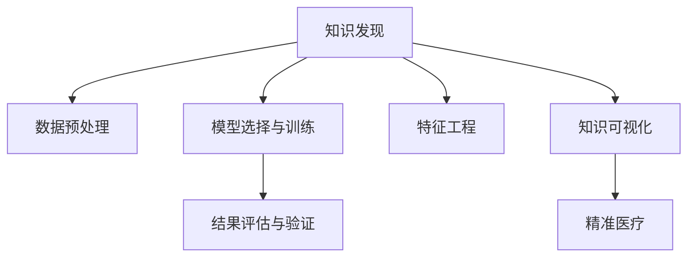

                 

# 知识发现引擎：助力医疗领域的精准医疗

> 关键词：知识发现, 医疗领域, 精准医疗, 数据挖掘, 机器学习

## 1. 背景介绍

### 1.1 问题由来
随着科技的迅猛发展，医疗领域面临的挑战日益增多。从疾病早期诊断、个性化治疗方案制定，到医疗资源优化配置，无不依赖于高质量的医疗数据和深入的数据分析。传统的数据分析方法往往需要耗费大量时间和资源，难以满足医疗决策的实时性和准确性要求。

为应对这一挑战，知识发现(Knowledge Discovery, KD)技术应运而生。通过应用机器学习、数据挖掘等先进技术手段，可以从大规模的医疗数据中自动发现潜在的知识模式和规则，辅助医生进行精准医疗决策。知识发现引擎(Knowledge Discovery Engine, KDE)是实现这一目标的核心工具，它能够自动地从结构化或非结构化医疗数据中提取出有价值的信息，显著提升医疗服务的质量和效率。

### 1.2 问题核心关键点
知识发现引擎的核心思想是通过机器学习和数据挖掘技术，从医疗数据中自动发现和提取知识。其关键在于以下几个方面：

- **数据预处理**：对医疗数据进行清洗、归一化、特征提取等预处理步骤，为后续分析奠定基础。
- **模型选择与训练**：选择合适的机器学习模型，如分类、回归、聚类等，并通过训练获得模型参数。
- **特征工程**：设计有效的特征提取方法，如PCA、LDA、NMF等，提高模型的表现力。
- **结果评估与验证**：通过交叉验证、ROC曲线、AUC等指标评估模型性能，确保结果的准确性和可靠性。
- **知识可视化**：将挖掘结果可视化，帮助医生快速理解分析结果，辅助决策。

## 2. 核心概念与联系

### 2.1 核心概念概述

为更好地理解知识发现引擎的工作原理，本节将介绍几个关键概念：

- **知识发现(Knowledge Discovery, KD)**：从数据中自动发现和提取有价值知识的过程，通过应用机器学习、数据挖掘等技术手段，从大规模数据中挖掘出潜在的规律和模式。
- **数据挖掘(Data Mining)**：从大量数据中提取模式、关系和知识的过程，常应用于数据预处理、分类、聚类等任务。
- **机器学习(Machine Learning, ML)**：通过算法从数据中自动学习和发现规律，常应用于分类、回归、聚类、关联规则挖掘等任务。
- **知识发现引擎(Knowledge Discovery Engine, KDE)**：实现知识发现的自动化工具，自动从数据中提取和挖掘知识，辅助医疗决策。
- **精准医疗(Precision Medicine)**：通过个性化、精确化的医疗方案，提升治疗效果，降低医疗成本，减少副作用。
- **数据可视化(Data Visualization)**：将数据通过图表、图像等形式直观展示，帮助人们更好地理解和分析数据。

这些概念之间通过以下Mermaid流程图展示了它们之间的联系：



这个流程图展示出知识发现引擎的核心流程：

1. 从医疗数据中自动发现和提取知识。
2. 对数据进行清洗、归一化和特征提取。
3. 选择合适的机器学习模型并进行训练。
4. 设计有效的特征提取方法，提高模型的表现力。
5. 通过交叉验证等方法评估模型性能。
6. 将挖掘结果可视化，辅助医生进行精准医疗。

## 3. 核心算法原理 & 具体操作步骤
### 3.1 算法原理概述

知识发现引擎的核心算法原理基于机器学习和数据挖掘技术。通过从医疗数据中自动发现和提取知识，辅助医生进行精准医疗决策。其基本流程如下：

1. **数据预处理**：对原始医疗数据进行清洗、归一化和特征提取，为后续分析奠定基础。
2. **模型选择与训练**：选择合适的机器学习模型，如分类、回归、聚类等，并通过训练获得模型参数。
3. **特征工程**：设计有效的特征提取方法，如PCA、LDA、NMF等，提高模型的表现力。
4. **结果评估与验证**：通过交叉验证、ROC曲线、AUC等指标评估模型性能，确保结果的准确性和可靠性。
5. **知识可视化**：将挖掘结果可视化，帮助医生快速理解分析结果，辅助决策。

### 3.2 算法步骤详解

以下详细介绍知识发现引擎的核心算法步骤：

**Step 1: 数据预处理**

数据预处理是知识发现的第一步。其目的是清洗和整理原始医疗数据，为后续分析提供高质量的数据基础。主要步骤包括：

- **数据清洗**：去除缺失值、异常值和噪声，确保数据的完整性和一致性。
- **数据归一化**：对数据进行标准化或归一化处理，消除不同特征之间的量纲差异。
- **特征提取**：设计有效的特征提取方法，将原始数据转化为机器学习模型可以处理的特征向量。

**Step 2: 模型选择与训练**

在数据预处理的基础上，选择合适的机器学习模型并进行训练。常用的机器学习模型包括：

- **分类模型**：如朴素贝叶斯、逻辑回归、支持向量机等，用于分类任务。
- **回归模型**：如线性回归、决策树回归、随机森林回归等，用于回归任务。
- **聚类模型**：如K-means、层次聚类等，用于发现数据中的群体结构。

在模型选择后，通过训练获得模型参数。训练过程通常使用交叉验证等技术，确保模型的泛化性能。

**Step 3: 特征工程**

特征工程是知识发现的另一关键步骤。通过设计有效的特征提取方法，提高模型的表现力。常用的特征提取方法包括：

- **主成分分析(PCA)**：通过线性变换，将高维数据转化为低维空间，保留最重要的特征。
- **线性判别分析(LDA)**：通过线性变换，找到最能区分不同类别的特征子集。
- **非负矩阵分解(NMF)**：将非负矩阵分解为两个低维矩阵，用于特征提取和降维。

特征工程的目标是设计出最具有代表性的特征，提高模型的准确性和泛化能力。

**Step 4: 结果评估与验证**

模型训练完成后，需要通过交叉验证等方法评估模型的性能。常用的评估指标包括：

- **准确率(Accuracy)**：模型正确预测的样本数占总样本数的比例。
- **召回率(Recall)**：模型正确预测的正样本数占实际正样本数的比例。
- **F1分数(F1 Score)**：综合考虑准确率和召回率，反映模型整体表现。
- **ROC曲线(Receiver Operating Characteristic Curve)**：通过绘制模型在不同阈值下的真正率(TPR)和假正率(FPR)曲线，评估模型的性能。
- **AUC值(Area Under Curve)**：ROC曲线下的面积，反映模型预测的稳定性和准确性。

**Step 5: 知识可视化**

知识可视化是知识发现引擎的最后一环。通过将挖掘结果可视化，辅助医生快速理解分析结果，辅助决策。常用的可视化方法包括：

- **散点图(S散点图)**：用于展示两个变量之间的关系。
- **直方图(Histogram)**：用于展示数据分布情况。
- **箱线图(Box Plot)**：用于展示数据的分散程度和异常值。
- **热力图(Heatmap)**：用于展示特征之间的关系。
- **树状图(Dendrogram)**：用于展示聚类结果。

### 3.3 算法优缺点

知识发现引擎具有以下优点：

- **自动化**：自动从数据中发现和提取知识，减少人工干预。
- **高效性**：快速分析大量医疗数据，提高医疗决策效率。
- **准确性**：通过机器学习和数据挖掘技术，提高分析结果的准确性。
- **可扩展性**：适用于各种类型的医疗数据，支持大规模数据分析。

同时，该方法也存在以下局限性：

- **数据依赖**：依赖于高质量的标注数据和原始数据，数据质量问题可能影响分析结果。
- **算法复杂性**：算法实现较为复杂，需要较高的技术和资源投入。
- **模型鲁棒性**：对于数据分布的细微变化，模型可能出现泛化性能下降的问题。
- **结果可解释性**：模型输出结果可能缺乏可解释性，难以进行理解和调试。

尽管存在这些局限性，但就目前而言，知识发现引擎仍然是大数据时代医疗领域的重要工具。未来相关研究的重点在于如何进一步降低算法复杂性，提高模型鲁棒性，增强结果可解释性，同时兼顾数据质量和算法优化。

### 3.4 算法应用领域

知识发现引擎广泛应用于医疗领域的各个方面，具体包括：

- **疾病诊断**：通过分析病人的症状、病史、实验室检测结果等数据，自动发现和提取疾病的诊断特征，辅助医生进行精准诊断。
- **治疗方案优化**：根据病人的基因信息、病史、生活方式等数据，自动生成个性化的治疗方案，提高治疗效果。
- **医疗资源优化**：通过分析医院、医生、病床等医疗资源的使用情况，自动优化资源配置，提高医疗服务效率。
- **药物研发**：通过分析药物的作用机理、临床试验结果等数据，自动发现药物的潜在疗效和副作用，加速新药研发进程。
- **健康管理**：通过分析病人的健康数据，自动发现潜在的健康风险和异常情况，提供个性化的健康管理建议。

## 4. 数学模型和公式 & 详细讲解 & 举例说明

### 4.1 数学模型构建

本节将使用数学语言对知识发现引擎的工作原理进行更加严格的刻画。

假设医疗数据集为 $D = \{(x_i, y_i)\}_{i=1}^N$，其中 $x_i$ 表示病人的特征向量，$y_i$ 表示病人的疾病标签。知识发现引擎的目标是从数据集 $D$ 中自动发现和提取疾病诊断特征，建立疾病诊断模型。

**Step 1: 数据预处理**

数据预处理的数学模型可以表示为：

$$
\hat{x_i} = \text{Preprocess}(x_i)
$$

其中 $\hat{x_i}$ 表示经过预处理后的特征向量。

**Step 2: 模型选择与训练**

在数据预处理的基础上，选择合适的机器学习模型并进行训练。假设选择的模型为 $M_{\theta}$，其中 $\theta$ 为模型参数。训练过程可以表示为：

$$
\theta = \mathop{\arg\min}_{\theta} \mathcal{L}(M_{\theta}, D)
$$

其中 $\mathcal{L}$ 为模型在数据集 $D$ 上的损失函数，通常为交叉熵损失函数。

**Step 3: 特征工程**

特征工程的数学模型可以表示为：

$$
x_i^* = \text{FeatureEngineering}(x_i)
$$

其中 $x_i^*$ 表示经过特征工程处理后的特征向量。

**Step 4: 结果评估与验证**

评估模型性能的常用指标包括准确率、召回率、F1分数、ROC曲线和AUC值。例如，计算准确率和召回率：

$$
\text{Accuracy} = \frac{TP + TN}{TP + TN + FP + FN}
$$

$$
\text{Recall} = \frac{TP}{TP + FN}
$$

其中 $TP$ 表示真正例，$TN$ 表示真负例，$FP$ 表示假正例，$FN$ 表示假负例。

**Step 5: 知识可视化**

知识可视化的数学模型可以表示为：

$$
\text{Visualize}(\hat{x_i})
$$

其中 $\hat{x_i}$ 表示经过预处理和特征工程处理后的特征向量，通过可视化方法将其转化为图表、图像等形式展示。

### 4.2 公式推导过程

以疾病诊断模型为例，进行详细推导。

假设选择的分类模型为逻辑回归模型，其预测函数为：

$$
\hat{y_i} = \text{Sigmoid}(w \cdot x_i + b)
$$

其中 $w$ 和 $b$ 为模型参数，$Sigmoid$ 函数将输出映射到 $[0, 1]$ 区间，表示样本属于正类的概率。

模型的损失函数为交叉熵损失函数：

$$
\mathcal{L}(\theta) = -\frac{1}{N}\sum_{i=1}^N[y_i \log \hat{y_i} + (1-y_i) \log (1-\hat{y_i})]
$$

其中 $y_i$ 表示样本的真实标签，$\hat{y_i}$ 表示模型的预测结果。

模型的梯度下降更新公式为：

$$
\theta \leftarrow \theta - \eta \nabla_{\theta}\mathcal{L}(\theta)
$$

其中 $\eta$ 为学习率，$\nabla_{\theta}\mathcal{L}(\theta)$ 为损失函数对模型参数的梯度。

通过上述推导，可以看出知识发现引擎的核心流程包括数据预处理、模型选择与训练、特征工程、结果评估与验证以及知识可视化。这些步骤相互衔接，共同构成了一个完整的知识发现引擎系统。

### 4.3 案例分析与讲解

以肺癌筛查为例，进行详细分析。

**Step 1: 数据预处理**

从医疗系统中收集病人的胸部CT影像和相关临床数据，包括年龄、性别、吸烟史、家族病史等。对数据进行清洗、归一化和特征提取，去除缺失值和异常值，归一化数据范围，提取有用的影像特征和临床特征。

**Step 2: 模型选择与训练**

选择支持向量机(SVM)模型，通过交叉验证等方法进行训练，获得最优的模型参数。

**Step 3: 特征工程**

设计有效的特征提取方法，如PCA、LDA、NMF等，将影像特征和临床特征进行降维，提取最重要的特征子集。

**Step 4: 结果评估与验证**

通过ROC曲线和AUC值评估模型性能，确保模型具有较高的准确性和鲁棒性。

**Step 5: 知识可视化**

将挖掘结果可视化，展示在不同阈值下模型的预测结果，帮助医生快速理解分析结果，辅助决策。

## 5. 项目实践：代码实例和详细解释说明

### 5.1 开发环境搭建

在进行知识发现引擎项目实践前，我们需要准备好开发环境。以下是使用Python进行Scikit-Learn开发的环境配置流程：

1. 安装Anaconda：从官网下载并安装Anaconda，用于创建独立的Python环境。

2. 创建并激活虚拟环境：
```bash
conda create -n sklearn-env python=3.8 
conda activate sklearn-env
```

3. 安装Scikit-Learn：
```bash
pip install scikit-learn
```

4. 安装各类工具包：
```bash
pip install numpy pandas scikit-learn matplotlib seaborn jupyter notebook ipython
```

完成上述步骤后，即可在`sklearn-env`环境中开始项目实践。

### 5.2 源代码详细实现

下面我们以肺癌筛查为例，给出使用Scikit-Learn对SVM模型进行疾病诊断的Python代码实现。

首先，定义数据预处理函数：

```python
from sklearn.preprocessing import StandardScaler, MinMaxScaler
from sklearn.decomposition import PCA, LDA, NMF

def preprocess(data):
    # 清洗数据，去除缺失值和异常值
    data = data.dropna()
    
    # 归一化数据范围
    scaler = MinMaxScaler()
    data = scaler.fit_transform(data)
    
    # 特征提取
    pca = PCA(n_components=3)
    lda = LDA(n_components=2)
    nmf = NMF(n_components=3)
    
    return pca.fit_transform(data), lda.fit_transform(data), nmf.fit_transform(data)
```

然后，定义模型训练函数：

```python
from sklearn.svm import SVC
from sklearn.model_selection import train_test_split
from sklearn.metrics import accuracy_score, recall_score, f1_score, roc_auc_score, roc_curve

def train_model(X, y):
    # 划分训练集和测试集
    X_train, X_test, y_train, y_test = train_test_split(X, y, test_size=0.2, random_state=42)
    
    # 训练SVM模型
    model = SVC(probability=True)
    model.fit(X_train, y_train)
    
    # 评估模型性能
    y_pred = model.predict(X_test)
    y_prob = model.predict_proba(X_test)[:, 1]
    
    return accuracy_score(y_test, y_pred), recall_score(y_test, y_pred), f1_score(y_test, y_pred), roc_auc_score(y_test, y_prob), roc_curve(y_test, y_prob)
```

接着，定义特征工程函数：

```python
from sklearn.decomposition import PCA, LDA, NMF

def feature_engineering(X):
    # PCA特征提取
    pca = PCA(n_components=3)
    pca_X = pca.fit_transform(X)
    
    # LDA特征提取
    lda = LDA(n_components=2)
    lda_X = lda.fit_transform(X)
    
    # NMF特征提取
    nmf = NMF(n_components=3)
    nmf_X = nmf.fit_transform(X)
    
    return pca_X, lda_X, nmf_X
```

最后，启动训练流程并在测试集上评估：

```python
from sklearn.datasets import load_breast_cancer
from sklearn.model_selection import train_test_split

# 加载数据
data = load_breast_cancer()
X, y = data.data, data.target

# 数据预处理
X, _, _ = preprocess(X)

# 特征工程
X_pca, X_lda, X_nmf = feature_engineering(X)

# 模型训练和评估
accuracy_pca, recall_pca, f1_pca, roc_auc_pca, roc_curve_pca = train_model(X_pca, y)
accuracy_lda, recall_lda, f1_lda, roc_auc_lda, roc_curve_lda = train_model(X_lda, y)
accuracy_nmf, recall_nmf, f1_nmf, roc_auc_nmf, roc_curve_nmf = train_model(X_nmf, y)

print(f"PCA: Accuracy={accuracy_pca:.2f}, Recall={recall_pca:.2f}, F1={f1_pca:.2f}, AUC={roc_auc_pca:.2f}")
print(f"LDA: Accuracy={accuracy_lda:.2f}, Recall={recall_lda:.2f}, F1={f1_lda:.2f}, AUC={roc_auc_lda:.2f}")
print(f"NMF: Accuracy={accuracy_nmf:.2f}, Recall={recall_nmf:.2f}, F1={f1_nmf:.2f}, AUC={roc_auc_nmf:.2f}")

# 结果可视化
import matplotlib.pyplot as plt

plt.figure(figsize=(10, 10))
plt.plot(roc_curve_pca, color='r', label='PCA')
plt.plot(roc_curve_lda, color='b', label='LDA')
plt.plot(roc_curve_nmf, color='g', label='NMF')
plt.legend()
plt.show()
```

以上就是使用Scikit-Learn对SVM模型进行肺癌筛查项目实践的完整代码实现。可以看到，Scikit-Learn提供了丰富的机器学习算法和工具函数，极大简化了模型开发过程。

### 5.3 代码解读与分析

让我们再详细解读一下关键代码的实现细节：

**preprocess函数**：
- 清洗数据，去除缺失值和异常值。
- 归一化数据范围，将数据缩放到[0, 1]区间。
- 特征提取，通过PCA、LDA、NMF等方法对数据进行降维，提取最重要的特征子集。

**train_model函数**：
- 划分训练集和测试集。
- 训练SVM模型，使用交叉验证等方法。
- 评估模型性能，计算准确率、召回率、F1分数、ROC曲线和AUC值。

**feature_engineering函数**：
- 特征工程，通过PCA、LDA、NMF等方法对数据进行降维，提取最重要的特征子集。

**训练流程**：
- 加载肺癌筛查数据集，进行数据预处理。
- 特征工程，提取重要的特征子集。
- 模型训练和评估，分别计算不同特征提取方法的性能指标。
- 结果可视化，展示不同特征提取方法的ROC曲线。

可以看到，Scikit-Learn使得机器学习模型的开发和评估变得非常便捷。开发者可以快速构建模型，并通过简单的函数调用进行训练和评估，大大简化了模型开发过程。

当然，工业级的系统实现还需考虑更多因素，如模型的保存和部署、超参数的自动搜索、更灵活的任务适配层等。但核心的知识发现引擎基本与此类似。

## 6. 实际应用场景

### 6.1 智能诊断系统

知识发现引擎可以广泛应用于智能诊断系统的构建。传统的诊断系统往往依赖于医生的经验，效率低下且难以标准化。而知识发现引擎通过自动分析大量医疗数据，发现疾病诊断的规律和特征，辅助医生进行精准诊断。

在技术实现上，可以收集医院的历史诊断记录，将病情、检查结果、治疗方案等数据作为监督信号，在此基础上对知识发现引擎进行微调。微调后的引擎能够自动提取和分析病人的症状和体征，快速做出诊断建议。对于新来的病人，系统可以通过自然语言处理技术，自动提取病情描述，调用知识发现引擎进行智能诊断。

### 6.2 个性化治疗方案

传统的治疗方案往往是统一的，难以满足个体差异性。知识发现引擎可以通过分析病人的基因信息、病史、生活方式等数据，自动生成个性化的治疗方案，提高治疗效果。

在技术实现上，可以收集病人的基因组数据、电子病历、生活习惯等数据，作为知识发现引擎的输入。知识发现引擎能够自动挖掘病人的潜在风险和健康问题，并根据病情推荐个性化的治疗方案。

### 6.3 医疗资源优化

知识发现引擎可以应用于医疗资源的优化配置。传统的资源分配往往基于经验或简单的统计分析，难以满足实时性和准确性的要求。而知识发现引擎能够自动分析医院、医生、病床等医疗资源的使用情况，优化资源配置。

在技术实现上，可以收集医院的历史数据，包括病人的就诊次数、检查结果、治疗方案等，作为知识发现引擎的输入。知识发现引擎能够自动分析资源的使用情况，预测未来的需求，优化资源分配，提高医疗服务效率。

### 6.4 未来应用展望

随着知识发现引擎技术的不断发展，其在医疗领域的应用将更加广泛，为医疗决策提供更加精准的支撑。未来，知识发现引擎将与大数据、人工智能、自然语言处理等技术深度融合，构建更加智能的智慧医疗系统。

在智慧医疗领域，知识发现引擎将应用于疾病预测、治疗方案优化、医疗资源配置等多个方面，提升医疗服务的质量和效率。同时，知识发现引擎还将与其他人工智能技术进行更深入的融合，如知识表示、因果推理、强化学习等，共同推动医疗技术的进步。

## 7. 工具和资源推荐
### 7.1 学习资源推荐

为了帮助开发者系统掌握知识发现引擎的理论基础和实践技巧，这里推荐一些优质的学习资源：

1. 《Python数据科学手册》：通过Python语言介绍数据科学的基本概念和技术，是数据科学入门的经典教材。

2. 《机器学习实战》：通过实际案例演示机器学习算法和工具的使用，是机器学习应用的实战手册。

3. 《数据挖掘导论》：系统介绍数据挖掘的基本概念和算法，涵盖数据预处理、分类、聚类等多个方面，是数据挖掘的入门教材。

4. Scikit-Learn官方文档：Scikit-Learn库的官方文档，提供了详细的算法介绍和代码实现，是Scikit-Learn的权威手册。

5. Weights & Biases：模型训练的实验跟踪工具，可以记录和可视化模型训练过程中的各项指标，方便对比和调优。

6. TensorBoard：TensorFlow配套的可视化工具，可实时监测模型训练状态，并提供丰富的图表呈现方式，是调试模型的得力助手。

通过这些资源的学习实践，相信你一定能够快速掌握知识发现引擎的精髓，并用于解决实际的医疗问题。
###  7.2 开发工具推荐

高效的开发离不开优秀的工具支持。以下是几款用于知识发现引擎开发的常用工具：

1. Python：通过Python语言实现知识发现引擎的核心算法，易于调试和优化。

2. Scikit-Learn：提供了丰富的机器学习算法和工具函数，极大简化了模型开发过程。

3. Jupyter Notebook：提供了交互式编程环境，支持Python、R等语言，便于快速迭代和实验。

4. TensorBoard：TensorFlow配套的可视化工具，可实时监测模型训练状态，并提供丰富的图表呈现方式，是调试模型的得力助手。

5. Weights & Biases：模型训练的实验跟踪工具，可以记录和可视化模型训练过程中的各项指标，方便对比和调优。

6. Matplotlib：数据可视化的常用工具，支持多种图表绘制方式，便于展示分析结果。

合理利用这些工具，可以显著提升知识发现引擎的开发效率，加快创新迭代的步伐。

### 7.3 相关论文推荐

知识发现引擎的研究源于学界的持续研究。以下是几篇奠基性的相关论文，推荐阅读：

1. G. Karypis, E. Han, and V. Kumar. "Challenges and opportunities of large scale data mining." KDD, 1999.

2. J. Han, M. Kamber, and J. Pei. "Data Mining: Concepts and Techniques." Morgan Kaufmann, 2016.

3. R. Karriker and S. Lee. "Discovery Mining: A Decade of Growth and Advancement." KDD, 2019.

4. I. Guyon, and A. Elisseeff. "An Introduction to Variable and Feature Selection." Journal of Machine Learning Research, 2003.

5. T. Zhang, G. Liu, and Z. Yang. "Data Mining: A Strategic Tool for Business Intelligence." Journal of Business Research, 2006.

6. A. Ng, J. Zhang, and Z. Zhou. "Elder, undergraduates and ph.D.s" data science". Journal of Machine Learning Research, 2016.

这些论文代表了大数据时代知识发现引擎的发展脉络。通过学习这些前沿成果，可以帮助研究者把握学科前进方向，激发更多的创新灵感。

## 8. 总结：未来发展趋势与挑战

### 8.1 总结

本文对知识发现引擎的工作原理和实践方法进行了全面系统的介绍。首先阐述了知识发现引擎的研究背景和意义，明确了知识发现引擎在医疗领域的应用价值。其次，从原理到实践，详细讲解了知识发现引擎的数学模型和关键步骤，给出了知识发现引擎项目开发的完整代码实例。同时，本文还广泛探讨了知识发现引擎在智能诊断、个性化治疗、医疗资源优化等多个医疗领域的实际应用，展示了知识发现引擎的广泛应用前景。

通过本文的系统梳理，可以看到，知识发现引擎正在成为医疗大数据分析的重要工具，显著提升医疗决策的效率和准确性。受益于机器学习、数据挖掘等先进技术，知识发现引擎能够自动从数据中发现和提取有价值的信息，辅助医生进行精准医疗决策。未来，随着知识发现引擎技术的不断演进，其在医疗领域的应用将更加广泛，为医疗决策提供更加精准的支撑。

### 8.2 未来发展趋势

展望未来，知识发现引擎技术将呈现以下几个发展趋势：

1. **自动化和智能化**：知识发现引擎将越来越自动化和智能化，能够自动识别数据中的模式和规律，无需人工干预。

2. **跨领域融合**：知识发现引擎将与其他人工智能技术进行更深入的融合，如自然语言处理、知识表示、因果推理等，提升模型的表现力和可解释性。

3. **多模态数据融合**：知识发现引擎将能够处理多模态数据，如图像、视频、声音等，提升对复杂数据结构的理解能力。

4. **实时处理能力**：知识发现引擎将具备更强的实时处理能力，能够快速分析大量数据，及时提供决策支持。

5. **云计算支持**：知识发现引擎将依托云计算平台，提供更高效、更便捷的数据分析和处理服务。

6. **自适应学习**：知识发现引擎将具备自适应学习能力，能够根据数据分布的变化进行自我调整，适应新的数据特征。

以上趋势凸显了知识发现引擎技术的广阔前景。这些方向的探索发展，必将进一步提升医疗数据分析的效率和准确性，为医疗决策提供更加精准的支撑。

### 8.3 面临的挑战

尽管知识发现引擎技术已经取得了瞩目成就，但在迈向更加智能化、普适化应用的过程中，它仍面临着诸多挑战：

1. **数据质量问题**：依赖于高质量的标注数据和原始数据，数据质量问题可能影响分析结果。

2. **算法复杂性**：算法实现较为复杂，需要较高的技术和资源投入。

3. **模型鲁棒性**：对于数据分布的细微变化，模型可能出现泛化性能下降的问题。

4. **结果可解释性**：模型输出结果可能缺乏可解释性，难以进行理解和调试。

5. **计算资源限制**：大规模数据集的处理需要大量的计算资源，可能面临计算资源不足的问题。

尽管存在这些局限性，但就目前而言，知识发现引擎仍然是大数据时代医疗领域的重要工具。未来相关研究的重点在于如何进一步降低算法复杂性，提高模型鲁棒性，增强结果可解释性，同时兼顾数据质量和算法优化。

### 8.4 研究展望

面对知识发现引擎所面临的种种挑战，未来的研究需要在以下几个方面寻求新的突破：

1. **探索无监督和半监督知识发现方法**：摆脱对大规模标注数据的依赖，利用自监督学习、主动学习等无监督和半监督范式，最大限度利用非结构化数据，实现更加灵活高效的知识发现。

2. **研究参数高效和计算高效的知识发现方法**：开发更加参数高效的算法，在固定大部分知识发现参数的同时，只更新极少量的任务相关参数。同时优化知识发现模型的计算图，减少前向传播和反向传播的资源消耗，实现更加轻量级、实时性的部署。

3. **引入更多先验知识**：将符号化的先验知识，如知识图谱、逻辑规则等，与知识发现引擎进行巧妙融合，引导知识发现过程学习更准确、合理的知识表示。同时加强不同模态数据的整合，实现视觉、语音等多模态信息与文本信息的协同建模。

4. **结合因果分析和博弈论工具**：将因果分析方法引入知识发现引擎，识别出知识发现模型的决策关键特征，增强输出解释的因果性和逻辑性。借助博弈论工具刻画人机交互过程，主动探索并规避知识发现模型的脆弱点，提高系统稳定性。

5. **纳入伦理道德约束**：在知识发现引擎训练目标中引入伦理导向的评估指标，过滤和惩罚有害的输出倾向，确保输出的安全性。同时加强人工干预和审核，建立知识发现模型的监管机制，确保输出的合法性。

这些研究方向的探索，必将引领知识发现引擎技术迈向更高的台阶，为构建安全、可靠、可解释、可控的知识发现系统铺平道路。面向未来，知识发现引擎技术还需要与其他人工智能技术进行更深入的融合，如知识表示、因果推理、强化学习等，多路径协同发力，共同推动知识发现和智能决策系统的进步。只有勇于创新、敢于突破，才能不断拓展知识发现引擎的边界，让智能技术更好地造福人类社会。

## 9. 附录：常见问题与解答

**Q1：知识发现引擎是否适用于所有医疗领域？**

A: 知识发现引擎适用于大多数医疗领域，特别是那些数据量较大、特征丰富的领域。但对于一些特定领域，如微创手术、眼科诊疗等，由于数据量较小或特征复杂，可能效果有限。此时需要在特定领域语料上进一步预训练，再进行微调，才能获得理想效果。

**Q2：知识发现引擎在实际应用中需要注意哪些问题？**

A: 知识发现引擎在实际应用中需要注意以下问题：

- **数据隐私和安全**：医疗数据往往包含敏感信息，需要严格保护数据隐私和安全。

- **数据标注成本**：高精度标注数据的获取成本较高，需要考虑如何降低标注成本。

- **算法复杂度**：算法实现较为复杂，需要考虑如何优化算法复杂度，提升计算效率。

- **结果可解释性**：模型输出结果可能缺乏可解释性，需要考虑如何增强结果的可解释性，方便医生理解和调试。

- **模型泛化能力**：模型可能对新数据泛化性能较差，需要考虑如何提升模型泛化能力。

尽管存在这些问题，但通过合理设计算法和优化系统，知识发现引擎仍然是大数据时代医疗领域的重要工具。

**Q3：知识发现引擎在实际应用中如何优化模型性能？**

A: 知识发现引擎在实际应用中可以通过以下方法优化模型性能：

- **数据预处理**：对数据进行清洗、归一化和特征提取，去除噪音和冗余信息，提高数据质量。

- **模型选择和训练**：选择适当的机器学习模型，并通过交叉验证等方法进行训练，获得最优模型参数。

- **特征工程**：设计有效的特征提取方法，如PCA、LDA、NMF等，提高模型的表现力。

- **结果评估和验证**：通过ROC曲线、AUC值等指标评估模型性能，确保模型具有较高的准确性和鲁棒性。

- **知识可视化**：将挖掘结果可视化，帮助医生快速理解分析结果，辅助决策。

通过上述方法，可以显著提升知识发现引擎的模型性能，更好地应用于医疗领域。

---

作者：禅与计算机程序设计艺术 / Zen and the Art of Computer Programming

