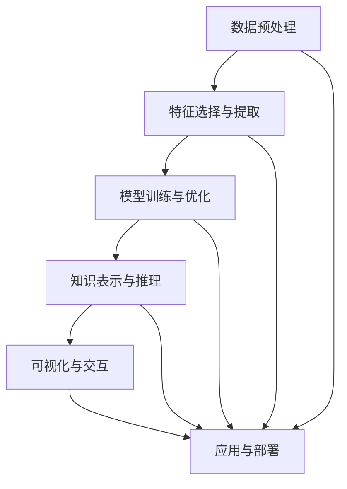
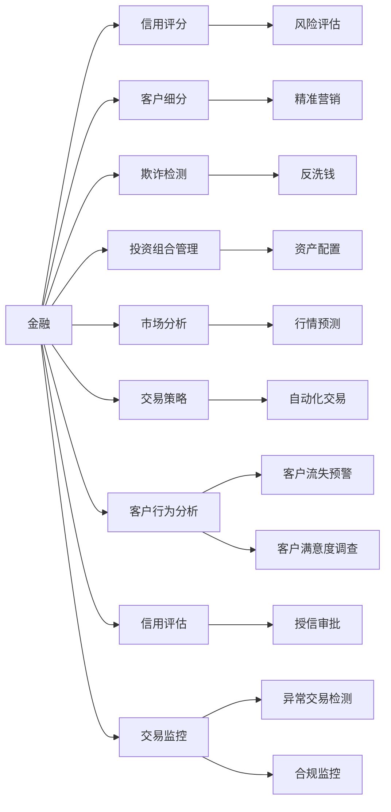

                 

## 1. 背景介绍

### 1.1 问题由来
在当今信息爆炸的时代，如何从海量数据中挖掘出有价值的信息，是各行业面临的共同难题。数据本身是资源，但真正的价值在于从数据中提取的知识和洞察。知识发现引擎(Knowledge Discovery Engine, KDE)旨在通过对数据和知识的协同处理，辅助决策者发现数据背后的规律，从而作出更为明智的判断。

知识发现引擎的研究和应用经历了从早期基于规则的方法，到基于统计学和机器学习的方法，再到现代基于深度学习的方法的发展过程。这一过程反映了人们对数据挖掘和知识发现技术认识的不断深入。

### 1.2 问题核心关键点
知识发现引擎的核心关键点包括以下几个方面：

- **数据集成与预处理**：数据往往来自不同的源，格式和质量差异较大，需要将其整合、清洗、转换，以适合后续分析和处理。

- **特征选择与提取**：从原始数据中提取有用的特征，用于模型的训练和预测。

- **模型训练与优化**：使用各种统计学和机器学习方法构建和优化模型，提高其准确性和泛化能力。

- **知识表示与推理**：将提取的知识转化为结构化的形式，便于存储和推理，如本体、图谱、逻辑规则等。

- **可视化与交互**：通过可视化界面，辅助决策者理解和应用发现的规律。

- **应用与部署**：将知识发现引擎的结果应用于实际场景，进行预测、推荐、监控等任务，并不断迭代优化。

这些关键点共同构成了一个完整的知识发现引擎，能够从数据中抽取知识，并提供有价值的洞察。

### 1.3 问题研究意义
构建知识发现引擎，对于提升企业的数据驱动决策能力，加速信息社会的建设，具有重要意义：

1. **提升决策准确性**：通过对大量数据进行分析，发现数据背后的规律和趋势，提供数据支持，帮助决策者做出更准确的判断。

2. **提高业务效率**：自动化的数据处理和分析流程，减少人工操作，提升效率。

3. **促进创新**：发现新的模式和知识，为产品和服务的创新提供参考。

4. **优化资源配置**：通过预测分析，优化资源配置，减少浪费。

5. **增强竞争力**：企业通过知识发现引擎的辅助，提升其在市场中的竞争力和战略优势。

## 2. 核心概念与联系

### 2.1 核心概念概述

知识发现引擎是数据挖掘与人工智能结合的产物，旨在通过自动化的方法，从数据中发现规律和模式，辅助决策者制定更加科学的决策。核心概念包括：

- **数据预处理**：清洗、转换数据，以便于模型处理。

- **特征选择与提取**：从原始数据中提取有用的特征。

- **模型训练与优化**：使用统计学和机器学习技术构建和优化模型。

- **知识表示与推理**：将知识转化为结构化的形式，用于存储和推理。

- **可视化与交互**：通过可视化界面，展示分析结果，便于理解与应用。

- **应用与部署**：将知识发现引擎的结果应用于实际业务场景。

这些核心概念通过协同工作，形成一个完整的知识发现引擎系统，如图2所示。



### 2.2 核心概念原理和架构的 Mermaid 流程图

为了更好地理解知识发现引擎的各个组件之间的联系和作用，我们通过Mermaid绘制了其核心概念原理和架构的流程图，如图2所示。


这个流程图展示了从数据预处理开始，到应用与部署结束的全过程。各组件通过数据流和控制流协同工作，实现数据的转换、模型的训练、知识的表示和应用。

## 3. 核心算法原理 & 具体操作步骤

### 3.1 算法原理概述

知识发现引擎的核心算法原理主要包括以下几个方面：

- **数据预处理**：使用统计学方法和数据清洗技术，处理缺失值、异常值等问题，将数据转换为模型所需的格式。

- **特征选择与提取**：采用各种特征工程技术，如主成分分析(PCA)、因子分析(FA)、线性判别分析(LDA)等，从原始数据中提取有意义的特征。

- **模型训练与优化**：使用统计学习、机器学习和深度学习等方法，构建和优化模型。常用的模型包括决策树、随机森林、支持向量机、神经网络等。

- **知识表示与推理**：将模型输出的结果，转化为本体、图谱、逻辑规则等结构化知识，便于存储和推理。

- **可视化与交互**：使用可视化工具，如Tableau、Power BI等，展示分析结果，便于决策者理解与应用。

- **应用与部署**：将知识发现引擎的结果应用于实际场景，进行预测、推荐、监控等任务，并通过A/B测试等方法不断优化模型。

### 3.2 算法步骤详解

知识发现引擎的构建过程包括以下几个关键步骤：

**Step 1: 数据预处理**

数据预处理是知识发现引擎的首个步骤，主要包括以下几个环节：

1. **数据清洗**：识别并处理缺失值、重复值、异常值等问题，保证数据的完整性和一致性。

2. **数据转换**：将数据从原始格式转换为适合模型处理的形式，如归一化、标准化、离散化等。

3. **数据采样**：使用随机采样、分层采样等方法，对数据集进行划分和重采样，确保数据集的代表性和泛化能力。

**Step 2: 特征选择与提取**

特征选择与提取是知识发现引擎的重要步骤，主要包括以下几个环节：

1. **特征提取**：从原始数据中提取有用的特征，如统计特征、文本特征、图像特征等。

2. **特征选择**：使用特征选择算法，如过滤式方法、包裹式方法、嵌入式方法等，筛选出对模型预测有帮助的特征。

3. **特征降维**：使用降维技术，如主成分分析(PCA)、线性判别分析(LDA)等，将高维特征空间转化为低维特征空间，减少计算复杂度和模型复杂度。

**Step 3: 模型训练与优化**

模型训练与优化是知识发现引擎的核心步骤，主要包括以下几个环节：

1. **模型选择**：根据任务类型和数据特点，选择合适的模型，如回归模型、分类模型、聚类模型等。

2. **模型训练**：使用训练数据集，训练模型参数，最小化损失函数。

3. **模型优化**：使用正则化、早停法、交叉验证等方法，优化模型参数，提高模型泛化能力。

**Step 4: 知识表示与推理**

知识表示与推理是知识发现引擎的重要组成部分，主要包括以下几个环节：

1. **知识表示**：将模型输出的结果，转化为结构化的形式，如本体、图谱、逻辑规则等。

2. **知识推理**：使用推理算法，如逻辑推理、基于图谱的推理、基于规则的推理等，对知识进行推理和验证。

**Step 5: 可视化与交互**

可视化与交互是知识发现引擎的重要环节，主要包括以下几个环节：

1. **数据可视化**：使用可视化工具，如Tableau、Power BI等，展示模型输出结果，便于决策者理解与应用。

2. **交互界面**：设计友好的交互界面，允许用户输入数据、调整参数、选择模型等，提高用户使用体验。

**Step 6: 应用与部署**

应用与部署是知识发现引擎的最终步骤，主要包括以下几个环节：

1. **模型部署**：将训练好的模型部署到实际应用场景中，如网站、手机应用、智能设备等。

2. **模型监控**：使用监控工具，如TensorBoard、Prometheus等，实时监测模型性能，及时发现和解决问题。

3. **模型优化**：使用在线学习、增量学习等方法，不断优化模型，适应数据分布的变化。

### 3.3 算法优缺点

知识发现引擎的构建和应用过程中，存在以下优缺点：

**优点**：

1. **自动化**：知识发现引擎能够自动化地处理数据、提取特征、训练模型等，减少了人工操作的成本和错误。

2. **高泛化能力**：通过选择合适的模型和优化方法，知识发现引擎具有较高的泛化能力，能够适应新数据和场景。

3. **灵活性**：知识发现引擎能够适应不同的业务需求，灵活调整模型和参数，适应不同的数据类型和数据量。

4. **可解释性**：通过可视化与交互，决策者能够理解和应用知识发现引擎的结果，提高决策的透明度和可信度。

5. **可扩展性**：知识发现引擎可以扩展到多个领域和多个任务，为企业的数字化转型提供支持。

**缺点**：

1. **数据依赖**：知识发现引擎的效果很大程度上依赖于数据的质量和数量，获取高质量标注数据的成本较高。

2. **模型复杂性**：构建和优化复杂模型需要大量的计算资源和时间，且存在过拟合的风险。

3. **可解释性不足**：复杂的深度学习模型通常缺乏可解释性，决策者难以理解模型的内部机制。

4. **隐私与安全**：在数据处理和存储过程中，可能存在隐私泄露和数据安全问题，需要设计合适的数据保护机制。

5. **维护成本**：知识发现引擎需要定期维护和更新，以适应数据分布的变化和业务需求的调整，维护成本较高。

### 3.4 算法应用领域

知识发现引擎的应用领域广泛，涵盖各个行业，如图3所示。



以上各场景只是冰山一角，实际上，知识发现引擎在医疗、零售、制造、物流等多个领域都有广泛的应用。

## 4. 数学模型和公式 & 详细讲解 & 举例说明

### 4.1 数学模型构建

知识发现引擎的核心数学模型包括以下几个方面：

- **回归模型**：用于预测数值型数据的模型，如线性回归、多项式回归等。

- **分类模型**：用于分类数据的模型，如决策树、随机森林、支持向量机、神经网络等。

- **聚类模型**：用于将数据划分为多个相似组的模型，如K-Means、层次聚类等。

- **降维模型**：用于降低数据维度的模型，如主成分分析(PCA)、线性判别分析(LDA)等。

- **时间序列模型**：用于处理时间序列数据的模型，如ARIMA、季节性分解时间序列(SSTA)等。

- **图谱模型**：用于处理图结构数据的模型，如图神经网络(GNN)、图卷积网络(GCN)等。

### 4.2 公式推导过程

以线性回归模型为例，介绍其公式推导过程。

假设给定一个线性回归模型：

$$
y = \beta_0 + \beta_1 x_1 + \beta_2 x_2 + \cdots + \beta_n x_n + \epsilon
$$

其中 $y$ 为预测值，$x_1, x_2, \cdots, x_n$ 为自变量，$\beta_0, \beta_1, \beta_2, \cdots, \beta_n$ 为回归系数，$\epsilon$ 为误差项。

对于给定的训练数据集 $\{(x_i, y_i)\}_{i=1}^n$，其中 $x_i = (x_{i1}, x_{i2}, \cdots, x_{in})$，$y_i$ 为实际值，$\hat{y}_i$ 为预测值。

最小化均方误差损失函数：

$$
L(\beta) = \frac{1}{2n} \sum_{i=1}^n (y_i - \hat{y}_i)^2
$$

其中 $\hat{y}_i = \beta_0 + \beta_1 x_{i1} + \beta_2 x_{i2} + \cdots + \beta_n x_{in}$。

求解上述最小化问题，使用梯度下降法：

$$
\beta_j = \beta_j - \eta \frac{1}{n} \sum_{i=1}^n (y_i - \hat{y}_i) x_{ij}
$$

其中 $\eta$ 为学习率。

### 4.3 案例分析与讲解

以信用评分为例，介绍知识发现引擎的应用。

信用评分是金融机构评估客户信用风险的重要工具，通过构建信用评分模型，预测客户的违约概率，帮助金融机构制定合理的授信策略，降低坏账率。

构建信用评分模型的步骤如下：

1. **数据预处理**：收集客户的个人信息、贷款记录、还款记录等数据，进行清洗和转换。

2. **特征选择与提取**：提取客户的年龄、性别、职业、收入、信用记录、贷款余额等特征。

3. **模型训练与优化**：使用逻辑回归、决策树、随机森林等模型，训练信用评分模型，最小化损失函数，优化模型参数。

4. **知识表示与推理**：将训练好的模型转化为规则和图谱，用于解释模型的决策过程。

5. **可视化与交互**：设计友好的可视化界面，展示模型的输出结果，便于决策者理解与应用。

6. **应用与部署**：将训练好的模型部署到金融机构的信息系统中，进行实时预测和监控。

## 5. 项目实践：代码实例和详细解释说明

### 5.1 开发环境搭建

在使用Python进行知识发现引擎开发的过程中，需要先搭建好开发环境。以下是使用Python进行Scikit-learn开发的环境配置流程：

1. 安装Anaconda：从官网下载并安装Anaconda，用于创建独立的Python环境。

2. 创建并激活虚拟环境：
```bash
conda create -n sklearn-env python=3.8 
conda activate sklearn-env
```

3. 安装Scikit-learn：
```bash
pip install scikit-learn
```

4. 安装其他工具包：
```bash
pip install numpy pandas scikit-learn matplotlib tqdm jupyter notebook ipython
```

完成上述步骤后，即可在`sklearn-env`环境中开始知识发现引擎的开发。

### 5.2 源代码详细实现

下面以信用评分为例，给出使用Scikit-learn构建和优化信用评分模型的代码实现。

首先，定义数据集和标签：

```python
import pandas as pd
from sklearn.model_selection import train_test_split

data = pd.read_csv('credit_data.csv')
X = data.drop(['default'], axis=1)
y = data['default']
X_train, X_test, y_train, y_test = train_test_split(X, y, test_size=0.2, random_state=42)
```

然后，定义模型并进行训练和评估：

```python
from sklearn.linear_model import LogisticRegression
from sklearn.metrics import roc_auc_score
from sklearn.model_selection import GridSearchCV

model = LogisticRegression()

# 定义超参数搜索范围
param_grid = {
    'C': [0.001, 0.01, 0.1, 1, 10, 100],
    'penalty': ['l1', 'l2'],
    'solver': ['liblinear', 'lbfgs', 'newton-cg', 'sag', 'saga', 'random_telda']
}

# 网格搜索优化
grid_search = GridSearchCV(model, param_grid, cv=5, scoring='roc_auc')
grid_search.fit(X_train, y_train)

# 输出最优超参数
print(grid_search.best_params_)

# 使用最优超参数进行模型训练
model = LogisticRegression(C=grid_search.best_params_['C'], penalty=grid_search.best_params_['penalty'], solver=grid_search.best_params_['solver'])
model.fit(X_train, y_train)

# 模型评估
y_pred = model.predict_proba(X_test)[:, 1]
roc_auc = roc_auc_score(y_test, y_pred)
print(f"ROC-AUC: {roc_auc}")
```

以上就是使用Scikit-learn构建和优化信用评分模型的完整代码实现。可以看到，Scikit-learn提供了丰富的模型选择和参数优化工具，极大地方便了知识发现引擎的开发。

### 5.3 代码解读与分析

让我们再详细解读一下关键代码的实现细节：

**数据预处理**：
- `pd.read_csv`方法：用于读取CSV格式的数据集。
- `X.drop(['default'], axis=1)`方法：用于删除数据集中的目标变量，得到特征变量。
- `train_test_split`方法：用于将数据集划分为训练集和测试集。

**模型训练与优化**：
- `LogisticRegression`方法：用于构建逻辑回归模型。
- `GridSearchCV`方法：用于网格搜索超参数，寻找最优的模型参数组合。
- `grid_search.best_params_`属性：用于获取最优超参数。

**模型评估**：
- `model.predict_proba`方法：用于计算模型在测试集上的预测概率。
- `roc_auc_score`方法：用于计算模型的ROC-AUC指标。

**代码实现**：
- 首先，使用`pd.read_csv`方法读取数据集，并将其分为特征变量和目标变量。
- 接着，使用`train_test_split`方法将数据集划分为训练集和测试集。
- 然后，使用`LogisticRegression`方法构建逻辑回归模型，并设置超参数搜索范围。
- 使用`GridSearchCV`方法进行网格搜索，找到最优的模型参数组合。
- 最后，使用最优的超参数重新训练模型，并在测试集上进行评估，计算ROC-AUC指标。

通过上述步骤，我们实现了基于Scikit-learn的信用评分模型的构建和优化。Scikit-learn提供了简单易用的API和丰富的模型选择，使得知识发现引擎的开发变得更加快捷和高效。

## 6. 实际应用场景

### 6.1 金融信用评分

在金融领域，信用评分是评估客户信用风险的重要工具。通过构建信用评分模型，金融机构能够预测客户的违约概率，制定合理的授信策略，降低坏账率。

具体应用场景包括：
- **信用申请审批**：根据客户的信用评分，决定是否批准其信用申请。
- **贷款额度控制**：根据客户的信用评分，确定其贷款额度。
- **风险预警与管控**：根据客户的信用评分，预测其违约风险，及时采取风险控制措施。

### 6.2 医疗诊断与预测

在医疗领域，知识发现引擎可以帮助医生进行疾病的诊断和治疗方案的预测。通过构建医疗诊断模型，医生可以预测患者患病的概率，制定合适的治疗方案。

具体应用场景包括：
- **疾病诊断**：根据患者的症状和历史病历，预测其是否患有某种疾病。
- **治疗方案预测**：根据患者的病情和历史病历，预测其最佳治疗方案。
- **患者风险评估**：根据患者的病情和历史病历，预测其复发风险。

### 6.3 零售客户细分与精准营销

在零售领域，知识发现引擎可以帮助企业进行客户细分和精准营销。通过构建客户细分模型，企业可以识别出不同特征的客户群体，制定有针对性的营销策略。

具体应用场景包括：
- **客户细分**：根据客户的购买行为和历史数据，将其分为不同的客户群体。
- **精准营销**：根据客户的特征，制定有针对性的营销策略，提升营销效果。
- **客户流失预警**：根据客户的购买行为和历史数据，预测其流失风险，及时采取挽留措施。

### 6.4 未来应用展望

随着知识发现引擎技术的不断进步，其应用领域将不断拓展，涵盖更多行业和更多场景。未来，知识发现引擎将可能在以下领域获得更广泛的应用：

1. **医疗健康**：帮助医生进行疾病诊断和治疗方案的预测，提升医疗服务的智能化水平。
2. **智能制造**：通过分析生产数据，预测生产异常，优化生产流程，提升生产效率。
3. **智慧城市**：通过分析城市运行数据，预测城市事件，提升城市管理的智能化水平。
4. **金融服务**：通过分析客户数据，预测客户行为，提升金融服务的个性化水平。
5. **教育培训**：通过分析学习数据，预测学生表现，制定个性化学习方案，提升教学质量。

总之，知识发现引擎将成为各个行业数字化转型的重要工具，为决策者提供有力的数据支持和知识支持，推动信息社会的进一步发展。

## 7. 工具和资源推荐

### 7.1 学习资源推荐

为了帮助开发者系统掌握知识发现引擎的理论基础和实践技巧，这里推荐一些优质的学习资源：

1. 《数据挖掘：概念与技术》书籍：详细介绍了数据挖掘的基本概念和技术，适合初学者入门。

2. 《Python数据科学手册》书籍：介绍了使用Python进行数据挖掘和知识发现的方法，涵盖多种模型和算法。

3 《机器学习实战》书籍：提供了丰富的机器学习应用案例，帮助读者理解和应用知识发现引擎。

4 《Kaggle机器学习竞赛指南》书籍：介绍了Kaggle机器学习竞赛的经验和技巧，帮助读者提升数据挖掘能力。

5 《Apache Spark快速入门》视频课程：介绍了使用Apache Spark进行大数据处理的流程和技术，适合初学者快速上手。

通过对这些资源的学习实践，相信你一定能够快速掌握知识发现引擎的理论基础和实践技巧，并用于解决实际的业务问题。

### 7.2 开发工具推荐

为了提高知识发现引擎的开发效率，我们推荐以下开发工具：

1. Python：作为数据挖掘和机器学习的主流语言，Python具有简洁易用、库丰富等优点，适合进行知识发现引擎的开发。

2. Scikit-learn：提供了丰富的机器学习算法和模型，支持各种数据类型和数据量，适合进行知识发现引擎的开发。

3. TensorFlow：提供了强大的深度学习框架，适合进行复杂的模型训练和优化。

4. Tableau：提供了丰富的数据可视化工具，适合进行结果的展示和分析。

5. Power BI：提供了强大的数据可视化工具，支持多种数据源和数据类型，适合进行结果的展示和分析。

6. Jupyter Notebook：提供了友好的交互式开发环境，适合进行代码调试和结果展示。

通过合理利用这些工具，可以显著提升知识发现引擎的开发效率，加快创新迭代的步伐。

### 7.3 相关论文推荐

知识发现引擎的研究和应用始于20世纪90年代，经过多年的发展，已经积累了大量经典的论文。以下是几篇奠基性的相关论文，推荐阅读：

1. "Knowledge Discovery in Databases: A Create a Reader"（数据库知识发现：文献综述）：介绍了知识发现引擎的研究背景和关键技术。

2. "Association Rules for Market Basket Analysis"（市场篮子分析的关联规则）：介绍了关联规则挖掘算法，适合进行市场篮子分析等任务。

3. "Decision Trees for Multi-Valued Decision Making"（多值决策的决策树）：介绍了决策树算法，适合进行分类和预测等任务。

4. "The Mining of Massive Datasets"（海量数据挖掘）：介绍了海量数据挖掘的算法和技术，适合进行大数据挖掘。

5. "A Scalable Logical Framework for Knowledge Discovery"（知识发现的可扩展逻辑框架）：介绍了基于逻辑的知识发现框架，适合进行知识推理和验证。

这些论文代表了知识发现引擎的研究方向和技术进展，阅读这些论文，可以帮助研究者把握学科的前沿发展。

## 8. 总结：未来发展趋势与挑战

### 8.1 研究成果总结

通过上述系统的介绍，我们可以对知识发现引擎的核心概念、算法原理和应用场景有一个全面的了解。知识发现引擎通过自动化地处理数据、提取特征、训练模型等，帮助决策者从数据中发现规律和模式，提高决策的科学性和准确性。知识发现引擎的研究和应用已经涵盖了多个领域，如金融、医疗、零售等，展示了其强大的应用价值和广阔的发展前景。

### 8.2 未来发展趋势

展望未来，知识发现引擎的发展趋势包括以下几个方面：

1. **自动化和智能化**：知识发现引擎将更加自动化和智能化，通过深度学习等技术，实现更加高效的自动特征提取和模型训练。

2. **多模态融合**：知识发现引擎将融合多种数据类型，如图像、视频、文本等，进行跨模态的融合和分析，提升数据的利用率和分析效果。

3. **实时性**：知识发现引擎将实现实时数据处理和分析，支持在线学习、增量学习等技术，适应数据的实时变化。

4. **可解释性和透明性**：知识发现引擎将更加注重模型的可解释性和透明性，通过可视化工具和解释性方法，帮助决策者理解模型的内部机制和决策逻辑。

5. **数据隐私和安全**：知识发现引擎将更加注重数据隐私和安全问题，设计合适的数据保护机制，确保数据的合法使用和隐私保护。

### 8.3 面临的挑战

尽管知识发现引擎已经取得了显著的进展，但在实现上述发展趋势的过程中，还面临以下挑战：

1. **数据质量**：知识发现引擎的效果很大程度上依赖于数据的质量和数量，获取高质量标注数据的成本较高。

2. **模型复杂性**：构建和优化复杂模型需要大量的计算资源和时间，且存在过拟合的风险。

3. **可解释性不足**：复杂的深度学习模型通常缺乏可解释性，决策者难以理解模型的内部机制。

4. **隐私与安全**：在数据处理和存储过程中，可能存在隐私泄露和数据安全问题，需要设计合适的数据保护机制。

5. **资源优化**：知识发现引擎需要在大规模数据上进行处理，资源优化和系统稳定性需要进一步提升。

### 8.4 研究展望

为了应对上述挑战，未来的研究需要从以下几个方面进行突破：

1. **自动化特征提取**：开发自动化的特征提取算法，提升数据处理的效率和准确性。

2. **模型优化与压缩**：开发高效的模型优化和压缩技术，提升模型的泛化能力和计算效率。

3. **数据隐私保护**：设计合适的数据保护机制，确保数据的合法使用和隐私保护。

4. **可解释性提升**：开发可解释性算法和技术，提升模型的可解释性和透明性。

5. **实时数据分析**：开发实时数据分析技术，支持在线学习、增量学习等，适应数据的实时变化。

通过在这些方面进行深入研究，知识发现引擎必将在未来的数据挖掘和知识发现中发挥更加重要的作用，为决策者提供更为科学和准确的支持。

## 9. 附录：常见问题与解答

**Q1：知识发现引擎的开发需要哪些技能和工具？**

A: 开发知识发现引擎需要以下技能和工具：
1. **编程技能**：熟练掌握Python、R等编程语言，具备良好的算法设计和实现能力。
2. **数据处理技能**：熟悉数据清洗、转换、处理等技能，能够处理多种数据类型。
3. **机器学习技能**：掌握机器学习算法和模型，能够进行特征选择、模型训练和优化。
4. **可视化技能**：掌握数据可视化工具和技术，能够将结果可视化展示。
5. **模型部署技能**：掌握模型部署技能，能够将模型集成到实际应用系统中。

**Q2：知识发现引擎在应用过程中需要注意哪些问题？**

A: 知识发现引擎在应用过程中需要注意以下问题：
1. **数据质量**：确保数据的质量和完整性，避免因数据质量问题导致模型效果不佳。
2. **模型选择**：根据任务类型和数据特点，选择合适的模型，避免因模型选择不当导致效果不佳。
3. **模型优化**：优化模型参数和超参数，提高模型的泛化能力和效果。
4. **可解释性**：提高模型的可解释性，确保决策的透明性和可信度。
5. **隐私与安全**：确保数据的隐私和安全，设计合适的数据保护机制。
6. **系统稳定性**：确保系统的稳定性和可靠性，避免因系统问题导致应用失败。

**Q3：知识发现引擎的开发过程中如何评估模型效果？**

A: 知识发现引擎的开发过程中，可以使用以下方法评估模型效果：
1. **训练集和验证集评估**：使用训练集和验证集进行模型训练和评估，评估模型的泛化能力和性能。
2. **交叉验证**：使用交叉验证方法，评估模型的稳定性和泛化能力。
3. **ROC-AUC曲线**：绘制ROC-AUC曲线，评估模型的分类效果。
4. **混淆矩阵**：绘制混淆矩阵，评估模型的分类效果和精度。
5. **A/B测试**：使用A/B测试方法，评估模型的应用效果。

通过这些评估方法，可以全面了解模型的性能和效果，进行不断的优化和改进。

**Q4：知识发现引擎在实际应用中如何确保数据的安全性？**

A: 知识发现引擎在实际应用中，可以通过以下方法确保数据的安全性：
1. **数据加密**：对数据进行加密处理，确保数据在传输和存储过程中的安全性。
2. **访问控制**：设置访问控制策略，确保只有授权用户可以访问数据。
3. **数据匿名化**：对数据进行匿名化处理，确保数据的隐私性和安全性。
4. **审计与监控**：对数据的使用和处理进行审计和监控，确保数据的合法使用和隐私保护。
5. **安全培训**：对相关人员进行安全培训，提升其安全意识和技能。

通过这些方法，可以有效地保护数据的安全性和隐私性，确保知识发现引擎的应用安全可靠。

---

作者：禅与计算机程序设计艺术 / Zen and the Art of Computer Programming

