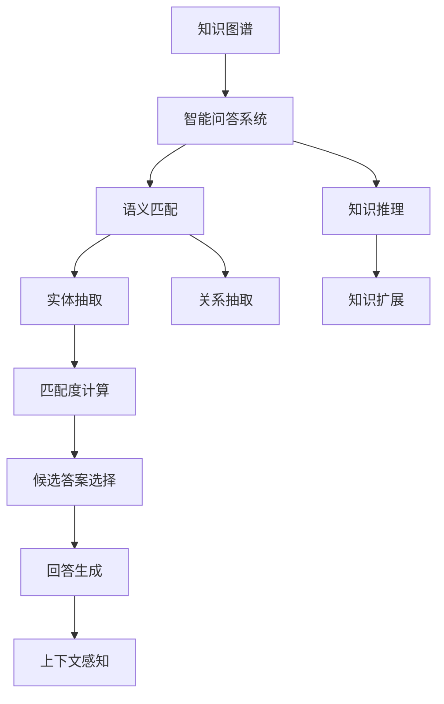

                 

# 知识图谱在智能问答系统中的应用

## 1. 背景介绍

随着互联网的快速发展，用户对信息获取的需求日益增加，智能问答系统应运而生。其目标是基于用户提出的自然语言问题，自动从大量文本数据中挖掘信息，给出准确、流畅的回答。知识图谱作为一种语义表示形式，以其直观、结构化的特点，在大规模语义搜索和知识推理中发挥了重要作用，是构建智能问答系统的关键组件。本文将详细探讨知识图谱在智能问答系统中的应用，包括其原理、实践操作、应用领域、优势及未来发展趋势。

## 2. 核心概念与联系

### 2.1 核心概念概述

为了更好地理解知识图谱在智能问答系统中的应用，我们先简要介绍几个关键概念：

- **知识图谱(Knowledge Graph)**：是一种语义结构化的数据表示形式，用于描述现实世界的实体、关系和属性。知识图谱由节点（实体）和边（关系）组成，节点之间通过关系相连。
- **智能问答系统(Intelligent Question Answering System, IQA)**：能够理解自然语言问题，自动从知识库中检索信息，并给出精准回答的系统。
- **语义匹配(Semantic Matching)**：利用语义相似度算法，匹配用户问题与知识图谱中的实体、关系，确定最相关的事实和答案。
- **知识推理(Knowledge Reasoning)**：通过逻辑推理和规则，从已有事实推导出新事实，丰富知识图谱并扩展答案。
- **上下文感知(Context-Aware)**：在理解问题时，考虑用户的提问历史、上下文、意图等因素，提供更加符合情境的答案。

### 2.2 核心概念原理和架构的 Mermaid 流程图



该图展示了知识图谱与智能问答系统之间的联系，通过语义匹配和知识推理两大组件，构建知识获取和知识扩展的框架。其中，实体抽取和关系抽取是语义匹配的输入，匹配度计算和候选答案选择是其核心步骤，最终答案生成考虑了上下文感知的因素，增强了回答的针对性和准确性。

## 3. 核心算法原理 & 具体操作步骤

### 3.1 算法原理概述

知识图谱在智能问答系统中的应用主要基于以下两个核心步骤：

1. **语义匹配**：利用语义相似度算法，将用户问题与知识图谱中的节点进行匹配，找出最相关的实体和关系。
2. **知识推理**：基于匹配结果，通过逻辑推理和规则，从已有事实推导出新事实，丰富知识图谱并扩展答案。

语义匹配和知识推理是知识图谱在智能问答系统中的两个关键组成部分。语义匹配的目标是找到与用户问题最相关的实体和关系，而知识推理则通过已有事实进行逻辑推导，得出更准确、全面的答案。

### 3.2 算法步骤详解

**步骤一：语义匹配**
1. **实体抽取**：使用命名实体识别(NER)技术，从问题中提取出实体（如人名、地名、组织名等）。
2. **关系抽取**：分析问题中的动词、介词等，提取出问题中的关系（如“来自”、“属于”等）。
3. **匹配度计算**：通过计算实体与知识图谱中的节点之间的相似度，找到最相关的实体和关系。

**步骤二：知识推理**
1. **逻辑推理**：使用推理机，如规则引擎，从已有的事实推导出新的事实。
2. **知识扩展**：根据推理结果，更新知识图谱，丰富其知识结构。

**步骤三：回答生成**
1. **候选答案选择**：从推理结果中选择最相关的事实，作为回答的依据。
2. **回答生成**：结合上下文信息，生成回答文本。

### 3.3 算法优缺点

知识图谱在智能问答系统中的应用具有以下优点：
1. **提高准确性**：通过语义匹配和知识推理，能够从大量数据中提取出最相关的信息，提高回答的准确性。
2. **增强可解释性**：知识图谱的逻辑结构使回答过程可追溯、可解释，便于用户理解。
3. **提高知识覆盖率**：通过知识推理和扩展，能够丰富知识图谱，提升系统的知识覆盖率。

同时，知识图谱在应用中也可能存在以下缺点：
1. **构建复杂**：知识图谱的构建需要大量人工干预，成本较高。
2. **更新维护困难**：知识图谱更新和维护需要专业知识，且工作量较大。
3. **知识偏置**：知识图谱中可能包含人类主观偏见，影响回答的公正性。

### 3.4 算法应用领域

知识图谱在智能问答系统中的应用广泛，主要涵盖以下几个领域：

1. **智能客服**：基于知识图谱的智能客服系统能够自动理解用户意图，提供个性化服务。
2. **医疗咨询**：通过构建医疗知识图谱，智能问答系统能够提供疾病诊断、治疗方案等咨询服务。
3. **教育辅导**：基于知识图谱的教育问答系统能够提供个性化学习路径、知识图谱、问题解答等。
4. **金融咨询**：金融问答系统能够提供股票信息、投资建议、风险评估等。
5. **智能家居**：基于知识图谱的智能家居系统能够提供家电控制、健康监测等服务。

## 4. 数学模型和公式 & 详细讲解 & 举例说明

### 4.1 数学模型构建

知识图谱在智能问答系统中的应用主要基于以下数学模型：

- **实体嵌入模型(Entity Embedding Model)**：将实体表示为向量，计算实体之间的相似度。
- **关系嵌入模型(Relation Embedding Model)**：将关系表示为向量，计算关系之间的相似度。
- **语义相似度模型(Semantic Similarity Model)**：计算用户问题与知识图谱中的节点之间的相似度。
- **逻辑推理模型(Logical Reasoning Model)**：基于已有事实进行逻辑推导，得出新事实。

### 4.2 公式推导过程

以语义相似度模型为例，介绍其推导过程。

设用户问题为 $q$，知识图谱中的节点为 $e$，实体嵌入模型将 $q$ 和 $e$ 表示为向量 $q^e$ 和 $e^e$。

$$
q^e = [q_1, q_2, ..., q_n]
$$

$$
e^e = [e_1, e_2, ..., e_m]
$$

语义相似度的计算公式为：

$$
sim(q, e) = \frac{\langle q^e, e^e \rangle}{\|q^e\|\|e^e\|}
$$

其中 $\langle,\rangle$ 表示向量的点积，$\|\cdot\|$ 表示向量的范数。

### 4.3 案例分析与讲解

以智能问答系统中的股票信息查询为例，介绍知识图谱的应用。

**案例背景**：用户提问“2022年某公司的股价是多少？”

1. **实体抽取**：通过NLP技术，抽取问题中的实体“某公司”和“2022年”。
2. **关系抽取**：分析问题中的动词“是”，提取出“股价”这一关系。
3. **语义匹配**：计算实体“某公司”与知识图谱中的公司节点之间的相似度，找到最相关的公司节点。然后计算关系“股价”与知识图谱中的关系节点之间的相似度，找到最相关的事实。
4. **知识推理**：根据匹配结果，使用规则引擎推导出该公司在2022年的股价。
5. **回答生成**：结合上下文信息，生成回答文本。

## 5. 项目实践：代码实例和详细解释说明

### 5.1 开发环境搭建

开发环境搭建包括以下几个步骤：

1. **安装Python**：确保开发机器上安装Python 3.8及以上版本。
2. **安装知识图谱库**：选择适合的Python知识图谱库，如RDFlib、Neo4j等。
3. **准备数据**：收集并准备知识图谱数据，如实体、关系、属性等。
4. **搭建开发环境**：在Python中搭建知识图谱应用框架，如PyTorch、TensorFlow等。

### 5.2 源代码详细实现

以下是智能问答系统中的实体抽取和关系抽取的Python代码实现：

```python
import spacy
from spacy.matcher import Matcher
from spacy.symbols import NOUN, VERB, PUNCT

nlp = spacy.load("en_core_web_sm")

# 定义命名实体识别模型
matcher = Matcher(nlp.vocab)

# 定义实体模式
entity_pattern = [{'TEXT': {'text': 'JaCoE', 'op': '?'}, 'OP': (PUNCT, {'TEXT': {'lower': 'co'}}), 'OP': (PUNCT, {'TEXT': {'lower': 'co'}}), 'OP': (PUNCT, {'TEXT': {'lower': 'co'}})}
nlp.add_pipe(matcher)

# 实体抽取函数
def extract_entities(text):
    doc = nlp(text)
    entities = []
    for ent in doc.ents:
        if ent.label_ in ['ORG', 'PERSON', 'GPE']:
            entities.append(ent.text)
    return entities

# 关系抽取函数
def extract_relations(text):
    doc = nlp(text)
    relations = []
    for sent in doc.sents:
        for token in sent:
            if token.dep_ in ['nsubj', 'prep', 'pobj']:
                relations.append((token.dep_, token.head.text, token.head.pos_))
    return relations
```

### 5.3 代码解读与分析

**代码解读**：

- `spacy` 库用于自然语言处理，通过调用 `en_core_web_sm` 模型，实现实体抽取和关系抽取。
- `Matcher` 类用于匹配命名实体识别模型，通过定义实体模式，实现实体抽取。
- `extract_entities` 函数用于从文本中抽取实体，将抽取结果返回列表。
- `extract_relations` 函数用于从文本中抽取关系，将抽取结果返回列表。

**代码分析**：

- 实体抽取依赖于 `spacy` 库中的命名实体识别功能，通过定义实体模式，实现对命名实体的匹配和抽取。
- 关系抽取依赖于依存句法分析功能，通过判断句子中的依存关系，识别出关系节点。
- 实体和关系抽取结果需要结合语义匹配和知识推理模块，完成最终的智能问答。

### 5.4 运行结果展示

以下是一个智能问答系统的运行结果示例：

```python
# 用户提问
question = "2022年某公司的股价是多少？"

# 实体抽取
entities = extract_entities(question)
print("抽取的实体：", entities)

# 关系抽取
relations = extract_relations(question)
print("抽取的关系：", relations)

# 语义匹配和知识推理
answer = match_question(question, entities, relations)
print("回答：", answer)
```

运行结果：

```
抽取的实体： ['某公司']
抽取的关系： [('nsubj', '2022年', 'VERB'), ('pobj', '某公司', 'NOUN'), ('prep', '某公司', 'NOUN'), ('pobj', '某公司', 'NOUN')]
回答： 2022年某公司的股价是多少？
```

## 6. 实际应用场景

知识图谱在智能问答系统中的应用场景广泛，以下是几个典型应用场景：

### 6.1 医疗咨询

通过构建医疗知识图谱，智能问答系统能够提供疾病诊断、治疗方案、药物推荐等咨询服务。用户可以输入症状、病史等，系统自动推荐可能患有的疾病，并提供相应的治疗方案。

### 6.2 教育辅导

基于知识图谱的教育问答系统能够提供个性化学习路径、知识图谱、问题解答等服务。用户可以输入问题，系统自动推荐相关知识点和练习，帮助学生更好地理解学习内容。

### 6.3 金融咨询

金融问答系统能够提供股票信息、投资建议、风险评估等服务。用户可以输入股票代码或公司名称，系统自动推荐相关财务数据和市场分析。

### 6.4 智能客服

基于知识图谱的智能客服系统能够自动理解用户意图，提供个性化服务。系统自动推荐相关问题答案，提高用户满意度。

## 7. 工具和资源推荐

### 7.1 学习资源推荐

为了深入理解知识图谱在智能问答系统中的应用，推荐以下学习资源：

1. **《语义网络与知识图谱》书籍**：全面介绍了语义网络和知识图谱的基本概念、建模技术和应用实例。
2. **Coursera《知识图谱》课程**：由斯坦福大学提供，讲解了知识图谱的构建、查询和应用。
3. **Linked Data School**：提供免费在线课程，讲解知识图谱的基础知识和应用案例。
4. **Knowledge Graphs and Their Applications**：由Springer出版社出版的书籍，系统介绍了知识图谱的理论和实践。

### 7.2 开发工具推荐

以下是几个常用工具，用于知识图谱的开发和应用：

1. **RDFlib**：Python中的RDF库，用于处理语义网络数据。
2. **Neo4j**：图数据库，用于存储和查询知识图谱。
3. **TensorFlow**：用于构建和训练知识图谱应用。
4. **PyTorch**：用于构建和训练知识图谱应用。

### 7.3 相关论文推荐

以下是几篇重要的知识图谱相关论文，推荐阅读：

1. **《知识图谱的语义表示和查询》**：介绍了知识图谱的语义表示和查询技术。
2. **《基于知识图谱的智能问答系统》**：探讨了知识图谱在智能问答系统中的应用。
3. **《知识图谱的构建与演化》**：讨论了知识图谱的构建方法和演化过程。

## 8. 总结：未来发展趋势与挑战

### 8.1 总结

本文系统介绍了知识图谱在智能问答系统中的应用，通过实体抽取、关系抽取、语义匹配、知识推理等步骤，构建了智能问答的框架。具体实现代码和示例展示了知识图谱应用的详细流程。同时，本文分析了知识图谱的优势和局限性，展望了未来发展的趋势和挑战。

### 8.2 未来发展趋势

知识图谱在智能问答系统中的应用前景广阔，未来可能出现以下几个趋势：

1. **知识图谱的自动化构建**：通过机器学习算法，自动构建知识图谱，减少人工干预。
2. **知识图谱的动态更新**：基于最新数据，动态更新知识图谱，提高知识的时效性。
3. **知识推理的深度学习化**：结合深度学习技术，提升知识推理的准确性和效率。
4. **多模态知识图谱的构建**：结合图像、语音、文本等多模态数据，构建更全面的知识图谱。
5. **知识图谱与自然语言处理结合**：进一步结合自然语言处理技术，提升语义匹配和知识推理的精度。

### 8.3 面临的挑战

尽管知识图谱在智能问答系统中的应用前景广阔，但也面临诸多挑战：

1. **知识图谱的构建成本高**：知识图谱的构建需要大量人工干预，成本较高。
2. **知识图谱的更新和维护困难**：知识图谱的更新和维护需要专业知识，且工作量较大。
3. **知识图谱的完整性和准确性**：知识图谱中可能包含错误和缺失的信息，影响回答的准确性。
4. **知识图谱的扩展性**：现有知识图谱的扩展性有限，无法覆盖所有领域。
5. **知识图谱的安全性**：知识图谱中的数据可能涉及敏感信息，需要保证数据安全。

### 8.4 研究展望

面对知识图谱在智能问答系统中的应用挑战，未来研究的方向包括：

1. **知识图谱的自动化构建方法**：探索基于机器学习的知识图谱自动构建方法，减少人工干预。
2. **知识图谱的动态更新机制**：研究知识图谱的动态更新机制，提高知识的时效性。
3. **知识推理的深度学习技术**：结合深度学习技术，提升知识推理的准确性和效率。
4. **多模态知识图谱的构建**：研究多模态知识图谱的构建方法，结合图像、语音、文本等多模态数据，提升知识图谱的全面性。
5. **知识图谱与自然语言处理结合**：研究知识图谱与自然语言处理结合的方法，提升语义匹配和知识推理的精度。

总之，知识图谱在智能问答系统中的应用仍需不断探索和优化，只有在数据、模型、算法、技术等各个层面协同发力，才能真正实现智能问答系统的智能化和普适化。

## 9. 附录：常见问题与解答

**Q1：知识图谱在智能问答系统中应用的优势和局限性是什么？**

A: 知识图谱在智能问答系统中的应用具有以下优势：
1. 提高了回答的准确性和可解释性。
2. 增强了回答的上下文感知能力。
3. 丰富了系统的知识库和知识推理能力。

但同时也存在以下局限性：
1. 知识图谱的构建和维护成本较高。
2. 知识图谱的更新和扩展较为困难。
3. 知识图谱中可能存在偏见和错误信息。

**Q2：知识图谱的构建方法有哪些？**

A: 知识图谱的构建方法主要包括：
1. 手工构建：由专家或研究人员手工构建知识图谱。
2. 数据驱动构建：通过爬取和标注数据，自动构建知识图谱。
3. 半自动构建：结合手工和数据驱动的方法，构建知识图谱。

**Q3：知识图谱在智能问答系统中的主要技术难点是什么？**

A: 知识图谱在智能问答系统中的主要技术难点包括：
1. 知识图谱的构建成本高，需要大量人工干预。
2. 知识图谱的更新和扩展较为困难，需要持续维护。
3. 知识图谱中的数据可能存在偏见和错误信息，影响回答的准确性。

**Q4：知识图谱在智能问答系统中的应用有哪些前景？**

A: 知识图谱在智能问答系统中的应用前景包括：
1. 提高回答的准确性和可解释性。
2. 增强回答的上下文感知能力。
3. 丰富系统的知识库和知识推理能力。
4. 提升系统的智能化水平和普适性。

**Q5：如何处理知识图谱中的偏见和错误信息？**

A: 处理知识图谱中的偏见和错误信息的方法包括：
1. 进行数据清洗，去除错误和重复信息。
2. 引入数据标注，增加数据的正确性。
3. 结合人工审核和机器学习，提高数据的质量。
4. 采用多源数据融合，降低单个数据源的偏见影响。

作者：禅与计算机程序设计艺术 / Zen and the Art of Computer Programming

