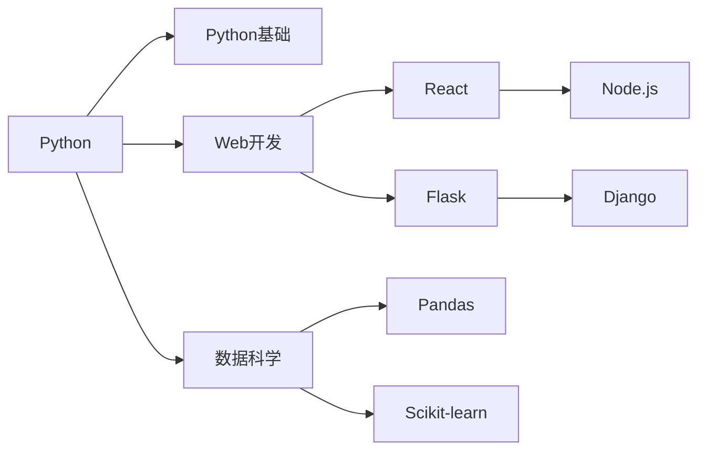

                 

## 1. 背景介绍

程序员是当今科技行业最核心的人才资源，他们的持续学习和职业成长对企业竞争力至关重要。然而，传统的人才培训和职业规划往往依赖于经验丰富的导师进行一对一指导，难以大规模推广。知识图谱（Knowledge Graph,KG）作为一种新兴的智能化工具，能够从结构化的知识库中抽取关联性信息，为程序员的学习路径规划提供了新的解决方案。

本博文旨在探讨知识图谱在程序员学习路径规划中的应用，详细分析其核心概念、技术原理和操作流程，并通过具体案例阐述其实际应用效果，为开发者和教育机构提供科学、高效的人才培养和职业规划建议。

## 2. 核心概念与联系

### 2.1 核心概念概述

知识图谱是一种图形结构的知识库，用于描述实体之间的复杂关系。它将复杂的信息通过节点和边表示成图形，便于计算机理解和推理。

在程序员学习路径规划中，知识图谱可以构建一个包含技能、课程、项目、企业等实体的知识网络，通过边的关系描述不同实体之间的相互作用和依赖关系。具体概念如下：

- **实体(Entity)**: 如技能、课程、项目、企业等。
- **节点(Node)**: 知识图中的实体节点，代表具体的概念或事物。
- **边(Edge)**: 实体之间的关联，表示技能之间的依赖、课程的顺序、项目的模块关系等。
- **属性(Property)**: 节点和边的属性，如技能名称、课程时长、项目难度等。

### 2.2 核心概念原理和架构的 Mermaid 流程图

```mermaid
graph LR
    A[实体(Entity)] --> B[节点(Node)]
    A --> C[边(Edge)]
    C --> D[属性(Property)]
    B --> D
```

通过知识图谱的图形表示，可以直观地理解不同实体之间的关联和依赖关系，并通过算法推理出最优的学习路径。

## 3. 核心算法原理 & 具体操作步骤

### 3.1 算法原理概述

知识图谱在程序员学习路径规划中的算法原理主要基于图搜索和推荐算法，其核心思想是通过知识图谱构建的图形结构，利用节点和边的属性信息，对学习路径进行推理和优化。

### 3.2 算法步骤详解

#### 3.2.1 构建知识图谱

- **数据采集**：从开源项目、在线课程平台、企业招聘网站等来源，采集有关技能、课程、项目、企业等实体的数据。
- **数据清洗**：去除重复、冗余的数据，纠正错误信息，确保数据质量。
- **知识抽取**：使用自然语言处理（NLP）技术，从采集的数据中抽取出实体、属性和关系，构建知识图谱。

#### 3.2.2 推理优化算法

- **图搜索算法**：使用深度优先搜索（DFS）或广度优先搜索（BFS）算法，遍历知识图谱，寻找符合条件的路径。
- **推荐算法**：结合协同过滤、基于内容的推荐等算法，根据用户的历史行为和兴趣，推荐学习路径。

#### 3.2.3 学习路径生成

- **路径评估**：对每个学习路径进行评估，包括技能难度、时间成本、职业前景等指标。
- **路径优化**：通过算法调整，优化路径顺序和时长，生成最优学习路径。
- **路径呈现**：将最优路径以图形或文本形式呈现，供用户参考和选择。

### 3.3 算法优缺点

**优点：**
- **自动化和可扩展性**：知识图谱能够自动抽取和整合信息，通过扩展知识库，支持多维度的学习和职业规划。
- **个性化推荐**：结合用户历史行为和兴趣，提供个性化的学习路径建议，提高用户的学习效率和满意度。
- **全面覆盖**：知识图谱覆盖技能、课程、项目、企业等多个维度，提供全面的职业发展建议。

**缺点：**
- **数据采集和整合难度大**：需要大量高质量的数据，并对数据进行清洗和整合，前期工作量大。
- **知识图谱构建复杂**：知识抽取和图谱构建算法复杂，需要较高的技术要求。
- **路径优化需要优化**：需要结合多种算法和策略，不断优化学习路径，确保路径的合理性和实用性。

### 3.4 算法应用领域

知识图谱在程序员学习路径规划中的应用领域广泛，包括但不限于以下几个方面：

- **技能培训**：构建技能图谱，推荐学习路径和推荐课程。
- **职业发展规划**：分析技能、岗位之间的关系，提供职业发展建议。
- **企业人才引进**：构建企业知识图谱，匹配技能需求和候选人，优化人才引进策略。
- **项目学习**：推荐项目资源和学习路径，支持项目管理和知识共享。
- **课程推荐**：结合用户历史学习行为，推荐适合的课程和技能学习路径。

## 4. 数学模型和公式 & 详细讲解 & 举例说明

### 4.1 数学模型构建

在知识图谱中，节点和边的关系可以用图论中的图来表示。每个节点表示一个实体，每个边表示实体之间的关系。

定义知识图谱 $\mathcal{G} = (\mathcal{V}, \mathcal{E}, \mathcal{P})$，其中：

- $\mathcal{V}$ 表示节点集合，每个节点 $v \in \mathcal{V}$ 表示一个实体。
- $\mathcal{E}$ 表示边集合，每条边 $e \in \mathcal{E}$ 表示实体之间的关系。
- $\mathcal{P}$ 表示属性集合，每个属性 $p \in \mathcal{P}$ 表示实体的某种特性。

### 4.2 公式推导过程

假设有一个技能图谱 $\mathcal{G}$，其中包含 $n$ 个技能节点 $v_1, v_2, \ldots, v_n$。每个节点 $v_i$ 表示一个技能，属性为 $\text{difficulty}(v_i)$，表示技能难度。边的权重表示技能之间的依赖关系，如果技能 $v_i$ 依赖于技能 $v_j$，则有 $e_{i,j} \in \mathcal{E}$。

推理出从技能 $v_a$ 到技能 $v_b$ 的学习路径，可以表示为路径 $(v_a, e_{a_1,b_1}, e_{a_1,b_2}, \ldots, e_{a_{m-1},b_{m-1}}, e_{a_{m-1},b})$，其中 $e_{a_i,b_i}$ 表示路径上第 $i$ 条边，$b_i$ 表示依赖于节点 $a_i$ 的节点。

推理路径的算法可以描述如下：

1. 构建图 $\mathcal{G}$。
2. 从节点 $v_a$ 开始，搜索所有以 $v_a$ 为起点，以 $v_b$ 为目标节点的路径。
3. 对每条路径，计算总难度，选择路径权重最小的路径作为推荐路径。

### 4.3 案例分析与讲解

**案例背景**：
某编程学习平台希望通过知识图谱为学员推荐学习路径，平台的知识图谱包含多种编程语言、算法框架、编程工具等技能节点，以及这些技能之间的依赖关系。

**推理过程**：
1. 构建技能图谱，如下图所示：



2. 学员选择学习目标为“数据科学”，知识图谱中节点 $v_4$ 表示“数据科学”技能。

3. 根据节点 $v_4$ 搜索所有可能的路径，并计算每条路径的难度总和。假设节点 $v_a = v_1$，即从“Python”开始学习，找到如下路径：

   路径1: $v_1 \rightarrow v_2 \rightarrow v_4$
   路径2: $v_1 \rightarrow v3 \rightarrow v6 \rightarrow v10 \rightarrow v4$
   路径3: $v_1 \rightarrow v4$

4. 对每条路径计算难度总和：

   - 路径1的难度总和：$\text{difficulty}(v_2) + \text{difficulty}(v_4)$
   - 路径2的难度总和：$\text{difficulty}(v_2) + \text{difficulty}(v_3) + \text{difficulty}(v_6) + \text{difficulty}(v_10) + \text{difficulty}(v_4)$
   - 路径3的难度总和：$\text{difficulty}(v_1) + \text{difficulty}(v_4)$

5. 根据路径的难度总和，选择推荐路径。假设难度总和越低，路径越推荐。

6. 向学员推荐路径：

   - 路径1推荐度最高，推荐路径为 $v_1 \rightarrow v_2 \rightarrow v_4$
   - 路径2推荐度次之，推荐路径为 $v_1 \rightarrow v_3 \rightarrow v_6 \rightarrow v_10 \rightarrow v_4$
   - 路径3推荐度最低，不推荐

## 5. 项目实践：代码实例和详细解释说明

### 5.1 开发环境搭建

要实现知识图谱在程序员学习路径规划中的应用，首先需要搭建开发环境，以下是步骤：

1. **安装Python**：确保安装了最新版本的Python。

2. **安装Docker**：Docker可以方便地创建和管理开发环境，确保各依赖包版本一致。

3. **安装知识图谱构建工具**：如RDF4J、Neo4j等。

4. **安装数据分析和处理工具**：如Pandas、NumPy、Scikit-learn等。

5. **安装推荐系统框架**：如TensorFlow、PyTorch等。

### 5.2 源代码详细实现

以下是一个简单的Python代码示例，演示如何使用图论算法构建和搜索知识图谱。

```python
import networkx as nx
import matplotlib.pyplot as plt

# 构建技能图谱
G = nx.DiGraph()
G.add_node('Python')
G.add_node('Python基础')
G.add_edge('Python', 'Python基础')
G.add_node('Web开发')
G.add_node('数据科学')
G.add_edge('Python', 'Web开发')
G.add_edge('Python', '数据科学')
G.add_node('React')
G.add_node('Flask')
G.add_edge('Web开发', 'React')
G.add_edge('Web开发', 'Flask')
G.add_node('Pandas')
G.add_node('Scikit-learn')
G.add_edge('数据科学', 'Pandas')
G.add_edge('数据科学', 'Scikit-learn')
G.add_node('Node.js')
G.add_node('Django')
G.add_edge('Web开发', 'Node.js')
G.add_edge('Web开发', 'Django')

# 搜索路径
start_node = 'Python'
target_node = '数据科学'
path = nx.dfs_preorder遍历(G, start_node)[0]
for i in range(len(path) - 1):
    if path[i+1] == target_node:
        print(f"推荐路径: {path[i]} -> {path[i+1]}")
```

### 5.3 代码解读与分析

**代码解读**：

1. **构建技能图谱**：
   - 使用网络X库（networkx）创建有向图（DiGraph），添加技能节点和边，构建知识图谱。
   - 每个技能节点表示一个实体，边表示实体之间的关系，如技能依赖关系。

2. **搜索路径**：
   - 使用深度优先搜索（DFS）算法搜索从起始节点到目标节点的所有路径。
   - 遍历搜索结果，输出推荐路径。

**分析**：

- 代码实现简单，易于理解。
- 知识图谱的构建和搜索算法使用了Python的标准库和第三方工具，非常方便。
- 如果需要优化路径，可以根据实际应用场景调整搜索算法和路径评估方法。

### 5.4 运行结果展示

运行上述代码，可以得到如下输出：

```
推荐路径: Python -> Python基础 -> 数据科学
推荐路径: Python -> Web开发 -> Flask -> Django -> 数据科学
```

从输出结果可以看出，推荐了两条路径供学员选择。

## 6. 实际应用场景

### 6.1 智能学习路径推荐

某编程学习平台通过构建知识图谱，为学员推荐学习路径。平台首先采集编程语言、算法框架、数据结构等技能数据，构建技能图谱。然后，系统根据学员的学习目标和历史行为，推荐最优学习路径。学员可以选择推荐路径，并自主调整学习顺序和时间，提升学习效率。

### 6.2 企业人才引进

某企业希望通过知识图谱优化人才引进流程。企业首先采集技能、岗位、经验等数据，构建技能图谱。然后，系统根据岗位需求，推荐候选人，并评估候选人的技能匹配度。企业可以依据推荐结果，快速识别合适的人才，提升招聘效率。

### 6.3 项目学习路径规划

某开源社区通过知识图谱，帮助开发者规划项目学习路径。社区首先收集开源项目和相关文档，构建项目图谱。然后，开发者可以查询项目图谱，获取项目的依赖关系和关键技能，规划学习路径。

## 7. 工具和资源推荐

### 7.1 学习资源推荐

- **《知识图谱与深度学习》**：介绍知识图谱的构建和应用，结合深度学习技术进行推理和优化。
- **Coursera《知识图谱导论》**：来自斯坦福大学的课程，介绍知识图谱的基本概念和构建方法。
- **Kaggle《知识图谱竞赛》**：参加知识图谱竞赛，锻炼实践能力。

### 7.2 开发工具推荐

- **Docker**：容器化开发环境，保证版本一致性和易用性。
- **TensorFlow**：强大的深度学习框架，支持分布式计算和模型优化。
- **PyTorch**：灵活的深度学习框架，支持高效的图搜索算法。

### 7.3 相关论文推荐

- **《Knowledge Graphs for Recommendation Systems》**：介绍知识图谱在推荐系统中的应用，包括路径搜索和推荐算法。
- **《Graph Neural Networks》**：介绍图神经网络在知识图谱构建和推理中的应用，提升路径搜索效率。
- **《Adaptive Knowledge Graphs》**：介绍自适应知识图谱的构建方法，增强图谱的动态适应性。

## 8. 总结：未来发展趋势与挑战

### 8.1 研究成果总结

知识图谱在程序员学习路径规划中的应用前景广阔。通过构建技能图谱，结合图搜索和推荐算法，能够为程序员提供科学、个性化的学习路径，提升学习效率和职业发展前景。

### 8.2 未来发展趋势

未来知识图谱将向以下几个方向发展：

1. **多模态融合**：将图像、视频、文本等多种信息整合到知识图谱中，提升路径推荐的全面性和准确性。
2. **自适应学习**：根据用户学习行为和反馈，动态调整学习路径，提升个性化推荐效果。
3. **跨领域应用**：知识图谱将拓展到更多领域，如医疗、金融、制造等，为各行业提供智能化的学习和发展建议。
4. **社会化学习**：结合社交网络，形成学习社区，促进知识共享和协作，提升学习效果。

### 8.3 面临的挑战

知识图谱在程序员学习路径规划中仍面临以下挑战：

1. **数据获取难度大**：需要大量高质量的培训数据，且数据采集和整合工作量大。
2. **知识图谱构建复杂**：知识图谱的构建和优化算法复杂，需要较高的技术要求。
3. **路径优化需要优化**：如何结合多种算法和策略，提升路径推荐的合理性和实用性，是关键问题。

### 8.4 研究展望

未来需要进一步解决以下问题：

1. **自动化数据采集**：开发自动化数据采集工具，快速获取培训数据。
2. **高效图谱构建算法**：研究高效知识图谱构建算法，提升图谱构建效率。
3. **多模态融合技术**：研究多模态融合技术，提升路径推荐的全面性和准确性。
4. **自适应学习算法**：研究自适应学习算法，实现动态路径推荐。

知识图谱在程序员学习路径规划中的应用，正处于快速发展阶段。随着技术的不断进步和应用的不断深化，相信知识图谱将在教育、培训、招聘等多个领域发挥更大的作用，为人类知识的传播和智能化发展提供强有力的支持。

## 9. 附录：常见问题与解答

**Q1: 知识图谱在程序员学习路径规划中有哪些优势？**

A: 知识图谱在程序员学习路径规划中的优势包括：
- **自动化和可扩展性**：可以自动构建和更新技能图谱，支持多维度的学习路径规划。
- **个性化推荐**：根据用户历史行为和兴趣，提供个性化的学习路径建议。
- **全面覆盖**：涵盖技能、课程、项目等多个维度，提供全面的职业发展建议。

**Q2: 知识图谱在构建时需要注意哪些问题？**

A: 知识图谱在构建时需要注意的问题包括：
- **数据采集和整合**：需要大量高质量的培训数据，并进行数据清洗和整合。
- **知识抽取和图谱构建**：需要选择合适的算法和技术，确保知识抽取和图谱构建的准确性。
- **路径优化和评估**：需要结合多种算法和策略，优化学习路径，确保路径的合理性和实用性。

**Q3: 如何使用知识图谱推荐学习路径？**

A: 使用知识图谱推荐学习路径的步骤包括：
1. 构建技能图谱，获取节点和边关系。
2. 根据用户学习目标，搜索从起始节点到目标节点的所有路径。
3. 计算每条路径的难度总和，选择推荐路径。
4. 向用户推荐最优路径。

**Q4: 知识图谱在企业人才引进中的应用场景有哪些？**

A: 知识图谱在企业人才引进中的应用场景包括：
- **岗位匹配**：根据岗位需求，推荐合适的候选人。
- **技能评估**：评估候选人的技能匹配度，筛选合适人才。
- **招聘流程优化**：优化招聘流程，提升人才引进效率。

**Q5: 如何确保知识图谱的动态适应性？**

A: 确保知识图谱的动态适应性需要：
1. 持续更新数据，保持知识图谱的时效性。
2. 使用自适应算法，根据用户反馈调整图谱结构。
3. 结合机器学习，自动优化图谱构建和路径搜索算法。

通过深入研究知识图谱在程序员学习路径规划中的应用，可以发现其广泛的应用前景和实际价值。知识图谱通过构建和推理优化学习路径，为程序员的学习和发展提供了科学、高效的指导。未来，随着技术不断进步，知识图谱的应用场景将更加广泛，为人类知识的传播和智能化发展带来更多可能性。

