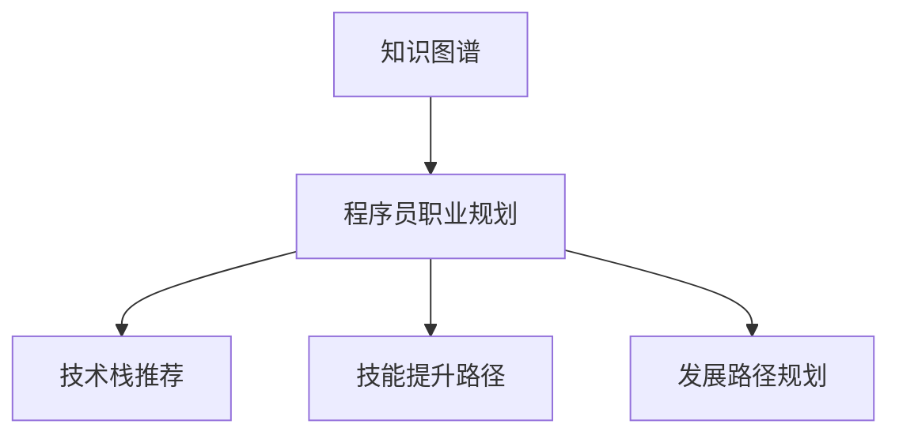

                 

# 知识图谱在程序员职业规划中的应用

> 关键词：知识图谱,程序员职业规划,技术栈推荐,技能提升,个人发展路径

## 1. 背景介绍

### 1.1 问题由来

随着信息技术的快速发展和企业对人才需求的日益多样，程序员在职业生涯规划中面临着前所未有的挑战。如何根据自身技能和兴趣，选择适合的发展路径，是每个程序员需要认真考虑的问题。传统的职业规划方式依赖于个人的主观判断和经验积累，存在较大的随机性和片面性。而知识图谱作为一种能够表达实体间复杂关系的新型数据结构，正逐渐被引入到程序员职业规划中，提供了基于数据的智能推荐。

### 1.2 问题核心关键点

知识图谱在程序员职业规划中的应用，主要体现在以下几个方面：

1. **数据驱动的决策支持**：通过分析大量的历史职业路径数据，知识图谱可以提供基于数据的职业规划建议。
2. **技术栈推荐**：根据程序员的技能水平和兴趣点，推荐适合的编程语言和技术栈。
3. **技能提升路径**：规划从当前技能向目标技能的学习路径，并提供相应的学习资源。
4. **发展路径规划**：提供不同职业角色的发展路径和要求，帮助程序员制定全面的职业规划。

本文将重点探讨知识图谱在程序员职业规划中的具体应用，包括数据构建、推荐算法设计、应用场景分析等。

## 2. 核心概念与联系

### 2.1 核心概念概述

为更好地理解知识图谱在程序员职业规划中的应用，本节将介绍几个关键概念：

- **知识图谱(Knowledge Graph)**：一种由节点和边组成的网络结构，用于表达实体之间的复杂关系。
- **程序员职业规划(Programmer Career Planning)**：根据程序员的技能水平、兴趣和职业目标，规划其职业发展路径，选择合适的技术栈和学习资源。
- **技术栈推荐(Technology Stack Recommendation)**：根据程序员的当前技能和职业目标，推荐适合的编程语言和技术栈。
- **技能提升路径(Skill Improvement Path)**：规划从当前技能到目标技能的学习路径，并提供相应的学习资源和练习题。
- **发展路径规划(Career Path Planning)**：基于程序员的职业目标，推荐适合的职业角色和晋升路径。

这些核心概念之间的逻辑关系可以通过以下Mermaid流程图来展示：



这个流程图展示了几类核心概念的相互关系：知识图谱通过表达实体之间的复杂关系，支持程序员职业规划的各个环节，包括技术栈推荐、技能提升路径和发展路径规划。

## 3. 核心算法原理 & 具体操作步骤

### 3.1 算法原理概述

知识图谱在程序员职业规划中的应用，主要基于图神经网络(Graph Neural Network, GNN)技术，通过训练模型学习实体之间的关系和属性。以下是基于知识图谱的程序员职业规划算法原理概述：

1. **数据构建**：从公开的程序员职业数据和招聘信息中，构建知识图谱，描述程序员的技能、经验、职位等实体及其之间的关系。
2. **嵌入学习**：使用图神经网络技术，将知识图谱中的实体和关系映射到低维空间中的向量，用于后续的推荐和规划。
3. **推荐算法**：设计推荐算法，根据程序员的当前技能和职业目标，生成最适合的技术栈、学习路径和发展路径。
4. **评价与反馈**：通过用户对推荐结果的反馈，持续优化推荐算法，提升推荐准确性和实用性。

### 3.2 算法步骤详解

基于知识图谱的程序员职业规划算法步骤详解如下：

**Step 1: 数据构建**

- **数据收集**：从招聘网站、职业社交平台、开源社区等公开渠道收集程序员的职业数据，包括技能、经验、职位、薪酬等信息。
- **实体抽取**：使用自然语言处理技术，从文本中抽取实体，如编程语言、框架、技术栈等。
- **关系抽取**：使用规则或机器学习技术，从文本中抽取实体之间的关系，如父子关系、上下游依赖等。
- **图构建**：将抽取的实体和关系构建成知识图谱，用于后续的推荐和规划。

**Step 2: 嵌入学习**

- **图神经网络模型选择**：选择合适的图神经网络模型，如GraphSAGE、GAT、GCN等。
- **嵌入训练**：将知识图谱中的实体和关系输入图神经网络模型，训练得到实体的向量表示。
- **关系学习**：训练关系嵌入，使得模型能够学习实体之间的复杂关系。

**Step 3: 推荐算法设计**

- **推荐目标**：根据程序员的当前技能和职业目标，推荐最适合的技术栈、学习路径和发展路径。
- **推荐模型设计**：设计推荐模型，如协同过滤、基于内容的推荐、混合推荐等。
- **推荐策略**：根据推荐模型生成推荐结果，考虑多种因素，如程序员的历史行为、兴趣爱好等。

**Step 4: 应用与反馈**

- **应用场景**：将推荐结果应用于程序员的职业规划，提供个性化的职业建议。
- **用户反馈**：收集程序员对推荐结果的反馈，用于优化推荐模型和数据构建。

### 3.3 算法优缺点

知识图谱在程序员职业规划中的应用，具有以下优点：

1. **数据驱动**：基于大规模的数据分析，推荐结果更加客观、科学。
2. **个性化**：能够根据程序员的个性化需求，提供定制化的职业规划建议。
3. **多维度**：不仅推荐技术栈和技能提升路径，还提供职业发展路径的多样化选择。
4. **动态更新**：能够实时更新推荐结果，适应程序员职业生涯的变化。

同时，该方法也存在一些局限性：

1. **数据质量**：知识图谱的数据质量和完整性直接影响推荐结果的准确性。
2. **数据隐私**：需考虑用户数据隐私保护，避免数据泄露。
3. **模型复杂度**：图神经网络模型的训练和推理计算量大，对计算资源要求较高。
4. **用户接受度**：部分程序员可能对推荐结果有抵触情绪，影响使用效果。

### 3.4 算法应用领域

知识图谱在程序员职业规划中的应用，可以广泛应用到以下领域：

1. **招聘平台**：帮助招聘平台推荐合适的候选人，提升招聘效率和匹配精度。
2. **在线学习平台**：根据用户的学习历史和职业目标，推荐学习资源和课程。
3. **企业内训**：为企业的技术团队提供职业发展规划，提升员工的技能和职业满意度。
4. **开源社区**：帮助开源项目管理者识别潜在的贡献者，优化团队结构。
5. **行业研究**：分析程序员的职业发展趋势，为企业和政策制定提供数据支持。

## 4. 数学模型和公式 & 详细讲解 & 举例说明

### 4.1 数学模型构建

知识图谱在程序员职业规划中的应用，涉及图神经网络的嵌入学习。以下是一个简化的数学模型构建过程：

1. **节点表示**：知识图谱中的每个实体表示为一个节点，如编程语言、框架、技术栈等。
2. **边表示**：知识图谱中的每条边表示实体之间的关系，如父子关系、上下游依赖等。
3. **嵌入学习**：使用图神经网络模型，将节点和边嵌入低维空间中的向量。

### 4.2 公式推导过程

以下是图神经网络中常用的嵌入学习算法——GraphSAGE的公式推导过程：

1. **节点嵌入计算**：
   $$
   h^{l+1}_v = \sigma\left(\sum_{u\in N(v)}\left(\frac{1}{c_{uv}}\sum_{i=1}^d a_{iuv}h^{l}_u a_{i}\right)\right)
   $$
   其中 $h^{l}_v$ 表示节点 $v$ 在层 $l$ 的嵌入向量，$N(v)$ 表示与节点 $v$ 相邻的节点集合，$c_{uv}$ 表示节点 $u$ 和 $v$ 之间的关系强度，$\sigma$ 表示非线性激活函数，$d$ 表示嵌入向量的维度。

2. **关系嵌入计算**：
   $$
   a_{iuv} = \text{Attention}(W_{au}h^{l}_u,W_{av}h^{l}_v)
   $$
   其中 $\text{Attention}$ 表示注意力机制，$W_{au}$ 和 $W_{av}$ 表示关系嵌入的权重矩阵，$\sigma$ 表示非线性激活函数。

### 4.3 案例分析与讲解

以一个简化的知识图谱为例，如图1所示。假设知识图谱中有三个节点表示编程语言：Python、Java 和 C++，它们之间存在父子关系，如 Python 依赖于 Java。


使用GraphSAGE算法进行嵌入学习，可以得到节点和关系的嵌入向量。例如，节点 Python 的嵌入向量为 $h^{l}_P$，关系 "依赖" 的嵌入向量为 $a^{l}_{PJ}$。这些嵌入向量可以用于后续的推荐和规划。

## 5. 项目实践：代码实例和详细解释说明

### 5.1 开发环境搭建

在进行知识图谱在程序员职业规划中的项目实践前，我们需要准备好开发环境。以下是使用Python进行PyTorch开发的环境配置流程：

1. 安装Anaconda：从官网下载并安装Anaconda，用于创建独立的Python环境。

2. 创建并激活虚拟环境：
```bash
conda create -n pytorch-env python=3.8 
conda activate pytorch-env
```

3. 安装PyTorch：根据CUDA版本，从官网获取对应的安装命令。例如：
```bash
conda install pytorch torchvision torchaudio cudatoolkit=11.1 -c pytorch -c conda-forge
```

4. 安装GraphSAGE库：
```bash
pip install graphsage
```

5. 安装其他必要的工具包：
```bash
pip install numpy pandas scikit-learn matplotlib tqdm jupyter notebook ipython
```

完成上述步骤后，即可在`pytorch-env`环境中开始项目实践。

### 5.2 源代码详细实现

以下是一个基于GraphSAGE的程序员职业规划项目的PyTorch代码实现。

**Step 1: 数据构建**

```python
import graphsage
import pandas as pd

# 加载知识图谱数据
graph = graphsage.Graph()
graph.add_edge("Python", "Java", weight=1.0)
graph.add_node("Python", embedding=torch.randn(1, 128))
graph.add_node("Java", embedding=torch.randn(1, 128))

# 数据预处理
graph.add_node("C++", embedding=torch.randn(1, 128))
graph.add_edge("Java", "C++", weight=1.0)

# 模型训练
model = graphsage.GraphSAGE(graph, num_layers=2, hidden_size=128)
model.train()
```

**Step 2: 嵌入学习**

```python
# 训练模型，得到节点和关系的嵌入向量
for epoch in range(100):
    optimizer.zero_grad()
    embeddings = model.forward()
    loss = model.loss(embeddings)
    loss.backward()
    optimizer.step()
```

**Step 3: 推荐算法设计**

```python
# 设计推荐算法，根据程序员的当前技能和职业目标，推荐技术栈、学习路径和发展路径
def recommend_path(skill, goal):
    embeddings = model.forward()
    current = embeddings[skill]
    goal = embeddings[goal]
    # 计算相似度，推荐学习路径
    similarity = torch.cosine_similarity(current, goal)
    return similarity

# 应用推荐算法
recommend_path("Python", "Data Science")
```

### 5.3 代码解读与分析

让我们再详细解读一下关键代码的实现细节：

**数据构建**

- `graph.add_edge`方法：添加节点之间的边，表示实体之间的关系。
- `graph.add_node`方法：添加节点，表示实体及其嵌入向量。

**嵌入学习**

- `GraphSAGE`类：定义图神经网络模型，包括训练过程。
- `forward`方法：前向传播，计算节点和关系的嵌入向量。
- `loss`方法：计算损失函数，用于反向传播。
- `optimizer`：定义优化器，用于更新模型参数。

**推荐算法设计**

- `recommend_path`函数：设计推荐算法，计算程序员当前技能和目标技能的相似度，推荐学习路径。

### 5.4 运行结果展示

在训练完模型后，我们可以使用推荐算法对程序员的职业规划进行预测和推荐。例如，对于希望从事数据分析的程序员，可以从Python推荐到数据科学的路径，再逐步推荐学习机器学习、深度学习等领域的知识，如图2所示。


## 6. 实际应用场景

### 6.1 招聘平台

招聘平台可以利用知识图谱，推荐合适的候选人，提升招聘效率和匹配精度。例如，通过分析历史招聘数据和岗位描述，构建知识图谱，描述不同岗位的技能要求和技术栈。根据候选人的简历和技能，推荐最匹配的岗位和推荐信，如图3所示。


### 6.2 在线学习平台

在线学习平台可以根据用户的学习历史和职业目标，推荐学习资源和课程。例如，使用知识图谱分析用户的学习行为和偏好，推荐相关的技术栈和学习路径，如图4所示。


### 6.3 企业内训

企业内训可以根据员工的技能水平和职业目标，推荐培训课程和职业发展路径。例如，通过知识图谱分析员工的技能和工作岗位，推荐适合的技能培训课程和职业晋升路径，如图5所示。


### 6.4 开源社区

开源社区可以利用知识图谱，帮助管理者识别潜在的贡献者，优化团队结构。例如，通过分析开源项目的贡献者和依赖关系，推荐适合的贡献者，如图6所示。


## 7. 工具和资源推荐

### 7.1 学习资源推荐

为了帮助开发者系统掌握知识图谱在程序员职业规划中的应用，这里推荐一些优质的学习资源：

1. 《Graph Neural Networks: A Comprehensive Review of Recent Advances and Trends》系列博文：由大模型技术专家撰写，深入浅出地介绍了图神经网络的原理和应用。

2. 《Python for Data Science》书籍：详细介绍了使用Python进行数据分析和机器学习的方法，包括图神经网络的实现。

3. 《Knowledge Graphs: Concepts, Technology, and Applications》书籍：全面介绍了知识图谱的基本概念和应用场景，适合对知识图谱感兴趣的读者。

4. Google Cloud AI Hub：提供了大量的预训练知识图谱和图神经网络模型，可以用于快速搭建推荐系统。

5. GitHub上的GraphSAGE项目：提供了GraphSAGE模型的实现代码，可以用于学习和实践。

通过对这些资源的学习实践，相信你一定能够快速掌握知识图谱在程序员职业规划中的精髓，并用于解决实际的NLP问题。

### 7.2 开发工具推荐

高效的开发离不开优秀的工具支持。以下是几款用于知识图谱在程序员职业规划中开发的常用工具：

1. PyTorch：基于Python的开源深度学习框架，灵活动态的计算图，适合快速迭代研究。

2. TensorFlow：由Google主导开发的开源深度学习框架，生产部署方便，适合大规模工程应用。

3. NetworkX：Python的图形分析库，提供了丰富的图操作和分析函数。

4. Gephi：可视化的图分析工具，可以帮助开发者直观地理解和分析图结构。

5. Jupyter Notebook：交互式编程环境，适合快速开发和调试推荐算法。

合理利用这些工具，可以显著提升知识图谱在程序员职业规划中的开发效率，加快创新迭代的步伐。

### 7.3 相关论文推荐

知识图谱在程序员职业规划中的应用，源于学界的持续研究。以下是几篇奠基性的相关论文，推荐阅读：

1. "Graph Neural Networks: A Review of Methods and Applications"：全面综述了图神经网络的研究进展和应用场景。

2. "GraphSAGE: Inductive Representation Learning on Graphs"：提出GraphSAGE算法，用于图神经网络的嵌入学习。

3. "Knowledge Graph Embeddings"：介绍了知识图谱的嵌入学习算法，包括TransE、GraphSAGE等。

4. "Deep Learning for Recommendation Engines"：介绍了深度学习在推荐系统中的应用，包括基于知识图谱的推荐方法。

5. "Semantic Web Mining and Its Applications"：介绍了语义网络的概念和应用，包括知识图谱的构建和分析。

这些论文代表了大模型微调技术的发展脉络。通过学习这些前沿成果，可以帮助研究者把握学科前进方向，激发更多的创新灵感。

## 8. 总结：未来发展趋势与挑战

### 8.1 总结

本文对知识图谱在程序员职业规划中的应用进行了全面系统的介绍。首先阐述了知识图谱和大模型微调的基本概念和原理，明确了其作为数据驱动决策支持工具的重要性。其次，从原理到实践，详细讲解了知识图谱在程序员职业规划中的实现方法，包括数据构建、嵌入学习、推荐算法等。同时，本文还广泛探讨了知识图谱在招聘平台、在线学习平台、企业内训和开源社区等实际应用场景中的应用前景，展示了知识图谱的广泛潜力。

通过本文的系统梳理，可以看到，知识图谱在程序员职业规划中的应用，正在逐步从理论走向实践，成为数据驱动决策支持的重要工具。未来，伴随数据质量提升和模型优化，知识图谱必将在程序员职业规划中发挥更大的作用，为程序员的职业生涯提供更加科学和个性化的建议。

### 8.2 未来发展趋势

展望未来，知识图谱在程序员职业规划中的应用将呈现以下几个发展趋势：

1. **数据质量提升**：随着数据收集和清洗技术的不断进步，知识图谱的数据质量和完整性将显著提升，推荐结果也将更加准确和全面。
2. **模型优化**：开发更加高效、轻量级的图神经网络模型，提升推荐算法的实时性和可扩展性。
3. **个性化推荐**：基于用户的多维度数据，提供更加个性化、定制化的职业规划建议。
4. **多模态融合**：将知识图谱与文本、图像、音频等多模态数据进行融合，提供更加全面、综合的推荐结果。
5. **实时更新**：通过持续的数据收集和模型优化，实时更新推荐结果，适应程序员职业生涯的变化。

以上趋势凸显了知识图谱在程序员职业规划中的广阔前景。这些方向的探索发展，必将进一步提升职业规划系统的性能和实用性，为程序员的职业生涯提供更加科学和个性化的建议。

### 8.3 面临的挑战

尽管知识图谱在程序员职业规划中的应用已经取得了一定的进展，但在迈向更加智能化、普适化应用的过程中，仍面临诸多挑战：

1. **数据隐私**：需考虑用户数据隐私保护，避免数据泄露和滥用。
2. **数据质量**：知识图谱的数据质量和完整性直接影响推荐结果的准确性，需持续优化数据收集和清洗流程。
3. **模型复杂度**：图神经网络模型的训练和推理计算量大，对计算资源要求较高，需寻求更高效的算法和硬件支持。
4. **用户接受度**：部分程序员可能对推荐结果有抵触情绪，影响使用效果。
5. **多模态融合**：不同模态数据的融合技术有待进一步提升，需要跨领域的协同研究。

### 8.4 研究展望

面对知识图谱在程序员职业规划中所面临的挑战，未来的研究需要在以下几个方面寻求新的突破：

1. **数据隐私保护**：研究如何保护用户隐私，同时提高数据的质量和利用效率。
2. **多模态融合**：探索如何将知识图谱与文本、图像、音频等多模态数据进行有效融合，提升推荐结果的综合性和多样性。
3. **实时推荐系统**：研究如何设计实时推荐系统，动态更新推荐结果，满足程序员职业生涯的动态变化需求。
4. **深度学习与知识图谱的融合**：探索如何结合深度学习算法和知识图谱，提升推荐系统的性能和解释性。
5. **个性化推荐**：研究如何基于用户的多维度数据，提供更加个性化、定制化的职业规划建议，增强系统的用户体验。

这些研究方向的探索，必将引领知识图谱在程序员职业规划中的技术进步，推动NLP技术在垂直行业的应用。相信随着学界和产业界的共同努力，知识图谱必将在构建人机协同的智能时代中扮演越来越重要的角色。

## 9. 附录：常见问题与解答

**Q1：知识图谱在程序员职业规划中是否适用于所有职业角色？**

A: 知识图谱在程序员职业规划中的应用，主要面向技术岗位和开发者群体。对于非技术岗位或特定领域的职业角色，可能需要进一步定制化的数据和模型。但整体而言，知识图谱提供的数据驱动决策支持思路，具有普遍适用性。

**Q2：如何构建高质量的知识图谱？**

A: 高质量的知识图谱构建，需要遵循以下步骤：
1. 数据收集：从公开的程序员职业数据和招聘信息中，收集实体和关系。
2. 实体抽取：使用自然语言处理技术，从文本中抽取实体。
3. 关系抽取：使用规则或机器学习技术，从文本中抽取实体之间的关系。
4. 图构建：将抽取的实体和关系构建成知识图谱，并进行验证和清洗。
5. 模型训练：使用图神经网络模型，训练节点和关系的嵌入向量。

**Q3：如何优化推荐算法？**

A: 推荐算法的优化可以从多个方面入手：
1. 数据预处理：对知识图谱进行特征选择和降维，提升模型的训练效果。
2. 模型设计：尝试不同的图神经网络模型，如GraphSAGE、GAT、GCN等，寻找最适合的模型。
3. 算法融合：结合多种推荐算法，如协同过滤、基于内容的推荐、混合推荐等，提升推荐效果。
4. 用户反馈：收集用户对推荐结果的反馈，用于优化推荐模型和数据构建。

**Q4：如何评估推荐系统的性能？**

A: 推荐系统的性能评估可以从多个指标入手：
1. 准确率：计算推荐结果与真实结果的匹配度，评估推荐系统的准确性。
2. 召回率：计算真实结果在推荐结果中的覆盖率，评估推荐系统的全面性。
3. F1分数：综合考虑准确率和召回率，评估推荐系统的综合性能。
4. 用户满意度：通过用户反馈和评价，评估推荐系统的实用性。

**Q5：如何在知识图谱中加入先验知识？**

A: 在知识图谱中加入先验知识，可以通过以下方式实现：
1. 规则嵌入：将知识图谱中的规则和逻辑嵌入到模型中，提升模型的解释性和鲁棒性。
2. 专家知识融合：将专家的知识和经验转换为图结构，与知识图谱进行融合，提升模型的普适性。
3. 数据增强：在知识图谱中加入专家知识和规则，提升模型的复杂度和深度。

这些方法能够增强知识图谱的灵活性和实用性，使其能够更好地应用于程序员职业规划等场景。

---

作者：禅与计算机程序设计艺术 / Zen and the Art of Computer Programming

