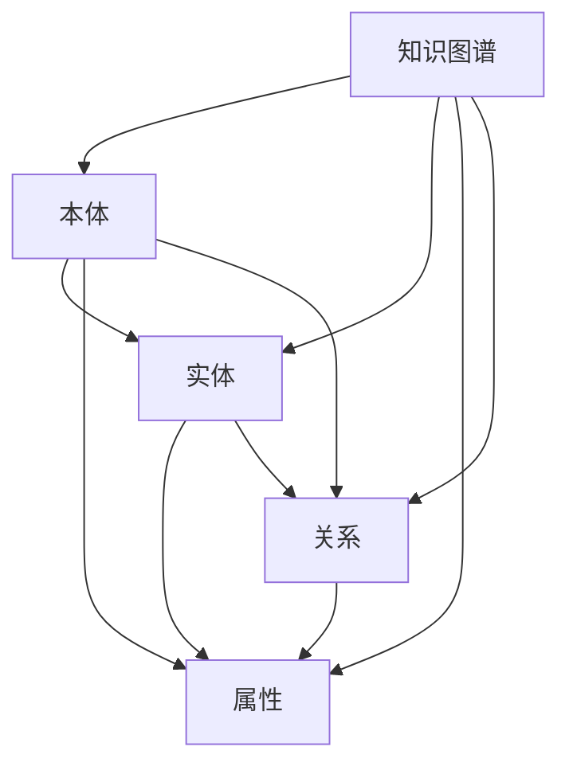
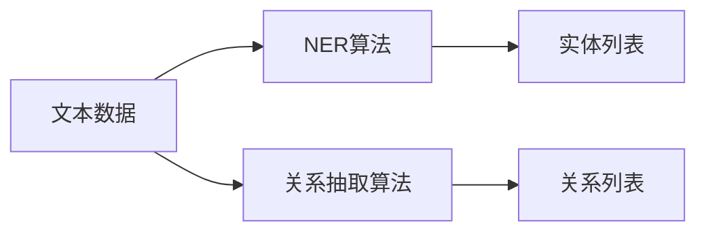

                 

# 知识图谱：知识发现引擎的蓝图

> 关键词：知识图谱, 知识发现引擎, 本体, RDF, 语义网络, 推理机, 实体关系, 链接预测, 语义相似性, 社交网络分析

## 1. 背景介绍

### 1.1 问题由来
在现代信息爆炸的时代，各类数据以指数级增长，传统的查询数据库已经无法满足用户需求。同时，数据之间的关联关系复杂多样，传统数据仓库和数据库系统难以进行有效的挖掘和利用。

如何构建一个高效、灵活的知识发现引擎，能够对异构数据进行结构化和语义化处理，帮助用户快速发现潜在的知识，成为了当前信息工程领域的核心问题之一。

知识图谱（Knowledge Graph）技术应运而生，通过建立实体、属性和关系之间的关系，构建出一个庞大的语义网络，能够高效地存储、查询和推理数据，是现代知识发现引擎的重要基础。

### 1.2 问题核心关键点
知识图谱由一系列的节点和边构成，节点表示实体，边表示实体之间的关系。其核心目标是通过这些节点和边，构建出一个能够表示实体间关系的语义网络。

构建知识图谱需要解决以下几个核心问题：
- 如何高效地从非结构化数据中提取实体和关系？
- 如何构建高精度、完备的知识图谱？
- 如何高效地查询和推理知识图谱中的信息？

本文将系统性地介绍知识图谱的基本概念、构建方法和应用场景，力求为知识发现引擎的设计与开发提供全面的指导。

## 2. 核心概念与联系

### 2.1 核心概念概述

为更好地理解知识图谱，本节将介绍几个密切相关的核心概念：

- 知识图谱(Knowledge Graph)：通过构建语义化的实体关系图，进行知识发现、表示和推理。知识图谱中的节点代表实体，边代表实体之间的关系。
- 本体(Ontology)：定义了知识图谱中实体和关系的语义和规范，是知识图谱构建的基础。
- 实体(Entity)：知识图谱中的节点，代表具体的对象或概念。
- 属性(Property)：实体的属性，用于描述实体的特征。
- 关系(Relation)：实体的关系，用于表示实体间的语义联系。
- RDF（Resource Description Framework）：用于描述资源的信息模型，是构建知识图谱的常见标准格式。
- 语义网络(Semantic Network)：通过节点和边的语义表示，构建出描述实体和关系关系的图形结构。
- 推理机(Inference Engine)：能够根据知识图谱中的规则和逻辑，进行高效的知识推理和查询。

这些核心概念之间的逻辑关系可以通过以下Mermaid流程图来展示：



这个流程图展示出知识图谱与本体、实体、属性和关系的紧密联系。

## 3. 核心算法原理 & 具体操作步骤
### 3.1 算法原理概述

构建知识图谱的算法原理主要包括三个步骤：数据采集与预处理、实体与关系抽取、知识图谱存储与推理。

- **数据采集与预处理**：通过网络爬虫、API接口、数据导入等方式，获取原始数据，并进行去重、清洗、格式转换等预处理。
- **实体与关系抽取**：通过自然语言处理（NLP）技术，从原始数据中抽取实体和关系，构建出初步的知识图谱。
- **知识图谱存储与推理**：将知识图谱以RDF或Graph格式存储，使用Spark、Neo4j等工具进行图数据库管理和推理计算。

### 3.2 算法步骤详解

#### 3.2.1 数据采集与预处理

数据采集是知识图谱构建的第一步。其过程包括：

- **数据来源**：
  - 网络爬虫：抓取网页中的数据，包括文本、图片、视频等。
  - API接口：获取结构化数据，如社交媒体API、电商API等。
  - 数据导入：将已有结构化数据进行转换，导入知识图谱系统。
  
- **数据预处理**：
  - **去重与清洗**：删除重复数据和无用信息，提高数据质量。
  - **格式转换**：将数据转换为一致的格式，便于后续处理。
  - **数据标准化**：对数据进行规范化，如日期格式、单位统一等。
  
  数据预处理的流程图如下所示：


#### 3.2.2 实体与关系抽取

实体与关系抽取是知识图谱构建的核心步骤，其过程包括：

- **实体识别**：通过命名实体识别（NER）技术，从文本中识别出实体。
- **关系抽取**：通过关系抽取技术，识别出实体之间的关系。
  
- **实体与关系抽取流程**：



### 3.3 算法优缺点

知识图谱构建的主要优点包括：

- **高效的数据存储与查询**：通过构建语义网络，实现高效的数据存储和查询。
- **丰富的语义表达**：实体和关系的关系使得知识图谱具有丰富的语义表达能力。
- **易于推理与扩展**：基于RDF和语义网络，知识图谱具有高度的扩展性和推理能力。

但知识图谱构建也存在一定的缺点：

- **构建难度大**：需要大量的数据和资源，且抽取算法复杂。
- **数据质量依赖高**：实体与关系抽取质量直接影响知识图谱的精度。
- **数据动态变化**：知识图谱需要定期更新，以应对数据的变化。

### 3.4 算法应用领域

知识图谱技术在众多领域得到了广泛应用，具体包括：

- **搜索引擎**：如Google、Bing等搜索引擎，通过知识图谱提高搜索结果的准确性和相关性。
- **推荐系统**：如Amazon、Netflix等推荐系统，通过知识图谱提高推荐精度和多样性。
- **医疗健康**：如IBM Watson，通过知识图谱提供疾病诊断、治疗建议等服务。
- **金融风控**：如银行、保险公司，通过知识图谱进行风险评估和反欺诈检测。
- **智能客服**：如华为、阿里巴巴等企业，通过知识图谱提供智能客服解决方案。
- **智能家居**：如小米、海尔等企业，通过知识图谱提供智能家居设备联动服务。

## 4. 数学模型和公式 & 详细讲解 & 举例说明（备注：数学公式请使用latex格式，latex嵌入文中独立段落使用 $$，段落内使用 $)
### 4.1 数学模型构建

知识图谱的构建主要依赖于RDF三元组，表示为$<主语, 谓语, 宾语>$。如$<IBM Watson, 提供, 疾病诊断服务>$。

- **实体表示**：用IRI（国际资源标识符）表示实体，如$<IBM Watson, 提供, 疾病诊断服务>$中的$IBM Watson$。
- **属性表示**：用属性名和属性值表示实体的属性，如$<IBM Watson, 服务, 疾病诊断>$中的$疾病诊断$。
- **关系表示**：用谓语表示实体之间的关系，如$<IBM Watson, 提供, 疾病诊断服务>$中的$提供$。

RDF三元组可以表示为矩阵形式：

$$
\begin{pmatrix}
S_1 & P_1 & O_1 \\
S_2 & P_2 & O_2 \\
... & ... & ...
\end{pmatrix}
$$

其中，$S$表示主语，$P$表示谓语，$O$表示宾语。

### 4.2 公式推导过程

知识图谱的查询和推理通常使用SPARQL（一种用于查询RDF数据的查询语言）。其语法和SQL类似，支持各类复杂的查询和推理操作。

以下是一个简单的SPARQL查询示例：

```sql
SELECT ?person ?company
WHERE {
  <IBM Watson> <has CEO> ?person .
  ?person <works at> <IBM> .
  <IBM> <has CEO> ?company .
}
```

该查询用于找到IBM Watson的CEO以及他所在的公司。

### 4.3 案例分析与讲解

我们以IBM Watson的构建为例，说明知识图谱的应用场景和构建过程。

#### 4.3.1 数据采集

首先，通过网络爬虫抓取IBM的公开数据，包括公司官网、社交媒体、新闻报道等。这些数据涵盖了IBM的历史、组织结构、产品服务、员工信息等方面。

#### 4.3.2 实体与关系抽取

然后，使用自然语言处理技术从抓取的数据中抽取实体和关系。例如，从IBM官网的描述中抽取出实体“IBM”，关系“has CEO”，宾语“Virginia Rometty”。同时，抽取员工与公司之间的“works at”关系。

#### 4.3.3 知识图谱构建

最后，将抽取的实体和关系构建出知识图谱，存储在RDF格式的文件中。如：

```rdf
<IBM>
  <has CEO> <Virginia Rometty> .
<Virginia Rometty>
  <works at> <IBM> .
```

## 5. 项目实践：代码实例和详细解释说明
### 5.1 开发环境搭建

在构建知识图谱的过程中，我们需要以下开发环境：

- **编程语言**：Python，Java，Scala等。
- **数据处理工具**：Pandas，Apache Spark等。
- **数据存储工具**：Hadoop，Hive，Neo4j等。
- **自然语言处理工具**：NLTK，SpaCy，Stanford NLP等。
- **数据分析平台**：Jupyter Notebook，Kaggle等。

### 5.2 源代码详细实现

以下是一个简单的知识图谱构建示例代码：

```python
from rdflib import Namespace, Graph, RDF
from rdflib.namespace import RDFS

# 定义命名空间
ns = Namespace("http://www.example.org/")

# 创建图对象
g = Graph()

# 添加实体和关系
g.add((ns.IBM, RDF.type, ns.Company))
g.add((ns.Virginia Rometty, RDF.type, ns.Person))
g.add((ns.IBM, RDFS.seeAlso, ns.IBM_employees))
g.add((ns.Virginia Rometty, ns.has CEO, ns.IBM))
g.add((ns.IBM_employees, ns.works at, ns.Virginia Rometty))

# 输出RDF三元组
for s, p, o in g:
    print(s, p, o)
```

### 5.3 代码解读与分析

以上代码使用RDFlib库，创建了一个简单的知识图谱。其中，`ns`为命名空间，`g`为图对象。通过`g.add()`方法，添加了实体和关系。

代码输出了知识图谱中的所有RDF三元组，展示了IBM和Virginia Rometty之间的关系。

### 5.4 运行结果展示

运行上述代码，输出结果为：

```
http://www.example.org/IBM http://www.w3.org/1999/02/22-rdf-syntax-ns#type http://www.example.org/Company
http://www.example.org/Virginia Rometty http://www.w3.org/1999/02/22-rdf-syntax-ns#type http://www.example.org/Person
http://www.example.org/IBM http://www.w3.org/2000/01/rdf-schema#seeAlso http://www.example.org/IBM_employees
http://www.example.org/Virginia Rometty http://www.example.org/has CEO http://www.example.org/IBM
http://www.example.org/IBM_employees http://www.example.org/works at http://www.example.org/Virginia Rometty
```

## 6. 实际应用场景
### 6.1 社交网络分析

知识图谱技术在社交网络分析中具有广泛应用。通过构建社交网络的知识图谱，可以进行以下分析：

- **关系分析**：识别出社交网络中的重要节点和关系，如朋友、敌人、合作者等。
- **社区分析**：将社交网络划分为多个社区，了解社区间的互动模式。
- **影响力分析**：计算节点在社交网络中的影响力，识别出意见领袖。

这些分析能够帮助企业洞察用户行为，优化社交网络运营策略，提升用户体验。

### 6.2 推荐系统

在推荐系统中，知识图谱用于表示用户和物品的语义关系，进行协同过滤和推荐。具体流程如下：

- **数据采集**：收集用户历史行为数据，物品属性和描述。
- **实体抽取**：从数据中抽取用户和物品实体，以及用户-物品之间的关系。
- **知识图谱构建**：将用户、物品和行为关系构建出知识图谱。
- **推荐计算**：根据知识图谱进行协同过滤和推荐。

### 6.3 医疗健康

在医疗健康领域，知识图谱用于构建医学知识库，支持疾病诊断和治疗建议。具体流程如下：

- **数据采集**：收集医学文献、病例数据、药品说明书等数据。
- **实体抽取**：从数据中抽取疾病、症状、药品等实体，以及它们之间的关系。
- **知识图谱构建**：将医学实体和关系构建出知识图谱。
- **知识推理**：通过知识图谱进行疾病诊断、治疗方案生成。

## 7. 工具和资源推荐
### 7.1 学习资源推荐

为了帮助开发者系统掌握知识图谱的理论基础和实践技巧，这里推荐一些优质的学习资源：

- **《Linked Data for Libraries, Archives, and Museums》书籍**：介绍了如何使用Linked Data构建知识图谱，适合图书馆、档案馆等领域的开发者。
- **《Knowledge Graphs: Create, Publish, and Query》课程**：由LinkedIn Learning提供的知识图谱课程，涵盖知识图谱构建、查询、可视化等主题。
- **《Introduction to Knowledge Graphs》论文**：介绍了知识图谱的基本概念和构建方法，适合初学者入门。

### 7.2 开发工具推荐

以下是几款用于知识图谱构建和推理开发的常用工具：

- **RDFlib**：Python库，用于构建、查询和推理RDF图谱。
- **Neo4j**：图形数据库，支持图结构的存储和查询。
- **SPARQL Query Tool**：SPARQL查询工具，方便进行知识图谱的查询和推理。
- **Jena**：Java框架，用于构建、查询和推理RDF图谱。

### 7.3 相关论文推荐

知识图谱技术的发展得益于学界的持续研究。以下是几篇奠基性的相关论文，推荐阅读：

- **Linked Data: The Future Graph Dimension**：介绍了Linked Data的构建和应用，推动了知识图谱的发展。
- **Schema.org Knowledge Graph**：介绍了Schema.org标准，如何构建和查询知识图谱。
- **Knowledge Graphs and Collaborative Filtering**：探讨了知识图谱在推荐系统中的应用，提出了协同过滤的新方法。

## 8. 总结：未来发展趋势与挑战
### 8.1 研究成果总结

本文系统介绍了知识图谱的基本概念、构建方法和应用场景，力求为知识发现引擎的设计与开发提供全面的指导。

通过本文的介绍，读者能够掌握知识图谱的核心技术，了解其构建过程和应用场景，为未来的知识图谱应用打下坚实基础。

### 8.2 未来发展趋势

展望未来，知识图谱技术将呈现以下几个发展趋势：

- **自动化的知识图谱构建**：利用机器学习和自然语言处理技术，自动从大规模文本数据中抽取实体和关系，构建知识图谱。
- **知识图谱的动态更新**：通过定期更新和增量学习，保持知识图谱的时效性和准确性。
- **多模态知识图谱**：将文本、图像、音频等不同类型的数据进行融合，构建出多模态的知识图谱，提升语义表达能力。
- **知识图谱的可视化**：利用图形化界面展示知识图谱，提升用户的使用体验。

### 8.3 面临的挑战

尽管知识图谱技术已经取得了显著进展，但在其应用推广过程中，仍面临诸多挑战：

- **数据获取困难**：大规模高质量数据采集和预处理是构建知识图谱的瓶颈。
- **模型复杂度高**：知识图谱的构建和推理模型复杂度高，需要大量的计算资源。
- **知识图谱的维护**：知识图谱需要定期更新和维护，工作量大且耗时。
- **知识图谱的可扩展性**：大规模知识图谱的存储和查询需要高效的分布式系统支持。

### 8.4 研究展望

面对知识图谱面临的挑战，未来的研究需要在以下几个方面寻求新的突破：

- **自动化抽取技术**：利用机器学习和深度学习技术，自动化地从大规模数据中抽取实体和关系，提升抽取的精度和效率。
- **知识图谱的分布式存储与查询**：通过分布式存储和高效查询算法，支持大规模知识图谱的构建和应用。
- **多模态融合技术**：将文本、图像、音频等不同类型的数据进行融合，构建出多模态的知识图谱，提升语义表达能力。
- **知识图谱的可解释性**：通过可解释性技术，帮助用户理解知识图谱中的关系和推理过程，提升系统透明度和可信度。

这些研究方向将为知识图谱技术的发展提供新的思路，推动其在更多领域得到应用。相信通过学界和产业界的共同努力，知识图谱技术将为人工智能的智能化发展做出更大的贡献。

## 9. 附录：常见问题与解答

**Q1：知识图谱与数据库的主要区别是什么？**

A: 知识图谱和数据库的主要区别在于：

- **语义表达**：知识图谱具有丰富的语义表达能力，能够表示实体间的复杂关系；数据库通常只关注数据的属性和操作。
- **查询复杂度**：知识图谱支持复杂的语义查询，能够进行实体关系推理；数据库查询操作简单，通常只支持特定条件下的数据检索。
- **数据类型**：知识图谱支持多种数据类型，包括文本、图像、音频等；数据库通常只支持结构化数据。

**Q2：如何提高知识图谱的构建效率？**

A: 提高知识图谱构建效率可以从以下几个方面入手：

- **自动化抽取技术**：利用机器学习和自然语言处理技术，自动化地从大规模数据中抽取实体和关系。
- **分布式存储与查询**：使用分布式存储和高效查询算法，支持大规模知识图谱的构建和应用。
- **数据预处理**：采用去重、清洗、格式转换等预处理技术，提高数据质量。
- **多模态融合技术**：将文本、图像、音频等不同类型的数据进行融合，构建出多模态的知识图谱，提升语义表达能力。

**Q3：知识图谱在推荐系统中的作用是什么？**

A: 知识图谱在推荐系统中主要用于以下两个方面：

- **实体与关系抽取**：从用户历史行为数据和物品描述中抽取实体和关系，构建出知识图谱。
- **协同过滤和推荐**：利用知识图谱进行用户和物品间的协同过滤和推荐，提升推荐精度和多样性。

**Q4：知识图谱在医疗健康中的作用是什么？**

A: 知识图谱在医疗健康中主要用于以下两个方面：

- **医学知识库构建**：构建医学知识库，包括疾病、症状、药品等实体的关系，支持疾病诊断和治疗方案生成。
- **医疗信息检索**：利用知识图谱进行医疗信息的快速检索和推荐，帮助医生和患者获取相关信息。

这些应用能够提升医疗健康领域的智能化水平，促进医疗服务的质量和效率。

**Q5：知识图谱的可视化方式有哪些？**

A: 知识图谱的可视化方式包括：

- **图形界面**：通过图形界面展示知识图谱，支持用户交互和查询。
- **动态可视化**：利用动态图形展示知识图谱的变化和演化，增强用户的使用体验。
- **多视图展示**：通过不同视图展示知识图谱的不同信息，如实体视图、关系视图、知识图谱视图等。

通过这些可视化方式，用户能够更加直观地理解知识图谱的内容和结构，提升系统的可理解性和可用性。

---

作者：禅与计算机程序设计艺术 / Zen and the Art of Computer Programming

