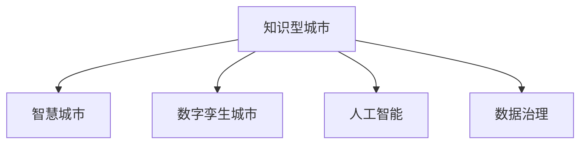

                 

# 知识型城市的规划与建设

> 关键词：知识型城市, 城市规划, 智能基础设施, 数据治理, 创新生态, 技术融合

## 1. 背景介绍

### 1.1 问题由来
随着信息技术的迅猛发展，数字化和智能化已成为推动城市发展和提升城市竞争力的重要动力。知识型城市作为创新驱动和人才集聚的典范，通过构建开放、共享、协作的知识生态系统，驱动经济社会高质量发展。其核心在于充分利用信息技术，将知识转化为生产力，促进产学研用深度融合，提升城市的创新能力、包容性、可持续性。

### 1.2 问题核心关键点
知识型城市规划与建设的核心关键点在于：
1. **数字化转型**：通过数字技术改造城市治理体系、服务体系和经济体系，推动城市向智能化、智慧化转型。
2. **数据驱动决策**：构建科学合理的数据治理体系，挖掘数据价值，支撑城市管理和决策。
3. **创新生态系统**：促进知识创新、技术创新、业态创新，形成开放、协作、持续的知识生态。
4. **技术融合与协同**：推动信息技术与其他领域技术的融合，实现技术协同创新和跨界应用。

## 2. 核心概念与联系

### 2.1 核心概念概述

为更好地理解知识型城市的规划与建设，本节将介绍几个密切相关的核心概念：

- **知识型城市**：以知识为核心的新型城市发展模式，强调知识与经济、文化、社会等领域的深度融合，促进人才、知识、技术和产业的协同发展。
- **智慧城市**：利用信息和通信技术（ICT），实现城市管理的智能化、信息化和协同化，提高城市运行效率和居民生活质量。
- **数字孪生城市**：通过数字技术构建虚拟城市模型，实现物理和数字世界的深度融合，提升城市管理和决策的科学性。
- **人工智能**：通过机器学习、深度学习等技术，实现自主决策、智能推荐、自然语言处理等功能，提升城市管理的智能化水平。
- **数据治理**：通过制定数据标准、规范和政策，保障数据安全、隐私和质量，促进数据的开放共享和价值挖掘。

这些核心概念之间的逻辑关系可以通过以下Mermaid流程图来展示：



这个流程图展示了许多关键概念之间的关联：

1. 知识型城市以智慧城市为支撑，利用智能基础设施和数字孪生技术，实现高效的城市治理和服务。
2. 数字孪生城市通过人工智能技术进行实时监控和预测，提升城市管理决策的科学性和前瞻性。
3. 人工智能和数据治理相辅相成，人工智能依赖数据进行训练和优化，数据治理保障数据质量和安全。
4. 这些技术手段共同作用，推动知识型城市向更高质量、更高效率、更可持续的方向发展。

## 3. 核心算法原理 & 具体操作步骤
### 3.1 算法原理概述

知识型城市的规划与建设，本质上是一个复杂的城市治理系统，涉及多个子系统的高效协同和优化。其核心算法原理包括：

1. **系统工程方法**：将城市视为一个复杂的系统，通过系统工程方法，对城市各个子系统进行建模和优化。
2. **优化算法**：如遗传算法、模拟退火算法、粒子群优化算法等，用于寻找最优的解决方案。
3. **人工智能算法**：包括机器学习、深度学习等，用于实现智能决策、预测和推荐。
4. **网络优化算法**：如图论算法、路径优化算法，用于优化城市交通、通信网络。

这些算法通过数学建模和计算，实现城市子系统之间的优化协同，提升城市运行的效率和质量。

### 3.2 算法步骤详解

基于知识型城市的规划与建设，通常包括以下几个关键步骤：

**Step 1: 数据收集与预处理**
- 收集城市各个子系统的数据，包括交通、环境、公共服务、经济等数据。
- 对数据进行清洗、去重、格式化等预处理，确保数据质量和一致性。

**Step 2: 建模与分析**
- 建立城市各子系统的数学模型，如交通流模型、环境污染模型、公共服务需求模型等。
- 对模型进行仿真和预测，分析各子系统的运行状态和影响因素。

**Step 3: 优化与决策**
- 利用优化算法，寻找各子系统的最优解，如交通网络的最优路径、能源系统的最优分配等。
- 结合人工智能算法，进行智能决策和预测，如智能交通信号控制、公共服务的智能调度等。

**Step 4: 部署与监控**
- 将优化结果和智能决策应用到城市运行中，如智能交通系统、智慧能源管理系统等。
- 实时监控城市运行状态，及时调整策略，确保系统的稳定性和可靠性。

**Step 5: 持续改进**
- 根据城市运行反馈，不断优化模型和算法，提升系统性能。
- 引入新技术和创新思维，持续推动城市治理的智能化和智慧化。

### 3.3 算法优缺点

知识型城市的规划与建设中使用的算法，具有以下优点：
1. 系统性：通过系统工程和优化算法，实现城市各子系统的协同优化。
2. 智能性：利用人工智能算法，提升城市治理的智能化和自动化水平。
3. 科学性：通过数学建模和仿真分析，确保决策的科学性和可靠性。

同时，这些算法也存在一定的局限性：
1. 复杂性：涉及多个子系统的复杂交互，算法设计和实现较为复杂。
2. 数据依赖：依赖高质量、高量的数据支持，数据收集和处理工作量大。
3. 动态性：城市环境和需求不断变化，算法需要具备一定的自适应性。
4. 伦理考量：算法决策需要考虑伦理和公平性，避免数据偏见和技术滥用。

尽管存在这些局限性，但就目前而言，这些算法是大规模城市治理和决策的重要支撑。未来相关研究的重点在于如何进一步降低算法复杂性，提高数据的自适应性和安全性，同时兼顾算法的伦理和公平性。

### 3.4 算法应用领域

基于知识型城市的规划与建设方法，已经在智慧城市、智能交通、智慧能源、环保监测等多个领域得到应用，取得了显著的效果。

- **智慧城市**：利用AI和大数据技术，提升城市管理和服务的智能化水平，如智能交通系统、智慧医疗、智能安防等。
- **智能交通**：通过大数据和AI技术，优化交通信号控制、车辆调度、路线规划等，提升交通效率和安全性。
- **智慧能源**：利用AI和物联网技术，优化能源分配和消耗，实现能源的智能化管理和节能减排。
- **环保监测**：通过遥感技术和AI算法，实时监测环境污染数据，提升环保治理的科学性和精准性。
- **公共服务**：利用AI和自然语言处理技术，提升公共服务的智能化水平，如智能客服、智慧教育、智慧社区等。

除了上述这些领域外，知识型城市的规划与建设还在智慧农业、智慧物流、智能制造等多个场景中得到应用，推动了传统行业的数字化转型。随着技术的不断进步，相信知识型城市的理念将更加深入人心，城市治理的智能化和智慧化水平也将不断提升。

## 4. 数学模型和公式 & 详细讲解  
### 4.1 数学模型构建

本节将使用数学语言对知识型城市的规划与建设过程进行更加严格的刻画。

设城市运行模型为 $M(x)$，其中 $x$ 表示城市各子系统的运行状态和参数。假设目标是最大化城市运行效率和居民满意度，即：

$$
\max_{x} f(M(x))
$$

其中 $f$ 为城市运行效率和居民满意度的评估函数。

城市运行模型 $M(x)$ 通常是一个复杂的非线性函数，需要通过数据和仿真进行逼近。常见的建模方法包括：

1. 线性回归模型：用于建模城市运行状态与经济、人口等指标的关系。
2. 非线性回归模型：用于建模城市运行状态与交通、环境等指标的复杂关系。
3. 系统动力学模型：用于建模城市子系统之间的动态交互和因果关系。
4. 仿真模型：用于进行城市运行状态的仿真和预测，如交通仿真、环境模拟等。

### 4.2 公式推导过程

以下我们以智能交通系统为例，推导一个简单的优化模型。

假设智能交通系统需要优化交通信号控制，目标是最大化道路的通行效率。假设城市中有 $n$ 个交叉口，每个交叉口有 $k$ 个信号灯，每个信号灯有 $t$ 种状态。设交通信号控制的目标是最大化所有交叉口交通流量的总和：

$$
\max_{\theta} \sum_{i=1}^n \sum_{j=1}^k \sum_{l=1}^t f_{ijl}(\theta)
$$

其中 $\theta$ 为信号灯状态和时间的参数，$f_{ijl}$ 为交叉口 $i$、信号灯 $j$、状态 $l$ 下的流量函数。

对该优化问题进行建模，需要定义以下变量和参数：
- $x_{ijl}$：信号灯 $j$ 在时间 $l$ 的状态。
- $t_{ijl}$：信号灯 $j$ 在时间 $l$ 的持续时间。
- $c_{ij}$：交叉口 $i$ 的通行能力。
- $v_{ij}$：交叉口 $i$ 的实际通行速度。
- $d_{ij}$：交叉口 $i$ 的交通需求。

假设信号灯状态和时间的优化模型为：

$$
\min_{x,t} \sum_{i=1}^n \sum_{j=1}^k \sum_{l=1}^t (x_{ijl}-1)^2 + \lambda \left( \sum_{i=1}^n \sum_{j=1}^k \sum_{l=1}^t (c_{ij}-v_{ij}) t_{ijl} - d_{ij} t_{ijl} \right)
$$

其中 $\lambda$ 为交通流量的权重系数。

通过对上述模型进行求解，可以得出最优的信号灯状态和持续时间，从而实现交通信号控制的最优化。

### 4.3 案例分析与讲解

以智慧城市中的智能电网为例，分析基于数学建模和优化算法对城市能源系统进行优化管理的案例。

假设智能电网的目标是最大化能源效率和减少能源消耗。假设城市中有 $m$ 个发电厂和 $n$ 个负荷点，每个发电厂和负荷点的功率需求和供应需通过优化算法进行匹配。设目标函数为：

$$
\max_{u,v} \sum_{i=1}^m u_i \times \text{efficiency}_i - \sum_{j=1}^n v_j \times \text{cost}_j
$$

其中 $u$ 为发电厂的输出功率，$v$ 为负荷点的输入功率，$\text{efficiency}_i$ 为发电厂 $i$ 的效率，$\text{cost}_j$ 为负荷点 $j$ 的能源成本。

优化模型中需要考虑以下约束条件：
- 发电厂和负荷点的功率平衡：$\sum_{i=1}^m u_i = \sum_{j=1}^n v_j$
- 发电厂的输出功率限制：$0 \leq u_i \leq \text{capacity}_i$
- 负荷点的输入功率限制：$0 \leq v_j \leq \text{capacity}_j$
- 发电厂和负荷点的运行时间限制：$t_{i,j}$ 为发电厂 $i$ 向负荷点 $j$ 供电的时间。

通过对上述模型进行求解，可以得出最优的发电厂输出功率和负荷点输入功率，从而实现能源系统的最优管理和节能减排。

## 5. 项目实践：代码实例和详细解释说明
### 5.1 开发环境搭建

在进行知识型城市规划与建设的项目实践前，我们需要准备好开发环境。以下是使用Python进行Simulink建模和仿真的环境配置流程：

1. 安装Matlab和Simulink：从官网下载并安装Matlab和Simulink软件。
2. 创建并激活虚拟环境：
```bash
conda create -n simulink-env python=3.8 
conda activate simulink-env
```

3. 安装必要的Python库：
```bash
pip install numpy scipy sympy pandas matplotlib simpy tqdm jupyter notebook ipython
```

4. 安装Simulink-Python接口：
```bash
pip install simpy-simulink
```

5. 准备城市运行数据的CSV文件。

完成上述步骤后，即可在`simulink-env`环境中开始项目实践。

### 5.2 源代码详细实现

下面我们以智能电网为例，给出使用Python和Simulink进行优化建模和仿真的代码实现。

首先，定义发电厂和负荷点的仿真模型：

```python
import simpy
import numpy as np
import simpy_simulink as sim

class PowerGrid:
    def __init__(self, env, params):
        self.env = env
        self.params = params
        self.generators = []
        self.loads = []
        self.interconnects = []
        
    def add_generator(self, generator):
        self.generators.append(generator)
        
    def add_load(self, load):
        self.loads.append(load)
        
    def add_interconnect(self, interconnect):
        self.interconnects.append(interconnect)
        
    def simulate(self):
        for i in range(len(self.generators)):
            self.generators[i].simulate(self.env)
        for i in range(len(self.loads)):
            self.loads[i].simulate(self.env)
        for i in range(len(self.interconnects)):
            self.interconnects[i].simulate(self.env)
```

然后，定义发电厂和负荷点的仿真类：

```python
class Generator:
    def __init__(self, env, params):
        self.env = env
        self.params = params
        self.capacity = params['capacity']
        self.efficiency = params['efficiency']
        self.current_power = 0
        
    def simulate(self):
        self.current_power = self.capacity * self.efficiency
        
class Load:
    def __init__(self, env, params):
        self.env = env
        self.params = params
        self.demand = params['demand']
        self.current_power = 0
        
    def simulate(self):
        self.current_power = self.demand
        
class Interconnect:
    def __init__(self, env, params):
        self.env = env
        self.params = params
        self.capacity = params['capacity']
        self.current_power = 0
        
    def simulate(self):
        self.current_power = self.capacity
```

接着，定义优化模型：

```python
from scipy.optimize import linprog

def optimize_powergrid(powergrid):
    # 定义变量和约束
    x = np.zeros(len(powergrid.generators))
    constraints = []
    for i in range(len(powergrid.generators)):
        constraints.append((0, powergrid.generators[i].capacity, -1))
    for i in range(len(powergrid.loads)):
        constraints.append((-powergrid.loads[i].current_power, 0, 1))
    constraints.append((0, powergrid.interconnects[0].capacity, 0))
    constraints.append((-powergrid.interconnects[0].current_power, 0, 1))
    
    # 目标函数
    c = np.zeros(len(powergrid.generators))
    for i in range(len(powergrid.generators)):
        c[i] = powergrid.generators[i].efficiency
    
    # 求解优化问题
    result = linprog(c, constraints)
    return result
```

最后，启动仿真流程：

```python
# 创建Simulink环境
env = sim.SimpySimulink()

# 定义参数
params = {
    'capacity': 1000,
    'efficiency': 0.8,
    'demand': 500,
    'capacity': 2000
}

# 创建发电厂和负荷点
powergrid = PowerGrid(env, params)
powergrid.add_generator(Generator(env, params))
powergrid.add_load(Load(env, params))
powergrid.add_interconnect(Interconnect(env, params))

# 运行仿真
powergrid.simulate()
result = optimize_powergrid(powergrid)
print(result)
```

以上就是使用Python和Simulink进行智能电网优化建模和仿真的完整代码实现。可以看到，借助Simulink-Python接口，我们可以将Matlab的仿真模型和Python代码无缝集成，实现复杂系统的建模和仿真。

### 5.3 代码解读与分析

让我们再详细解读一下关键代码的实现细节：

**PowerGrid类**：
- `__init__`方法：初始化环境、参数等关键组件。
- `add_generator`、`add_load`、`add_interconnect`方法：添加发电厂、负荷点和互连设备。
- `simulate`方法：进行仿真，调用各个组件的仿真函数。

**Generator、Load、Interconnect类**：
- 定义了发电厂、负荷点和互连设备的仿真类，继承自PowerGrid类。
- 在`simulate`方法中，计算当前功率，并将其输出。

**optimize_powergrid函数**：
- 使用SciPy库的linprog函数，进行线性规划求解。
- 定义目标函数和约束条件，根据求解结果返回优化结果。

**仿真流程**：
- 创建Simulink环境。
- 定义参数，创建发电厂、负荷点和互连设备。
- 进行仿真，并调用优化函数，输出优化结果。

可以看到，借助Simulink-Python接口，我们可以方便地将Python和Matlab的仿真模型结合，实现更加复杂和高效的建模和仿真。开发者可以根据具体需求，灵活调整模型和算法，提升仿真效果。

当然，工业级的系统实现还需考虑更多因素，如模型的扩展性、可维护性、实时性等。但核心的优化建模和仿真范式基本与此类似。

## 6. 实际应用场景
### 6.1 智能交通系统

智能交通系统是大规模知识型城市建设的重要组成部分。通过对交通流数据的建模和优化，可以实现交通信号控制、车辆调度、路线规划等功能，提升城市交通效率和安全性。

具体而言，智能交通系统可以包括以下几个主要应用场景：

- **交通信号控制**：通过实时监控交通流量和速度，优化交通信号灯的时序和状态，减少交通拥堵和等待时间。
- **车辆调度**：利用GPS和大数据分析技术，实时监控车辆位置和速度，优化车辆调度和路线规划。
- **交通事故预警**：通过实时监控交通摄像头和传感器数据，预测和预警潜在的交通事故，提高行车安全。
- **公共交通调度**：利用大数据和AI技术，优化公交车的运行路线和时间，提升公共交通的准时性和便捷性。

### 6.2 智慧能源系统

智慧能源系统通过智能化和数字化手段，优化能源分配和管理，实现节能减排和能源的高效利用。

具体而言，智慧能源系统可以包括以下几个主要应用场景：

- **能源分配优化**：通过实时监控能源供需关系，优化能源分配和消耗，实现节能减排。
- **智能电网管理**：利用大数据和AI技术，优化电力系统的运行和管理，提高电网的稳定性和可靠性。
- **能源数据监测**：通过物联网传感器，实时监控能源消耗和运行状态，提供能源监测和分析服务。
- **分布式能源管理**：利用区块链和智能合约技术，优化分布式能源的管理和交易，实现能源的智能化管理。

### 6.3 智能医疗系统

智能医疗系统通过智能化和数字化手段，优化医疗资源分配和管理，提升医疗服务的质量和效率。

具体而言，智能医疗系统可以包括以下几个主要应用场景：

- **医疗资源优化**：通过实时监控医院资源使用情况，优化医疗资源的分配和管理，提高医疗服务的效率和质量。
- **智能诊断和治疗**：利用AI和大数据分析技术，辅助医生进行疾病诊断和治疗，提升医疗服务的精准性和个性化。
- **远程医疗服务**：通过互联网技术，实现远程医疗咨询、诊断和治疗，提升医疗服务的可及性和便利性。
- **健康监测和管理**：利用可穿戴设备和物联网技术，实时监测用户的健康状况，提供健康管理和预警服务。

### 6.4 未来应用展望

随着知识型城市的不断发展，未来的智能基础设施和智慧治理将更加智能化、智慧化，为城市居民提供更加高效、便捷、安全的生活环境。

- **5G和物联网**：推动城市网络基础设施的智能化升级，实现万物互联，提升城市运行效率和智能化水平。
- **AI和大数据**：通过深度学习和大数据分析技术，提升城市治理的智能化和精细化水平，实现城市管理的科学决策。
- **数字孪生技术**：构建数字孪生城市，实现物理和数字世界的深度融合，提升城市治理的可视化和实时性。
- **知识共享与协同**：构建开放、共享、协作的知识生态，推动知识创新、技术创新和业态创新，促进城市的可持续发展。

## 7. 工具和资源推荐
### 7.1 学习资源推荐

为了帮助开发者系统掌握知识型城市的规划与建设技术，这里推荐一些优质的学习资源：

1. 《智慧城市建设指南》：系统介绍智慧城市的基本概念、规划原则和建设路径，适合初学者入门。
2. 《智能交通系统设计》：详细介绍智能交通系统的设计和实现方法，涵盖数据采集、模型建立、仿真优化等多个环节。
3. 《智慧能源系统设计与管理》：系统介绍智慧能源系统的设计与管理方法，涵盖能源优化、智能电网、分布式能源等多个方面。
4. 《智能医疗系统建设》：详细介绍智能医疗系统的设计与实现方法，涵盖医疗资源管理、智能诊断、远程医疗等多个方面。
5. 《城市数据治理与决策支持》：系统介绍城市数据治理的基本概念、方法和实践，涵盖数据采集、存储、分析和应用等多个环节。
6. 《人工智能与城市治理》：系统介绍AI技术在城市治理中的应用，涵盖智能交通、智慧能源、智能医疗等多个领域。

通过对这些资源的学习实践，相信你一定能够快速掌握知识型城市的规划与建设技术，并用于解决实际的智能城市问题。

### 7.2 开发工具推荐

高效的开发离不开优秀的工具支持。以下是几款用于知识型城市规划与建设开发的常用工具：

1. Matlab和Simulink：用于系统建模和仿真，提供丰富的建模和分析工具。
2. Python和SciPy：用于数学建模和优化，提供强大的计算和分析能力。
3. SimPy和SimPy-Simulink：用于系统仿真，提供易于扩展的仿真框架。
4. QGIS和ArcGIS：用于城市数据可视化和分析，提供丰富的地理信息分析和可视化工具。
5. Tableau和PowerBI：用于数据可视化和探索，提供强大的数据分析和可视化功能。

合理利用这些工具，可以显著提升知识型城市规划与建设任务的开发效率，加快创新迭代的步伐。

### 7.3 相关论文推荐

知识型城市建设涉及诸多前沿技术，以下是几篇奠基性的相关论文，推荐阅读：

1. "Smart Cities: Strategies for Smart Growth"：系统介绍智慧城市的规划和建设方法，涵盖城市治理、经济、环境等多个方面。
2. "Optimization of Power Grids Using Simulink and Python"：介绍使用Simulink和Python进行智能电网建模和优化的方法，提供详细的代码实例。
3. "Smart Traffic Systems: Modeling, Optimization and Simulation"：介绍智能交通系统的建模、优化和仿真方法，涵盖交通信号控制、车辆调度等多个方面。
4. "Data Governance and Decision Support for Smart Cities"：系统介绍城市数据治理和决策支持的基本概念、方法和实践，涵盖数据采集、存储、分析和应用等多个环节。
5. "Intelligent Energy Systems: Design and Management"：系统介绍智慧能源系统的设计与管理方法，涵盖能源优化、智能电网、分布式能源等多个方面。

这些论文代表了大规模城市治理和决策的技术发展脉络。通过学习这些前沿成果，可以帮助研究者把握学科前进方向，激发更多的创新灵感。

## 8. 总结：未来发展趋势与挑战
### 8.1 总结

本文对知识型城市的规划与建设方法进行了全面系统的介绍。首先阐述了知识型城市的基本概念和规划意义，明确了知识型城市在城市治理、经济、文化等方面的核心价值。其次，从原理到实践，详细讲解了知识型城市的规划与建设过程，介绍了系统工程方法、优化算法和人工智能算法在城市治理中的应用。同时，本文还广泛探讨了知识型城市在智慧交通、智能能源、智能医疗等多个领域的应用前景，展示了知识型城市的巨大潜力。此外，本文精选了知识型城市的各类学习资源，力求为读者提供全方位的技术指引。

通过本文的系统梳理，可以看到，知识型城市的规划与建设是大规模城市治理和决策的重要方法，通过数字化和智能化手段，推动城市向更高质量、更高效率、更可持续的方向发展。随着技术的不断进步，知识型城市的理念将更加深入人心，城市治理的智能化和智慧化水平也将不断提升。

### 8.2 未来发展趋势

展望未来，知识型城市的规划与建设将呈现以下几个发展趋势：

1. **全面数字化**：知识型城市将全面实现数字化转型，推动城市各子系统的智能化和智慧化。
2. **开放协作**：通过开放数据和平台，促进不同部门、不同领域的协同创新，形成开放、共享、协作的知识生态。
3. **智能决策**：利用AI和大数据技术，提升城市治理的智能化和自动化水平，实现科学决策和精准管理。
4. **跨界融合**：推动知识型城市与其他领域的深度融合，实现技术协同创新和跨界应用，提升城市的综合竞争力。
5. **可持续发展**：通过智能化手段，推动城市的可持续发展，实现经济、环境、社会的协调发展。

这些趋势凸显了知识型城市的广阔前景。通过数字化、智能化和开放协作，知识型城市将引领城市治理和管理的变革，推动经济社会高质量发展。

### 8.3 面临的挑战

尽管知识型城市的规划与建设具有广阔的前景，但在迈向更加智能化、智慧化应用的过程中，它仍面临诸多挑战：

1. **数据隐私和安全**：大规模数据采集和处理带来了数据隐私和安全问题，需要建立健全的数据治理和保护机制。
2. **技术标准和规范**：知识型城市的建设需要统一的技术标准和规范，避免技术多样性和互操作性问题。
3. **资源投入和成本**：知识型城市的建设需要大量的资金和资源投入，如何合理规划和配置资源，成为重要的课题。
4. **技术可靠性和稳定性**：知识型城市中的智能化系统需要具备高可靠性和稳定性，避免系统故障和数据丢失。
5. **伦理和公平性**：知识型城市中的智能系统需要考虑伦理和公平性问题，避免技术偏见和滥用。

这些挑战需要从技术、管理、伦理等多个层面进行综合应对，才能实现知识型城市的可持续发展。

### 8.4 研究展望

面向未来，知识型城市的规划与建设需要在以下几个方面寻求新的突破：

1. **数据隐私和安全**：开发高效的数据隐私保护技术，保障数据的安全性和隐私性。
2. **技术标准和规范**：制定统一的技术标准和规范，促进技术协同和互操作性。
3. **资源优化和配置**：优化资源配置和利用，提升知识型城市建设的效率和效益。
4. **系统可靠性和鲁棒性**：提高智能系统的可靠性和鲁棒性，确保系统的稳定性和可靠性。
5. **技术公平性和伦理**：确保技术的公平性和伦理性，避免技术偏见和滥用。

这些研究方向的探索，必将引领知识型城市建设向更高的台阶，为城市治理和管理的智能化和智慧化提供新的思路和方法。面向未来，知识型城市的理念和实践将继续引领城市发展的方向，推动人类社会的进步。

## 9. 附录：常见问题与解答

**Q1：知识型城市如何实现数据共享和开放？**

A: 知识型城市的建设需要大量的数据支持，实现数据共享和开放是关键。为实现数据共享和开放，可以采取以下措施：

1. **建立统一的数据平台**：建立城市级的数据仓库和数据平台，集中管理和共享各类数据。
2. **制定数据标准和规范**：制定统一的数据标准和规范，确保数据格式和语义的一致性。
3. **推动数据公开透明**：通过数据开放平台和API接口，推动各类数据的公开和透明，促进数据的开放共享。
4. **保障数据隐私和安全**：在数据共享和开放过程中，保障数据隐私和安全，避免数据泄露和滥用。

通过以上措施，可以实现知识型城市中的数据共享和开放，促进数据的有效利用和知识创新。

**Q2：知识型城市建设中如何保障数据隐私和安全？**

A: 知识型城市建设中，保障数据隐私和安全是至关重要的。为保障数据隐私和安全，可以采取以下措施：

1. **数据加密技术**：对敏感数据进行加密存储和传输，确保数据在传输和存储过程中的安全性。
2. **访问控制和认证**：建立严格的数据访问控制和认证机制，确保只有授权人员能够访问敏感数据。
3. **数据脱敏和匿名化**：对敏感数据进行脱敏和匿名化处理，减少数据泄露的风险。
4. **安全监控和审计**：建立安全监控和审计机制，实时监控数据访问和操作，及时发现和应对安全威胁。
5. **合规和标准**：遵循数据隐私和安全的相关法规和标准，确保数据处理和管理的合规性。

通过以上措施，可以保障知识型城市中的数据隐私和安全，提升数据治理的水平。

**Q3：知识型城市建设中如何实现跨部门协作？**

A: 知识型城市建设需要跨部门协作，实现数据共享、技术协同和业务协同。为实现跨部门协作，可以采取以下措施：

1. **建立协同机制**：建立跨部门协同机制，明确各部门的职责和协作方式。
2. **制定统一的标准和规范**：制定统一的技术标准和业务规范，确保各部门数据和业务的一致性。
3. **建立数据共享平台**：建立跨部门的数据共享平台，促进数据的共享和协作。
4. **推动跨部门培训和交流**：推动跨部门培训和交流，提升各部门的协作能力和沟通效率。

通过以上措施，可以实现知识型城市中的跨部门协作，提升城市治理和管理的协同性和整体性。

**Q4：知识型城市建设中如何实现可持续发展？**

A: 知识型城市建设需要实现可持续发展，促进经济、环境、社会的协调发展。为实现可持续发展，可以采取以下措施：

1. **推动绿色低碳技术**：推动绿色低碳技术的研发和应用，减少能源消耗和环境污染。
2. **优化资源配置**：优化城市资源配置和利用，提升资源的利用效率和效益。
3. **推动循环经济**：推动循环经济的发展，实现资源循环利用和废弃物减量化。
4. **推动社会包容性**：推动社会包容性的发展，保障不同群体的利益和福祉。

通过以上措施，可以实现知识型城市中的可持续发展，提升城市的综合竞争力和质量。

**Q5：知识型城市建设中如何实现技术公平性和伦理性？**

A: 知识型城市建设需要确保技术的公平性和伦理性，避免技术偏见和滥用。为实现技术公平性和伦理性，可以采取以下措施：

1. **建立技术伦理委员会**：建立技术伦理委员会，监督和评估技术的伦理性和公平性。
2. **推动公平算法和数据**：推动公平算法和数据的开发和应用，确保技术的公平性和透明性。
3. **强化技术监管和审核**：强化技术监管和审核机制，及时发现和纠正技术滥用问题。
4. **保障用户知情权和选择权**：保障用户对技术使用的知情权和选择权，提升技术的接受度和信任度。

通过以上措施，可以实现知识型城市中的技术公平性和伦理性，保障技术应用的公正和透明。

---

作者：禅与计算机程序设计艺术 / Zen and the Art of Computer Programming

