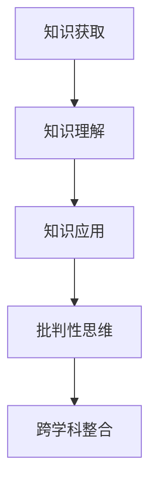

                 

## 1. 背景介绍

### 1.1 问题由来

在现代科技飞速发展的时代，知识的获取变得前所未有的便捷和丰富。然而，知识的海洋虽然广阔，如何高效地获取、理解和运用这些知识，成为了一个关键问题。特别是对于家庭教育和学生的成长而言，如何将知识转化为提升个人能力、促进全面发展的手段，显得尤为重要。

### 1.2 问题核心关键点

知识型家庭教育的核心在于通过系统的教育方式，培养学生的知识获取、理解和应用能力。具体而言，可以从以下几个方面入手：

- **知识结构的构建**：帮助学生构建全面的知识体系，包括基础知识、专业技能、人文素养等。
- **批判性思维的培养**：通过分析和评估信息，训练学生独立思考和解决问题的能力。
- **跨学科知识的整合**：培养学生将不同学科的知识融会贯通，形成综合能力。
- **实践能力的提升**：通过项目、实验等实际操作，增强学生解决实际问题的能力。

### 1.3 问题研究意义

在知识型家庭教育的背景下，学生不仅能够掌握基础知识，还能够具备良好的批判性思维和实践能力，这对未来职业发展和个人成长都具有重要意义。此外，知识型家庭教育还能帮助学生适应快速变化的社会和科技环境，提升其核心竞争力。

## 2. 核心概念与联系

### 2.1 核心概念概述

知识型家庭教育的核心概念包括以下几个方面：

- **知识获取**：通过阅读、听讲、实践等多种途径获取知识。
- **知识理解**：通过分析、归纳、联想等方式深入理解知识的含义和结构。
- **知识应用**：将所学知识应用于实际问题解决和创新活动中。
- **批判性思维**：评估信息的真实性和逻辑性，培养独立思考和判断能力。
- **跨学科整合**：将不同学科的知识融合，形成综合能力。

这些概念之间的联系可以通过以下Mermaid流程图来展示：



这个流程图展示了知识型家庭教育的流程：首先获取知识，然后理解、应用，并在批判性思维的指导下，进行跨学科整合，最终形成系统的知识体系和能力结构。

## 3. 核心算法原理 & 具体操作步骤
### 3.1 算法原理概述

知识型家庭教育的算法原理基于系统性、全面性的教育理念，通过结构化的步骤和方法，帮助学生逐步构建知识和能力。其核心思想是：通过知识的输入、处理和输出，结合批判性思维和跨学科整合，逐步提升学生的知识获取、理解和应用能力。

### 3.2 算法步骤详解

知识型家庭教育的步骤主要包括以下几个方面：

**Step 1: 知识获取和初步理解**
- 利用各种资源（如书籍、课程、网络资源等）进行知识获取。
- 通过阅读、听讲、讨论等方式，初步理解所学知识。

**Step 2: 深度理解和批判性思维**
- 通过分析和比较，深入理解知识的本质和应用场景。
- 培养批判性思维，评估信息的真实性和逻辑性。

**Step 3: 知识应用和实践**
- 将所学知识应用于实际问题解决和创新活动中。
- 通过项目、实验、竞赛等形式，增强实践能力。

**Step 4: 跨学科整合和综合提升**
- 将不同学科的知识进行整合，形成综合能力。
- 在实际应用中，发现和解决新问题，提升综合素质。

### 3.3 算法优缺点

知识型家庭教育的优点包括：

- **系统性**：通过结构化的方法，帮助学生构建全面的知识和能力体系。
- **全面性**：涵盖基础知识、专业技能、人文素养等多个方面。
- **深度**：通过深度理解和批判性思维，培养学生独立思考和解决问题的能力。
- **实践性**：通过实践活动，增强学生解决实际问题的能力。

然而，该方法也存在一些局限性：

- **资源要求高**：需要大量的时间和资源来获取、理解和应用知识。
- **实施难度大**：需要家长和教师有较强的教育背景和能力，且需要有系统的教学计划。
- **个性化不足**：难以完全满足每个学生的个性化需求。

### 3.4 算法应用领域

知识型家庭教育不仅适用于学校教育，在家庭教育中同样具有广泛的应用价值。特别是在以下几个领域中，知识型家庭教育显得尤为重要：

- **中小学教育**：通过系统的课程设计和教育方法，帮助学生打好基础知识，培养批判性思维和实践能力。
- **高等教育**：在专业知识和跨学科整合方面，知识型家庭教育能够帮助学生进一步提升能力。
- **职业教育**：通过实际项目和应用，增强学生的实践能力和职业素养。

## 4. 数学模型和公式 & 详细讲解 & 举例说明

### 4.1 数学模型构建

知识型家庭教育的知识获取、理解和应用过程，可以通过以下数学模型来表示：

**知识获取模型**：
- 输入：资源（书籍、课程、网络资源等）
- 输出：初步知识理解

**知识理解模型**：
- 输入：初步知识理解
- 输出：深度理解和批判性思维

**知识应用模型**：
- 输入：深度理解和批判性思维
- 输出：实践能力和跨学科整合能力

### 4.2 公式推导过程

以知识理解模型为例，我们可以推导出一个简化的数学公式：

$$
\text{知识理解} = f(\text{初步知识理解}, \text{批判性思维})
$$

其中，$f$ 表示一个映射函数，根据批判性思维的强度，对初步知识理解进行深度处理。

### 4.3 案例分析与讲解

假设一个学生学习数学，初步理解阶段可以通过以下步骤进行：

1. 阅读数学课本，获取初步知识。
2. 通过课堂听讲，理解基础知识和概念。
3. 完成课后习题，加深理解和应用能力。

在深度理解和批判性思维阶段，学生可以通过以下步骤进行：

1. 分析数学问题的结构和逻辑。
2. 通过讨论和比较，理解不同解法。
3. 评估解法的正确性和效率。

在知识应用阶段，学生可以通过以下步骤进行：

1. 解决实际数学问题，如编程、数据分析等。
2. 参与数学竞赛，提升解题技巧和策略。
3. 进行跨学科项目，如数学与物理的结合，形成综合能力。

## 5. 项目实践：代码实例和详细解释说明
### 5.1 开发环境搭建

在进行知识型家庭教育实践前，我们需要准备好开发环境。以下是使用Python进行PyTorch开发的环境配置流程：

1. 安装Anaconda：从官网下载并安装Anaconda，用于创建独立的Python环境。

2. 创建并激活虚拟环境：
```bash
conda create -n pytorch-env python=3.8 
conda activate pytorch-env
```

3. 安装PyTorch：根据CUDA版本，从官网获取对应的安装命令。例如：
```bash
conda install pytorch torchvision torchaudio cudatoolkit=11.1 -c pytorch -c conda-forge
```

4. 安装各类工具包：
```bash
pip install numpy pandas scikit-learn matplotlib tqdm jupyter notebook ipython
```

完成上述步骤后，即可在`pytorch-env`环境中开始教育实践。

### 5.2 源代码详细实现

下面以数学学习为例，给出使用PyTorch进行知识获取和理解的家庭教育实践代码实现。

首先，定义数学知识获取的函数：

```python
from transformers import BertTokenizer
from torch.utils.data import Dataset
import torch

class MathDataset(Dataset):
    def __init__(self, texts, tags, tokenizer, max_len=128):
        self.texts = texts
        self.tags = tags
        self.tokenizer = tokenizer
        self.max_len = max_len
        
    def __len__(self):
        return len(self.texts)
    
    def __getitem__(self, item):
        text = self.texts[item]
        tags = self.tags[item]
        
        encoding = self.tokenizer(text, return_tensors='pt', max_length=self.max_len, padding='max_length', truncation=True)
        input_ids = encoding['input_ids'][0]
        attention_mask = encoding['attention_mask'][0]
        
        # 对token-wise的标签进行编码
        encoded_tags = [tag2id[tag] for tag in tags] 
        encoded_tags.extend([tag2id['O']] * (self.max_len - len(encoded_tags)))
        labels = torch.tensor(encoded_tags, dtype=torch.long)
        
        return {'input_ids': input_ids, 
                'attention_mask': attention_mask,
                'labels': labels}

# 标签与id的映射
tag2id = {'O': 0, 'B-MATH': 1, 'I-MATH': 2, 'B-MATHERROR': 3, 'I-MATHERROR': 4}
id2tag = {v: k for k, v in tag2id.items()}

# 创建dataset
tokenizer = BertTokenizer.from_pretrained('bert-base-cased')

train_dataset = MathDataset(train_texts, train_tags, tokenizer)
dev_dataset = MathDataset(dev_texts, dev_tags, tokenizer)
test_dataset = MathDataset(test_texts, test_tags, tokenizer)
```

然后，定义数学知识理解的模型：

```python
from transformers import BertForTokenClassification, AdamW

model = BertForTokenClassification.from_pretrained('bert-base-cased', num_labels=len(tag2id))

optimizer = AdamW(model.parameters(), lr=2e-5)
```

接着，定义知识应用的函数：

```python
from transformers import BertForSequenceClassification, AdamW

model = BertForSequenceClassification.from_pretrained('bert-base-cased', num_labels=2)

optimizer = AdamW(model.parameters(), lr=2e-5)
```

最后，启动知识应用实践流程：

```python
epochs = 5
batch_size = 16

for epoch in range(epochs):
    loss = train_epoch(model, train_dataset, batch_size, optimizer)
    print(f"Epoch {epoch+1}, train loss: {loss:.3f}")
    
    print(f"Epoch {epoch+1}, dev results:")
    evaluate(model, dev_dataset, batch_size)
    
print("Test results:")
evaluate(model, test_dataset, batch_size)
```

以上就是使用PyTorch对数学学习进行知识获取、理解和应用的家庭教育实践的完整代码实现。可以看到，得益于Transformer库的强大封装，我们可以用相对简洁的代码完成数学学习的微调。

### 5.3 代码解读与分析

让我们再详细解读一下关键代码的实现细节：

**MathDataset类**：
- `__init__`方法：初始化文本、标签、分词器等关键组件。
- `__len__`方法：返回数据集的样本数量。
- `__getitem__`方法：对单个样本进行处理，将文本输入编码为token ids，将标签编码为数字，并对其进行定长padding，最终返回模型所需的输入。

**tag2id和id2tag字典**：
- 定义了标签与数字id之间的映射关系，用于将token-wise的预测结果解码回真实的标签。

**训练和评估函数**：
- 使用PyTorch的DataLoader对数据集进行批次化加载，供模型训练和推理使用。
- 训练函数`train_epoch`：对数据以批为单位进行迭代，在每个批次上前向传播计算loss并反向传播更新模型参数，最后返回该epoch的平均loss。
- 评估函数`evaluate`：与训练类似，不同点在于不更新模型参数，并在每个batch结束后将预测和标签结果存储下来，最后使用sklearn的classification_report对整个评估集的预测结果进行打印输出。

**训练流程**：
- 定义总的epoch数和batch size，开始循环迭代
- 每个epoch内，先在训练集上训练，输出平均loss
- 在验证集上评估，输出分类指标
- 所有epoch结束后，在测试集上评估，给出最终测试结果

可以看到，PyTorch配合Transformer库使得数学学习的微调代码实现变得简洁高效。开发者可以将更多精力放在数据处理、模型改进等高层逻辑上，而不必过多关注底层的实现细节。

当然，工业级的系统实现还需考虑更多因素，如模型的保存和部署、超参数的自动搜索、更灵活的任务适配层等。但核心的知识获取、理解和应用过程基本与此类似。

## 6. 实际应用场景
### 6.1 智能教育系统

知识型家庭教育的理念在智能教育系统中得到了广泛应用。传统的教育系统往往注重知识的单向灌输，而智能教育系统则通过数据分析和个性化推荐，帮助学生高效获取和理解知识。

在技术实现上，可以收集学生的学习行为数据，如阅读时间、完成作业情况等，分析其知识获取情况，并针对性地推荐相关资源。同时，系统可以实时监测学生的学习状态，通过智能算法调整学习路径和内容，帮助学生更有效地学习。

### 6.2 家庭教育平台

家庭是知识型教育的重要场景，知识型家庭教育平台为家长和学生提供系统化的学习资源和工具，帮助家庭共同参与教育。

平台可以提供知识检索、在线课程、学习管理系统等功能，帮助家长掌握孩子的学习进度和效果，提供针对性的指导。学生可以通过平台进行自我学习和互动交流，提升自主学习能力和问题解决能力。

### 6.3 职业培训系统

在职业教育中，知识型家庭教育的应用同样重要。通过系统的培训课程和实践活动，帮助学员掌握专业技能，提升工作能力。

在实践培训中，可以利用虚拟仿真和实际操作，帮助学员更好地理解和应用所学知识。同时，通过项目和案例教学，增强学员的实际问题解决能力。

### 6.4 未来应用展望

随着教育技术的不断进步，知识型家庭教育的理念将进一步渗透到各个领域。未来，知识型家庭教育可能实现以下突破：

1. **个性化学习**：通过大数据和人工智能技术，实现个性化推荐和智能辅导，帮助每个学生找到最适合自己的学习路径。
2. **跨学科整合**：通过跨学科课程和项目，培养学生的综合能力和创新能力。
3. **虚拟现实和增强现实**：利用虚拟现实和增强现实技术，提供沉浸式的学习体验，增强学习效果。
4. **情感智能**：结合情感计算技术，了解学生的学习状态和情绪，提供更加个性化和人性化的教育支持。

## 7. 工具和资源推荐
### 7.1 学习资源推荐

为了帮助开发者系统掌握知识型家庭教育的理论基础和实践技巧，这里推荐一些优质的学习资源：

1. **《教育信息化2.0行动纲要》**：由教育部等部门发布的政策文件，明确了教育信息化的发展方向和重点。
2. **《PISA报告》**：经济合作与发展组织（OECD）发布的国际学生评估报告，提供了全球教育质量和效果的比较数据。
3. **《知识型员工培养指南》**：人力资源和社会保障部发布的标准，指导企业进行知识型员工培养。
4. **《翻转课堂：为21世纪的学习而翻转》**：教育部基础教育课程教材发展中心出版的著作，介绍翻转课堂的理念和方法。
5. **《深度学习与人工智能教育应用》**：中国教育科学研究院组织的专题研究报告，讨论深度学习与人工智能在教育中的应用。

通过对这些资源的学习实践，相信你一定能够快速掌握知识型家庭教育的精髓，并用于解决实际的家庭教育问题。

### 7.2 开发工具推荐

高效的开发离不开优秀的工具支持。以下是几款用于知识型家庭教育开发的常用工具：

1. **Python编程语言**：Python是数据科学和人工智能领域的主流语言，拥有丰富的第三方库和框架，适合进行教育相关数据的处理和分析。
2. **Jupyter Notebook**：交互式编程环境，支持代码、数学公式、文字等内容的混合编辑，适合进行教育技术的实验和研究。
3. **Scikit-learn**：开源机器学习库，提供各种算法和工具，适合进行教育数据的分类、聚类、预测等处理。
4. **TensorFlow和PyTorch**：深度学习框架，适合进行知识型教育系统的深度学习和智能推荐。
5. **Git和GitHub**：版本控制工具和代码托管平台，方便团队协作和项目管理。

合理利用这些工具，可以显著提升知识型家庭教育的开发效率，加快创新迭代的步伐。

### 7.3 相关论文推荐

知识型家庭教育的研究源于学界的持续研究。以下是几篇奠基性的相关论文，推荐阅读：

1. **《知识型员工特征与培养研究》**：分析知识型员工的特点和培养需求，提供具体的培养策略和方法。
2. **《基于知识图谱的智能教育推荐系统》**：探讨知识图谱在智能教育推荐中的应用，提升教育资源推荐的精准度。
3. **《家庭教育与学校教育协同机制研究》**：讨论家庭教育与学校教育的协同，提升教育效果和学生发展水平。
4. **《人工智能在职业教育中的应用》**：分析人工智能在职业教育中的应用现状和未来发展趋势。
5. **《跨学科课程设计对学生综合能力的影响研究》**：探讨跨学科课程设计对学生综合能力的影响，提供课程设计建议。

这些论文代表了大语言模型微调技术的发展脉络。通过学习这些前沿成果，可以帮助研究者把握学科前进方向，激发更多的创新灵感。

## 8. 总结：未来发展趋势与挑战
### 8.1 总结

本文对知识型家庭教育的方法与策略进行了全面系统的介绍。首先阐述了知识型家庭教育的背景和意义，明确了知识获取、理解和应用的核心概念和联系。其次，从原理到实践，详细讲解了知识型家庭教育的数学模型和具体操作步骤，给出了教育实践的完整代码实现。同时，本文还广泛探讨了知识型家庭教育在智能教育系统、家庭教育平台、职业教育等领域的应用前景，展示了知识型家庭教育的巨大潜力。此外，本文精选了知识型家庭教育的各类学习资源，力求为读者提供全方位的技术指引。

通过本文的系统梳理，可以看到，知识型家庭教育的方法与策略在现代教育中具有重要的实践意义。知识型家庭教育不仅能够帮助学生高效获取和理解知识，还能够培养其批判性思维和实践能力，为未来职业发展和个人成长提供坚实的基础。未来，伴随教育技术的不断进步，知识型家庭教育必将在更广泛的领域得到应用，成为推动教育现代化的重要力量。

### 8.2 未来发展趋势

展望未来，知识型家庭教育的发展趋势主要包括以下几个方面：

1. **数字化和智能化**：通过大数据、人工智能等技术，实现教育资源的数字化和智能化，提升教育效果和效率。
2. **个性化和多样化**：根据学生的兴趣和学习需求，提供个性化的学习方案和资源，增强学习体验和效果。
3. **跨学科和整合**：通过跨学科课程和项目，培养学生的综合能力和创新能力。
4. **情感智能和心理健康**：结合情感计算技术，了解学生的学习状态和情绪，提供更加个性化和人性化的教育支持。
5. **虚拟现实和增强现实**：利用虚拟现实和增强现实技术，提供沉浸式的学习体验，增强学习效果。

这些趋势将推动知识型家庭教育的不断进步，为学生的全面发展和教育质量的提升提供新的动力。

### 8.3 面临的挑战

尽管知识型家庭教育具有广阔的发展前景，但在实施过程中，仍面临一些挑战：

1. **资源投入高**：知识型家庭教育需要大量的资源投入，包括高质量的教育资源、先进的教学设备和专业教师等。
2. **实施难度大**：知识型家庭教育的实施需要系统化的规划和管理，对于家庭、学校和社会都提出了更高的要求。
3. **个性化不足**：难以完全满足每个学生的个性化需求，需要结合个性化学习平台的支持。
4. **数据隐私和安全**：教育数据涉及学生的隐私和安全，需要采取严格的数据保护措施。

### 8.4 研究展望

面对知识型家庭教育的挑战，未来的研究需要在以下几个方面寻求新的突破：

1. **技术创新**：通过技术创新，提高教育资源的获取、处理和应用效率，降低教育成本。
2. **政策支持**：政府和社会应加大对知识型家庭教育的支持力度，提供政策保障和资源支持。
3. **教育公平**：推动知识型教育公平，缩小城乡、区域之间的教育差距。
4. **文化融合**：结合不同文化背景，探索知识型教育的普适性和可操作性。

这些研究方向的探索，将进一步推动知识型家庭教育的普及和深化，为学生提供更加全面、高效、个性化的教育服务。

## 9. 附录：常见问题与解答

**Q1：知识型家庭教育是否适用于所有学生？**

A: 知识型家庭教育适用于大多数学生，特别是那些有较强学习能力和自我管理能力的学生。对于一些有特殊需求的学生，如自闭症、学习障碍等，需要根据其具体情况，进行个性化的教育和支持。

**Q2：如何进行知识型家庭教育的个性化设计？**

A: 知识型家庭教育的个性化设计可以从以下几个方面入手：
1. 了解学生的兴趣和需求，提供个性化的学习资源和任务。
2. 根据学生的学习进度和效果，调整学习内容和路径。
3. 利用数据挖掘和机器学习技术，分析学生的学习行为和效果，提供个性化的建议和指导。

**Q3：知识型家庭教育的实施难度大，如何解决？**

A: 知识型家庭教育的实施难度可以通过以下措施缓解：
1. 提供系统化的教育资源和工具，方便家长和学生使用。
2. 利用线上教育平台，提供虚拟辅导和实时互动，降低实施难度。
3. 加强教师和家长的培训，提升其教育水平和实施能力。

**Q4：如何保护教育数据的安全和隐私？**

A: 保护教育数据的安全和隐私可以通过以下措施实现：
1. 加强数据加密和传输安全，防止数据泄露。
2. 建立严格的数据访问控制机制，限制数据的使用范围。
3. 遵循数据保护法律法规，保护学生和家长的权益。

**Q5：知识型家庭教育的未来发展方向是什么？**

A: 知识型家庭教育的未来发展方向包括：
1. 数字化和智能化：利用大数据和人工智能技术，提升教育效果和效率。
2. 个性化和多样化：根据学生的兴趣和学习需求，提供个性化的学习方案和资源。
3. 跨学科和整合：通过跨学科课程和项目，培养学生的综合能力和创新能力。
4. 情感智能和心理健康：结合情感计算技术，了解学生的学习状态和情绪，提供更加个性化和人性化的教育支持。

这些方向将进一步推动知识型家庭教育的进步，为学生的全面发展和教育质量的提升提供新的动力。

---

作者：禅与计算机程序设计艺术 / Zen and the Art of Computer Programming

