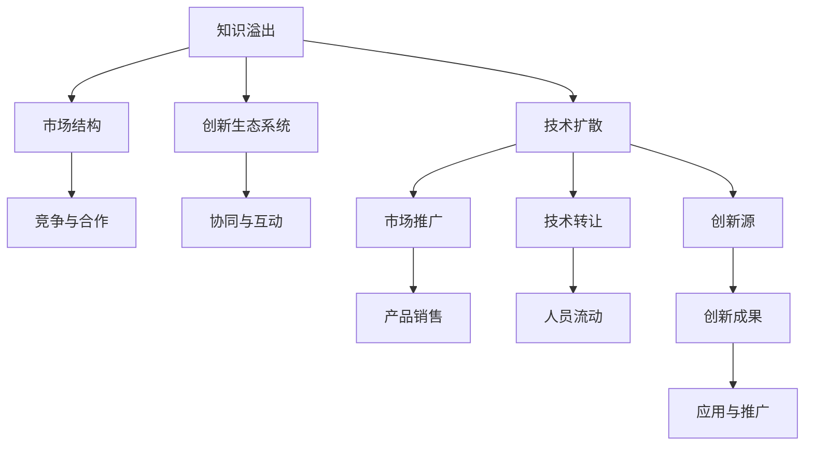

                 

# 知识溢出效应及其经济影响

## 1. 背景介绍

### 1.1 问题由来
知识溢出（Knowledge Spillover）是指个体或组织通过学习、模仿、创新等活动所积累的知识、技能、技术和信息，向外部环境或社会整体产生扩散效应。这种溢出效应可以显著提升社会生产力，促进经济增长，但同时也可能带来知识垄断、市场竞争失衡等负面影响。

随着全球化、数字化技术的深入发展，知识溢出效应日益显著。信息技术、生物医药、新材料等领域，知识密集型的创新活动愈加频繁，行业内外、国际间的知识交流和融合程度加深，知识溢出效应日益突出。研究知识溢出效应及其经济影响，对于制定科学的创新政策，促进技术进步，优化资源配置，具有重要意义。

### 1.2 问题核心关键点
知识溢出效应可以从多个维度进行分类：

- **创新者与被模仿者**：指创新者在创新过程中积累的知识、技术等，通过市场、技术合作等途径向其他企业或个人传播。
- **国内与国际**：指不同国家或地区间的知识溢出，特别是在全球化和技术转移的背景下，跨国溢出效应显著。
- **产业与非产业**：指知识在不同行业间的扩散，特别是新知识对传统产业的改造和升级作用。
- **政府与市场**：指政府主导的科研机构、大学等与市场主体间的知识溢出，以及市场竞争带来的自然溢出。

在分析知识溢出效应的影响时，需要从微观、中观和宏观多个层面进行综合考量。

## 2. 核心概念与联系

### 2.1 核心概念概述

为更好地理解知识溢出效应的本质，本节将介绍几个密切相关的核心概念：

- **知识溢出（Knowledge Spillover）**：指知识在不同个体、组织、行业之间的自然传播和扩散，提升社会整体的技术水平和经济效率。
- **技术扩散（Technological Diffusion）**：指新知识、新技术从创新源向市场推广的过程，包括产品推广、技术转让、人员流动等方式。
- **市场结构（Market Structure）**：指市场中各类参与者（如企业、消费者、政府）之间的竞争和合作关系，影响知识溢出的流向和强度。
- **创新生态系统（Innovation Ecosystem）**：指创新过程中各主体（如科研机构、企业、大学）之间的相互作用和协同，影响知识溢出的广度和深度。

这些核心概念之间的逻辑关系可以通过以下Mermaid流程图来展示：



这个流程图展示了这个系统的核心组件及其之间的关系：

1. 知识溢出在市场中推动技术扩散。
2. 市场结构决定了知识流动的动力与阻力。
3. 创新生态系统增强了知识溢出的互动和协同。
4. 技术扩散通过市场推广、产品销售等方式进一步拓展。
5. 人员流动和技术转让是知识扩散的重要途径。
6. 创新源生成新知识，并推动其转化为应用成果。

这些概念共同构成了知识溢出效应的研究框架，帮助我们深入理解其本质和作用机制。

## 3. 核心算法原理 & 具体操作步骤
### 3.1 算法原理概述

知识溢出效应的量化分析，主要依赖于经济学、社会学、信息科学等多学科的综合研究。以下是对知识溢出效应的基本原理和核心步骤的介绍：

**3.1.1 知识溢出机制**
知识溢出可以通过以下几种方式实现：

- **市场交易**：如技术许可、专利交易、人员流动等。
- **知识共享**：如开放源代码、学术论文、专利数据库等。
- **模仿学习**：如借鉴他国成功经验、复制优秀企业的管理模式等。
- **创新竞争**：如市场竞争压力推动技术改进、创新实践的示范效应等。

**3.1.2 知识溢出模型**
知识溢出效应可以用多个模型来描述，如Klemperer和Prescott的“学习效应”模型、Griliches的“技术传播”模型等。

其中，Griliches的“技术传播”模型表示：

$$
Y = \alpha X + \beta \sum_{i=1}^n (I_i - I_0) + \varepsilon
$$

其中：
- $Y$ 表示创新成果，$X$ 表示投入的研发资金，$I_i$ 表示创新源 $i$ 的知识溢出。
- 系数 $\alpha$ 和 $\beta$ 分别表示投资回报率和溢出效应系数。

**3.1.3 知识溢出影响因素**
知识溢出受多种因素影响，如技术复杂度、知识保护的知识产权保护、市场竞争程度等。

- **技术复杂度**：复杂技术更难被复制，溢出效应可能较弱。
- **知识产权保护**：知识产权保护的强度影响知识的流通和应用。
- **市场竞争程度**：竞争激烈的市场中，企业更可能通过技术扩散来获得竞争优势。

### 3.2 算法步骤详解

知识溢出效应的量化分析通常包括以下几个关键步骤：

**Step 1: 数据收集与预处理**
- 收集与知识溢出相关的数据，如专利申请、论文发表、技术交易记录等。
- 对数据进行清洗、归一化、标准化等预处理，确保数据质量。

**Step 2: 选择建模方法**
- 根据数据类型和分析目的，选择合适的模型。如Griliches的“技术传播”模型、Baldwin和Clerides的“知识溢出”模型等。
- 对于微观分析，可使用回归分析、因子分析等方法。

**Step 3: 模型训练与评估**
- 使用历史数据训练模型，预测新数据下的知识溢出效应。
- 评估模型预测结果与实际数据的一致性，通过均方误差、R²等指标进行评价。

**Step 4: 结果解释与应用**
- 解释模型结果，分析影响知识溢出的关键因素。
- 根据分析结果，提出针对性的政策建议，如知识产权保护、税收激励等。

### 3.3 算法优缺点

知识溢出效应的量化分析具有以下优点：

- **客观性**：数据驱动的分析有助于准确反映知识溢出现象。
- **可操作性**：基于实证分析的政策建议具有实际可操作性。
- **多学科融合**：结合经济学、社会学等多学科知识，提供全面的分析视角。

同时，该方法也存在一定的局限性：

- **数据获取难度**：高质量的实证数据获取成本较高。
- **模型假设约束**：需要假设数据符合特定模型，可能忽略某些关键因素。
- **解释复杂性**：模型的黑盒性质可能难以解释其内部的运行机制。

### 3.4 算法应用领域

知识溢出效应的量化分析已经在多个领域得到应用，例如：

- **企业战略管理**：企业通过分析知识溢出效应，优化研发投入，提升创新效率。
- **区域经济发展**：政府通过量化知识溢出效应，制定科学的区域经济发展政策。
- **科技创新政策**：国家制定创新扶持政策时，需考虑知识溢出对创新的影响。
- **国际技术合作**：跨国公司通过量化溢出效应，评估技术引进和转让的效果。
- **产业政策制定**：政策制定者通过量化溢出效应，优化资源配置，促进产业升级。

这些领域的研究均对知识溢出效应及其经济影响有重要的实际意义。

## 4. 数学模型和公式 & 详细讲解  
### 4.1 数学模型构建

以下将详细介绍基于Griliches的“技术传播”模型进行知识溢出效应的量化分析：

- **模型假设**：知识溢出效应由创新投入、技术复杂度和知识产权保护共同决定。
- **变量定义**：
  - $Y$：创新成果，如专利数量。
  - $X$：研发投入，如研发经费。
  - $I$：知识溢出效应，表示技术传播的效果。
  - $I_0$：基线状态的知识溢出效应。
  - $\varepsilon$：随机误差项。

**4.1.1 模型表达式**
Griliches模型可以表示为：

$$
Y = \alpha X + \beta \sum_{i=1}^n (I_i - I_0) + \varepsilon
$$

其中：
- $\alpha$ 表示研发投入对创新成果的直接影响系数。
- $\beta$ 表示知识溢出效应对创新成果的间接影响系数。
- $I_i$ 表示创新源 $i$ 的知识溢出效应。

### 4.2 公式推导过程

**4.2.1 模型参数估计**
使用OLS回归方法估计模型参数，设 $\hat{\alpha}, \hat{\beta}$ 为模型参数的OLS估计值，则：

$$
\hat{\alpha} = \frac{\sum_{i=1}^n (X_i - \bar{X})(Y_i - \bar{Y})}{\sum_{i=1}^n (X_i - \bar{X})^2}, \quad \hat{\beta} = \frac{\sum_{i=1}^n (I_i - \bar{I})(Y_i - \bar{Y})}{\sum_{i=1}^n (I_i - \bar{I})^2}
$$

**4.2.2 预测结果**
给定 $X$ 和 $I_i$ 的取值，模型可以预测创新成果 $Y$：

$$
Y = \hat{\alpha}X + \hat{\beta}\sum_{i=1}^n (I_i - I_0)
$$

### 4.3 案例分析与讲解

以下将以美国半导体行业为例，对知识溢出效应进行案例分析：

**4.3.1 数据准备**
- 收集美国半导体行业的历史专利申请数据。
- 对数据进行预处理，包括时间序列平稳化、归一化等。

**4.3.2 模型训练**
- 选择Griliches模型进行训练，估计 $\alpha$ 和 $\beta$。
- 使用回归分析评估模型拟合效果。

**4.3.3 结果解释**
- 分析 $\alpha$ 和 $\beta$ 的取值，解释其对创新成果的影响。
- 结合市场结构、创新生态系统等因素，讨论溢出效应的实际影响。

## 5. 项目实践：代码实例和详细解释说明
### 5.1 开发环境搭建

在进行知识溢出效应分析前，我们需要准备好开发环境。以下是使用Python进行R语言开发的环境配置流程：

1. 安装R语言：从官网下载并安装R语言，用于进行数据分析和建模。

2. 安装RStudio：R语言的界面化开发环境，方便编写、调试代码。

3. 安装相关包：
```R
install.packages(c("dplyr", "ggplot2", "tidyverse", "lmtest"))
```

完成上述步骤后，即可在RStudio环境中开始数据分析。

### 5.2 源代码详细实现

以下将以美国半导体行业数据为例，展示R语言进行知识溢出效应分析的代码实现。

首先，导入数据并检查数据质量：

```R
library(dplyr)
library(ggplot2)
library(lmtest)

# 导入数据
data <- read.csv("semiconductor_data.csv")

# 检查数据质量
summary(data)
```

然后，对数据进行预处理和标准化：

```R
# 数据清洗
data <- data %>%
  filter(!is.na(Patent), !is.na(R&D))

# 标准化处理
data <- data %>%
  mutate(R&D = scale(R&D),
         X = scale(Patent))

# 划分训练集和测试集
set.seed(123)
train_index <- sample(nrow(data), 0.7 * nrow(data))
train_data <- data[train_index, ]
test_data <- data[-train_index, ]
```

接着，使用Griliches模型进行参数估计：

```R
# 建立模型
model <- lm(Y ~ X + sum(I - I_0), data = train_data)

# 输出模型结果
summary(model)

# 预测测试集
pred <- predict(model, newdata = test_data)

# 输出预测结果
print(pred)
```

最后，绘制预测结果和实际结果的对比图：

```R
# 绘制预测结果图
ggplot(data = test_data, aes(x = X, y = Patent)) +
  geom_point(data = test_data, aes(x = X, y = Patent)) +
  geom_abline(intercept = model$coefficients[2],
             slope = model$coefficients[1],
             linetype = "dashed") +
  labs(title = "Predicted Patent vs. Actual Patent", x = "X", y = "Patent")

# 输出图表
print(ggplot)
```

以上就是使用R语言进行知识溢出效应分析的完整代码实现。可以看到，R语言结合了统计学和数据可视化，能高效地进行数据分析和建模。

### 5.3 代码解读与分析

让我们再详细解读一下关键代码的实现细节：

**数据导入与清洗**：
- `read.csv` 函数用于导入数据，`dplyr` 包中的 `filter` 和 `mutate` 函数用于数据清洗和标准化处理。

**模型建立与训练**：
- 使用 `lm` 函数建立Griliches模型，`summary` 函数用于输出模型参数估计结果。

**预测与可视化**：
- `predict` 函数用于预测新数据下的知识溢出效应，`ggplot2` 包中的 `ggplot` 函数用于绘制预测结果图。

## 6. 实际应用场景
### 6.1 智能制造
智能制造通过信息技术和物理系统的深度融合，提升制造业的生产效率和质量。知识溢出效应在智能制造中的应用主要体现在以下几个方面：

- **设备与技术升级**：先进设备和技术在生产中的应用，推动了全行业的生产效率提升。
- **生产流程优化**：通过数据共享和经验传播，优化生产流程，降低成本。
- **供应链管理**：知识溢出有助于供应链各环节的协同，提升物流效率。

### 6.2 智慧农业
智慧农业通过物联网、大数据等技术，实现农业生产的精准化、智能化。知识溢出效应在智慧农业中的应用主要体现在以下几个方面：

- **农业知识共享**：专家经验和技术分享，提升农业生产效率。
- **农业机械化**：知识溢出推动了农业机械化的普及和升级。
- **生态农业**：共享生态知识，推动可持续农业发展。

### 6.3 生物医药
生物医药领域通过跨学科的知识融合，推动新药研发和医疗技术进步。知识溢出效应在生物医药中的应用主要体现在以下几个方面：

- **新药研发**：跨学科知识溢出有助于发现新靶点和新药物。
- **临床试验**：跨国合作和知识共享，加速临床试验进程。
- **疾病预防**：共享疾病信息和治疗经验，提高疾病预防能力。

### 6.4 未来应用展望

未来，知识溢出效应将进一步深化其对经济社会的影响，主要体现在以下几个方面：

- **数字化转型**：数字化技术的广泛应用，推动各行业的知识溢出，加速数字化转型进程。
- **全球化合作**：全球化和技术转移促进跨国知识溢出，形成全球创新生态系统。
- **跨学科融合**：跨学科知识溢出推动不同领域之间的深度融合，催生新的技术突破。
- **智能治理**：智能治理技术推动政府、企业、社会三方知识共享，提升治理效能。

## 7. 工具和资源推荐
### 7.1 学习资源推荐

为了帮助开发者系统掌握知识溢出效应的研究方法，这里推荐一些优质的学习资源：

1. **《知识溢出效应研究综述》**：详细介绍知识溢出效应的定义、分类、机制、量化方法等。
2. **R语言教程**：全面介绍R语言的安装、环境配置、基本语法和数据处理。
3. **Griliches模型教程**：详细介绍Griliches模型的建立、参数估计和应用。
4. **Coursera经济学课程**：涵盖经济学基本原理、计量经济学方法、实证经济分析等，适合系统学习知识溢出效应。
5. **arXiv论文库**：全球领先的科学论文库，涵盖知识溢出效应的大量研究论文，适合深度阅读。

通过对这些资源的学习实践，相信你一定能够快速掌握知识溢出效应的精髓，并用于解决实际的创新管理问题。

### 7.2 开发工具推荐

高效的开发离不开优秀的工具支持。以下是几款用于知识溢出效应分析开发的常用工具：

1. RStudio：R语言的开发环境，提供代码编辑、调试、可视化等功能。
2. Jupyter Notebook：Python的开发环境，支持Python代码的交互式编写和运行。
3. Python/R混合开发工具：如RPy2、IRkernel等，支持Python和R语言的混合使用。
4. SQL数据库：如MySQL、PostgreSQL等，用于存储和管理数据。
5. 数据可视化工具：如Tableau、PowerBI等，用于数据可视化分析和报告生成。

合理利用这些工具，可以显著提升知识溢出效应分析的开发效率，加快创新迭代的步伐。

### 7.3 相关论文推荐

知识溢出效应的研究源于学界的持续探索。以下是几篇奠基性的相关论文，推荐阅读：

1. **Griliches "Technology and Productivity: A Transvaluation" (1979)**：提出技术传播模型，开创知识溢出效应研究的先河。
2. **Baldwin "A Theory of Growth and Knowledge Spillovers" (1999)**：探讨知识溢出对经济增长和技术进步的贡献。
3. **Harrison "Knowledge Spillovers and Innovation" (2000)**：研究知识溢出对创新活动的促进作用。
4. **Acemoglu "Knowledge Diffusion and catch-up" (2006)**：探讨跨国知识溢出与国家发展水平的关系。
5. **Aghion "Knowledge Spillovers and Economic Growth" (2020)**：研究知识溢出在创新和经济增长中的作用。

这些论文代表了知识溢出效应研究的经典成果，为后续研究提供了坚实的理论基础和方法论指导。

## 8. 总结：未来发展趋势与挑战
### 8.1 总结

本文对知识溢出效应及其经济影响进行了全面系统的介绍。首先阐述了知识溢出效应的背景和定义，明确了其对经济增长和技术进步的重要作用。其次，从原理到实践，详细讲解了知识溢出效应的量化分析和建模方法，给出了知识溢出效应分析的完整代码实现。同时，本文还广泛探讨了知识溢出效应对智能制造、智慧农业、生物医药等诸多行业的影响，展示了知识溢出效应的巨大潜力和应用前景。此外，本文精选了知识溢出效应的各类学习资源，力求为读者提供全方位的技术指引。

通过本文的系统梳理，可以看到，知识溢出效应在各领域的应用愈发广泛，显著提升了各行业的知识水平和经济效率。未来，伴随知识溢出效应的深入研究，其对经济社会的贡献将愈发凸显，引领全球经济进入新一轮技术创新和产业升级的浪潮。

### 8.2 未来发展趋势

展望未来，知识溢出效应将继续深刻影响经济社会的各个方面，呈现以下几个发展趋势：

- **知识共享平台兴起**：如开源社区、学术数据库等，为知识传播提供了更多渠道。
- **跨界融合加速**：各领域间的知识溢出，推动技术创新和产业升级。
- **政策引导加强**：政府制定更多促进知识溢出的政策，如知识产权保护、技术转移政策等。
- **技术迭代加速**：新知识、新技术的快速传播，推动各行业的迭代发展。
- **国际合作深化**：跨国知识溢出促进全球知识共享和技术合作。

这些趋势凸显了知识溢出效应的广阔前景。未来的研究需要深入探索知识溢出效应与其他因素的互动，构建更加完善的理论框架。

### 8.3 面临的挑战

尽管知识溢出效应对经济社会的发展具有重要意义，但在其实现和应用过程中，仍面临诸多挑战：

- **数据获取难度**：高质量的实证数据获取成本较高，数据质量难以保证。
- **模型假设约束**：现有模型可能忽略某些关键因素，预测结果的准确性不足。
- **解释复杂性**：模型的黑盒性质可能难以解释其内部的运行机制。
- **市场机制失灵**：市场竞争不充分、知识产权保护不力等因素，影响知识溢出的效果。
- **社会公平性问题**：知识溢出可能加剧知识垄断，加剧社会不平等。

这些挑战需要学界和业界共同应对，不断优化数据获取、模型设计和政策措施，促进知识溢出效应的健康发展。

### 8.4 研究展望

面对知识溢出效应所面临的挑战，未来的研究需要在以下几个方面寻求新的突破：

- **数据融合与挖掘**：结合多源数据，构建全面的知识图谱，提升知识获取的效率和准确性。
- **模型优化与扩展**：开发更加灵活的模型，增强其适应性和解释性，推动知识溢出研究的深度和广度。
- **政策创新与实施**：制定科学的政策措施，如知识产权激励、开放数据共享等，促进知识溢出的公平和高效。
- **伦理与社会影响**：关注知识溢出的伦理问题和社会影响，确保其对社会公平和伦理价值的正面作用。

这些研究方向将为知识溢出效应研究提供新的思路和动力，推动知识溢出效应对经济社会的更大贡献。

## 9. 附录：常见问题与解答

**Q1：知识溢出效应与技术扩散有何区别？**

A: 知识溢出效应和技術扩散都涉及知识的传播，但两者略有不同：
- 技术扩散强调知识的商业化和市场推广，如技术转让、产品销售等。
- 知识溢出效应更侧重于知识传播的广泛性和非商业性，包括学术交流、公开数据、公开研究等。

**Q2：如何提升知识溢出效应的预测准确性？**

A: 提升预测准确性需要从数据、模型和算法等多个方面进行优化：
- 数据质量：确保数据的全面性和准确性，减少异常值和噪声。
- 模型选择：根据数据特征选择合适的模型，如Griliches模型、空间溢出模型等。
- 算法改进：引入高级统计方法，如机器学习、深度学习等，提升模型的拟合能力和泛化能力。

**Q3：知识溢出效应是否存在区域差异？**

A: 知识溢出效应在不同地区具有明显的差异：
- 发达地区由于技术和人才的密集，知识溢出效应更强。
- 欠发达地区由于技术和人才的匮乏，知识溢出效应较弱。
- 不同行业和领域，知识溢出效应的强度和方式也有所不同。

**Q4：知识溢出效应如何影响企业决策？**

A: 知识溢出效应通过提升企业的技术水平和创新能力，影响企业的决策过程：
- 技术采纳：企业更可能采纳先进的技术，提高生产效率。
- 研发投入：企业增加研发投入，推动技术创新。
- 合作战略：企业通过技术合作、联盟等方式，获取更多的知识溢出。

**Q5：知识溢出效应的研究方法有哪些？**

A: 知识溢出效应的研究方法主要包括以下几种：
- 统计学方法：如回归分析、因子分析等。
- 计量经济学方法：如Griliches模型、空间溢出模型等。
- 机器学习方法：如随机森林、深度学习等。

这些方法各有优缺点，需要根据具体问题和数据特点进行选择。

