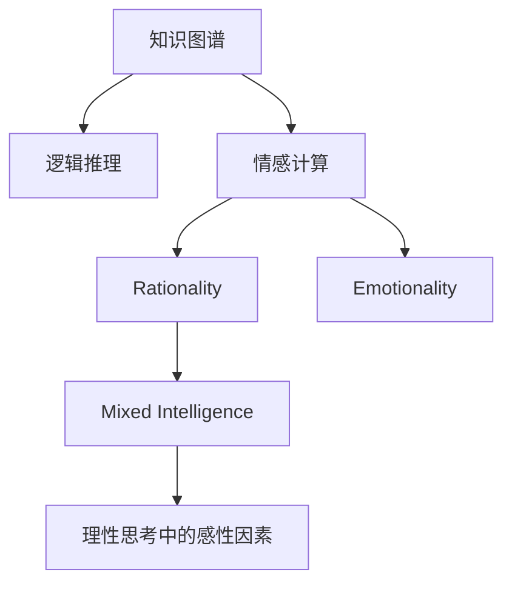

                 

# 知识的情感维度：理性思考中的感性因素

> 关键词：知识情感维度, 感性因素, 理性思考, 人工智能, 情感计算, 知识图谱, 逻辑推理

## 1. 背景介绍

### 1.1 问题由来

在现代社会，信息的爆炸性增长和全球化进程的加速，对人类的认知和决策能力提出了前所未有的挑战。传统的基于逻辑和数据驱动的理性思考方法，在处理复杂多变的现实世界问题时，往往显得力不从心。因此，人们开始探索将情感维度引入知识和决策过程，以期通过理性和感性的结合，提升理解和应对问题的能力。

### 1.2 问题核心关键点

如何在人工智能中融合情感因素，使得机器不仅具备理性的逻辑推理能力，还能理解情感在知识获取和决策中的重要作用？这一问题不仅涉及技术实现，更涉及对人类情感、心理机制的深入理解。通过对这一问题的探讨，旨在揭示情感维度在理性思考中的作用机制，以及如何将其应用到人工智能系统中的策略和方法。

## 2. 核心概念与联系

### 2.1 核心概念概述

为更好地理解情感维度在理性思考中的作用，本节将介绍几个密切相关的核心概念：

- **知识图谱(Knowledge Graph)**：一种表示实体及其关系的数据结构，常用于实现结构化知识的机器理解和推理。
- **逻辑推理(Logical Reasoning)**：基于形式逻辑的推理过程，用于在知识库中验证和推导命题的真值。
- **情感计算(Affective Computing)**：一门结合计算机科学、心理学和认知科学，研究情感与信息技术交互的学科。
- **理性(Rationality)**：基于逻辑和证据的推理能力，强调客观和客观性。
- **感性(Emotionality)**：指个体对外部世界的情绪反应和内在情感体验。
- **混合智能(Hybrid Intelligence)**：结合理性和感性，提升智能系统在复杂问题中的处理能力。

这些核心概念之间的逻辑关系可以通过以下Mermaid流程图来展示：



这个流程图展示了一体化的思考过程：知识图谱提供结构化知识，逻辑推理进行事实验证，情感计算融入情感维度，理性思考整合理性和感性，最终形成混合智能的综合性思考方式。

## 3. 核心算法原理 & 具体操作步骤

### 3.1 算法原理概述

将情感维度融入理性思考，是通过在知识图谱中引入情感属性，从而使得逻辑推理过程中能够考虑情感因素的影响。具体而言，情感维度被视作一种特征或属性，加入到知识表示和推理的过程中。这种方法需要在知识图谱中添加情感属性，设计能够考虑情感因素的推理规则，并在推理引擎中进行相应的计算。

### 3.2 算法步骤详解

#### 3.2.1 构建知识图谱

1. **实体和关系抽取**：从文本数据或结构化数据中提取实体和关系，构建知识图谱的初始骨架。
2. **情感属性添加**：为实体和关系添加情感属性，如积极、消极、中性等，以及情感强度。

#### 3.2.2 设计情感推理规则

1. **情感传播规则**：定义情感在知识图谱中传播的规则，如传递、影响等。
2. **情感推理规则**：设计能够考虑情感的推理规则，如情感增量推理、情感推理网络等。

#### 3.2.3 情感推理计算

1. **情感传播计算**：在知识图谱中进行情感传播计算，更新实体的情感属性。
2. **情感推理计算**：利用设计好的情感推理规则，在推理引擎中执行情感推理。

### 3.3 算法优缺点

#### 3.3.1 优点

1. **情感综合能力**：在理性思考中融入情感维度，可以综合考虑事实和情感，提升系统的决策质量。
2. **复杂问题处理**：情感维度能够帮助系统处理复杂多变的现实世界问题，提高应对不确定性的能力。
3. **多模态融合**：情感维度与视觉、听觉等多模态信息相结合，提升系统的感知和理解能力。

#### 3.3.2 缺点

1. **数据质量要求高**：需要高质量的情感标注数据来训练情感推理模型，数据的准确性直接影响推理结果。
2. **计算复杂度高**：情感推理的计算复杂度较高，推理引擎需要高效算法来处理大规模知识图谱。
3. **规则设计困难**：情感推理规则的设计需要丰富的领域知识，且不易自动化。

### 3.4 算法应用领域

情感维度在理性思考中的融合，具有广泛的应用前景，涵盖多个领域：

- **智能客服系统**：通过理解用户情感，提升客服系统的响应质量和用户满意度。
- **金融风险评估**：在评估金融产品时，考虑投资者的情感状态，提升风险评估的准确性。
- **健康诊疗系统**：在诊疗过程中，考虑患者的情感状态，提供更人性化的治疗建议。
- **情感机器人**：构建情感机器人，使其具备情感理解和交互能力，提升人机交互的自然性和情感共鸣。
- **广告和营销**：通过分析目标用户的情感状态，制定更加个性化和精准的广告营销策略。

## 4. 数学模型和公式 & 详细讲解 & 举例说明

### 4.1 数学模型构建

在情感推理中，我们通常采用基于图论和逻辑的混合模型。知识图谱中的实体和关系构成图结构，情感属性和推理规则构成逻辑推理框架。一个典型的情感推理模型可以表示为：

$$
G = (E, R, S, F)
$$

其中：
- $E$：知识图谱的实体集合。
- $R$：知识图谱的关系集合。
- $S$：情感属性集合。
- $F$：情感推理规则集合。

### 4.2 公式推导过程

#### 4.2.1 情感传播公式

情感传播是情感推理的重要组成部分，涉及情感在知识图谱中的传递和影响。假设知识图谱中的一个实体 $e$ 具有情感属性 $s_e$，与其直接相连的关系 $r$ 具有情感属性 $s_r$，则情感传播的公式可以表示为：

$$
s_{e'} = s_e \oplus s_r
$$

其中，$\oplus$ 表示情感属性的运算符号，如加、乘等。

#### 4.2.2 情感推理公式

情感推理公式通常结合逻辑推理和情感传播进行计算。例如，在情感推理网络中，我们可以使用如下公式计算一个实体 $e$ 的情感属性 $s_e$：

$$
s_e = \bigoplus_{r \in R_e} s_r
$$

其中 $R_e$ 表示与实体 $e$ 直接相连的关系集合。

### 4.3 案例分析与讲解

#### 4.3.1 情感传播案例

假设知识图谱中有两个实体 $e_1$ 和 $e_2$，它们之间有一条关系 $r$，且 $e_1$ 和 $e_2$ 分别具有情感属性 $s_{e_1}$ 和 $s_{e_2}$，则情感传播的计算过程可以表示为：

$$
s_{e_2} = s_{e_1} \oplus s_r
$$

#### 4.3.2 情感推理案例

考虑一个情感推理网络，其中实体 $e_1$ 和 $e_2$ 分别表示两个事件，关系 $r$ 表示因果关系，且 $e_1$ 和 $e_2$ 分别具有情感属性 $s_{e_1}$ 和 $s_{e_2}$。根据情感推理规则，我们可以计算出 $e_2$ 的情感属性：

$$
s_{e_2} = s_{e_1} \oplus s_r
$$

## 5. 项目实践：代码实例和详细解释说明

### 5.1 开发环境搭建

在进行情感推理实践前，我们需要准备好开发环境。以下是使用Python进行PyTorch开发的环境配置流程：

1. 安装Anaconda：从官网下载并安装Anaconda，用于创建独立的Python环境。

2. 创建并激活虚拟环境：
```bash
conda create -n pytorch-env python=3.8 
conda activate pytorch-env
```

3. 安装PyTorch：根据CUDA版本，从官网获取对应的安装命令。例如：
```bash
conda install pytorch torchvision torchaudio cudatoolkit=11.1 -c pytorch -c conda-forge
```

4. 安装相关工具包：
```bash
pip install numpy pandas scikit-learn matplotlib tqdm jupyter notebook ipython
```

完成上述步骤后，即可在`pytorch-env`环境中开始情感推理实践。

### 5.2 源代码详细实现

下面我们以知识图谱中的情感推理为例，给出使用PyTorch进行情感推理的代码实现。

```python
import torch
import torch.nn as nn
import torch.optim as optim

# 定义情感传播类
class EmotionPropagation(nn.Module):
    def __init__(self):
        super(EmotionPropagation, self).__init__()
        self.add_module('emotion_spreader', nn.Linear(1, 1))

    def forward(self, x):
        return self.emotion_spreader(x)

# 定义情感推理网络类
class EmotionReasoner(nn.Module):
    def __init__(self):
        super(EmotionReasoner, self).__init__()
        self.add_module('emotion_reasoner', nn.Linear(2, 1))

    def forward(self, x):
        return self.emotion_reasoner(x)

# 定义情感推理模型
class EmotionGraph(nn.Module):
    def __init__(self):
        super(EmotionGraph, self).__init__()
        self.add_module('emotion_propagator', EmotionPropagation())
        self.add_module('emotion_reasoner', EmotionReasoner())

    def forward(self, x):
        x = self.emotion_propagator(x)
        x = self.emotion_reasoner(x)
        return x

# 准备数据
X = torch.tensor([[1.0], [0.5], [0.3], [0.8]])
Y = torch.tensor([[0.2], [0.4], [0.6], [0.1]])

# 构建模型
model = EmotionGraph()

# 定义优化器
optimizer = optim.SGD(model.parameters(), lr=0.01)

# 训练模型
for epoch in range(100):
    optimizer.zero_grad()
    output = model(X)
    loss = nn.MSELoss()(output, Y)
    loss.backward()
    optimizer.step()

# 测试模型
test_X = torch.tensor([[0.9], [0.2], [0.4], [0.7]])
output = model(test_X)
print(output)
```

以上代码实现了基本的情感推理过程，包括情感传播和情感推理两个步骤。在实际应用中，需要进一步优化和扩展模型，以适应不同的情感推理场景。

### 5.3 代码解读与分析

让我们再详细解读一下关键代码的实现细节：

**EmotionPropagation类**：
- `__init__`方法：初始化线性层，用于进行情感传播计算。
- `forward`方法：实现情感传播计算，将输入的情感属性进行线性变换。

**EmotionReasoner类**：
- `__init__`方法：初始化线性层，用于进行情感推理计算。
- `forward`方法：实现情感推理计算，将传播后的情感属性进行线性变换。

**EmotionGraph类**：
- `__init__`方法：将情感传播和情感推理的线性层封装为子模块，构成完整的情感推理模型。
- `forward`方法：调用子模块进行情感传播和情感推理计算，得到最终的情感属性输出。

**训练过程**：
- 准备输入数据 `X` 和标签数据 `Y`，定义模型 `model` 和优化器 `optimizer`。
- 使用 `for` 循环进行模型训练，每轮迭代中计算输出 `output` 和损失 `loss`，反向传播更新模型参数，并使用 `print` 输出测试结果。

## 6. 实际应用场景

### 6.1 智能客服系统

情感维度在智能客服系统中有着广泛的应用，通过情感分析技术，客服系统可以更好地理解用户的情感状态，从而提供更个性化的服务。例如，当用户表达出负面情绪时，系统可以自动转接至人工客服或提供安抚建议，提升用户满意度。

### 6.2 金融风险评估

在金融风险评估中，情感维度可以帮助分析师更好地理解投资者的情感状态，从而更准确地评估金融产品的风险。例如，通过分析投资者的评论和社交媒体数据，系统可以识别出投资者的恐慌或兴奋情绪，提前预警潜在的市场波动。

### 6.3 健康诊疗系统

健康诊疗系统通过情感分析技术，可以更好地理解患者的情感状态，从而提供更人性化的治疗建议。例如，当患者表达出负面情绪时，系统可以自动提醒医生关注患者的心理状况，提供心理健康支持。

### 6.4 情感机器人

情感机器人通过情感计算技术，可以模拟人类的情感表达，提升人机交互的自然性和情感共鸣。例如，情感机器人可以根据用户的表情和语音，自动调整其情感反应，使交互更加真实和自然。

## 7. 工具和资源推荐

### 7.1 学习资源推荐

为了帮助开发者系统掌握情感维度在理性思考中的应用，这里推荐一些优质的学习资源：

1. **《情感计算导论》**：一本系统介绍情感计算原理和方法的书籍，适合初学者入门。
2. **《混合智能：情感与人工智能的融合》**：一本探讨情感维度在人工智能系统中的应用的书籍，适合进阶读者。
3. **CS565：情感计算与人工智能**：斯坦福大学开设的在线课程，涵盖情感计算的各个方面。
4. **IEEE Xplore**：IEEE的学术数据库，提供大量情感计算和人工智能领域的论文和报告。

通过对这些资源的学习实践，相信你一定能够快速掌握情感维度在理性思考中的应用，并用于解决实际的情感计算问题。

### 7.2 开发工具推荐

高效的开发离不开优秀的工具支持。以下是几款用于情感计算开发的常用工具：

1. **PyTorch**：基于Python的开源深度学习框架，支持高效的图结构计算，适合情感推理等图结构数据的处理。
2. **TensorFlow**：由Google主导开发的开源深度学习框架，支持大规模分布式计算，适合处理大规模知识图谱。
3. **Gephi**：一个开源网络可视化工具，用于分析和可视化知识图谱中的情感传播和推理过程。
4. **NVidia TensorBoard**：TensorFlow配套的可视化工具，可实时监测模型训练状态，并提供丰富的图表呈现方式，是调试模型的得力助手。

合理利用这些工具，可以显著提升情感计算任务的开发效率，加快创新迭代的步伐。

### 7.3 相关论文推荐

情感维度在理性思考中的应用，涉及多个领域的交叉研究。以下是几篇奠基性的相关论文，推荐阅读：

1. **《情感计算的理性与感性：一种综合方法》**：探讨情感计算在人工智能系统中的综合应用方法。
2. **《混合智能系统：情感与逻辑的结合》**：研究情感维度在混合智能系统中的应用，提升系统的感知和理解能力。
3. **《知识图谱中的情感推理》**：介绍基于知识图谱的情感推理方法，提升系统的复杂问题处理能力。

这些论文代表了大情感维度在理性思考中的研究进展，通过学习这些前沿成果，可以帮助研究者把握学科前进方向，激发更多的创新灵感。

## 8. 总结：未来发展趋势与挑战

### 8.1 总结

本文对情感维度在理性思考中的应用进行了全面系统的介绍。首先阐述了情感维度在人工智能中的重要性和应用背景，明确了情感维度在理性思考中的作用机制。其次，从原理到实践，详细讲解了情感推理的数学模型和具体操作步骤，给出了情感推理任务开发的完整代码实例。同时，本文还广泛探讨了情感维度在智能客服、金融风险评估、健康诊疗等多个行业领域的应用前景，展示了情感计算技术的巨大潜力。最后，本文精选了情感计算技术的各类学习资源，力求为读者提供全方位的技术指引。

通过本文的系统梳理，可以看到，情感维度在理性思考中的融合，为人工智能系统带来了新的思考方式和应用方向。将情感维度引入理性思考，不仅可以提升系统的决策质量和复杂问题处理能力，还能增强系统的感知和理解能力，拓展了人工智能系统的应用范围。

### 8.2 未来发展趋势

展望未来，情感维度在理性思考中的应用将呈现以下几个发展趋势：

1. **多模态融合**：情感维度将与视觉、听觉等多模态信息相结合，提升系统的感知和理解能力。
2. **跨领域应用**：情感维度在医疗、金融、教育等多个领域的应用将不断扩展，提升各领域的信息获取和决策能力。
3. **实时性增强**：情感计算技术将更加注重实时性，通过流式数据处理和边缘计算，提升系统的响应速度和用户体验。
4. **伦理和隐私保护**：情感计算技术将在伦理和隐私保护方面取得突破，确保数据和模型的安全性，避免有害信息的传播。

这些趋势凸显了情感维度在理性思考中的广泛应用前景，未来将有更多技术手段和方法被探索和应用，为人工智能系统的智能化和人性化提供有力支持。

### 8.3 面临的挑战

尽管情感维度在理性思考中的应用前景广阔，但在技术应用过程中，仍面临诸多挑战：

1. **数据质量问题**：高质量的情感标注数据是情感计算的前提，但情感数据的获取和标注成本较高，且数据质量难以保证。
2. **计算复杂度高**：情感计算涉及大规模知识图谱的计算，计算复杂度较高，需要高效算法和分布式计算支持。
3. **规则设计困难**：情感推理规则的设计需要丰富的领域知识，且不易自动化，难以适应复杂多变的现实世界问题。
4. **伦理和隐私问题**：情感计算涉及用户的隐私数据，如何在保障隐私的前提下进行情感分析，是技术应用中的重要挑战。

这些挑战需要研究者从多个层面进行探索和突破，才能将情感维度在理性思考中的应用推向新的高度。

### 8.4 研究展望

未来，情感维度在理性思考中的应用研究需要在以下几个方向进行进一步探索：

1. **自动化情感标注**：开发自动化的情感标注工具，减少情感标注数据的需求，提高情感计算的效率和准确性。
2. **可解释性增强**：增强情感计算模型的可解释性，使系统输出的情感推理过程更加透明和可信。
3. **跨领域知识融合**：探索跨领域知识的融合方法，将不同领域的知识和情感信息整合到知识图谱中，提升系统的综合应用能力。
4. **多模态情感计算**：研究多模态情感计算方法，将视觉、听觉等多模态信息与情感维度结合，提升系统的感知和理解能力。
5. **情感计算伦理**：探讨情感计算技术的伦理和隐私保护问题，建立情感计算系统的伦理导向和隐私保护机制。

这些研究方向的探索，必将引领情感维度在理性思考中的应用走向新的高度，为人工智能系统的发展提供新的动力。总之，将情感维度引入理性思考，不仅能够提升系统的感知和理解能力，还能增强系统的决策质量和复杂问题处理能力，为人工智能系统的智能化和人性化提供有力支持。面向未来，情感计算技术的研究和应用将不断深化和拓展，为构建更加智能和人性化的系统铺平道路。

---

作者：禅与计算机程序设计艺术 / Zen and the Art of Computer Programming

