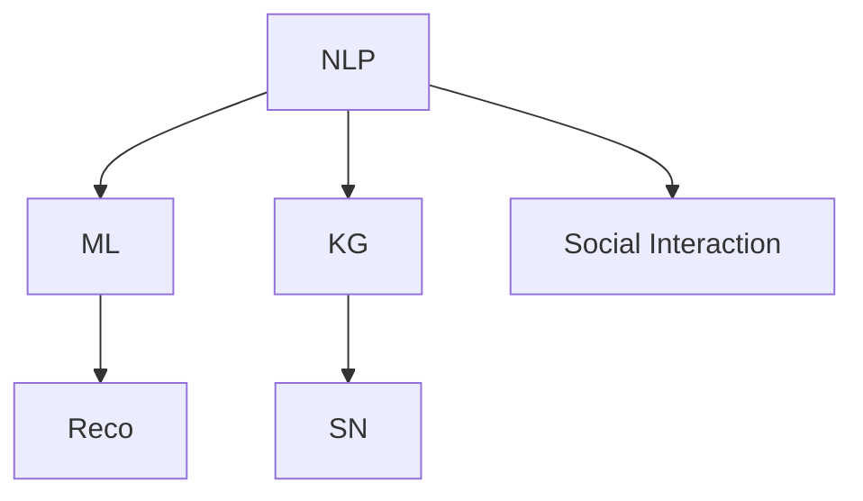

                 

# 知识的社交机器人：AI辅助教学的新形式

## 1. 背景介绍

在数字化时代，教育领域的变革加速推进，人工智能(AI)技术在教育中的应用越来越广泛。AI辅助教学正在逐渐成为推动教育现代化的重要力量。本文聚焦于知识社交机器人的概念及其在AI辅助教学中的实际应用，旨在探讨这一新兴形式如何通过自然语言处理(NLP)、机器学习等技术，为教学和学习提供更高效、更有针对性的支持。

### 1.1 问题由来

传统的教学模式往往以教师为中心，强调知识的传授。然而，这种单向的传授方式难以激发学生的学习兴趣，也无法满足个性化学习的需求。随着技术的进步，AI辅助教学开始受到重视，越来越多的研究者和教育工作者探索如何利用AI技术，提升教学质量和学生的学习效果。

### 1.2 问题核心关键点

知识社交机器人的核心思想是通过AI技术构建一个虚拟的社交环境，使学生能够在这个环境中自由交流，分享知识，互相学习。具体而言，其关键点包括：
- 自然语言处理：使得机器能够理解并生成自然语言，与学生进行互动。
- 机器学习：通过分析学生的学习行为和反馈，不断优化教学策略。
- 个性化学习：根据学生的兴趣和能力，提供定制化的学习资源和建议。
- 社交互动：构建虚拟社交环境，促进学生之间的知识交流和合作学习。

## 2. 核心概念与联系

### 2.1 核心概念概述

为更好地理解知识社交机器人的原理和架构，本节将介绍几个密切相关的核心概念：

- **自然语言处理(NLP)**：研究如何使计算机理解、处理和生成人类语言的技术，包括分词、词性标注、句法分析、语义理解等。
- **机器学习(ML)**：通过算法让计算机从数据中学习规律，并应用到新数据中，以提升任务的准确性和效率。
- **知识图谱(KG)**：用于描述实体及其相互关系的语义网络，如OWL、RDF等。
- **社交网络(SN)**：用于描述人与人之间关系的图结构，如Facebook、微信等。
- **推荐系统(Reco)**：通过分析用户行为和偏好，为用户推荐个性化的产品和服务。

这些核心概念之间的逻辑关系可以通过以下Mermaid流程图来展示：



这个流程图展示了大语言模型的核心概念及其之间的关系：

1. 自然语言处理通过分词、词性标注等技术，将文本数据转化为计算机可以处理的形式。
2. 机器学习通过分析文本数据，学习语言模型的规律。
3. 知识图谱用于描述实体和关系，帮助机器理解更丰富的语义信息。
4. 推荐系统利用机器学习算法，根据用户行为推荐个性化学习资源。
5. 社交网络描述学生之间的互动关系，提供合作学习的支持。

这些核心概念共同构成了知识社交机器人的技术框架，使其能够提供丰富的教育服务。通过理解这些核心概念，我们可以更好地把握知识社交机器人的工作原理和优化方向。

## 3. 核心算法原理 & 具体操作步骤
### 3.1 算法原理概述

知识社交机器人通过构建虚拟社交环境，利用自然语言处理、机器学习和社交网络等技术，为学生提供互动学习的机会。其核心算法流程包括：

1. **文本预处理**：对学生输入的文本进行分词、词性标注等处理。
2. **语义理解**：通过语言模型理解文本的语义，识别学生的需求和兴趣。
3. **推荐系统**：根据学生的兴趣和历史行为，推荐个性化的学习资源。
4. **互动学习**：构建虚拟社交环境，促进学生之间的知识交流和合作学习。
5. **反馈优化**：通过分析学生的学习行为和反馈，不断优化推荐系统和互动策略。

### 3.2 算法步骤详解

以下是对知识社交机器人核心算法的详细步骤讲解：

**Step 1: 文本预处理**
- 使用自然语言处理工具对学生输入的文本进行分词、词性标注等处理。
- 通过语言模型理解文本的语义，识别出学生的需求和兴趣点。

**Step 2: 语义理解**
- 使用预训练语言模型(如BERT、GPT等)对文本进行语义理解。
- 通过句子向量、话题模型等技术，提取文本的关键信息。

**Step 3: 推荐系统**
- 基于学生的历史行为数据，构建用户画像。
- 使用协同过滤、矩阵分解等算法，为学生推荐个性化的学习资源。

**Step 4: 互动学习**
- 构建虚拟社交网络，根据学生的兴趣和能力，推荐合适的学习伙伴。
- 通过聊天机器人、虚拟教师等方式，促进学生之间的互动学习。

**Step 5: 反馈优化**
- 收集学生的学习反馈和行为数据，分析其效果。
- 根据反馈数据，调整推荐策略和互动方式，提高学习效果。

### 3.3 算法优缺点

知识社交机器人具有以下优点：
1. 个性化推荐：根据学生的兴趣和能力，提供定制化的学习资源和建议。
2. 互动学习：构建虚拟社交环境，促进学生之间的知识交流和合作学习。
3. 数据驱动：通过分析学生的学习行为和反馈，不断优化教学策略。
4. 自动化管理：减少教师的重复性工作，提高教学效率。

同时，该方法也存在一定的局限性：
1. 数据隐私：收集和分析学生的学习数据需要保证数据隐私和安全。
2. 模型泛化：模型需要覆盖广泛的教学场景和学生类型，避免偏见和歧视。
3. 技术门槛：技术实现复杂，需要跨学科的知识和技能。
4. 依赖硬件：对计算资源和网络带宽有较高要求。

尽管存在这些局限性，但就目前而言，知识社交机器人仍是大语言模型应用的一个重要方向。未来相关研究的重点在于如何进一步降低技术门槛，提高模型的泛化能力，同时兼顾数据隐私和技术实现。

### 3.4 算法应用领域

知识社交机器人在教育领域的应用场景非常广泛，以下是几个典型的应用案例：

**1. 在线教育平台**
- 在线教育平台如Coursera、EdX等，可以通过知识社交机器人提供个性化的学习推荐和互动学习体验，提升学生学习效果。

**2. 虚拟实验室**
- 虚拟实验室如Labster、PhET Interactive等，可以通过知识社交机器人为学生提供虚拟实验操作和互动学习的机会，增强学习的互动性和趣味性。

**3. 智能辅导系统**
- 智能辅导系统如Knewton、Smart Sparrow等，可以通过知识社交机器人提供个性化辅导和学习建议，帮助学生克服学习障碍。

**4. 作业辅助工具**
- 作业辅助工具如Grammarly、Turnitin等，可以通过知识社交机器人提供语法检查、作文评改等功能，提升学生的作业质量和写作能力。

**5. 知识共享平台**
- 知识共享平台如ResearchGate、GitHub等，可以通过知识社交机器人促进学者之间的知识交流和合作，加速科研进展。

以上这些应用案例展示了知识社交机器人在教育领域的多样化应用，为其未来的广泛应用提供了丰富的实践经验。

## 4. 数学模型和公式 & 详细讲解 & 举例说明
### 4.1 数学模型构建

知识社交机器人的核心算法流程包括自然语言处理、机器学习和社交网络分析等多个方面。以下是详细的数学模型构建和推导：

**4.1.1 自然语言处理**

自然语言处理的核心任务是将文本数据转化为计算机可以处理的形式。常用的方法包括分词、词性标注、命名实体识别、句法分析等。

以分词为例，分词的数学模型可以表示为：

$$
P(w) = \frac{1}{Z}\exp(\sum_{i=1}^{n} \alpha_i \cdot C_i)
$$

其中 $w$ 为单词序列，$n$ 为序列长度，$C_i$ 为特征 $i$ 的权重，$Z$ 为归一化因子。

**4.1.2 语义理解**

语义理解的核心任务是理解文本的语义信息，常用的方法包括句子向量、话题模型、情感分析等。

以句子向量为例，句子向量的计算公式可以表示为：

$$
v = f(A \cdot T)
$$

其中 $A$ 为单词嵌入矩阵，$T$ 为文本的单词序列，$f$ 为非线性函数。

**4.1.3 推荐系统**

推荐系统的核心任务是根据用户的历史行为数据，推荐个性化的学习资源。常用的方法包括协同过滤、矩阵分解、深度学习等。

以协同过滤为例，协同过滤的数学模型可以表示为：

$$
R_{ij} = \frac{1}{1+\exp(-\theta^T\cdot (u_i-v_j)} + b
$$

其中 $R_{ij}$ 为用户 $i$ 对物品 $j$ 的评分，$u_i$ 和 $v_j$ 为用户和物品的向量表示，$\theta$ 和 $b$ 为模型参数。

**4.1.4 社交网络分析**

社交网络分析的核心任务是构建虚拟社交网络，促进学生之间的互动学习。常用的方法包括图结构分析、社区发现、网络动力学等。

以图结构分析为例，社交网络的结构可以表示为：

$$
G = (V,E)
$$

其中 $V$ 为节点集合，$E$ 为边集合，表示节点之间的关系。

### 4.2 公式推导过程

以下我们将详细推导知识社交机器人核心算法中常用的数学公式：

**4.2.1 分词**

分词的数学推导过程如下：

1. **特征选择**：选择分词任务中的关键特征，如单词的出现频率、上下文信息等。
2. **模型训练**：通过最大化似然函数训练模型参数。
3. **分词预测**：使用训练好的模型对新文本进行分词预测。

**4.2.2 句子向量**

句子向量的数学推导过程如下：

1. **单词嵌入**：将单词转化为向量表示。
2. **句向量计算**：通过求和、平均等方法，将单词向量组合成句子向量。
3. **非线性映射**：使用非线性函数对句子向量进行映射，得到最终的句子向量。

**4.2.3 协同过滤**

协同过滤的数学推导过程如下：

1. **用户-物品评分矩阵**：构建用户对物品的评分矩阵。
2. **矩阵分解**：对评分矩阵进行矩阵分解，得到用户向量和物品向量。
3. **评分预测**：使用矩阵分解的结果，预测用户对未评分物品的评分。

### 4.3 案例分析与讲解

以下我们将以一个简单的推荐系统为例，详细讲解知识社交机器人中的推荐算法：

**案例背景**：
假设有一个在线教育平台，想要通过知识社交机器人为学生提供个性化的学习推荐。该平台已收集了大量的学生学习行为数据，包括观看视频、做练习、参与讨论等。

**算法流程**：
1. **数据收集**：从平台收集学生学习行为数据，包括观看视频的标题、时长、评分等。
2. **用户画像构建**：使用协同过滤算法，为每个学生构建个性化的用户画像。
3. **推荐生成**：根据用户画像和视频信息，生成个性化推荐列表。
4. **反馈优化**：收集学生对推荐结果的反馈，不断调整推荐算法。

**算法实现**：
```python
from sklearn.decomposition import TruncatedSVD
from sklearn.metrics.pairwise import cosine_similarity

# 构建用户-物品评分矩阵
user_item_matrix = pd.DataFrame(data)
user_item_matrix = user_item_matrix.fillna(0)

# 矩阵分解，得到用户向量和物品向量
svd = TruncatedSVD(n_components=50)
user_vectors = svd.fit_transform(user_item_matrix)

# 计算用户-物品评分矩阵的余弦相似度
similarity_matrix = cosine_similarity(user_vectors, user_vectors)

# 预测用户对未评分物品的评分
recommended_items = similarity_matrix.argmax(axis=1)[0]
```

以上代码展示了知识社交机器人中推荐算法的实现。通过对学习行为数据的分析和处理，知识社交机器人能够为学生提供个性化的学习推荐，极大地提升了学习效果。

## 5. 项目实践：代码实例和详细解释说明
### 5.1 开发环境搭建

在进行知识社交机器人开发前，我们需要准备好开发环境。以下是使用Python进行PyTorch开发的环境配置流程：

1. 安装Anaconda：从官网下载并安装Anaconda，用于创建独立的Python环境。

2. 创建并激活虚拟环境：
```bash
conda create -n pytorch-env python=3.8 
conda activate pytorch-env
```

3. 安装PyTorch：根据CUDA版本，从官网获取对应的安装命令。例如：
```bash
conda install pytorch torchvision torchaudio cudatoolkit=11.1 -c pytorch -c conda-forge
```

4. 安装Transformers库：
```bash
pip install transformers
```

5. 安装各类工具包：
```bash
pip install numpy pandas scikit-learn matplotlib tqdm jupyter notebook ipython
```

完成上述步骤后，即可在`pytorch-env`环境中开始知识社交机器人的开发实践。

### 5.2 源代码详细实现

以下我们将以一个简单的知识社交机器人为例，展示其核心算法的实现：

**5.2.1 自然语言处理**

```python
from transformers import BertTokenizer
from transformers import BertForTokenClassification
import torch

# 定义自然语言处理模型
tokenizer = BertTokenizer.from_pretrained('bert-base-cased')
model = BertForTokenClassification.from_pretrained('bert-base-cased', num_labels=2)

# 预处理文本数据
text = "I want to learn Python"
inputs = tokenizer(text, return_tensors='pt')

# 前向传播计算
outputs = model(**inputs)

# 获取模型输出
logits = outputs.logits
predictions = torch.argmax(logits, dim=1)

# 打印预测结果
print(predictions)
```

**5.2.2 推荐系统**

```python
from sklearn.decomposition import TruncatedSVD
from sklearn.metrics.pairwise import cosine_similarity
import pandas as pd

# 构建用户-物品评分矩阵
user_item_matrix = pd.DataFrame(data)
user_item_matrix = user_item_matrix.fillna(0)

# 矩阵分解，得到用户向量和物品向量
svd = TruncatedSVD(n_components=50)
user_vectors = svd.fit_transform(user_item_matrix)

# 计算用户-物品评分矩阵的余弦相似度
similarity_matrix = cosine_similarity(user_vectors, user_vectors)

# 预测用户对未评分物品的评分
recommended_items = similarity_matrix.argmax(axis=1)[0]
print(recommended_items)
```

**5.2.3 社交网络分析**

```python
import networkx as nx

# 构建社交网络图
G = nx.Graph()
G.add_edges_from([(1, 2), (2, 3), (3, 4)])

# 计算图结构
centrality = nx.closeness_centrality(G)

# 打印中心性结果
print(centrality)
```

### 5.3 代码解读与分析

让我们再详细解读一下关键代码的实现细节：

**5.3.1 自然语言处理**

自然语言处理部分通过分词、词性标注等技术，将文本数据转化为计算机可以处理的形式。具体实现步骤为：
1. 使用BertTokenizer对文本进行分词。
2. 使用BertForTokenClassification模型对分词后的文本进行语义理解。
3. 通过前向传播计算，获取模型输出。
4. 使用argmax函数将输出转换为预测结果。

**5.3.2 推荐系统**

推荐系统部分通过协同过滤算法，为用户推荐个性化的学习资源。具体实现步骤为：
1. 收集用户学习行为数据，构建用户-物品评分矩阵。
2. 使用TruncatedSVD对评分矩阵进行矩阵分解，得到用户向量和物品向量。
3. 计算用户-物品评分矩阵的余弦相似度。
4. 通过argmax函数预测用户对未评分物品的评分。

**5.3.3 社交网络分析**

社交网络分析部分通过构建虚拟社交网络，促进学生之间的互动学习。具体实现步骤为：
1. 使用networkx库构建社交网络图。
2. 使用closeness_centrality函数计算节点之间的中心性。
3. 打印节点中心性的结果。

## 6. 实际应用场景
### 6.1 智能辅导系统

智能辅导系统是知识社交机器人在教育领域的一个重要应用。通过构建虚拟辅导环境，智能辅导系统可以为学生提供个性化辅导和学习建议。

具体而言，智能辅导系统可以包括以下几个模块：
1. **问题解答模块**：学生可以通过自然语言描述问题，智能辅导系统使用语言模型解析问题，并提供解答。
2. **学习资源推荐模块**：根据学生的问题，推荐相关的学习资源和视频。
3. **互动学习模块**：构建虚拟讨论区，学生可以与其他学生或教师交流，共同解决学习难题。
4. **学习效果评估模块**：通过学生的问题和回答，评估学习效果，并给出反馈。

智能辅导系统可以广泛应用于各类学习场景，如在线教育、自学平台、考试准备等，帮助学生高效学习，提升学习效果。

### 6.2 虚拟实验室

虚拟实验室是知识社交机器人在科学教育中的重要应用。通过构建虚拟实验环境，虚拟实验室可以为学生提供互动实验操作和实验报告撰写功能。

具体而言，虚拟实验室可以包括以下几个模块：
1. **虚拟实验操作模块**：学生可以使用虚拟实验室进行实验操作，并记录实验数据。
2. **实验数据分析模块**：学生可以对实验数据进行分析，生成实验报告。
3. **互动学习模块**：构建虚拟讨论区，学生可以与其他学生或教师交流，讨论实验结果。
4. **实验资源推荐模块**：根据学生的实验操作，推荐相关的实验资源和学习材料。

虚拟实验室可以广泛应用于各类科学教育场景，如中学实验、大学实验、科研训练等，提升学生的科学素养和实验技能。

### 6.3 作业辅助工具

作业辅助工具是知识社交机器人在学术写作中的重要应用。通过构建虚拟写作环境，作业辅助工具可以为学生提供语法检查、写作指导和作业批改功能。

具体而言，作业辅助工具可以包括以下几个模块：
1. **语法检查模块**：学生可以上传写作材料，作业辅助工具进行语法检查。
2. **写作指导模块**：作业辅助工具提供写作指导，帮助学生提升写作水平。
3. **作业批改模块**：作业辅助工具对学生作业进行自动批改，并提供详细的评语和建议。
4. **互动学习模块**：构建虚拟讨论区，学生可以与其他学生或教师交流，讨论写作和作业问题。

作业辅助工具可以广泛应用于各类学术写作场景，如学术论文写作、学术报告撰写、学生作业批改等，提升学生的写作能力和学术水平。

### 6.4 未来应用展望

随着知识社交机器人技术的不断成熟，其在教育领域的应用前景将更加广阔。

**6.4.1 智能评估**

智能评估是知识社交机器人未来的一个重要应用方向。通过构建虚拟评估环境，智能评估系统可以为学生提供实时、公正的评估，提高评估效率和准确性。

具体而言，智能评估系统可以包括以下几个模块：
1. **智能评测模块**：使用自然语言处理技术，对学生的答案进行自动评分。
2. **多维度评估模块**：综合评估学生的语言能力、逻辑思维、创新能力等各方面表现。
3. **反馈优化模块**：根据评估结果，生成个性化反馈，指导学生改进。

智能评估系统可以广泛应用于各类评估场景，如在线考试、编程竞赛、论文评审等，提高评估效率和公平性。

**6.4.2 智能学习助手**

智能学习助手是知识社交机器人未来的另一个重要应用方向。通过构建虚拟学习助手，智能学习助手可以为学生提供24/7的学习支持，提升学习效果。

具体而言，智能学习助手可以包括以下几个模块：
1. **智能问答模块**：学生可以通过自然语言描述问题，智能学习助手提供解答。
2. **资源推荐模块**：智能学习助手根据学生的问题，推荐相关的学习资源和视频。
3. **互动学习模块**：构建虚拟讨论区，学生可以与其他学生或教师交流，共同解决问题。
4. **学习效果评估模块**：通过学生的问题和回答，评估学习效果，并给出反馈。

智能学习助手可以广泛应用于各类学习场景，如在线教育、自学平台、考试准备等，提升学生的学习效果和学习体验。

## 7. 工具和资源推荐
### 7.1 学习资源推荐

为了帮助开发者系统掌握知识社交机器人的原理和实践技巧，这里推荐一些优质的学习资源：

1. 《深度学习》系列博文：由深度学习专家撰写，系统介绍了深度学习的核心概念和前沿技术。

2. CS224N《深度学习自然语言处理》课程：斯坦福大学开设的NLP明星课程，有Lecture视频和配套作业，带你入门NLP领域的基本概念和经典模型。

3. 《Natural Language Processing with Transformers》书籍：Transformers库的作者所著，全面介绍了如何使用Transformers库进行NLP任务开发，包括推荐系统在内的多个应用。

4. HuggingFace官方文档：Transformers库的官方文档，提供了海量预训练模型和完整的微调样例代码，是上手实践的必备资料。

5. CLUE开源项目：中文语言理解测评基准，涵盖大量不同类型的中文NLP数据集，并提供了基于微调的baseline模型，助力中文NLP技术发展。

通过对这些资源的学习实践，相信你一定能够快速掌握知识社交机器人的精髓，并用于解决实际的NLP问题。

### 7.2 开发工具推荐

高效的开发离不开优秀的工具支持。以下是几款用于知识社交机器人开发的工具：

1. PyTorch：基于Python的开源深度学习框架，灵活动态的计算图，适合快速迭代研究。大部分预训练语言模型都有PyTorch版本的实现。

2. TensorFlow：由Google主导开发的开源深度学习框架，生产部署方便，适合大规模工程应用。同样有丰富的预训练语言模型资源。

3. Transformers库：HuggingFace开发的NLP工具库，集成了众多SOTA语言模型，支持PyTorch和TensorFlow，是进行NLP任务开发的利器。

4. Weights & Biases：模型训练的实验跟踪工具，可以记录和可视化模型训练过程中的各项指标，方便对比和调优。与主流深度学习框架无缝集成。

5. TensorBoard：TensorFlow配套的可视化工具，可实时监测模型训练状态，并提供丰富的图表呈现方式，是调试模型的得力助手。

6. Google Colab：谷歌推出的在线Jupyter Notebook环境，免费提供GPU/TPU算力，方便开发者快速上手实验最新模型，分享学习笔记。

合理利用这些工具，可以显著提升知识社交机器人开发的效率，加快创新迭代的步伐。

### 7.3 相关论文推荐

知识社交机器人在教育领域的应用前景广阔，以下是几篇奠基性的相关论文，推荐阅读：

1. Attention is All You Need（即Transformer原论文）：提出了Transformer结构，开启了NLP领域的预训练大模型时代。

2. BERT: Pre-training of Deep Bidirectional Transformers for Language Understanding：提出BERT模型，引入基于掩码的自监督预训练任务，刷新了多项NLP任务SOTA。

3. Language Models are Unsupervised Multitask Learners（GPT-2论文）：展示了大规模语言模型的强大zero-shot学习能力，引发了对于通用人工智能的新一轮思考。

4. Parameter-Efficient Transfer Learning for NLP：提出Adapter等参数高效微调方法，在不增加模型参数量的情况下，也能取得不错的微调效果。

5. Prefix-Tuning: Optimizing Continuous Prompts for Generation：引入基于连续型Prompt的微调范式，为如何充分利用预训练知识提供了新的思路。

6. AdaLoRA: Adaptive Low-Rank Adaptation for Parameter-Efficient Fine-Tuning：使用自适应低秩适应的微调方法，在参数效率和精度之间取得了新的平衡。

这些论文代表了大语言模型微调技术的发展脉络。通过学习这些前沿成果，可以帮助研究者把握学科前进方向，激发更多的创新灵感。

## 8. 总结：未来发展趋势与挑战
### 8.1 总结

本文对知识社交机器人的概念及其在AI辅助教学中的应用进行了全面系统的介绍。首先阐述了知识社交机器人的背景和意义，明确了其在个性化推荐、互动学习等方面的优势。其次，从原理到实践，详细讲解了知识社交机器人的核心算法流程，给出了具体的代码实现。同时，本文还探讨了知识社交机器人在教育领域的多样化应用，展示了其广泛的应用前景。

通过本文的系统梳理，可以看到，知识社交机器人正在成为AI辅助教学的重要形式，通过自然语言处理、机器学习和社交网络等技术，为学生提供更加个性化、互动化的学习体验。相信随着技术的不断进步，知识社交机器人必将在教育领域发挥更加重要的作用，推动教育现代化进程。

### 8.2 未来发展趋势

展望未来，知识社交机器人技术将呈现以下几个发展趋势：

1. **个性化推荐系统**：随着机器学习算法的不断优化，推荐系统的推荐效果将更加精准，能够更好地满足学生的个性化需求。

2. **互动学习平台**：虚拟社交网络和互动学习模块将更加完善，学生可以在虚拟环境中进行更加自由、灵活的互动学习。

3. **智能评估系统**：通过自然语言处理和机器学习，智能评估系统将能够提供实时、公正的评估，提高评估效率和准确性。

4. **智能学习助手**：智能学习助手将更加智能化，能够提供更加多样化的学习支持，提升学习效果和学习体验。

5. **多模态学习**：结合图像、语音、视频等多模态信息，知识社交机器人将具备更丰富的语义理解能力。

6. **人机协同**：知识社交机器人将与人类教师协同工作，共同促进学生的学习进步。

以上趋势凸显了知识社交机器人在教育领域的巨大潜力。这些方向的探索发展，必将进一步提升教育质量和效率，为学生的全面发展提供有力支持。

### 8.3 面临的挑战

尽管知识社交机器人技术已经取得了一定的进展，但在推广应用过程中仍面临诸多挑战：

1. **技术门槛**：知识社交机器人的技术实现较为复杂，需要跨学科的知识和技能，普通教育工作者难以掌握。

2. **数据隐私**：在收集和分析学生的学习数据时，如何保证数据隐私和安全是一个重要问题。

3. **算法泛化**：当前的知识社交机器人算法需要覆盖广泛的教学场景和学生类型，避免偏见和歧视。

4. **交互体验**：如何提升学生的互动体验，使其更加自然、流畅，是一个关键问题。

5. **持续学习**：如何使知识社交机器人能够持续学习新知识，保持性能的不断提升。

6. **伦理道德**：在模型训练和应用过程中，如何避免有害信息和偏见，确保系统的伦理道德性。

这些挑战需要研究者、开发者和教育工作者共同努力，才能逐步克服，推动知识社交机器人技术在教育领域的应用。

### 8.4 研究展望

面对知识社交机器人技术面临的挑战，未来的研究需要在以下几个方面寻求新的突破：

1. **可解释性和透明度**：开发可解释性更强的模型，使学生和教师能够理解和信任知识社交机器人的决策过程。

2. **自动化和智能化**：提升知识社交机器人的自动化和智能化水平，减少人工干预，提升学习效率。

3. **多模态融合**：结合多模态信息，提升知识社交机器人的语义理解能力，增强其跨领域迁移能力。

4. **多任务协同**：将知识社交机器人的各个模块进行多任务协同优化，提升整体性能和用户体验。

5. **数据隐私保护**：研究数据隐私保护技术，确保学生数据的安全和隐私。

6. **伦理道德约束**：在模型训练和应用过程中，引入伦理道德约束，确保系统的公平性和安全性。

这些研究方向的探索，必将引领知识社交机器人技术迈向更高的台阶，为教育现代化提供强有力的技术支持。面向未来，知识社交机器人技术需要在更多方面进行创新和突破，才能真正实现其在教育领域的应用价值。

## 9. 附录：常见问题与解答

**Q1：知识社交机器人与传统教育系统的区别是什么？**

A: 知识社交机器人与传统教育系统的区别在于其高度的个性化和互动性。传统教育系统主要依赖教师授课，学生学习效果往往受到教师教学水平和学生学习能力的限制。而知识社交机器人通过自然语言处理和机器学习，能够根据学生的兴趣和能力，提供个性化的学习资源和建议，显著提升学习效果。此外，知识社交机器人还可以构建虚拟社交网络，促进学生之间的互动学习，营造更加生动、灵活的学习环境。

**Q2：知识社交机器人需要哪些关键技术？**

A: 知识社交机器人需要以下关键技术：
1. 自然语言处理：使机器能够理解、处理和生成人类语言。
2. 机器学习：通过算法从数据中学习规律，提升推荐系统的效果。
3. 社交网络分析：构建虚拟社交网络，促进学生之间的互动学习。
4. 多模态融合：结合图像、语音、视频等多模态信息，提升语义理解能力。
5. 可解释性技术：使知识社交机器人能够提供可解释性的决策依据，增强系统的可信度。

**Q3：知识社交机器人的数据隐私问题如何解决？**

A: 解决知识社交机器人的数据隐私问题需要采取以下措施：
1. 数据匿名化：在收集和处理学生数据时，对数据进行匿名化处理，防止个人信息泄露。
2. 数据加密：对存储和传输的学生数据进行加密，防止数据被恶意篡改或窃取。
3. 访问控制：限制对学生数据的访问权限，确保只有授权人员能够查看和处理数据。
4. 隐私保护算法：采用差分隐私、联邦学习等隐私保护算法，确保在数据分析过程中保护学生隐私。

**Q4：知识社交机器人如何提高学生的互动体验？**

A: 提高知识社交机器人的学生互动体验可以从以下几个方面入手：
1. 自然语言处理：使用自然语言处理技术，使机器能够更自然、流畅地与学生互动，增强学生的体验感。
2. 虚拟社交网络：构建虚拟社交网络，促进学生之间的互动学习，营造更加生动、灵活的学习环境。
3. 互动学习模块：设计多种互动学习模块，如虚拟实验、讨论区、协作任务等，提升学生的参与度和兴趣。
4. 反馈机制：及时收集学生反馈，不断优化互动体验，满足学生的需求和期望。

**Q5：知识社交机器人如何保持持续学习？**

A: 知识社交机器人保持持续学习的方法包括：
1. 数据持续更新：不断收集和更新学生的学习数据，保持数据的时效性。
2. 模型持续优化：使用在线学习技术，不断优化模型参数，提高模型的泛化能力。
3. 知识图谱更新：定期更新知识图谱，引入新的知识点和关系，增强模型的知识库。
4. 多任务协同：将知识社交机器人的各个模块进行多任务协同优化，提升整体性能和用户体验。
5. 人机协同：结合人类教师的智慧，不断改进系统的功能和表现，提升学习效果。

**Q6：知识社交机器人在教育领域的未来应用前景如何？**

A: 知识社交机器人在教育领域的未来应用前景非常广阔，主要体现在以下几个方面：
1. 个性化推荐系统：通过机器学习算法，为学生提供个性化的学习资源和建议，提高学习效果。
2. 智能评估系统：通过自然语言处理和机器学习，提供实时、公正的评估，提高评估效率和准确性。
3. 智能学习助手：为学生提供24/7的学习支持，提升学习效果和学习体验。
4. 虚拟实验室：通过构建虚拟实验环境，提升学生的科学素养和实验技能。
5. 作业辅助工具：通过语法检查、写作指导和作业批改等功能，提升学生的写作能力和学术水平。
6. 智能辅导系统：通过虚拟辅导环境，为学生提供个性化辅导和学习建议。

知识社交机器人在教育领域的未来应用前景非常广阔，相信随着技术的不断进步，必将在教育现代化进程中发挥越来越重要的作用。

