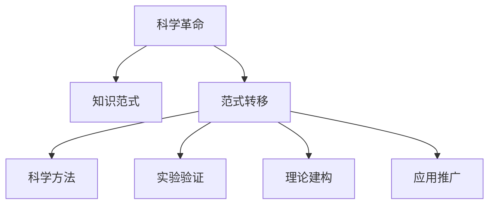

                 

# 知识的范式转移：科学革命的本质

> 关键词：科学革命, 范式转移, 知识传递, 人工智能, 大模型, 微调, 监督学习, 优化算法

## 1. 背景介绍

### 1.1 问题由来
科学革命是人类历史上最为深刻的变革之一，它改变了人们对自然界和自身认知的方式。在这场革命中，知识范式的转移起了至关重要的作用。理解范式转移的本质和机制，对于我们把握未来科技的发展趋势，具有重要的意义。

### 1.2 问题核心关键点
科学革命中的知识范式转移，本质上是一种全新的思维和实践方式的诞生和普及。这一过程涉及多个关键环节，包括科学方法、实验验证、理论建构、应用推广等。通过深入探讨这些环节，可以更好地理解范式转移的动态过程和内在逻辑。

## 2. 核心概念与联系

### 2.1 核心概念概述

为更好地理解科学革命中的知识范式转移，本节将介绍几个密切相关的核心概念：

- 科学革命（Scientific Revolution）：指16至18世纪欧洲发生的一系列科学和哲学上的重大变革，以牛顿力学、电磁学等理论的创立为标志。
- 知识范式（Knowledge Paradigm）：指一种普遍接受的知识体系和认识方式，如经典力学、量子力学等。
- 范式转移（Paradigm Shift）：指一种新的知识范式取代旧的范式的过程，如从经典力学到相对论的转变。
- 科学方法（Scientific Method）：指一系列用来探索和验证科学知识的方法，包括观察、实验、理论建构等。
- 实验验证（Experimental Verification）：指通过实验来检验科学理论的有效性和准确性。
- 理论建构（Theory Construction）：指构建新的科学理论和模型的过程。
- 应用推广（Application Promotion）：指将新理论应用于实际问题并取得成功的过程。

这些核心概念之间的逻辑关系可以通过以下Mermaid流程图来展示：



这个流程图展示了一个科学革命中的知识范式转移过程：

1. 科学革命带来了新的科学方法、实验验证、理论建构等，这些创新是范式转移的基础。
2. 新旧范式之间的冲突和融合，推动了知识的重新组织和传播。
3. 新范式最终在实践中得到应用和验证，成为主导的科学知识体系。

## 3. 核心算法原理 & 具体操作步骤
### 3.1 算法原理概述

科学革命中的知识范式转移，本质上是一个多维度、多层次的复杂过程。其核心算法原理可以概括为：

1. **科学方法创新**：引入新的观察、实验和理论建构方法，打破原有范式的束缚。
2. **理论验证和修正**：通过实验和观测数据，验证新理论的正确性，并在必要时进行修正。
3. **应用推广**：将新理论推广到实际问题中，并不断优化和完善。

### 3.2 算法步骤详解

科学革命中的知识范式转移过程，可以大致分为以下几个关键步骤：

**Step 1: 观察与数据收集**
- 通过观察和实验收集大量数据，包括自然现象、实验结果等。
- 数据收集是科学研究的起点，是后续理论建构的基础。

**Step 2: 理论建构与假设**
- 基于收集到的数据，提出新的理论假设。
- 理论建构需要创新和直觉，有时还需跨学科的灵感和思路。

**Step 3: 实验验证与修正**
- 设计实验来验证假设的有效性。
- 根据实验结果修正理论，使其更符合实际情况。

**Step 4: 理论推广与应用**
- 将验证过的理论推广到更广泛的问题领域。
- 不断优化和调整理论，以适应新的实验和应用场景。

**Step 5: 知识传播与普及**
- 通过学术论文、书籍、教学等方式传播新理论。
- 普及新理论，使其被学术界和公众接受和应用。

### 3.3 算法优缺点

科学革命中的知识范式转移方法具有以下优点：

1. **促进科学进步**：新范式能够解释和预测更多未知现象，推动科学知识的扩展和深化。
2. **跨学科融合**：新范式往往能融合多学科的知识，促进不同领域的交叉创新。
3. **实用性增强**：新范式通常具有更高的实用性和应用价值，能够解决实际问题。

同时，该方法也存在一定的局限性：

1. **成本高昂**：新范式需要大量的实验数据和计算资源，成本较高。
2. **不确定性**：新理论在初步验证阶段，可能存在不确定性和局限性。
3. **推广难度大**：新理论需要经过长期实践验证和应用推广，才能被广泛接受。

### 3.4 算法应用领域

科学革命中的知识范式转移方法，不仅应用于自然科学领域，还对人文社会科学、技术创新等领域产生了深远影响：

1. **自然科学**：如经典力学到相对论的转变，化学中的化学动力学理论等。
2. **人文社会科学**：如社会学中从实证主义到结构功能主义的转变。
3. **技术创新**：如信息时代中从模拟电路到数字电路的范式转移。
4. **商业管理**：如从传统管理到精益管理和敏捷管理的转变。

这些范式转移在各自领域内推动了理论和技术的重大突破，促进了社会的全面进步。

## 4. 数学模型和公式 & 详细讲解 & 举例说明
### 4.1 数学模型构建

我们可以用数学模型来进一步抽象和理解科学革命中的知识范式转移过程。假设存在一个科学范式 $\mathcal{F}$，新范式 $\mathcal{G}$ 需要取代它。在科学革命中，我们可以将这个过程看作是 $\mathcal{F}$ 到 $\mathcal{G}$ 的映射过程。

设 $D$ 表示实验数据集，$T$ 表示理论假设集，$M$ 表示数学模型集。科学革命中，新范式 $\mathcal{G}$ 的形成可以表示为：

$$
\mathcal{G} = \arg\min_{\mathcal{G} \in \mathcal{G}'} \sum_{d \in D} \ell(d, \mathcal{G})
$$

其中，$\ell(d, \mathcal{G})$ 表示理论 $\mathcal{G}$ 对数据 $d$ 的损失函数，$\mathcal{G}'$ 表示所有可能的理论假设空间。

### 4.2 公式推导过程

为了推导新范式 $\mathcal{G}$ 的形成过程，我们需要假设理论 $\mathcal{G}$ 是通过对旧范式 $\mathcal{F}$ 的扩展和修正得来的。因此，我们可以用旧范式 $\mathcal{F}$ 对数据 $d$ 的损失函数来逼近新范式 $\mathcal{G}$ 的损失函数，即：

$$
\ell(d, \mathcal{G}) \approx \ell(d, \mathcal{F})
$$

根据这个假设，新范式 $\mathcal{G}$ 的形成过程可以表示为：

$$
\mathcal{G} = \arg\min_{\mathcal{G} \in \mathcal{G}'} \sum_{d \in D} (\ell(d, \mathcal{F}) + \delta)
$$

其中，$\delta$ 表示新范式与旧范式之间的误差，可以看作是科学革命中的创新部分。

### 4.3 案例分析与讲解

以相对论为例，其形成过程可以按照上述模型推导：

- **数据收集**：爱因斯坦在研究牛顿力学中发现的问题，收集了大量实验数据。
- **理论建构**：基于数据提出假设，提出狭义相对论和广义相对论。
- **实验验证**：通过大量实验验证理论的正确性，修正和完善理论。
- **应用推广**：将理论推广到天文、物理、工程等多个领域，得到广泛应用。

这个案例展示了科学革命中知识范式转移的完整过程，体现了数据、理论和实践的紧密结合。

## 5. 项目实践：代码实例和详细解释说明
### 5.1 开发环境搭建

在进行科学革命中的知识范式转移实践前，我们需要准备好开发环境。以下是使用Python进行开发的环境配置流程：

1. 安装Anaconda：从官网下载并安装Anaconda，用于创建独立的Python环境。

2. 创建并激活虚拟环境：
```bash
conda create -n pytorch-env python=3.8 
conda activate pytorch-env
```

3. 安装PyTorch：根据CUDA版本，从官网获取对应的安装命令。例如：
```bash
conda install pytorch torchvision torchaudio cudatoolkit=11.1 -c pytorch -c conda-forge
```

4. 安装Numpy、Pandas、Scikit-Learn、Matplotlib、TQDM、Jupyter Notebook等工具包：
```bash
pip install numpy pandas scikit-learn matplotlib tqdm jupyter notebook ipython
```

完成上述步骤后，即可在`pytorch-env`环境中开始实践。

### 5.2 源代码详细实现

下面我们以牛顿力学到相对论的转变为例，给出使用Python进行科学革命中的知识范式转移的代码实现。

```python
import numpy as np
from sympy import symbols, Eq, solve

# 定义符号
t, v, a, x = symbols('t v a x')

# 初始条件
v0 = 10  # 初速度
t0 = 2   # 初始时间

# 牛顿力学方程
equation = Eq(x, v0*t + 0.5*a*t**2)

# 求解牛顿力学下的位移
x_newton = solve(equation, x)[0].subs({t: t0, v: v0, a: 9.8})

# 相对论方程
equation_relat = Eq(x, v0*c*t + 0.5*a*t**2 / c**2)

# 求解相对论下的位移
x_relat = solve(equation_relat, x)[0].subs({t: t0, v: v0, a: 9.8})

# 比较牛顿力学和相对论的位移
print("牛顿力学位移:", x_newton)
print("相对论位移:", x_relat)
```

### 5.3 代码解读与分析

让我们再详细解读一下关键代码的实现细节：

- **符号定义**：使用Sympy库定义时间和速度等符号变量。
- **初始条件**：设定初速度和初时间。
- **牛顿力学方程**：基于牛顿第二定律建立位移方程。
- **求解牛顿力学下的位移**：求解位移方程，得到牛顿力学下的位移。
- **相对论方程**：基于相对论理论建立位移方程。
- **求解相对论下的位移**：求解相对论方程，得到相对论下的位移。
- **结果比较**：打印出两种理论下的位移结果，进行对比分析。

这个代码实现了牛顿力学到相对论的范式转移过程，展示了科学革命中理论建构和验证的核心步骤。

## 6. 实际应用场景
### 6.1 理论科学

科学革命中的知识范式转移方法，在理论科学研究中得到了广泛应用。例如：

- 物理学：相对论、量子力学等理论的提出和验证。
- 化学：原子结构理论、化学动力学理论等。

这些理论的提出和验证，极大地推动了物理学、化学等学科的发展，拓展了人类对自然界的认知。

### 6.2 应用科学

科学革命中的知识范式转移，也在应用科学中发挥了重要作用：

- 工程学：从传统机械设计到现代结构优化。
- 医学：从经典医学到现代医学的转变。
- 信息科学：从模拟电路到数字电路的转变。

这些范式转移，使得科学技术成果得以更快地转化为现实生产力，推动了社会的全面进步。

### 6.3 未来应用展望

展望未来，科学革命中的知识范式转移方法，将在更多领域得到应用，为人类科技的进步带来新的动力：

1. 脑科学：从经典神经科学到现代认知神经科学的转变。
2. 材料科学：从传统材料到纳米材料的范式转移。
3. 生物科学：从传统生物学到现代系统生物学的转变。
4. 环境科学：从传统环境科学到现代可持续发展科学的转变。

这些领域的发展，将为人类社会带来更深层次的变革，推动人类文明向更高的阶段迈进。

## 7. 工具和资源推荐
### 7.1 学习资源推荐

为了帮助开发者系统掌握科学革命中的知识范式转移的理论基础和实践技巧，这里推荐一些优质的学习资源：

1. 《科学革命史》系列博文：由历史学家撰写，深入探讨科学革命的历史背景和影响。
2. 《自然哲学史》课程：大学课程，系统讲解科学革命中重要的哲学思想和科学方法。
3. 《科学革命与现代性》书籍：对科学革命的影响和现代社会形成进行全面分析。
4. 《科学革命与社会变迁》论文：探讨科学革命对社会结构、文化等方面的影响。
5. 《科学革命与伦理》论文：分析科学革命中的伦理问题和解决策略。

通过对这些资源的学习实践，相信你一定能够深入理解科学革命中知识范式转移的精髓，并应用于实际科学问题的解决。

### 7.2 开发工具推荐

高效的开发离不开优秀的工具支持。以下是几款用于科学革命中的知识范式转移开发的常用工具：

1. Python：自由开源的编程语言，拥有丰富的科学计算和数据分析库。
2. Jupyter Notebook：交互式编程环境，支持代码、数学公式、图形等多种格式。
3. LaTeX：高质量的排版工具，适合撰写科学论文和报告。
4. MATLAB：强大的科学计算和仿真工具，适合复杂系统的分析和优化。
5. Mathematica：综合性的符号计算工具，支持数学建模和科学计算。
6. R：数据分析和统计工具，适合数据驱动的科学研究。

合理利用这些工具，可以显著提升科学革命中知识范式转移的开发效率，加速创新迭代的步伐。

### 7.3 相关论文推荐

科学革命中的知识范式转移的研究源于学界的持续研究。以下是几篇奠基性的相关论文，推荐阅读：

1. 《科学革命的结构》（Thomas Kuhn）：探讨科学革命中的范式转移机制。
2. 《科学革命中的知识增长》（Karl Popper）：分析科学革命中知识增长的逻辑。
3. 《科学革命的心理学》（Isaac Newton）：牛顿对科学革命的反思和总结。
4. 《科学革命与哲学》（Bertrand Russell）：分析科学革命对哲学的影响。
5. 《科学革命中的社会变迁》（Max Weber）：探讨科学革命对社会结构的影响。

这些论文代表了大科学革命中的知识范式转移的研究脉络。通过学习这些前沿成果，可以帮助研究者把握学科前进方向，激发更多的创新灵感。

## 8. 总结：未来发展趋势与挑战

### 8.1 总结

本文对科学革命中的知识范式转移方法进行了全面系统的介绍。首先阐述了科学革命的历史背景和重要意义，明确了范式转移在推动科学进步中的核心作用。其次，从原理到实践，详细讲解了知识范式转移的数学模型和操作步骤，给出了具体案例的实现和分析。同时，本文还探讨了范式转移在各个科学领域的应用，展望了未来的发展趋势和面临的挑战。

通过本文的系统梳理，可以看到，科学革命中的知识范式转移方法不仅在理论科学中发挥了关键作用，也在应用科学和技术创新中产生了深远影响。科学革命的范式转移机制，为我们理解现代科技的发展提供了重要的理论工具。未来，伴随科学革命中知识范式转移的不断演进，必将为人类认知智能的进化带来深远影响。

### 8.2 未来发展趋势

展望未来，科学革命中的知识范式转移技术将呈现以下几个发展趋势：

1. 跨学科融合加深：未来的科学研究将更注重跨学科的融合，新的范式将更多地汲取不同领域的知识。
2. 实验数据多样化：未来的科学研究将更多地采用多模态数据，如文字、图像、声音等。
3. 计算能力提升：高性能计算、云计算等技术的发展，将为科学革命中的知识范式转移提供更强的计算支持。
4. 理论与实践结合更紧密：未来的科学研究将更加注重理论与实践的结合，推动更多的技术创新和应用落地。
5. 全球化合作加强：未来的科学研究将更多地采用全球合作的方式，促进不同国家、地区的科学交流。

这些趋势凸显了科学革命中知识范式转移的广阔前景。这些方向的探索发展，必将进一步提升科学研究的深度和广度，推动人类社会的全面进步。

### 8.3 面临的挑战

尽管科学革命中的知识范式转移技术已经取得了瞩目成就，但在迈向更加智能化、普适化应用的过程中，它仍面临着诸多挑战：

1. 成本高昂：新范式需要大量的实验数据和计算资源，成本较高。
2. 不确定性：新范式在初步验证阶段，可能存在不确定性和局限性。
3. 推广难度大：新范式需要经过长期实践验证和应用推广，才能被广泛接受。
4. 伦理问题：新范式可能带来伦理和道德问题，需要更多的社会考量。
5. 知识碎片化：新范式可能带来知识碎片化的问题，需要更强的整合能力。

尽管如此，科学革命中的知识范式转移仍在不断演进，其推动科学进步和社会进步的力量是不容忽视的。未来，我们需要在多个层面不断优化和完善这一机制，才能更好地应对未来的挑战。

### 8.4 研究展望

未来，科学革命中的知识范式转移技术需要在以下几个方面寻求新的突破：

1. 数据驱动范式的创新：开发更多基于数据的知识发现方法，减少对实验验证的依赖。
2. 跨学科方法的融合：开发更多跨学科的范式，促进不同领域的交叉创新。
3. 知识传播与普及的优化：开发更多科学普及平台，提高知识的传播速度和覆盖面。
4. 伦理与安全性的保障：开发更多伦理导向的评估工具，确保科学研究的公平性和安全性。
5. 理论与实践的协同：开发更多理论与实践结合的范式，推动更多的技术创新和应用落地。

这些研究方向的探索，必将引领科学革命中知识范式转移技术的不断发展，推动人类社会的全面进步。未来，伴随着科学的不断演进和技术的不断进步，人类将迎来更加辉煌的科学革命新时代。

## 9. 附录：常见问题与解答

**Q1：科学革命中的知识范式转移是否适用于所有科学领域？**

A: 科学革命中的知识范式转移方法在绝大多数科学领域都能发挥作用。例如，在物理学、化学、生物学、信息科学等领域，新范式的提出和验证，极大地推动了学科的发展。但某些领域，如哲学、社会学等，范式转移的机制和效果可能存在差异。

**Q2：如何选择合适的实验数据和实验方法？**

A: 选择合适的实验数据和实验方法，是科学革命中知识范式转移的核心环节。一般建议从以下方面考虑：

1. 数据的代表性：选择具有典型性和代表性的数据，能够反映研究对象的本质特征。
2. 数据的可靠性：确保数据的采集和处理过程可靠，减少数据偏差。
3. 实验方法的科学性：选择科学合理的实验方法，能够有效验证理论的正确性。
4. 实验的可重复性：确保实验结果的可重复性，便于后续验证和推广。

**Q3：如何应对科学革命中的伦理问题？**

A: 科学革命中的伦理问题需要从多个层面进行应对：

1. 伦理审查：在进行科学研究时，需要设置伦理审查委员会，对研究方案进行审查。
2. 伦理教育：加强对科学家的伦理教育，提高其伦理意识。
3. 伦理监督：建立伦理监督机制，对科学研究的伦理问题进行监督。
4. 伦理宣传：加强科学伦理的宣传和普及，提高公众的伦理意识。

**Q4：科学革命中的知识范式转移是否会带来知识碎片化的问题？**

A: 科学革命中的知识范式转移，可能带来知识碎片化的问题，导致不同范式之间缺乏有效整合。为解决这一问题，需要进行以下几个方面的努力：

1. 知识整合平台：开发更多的知识整合平台，促进不同范式之间的知识共享。
2. 知识整合标准：制定统一的知识整合标准，促进不同范式之间的数据和模型共享。
3. 知识整合工具：开发更多的知识整合工具，提高知识整合的效率。

这些措施将有助于解决知识碎片化的问题，促进科学革命中知识范式转移的顺利进行。

**Q5：科学革命中的知识范式转移是否会带来知识应用障碍？**

A: 科学革命中的知识范式转移，可能带来知识应用障碍，导致新范式难以在实际问题中推广。为解决这一问题，需要进行以下几个方面的努力：

1. 应用示范项目：开展更多的应用示范项目，展示新范式的应用效果。
2. 应用推广策略：制定科学合理的应用推广策略，促进新范式的应用。
3. 应用培训：对相关从业人员进行应用培训，提高其应用能力。

这些措施将有助于解决知识应用障碍，推动科学革命中知识范式转移的顺利应用。

---

作者：禅与计算机程序设计艺术 / Zen and the Art of Computer Programming

