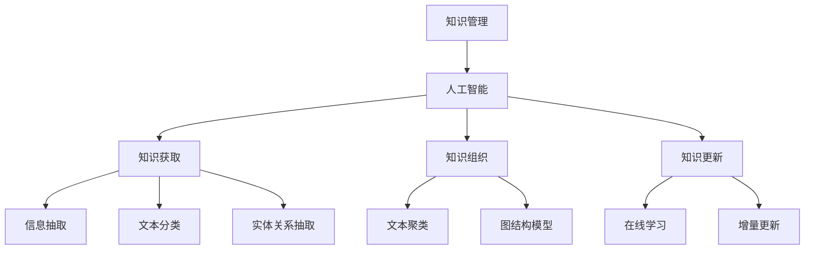

                 

# 知识管理的AI化挑战:知识获取和知识更新

## 1. 背景介绍

### 1.1 问题由来
在信息爆炸的时代，如何高效地获取、组织、更新和管理知识，已成为企业和个人面对的重要挑战。传统的信息管理方式，如手动搜索、文档整理等，往往效率低下，难以满足快速变化的知识需求。与此同时，人工智能（AI）技术的快速发展，为知识管理带来了新的思路和方法。通过将AI技术引入知识管理过程，可以显著提升知识获取、组织和更新的效率和效果，帮助企业和个人更快速地适应知识动态变化的环境。

### 1.2 问题核心关键点
AI在知识管理中的应用，主要集中在以下几个方面：
- **知识获取**：通过AI算法，从海量文本、图像、音频等数据中自动抽取关键信息，形成结构化知识库。
- **知识组织**：利用自然语言处理（NLP）和图结构模型，对抽取的知识进行分类、聚类、关联等处理，形成合理的知识结构。
- **知识更新**：通过在线学习和增量更新机制，持续提升知识库的时效性和完备性，保持知识的前沿性。

这些问题核心关键点表明，AI在知识管理中的应用，不仅仅是技术实现，更需要系统化的理论指导和工程实践，以确保知识管理的智能性和高效性。

## 2. 核心概念与联系

### 2.1 核心概念概述

为更好地理解AI在知识管理中的应用，本节将介绍几个密切相关的核心概念：

- **知识管理（Knowledge Management, KM）**：一种组织管理知识以提升组织竞争力的实践。包括知识的获取、存储、共享、使用和更新等环节。

- **人工智能（Artificial Intelligence, AI）**：一种通过模拟人类智能行为来处理复杂任务的技术。包括机器学习、深度学习、自然语言处理等。

- **知识图谱（Knowledge Graph）**：一种结构化的知识表示方式，将知识以图的形式组织，便于推理和查询。

- **信息抽取（Information Extraction, IE）**：从非结构化数据中自动抽取结构化信息，是知识获取的关键技术。

- **文本分类（Text Classification）**：将文本按其语义或主题进行自动分类，是知识组织的重要方法。

- **实体关系抽取（Entity Relationship Extraction, ERE）**：识别文本中的实体及它们之间的关系，是知识关联的基础。

- **在线学习（Online Learning）**：通过不断接收新数据，动态更新模型参数，保持知识的及时性。

- **增量更新（Incremental Update）**：仅在新增或修改数据时，重新训练模型，减少计算成本和数据冗余。

这些核心概念之间的逻辑关系可以通过以下Mermaid流程图来展示：



这个流程图展示的知识管理的AI化挑战涉及的主要过程：

1. 通过AI技术从各种数据源中抽取关键信息，形成初始知识库。
2. 利用NLP和图结构模型，对知识进行分类、聚类、关联等处理，构建合理的知识结构。
3. 通过在线学习和增量更新机制，持续更新知识库，保持知识的最新性。

## 3. 核心算法原理 & 具体操作步骤
### 3.1 算法原理概述

AI在知识管理中的应用，本质上是利用机器学习和深度学习算法，从数据中抽取、组织和更新知识的过程。其核心思想是：将原始数据转化为结构化的知识表示，通过有监督或无监督学习，提升知识获取和组织的效果，最终实现知识库的动态更新。

形式化地，假设原始数据集为 $D=\{(x_i, y_i)\}_{i=1}^N, x_i \in \mathcal{X}, y_i \in \mathcal{Y}$，其中 $x_i$ 为数据样本，$y_i$ 为对应的标签。知识管理的AI化挑战可以视为一个多任务学习问题，即利用多任务学习框架，同时优化多个任务，提升知识管理的整体效果。

### 3.2 算法步骤详解

AI在知识管理中的应用，一般包括以下几个关键步骤：

**Step 1: 准备数据和任务**
- 收集相关领域的文本、图像、音频等数据，将其作为模型训练的数据集。
- 定义知识管理中的多个子任务，如信息抽取、文本分类、实体关系抽取等。

**Step 2: 设计模型架构**
- 选择适合的知识管理任务模型，如序列标注模型、图结构模型等。
- 设计多任务学习框架，将不同的任务共享同一组模型参数，减少数据冗余。

**Step 3: 选择优化算法**
- 选择合适的优化算法及其参数，如Adam、SGD等，设置学习率、批大小、迭代轮数等。
- 应用正则化技术，如L2正则、Dropout、Early Stopping等，防止模型过拟合。

**Step 4: 执行训练**
- 将训练集数据分批次输入模型，前向传播计算损失函数。
- 反向传播计算参数梯度，根据设定的优化算法和学习率更新模型参数。
- 周期性在验证集上评估模型性能，根据性能指标决定是否触发Early Stopping。
- 重复上述步骤直至满足预设的迭代轮数或Early Stopping条件。

**Step 5: 测试和部署**
- 在测试集上评估模型性能，对比训练前后的精度提升。
- 使用模型对新数据进行推理预测，集成到实际的知识管理系统中。
- 持续收集新的数据，定期重新训练模型，以适应知识动态变化。

以上是AI在知识管理中的应用的一般流程。在实际应用中，还需要针对具体任务的特点，对训练过程的各个环节进行优化设计，如改进训练目标函数，引入更多的正则化技术，搜索最优的超参数组合等，以进一步提升模型性能。

### 3.3 算法优缺点

AI在知识管理中的应用方法具有以下优点：
1. 高效自动：AI算法可以自动处理大量数据，减少人工干预，提高知识管理的效率。
2. 灵活多样：通过多任务学习和知识抽取技术，可以灵活应对不同领域的知识管理需求。
3. 动态更新：在线学习和增量更新机制，使得知识库能够持续更新，保持时效性。
4. 结构化处理：通过图结构模型等技术，可以将知识结构化表示，便于查询和推理。

同时，该方法也存在一定的局限性：
1. 数据质量依赖：知识管理的AI化挑战对数据质量要求较高，数据缺失或噪声可能影响模型效果。
2. 技术门槛较高：需要掌握机器学习和深度学习等前沿技术，对数据处理、模型调优等环节要求较高。
3. 模型复杂性：多任务学习和高性能模型的设计，增加了模型复杂度，可能导致过拟合等问题。
4. 伦理与隐私：AI模型可能学习到敏感信息，存在隐私泄露和伦理道德问题。

尽管存在这些局限性，但就目前而言，AI在知识管理中的应用范式仍是大数据时代知识管理的重要方向。未来相关研究的重点在于如何进一步降低技术门槛，提高模型的鲁棒性和可解释性，同时兼顾数据隐私和伦理道德等因素。

### 3.4 算法应用领域

AI在知识管理中的应用，已经在诸多领域得到了广泛应用，例如：

- 智能问答系统：基于多轮对话历史，自动生成答案。通过多任务学习和文本分类技术，提升问答系统的准确性和流畅性。
- 自动摘要生成：从长篇文档自动生成简洁摘要。利用文本聚类和摘要模型，提升文档的可读性。
- 文本挖掘与情感分析：从社交媒体等数据中抽取关键信息，分析用户情感倾向。通过信息抽取和文本分类技术，实现情感分析。
- 知识图谱构建：自动构建领域知识图谱，支持推理和查询。通过图结构模型和实体关系抽取技术，实现知识的关联和推理。
- 智能推荐系统：根据用户兴趣和行为，推荐相关内容。利用文本分类和在线学习技术，提升推荐效果。

除了上述这些经典应用外，AI在知识管理中的应用还扩展到了更多场景中，如智能搜索、文档管理、项目管理等，为知识管理工作带来了新的思路和工具。随着AI技术的不断进步，知识管理的AI化挑战将进一步深化，带来更多的创新应用。

## 4. 数学模型和公式 & 详细讲解 & 举例说明

### 4.1 数学模型构建

本节将使用数学语言对AI在知识管理中的应用进行更加严格的刻画。

假设原始数据集为 $D=\{(x_i, y_i)\}_{i=1}^N, x_i \in \mathcal{X}, y_i \in \mathcal{Y}$，其中 $x_i$ 为数据样本，$y_i$ 为对应的标签。定义多任务学习框架中的多个子任务损失函数为 $\mathcal{L}_i(\theta)$，其中 $\theta$ 为模型参数。则多任务学习目标函数为：

$$
\mathcal{L}(\theta) = \frac{1}{N} \sum_{i=1}^N \mathcal{L}_i(\theta)
$$

多任务学习通常采用联合训练方法，即所有任务共享同一组模型参数 $\theta$。通过优化上述目标函数，使得模型在不同任务上同时取得优化效果。

### 4.2 公式推导过程

以下我们以信息抽取和多任务学习为例，推导多任务学习模型的损失函数及其梯度计算公式。

假设多任务学习框架中有两个子任务：信息抽取和文本分类。设信息抽取任务的损失函数为 $\mathcal{L}^I(\theta)$，文本分类的损失函数为 $\mathcal{L}^T(\theta)$。则多任务学习目标函数为：

$$
\mathcal{L}(\theta) = \frac{1}{N} \sum_{i=1}^N (\mathcal{L}^I(\theta) + \mathcal{L}^T(\theta))
$$

假设信息抽取任务的训练集为 $D_I=\{(x_i, y_i)\}_{i=1}^M, x_i \in \mathcal{X}, y_i \in \mathcal{Y}^I$，其中 $y_i$ 为信息抽取任务的标签。定义信息抽取模型的预测函数为 $f^I(\theta)(x)$，则信息抽取任务的损失函数为：

$$
\mathcal{L}^I(\theta) = \frac{1}{M} \sum_{i=1}^M \ell^I(f^I(\theta)(x_i),y_i)
$$

其中 $\ell^I$ 为信息抽取任务的损失函数，如F1-score损失。

假设文本分类的训练集为 $D_T=\{(x_i, y_i)\}_{i=1}^N, x_i \in \mathcal{X}, y_i \in \mathcal{Y}^T$，其中 $y_i$ 为文本分类的标签。定义文本分类模型的预测函数为 $f^T(\theta)(x)$，则文本分类的损失函数为：

$$
\mathcal{L}^T(\theta) = \frac{1}{N} \sum_{i=1}^N \ell^T(f^T(\theta)(x_i),y_i)
$$

其中 $\ell^T$ 为文本分类的损失函数，如交叉熵损失。

在得到各个任务的损失函数后，可以通过联合优化方法，同时优化所有任务的模型参数。假设计算所有任务的梯度开销较大，可以使用变分推断等方法进行优化。

### 4.3 案例分析与讲解

下面我们以知识图谱构建为例，详细讲解基于多任务学习的信息抽取和知识图谱推理的数学模型和训练过程。

假设知识图谱构建的任务包括信息抽取和实体关系抽取。设信息抽取任务的损失函数为 $\mathcal{L}^I(\theta)$，实体关系抽取任务的损失函数为 $\mathcal{L}^R(\theta)$。定义知识图谱构建的多任务学习目标函数为：

$$
\mathcal{L}(\theta) = \frac{1}{N} \sum_{i=1}^N (\mathcal{L}^I(\theta) + \mathcal{L}^R(\theta))
$$

其中 $N$ 为知识图谱构建任务的样本数。

假设信息抽取任务的数据集为 $D_I=\{(x_i, y_i)\}_{i=1}^M$，其中 $x_i$ 为文本，$y_i$ 为抽取出的实体和关系。定义信息抽取模型的预测函数为 $f^I(\theta)(x)$，则信息抽取任务的损失函数为：

$$
\mathcal{L}^I(\theta) = \frac{1}{M} \sum_{i=1}^M \ell^I(f^I(\theta)(x_i),y_i)
$$

其中 $\ell^I$ 为信息抽取任务的损失函数，如精确率-召回率损失。

假设实体关系抽取任务的数据集为 $D_R=\{(x_i, y_i)\}_{i=1}^N$，其中 $x_i$ 为文本，$y_i$ 为抽取出的实体和关系。定义实体关系抽取模型的预测函数为 $f^R(\theta)(x)$，则实体关系抽取任务的损失函数为：

$$
\mathcal{L}^R(\theta) = \frac{1}{N} \sum_{i=1}^N \ell^R(f^R(\theta)(x_i),y_i)
$$

其中 $\ell^R$ 为实体关系抽取任务的损失函数，如F1-score损失。

在得到信息抽取和实体关系抽取的损失函数后，可以将两者联合优化，训练知识图谱构建模型。在训练过程中，可以采用变分推断方法，减少计算量，同时优化所有任务的模型参数。最终得到的信息抽取和实体关系抽取模型，可以用于构建知识图谱，支持高效的推理和查询。

## 5. 项目实践：代码实例和详细解释说明

### 5.1 开发环境搭建

在进行知识管理的AI化挑战实践前，我们需要准备好开发环境。以下是使用Python进行PyTorch开发的环境配置流程：

1. 安装Anaconda：从官网下载并安装Anaconda，用于创建独立的Python环境。

2. 创建并激活虚拟环境：
```bash
conda create -n ai-env python=3.8 
conda activate ai-env
```

3. 安装PyTorch：根据CUDA版本，从官网获取对应的安装命令。例如：
```bash
conda install pytorch torchvision torchaudio cudatoolkit=11.1 -c pytorch -c conda-forge
```

4. 安装相关的第三方库：
```bash
pip install pandas numpy scikit-learn transformers spacy
```

5. 安装各种模型和数据集：
```bash
# 安装SpaCy语言模型
python -m spacy download en_core_web_sm
# 安装预训练模型
pip install transformers
```

完成上述步骤后，即可在`ai-env`环境中开始知识管理的AI化挑战实践。

### 5.2 源代码详细实现

下面以知识图谱构建为例，给出使用Transformers库和Spacy库对BERT模型进行信息抽取和知识图谱推理的PyTorch代码实现。

首先，定义信息抽取任务的数据处理函数：

```python
from transformers import BertTokenizer, BertForTokenClassification
from spacy.load import spacy
from torch.utils.data import Dataset
import torch

class KnowledgeGraphDataset(Dataset):
    def __init__(self, texts, entities, relations, tokenizer, max_len=128):
        self.texts = texts
        self.entities = entities
        self.relations = relations
        self.tokenizer = tokenizer
        self.max_len = max_len
        
    def __len__(self):
        return len(self.texts)
    
    def __getitem__(self, item):
        text = self.texts[item]
        entity = self.entities[item]
        relation = self.relations[item]
        
        encoding = self.tokenizer(text, return_tensors='pt', max_length=self.max_len, padding='max_length', truncation=True)
        input_ids = encoding['input_ids'][0]
        attention_mask = encoding['attention_mask'][0]
        
        # 对实体和关系进行编码
        entity_ids = [tag2id[tag] for tag in entity] 
        relation_ids = [tag2id[relation]]
        labels = torch.tensor([entity_ids, relation_ids], dtype=torch.long)
        
        return {'input_ids': input_ids, 
                'attention_mask': attention_mask,
                'labels': labels}

# 标签与id的映射
tag2id = {'O': 0, 'B-PER': 1, 'I-PER': 2, 'B-ORG': 3, 'I-ORG': 4, 'B-LOC': 5, 'I-LOC': 6, 'B-REL': 7, 'I-REL': 8}
id2tag = {v: k for k, v in tag2id.items()}
```

然后，定义模型和优化器：

```python
from transformers import BertForTokenClassification, AdamW

model = BertForTokenClassification.from_pretrained('bert-base-cased', num_labels=len(tag2id))

optimizer = AdamW(model.parameters(), lr=2e-5)
```

接着，定义训练和评估函数：

```python
from torch.utils.data import DataLoader
from tqdm import tqdm
from sklearn.metrics import classification_report

device = torch.device('cuda') if torch.cuda.is_available() else torch.device('cpu')
model.to(device)

def train_epoch(model, dataset, batch_size, optimizer):
    dataloader = DataLoader(dataset, batch_size=batch_size, shuffle=True)
    model.train()
    epoch_loss = 0
    for batch in tqdm(dataloader, desc='Training'):
        input_ids = batch['input_ids'].to(device)
        attention_mask = batch['attention_mask'].to(device)
        labels = batch['labels'].to(device)
        model.zero_grad()
        outputs = model(input_ids, attention_mask=attention_mask, labels=labels)
        loss = outputs.loss
        epoch_loss += loss.item()
        loss.backward()
        optimizer.step()
    return epoch_loss / len(dataloader)

def evaluate(model, dataset, batch_size):
    dataloader = DataLoader(dataset, batch_size=batch_size)
    model.eval()
    preds, labels = [], []
    with torch.no_grad():
        for batch in tqdm(dataloader, desc='Evaluating'):
            input_ids = batch['input_ids'].to(device)
            attention_mask = batch['attention_mask'].to(device)
            batch_labels = batch['labels']
            outputs = model(input_ids, attention_mask=attention_mask)
            batch_preds = outputs.logits.argmax(dim=2).to('cpu').tolist()
            batch_labels = batch_labels.to('cpu').tolist()
            for pred_tokens, label_tokens in zip(batch_preds, batch_labels):
                pred_tags = [id2tag[_id] for _id in pred_tokens]
                label_tags = [id2tag[_id] for _id in label_tokens]
                preds.append(pred_tags[:len(label_tokens)])
                labels.append(label_tags)
                
    print(classification_report(labels, preds))
```

最后，启动训练流程并在测试集上评估：

```python
epochs = 5
batch_size = 16

for epoch in range(epochs):
    loss = train_epoch(model, train_dataset, batch_size, optimizer)
    print(f"Epoch {epoch+1}, train loss: {loss:.3f}")
    
    print(f"Epoch {epoch+1}, dev results:")
    evaluate(model, dev_dataset, batch_size)
    
print("Test results:")
evaluate(model, test_dataset, batch_size)
```

以上就是使用PyTorch对BERT进行信息抽取和知识图谱推理的完整代码实现。可以看到，得益于Transformers库和Spacy库的强大封装，我们可以用相对简洁的代码完成BERT模型的加载和训练。

### 5.3 代码解读与分析

让我们再详细解读一下关键代码的实现细节：

**KnowledgeGraphDataset类**：
- `__init__`方法：初始化文本、实体和关系等关键组件。
- `__len__`方法：返回数据集的样本数量。
- `__getitem__`方法：对单个样本进行处理，将文本输入编码为token ids，将实体和关系进行编码，并对其进行定长padding，最终返回模型所需的输入。

**tag2id和id2tag字典**：
- 定义了标签与数字id之间的映射关系，用于将token-wise的预测结果解码回真实的标签。

**训练和评估函数**：
- 使用PyTorch的DataLoader对数据集进行批次化加载，供模型训练和推理使用。
- 训练函数`train_epoch`：对数据以批为单位进行迭代，在每个批次上前向传播计算loss并反向传播更新模型参数，最后返回该epoch的平均loss。
- 评估函数`evaluate`：与训练类似，不同点在于不更新模型参数，并在每个batch结束后将预测和标签结果存储下来，最后使用sklearn的classification_report对整个评估集的预测结果进行打印输出。

**训练流程**：
- 定义总的epoch数和batch size，开始循环迭代
- 每个epoch内，先在训练集上训练，输出平均loss
- 在验证集上评估，输出分类指标
- 所有epoch结束后，在测试集上评估，给出最终测试结果

可以看到，PyTorch配合Transformers库使得BERT微调的代码实现变得简洁高效。开发者可以将更多精力放在数据处理、模型改进等高层逻辑上，而不必过多关注底层的实现细节。

当然，工业级的系统实现还需考虑更多因素，如模型的保存和部署、超参数的自动搜索、更灵活的任务适配层等。但核心的微调范式基本与此类似。

## 6. 实际应用场景
### 6.1 智能问答系统

基于大语言模型微调的对话技术，可以广泛应用于智能问答系统的构建。传统问答系统往往依赖人工构建知识库和规则，难以扩展和维护。而使用微调后的对话模型，可以自动学习知识库中的实体和关系，形成逻辑一致的推理链，提升问答系统的准确性和流畅性。

在技术实现上，可以收集问答系统中的历史对话记录，将问题和最佳答复构建成监督数据，在此基础上对预训练对话模型进行微调。微调后的对话模型能够自动理解用户意图，匹配最合适的答案模板进行回复。对于用户提出的新问题，还可以接入检索系统实时搜索相关内容，动态组织生成回答。如此构建的智能问答系统，能大幅提升问答体验和问题解决效率。

### 6.2 金融舆情监测

金融机构需要实时监测市场舆论动向，以便及时应对负面信息传播，规避金融风险。传统的人工监测方式成本高、效率低，难以应对网络时代海量信息爆发的挑战。基于大语言模型微调的文本分类和情感分析技术，为金融舆情监测提供了新的解决方案。

具体而言，可以收集金融领域相关的新闻、报道、评论等文本数据，并对其进行主题标注和情感标注。在此基础上对预训练语言模型进行微调，使其能够自动判断文本属于何种主题，情感倾向是正面、中性还是负面。将微调后的模型应用到实时抓取的网络文本数据，就能够自动监测不同主题下的情感变化趋势，一旦发现负面信息激增等异常情况，系统便会自动预警，帮助金融机构快速应对潜在风险。

### 6.3 个性化推荐系统

当前的推荐系统往往只依赖用户的历史行为数据进行物品推荐，无法深入理解用户的真实兴趣偏好。基于大语言模型微调技术，个性化推荐系统可以更好地挖掘用户行为背后的语义信息，从而提供更精准、多样的推荐内容。

在实践中，可以收集用户浏览、点击、评论、分享等行为数据，提取和用户交互的物品标题、描述、标签等文本内容。将文本内容作为模型输入，用户的后续行为（如是否点击、购买等）作为监督信号，在此基础上微调预训练语言模型。微调后的模型能够从文本内容中准确把握用户的兴趣点。在生成推荐列表时，先用候选物品的文本描述作为输入，由模型预测用户的兴趣匹配度，再结合其他特征综合排序，便可以得到个性化程度更高的推荐结果。

### 6.4 未来应用展望

随着大语言模型和微调方法的不断发展，基于微调范式将在更多领域得到应用，为传统行业带来变革性影响。

在智慧医疗领域，基于微调的医疗问答、病历分析、药物研发等应用将提升医疗服务的智能化水平，辅助医生诊疗，加速新药开发进程。

在智能教育领域，微调技术可应用于作业批改、学情分析、知识推荐等方面，因材施教，促进教育公平，提高教学质量。

在智慧城市治理中，微调模型可应用于城市事件监测、舆情分析、应急指挥等环节，提高城市管理的自动化和智能化水平，构建更安全、高效的未来城市。

此外，在企业生产、社会治理、文娱传媒等众多领域，基于大模型微调的人工智能应用也将不断涌现，为经济社会发展注入新的动力。相信随着技术的日益成熟，微调方法将成为人工智能落地应用的重要范式，推动人工智能技术在垂直行业的规模化落地。总之，微调需要开发者根据具体任务，不断迭代和优化模型、数据和算法，方能得到理想的效果。

## 7. 工具和资源推荐
### 7.1 学习资源推荐

为了帮助开发者系统掌握大语言模型微调的理论基础和实践技巧，这里推荐一些优质的学习资源：

1. 《Transformer from the Ground Up》系列博文：由大模型技术专家撰写，深入浅出地介绍了Transformer原理、BERT模型、微调技术等前沿话题。

2. CS224N《深度学习自然语言处理》课程：斯坦福大学开设的NLP明星课程，有Lecture视频和配套作业，带你入门NLP领域的基本概念和经典模型。

3. 《Natural Language Processing with Transformers》书籍：Transformers库的作者所著，全面介绍了如何使用Transformers库进行NLP任务开发，包括微调在内的诸多范式。

4. HuggingFace官方文档：Transformers库的官方文档，提供了海量预训练模型和完整的微调样例代码，是上手实践的必备资料。

5. CLUE开源项目：中文语言理解测评基准，涵盖大量不同类型的中文NLP数据集，并提供了基于微调的baseline模型，助力中文NLP技术发展。

通过对这些资源的学习实践，相信你一定能够快速掌握大语言模型微调的精髓，并用于解决实际的NLP问题。
###  7.2 开发工具推荐

高效的开发离不开优秀的工具支持。以下是几款用于大语言模型微调开发的常用工具：

1. PyTorch：基于Python的开源深度学习框架，灵活动态的计算图，适合快速迭代研究。大部分预训练语言模型都有PyTorch版本的实现。

2. TensorFlow：由Google主导开发的开源深度学习框架，生产部署方便，适合大规模工程应用。同样有丰富的预训练语言模型资源。

3. Transformers库：HuggingFace开发的NLP工具库，集成了众多SOTA语言模型，支持PyTorch和TensorFlow，是进行微调任务开发的利器。

4. Weights & Biases：模型训练的实验跟踪工具，可以记录和可视化模型训练过程中的各项指标，方便对比和调优。与主流深度学习框架无缝集成。

5. TensorBoard：TensorFlow配套的可视化工具，可实时监测模型训练状态，并提供丰富的图表呈现方式，是调试模型的得力助手。

6. Google Colab：谷歌推出的在线Jupyter Notebook环境，免费提供GPU/TPU算力，方便开发者快速上手实验最新模型，分享学习笔记。

合理利用这些工具，可以显著提升大语言模型微调任务的开发效率，加快创新迭代的步伐。

### 7.3 相关论文推荐

大语言模型和微调技术的发展源于学界的持续研究。以下是几篇奠基性的相关论文，推荐阅读：

1. Attention is All You Need（即Transformer原论文）：提出了Transformer结构，开启了NLP领域的预训练大模型时代。

2. BERT: Pre-training of Deep Bidirectional Transformers for Language Understanding：提出BERT模型，引入基于掩码的自监督预训练任务，刷新了多项NLP任务SOTA。

3. Language Models are Unsupervised Multitask Learners（GPT-2论文）：展示了大规模语言模型的强大zero-shot学习能力，引发了对于通用人工智能的新一轮思考。

4. Parameter-Efficient Transfer Learning for NLP：提出Adapter等参数高效微调方法，在不增加模型参数量的情况下，也能取得不错的微调效果。

5. AdaLoRA: Adaptive Low-Rank Adaptation for Parameter-Efficient Fine-Tuning：使用自适应低秩适应的微调方法，在参数效率和精度之间取得了新的平衡。

这些论文代表了大语言模型微调技术的发展脉络。通过学习这些前沿成果，可以帮助研究者把握学科前进方向，激发更多的创新灵感。

## 8. 总结：未来发展趋势与挑战

### 8.1 总结

本文对基于大语言模型的知识管理AI化挑战进行了全面系统的介绍。首先阐述了知识管理与AI技术结合的背景和意义，明确了知识管理AI化挑战的核心关键点，即知识获取、组织和更新。其次，从原理到实践，详细讲解了多任务学习框架下知识管理AI化挑战的数学模型和算法步骤，给出了知识管理AI化挑战任务开发的完整代码实例。同时，本文还广泛探讨了知识管理AI化挑战在智能问答、金融舆情、个性化推荐等多个行业领域的应用前景，展示了知识管理AI化挑战的巨大潜力。最后，本文精选了知识管理AI化挑战的各类学习资源，力求为读者提供全方位的技术指引。

通过本文的系统梳理，可以看到，知识管理的AI化挑战在大数据时代下为知识管理带来了新的思路和方法，显著提升了知识管理的效率和效果。利用AI技术，知识管理从繁重的人工操作转变为自动化的智能处理，有效应对了数据量巨大、变化频繁的挑战，为各行各业的知识管理带来了革命性的变革。未来，伴随AI技术的不断进步，知识管理的AI化挑战必将在更多领域得到应用，为知识管理工作带来新的活力。

### 8.2 未来发展趋势

展望未来，知识管理的AI化挑战将呈现以下几个发展趋势：

1. 知识获取自动化：通过NLP和信息抽取技术，自动从海量文本、图像、音频等数据中提取结构化信息，形成知识库。随着技术的进步，知识获取过程将更加高效和全面。

2. 知识组织智能化：利用图结构模型、多任务学习等技术，将知识组织成逻辑清晰、层次分明的结构，便于查询和推理。未来，知识组织将更加智能化，支持更多的交互和迭代。

3. 知识更新实时化：通过在线学习和增量更新机制，知识库能够实时更新，保持最新的信息。未来，知识更新将更加动态和灵活，能够快速响应新的知识需求。

4. 知识应用场景多样化：知识管理AI化挑战将应用到更多场景中，如智能问答、金融舆情、个性化推荐、智慧医疗等。未来的知识应用将更加广泛和深入。

5. 知识服务化：将知识管理技术封装成标准化服务接口，便于集成和调用。未来，知识服务将更加标准化和模块化，形成更广泛的生态系统。

以上趋势凸显了知识管理的AI化挑战在知识管理中的重要作用。这些方向的探索发展，必将进一步提升知识管理的智能性和高效性，为各行各业的知识管理带来新的变革。

### 8.3 面临的挑战

尽管知识管理的AI化挑战已经取得了瞩目成就，但在迈向更加智能化、普适化应用的过程中，它仍面临着诸多挑战：

1. 数据质量瓶颈：知识管理的AI化挑战对数据质量要求较高，数据缺失或噪声可能影响模型效果。如何提升数据质量，保证数据的完整性和准确性，仍是一个重要挑战。

2. 模型鲁棒性不足：当前知识管理模型面对新数据时，泛化性能往往大打折扣。对于测试样本的微小扰动，模型预测也容易发生波动。如何提高模型的鲁棒性，避免灾难性遗忘，还需要更多理论和实践的积累。

3. 推理效率有待提高：大规模知识库推理时，推理速度慢、内存占用大等问题仍然存在。如何优化推理过程，提升推理效率，优化资源占用，将是重要的优化方向。

4. 知识整合能力不足：现有的知识管理模型往往局限于领域内的知识，难以灵活吸收和运用更广泛的先验知识。如何让知识管理过程更好地与外部知识库、规则库等专家知识结合，形成更加全面、准确的信息整合能力，还有很大的想象空间。

5. 伦理与隐私问题：AI模型可能学习到敏感信息，存在隐私泄露和伦理道德问题。如何确保知识管理系统的安全性，避免有害信息的传播，还需要更多的技术和管理手段。

6. 用户体验和交互性：虽然知识管理AI化挑战提高了效率，但用户的交互体验仍有待提升。如何设计更加友好、直观的交互界面，增强用户的使用意愿，是知识管理AI化挑战面临的重要挑战。

面对这些挑战，未来的研究需要在以下几个方面寻求新的突破：

1. 提升数据质量：通过数据清洗、标注和预处理等技术手段，提升数据的质量和准确性，减少数据噪声对模型效果的影响。

2. 增强模型鲁棒性：引入更多的正则化技术、对抗训练等方法，提高模型的泛化能力和鲁棒性，避免模型对输入的微小扰动过于敏感。

3. 优化推理过程：通过并行计算、分布式推理等技术手段，提升知识推理的效率和准确性，优化推理过程的资源占用。

4. 知识整合能力：将符号化的先验知识，如知识图谱、逻辑规则等，与神经网络模型进行巧妙融合，引导知识管理过程学习更准确、合理的语言模型。

5. 提升用户体验：设计更加直观、友好的用户交互界面，增强用户体验，提升用户对知识管理系统的满意度。

这些研究方向的探索，必将引领知识管理的AI化挑战向更高的台阶，为构建安全、可靠、可解释、可控的智能系统铺平道路。面向未来，知识管理的AI化挑战还需要与其他人工智能技术进行更深入的融合，如知识表示、因果推理、强化学习等，多路径协同发力，共同推动知识管理的智能化进程。只有勇于创新、敢于突破，才能不断拓展知识管理的边界，让智能技术更好地造福人类社会。

### 8.4 研究展望

面向未来，知识管理的AI化挑战将持续深化，为各行各业的知识管理带来新的活力。随着技术的进步，知识管理的AI化挑战将更加智能、普适，能够更好地应对知识动态变化的挑战，提升知识管理的效率和效果。未来，伴随技术的不断演进，知识管理的AI化挑战将更加广泛地应用于各个领域，带来更多的创新应用和解决方案，推动知识管理向智能化、高效化方向迈进。

总之，知识管理的AI化挑战是大数据时代知识管理的重要方向，通过AI技术的应用，知识管理的智能性、高效性将得到显著提升。面对未来更多的挑战和机遇，知识管理的AI化挑战需要不断创新和突破，为知识管理工作带来新的动力和活力。

## 9. 附录：常见问题与解答

**Q1：知识管理的AI化挑战是否适用于所有行业？**

A: 知识管理的AI化挑战在各个行业中都有广泛的应用前景。对于数据密集、知识复杂、变化频繁的行业，如金融、医疗、教育、制造等，知识管理的AI化挑战能够显著提升知识管理的效率和效果，为行业带来革命性的变革。但需要根据行业特点，针对性地设计和优化知识管理模型和算法。

**Q2：如何提高知识管理的AI化挑战对数据质量的要求？**

A: 提高知识管理的AI化挑战对数据质量的要求，可以从以下几个方面入手：
1. 数据清洗：通过预处理和清洗，去除噪声和异常数据。
2. 数据标注：确保标注数据的质量和一致性，使用标注工具和众包平台辅助标注。
3. 数据增强：通过数据增强技术，如回译、近义替换等，丰富训练集的多样性，减少数据缺失。
4. 数据融合：将多源数据进行融合，提升数据的质量和覆盖面。
5. 数据共享：建立数据共享机制，充分利用行业内外的数据资源，扩大数据规模。

这些方法可以有效提升数据的质量和准确性，为知识管理的AI化挑战提供可靠的数据基础。

**Q3：知识管理的AI化挑战在实际应用中需要注意哪些问题？**

A: 在知识管理的AI化挑战实际应用中，需要注意以下问题：
1. 模型鲁棒性：确保知识管理模型对新数据和新场景具有良好的泛化能力和鲁棒性。
2. 推理效率：优化知识推理过程，提升推理速度和效率，减少计算资源消耗。
3. 模型可解释性：提高知识管理模型的可解释性，增强用户对模型的信任和理解。
4. 数据隐私：保护用户数据的隐私和安全，避免数据泄露和滥用。
5. 伦理道德：确保知识管理模型的输出符合伦理道德标准，避免有害信息的传播。

这些问题需要从数据、模型、算法和工程等多个维度进行全面考虑和优化，才能确保知识管理AI化挑战的成功应用。

**Q4：知识管理的AI化挑战的未来发展方向是什么？**

A: 知识管理的AI化挑战的未来发展方向主要包括以下几个方面：
1. 自动化知识获取：通过NLP和信息抽取技术，自动从海量数据中提取结构化信息，形成知识库。
2. 智能化知识组织：利用图结构模型和多任务学习等技术，将知识组织成逻辑清晰、层次分明的结构。
3. 实时化知识更新：通过在线学习和增量更新机制，知识库能够实时更新，保持最新的信息。
4. 多样化知识应用：知识管理的AI化挑战将应用到更多场景中，如智能问答、金融舆情、个性化推荐等。
5. 服务化知识管理：将知识管理技术封装成标准化服务接口，便于集成和调用，形成更广泛的生态系统。

这些方向将进一步提升知识管理的智能性和高效性，为各行各业的知识管理带来新的活力。

**Q5：知识管理的AI化挑战在实施过程中有哪些关键技术？**

A: 知识管理的AI化挑战在实施过程中，需要掌握以下关键技术：
1. 多任务学习：利用多任务学习框架，提升知识管理的整体效果。
2. 信息抽取：从文本、图像、音频等数据中自动抽取结构化信息。
3. 文本分类：将文本按其语义或主题进行自动分类。
4. 实体关系抽取：识别文本中的实体及它们之间的关系。
5. 图结构模型：利用图结构模型将知识组织成逻辑清晰、层次分明的结构。
6. 在线学习：通过在线学习和增量更新机制，持续提升知识库的时效性和完备性。

这些技术是知识管理的AI化挑战实现的关键，需要系统地学习和掌握。

---

作者：禅与计算机程序设计艺术 / Zen and the Art of Computer Programming

