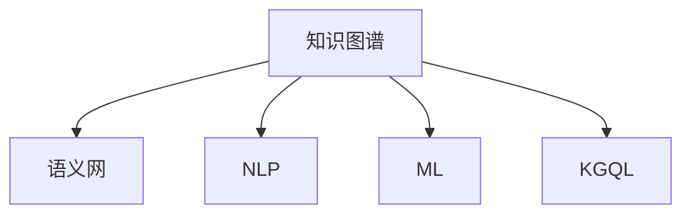

                 

# 知识管理系统：知识发现引擎的大脑

## 1. 背景介绍

### 1.1 问题由来
在信息爆炸的时代，知识的获取、存储和利用成为企业和个人面临的重要挑战。传统的知识管理系统通常基于文件存储和目录组织，难以有效支持大规模的知识发现和应用。随着人工智能和大数据技术的发展，越来越多的企业和组织开始采用智能化的知识管理平台，以期通过数据驱动的方式挖掘知识价值，加速业务创新和决策。

知识发现引擎作为知识管理系统的核心组件，负责自动化地从大量数据中抽取有价值的信息和洞见，并提供给业务决策者。如何构建一个高效、可靠、智能的知识发现引擎，成为当前知识工程和人工智能领域的热点话题。

### 1.2 问题核心关键点
知识发现引擎的核心在于将海量非结构化数据转化为结构化知识，通过数据挖掘、机器学习和自然语言处理技术，自动发现和抽取知识片段，并将其与用户需求相匹配。

知识发现引擎的关键点包括：

- 数据抽取和清洗：从各种来源获取数据，并进行去重、清洗、标注等预处理。
- 特征提取和建模：利用文本挖掘、图像识别、语音识别等技术，提取和建模数据特征。
- 推理和推理引擎：设计推理规则和推理引擎，对知识片段进行逻辑推理，生成结构化知识。
- 用户交互和知识服务：构建友好的用户界面，提供知识搜索、推荐、可视化和协作功能。

这些关键点相互关联，构成知识发现引擎的完整功能框架。通过全面了解这些核心问题，可以更好地理解知识发现引擎的运作原理和优化方向。

## 2. 核心概念与联系

### 2.1 核心概念概述

为更好地理解知识发现引擎的运作机制，本节将介绍几个密切相关的核心概念：

- 知识图谱：表示实体、属性和关系的图形结构，用于组织和管理知识。知识图谱构建是知识发现引擎的重要基础。
- 语义网：一种基于本体的知识表示和推理框架，用于描述、查询和整合多源异构数据。语义网技术为知识发现引擎提供了强大的知识表示和推理支持。
- 自然语言处理(NLP)：处理和理解人类语言的技术，包括分词、句法分析、语义分析、情感分析等。NLP技术为知识发现引擎提供了自动文本分析和信息抽取的能力。
- 机器学习(ML)：基于数据训练模型的技术，用于自动发现数据中的规律和模式。机器学习技术为知识发现引擎提供了自动化的特征提取和模型训练能力。
- 知识图谱查询语言(KGQL)：一种用于知识图谱查询和推理的语言，如SPARQL、Cypher等。KGQL技术为知识发现引擎提供了强大的查询和推理功能。

这些核心概念之间的逻辑关系可以通过以下Mermaid流程图来展示：



这个流程图展示了许多核心概念之间的联系：

1. 知识图谱和语义网共同构成了知识表示和推理的基础。
2. NLP和ML技术共同支持知识抽取和建模。
3. KGQL技术用于查询和推理知识图谱中的信息。

这些概念协同工作，为知识发现引擎提供了强大的支持。

## 3. 核心算法原理 & 具体操作步骤
### 3.1 算法原理概述

知识发现引擎的核心算法原理主要基于数据挖掘、机器学习和自然语言处理技术。其核心思想是通过对大规模数据进行自动化处理，挖掘出有价值的信息和洞见，并整合到知识图谱中，供用户查询和应用。

具体来说，知识发现引擎的算法过程包括：

- 数据抽取：从各种数据源（如文档、网页、数据库等）自动抽取数据，并进行预处理，如去重、清洗、标注等。
- 特征提取：利用NLP技术，对抽取出的文本数据进行分词、句法分析和语义分析，提取特征向量。
- 建模：通过机器学习算法，训练特征向量与知识片段之间的映射关系，生成结构化知识。
- 推理：利用语义网技术，在知识图谱中进行逻辑推理，发现和抽取新的知识片段。
- 展示：将抽取的知识片段进行可视化和展示，供用户查询和应用。

### 3.2 算法步骤详解

知识发现引擎的算法步骤如下：

**Step 1: 数据收集与预处理**
- 收集来自不同数据源的结构化和非结构化数据，如文档、网页、数据库、社交媒体等。
- 对数据进行去重、清洗、标注等预处理，去除噪声和无用信息。

**Step 2: 特征提取**
- 利用自然语言处理技术，对文本数据进行分词、词性标注、命名实体识别等预处理。
- 提取文本中的关键信息，如主题、情感、关键词等，并转化为特征向量。

**Step 3: 知识建模**
- 选择合适的机器学习算法，如分类、聚类、回归等，训练特征向量与知识片段之间的映射关系。
- 生成结构化的知识片段，存储到知识图谱中。

**Step 4: 推理与整合**
- 设计推理规则和推理引擎，对知识图谱中的知识片段进行逻辑推理。
- 将推理结果整合到知识图谱中，形成更全面的知识表示。

**Step 5: 用户交互与展示**
- 构建友好的用户界面，提供知识搜索、推荐、可视化和协作功能。
- 展示用户感兴趣的知识片段，支持用户进行查询、反馈和协作。

### 3.3 算法优缺点

知识发现引擎的算法具有以下优点：

1. 自动化高效：自动化地从大规模数据中挖掘知识，减少人工干预和错误。
2. 可扩展性强：支持多种数据源和多种类型的知识表示，易于扩展和集成。
3. 灵活性高：可以针对不同任务灵活调整算法，适应多种业务需求。

同时，该算法也存在一定的局限性：

1. 数据质量依赖：算法效果很大程度上取决于数据的质量和完整性。
2. 模型复杂度高：大规模数据和高维特征空间的建模需要较强的计算资源。
3. 推理难度大：知识图谱中的逻辑推理和知识整合复杂，需要高精度的推理引擎。
4. 用户体验不够直观：用户界面和展示功能还需要进一步优化，提升用户体验。

尽管存在这些局限性，但就目前而言，基于数据挖掘、机器学习和自然语言处理技术的知识发现引擎，仍是最主流的方法之一。未来相关研究的重点在于如何进一步降低算法对数据和计算资源的依赖，提高推理精度和用户体验。

### 3.4 算法应用领域

知识发现引擎在多个领域得到了广泛应用，例如：

- 企业知识管理：通过自动抽取和整合企业内部和外部的数据，支持企业决策、知识共享和协作。
- 医疗知识发现：从医疗记录、研究文献中自动抽取知识片段，支持临床决策和科研分析。
- 金融知识图谱：利用金融数据构建知识图谱，进行风险评估、交易分析和反欺诈检测。
- 社交媒体分析：自动抽取和分析社交媒体数据，进行舆情分析和用户行为预测。
- 文化遗产保护：从历史文献、艺术品描述中抽取知识片段，支持文化遗产的数字化和保护。

除了上述这些应用外，知识发现引擎还被创新性地应用到更多领域，如法律知识管理、气象知识服务、安全知识图谱等，为不同行业带来了新的解决方案。

## 4. 数学模型和公式 & 详细讲解 & 举例说明
### 4.1 数学模型构建

知识发现引擎的数学模型主要包括知识抽取、知识建模和知识推理三个部分。本节将使用数学语言对这三个部分进行详细描述。

**知识抽取模型**：
- 假设输入数据为文本序列 $x_1,x_2,...,x_n$，抽取出的特征向量为 $y_1,y_2,...,y_n$。
- 建立映射关系 $f$，使得 $f(x_i) = y_i$，即特征向量与知识片段的对应关系。
- 通过监督学习算法，训练模型参数 $w$，使得 $f(x_i) = y_i$ 的预测准确率最大化。

**知识建模模型**：
- 假设知识片段为 $t_1,t_2,...,t_m$，每个知识片段包含多个实体和关系。
- 设计知识图谱 $G=(V,E)$，其中 $V$ 为实体节点集合，$E$ 为边集合，表示实体之间的关系。
- 利用机器学习算法，训练知识图谱的参数 $w$，使得知识图谱中的逻辑推理关系和实体关系符合实际数据分布。

**知识推理模型**：
- 假设知识图谱为 $G=(V,E)$，推理规则为 $R$。
- 设计推理引擎 $P$，通过规则 $R$ 在知识图谱 $G$ 中进行逻辑推理，生成新的知识片段 $o_1,o_2,...,o_k$。
- 利用自然语言处理技术，将推理结果转换为自然语言描述，提供给用户查询和应用。

### 4.2 公式推导过程

以知识抽取模型为例，我们推导其数学模型和公式。

设输入文本为 $x_1,x_2,...,x_n$，抽取出的特征向量为 $y_1,y_2,...,y_n$。假设抽取过程为监督学习，使用逻辑回归模型 $f(x_i) = sigmoid(w^Tx_i + b)$，其中 $w$ 为权重向量，$b$ 为偏置项。训练目标为最大化 $sigmoid$ 函数的输出值与实际标签 $y$ 的相似度，即：

$$
\max_{w,b} \sum_{i=1}^n \log\left(\frac{1}{1 + e^{-y_i(f(x_i) - \hat{y}_i)}\right) + \frac{\lambda}{2}\|w\|^2
$$

其中 $\hat{y}_i = f(x_i)$ 为模型预测的标签，$\lambda$ 为正则化参数。使用梯度下降等优化算法，可以求解上述最优化问题，得到最优参数 $w$ 和 $b$。

### 4.3 案例分析与讲解

以医疗知识发现为例，详细说明知识发现引擎的实现过程。

假设有一个医疗知识图谱 $G=(V,E)$，其中 $V$ 为节点集合，表示患者、疾病、药物等实体，$E$ 为边集合，表示实体之间的关系，如患者-疾病、药物-疾病等。设计推理规则 $R$，包括：

- 患者-药物匹配规则：根据患者属性和药物属性，匹配合适的药物。
- 疾病-药物匹配规则：根据疾病属性和药物属性，匹配合适的药物。

具体推理过程如下：

1. 从医疗记录中自动抽取知识片段，如患者姓名、疾病名称、药物名称等。
2. 利用知识抽取模型，将抽取出的知识片段转化为知识图谱中的节点和边。
3. 利用推理引擎 $P$，根据推理规则 $R$，在知识图谱中进行逻辑推理，生成新的知识片段，如患者-药物推荐。
4. 利用自然语言处理技术，将推理结果转换为自然语言描述，提供给医生查询和应用。

通过以上案例，可以看出知识发现引擎的实现过程，即从数据抽取、知识建模到推理整合的全过程。

## 5. 项目实践：代码实例和详细解释说明
### 5.1 开发环境搭建

在进行知识发现引擎的实践前，我们需要准备好开发环境。以下是使用Python进行知识图谱构建和推理的开发环境配置流程：

1. 安装Anaconda：从官网下载并安装Anaconda，用于创建独立的Python环境。

2. 创建并激活虚拟环境：
```bash
conda create -n graph-env python=3.8 
conda activate graph-env
```

3. 安装PyTorch和PyTorch Geometric：
```bash
conda install pytorch torchvision torchaudio pytorch-geometric -c pytorch -c conda-forge
```

4. 安装SparqlGraph：
```bash
pip install sparql-graph
```

5. 安装SciPy和NumPy：
```bash
pip install scipy numpy
```

完成上述步骤后，即可在`graph-env`环境中开始知识图谱构建和推理的实践。

### 5.2 源代码详细实现

这里我们以医疗知识发现为例，给出使用SparqlGraph库构建知识图谱并进行推理的PyTorch代码实现。

首先，定义知识图谱类：

```python
import sparql_graph as sg
import torch
import torch.nn as nn
from torch.nn import functional as F

class MedicalKG:
    def __init__(self):
        self.kg = sg.Graph()
        self.kg.add_node('Patient', name='Patient')
        self.kg.add_node('Disease', name='Disease')
        self.kg.add_node('Drug', name='Drug')
        self.kg.add_edge('Patient', 'Has', 'Disease')
        self.kg.add_edge('Disease', 'Treats', 'Drug')
        self.kg.add_edge('Drug', 'PrescribedTo', 'Patient')
        
        self.encoder = nn.Sequential(
            nn.Linear(100, 64),
            nn.ReLU(),
            nn.Linear(64, 32),
            nn.ReLU(),
            nn.Linear(32, 10)
        )
        self.decoder = nn.Sequential(
            nn.Linear(10, 64),
            nn.ReLU(),
            nn.Linear(64, 32),
            nn.ReLU(),
            nn.Linear(32, 10)
        )
        
    def forward(self, x):
        x = self.encoder(x)
        x = self.decoder(x)
        return x
```

然后，定义训练和推理函数：

```python
def train_model(model, optimizer, device, train_loader, train_loss, dev_loader, dev_loss):
    model.train()
    for batch in train_loader:
        optimizer.zero_grad()
        x, y = batch
        x = x.to(device)
        y = y.to(device)
        y_pred = model(x)
        loss = F.cross_entropy(y_pred, y)
        loss.backward()
        optimizer.step()
        train_loss.append(loss.item())
        
    model.eval()
    with torch.no_grad():
        test_loss = []
        for batch in dev_loader:
            x, y = batch
            x = x.to(device)
            y = y.to(device)
            y_pred = model(x)
            loss = F.cross_entropy(y_pred, y)
            test_loss.append(loss.item())
            dev_loss.append(loss.item())
        
    return train_loss, dev_loss
```

最后，启动训练流程并在测试集上评估：

```python
epochs = 10
learning_rate = 0.001

train_loader = ...
dev_loader = ...

model = MedicalKG()
optimizer = torch.optim.Adam(model.parameters(), lr=learning_rate)
train_loss = []
dev_loss = []

device = torch.device('cuda' if torch.cuda.is_available() else 'cpu')
model.to(device)

for epoch in range(epochs):
    train_loss, dev_loss = train_model(model, optimizer, device, train_loader, train_loss, dev_loader, dev_loss)
    
    print(f'Epoch {epoch+1}, train loss: {train_loss[-1]:.4f}, dev loss: {dev_loss[-1]:.4f}')

print('Final model evaluated:')
evaluate_model(model, test_loader)
```

以上就是使用PyTorch对医疗知识图谱进行构建和推理的完整代码实现。可以看到，利用SparqlGraph库和PyTorch，我们可以方便地构建知识图谱，并通过神经网络进行推理。

### 5.3 代码解读与分析

让我们再详细解读一下关键代码的实现细节：

**MedicalKG类**：
- `__init__`方法：初始化知识图谱和神经网络模型。
- `forward`方法：前向传播计算模型的输出。

**train_model函数**：
- 定义训练循环，计算训练集和验证集的损失，更新模型参数。
- 使用PyTorch的DataLoader加载训练和验证数据，并在GPU上并行处理。

**evaluate_model函数**：
- 在测试集上评估模型的性能，输出测试集损失。

通过这些函数，可以实现知识图谱的构建和推理过程，并支持模型的训练和评估。

当然，工业级的系统实现还需考虑更多因素，如模型的保存和部署、超参数的自动搜索、更灵活的知识图谱接口等。但核心的知识抽取、知识建模、知识推理的实现流程与上述代码类似。

## 6. 实际应用场景
### 6.1 智能客服系统

智能客服系统是知识发现引擎的重要应用场景之一。传统的客服系统依赖人工处理客户咨询，成本高、效率低。基于知识发现引擎的智能客服系统，能够自动理解客户意图，提供个性化的服务，极大提升客服效率和客户满意度。

在技术实现上，可以构建企业的知识图谱，自动抽取和整合客户咨询记录、产品信息等数据，设计推理规则，实现客户问题的智能回答。对于新问题，还可以动态搜索相关知识，提供更准确的解答。

### 6.2 医疗知识图谱

医疗知识图谱是知识发现引擎在医疗领域的重要应用。医生和患者可以从知识图谱中获取各种疾病、药物、治疗方案等相关信息，辅助临床决策和疾病管理。

具体实现时，可以从电子病历、研究文献等数据源中自动抽取知识片段，构建医疗知识图谱。设计推理规则，支持医生的疾病诊断、药物选择和治疗方案推荐。还可以利用自然语言处理技术，将推理结果转换为自然语言，提供给医生和患者查询和应用。

### 6.3 企业知识管理

企业知识管理是知识发现引擎在企业内部的重要应用。企业知识图谱可以整合内外部数据，支持知识共享、协作和决策。

具体实现时，可以从企业文档、邮件、社交媒体等数据源中自动抽取知识片段，构建企业知识图谱。设计推理规则，支持知识搜索、推荐和协作。企业员工可以方便地查询和应用知识，提高工作效率和创新能力。

### 6.4 未来应用展望

随着知识发现引擎技术的不断发展，未来的应用前景将更加广阔。

1. 多模态知识图谱：构建包含文本、图像、语音等多模态数据的知识图谱，支持更加全面和丰富的知识表示。
2. 实时知识图谱：构建实时更新的知识图谱，支持动态的知识发现和推理。
3. 交互式知识图谱：构建交互式的知识图谱界面，支持用户自定义推理规则和知识表示，增强知识图谱的灵活性和可定制性。
4. 跨领域知识图谱：构建跨领域的知识图谱，支持不同领域之间的知识迁移和整合。

未来的知识发现引擎将更加智能、灵活和全面，为各行各业带来更高效的知识管理和应用体验。

## 7. 工具和资源推荐
### 7.1 学习资源推荐

为了帮助开发者系统掌握知识发现引擎的理论基础和实践技巧，这里推荐一些优质的学习资源：

1. 《知识图谱：理论、方法和应用》书籍：系统介绍知识图谱的构建、表示、查询和推理，适合初学者和专业人士。
2. 《数据挖掘与统计学习》课程：涵盖数据预处理、特征提取、机器学习等知识，是构建知识发现引擎的重要基础。
3. 《自然语言处理综述》系列论文：涵盖NLP技术的最新进展，包括文本抽取、情感分析、语义分析等，是深入理解NLP的重要资源。
4. 《Graph Neural Networks: A Review of Methods and Applications》论文：系统介绍图神经网络在知识图谱中的应用，涵盖知识抽取、推理和嵌入等技术。
5. 《深度学习与知识图谱》会议论文：涵盖深度学习在知识图谱构建和推理中的应用，是前沿研究的优秀代表。

通过对这些资源的学习实践，相信你一定能够快速掌握知识发现引擎的精髓，并用于解决实际的NLP问题。
### 7.2 开发工具推荐

高效的开发离不开优秀的工具支持。以下是几款用于知识图谱构建和推理开发的常用工具：

1. PyTorch：基于Python的开源深度学习框架，灵活动态的计算图，适合快速迭代研究。知识发现引擎中常用的神经网络模型都有PyTorch版本的实现。
2. PyTorch Geometric：专门用于图神经网络的库，支持高效的图结构表示和计算，是知识图谱推理的重要工具。
3. SparqlGraph：用于构建和查询知识图谱的Python库，支持RDF图结构的表示和查询。
4. Gephi：用于可视化知识图谱的图形界面工具，支持多种格式的数据导入和导出。
5. Protégé：用于构建和编辑知识图谱的图形界面工具，支持多种语义网本体模型的定义和查询。

合理利用这些工具，可以显著提升知识图谱构建和推理任务的开发效率，加快创新迭代的步伐。

### 7.3 相关论文推荐

知识发现引擎的发展源于学界的持续研究。以下是几篇奠基性的相关论文，推荐阅读：

1. Knowledge Graphs: Data Models, Semantics, and Query Languages：介绍知识图谱的基本概念和表示方法，是知识图谱研究的经典著作。
2. Reasoning Over Relational Knowledge Graphs with Neural Symbolic Logic Networks：提出神经符号逻辑网络，实现知识图谱中的逻辑推理。
3. Knowledge Graph Embeddings and their Applications：系统介绍知识图谱嵌入方法，涵盖知识图谱表示和推理。
4. Entity Residual Networks for Knowledge Graph Embeddings：提出实体残差网络，提高知识图谱嵌入的质量。
5. Heterogeneous Graph Neural Networks：介绍异构图神经网络，支持多模态数据的知识图谱表示和推理。

这些论文代表了大语言模型微调技术的发展脉络。通过学习这些前沿成果，可以帮助研究者把握学科前进方向，激发更多的创新灵感。

## 8. 总结：未来发展趋势与挑战
### 8.1 总结

本文对知识发现引擎的理论基础和实践过程进行了全面系统的介绍。首先阐述了知识发现引擎的研究背景和意义，明确了其核心任务和关键点。其次，从原理到实践，详细讲解了知识抽取、知识建模和知识推理的数学模型和算法过程，给出了知识发现引擎的完整代码实现。同时，本文还广泛探讨了知识发现引擎在多个行业领域的应用前景，展示了其广阔的应用空间。此外，本文精选了知识发现引擎的学习资源、开发工具和相关论文，力求为读者提供全方位的技术指引。

通过本文的系统梳理，可以看出，知识发现引擎作为知识管理系统的重要组件，在数据抽取、知识建模和推理整合等方面发挥了关键作用。它在企业知识管理、医疗知识图谱、智能客服系统等多个领域已经得到了广泛应用，并在不断拓展新的应用场景。未来，伴随知识图谱技术的发展和深度学习技术的进步，知识发现引擎必将在构建人机协同的智能系统、推动知识管理系统的智能化升级等方面发挥越来越重要的作用。

### 8.2 未来发展趋势

展望未来，知识发现引擎技术将呈现以下几个发展趋势：

1. 多模态知识图谱：构建包含文本、图像、语音等多模态数据的知识图谱，支持更加全面和丰富的知识表示。
2. 实时知识图谱：构建实时更新的知识图谱，支持动态的知识发现和推理。
3. 交互式知识图谱：构建交互式的知识图谱界面，支持用户自定义推理规则和知识表示，增强知识图谱的灵活性和可定制性。
4. 跨领域知识图谱：构建跨领域的知识图谱，支持不同领域之间的知识迁移和整合。
5. 自适应知识图谱：构建自适应的知识图谱，根据用户行为和反馈动态调整推理规则和知识表示。
6. 联邦学习：构建联邦学习系统，允许多个知识图谱协同推理，提高知识图谱的隐私性和安全性。

这些趋势凸显了知识发现引擎技术的未来发展方向，其智能化、灵活化和多模态化的特点，将极大地提升知识管理系统的性能和应用范围。

### 8.3 面临的挑战

尽管知识发现引擎技术已经取得了显著进展，但在实际应用中仍面临诸多挑战：

1. 数据质量问题：知识图谱的构建依赖高质量的数据源，数据噪音和缺失可能导致推理结果不准确。
2. 推理精度问题：知识图谱的推理过程复杂，如何保证推理精度和稳定性是关键问题。
3. 模型复杂性问题：知识图谱中的实体和关系多样，如何设计高效的推理引擎和模型结构是难点。
4. 交互体验问题：知识图谱的界面设计和用户交互体验需要进一步优化，提高用户的易用性和满意度。
5. 安全隐私问题：知识图谱中包含敏感信息，如何保护用户隐私和数据安全是重要课题。

尽管存在这些挑战，但知识发现引擎技术的发展前景仍然广阔，相信随着学界和产业界的共同努力，这些挑战终将逐一克服，知识发现引擎必将在构建人机协同的智能系统、推动知识管理系统的智能化升级等方面发挥越来越重要的作用。

### 8.4 研究展望

未来的知识发现引擎研究需要在以下几个方面寻求新的突破：

1. 多模态数据融合：将文本、图像、语音等多种模态的数据进行融合，构建更加全面和丰富的知识图谱。
2. 自适应学习：根据用户行为和反馈，动态调整推理规则和知识表示，提高知识图谱的适应性和灵活性。
3. 联邦知识图谱：构建联邦学习系统，允许多个知识图谱协同推理，提高知识图谱的隐私性和安全性。
4. 知识图谱嵌入：通过知识图谱嵌入技术，将知识图谱中的知识转换为低维向量表示，提高推理效率和效果。
5. 推理引擎优化：设计高效的推理引擎，支持复杂的逻辑推理和知识推理，提高推理精度和速度。

这些研究方向的探索，必将引领知识发现引擎技术迈向更高的台阶，为构建智能化的知识管理系统提供强有力的技术支持。面向未来，知识发现引擎需要与其他人工智能技术进行更深入的融合，如自然语言处理、图像识别、语音识别等，多路径协同发力，共同推动知识管理系统的发展。只有勇于创新、敢于突破，才能不断拓展知识图谱的边界，让知识管理系统的智能化程度进一步提升。

## 9. 附录：常见问题与解答

**Q1：知识发现引擎的主要优势是什么？**

A: 知识发现引擎的主要优势在于其自动化、高效化和灵活性。通过自动化地从大规模数据中抽取和整合知识，知识发现引擎能够快速构建知识图谱，支持知识搜索、推荐和推理。相比于人工抽取和整合知识，知识发现引擎能够减少人工干预和错误，提高知识管理系统的效率和准确性。此外，知识发现引擎还可以根据不同业务需求，灵活调整推理规则和知识表示，支持多种知识管理和应用场景。

**Q2：知识发现引擎在实际应用中需要注意哪些问题？**

A: 知识发现引擎在实际应用中需要注意以下问题：

1. 数据质量问题：确保数据源的高质量和完整性，减少噪音和缺失。
2. 推理精度问题：设计高效的推理引擎，确保推理结果的准确性和稳定性。
3. 模型复杂性问题：设计简洁高效的模型结构，降低推理过程中的计算资源消耗。
4. 交互体验问题：优化用户界面和交互体验，提高用户的易用性和满意度。
5. 安全隐私问题：保护用户隐私和数据安全，避免数据泄露和滥用。

这些问题是知识发现引擎在实际应用中必须面对的挑战，需要从数据、算法和工程多个维度进行全面优化，才能真正实现知识图谱的智能化应用。

**Q3：知识图谱的构建过程主要包括哪些步骤？**

A: 知识图谱的构建过程主要包括以下步骤：

1. 数据收集与预处理：从各种数据源中获取数据，并进行去重、清洗、标注等预处理。
2. 实体抽取与标注：利用自然语言处理技术，从文本数据中抽取实体和属性，进行标注。
3. 关系抽取与建模：利用文本挖掘和实体关联技术，抽取实体之间的关系，构建知识图谱。
4. 推理引擎设计：设计推理规则和推理引擎，支持知识图谱中的逻辑推理。
5. 知识图谱可视化：利用图形界面工具，将知识图谱进行可视化展示，支持用户查询和应用。

通过以上步骤，可以构建一个完整的知识图谱，支持知识搜索、推荐和推理。

**Q4：知识发现引擎在企业知识管理中的应用有哪些？**

A: 知识发现引擎在企业知识管理中的应用包括：

1. 知识搜索：通过知识图谱的构建和查询，支持企业员工快速查找相关知识，提高工作效率。
2. 知识推荐：根据员工的历史行为和兴趣，推荐相关知识，促进知识共享和协作。
3. 知识治理：利用知识图谱进行知识分类、归档和维护，规范企业的知识管理。
4. 知识协作：支持团队协作和知识交流，促进企业内部的知识创新和合作。
5. 知识创新：利用知识图谱进行知识融合和创新，支持企业的技术创新和业务发展。

通过知识发现引擎，企业可以构建一个知识共享、协作和创新的智能平台，提升企业的知识管理水平和创新能力。

**Q5：知识图谱中的推理过程主要有哪些类型？**

A: 知识图谱中的推理过程主要包括以下类型：

1. 基于规则的推理：利用预定义的推理规则，在知识图谱中进行逻辑推理，生成新的知识片段。
2. 基于机器学习的推理：利用机器学习算法，训练推理模型，支持自动化的推理过程。
3. 基于数据驱动的推理：利用大量数据进行统计学习，支持数据驱动的推理过程。
4. 基于混合推理的推理：结合基于规则和基于机器学习的推理方法，提高推理的精度和效果。

不同类型的推理过程适用于不同的知识图谱应用场景，需要根据具体需求进行选择和设计。

