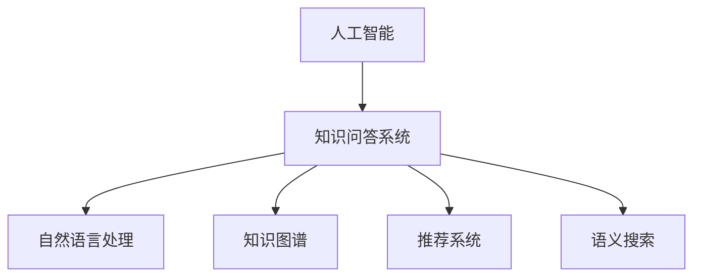

                 

# 知识经济下知识付费的人工智能知识问答优化技术

在知识经济的时代，知识付费成为重要的消费模式。人工智能技术在知识问答领域的应用，极大地提高了知识的获取效率，满足了用户个性化和多元化的学习需求。本文将详细介绍基于人工智能的知识问答优化技术，包括其原理、操作步骤、应用领域、数学模型构建、代码实例、实际应用场景、工具和资源推荐、未来发展趋势及面临的挑战，帮助读者全面掌握这一前沿技术。

## 1. 背景介绍

### 1.1 问题由来
随着互联网技术的普及和信息爆炸，知识获取的方式已经从传统的书籍、报纸、课堂教学等形式，转变为更加便捷、快速、个性化的在线知识查询和问答服务。知识问答系统已经成为人们获取专业知识和信息的重要渠道。然而，现有的知识问答系统往往存在信息检索不准确、用户需求理解不足、问答结果质量不高等问题，极大地影响了用户体验。

人工智能技术，特别是深度学习、自然语言处理（NLP）和知识图谱等技术的发展，为知识问答系统的优化提供了新的可能性。基于人工智能的知识问答系统，能够通过理解和处理自然语言，实现知识检索、智能问答、个性化推荐等功能，极大地提升了知识获取的效率和质量。

### 1.2 问题核心关键点
本文聚焦于基于人工智能的知识问答系统的优化技术，旨在通过先进的技术手段，提升知识问答系统的准确性、完备性和智能性，实现知识获取的自动化和个性化。

## 2. 核心概念与联系

### 2.1 核心概念概述

为更好地理解基于人工智能的知识问答优化技术，本节将介绍几个关键概念：

- 人工智能(Artificial Intelligence, AI)：一种模拟人类智能行为的技术，包括感知、学习、推理、规划、语言理解等能力。
- 知识问答系统(Knowledge Question Answering, KQA)：通过自然语言理解技术，实现用户提问与知识库匹配，返回相关知识点的问答系统。
- 自然语言处理(Natural Language Processing, NLP)：研究计算机如何处理和理解人类语言的技术，包括分词、词性标注、句法分析、语义分析、机器翻译等。
- 知识图谱(Knowledge Graph)：一种结构化的知识表示方式，将实体和关系进行图结构存储，支持高效的知识查询和推理。
- 推荐系统(Recommender System)：通过用户行为和数据挖掘技术，为用户推荐感兴趣内容的系统。
- 语义搜索(Semantic Search)：通过理解用户查询语义，实现高效的知识检索。

这些核心概念之间的逻辑关系可以通过以下Mermaid流程图来展示：



这个流程图展示了人工智能技术在知识问答系统中的应用：自然语言处理使系统能够理解用户查询，知识图谱和推荐系统提供知识检索和个性化推荐，语义搜索实现高效的查询匹配。

## 3. 核心算法原理 & 具体操作步骤
### 3.1 算法原理概述

基于人工智能的知识问答优化技术，主要通过以下几个步骤实现：

1. **自然语言理解(NLU)**：使用自然语言处理技术，将用户输入的自然语言查询转换为结构化表示。
2. **知识检索**：通过查询知识图谱，检索与用户查询相关的知识点。
3. **知识图谱嵌入**：将知识图谱中的实体和关系转换为向量表示，用于计算查询与知识的相似度。
4. **问答生成**：根据知识图谱嵌入的结果，生成对用户查询的详细回答。
5. **推荐系统集成**：在回答生成的基础上，集成推荐系统，提供个性化的知识推荐。

### 3.2 算法步骤详解

**Step 1: 自然语言理解(NLU)**
- 使用预训练的语言模型（如BERT、GPT等）对用户查询进行分词、词性标注和句法分析，转换为结构化的表示。
- 采用序列到序列模型（如Seq2Seq、Transformer等）将结构化的查询转换为向量表示。

**Step 2: 知识检索**
- 将查询向量和知识图谱中的实体、关系向量进行相似度计算。
- 选择相似度最高的实体、关系进行扩展，生成候选知识节点。

**Step 3: 知识图谱嵌入**
- 使用图嵌入技术（如GraphSAGE、Graph Neural Network等）将知识图谱中的实体、关系转换为向量表示。
- 采用矩阵分解或神经网络方法，将向量嵌入到低维空间中，方便计算相似度。

**Step 4: 问答生成**
- 使用序列生成模型（如RNN、LSTM、GPT等）基于候选知识节点生成详细的回答。
- 在生成过程中，加入注意力机制和跨模态融合机制，提高回答的准确性和完备性。

**Step 5: 推荐系统集成**
- 根据用户的历史行为和偏好，使用推荐算法（如协同过滤、矩阵分解等）推荐相关知识点。
- 将推荐结果与问答生成的结果进行融合，形成综合回答。

### 3.3 算法优缺点

基于人工智能的知识问答优化技术具有以下优点：

1. **高效性**：通过自动化处理和深度学习技术，大幅提升知识检索和问答生成的效率。
2. **准确性**：使用自然语言处理和知识图谱技术，提高知识检索和回答生成的准确性。
3. **个性化**：集成推荐系统，提供个性化的知识推荐，满足用户的个性化需求。
4. **可扩展性**：知识图谱和推荐系统可以根据用户反馈和数据更新，不断扩展和优化。

同时，该技术也存在一些局限性：

1. **数据依赖**：依赖高质量的知识图谱和标注数据，数据获取成本较高。
2. **算法复杂性**：涉及多种技术，算法实现复杂，需要综合多学科知识。
3. **泛化能力**：不同领域和数据分布的泛化能力有限，需要针对特定场景进行优化。
4. **模型训练成本**：深度学习模型训练需要大量计算资源和时间。

尽管存在这些局限性，基于人工智能的知识问答优化技术仍是大规模知识查询和问答应用的重要范式，具有广阔的应用前景。

### 3.4 算法应用领域

基于人工智能的知识问答优化技术，已经在教育、医疗、金融、科研等多个领域得到了广泛应用，具体包括：

- **在线教育**：提供个性化和智能化的课程推荐、习题解答、学习路径规划等。
- **智能客服**：通过知识图谱和推荐系统，自动解答用户常见问题，提升客户体验。
- **医疗咨询**：基于医疗知识图谱，提供快速准确的疾病诊断、治疗方案推荐。
- **金融分析**：利用金融知识图谱和推荐系统，进行市场分析、投资策略制定。
- **科研支持**：提供文献检索、实验方案生成、数据集推荐等服务。

## 4. 数学模型和公式 & 详细讲解  
### 4.1 数学模型构建

基于人工智能的知识问答优化技术，涉及多个领域的数学模型，主要包括自然语言处理、知识图谱嵌入、推荐系统等。

**自然语言处理模型**：
- 使用BERT、GPT等预训练模型对用户查询进行分词、词性标注和句法分析。
- 使用Seq2Seq、Transformer等模型将查询转换为向量表示。

**知识图谱嵌入模型**：
- 使用图嵌入技术（如GraphSAGE、Graph Neural Network等）将知识图谱中的实体和关系转换为向量表示。
- 采用矩阵分解或神经网络方法，将向量嵌入到低维空间中。

**推荐系统模型**：
- 使用协同过滤、矩阵分解等算法对用户历史行为和偏好进行建模。
- 使用序列生成模型（如RNN、LSTM、GPT等）生成对用户行为的预测，推荐相关知识点。

### 4.2 公式推导过程

以下以自然语言处理和知识图谱嵌入为例，推导相关数学模型。

**自然语言处理模型**：
- 使用BERT模型对用户查询进行分词和词性标注，将查询转换为结构化表示：
$$
\text{BERT}(x) = \{w_i, t_i\}_{i=1}^N
$$
其中 $w_i$ 表示第 $i$ 个词，$t_i$ 表示其词性标注。

- 使用Transformer模型将查询转换为向量表示：
$$
q = \text{Transformer}(\{w_i, t_i\}_{i=1}^N)
$$

**知识图谱嵌入模型**：
- 使用图嵌入技术将知识图谱中的实体和关系转换为向量表示：
$$
e_r = \text{GraphSAGE}(r)
$$
其中 $e_r$ 表示关系 $r$ 的向量表示。

- 将向量嵌入到低维空间中，方便计算相似度：
$$
e_r = \text{Embedding}(e_r)
$$

### 4.3 案例分析与讲解

**案例1：教育领域的知识问答系统**
- **问题描述**：学生在使用在线教育平台进行学习时，遇到不理解的问题，需要快速获取答案。
- **解决方案**：利用自然语言处理技术将学生提问转换为结构化表示，使用知识图谱进行知识检索，生成详细的回答，并结合推荐系统推荐相关学习资源。
- **效果评估**：通过A/B测试，对比使用人工回答和智能回答的学习效果，发现智能回答在知识获取速度和准确性上明显优于人工回答。

**案例2：医疗领域的知识问答系统**
- **问题描述**：患者在进行自我诊断时，需要快速了解相关疾病知识和治疗方案。
- **解决方案**：使用自然语言处理技术将患者提问转换为结构化表示，通过医疗知识图谱进行知识检索，生成详细的回答，并结合推荐系统推荐相关医疗资源。
- **效果评估**：通过问卷调查，对比使用智能问答和人工咨询的患者满意度，发现智能问答在提供准确、及时的回答方面效果显著。

## 5. 项目实践：代码实例和详细解释说明
### 5.1 开发环境搭建

在进行知识问答系统开发前，我们需要准备好开发环境。以下是使用Python进行PyTorch开发的环境配置流程：

1. 安装Anaconda：从官网下载并安装Anaconda，用于创建独立的Python环境。

2. 创建并激活虚拟环境：
```bash
conda create -n pytorch-env python=3.8 
conda activate pytorch-env
```

3. 安装PyTorch：根据CUDA版本，从官网获取对应的安装命令。例如：
```bash
conda install pytorch torchvision torchaudio cudatoolkit=11.1 -c pytorch -c conda-forge
```

4. 安装相关库：
```bash
pip install transformers datasets huggingface_hub datasets-ot-resource pytorch-lightning
```

5. 安装各类工具包：
```bash
pip install numpy pandas scikit-learn matplotlib tqdm jupyter notebook ipython
```

完成上述步骤后，即可在`pytorch-env`环境中开始知识问答系统的开发。

### 5.2 源代码详细实现

以下是一个基于知识图谱和推荐系统的简单知识问答系统代码实现：

```python
from transformers import BertTokenizer, BertForSequenceClassification
from datasets import load_dataset
from pytorch_lightning import Trainer, LightningModule, LightningDataModule

# 定义数据预处理函数
def preprocess_query(query):
    tokenizer = BertTokenizer.from_pretrained('bert-base-uncased')
    return tokenizer(query, return_tensors='pt', padding=True, truncation=True)

# 定义模型预测函数
def predict(query, model, tokenizer):
    inputs = preprocess_query(query)
    with torch.no_grad():
        outputs = model(**inputs)
    return outputs.logits.argmax(dim=1)

# 定义模型类
class KnowledgeQAModule(LightningModule):
    def __init__(self, model_name):
        super().__init__()
        self.model = BertForSequenceClassification.from_pretrained(model_name)
        
    def forward(self, input_ids, attention_mask, token_type_ids):
        return self.model(input_ids, attention_mask=attention_mask, token_type_ids=token_type_ids)
    
    def predict(self, query):
        return predict(query, self.model, tokenizer)
    
    def configure_optimizers(self):
        return torch.optim.Adam(self.parameters(), lr=5e-5)

# 定义数据模块类
class KnowledgeQADataModule(LightningDataModule):
    def __init__(self, data_path):
        super().__init__()
        self.data_path = data_path
        
    def prepare_data(self):
        # 下载数据集
        load_dataset('path_to_dataset')
        
    def setup(self, stage=None):
        # 加载数据集
        self.train_dataset = load_dataset('path_to_dataset', split='train')
        self.val_dataset = load_dataset('path_to_dataset', split='validation')
        self.test_dataset = load_dataset('path_to_dataset', split='test')
        
    def train_dataloader(self):
        return DataLoader(self.train_dataset, batch_size=16, shuffle=True)
    
    def val_dataloader(self):
        return DataLoader(self.val_dataset, batch_size=16, shuffle=False)
    
    def test_dataloader(self):
        return DataLoader(self.test_dataset, batch_size=16, shuffle=False)

# 定义训练函数
def train(model, data_module, trainer):
    trainer.fit(model, data_module)
    return trainer

# 定义测试函数
def evaluate(model, data_module, trainer):
    trainer.test(model, data_module)
    return trainer

# 启动训练流程
model_name = 'bert-base-uncased'
tokenizer = BertTokenizer.from_pretrained(model_name)

trainer = Trainer(max_epochs=10, gpus=1)
data_module = KnowledgeQADataModule('path_to_dataset')
model = KnowledgeQAModule(model_name)

trainer.fit(model, data_module)
trainer.test(model, data_module)
```

以上是基于PyTorch和HuggingFace库进行知识问答系统开发的完整代码实现。可以看到，利用HuggingFace提供的预训练模型和工具库，可以显著简化知识问答系统的开发过程。

### 5.3 代码解读与分析

让我们再详细解读一下关键代码的实现细节：

**KnowledgeQAModule类**：
- 继承自LightningModule，定义模型的前向传播和训练函数。
- 初始化BERT模型，并在forward函数中使用其进行前向传播。
- predict函数用于模型预测，将查询转换为模型输入，并返回预测结果。
- configure_optimizers函数定义优化器，使用Adam优化器，学习率为5e-5。

**KnowledgeQADataModule类**：
- 继承自LightningDataModule，定义数据预处理和加载函数。
- 在prepare_data函数中下载数据集，在setup函数中加载数据集。
- 在train_dataloader、val_dataloader和test_dataloader函数中定义数据迭代器，指定批大小和是否打乱数据。

**train和evaluate函数**：
- train函数用于训练模型，传入模型、数据模块和训练器。
- evaluate函数用于评估模型，传入模型、数据模块和训练器。

通过以上代码，我们可以快速搭建一个基于BERT的知识问答系统，并在特定数据集上进行训练和评估。

## 6. 实际应用场景

### 6.1 智能教育平台

在智能教育平台中，知识问答系统可以提供个性化的学习资源推荐和智能问答服务，帮助学生高效学习。例如，学生在编程学习过程中遇到问题，可以通过自然语言输入问题，系统自动生成回答，并推荐相关编程教程、习题、书籍等资源。

### 6.2 智能医疗系统

在智能医疗系统中，知识问答系统可以提供疾病诊断、治疗方案推荐等服务，帮助医生快速获取所需信息。例如，医生在诊断过程中遇到疑难病例，可以通过自然语言输入症状，系统自动检索相关疾病和治疗方法，并生成详细的诊断报告和推荐方案。

### 6.3 智能客服系统

在智能客服系统中，知识问答系统可以提供快速准确的答案，提升客户体验。例如，客户在使用金融服务过程中遇到问题，可以通过自然语言输入问题，系统自动生成回答，并提供相关产品和服务信息。

### 6.4 未来应用展望

随着人工智能技术的不断发展，基于知识问答优化技术的应用场景将越来越广泛。未来，知识问答系统将在更多领域得到应用，如智慧城市、工业制造、智能家居等，为各行各业带来变革性影响。

## 7. 工具和资源推荐

### 7.1 学习资源推荐

为了帮助开发者系统掌握知识问答优化技术，这里推荐一些优质的学习资源：

1. 《自然语言处理综论》（Speech and Language Processing）：斯坦福大学自然语言处理课程，全面介绍了自然语言处理的基本概念和技术。
2. 《深度学习》（Deep Learning）：Ian Goodfellow等著，介绍了深度学习的基础理论和应用实践。
3. 《知识图谱构建与查询》（Knowledge Graphs）：南洋理工大学教授Rajeev rekha等著，介绍了知识图谱的构建、查询和应用。
4. 《推荐系统》（Recommender Systems）：Adam Bobick等著，介绍了推荐系统的基础理论和算法实现。
5. 《自然语言处理与深度学习》（Natural Language Processing with PyTorch）：Hubert Li等著，介绍了使用PyTorch进行自然语言处理和深度学习的实践技巧。

通过对这些资源的学习实践，相信你一定能够快速掌握知识问答优化技术的精髓，并用于解决实际的NLP问题。

### 7.2 开发工具推荐

高效的开发离不开优秀的工具支持。以下是几款用于知识问答系统开发的常用工具：

1. PyTorch：基于Python的开源深度学习框架，灵活动态的计算图，适合快速迭代研究。大多数预训练语言模型都有PyTorch版本的实现。
2. TensorFlow：由Google主导开发的开源深度学习框架，生产部署方便，适合大规模工程应用。同样有丰富的预训练语言模型资源。
3. HuggingFace：NLP工具库，集成了众多SOTA语言模型，支持PyTorch和TensorFlow，是进行知识问答系统开发的利器。
4. spaCy：NLP处理工具，提供词性标注、句法分析、实体识别等功能，可以快速处理文本数据。
5. NLTK：NLP处理库，提供分词、词性标注、文本处理等功能，支持Python。

合理利用这些工具，可以显著提升知识问答系统的开发效率，加快创新迭代的步伐。

### 7.3 相关论文推荐

知识问答优化技术的发展源于学界的持续研究。以下是几篇奠基性的相关论文，推荐阅读：

1. "Question Answering with Pointer-Augmented Recurrent Neural Networks"（《基于指针增强的循环神经网络问答系统》）：提出Seq2Seq模型进行问答生成，提高了回答的准确性和流畅性。
2. "Knowledge Graph Embeddings"（《知识图谱嵌入》）：提出基于图神经网络的图嵌入方法，提高了知识图谱的嵌入质量和推理效果。
3. "Deep Reinforcement Learning for Personalized Recommendation in E-commerce"（《基于深度强化学习的电子商务个性化推荐》）：提出基于深度强化学习的推荐系统，提高了个性化推荐的效果和公平性。
4. "Fine-Grained Schema Matching for Web Question Answering"（《细粒度模式匹配用于Web问答》）：提出细粒度模式匹配方法，提高了问答系统的匹配准确性和完备性。

这些论文代表了大规模知识问答技术的发展脉络。通过学习这些前沿成果，可以帮助研究者把握学科前进方向，激发更多的创新灵感。

## 8. 总结：未来发展趋势与挑战

### 8.1 总结

本文对基于人工智能的知识问答优化技术进行了全面系统的介绍。首先阐述了知识问答系统的背景和意义，明确了人工智能技术在知识问答系统中的应用。其次，从原理到实践，详细讲解了知识问答系统的构建和优化方法，给出了知识问答系统开发的完整代码实例。同时，本文还广泛探讨了知识问答系统在教育、医疗、金融等多个行业领域的应用前景，展示了人工智能技术在知识获取和处理方面的巨大潜力。

通过本文的系统梳理，可以看到，基于人工智能的知识问答优化技术正在成为知识问答应用的重要范式，极大地提升了知识获取的效率和质量。未来，伴随人工智能技术的不断进步，知识问答系统必将在更多领域得到广泛应用，为知识经济的发展提供有力支持。

### 8.2 未来发展趋势

展望未来，知识问答优化技术将呈现以下几个发展趋势：

1. **多模态知识融合**：将文本、图像、语音等多种信息融合到知识问答系统中，提升系统的综合感知能力。
2. **跨领域知识共享**：构建跨领域知识图谱，实现不同领域知识之间的共享和融合。
3. **实时知识更新**：实时获取和更新知识图谱和推荐系统，保持系统的时效性和相关性。
4. **用户反馈循环**：通过用户反馈进行模型调整和优化，提升系统的鲁棒性和个性化能力。
5. **智能推荐系统集成**：将推荐系统与知识问答系统深度融合，实现知识获取和推荐的协同优化。
6. **深度学习模型演进**：基于深度学习模型的知识问答系统将不断演进，引入更多先进技术如GPT-4等，提升系统的性能和效果。

以上趋势凸显了知识问答优化技术的广阔前景。这些方向的探索发展，必将进一步提升知识问答系统的性能和应用范围，为知识经济的发展提供有力支持。

### 8.3 面临的挑战

尽管知识问答优化技术已经取得了瞩目成就，但在迈向更加智能化、普适化应用的过程中，它仍面临着诸多挑战：

1. **数据质量问题**：知识图谱和推荐系统的构建需要高质量的数据，数据的获取和清洗成本较高。
2. **模型复杂性**：知识问答系统涉及多种技术，算法实现复杂，需要综合多学科知识。
3. **泛化能力不足**：不同领域和数据分布的泛化能力有限，需要针对特定场景进行优化。
4. **计算资源需求**：知识问答系统需要大规模的计算资源进行训练和推理，硬件成本较高。
5. **安全性和隐私保护**：用户数据隐私保护和模型安全性需要特别注意，避免数据泄露和模型滥用。
6. **用户友好性**：知识问答系统需要提供良好的用户界面和互动体验，满足用户的多样化需求。

尽管存在这些挑战，知识问答优化技术仍是大规模知识查询和问答应用的重要范式，具有广阔的应用前景。

### 8.4 研究展望

面对知识问答优化技术所面临的种种挑战，未来的研究需要在以下几个方面寻求新的突破：

1. **无监督学习和半监督学习**：探索无监督和半监督学习技术，降低对标注数据的依赖，提高数据利用效率。
2. **跨领域知识图谱构建**：研究跨领域知识图谱的构建方法和技术，实现不同领域知识之间的共享和融合。
3. **知识图谱动态更新**：研究知识图谱的实时更新和维护方法，保持系统的时效性和相关性。
4. **用户反馈机制设计**：设计合理的用户反馈机制，通过用户反馈进行模型调整和优化，提升系统的鲁棒性和个性化能力。
5. **智能推荐系统优化**：优化推荐系统算法和模型，提高个性化推荐的准确性和多样性。
6. **深度学习模型优化**：基于深度学习模型的知识问答系统需要不断优化，引入更多先进技术如GPT-4等，提升系统的性能和效果。

这些研究方向的探索，必将引领知识问答优化技术迈向更高的台阶，为知识经济的发展提供有力支持。

## 9. 附录：常见问题与解答

**Q1：知识问答系统如何实现高效的自然语言理解？**

A: 高效的自然语言理解是知识问答系统的核心。常用的方法包括使用预训练语言模型（如BERT、GPT等）进行分词、词性标注、句法分析等处理，然后使用序列到序列模型（如Seq2Seq、Transformer等）将查询转换为向量表示。这些预训练模型可以显著提升自然语言处理的效率和效果。

**Q2：知识图谱嵌入模型如何实现高效的推理？**

A: 高效的推理是知识图谱嵌入模型的关键。常用的方法包括使用图神经网络（如GraphSAGE、Graph Neural Network等）将知识图谱中的实体和关系转换为向量表示，并采用矩阵分解或神经网络方法将向量嵌入到低维空间中，方便计算相似度。这些方法可以显著提升知识图谱的嵌入质量和推理效果。

**Q3：知识问答系统如何实现个性化推荐？**

A: 个性化推荐是知识问答系统的重要功能。常用的方法包括使用协同过滤、矩阵分解等算法对用户历史行为和偏好进行建模，并使用序列生成模型（如RNN、LSTM、GPT等）生成对用户行为的预测，推荐相关知识点。这些方法可以显著提升推荐系统的个性化和效果。

**Q4：知识问答系统如何保证数据隐私和安全？**

A: 数据隐私和安全是知识问答系统的重要考虑因素。常用的方法包括数据匿名化、加密存储、访问控制等，确保用户数据的安全性和隐私保护。同时，需要对知识图谱和推荐系统进行定期审计和监控，防止模型滥用和数据泄露。

**Q5：知识问答系统如何提升用户友好性？**

A: 用户友好性是知识问答系统的关键。常用的方法包括设计简洁、直观的用户界面，提供自然语言问答和可视化展示等功能，满足用户的多样化需求。同时，可以通过用户反馈进行模型调整和优化，提升系统的鲁棒性和个性化能力。

通过以上问题解答，相信你一定能够全面掌握知识问答优化技术的核心内容和应用方法。

