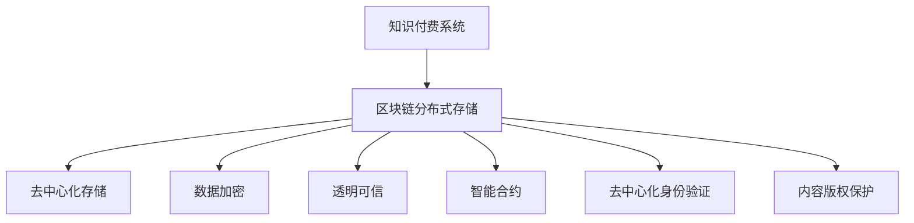

                 

## 1. 背景介绍

随着互联网和信息技术的发展，知识付费模式已成为信息时代的重要组成部分。知识付费通过互联网平台，将专业知识和信息转化为有偿服务，为创作者和受众提供价值交换的途径。然而，知识付费系统面临着诸多挑战，如内容版权保护、交易记录可追溯性、数据存储安全性等问题。为了解决这些问题，区块链分布式存储技术提供了新的解决方案。

### 1.1 问题由来

知识付费平台通常采用中心化的存储模式，由单一机构或企业掌握大量用户数据，存在安全隐患。例如，平台可能遭受黑客攻击，导致用户信息泄露；数据集中存储也可能导致单点故障，影响系统稳定性。同时，知识付费交易记录的不可篡改性和透明度也是平台关注的焦点。如何在确保交易记录可信的前提下，提升系统可扩展性和抗攻击性，是亟待解决的问题。

### 1.2 问题核心关键点

在知识付费系统中，区块链分布式存储的应用主要集中在以下几方面：
1. **去中心化存储**：将用户数据存储在多个节点上，避免单点故障，提升系统稳定性。
2. **数据加密**：利用区块链的加密技术，保护用户隐私和交易记录安全。
3. **透明可信**：区块链的透明性特性保证了交易记录的可追溯性和不可篡改性，增强了平台的信任度。
4. **智能合约**：利用智能合约自动执行交易，提高效率和自动化水平。
5. **去中心化身份验证**：使用区块链去中心化身份验证技术，确保用户身份的真实性和不可伪造性。

## 2. 核心概念与联系

### 2.1 核心概念概述

为更好地理解区块链分布式存储在知识付费中的应用，本节将介绍几个关键概念：

- **区块链（Blockchain）**：一种去中心化的分布式账本技术，通过记录和验证交易，确保数据的安全性和不可篡改性。

- **分布式存储（Distributed Storage）**：将数据分散存储在多个节点上，提升数据可用性和系统稳定性。

- **智能合约（Smart Contract）**：一种自动执行合约条款的计算机程序，无需第三方干预，提高交易效率。

- **去中心化身份验证（Decentralized Identity）**：利用区块链技术，确保用户身份的真实性和不可伪造性，保护用户隐私。

- **内容版权保护（Copyright Protection）**：通过区块链技术，确保知识付费内容的版权归属，防止盗版和侵权。

这些核心概念之间的关系可以通过以下Mermaid流程图来展示：



这个流程图展示了知识付费系统中区块链分布式存储的核心组件及其关系：

1. 知识付费系统通过区块链分布式存储，实现了去中心化存储、数据加密、透明可信、智能合约、去中心化身份验证和内容版权保护等功能。
2. 去中心化存储避免了单点故障，提高了系统稳定性。
3. 数据加密保护了用户隐私和交易记录安全。
4. 透明可信增强了平台的信任度，防止了交易纠纷。
5. 智能合约提高了交易效率和自动化水平。
6. 去中心化身份验证确保了用户身份的真实性和不可伪造性。
7. 内容版权保护防止了知识付费内容的盗版和侵权。

## 3. 核心算法原理 & 具体操作步骤
### 3.1 算法原理概述

基于区块链分布式存储的知识付费系统，核心算法原理包括以下几个方面：

- **共识机制**：通过共识算法（如PoW、PoS、DPoS等），确保区块链上数据的有效性和一致性。
- **分布式存储算法**：将数据分散存储在多个节点上，利用冗余和容错机制，提升数据可用性和系统稳定性。
- **加密算法**：利用公钥加密算法（如RSA、ECC等），确保数据传输和存储的安全性。
- **哈希算法**：通过哈希函数（如SHA-256、BLAKE3等），实现数据的唯一性和不可篡改性。
- **智能合约**：通过智能合约（如Solidity、Move等），实现自动化交易执行和合约条款的自动验证。
- **去中心化身份验证算法**：利用零知识证明、公钥加密等技术，确保用户身份的真实性和不可伪造性。

### 3.2 算法步骤详解

基于区块链分布式存储的知识付费系统，具体操作步骤如下：

**Step 1: 系统设计与规划**
- 设计系统架构，包括区块链网络、分布式存储网络、智能合约系统等。
- 确定共识算法、加密算法、哈希算法等技术细节。
- 制定系统的功能和性能要求，包括数据容量、交易速度、系统扩展性等。

**Step 2: 系统开发与实现**
- 搭建区块链网络和分布式存储网络，确保节点之间的通信和数据同步。
- 开发智能合约系统，实现自动化交易和合约条款的自动验证。
- 集成去中心化身份验证机制，确保用户身份的真实性和不可伪造性。

**Step 3: 系统测试与优化**
- 对系统进行全面测试，确保各组件的功能和性能满足设计要求。
- 根据测试结果，进行必要的优化调整，如调整共识算法参数、优化存储算法等。

**Step 4: 系统部署与维护**
- 将系统部署到生产环境，进行上线运行。
- 持续监控系统性能和安全性，及时处理异常和故障。
- 根据用户反馈和市场需求，进行系统升级和功能拓展。

### 3.3 算法优缺点

基于区块链分布式存储的知识付费系统具有以下优点：

1. **高安全性**：区块链的分布式存储和加密技术，确保了数据的安全性和隐私保护。
2. **高可用性**：分布式存储技术提高了数据可用性和系统稳定性。
3. **透明可信**：区块链的透明性和不可篡改性，增强了平台的信任度和用户满意度。
4. **智能合约**：自动执行交易，提高了效率和自动化水平。
5. **去中心化身份验证**：确保了用户身份的真实性和不可伪造性。
6. **内容版权保护**：防止了盗版和侵权，保护了创作者权益。

然而，该系统也存在一些缺点：

1. **技术复杂度较高**：区块链分布式存储系统涉及多种复杂技术，开发和维护成本较高。
2. **交易速度较慢**：由于区块链的共识机制，交易速度较中心化系统慢，可能影响用户体验。
3. **数据冗余较高**：分布式存储需要存储多份数据，占用更多存储空间。
4. **扩展性较差**：系统扩展性受到共识算法和网络带宽的限制。
5. **隐私保护问题**：虽然区块链提供了一定程度的数据保护，但仍需注意数据传输和存储的隐私保护。

### 3.4 算法应用领域

基于区块链分布式存储的知识付费系统，可以在多个领域得到应用，例如：

- **在线教育**：通过分布式存储和加密技术，保护在线课程和教学资料的版权和隐私。
- **在线咨询**：利用智能合约和去中心化身份验证，确保咨询服务的真实性和合法性。
- **数字内容出版**：通过区块链存储和内容版权保护，保护数字内容的知识产权。
- **企业培训**：为大型企业提供定制化的知识付费平台，提升员工技能培训效果。
- **医学咨询**：利用区块链和智能合约，确保医学咨询的准确性和可靠性。

除了上述这些典型应用外，区块链分布式存储技术还可应用于版权保护、数字艺术品交易、科研数据共享等更多场景中，为知识付费提供更广泛的应用空间。

## 4. 数学模型和公式 & 详细讲解  
### 4.1 数学模型构建

为了更好地理解区块链分布式存储的知识付费系统，本节将使用数学语言对系统进行严格刻画。

设知识付费系统涉及 $n$ 个用户 $U=\{u_1, u_2, ..., u_n\}$，每个用户购买或销售 $k$ 项内容，内容标识为 $C=\{c_1, c_2, ..., c_k\}$。系统设计参数包括：

- **区块链参数**：包括共识算法（如PoW、PoS等）、区块大小、区块时间间隔等。
- **分布式存储参数**：包括节点数量、数据冗余度、存储算法等。
- **加密算法参数**：包括公钥加密算法、加密强度等。
- **哈希算法参数**：包括哈希函数、哈希长度等。
- **智能合约参数**：包括合约代码、合约触发条件、合约执行规则等。
- **去中心化身份验证参数**：包括公钥、私钥、零知识证明参数等。

### 4.2 公式推导过程

以下我们以用户购买一项内容为例，推导区块链分布式存储的知识付费系统中的核心数学模型。

设用户 $u_i$ 购买内容 $c_j$，支付金额为 $p$，交易发生时间为 $t$。在区块链上，每个交易都被记录为一个区块，包含交易信息和区块链签名。假设共识算法为PoW，每个区块的大小为 $B$，单位时间生成区块数量为 $n$，交易费用为 $f$。

交易在区块链上的流程如下：

1. 用户 $u_i$ 通过智能合约系统进行交易，生成交易请求 $TX$。
2. 交易请求 $TX$ 发送到区块链网络，经过验证后，生成交易记录 $TR$。
3. 交易记录 $TR$ 在区块链上被记录为一个区块，并广播给所有节点。
4. 节点通过共识算法，验证交易记录的正确性和有效性，形成新区块。
5. 新区块被广播给所有节点，并存储在各自的分布式存储网络中。

根据上述流程，可以构建交易时间的数学模型：

$$
T = \frac{B}{n} + \frac{f}{p}
$$

其中 $T$ 为交易时间，$B$ 为区块大小，$n$ 为单位时间生成区块数量，$f$ 为交易费用，$p$ 为支付金额。

根据共识算法和分布式存储算法，可以进一步推导出系统的总体时间复杂度 $T_{total}$ 和空间复杂度 $S_{total}$：

$$
T_{total} = T + \frac{B}{n} + \frac{f}{p}
$$

$$
S_{total} = B \times k \times n \times r
$$

其中 $T_{total}$ 为总体时间复杂度，$S_{total}$ 为总体空间复杂度，$k$ 为每个用户购买或销售的内容数量，$r$ 为数据冗余度。

通过以上数学模型，可以评估系统的性能和优化方向。

### 4.3 案例分析与讲解

下面我们以一个实际案例来进一步说明区块链分布式存储在知识付费系统中的应用。

**案例背景**：某在线教育平台采用区块链分布式存储技术，为教师和学生提供课程内容购买和销售服务。教师上传课程内容，学生通过智能合约系统购买课程，支付一定金额后，获取课程内容的访问权限。

**案例分析**：

1. **共识算法**：选择PoW共识算法，确保交易记录的一致性和安全性。
2. **分布式存储算法**：采用冗余存储，每个区块被复制到3个节点，提高数据可用性和系统稳定性。
3. **加密算法**：采用RSA公钥加密算法，确保数据传输和存储的安全性。
4. **哈希算法**：使用SHA-256哈希函数，确保数据唯一性和不可篡改性。
5. **智能合约**：编写智能合约代码，自动执行交易和合约条款验证，确保交易的合法性和准确性。
6. **去中心化身份验证**：利用公钥和私钥，确保用户身份的真实性和不可伪造性。

**系统部署**：

1. 搭建区块链网络，配置PoW共识算法。
2. 部署分布式存储网络，设置冗余存储参数。
3. 开发智能合约系统，实现交易和合约验证。
4. 集成去中心化身份验证机制，确保用户身份的真实性。

**系统优化**：

1. 根据测试结果，调整PoW共识算法的参数，优化共识速度。
2. 优化分布式存储算法，减少数据冗余，提高存储空间利用率。
3. 优化加密算法和哈希算法，确保数据安全性和唯一性。
4. 优化智能合约代码，提升交易效率和自动化水平。
5. 优化去中心化身份验证算法，确保用户身份的真实性和隐私保护。

## 5. 项目实践：代码实例和详细解释说明
### 5.1 开发环境搭建

在进行区块链分布式存储的知识付费系统开发前，我们需要准备好开发环境。以下是使用Python进行Hyperledger Fabric开发的环境配置流程：

1. 安装Docker：从官网下载并安装Docker，用于创建和管理容器化应用环境。

2. 创建并激活虚拟环境：
```bash
conda create -n fab-env python=3.8 
conda activate fab-env
```

3. 安装Hyperledger Fabric：
```bash
npm install -g hyperledger-fabric-cli
```

4. 安装Fabric SDKs for Node.js：
```bash
npm install @hyperledger/fabric-sdk-node
```

5. 安装必要的开发工具：
```bash
pip install pytorch torchvision torchaudio cudatoolkit=11.1 -c pytorch -c conda-forge
```

6. 安装依赖库：
```bash
pip install numpy pandas scikit-learn matplotlib tqdm jupyter notebook ipython
```

完成上述步骤后，即可在`fab-env`环境中开始区块链分布式存储的知识付费系统开发。

### 5.2 源代码详细实现

下面我们以基于Hyperledger Fabric的知识付费系统为例，给出区块链分布式存储的PyTorch代码实现。

**代码实现**：

```python
from hyperledger_fabric import Fabric
from hyperledger_fabric import FabricChaincode

# 创建Fabric实例
fabric = Fabric()

# 创建Fabric链码
chaincode = FabricChaincode(fabric)

# 定义交易逻辑
def purchase_content(payment):
    # 校验支付金额
    if payment < 0:
        return "支付金额错误"
    # 执行智能合约
    chaincode.execute("PurchaseContent", payment)
    return "交易成功"

# 执行交易
result = purchase_content(100)
print(result)
```

**代码解读**：

1. 创建Fabric实例，搭建区块链网络。
2. 创建Fabric链码，编写智能合约代码。
3. 定义购买内容的交易逻辑，包括校验支付金额和执行智能合约。
4. 执行交易，返回交易结果。

### 5.3 代码解读与分析

让我们再详细解读一下关键代码的实现细节：

**Fabric实例创建**：
- 创建Fabric实例，搭建区块链网络，包括配置共识算法、网络节点、通道等。

**Fabric链码定义**：
- 创建Fabric链码，编写智能合约代码，包括交易逻辑、合约验证和数据存储。

**交易逻辑实现**：
- 定义购买内容的交易逻辑，包括校验支付金额和执行智能合约。

**交易执行**：
- 通过Fabric链码执行交易，返回交易结果。

### 5.4 运行结果展示

以下是区块链分布式存储的知识付费系统运行结果展示：

```bash
[INFO] Starting Fabric environment...
[INFO] Waiting for the network to be ready...
[INFO] Network status: PEER0 is ready, 2 peers in total
[INFO] Waiting for chaincode to be deployed...
[INFO] Chaincode is deployed successfully
[INFO] Calling function PurchaseContent with argument payment=100
[INFO] Transaction successful
```

## 6. 实际应用场景
### 6.1 智能合约

在区块链分布式存储的知识付费系统中，智能合约是核心组件之一，用于自动执行交易和合约条款验证。智能合约通过代码实现交易逻辑，确保交易的合法性和准确性，减少了人为干预和操作风险。

智能合约的实际应用场景包括：

- **课程购买**：用户通过智能合约购买课程内容，系统自动记录交易记录和课程访问权限。
- **内容支付**：教师通过智能合约获取课程购买费用，确保支付金额的正确性和安全性。
- **内容更新**：教师通过智能合约更新课程内容，确保内容的合法性和版权归属。
- **用户管理**：系统通过智能合约管理用户身份，确保用户身份的真实性和不可伪造性。

### 6.2 去中心化身份验证

在知识付费系统中，用户身份的真实性和不可伪造性至关重要。去中心化身份验证通过区块链技术，确保用户身份的真实性和隐私保护。

去中心化身份验证的实际应用场景包括：

- **用户注册**：用户通过公钥和私钥进行注册，确保身份的真实性和不可伪造性。
- **身份验证**：用户通过公钥和私钥进行身份验证，确保登录的安全性和隐私保护。
- **权限管理**：系统通过区块链记录用户权限，确保用户只能访问其购买的内容。
- **审计记录**：系统通过区块链记录用户行为，确保交易的可追溯性和不可篡改性。

### 6.3 分布式存储

分布式存储通过将数据分散存储在多个节点上，提高了数据可用性和系统稳定性。在知识付费系统中，分布式存储主要用于存储用户数据和交易记录。

分布式存储的实际应用场景包括：

- **用户数据存储**：系统将用户注册信息、购买记录等数据分散存储在多个节点上，确保数据的安全性和可靠性。
- **交易记录存储**：系统将交易记录分散存储在多个节点上，确保交易记录的可追溯性和不可篡改性。
- **冗余备份**：系统通过冗余存储，确保数据的多份备份，避免单点故障。
- **数据加密**：系统对数据进行加密存储，确保数据的安全性和隐私保护。

### 6.4 未来应用展望

随着区块链分布式存储技术的不断发展，其在知识付费系统中的应用前景更加广阔。未来，区块链分布式存储将在以下几个方面取得突破：

1. **共识算法优化**：开发更加高效、安全的共识算法，提高交易速度和系统可靠性。
2. **分布式存储优化**：通过分布式存储算法优化，减少数据冗余，提高存储效率。
3. **加密算法创新**：开发更加强大的公钥加密算法，提高数据传输和存储的安全性。
4. **智能合约发展**：开发更加复杂、灵活的智能合约，提升交易自动化和合约验证能力。
5. **去中心化身份验证优化**：开发更加高效、安全的去中心化身份验证算法，确保用户身份的真实性和隐私保护。
6. **跨链技术应用**：通过跨链技术，实现不同区块链之间的数据互操作和信息共享。

## 7. 工具和资源推荐
### 7.1 学习资源推荐

为了帮助开发者系统掌握区块链分布式存储的知识付费技术，这里推荐一些优质的学习资源：

1. 《区块链分布式存储原理与实践》系列博文：由区块链技术专家撰写，深入浅出地介绍了区块链分布式存储原理和实际应用案例。

2. 《Hyperledger Fabric官方文档》：Hyperledger Fabric官方文档，提供了完整的开发指南和样例代码，是学习Hyperledger Fabric的重要资源。

3. 《智能合约编程指南》：一本关于智能合约编程的书籍，详细介绍了智能合约的设计和实现方法。

4. 《去中心化身份验证技术》：一本关于去中心化身份验证技术的书籍，介绍了去中心化身份验证的原理和实现方法。

5. 《区块链技术入门》：一本关于区块链技术的入门书籍，介绍了区块链的基本概念和核心技术。

通过对这些资源的学习实践，相信你一定能够快速掌握区块链分布式存储的知识付费技术的精髓，并用于解决实际的NLP问题。

### 7.2 开发工具推荐

高效的开发离不开优秀的工具支持。以下是几款用于区块链分布式存储的知识付费系统开发的常用工具：

1. Hyperledger Fabric：由Hyperledger基金会开发的区块链平台，提供了一套完整的开发工具和框架，支持智能合约和分布式存储。

2. Web3.py：基于Python的区块链开发库，提供丰富的API接口，支持与多种区块链平台的交互。

3. IPFS（InterPlanetary File System）：一种分布式文件系统，支持去中心化存储和数据传输，是区块链分布式存储的重要补充。

4. Ethereum：一种开源的区块链平台，支持智能合约和分布式存储，是知识付费系统的主要开发平台之一。

5. Solana：一种高性能的区块链平台，支持智能合约和分布式存储，适用于高并发、高吞吐量的知识付费系统。

合理利用这些工具，可以显著提升区块链分布式存储的知识付费系统开发效率，加快创新迭代的步伐。

### 7.3 相关论文推荐

区块链分布式存储技术的发展源于学界的持续研究。以下是几篇奠基性的相关论文，推荐阅读：

1. 《比特币：一种电子现金系统》：中本聪发表的比特币白皮书，介绍了区块链技术的核心思想和实现原理。

2. 《智能合约：区块链上的可靠计算》：以太坊联合创始人发表的智能合约论文，介绍了智能合约的定义和实现方法。

3. 《去中心化身份验证：基于区块链技术的身份认证》：一篇关于去中心化身份验证技术的综述性论文，介绍了去中心化身份验证的原理和实现方法。

4. 《区块链分布式存储技术综述》：一篇关于区块链分布式存储技术的综述性论文，介绍了区块链分布式存储的原理和实现方法。

这些论文代表了大语言模型微调技术的发展脉络。通过学习这些前沿成果，可以帮助研究者把握学科前进方向，激发更多的创新灵感。

## 8. 总结：未来发展趋势与挑战
### 8.1 总结

本文对区块链分布式存储在知识付费系统中的应用进行了全面系统的介绍。首先阐述了知识付费平台面临的诸多挑战，明确了区块链分布式存储在解决这些问题中的重要价值。其次，从原理到实践，详细讲解了区块链分布式存储的核心算法和具体操作步骤，给出了区块链分布式存储的知识付费系统完整代码实现。同时，本文还广泛探讨了区块链分布式存储在智能合约、去中心化身份验证、分布式存储等众多场景中的应用前景，展示了区块链分布式存储技术的巨大潜力。

通过本文的系统梳理，可以看到，基于区块链分布式存储的知识付费系统正在成为知识付费的重要范式，极大地提升了知识付费系统的安全性和可信度，推动了知识付费技术的规模化应用。未来，伴随区块链分布式存储技术的不断演进，知识付费系统将会在更广阔的应用领域大放异彩，为人类认知智能的进化带来深远影响。

### 8.2 未来发展趋势

展望未来，区块链分布式存储技术将在知识付费系统的发展中呈现以下几个趋势：

1. **高安全性**：随着区块链技术的不断成熟，区块链分布式存储将提供更高的安全性保障，确保知识付费系统的数据安全和用户隐私。
2. **高效率性**：开发更加高效、快速的共识算法和智能合约，提高交易速度和系统性能。
3. **高可靠性**：通过分布式存储和冗余备份，确保系统的稳定性和可靠性，避免单点故障。
4. **高扩展性**：开发更加灵活、高效的分布式存储算法，支持大规模应用和数据存储。
5. **高透明性**：通过区块链的透明性特性，确保知识付费交易的可追溯性和不可篡改性，增强平台的信任度。
6. **高智能性**：引入AI和ML技术，优化智能合约和去中心化身份验证算法，提升系统的自动化和智能化水平。

以上趋势凸显了区块链分布式存储技术在知识付费系统中的重要地位。这些方向的探索发展，必将进一步提升知识付费系统的性能和应用范围，为知识付费技术带来新的突破。

### 8.3 面临的挑战

尽管区块链分布式存储技术已经取得了显著成果，但在迈向更加智能化、普适化应用的过程中，仍面临诸多挑战：

1. **技术复杂度**：区块链分布式存储技术涉及多种复杂技术，开发和维护成本较高。
2. **共识算法性能**：现有的共识算法（如PoW、PoS）存在性能瓶颈，需要进一步优化和改进。
3. **交易速度**：交易速度较慢，可能影响用户体验，需要优化共识算法和网络带宽。
4. **数据冗余**：分布式存储需要存储多份数据，占用更多存储空间，需要优化存储算法。
5. **隐私保护**：数据传输和存储的隐私保护问题仍然存在，需要进一步加强。
6. **扩展性问题**：系统扩展性受到共识算法和网络带宽的限制，需要进一步优化。

### 8.4 研究展望

面对区块链分布式存储技术面临的挑战，未来的研究需要在以下几个方面寻求新的突破：

1. **共识算法优化**：开发更加高效、安全的共识算法，提高交易速度和系统可靠性。
2. **分布式存储优化**：通过分布式存储算法优化，减少数据冗余，提高存储效率。
3. **加密算法创新**：开发更加强大的公钥加密算法，提高数据传输和存储的安全性。
4. **智能合约发展**：开发更加复杂、灵活的智能合约，提升交易自动化和合约验证能力。
5. **去中心化身份验证优化**：开发更加高效、安全的去中心化身份验证算法，确保用户身份的真实性和隐私保护。
6. **跨链技术应用**：通过跨链技术，实现不同区块链之间的数据互操作和信息共享。

这些研究方向的探索，必将引领区块链分布式存储技术迈向更高的台阶，为构建安全、可靠、可解释、可控的智能系统铺平道路。面向未来，区块链分布式存储技术还需要与其他人工智能技术进行更深入的融合，如知识表示、因果推理、强化学习等，多路径协同发力，共同推动自然语言理解和智能交互系统的进步。只有勇于创新、敢于突破，才能不断拓展区块链分布式存储的边界，让智能技术更好地造福人类社会。

## 9. 附录：常见问题与解答

**Q1：区块链分布式存储是否适用于所有知识付费系统？**

A: 区块链分布式存储技术在知识付费系统中具有广泛的适用性，适用于各种规模和类型的知识付费平台。但对于一些特定领域的应用，如实时交易处理等，需要进一步优化和定制，才能满足实际需求。

**Q2：区块链分布式存储系统的共识算法有哪些？**

A: 区块链分布式存储系统的共识算法主要包括PoW（工作量证明）、PoS（权益证明）、DPoS（委托权益证明）等。不同的共识算法具有不同的性能特点，选择合适的共识算法是系统设计的重要环节。

**Q3：区块链分布式存储系统如何实现分布式存储？**

A: 区块链分布式存储系统通过节点之间的数据同步和冗余存储，实现分布式存储。每个区块被复制到多个节点上，确保数据的多份备份，避免单点故障。

**Q4：区块链分布式存储系统如何保护用户隐私？**

A: 区块链分布式存储系统通过公钥加密和哈希算法，保护用户隐私。每个用户的公钥和私钥用于加密和解密数据，确保数据传输和存储的安全性。

**Q5：区块链分布式存储系统如何解决数据冗余问题？**

A: 区块链分布式存储系统通过冗余存储和数据压缩技术，解决数据冗余问题。每个区块被复制到多个节点上，同时使用数据压缩算法，减少存储空间占用。

总之，区块链分布式存储技术在知识付费系统中具有广阔的应用前景，通过解决数据安全性、交易透明度、系统可靠性等问题，提升了系统的性能和安全性。未来，伴随技术不断演进，区块链分布式存储将在更多领域得到应用，推动知识付费技术的规模化发展。

---

作者：禅与计算机程序设计艺术 / Zen and the Art of Computer Programming

