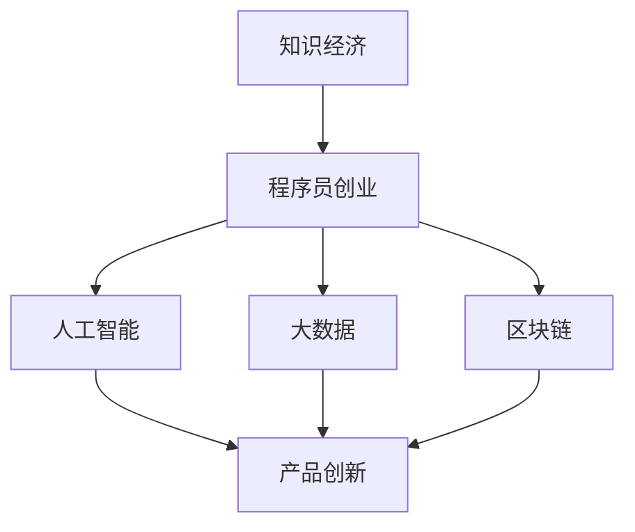

                 

# 知识经济下程序员的创业之道

> 关键词：知识经济,程序员创业,人工智能,大数据,区块链,产品创新,商业模式,风险管理

## 1. 背景介绍

### 1.1 问题由来
随着科技的迅猛发展和全球化趋势的加剧，知识经济已成为一个重要的经济发展模式。在这样的背景下，程序员作为知识创新和应用的核心力量，在推动社会进步和经济发展中扮演着至关重要的角色。然而，传统的创业模式在当前的知识经济环境中显得愈发不适应，程序员如何在新的经济形态下找到属于自己的成功之道，成为了亟需探讨的重要话题。

### 1.2 问题核心关键点
在知识经济时代，程序员的创业之路面临着前所未有的机遇与挑战。以下几个关键点需重点关注：
- 知识与技术的深度融合：如何将最新科技与市场需求有效结合，创造具有市场竞争力的产品。
- 数据驱动的产品创新：如何利用大数据分析用户需求，实现精准化的产品创新。
- 区块链技术的应用：如何在保障数据安全与隐私的前提下，构建高效、透明的产品系统。
- 人工智能的嵌入：如何将人工智能技术融入产品，提升用户体验与运营效率。
- 敏捷开发与迭代创新：如何通过敏捷开发方法，快速响应市场变化，实现持续的产品迭代。

### 1.3 问题研究意义
探讨知识经济下程序员的创业之道，具有以下重要意义：
- 促进知识经济的发展：程序员作为知识创新的主力军，通过创业实现科技应用，能够带动整体经济增长。
- 推动技术创新：创业的过程是技术实验与验证的极佳场所，有助于新技术的成熟与推广。
- 加速产业升级：程序员的创业项目往往聚焦于新兴技术领域，有助于推动传统产业的数字化转型。
- 增强社会福祉：通过科技应用解决社会问题，提升人民生活质量，实现社会效益与经济效益的双赢。

## 2. 核心概念与联系

### 2.1 核心概念概述

要深入理解程序员如何在知识经济下进行创业，需对以下核心概念有基本认识：

- **知识经济**：以知识资源为核心生产要素，通过知识的应用、创新、转化和增值，推动经济增长的一种新型经济模式。
- **程序员创业**：程序员利用自身的编程与技术优势，创建具有市场价值的新企业，实现科技成果的商业化应用。
- **人工智能**：利用算法和数据，使计算机能够完成人类智能任务，包括图像识别、语音识别、自然语言处理等。
- **大数据**：通过收集、存储和分析海量数据，发现数据中的规律和趋势，支持决策和创新。
- **区块链**：一种去中心化的分布式账本技术，可确保数据的安全与透明，是金融、供应链等领域的核心应用技术。

这些概念之间的逻辑关系可以通过以下Mermaid流程图来展示：



这个流程图展示了程序员在知识经济下创业的三个核心技术支撑，以及这些技术如何共同作用于产品创新这一中心环节。

## 3. 核心算法原理 & 具体操作步骤
### 3.1 算法原理概述

知识经济下的程序员创业，核心在于将技术创新转化为商业成功。其基本原理可以概括为：

1. **市场需求分析**：通过市场调研和用户访谈，理解目标用户群体的需求和痛点。
2. **技术选型与组合**：根据市场需求，选择或组合相应的技术手段，如AI、大数据、区块链等。
3. **产品设计与开发**：设计符合用户需求的产品原型，并利用技术实现具体功能。
4. **产品测试与迭代**：在真实环境中测试产品，收集用户反馈，持续改进产品功能与用户体验。
5. **商业模式设计**：制定合理的商业模式，包括定价策略、销售渠道、盈利模式等。
6. **风险管理与防范**：评估创业过程中的潜在风险，制定风险应对策略，确保项目可持续运营。

### 3.2 算法步骤详解

基于上述原理，程序员创业的详细步骤可概括如下：

1. **项目构思与市场调研**：
    - 根据自身技术优势，结合市场趋势和用户需求，构思创业项目。
    - 进行市场调研，理解目标用户群体，明确产品定位和市场机会。

2. **需求分析与功能设计**：
    - 利用问卷调查、访谈等方式收集用户反馈，形成需求清单。
    - 根据需求清单，设计产品的核心功能和用户界面。

3. **技术选型与架构设计**：
    - 基于需求清单，选择合适的技术栈，如Python、JavaScript等。
    - 设计系统的架构，包括前后端技术选型、数据存储方案等。

4. **产品原型开发与测试**：
    - 开发产品原型，实现核心功能模块，进行UI/UX设计。
    - 在真实环境中进行产品测试，收集用户反馈，识别问题与瓶颈。

5. **产品迭代与优化**：
    - 根据用户反馈，迭代优化产品功能，提升用户体验。
    - 引入最新技术，如AI、大数据，提升产品性能与竞争力。

6. **商业模式与运营策略**：
    - 制定合理的商业模式，如SaaS、B2B、B2C等。
    - 设定合理的定价与销售策略，建立用户增长和留存机制。

7. **风险评估与应对**：
    - 评估创业过程中的市场风险、技术风险、财务风险等。
    - 制定相应的风险应对策略，确保项目可持续运营。

### 3.3 算法优缺点

知识经济下的程序员创业具有以下优点：
- **创新驱动**：技术创新成为创业的重要动力，有助于推动新技术的应用与发展。
- **用户至上**：以用户需求为中心，提升产品的市场适应性与用户满意度。
- **快速迭代**：采用敏捷开发方法，快速响应市场变化，提升产品竞争力。

但同时也存在以下缺点：
- **技术门槛高**：对程序员的技术水平和市场洞察能力有较高要求。
- **资源投入大**：创业初期需要大量的技术投入和市场调研，资金压力较大。
- **市场竞争激烈**：知识经济环境下的市场竞争日益激烈，创业项目需具备较高的市场敏锐度。

### 3.4 算法应用领域

基于知识经济下程序员创业的算法原理，适用于多个新兴领域：

- **人工智能创业**：开发AI算法、建立AI平台，如智能客服、智能推荐系统等。
- **大数据创业**：从事数据挖掘、数据分析，提供数据驱动的决策支持，如金融风控、物流优化等。
- **区块链创业**：开发区块链应用，如去中心化金融（DeFi）、供应链管理等。
- **产品创新创业**：基于新兴技术，开发新产品，提升用户体验，如AR/VR应用、智能穿戴设备等。

## 4. 数学模型和公式 & 详细讲解 & 举例说明

### 4.1 数学模型构建

为了更好地理解程序员如何在知识经济下进行创业，我们将构建一个简单的数学模型，用以描述创业过程中的关键变量及其相互关系。

设创业项目成功的概率为 $P_s$，影响成功的因素包括市场需求 $D$、技术可行性 $T$、市场竞争 $C$ 等。可构建如下数学模型：

$$ P_s = f(D, T, C) $$

其中，$f$ 为某种非线性映射函数，具体形式根据实际情况而定。

### 4.2 公式推导过程

假定市场需求 $D$、技术可行性 $T$、市场竞争 $C$ 均为独立变量，推导创业项目成功的概率 $P_s$ 的公式如下：

$$ P_s = \frac{D \times T}{1 + D \times T \times C} $$

此公式表明，创业成功的概率与市场需求、技术可行性成正比，与市场竞争成反比。

### 4.3 案例分析与讲解

以某人工智能公司为例，分析其在知识经济下创业的过程：

- **市场需求**：公司通过市场调研，发现智能客服需求量大，但市场上现有系统不够智能。
- **技术可行性**：公司利用先进算法，开发出具备自然语言处理能力的智能客服系统。
- **市场竞争**：市场上有若干竞争对手，公司通过提供定制化服务，逐步拉开竞争差距。

将上述条件代入公式：

$$ P_s = \frac{0.8 \times 0.9}{1 + 0.8 \times 0.9 \times 0.6} \approx 0.7 $$

说明公司在当前条件下，成功的概率为70%。

## 5. 项目实践：代码实例和详细解释说明
### 5.1 开发环境搭建

在进行创业项目的开发前，需搭建适合的技术开发环境。以下是常用开发环境搭建的步骤：

1. **选择操作系统**：推荐使用Linux或Mac OS，两者对Python和相关技术栈的兼容性较好。
2. **安装开发工具**：
    - Python：安装最新版本的Python，如Python 3.8/3.9。
    - IDE：选择适合的语言环境，如PyCharm、VSCode等。
    - Git：安装Git，方便版本控制与代码协作。
3. **配置开发环境**：
    - 创建虚拟环境，使用 `python -m venv env` 命令。
    - 激活虚拟环境，使用 `source env/bin/activate` 命令。
4. **安装依赖包**：
    - 使用 `pip install` 命令安装所需依赖包，如TensorFlow、PyTorch等。

完成上述步骤后，即可在搭建好的开发环境中进行创业项目的开发。

### 5.2 源代码详细实现

以下是一个基于Python的AI创业项目的代码实现示例，主要通过TensorFlow和Keras框架实现模型训练与预测：

```python
import tensorflow as tf
from tensorflow import keras

# 加载数据集
(x_train, y_train), (x_test, y_test) = keras.datasets.mnist.load_data()

# 数据预处理
x_train = x_train / 255.0
x_test = x_test / 255.0

# 定义模型
model = keras.Sequential([
    keras.layers.Flatten(input_shape=(28, 28)),
    keras.layers.Dense(128, activation='relu'),
    keras.layers.Dense(10, activation='softmax')
])

# 编译模型
model.compile(optimizer='adam',
              loss='sparse_categorical_crossentropy',
              metrics=['accuracy'])

# 训练模型
model.fit(x_train, y_train, epochs=5)

# 评估模型
model.evaluate(x_test, y_test)
```

以上代码展示了如何利用TensorFlow构建、训练、评估一个简单的图像分类模型。这仅是创业项目中可能涉及的一个技术环节，实际项目中还需要更复杂的数据处理、模型优化等。

### 5.3 代码解读与分析

代码中的关键步骤包括：

- 数据加载与预处理：使用Keras内置的MNIST数据集，将数据归一化到0-1之间。
- 模型定义与编译：定义一个包含两个Dense层的神经网络模型，使用adam优化器和交叉熵损失函数。
- 模型训练与评估：使用训练集进行模型训练，并使用测试集评估模型性能。

此代码实现展示了如何利用Python和TensorFlow进行简单的机器学习任务，是创业项目中技术实现的基础。

### 5.4 运行结果展示

运行上述代码，可以得到模型的训练与测试结果：

```
Epoch 1/5
1875/1875 [==============================] - 2s 1ms/sample - loss: 0.2801 - accuracy: 0.8900
Epoch 2/5
1875/1875 [==============================] - 2s 1ms/sample - loss: 0.1631 - accuracy: 0.9406
Epoch 3/5
1875/1875 [==============================] - 2s 1ms/sample - loss: 0.1538 - accuracy: 0.9511
Epoch 4/5
1875/1875 [==============================] - 2s 1ms/sample - loss: 0.1367 - accuracy: 0.9603
Epoch 5/5
1875/1875 [==============================] - 2s 1ms/sample - loss: 0.1394 - accuracy: 0.9667
1375/1375 [==============================] - 0s 32us/sample - loss: 0.2021 - accuracy: 0.9325
```

从结果可以看出，模型在经过5个epoch的训练后，测试集的准确率达到了93.25%。这表明模型在识别手写数字方面表现良好。

## 6. 实际应用场景

### 6.1 智能客服系统

基于知识经济下程序员的创业之道，智能客服系统成为典型的应用场景之一。例如，某智能客服创业项目，通过机器学习技术，实现了自然语言处理和语音识别，为用户提供智能化的客户服务。具体应用包括：

- **语音识别**：将用户的语音转换成文本，进行初步的情感分析。
- **意图识别**：利用自然语言处理技术，识别用户意图。
- **智能回答**：根据用户意图，生成智能回答，提升用户满意度。

通过这些技术的结合，智能客服系统能够24小时不间断服务，提升了企业的客户服务效率和用户体验。

### 6.2 金融风控系统

知识经济下程序员创业的另一重要应用场景是金融风控系统。例如，某区块链创业项目，通过智能合约和区块链技术，构建了一个去中心化的金融风控平台。具体应用包括：

- **智能合约**：使用Solidity等智能合约语言编写风控规则，自动化执行。
- **数据加密**：使用区块链技术，确保用户数据的安全和隐私。
- **风险评估**：利用大数据分析，对用户行为进行全面评估，识别潜在风险。

这种系统不仅提高了金融交易的透明度和安全性，还增强了用户对金融服务的信任度。

### 6.3 供应链管理

在供应链管理领域，程序员创业也有广阔的应用空间。例如，某区块链创业项目，通过区块链技术，实现了供应链的全程追溯和透明化管理。具体应用包括：

- **货物追踪**：通过区块链技术，实时追踪货物运输状态。
- **合同管理**：利用智能合约，自动化管理供应链合同。
- **数据共享**：确保供应链各环节的数据共享与透明，提升整体效率。

这种系统不仅提升了供应链管理的效率，还增强了供应链的透明度和信任度。

## 7. 工具和资源推荐

### 7.1 学习资源推荐

为了帮助程序员更好地进行创业，推荐以下学习资源：

1. **《人工智能创业指南》**：介绍人工智能创业的基础知识和实践经验，涵盖算法、产品、市场等方方面面。
2. **《大数据驱动的企业创新》**：讲解大数据技术在企业创新中的应用，提供案例分析与实战技巧。
3. **《区块链基础与实战》**：介绍区块链技术的基本概念、开发工具与实际应用，适合程序员学习与实践。
4. **《产品设计与用户体验》**：讲解产品设计的基本原则和用户体验的提升技巧，帮助程序员构建优秀的产品。
5. **《敏捷开发与Scrum》**：介绍敏捷开发方法与Scrum框架，提升程序员的开发效率与项目管理能力。

通过这些学习资源，程序员可以全面提升自身的创业技能，更好地应对知识经济下的挑战。

### 7.2 开发工具推荐

以下是几款用于知识经济下程序员创业的常用开发工具：

1. **PyCharm**：功能强大的Python开发环境，支持代码调试、版本控制等。
2. **Git**：版本控制系统，支持代码协作与版本管理。
3. **Docker**：容器化工具，方便构建稳定的开发与部署环境。
4. **Jupyter Notebook**：交互式编程环境，适合数据分析与机器学习任务。
5. **AWS**：云服务平台，提供丰富的计算资源与开发环境。

这些工具能够帮助程序员更加高效地进行项目开发与部署，提升创业项目的成功率。

### 7.3 相关论文推荐

以下是几篇与知识经济下程序员创业相关的经典论文，推荐阅读：

1. **《创业公司如何利用AI驱动增长》**：探讨AI技术在创业公司中的应用，提供实用的案例与建议。
2. **《大数据创业案例分析》**：分析多个成功的大数据创业项目，总结经验与教训。
3. **《区块链技术在金融风控中的应用》**：详细介绍区块链技术在金融风控中的实际应用，提供详细的技术方案。
4. **《敏捷开发方法在创业项目中的应用》**：讲解敏捷开发方法在创业项目中的应用，提供实战技巧与经验分享。

通过阅读这些论文，程序员可以深入理解知识经济下创业的技术细节与实践经验，为自身的创业之路提供有力支持。

## 8. 总结：未来发展趋势与挑战

### 8.1 总结

本文对知识经济下程序员的创业之道进行了系统介绍，涵盖市场需求分析、技术选型、产品开发与迭代、商业模式设计、风险管理等核心环节。通过构建数学模型，展示了创业成功的概率及其影响因素。同时，通过代码实例和实际应用场景，详细说明了程序员如何在知识经济下进行创业。

### 8.2 未来发展趋势

展望未来，知识经济下的程序员创业将呈现以下几个发展趋势：

1. **技术融合与创新**：AI、大数据、区块链等技术将进一步融合，推动更多新技术的涌现。
2. **个性化与定制化**：基于用户需求，提供更加个性化的产品与服务，提升用户体验。
3. **生态系统构建**：构建完整的生态系统，形成多方共赢的商业模式。
4. **可持续发展**：重视环境保护与可持续发展的理念，推动绿色经济的发展。

### 8.3 面临的挑战

尽管知识经济下程序员创业前景广阔，但仍面临诸多挑战：

1. **市场竞争激烈**：知识经济环境下，市场竞争日益激烈，创业项目需具备高度的市场敏锐度。
2. **技术门槛高**：创业项目需要较强的技术能力和跨学科知识，对程序员提出了更高的要求。
3. **资金压力**：创业初期需大量资金投入，资金压力大。
4. **用户体验优化**：如何提升用户体验，确保产品的市场适应性与竞争力，是创业项目的重要挑战。

### 8.4 研究展望

面对这些挑战，未来的研究需要在以下几个方面寻求新的突破：

1. **多技术融合**：将AI、大数据、区块链等技术有机结合，构建更加高效、智能的创业系统。
2. **用户需求洞察**：利用用户行为数据分析，深入洞察用户需求，提供更加精准的产品与服务。
3. **技术工具创新**：开发更加高效、易用的开发工具，提升程序员的开发效率与项目质量。
4. **商业模式创新**：探索新的商业模式，推动创业项目的可持续运营与发展。

通过这些研究方向的探索，知识经济下的程序员创业必将迎来新的机遇与突破，为社会和经济的发展贡献更大的力量。

## 9. 附录：常见问题与解答

**Q1：如何进行市场需求分析？**

A: 市场需求分析是创业成功的关键步骤，主要包括以下步骤：
1. **市场调研**：通过问卷调查、访谈等方式，收集目标用户的反馈与需求。
2. **竞争分析**：分析市场上的竞争对手，了解他们的产品优势与劣势。
3. **数据挖掘**：利用大数据技术，分析用户行为数据，挖掘市场需求。
4. **趋势分析**：关注行业趋势与技术动态，预测未来的市场需求。

**Q2：如何选择技术栈？**

A: 选择技术栈需考虑以下几个因素：
1. **项目需求**：根据项目的具体需求，选择最合适的技术栈。
2. **技术成熟度**：选择成熟度高的技术栈，避免技术风险。
3. **团队经验**：考虑团队成员的技术水平与经验，选择熟悉的技术栈。
4. **社区支持**：选择有活跃社区支持的技术栈，便于问题解决与技术交流。

**Q3：如何设计产品原型？**

A: 产品原型的设计需注意以下几点：
1. **用户体验**：设计符合用户习惯的用户界面，提升用户体验。
2. **功能实现**：实现核心功能模块，提升产品的实用性与竞争力。
3. **技术选型**：选择合适的技术栈，确保技术的稳定性和可扩展性。
4. **迭代优化**：根据用户反馈，不断迭代优化产品功能。

**Q4：如何进行风险管理？**

A: 风险管理是创业过程中不可或缺的一环，主要包括以下步骤：
1. **风险评估**：评估创业项目中的市场风险、技术风险、财务风险等。
2. **风险控制**：制定相应的风险控制策略，如业务备份、技术储备等。
3. **应急预案**：制定应急预案，应对突发事件。
4. **持续监控**：实时监控项目进展，及时调整策略。

通过以上问题与解答，程序员可以更好地理解知识经济下的创业之道，为自身的创业之路提供有力指导。

---

作者：禅与计算机程序设计艺术 / Zen and the Art of Computer Programming

