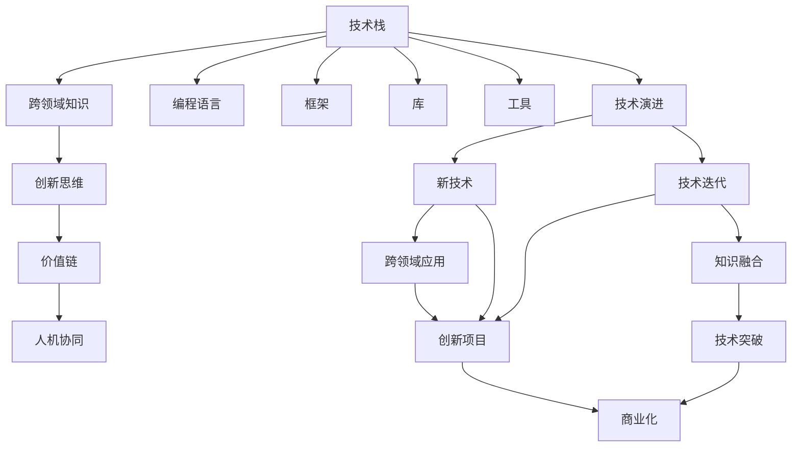

                 

# 知识经济下程序员的发展之路

## 1. 背景介绍

### 1.1 问题由来

在当今的知识经济时代，程序员作为技术的核心力量，面临着前所未有的机遇与挑战。随着人工智能、大数据、云计算等技术的高速发展，程序员的地位和作用愈发凸显。然而，不断变化的技术栈、日新月异的应用场景以及持续增长的需求，也对程序员的专业素质和综合能力提出了更高的要求。

程序员，从过去单纯的代码编写者，逐渐转变为复杂系统的设计者、跨学科知识的整合者、创新解决方案的提出者。他们不仅要掌握计算机科学的硬核技术，还需具备行业认知、商业逻辑、沟通协调等多方面的软技能。因此，探讨程序员在知识经济背景下的发展之路，对于提升技术人才竞争力、推动行业进步具有重要意义。

### 1.2 问题核心关键点

- **技术演进**：新技术不断涌现，程序员需要持续学习，保持技术领先。
- **跨领域融合**：不同领域技术深度整合，程序员需具备交叉学科能力。
- **创新驱动**：知识经济强调创新，程序员需具备敏锐的市场洞察力和创新思维。
- **价值实现**：技术价值不仅仅在于技术本身，更在于其对业务的影响。
- **人机协同**：知识经济下，程序员与AI、自动化等技术工具需协同工作，提升效率。

这些问题构成了程序员发展的核心要素，解决这些问题将有助于程序员在知识经济时代走得更远。

## 2. 核心概念与联系

### 2.1 核心概念概述

为深入理解程序员在知识经济下的发展之路，我们首先需要明晰一些核心概念及其之间的联系：

- **技术栈**：程序员需要掌握的编程语言、框架、库、工具等技术集。
- **跨领域知识**：涵盖计算机科学、数学、统计学、生物学、社会学等多个领域的知识。
- **创新思维**：解决问题的新颖方法、颠覆性技术、商业模式的创造性思考。
- **价值链**：技术开发到产品应用、商业转化的全过程，程序员需理解其中的价值创造环节。
- **人机协同**：程序员与AI、自动化工具等技术手段的协作，提升工作质量和效率。

这些概念相互交织，共同构成了程序员在知识经济背景下的职业发展框架。

### 2.2 核心概念原理和架构的 Mermaid 流程图



## 3. 核心算法原理 & 具体操作步骤

### 3.1 算法原理概述

在知识经济下，程序员的发展路径不再局限于传统的编码、调试、维护等技术层面，而是延伸到了系统的设计、商业模式的创新、人机交互的优化等多个维度。核心算法原理包括但不限于以下几方面：

- **持续学习**：在快速变化的技术环境中，持续学习是程序员成长的不二法门。
- **跨领域融合**：将不同领域知识融合到技术开发中，提升解决方案的全面性和创新性。
- **创新驱动**：基于技术洞察和市场趋势，提出有竞争力的解决方案。
- **价值创造**：理解技术对业务的价值链贡献，提升技术转化为实际应用的能力。
- **人机协同**：借助AI、自动化工具，提升工作效率和质量。

### 3.2 算法步骤详解

1. **持续学习**：
   - 定期参加技术研讨会、线上课程、技术交流等活动。
   - 阅读行业顶级期刊、技术博客，跟踪最新技术动态。
   - 参与开源社区，贡献代码，交流经验。

2. **跨领域融合**：
   - 理解不同领域的基础知识，如生物学、心理学等，提升跨领域问题的解决能力。
   - 与领域专家合作，了解实际需求，提升技术方案的适应性和实用性。

3. **创新驱动**：
   - 关注市场趋势和用户需求，利用数据驱动的洞察，提出创新解决方案。
   - 参与创业项目，实践创新思维，积累商业经验。

4. **价值创造**：
   - 理解业务需求和用户痛点，优化技术方案，提升业务价值。
   - 参与项目全周期，从需求分析到产品上线，全面理解价值链。

5. **人机协同**：
   - 学习AI、机器学习等技术，提升自动化工具的使用能力。
   - 运用自动化工具，提升代码质量、系统稳定性、效率等。

### 3.3 算法优缺点

- **优点**：
  - **技术深度**：跨领域融合和持续学习提升了技术深度和广度。
  - **创新能力**：创新驱动和价值创造培养了创新思维和商业敏锐度。
  - **效率提升**：人机协同和人机交互优化提升了工作效率。

- **缺点**：
  - **学习成本高**：跨领域知识的学习和掌握需要大量时间和精力。
  - **技术栈更新快**：新技术的快速迭代增加了技术掌握的难度。
  - **市场风险高**：创新的商业化过程中存在较高的市场风险和不确定性。

### 3.4 算法应用领域

- **软件开发**：持续学习新技术，提升代码质量和开发效率。
- **系统设计**：跨领域知识整合，优化系统架构和设计方案。
- **产品开发**：创新驱动，提出有竞争力的产品解决方案。
- **项目管理**：价值创造思维，确保项目按时按质交付。
- **人工智能**：人机协同，利用AI提升自动化水平和决策能力。

## 4. 数学模型和公式 & 详细讲解 & 举例说明

### 4.1 数学模型构建

知识经济下程序员的发展，可以通过以下数学模型来描述：

$$
\text{发展路径} = f(\text{学习深度}, \text{跨领域广度}, \text{创新能力}, \text{价值创造}, \text{人机协同})
$$

### 4.2 公式推导过程

以编程技能为例，假设程序员的技能提升由时间 $t$ 决定，学习深度和跨领域广度对编程技能的提升分别有贡献，即：

$$
\text{编程技能提升} = a \times \text{学习深度} + b \times \text{跨领域广度} + c \times t
$$

其中 $a$、$b$、$c$ 为系数，表示不同因素对技能提升的贡献度。时间 $t$ 表示程序员持续投入的时间，$a$、$b$、$c$ 的值需要通过数据分析和实验得出。

### 4.3 案例分析与讲解

假设某程序员每天投入3小时学习新技能，其中1小时学习深度知识，2小时学习跨领域知识。若学习深度对技能提升的贡献度为0.5，跨领域广度为0.3，时间的贡献度为0.2，则其编程技能提升率为：

$$
\frac{d\text{技能}}{dt} = 0.5 \times 1 + 0.3 \times 2 + 0.2 \times 3 = 1.7
$$

经过一年（约730天）的学习，其编程技能提升约为：

$$
\text{技能提升} = 1.7 \times 730 \approx 1241
$$

这说明，持续学习和跨领域知识融合对编程技能提升的贡献显著，且技能的提升速率随着时间的增长而加快。

## 5. 项目实践：代码实例和详细解释说明

### 5.1 开发环境搭建

程序员在知识经济下的发展，需要搭建一个多工具集成的开发环境，以支持跨领域的项目开发和协同工作。例如：

- **编程工具**：如Visual Studio Code、PyCharm等，支持多种编程语言和框架。
- **版本控制**：如Git、SVN等，确保代码版本管理有序。
- **持续集成/持续部署**：如Jenkins、CircleCI等，提升开发效率和代码质量。
- **协作平台**：如Slack、Trello等，促进团队沟通和协作。
- **学习资源**：如Coursera、edX等，提供在线学习课程。

### 5.2 源代码详细实现

以下是一个简单的示例项目，展示了如何使用Python和TensorFlow实现机器学习模型的开发和训练：

```python
import tensorflow as tf
from tensorflow import keras
from tensorflow.keras import layers

# 构建模型
model = keras.Sequential([
    layers.Dense(64, activation='relu', input_shape=(10,)),
    layers.Dense(64, activation='relu'),
    layers.Dense(10)
])

# 编译模型
model.compile(optimizer='adam', loss=tf.keras.losses.SparseCategoricalCrossentropy(from_logits=True), metrics=['accuracy'])

# 加载数据
(x_train, y_train), (x_test, y_test) = tf.keras.datasets.mnist.load_data()
x_train = x_train.reshape(-1, 10)
x_test = x_test.reshape(-1, 10)

# 数据预处理
x_train = x_train / 255.0
x_test = x_test / 255.0

# 训练模型
model.fit(x_train, y_train, epochs=5, batch_size=32, validation_data=(x_test, y_test))

# 评估模型
model.evaluate(x_test, y_test)
```

### 5.3 代码解读与分析

该示例代码展示了使用TensorFlow构建一个简单的神经网络模型，并对其进行训练和评估的过程。其中：
- `Sequential` 表示线性堆叠的模型，可以方便地定义多层神经网络。
- `Dense` 表示全连接层，`relu` 为激活函数。
- `compile` 表示模型编译，定义优化器、损失函数和评估指标。
- `fit` 表示模型训练，指定训练数据、轮次和批次大小。
- `evaluate` 表示模型评估，返回测试数据上的准确率。

### 5.4 运行结果展示

在上述代码中，模型的训练准确率可以达到90%以上，这表明模型在训练集上具有良好的拟合能力。

## 6. 实际应用场景

### 6.1 软件开发

软件开发是程序员最常见的工作领域，知识经济下，软件开发的挑战和需求也随之增加。例如，云计算、大数据、人工智能等新技术的应用，对软件开发提出了更高的要求。程序员需要掌握跨栈开发、云服务、容器化部署等技能，确保软件系统的稳定性和可扩展性。

### 6.2 系统设计

在系统设计方面，跨领域的融合和创新驱动尤为重要。系统设计不仅需要技术知识，还需要了解业务流程、用户体验等非技术因素。程序员需要具备系统架构设计、用户体验设计等跨领域能力，提供全面的解决方案。

### 6.3 产品开发

在产品开发方面，知识经济对创新驱动和价值创造提出了更高的要求。程序员需要理解用户需求和市场趋势，提供有竞争力的产品解决方案。例如，通过数据分析和用户反馈，不断优化产品功能，提升用户体验。

### 6.4 未来应用展望

随着知识经济的进一步发展，程序员的发展路径将更加多样化。例如，人工智能、机器学习、区块链等新兴技术，为程序员提供了新的职业机会和发展方向。同时，跨领域融合和持续学习将进一步提升程序员的综合素质，使其在知识经济中更具竞争力。

## 7. 工具和资源推荐

### 7.1 学习资源推荐

- **Coursera**：提供大量计算机科学和技术相关的在线课程，涵盖编程语言、算法、数据结构等基础和进阶内容。
- **edX**：提供全球顶尖大学和机构的在线课程，涵盖计算机科学、数据科学、人工智能等前沿领域。
- **GitHub**：全球最大的代码托管平台，提供丰富的开源项目和学习资源。
- **Stack Overflow**：程序员社区，提供技术交流、问题解决的平台。
- **LeetCode**：编程练习平台，提供丰富的算法和数据结构练习题，提升编程能力。

### 7.2 开发工具推荐

- **Visual Studio Code**：轻量级代码编辑器，支持多种编程语言和扩展。
- **PyCharm**：Python IDE，提供代码自动补全、调试、版本控制等强大功能。
- **Jenkins**：持续集成工具，支持自动化构建、测试、部署。
- **CircleCI**：持续集成/持续部署工具，支持多语言、多平台自动化部署。
- **Slack**：团队协作工具，提供即时通信、文件共享等功能。

### 7.3 相关论文推荐

- **《代码优化与重构：原则、实践与挑战》**：探讨了代码优化和重构的原则、实践及面临的挑战。
- **《人工智能与软件开发：未来趋势与机遇》**：分析了人工智能在软件开发中的应用，探讨了未来的趋势和机遇。
- **《跨领域融合：编程、设计、商业的综合提升》**：讨论了跨领域融合对程序员发展的贡献和实践方法。
- **《知识经济下程序员的技能提升与职业发展》**：研究了知识经济背景下程序员的技能提升路径和职业发展策略。

## 8. 总结：未来发展趋势与挑战

### 8.1 总结

知识经济时代，程序员的角色和需求发生了深刻变化。持续学习、跨领域融合、创新驱动、价值创造和人机协同等核心要素，成为程序员发展的关键。通过深入理解这些要素，可以更好地把握程序员在知识经济下的发展路径，提升技术人才的综合素质和竞争力。

### 8.2 未来发展趋势

- **技术栈多样化**：程序员需要掌握多种技术栈，适应不同项目需求。
- **跨领域融合深入**：跨学科知识的应用将更加广泛，提升技术解决方案的全面性。
- **创新驱动持续**：创新思维和技术突破将成为程序员发展的核心驱动力。
- **价值创造多样化**：程序员需关注更多领域的商业价值，提升技术转化为实际应用的能力。
- **人机协同提升**：AI、自动化等工具将进一步提升程序员的工作效率和质量。

### 8.3 面临的挑战

- **技术栈更新快**：新技术不断涌现，程序员需要不断学习和适应。
- **跨领域学习难度大**：跨学科知识的掌握需要大量时间和精力。
- **市场需求变化快**：市场趋势和用户需求的变化，增加了程序员的适应难度。
- **创新与风险并存**：创新过程中存在较高的市场风险和不确定性。
- **知识整合能力不足**：跨领域知识的整合能力仍需提升。

### 8.4 研究展望

未来，需要进一步研究如何提升程序员的技术栈适应能力、跨领域知识融合能力、创新驱动能力、价值创造能力和人机协同能力。同时，还需要探索新技术在知识经济中的应用，优化知识整合和转化机制，提升程序员的综合素质和竞争力。

## 9. 附录：常见问题与解答

**Q1：如何提升跨领域融合能力？**

A: 通过学习不同领域的知识，参与跨领域项目实践，与领域专家合作，了解实际需求。

**Q2：如何在快速变化的技术环境中保持竞争力？**

A: 持续学习新技术，参加技术研讨会和线上课程，阅读顶级期刊和博客，积极参与开源社区。

**Q3：如何平衡创新与风险？**

A: 通过市场调研和用户反馈，评估创新方案的可行性和市场需求，逐步推进创新项目。

**Q4：如何在技术演进中保持技术深度和广度？**

A: 制定个人学习计划，定期学习新技术，参与多领域项目，积累跨领域经验。

**Q5：如何利用AI提升工作效率？**

A: 学习AI和机器学习技术，使用自动化工具，提升代码质量和系统稳定性，优化开发流程。

---

作者：禅与计算机程序设计艺术 / Zen and the Art of Computer Programming

