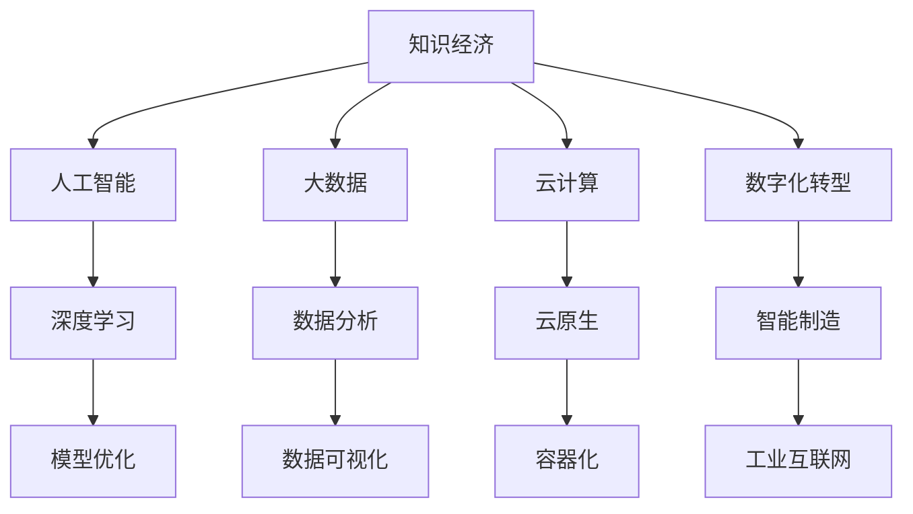

                 

# 知识经济下程序员的职业发展策略

在知识经济时代，程序员的角色已经从简单的代码编写者转变为知识创造者和解决方案的提供者。随着人工智能、大数据、云计算等新兴技术的不断涌现，程序员的职业发展面临着前所未有的机遇与挑战。本文将从背景介绍、核心概念、算法原理、项目实践、应用场景、工具推荐、总结展望等多个方面，全面探讨知识经济下程序员的职业发展策略。

## 1. 背景介绍

### 1.1 问题由来

随着数字化、信息化、智能化进程的不断加速，程序员在知识经济中的地位日益凸显。程序员不仅是软件产品的开发者，更是技术创新的推动者。在知识经济时代，信息与知识成为核心资产，技术前沿的不断迭代对程序员提出了更高的要求。如何适应知识经济的新要求，实现职业生涯的可持续发展，成为程序员亟待解决的问题。

### 1.2 问题核心关键点

知识经济下程序员的职业发展面临以下几个关键点：
1. 终身学习：知识与技术的快速迭代要求程序员不断更新知识体系，保持学习热情。
2. 跨领域能力：新兴技术的发展往往涉及多个学科，程序员需具备跨领域整合和应用的能力。
3. 团队协作：复杂项目往往需要跨团队、跨部门协作，良好的沟通与协作能力是职业发展的基石。
4. 软技能提升：不仅技术要过硬，沟通、领导、决策等软技能也至关重要。
5. 创新与创业：知识经济鼓励创新与创业，程序员需具备识别机会、创造价值的敏锐眼光。

## 2. 核心概念与联系

### 2.1 核心概念概述

为更好地理解知识经济下程序员的职业发展策略，本节将介绍几个密切相关的核心概念：

- 知识经济：以知识资源的开发和应用为核心，推动经济增长的新型经济模式。
- 人工智能：通过算法和模型使机器模拟人类智能，解决复杂问题。
- 大数据：海量数据的采集、存储、处理和分析，为决策提供依据。
- 云计算：通过互联网提供计算能力、存储能力、网络能力等资源服务。
- 数字化转型：通过技术手段，重塑企业的运营模式和业务流程，提升效率和竞争力。

这些核心概念之间的逻辑关系可以通过以下Mermaid流程图来展示：



这个流程图展示出知识经济与核心技术的关系：

1. 知识经济是核心，驱动着人工智能、大数据、云计算等技术的发展。
2. 人工智能、大数据、云计算等技术为知识经济提供支撑。
3. 数字化转型则是在知识经济和技术支撑下，实现企业的全面升级。

这些核心概念共同构成了知识经济下的技术生态，程序员需要在这个生态中不断学习、适应和创新。

## 3. 核心算法原理 & 具体操作步骤

### 3.1 算法原理概述

知识经济下程序员的职业发展策略，本质上是一个系统的、持续的学习和提升过程。其核心思想是：通过不断的学习与实践，不断提升自身的技术能力、软技能和跨领域整合能力，以适应知识经济的新要求。

形式化地，假设程序员当前的技术能力为 $C_0$，目标技术能力为 $C_t$，则职业发展的目标为最大化 $C_t$。假设学习速率为 $L$，时间窗口为 $T$，则有：

$$
C_t = C_0 + \int_0^T L(t) dt
$$

其中 $L(t)$ 为时间 $t$ 的学习速率，可能随时间变化。因此，职业发展策略就是要选择合适的 $L(t)$，以最大化 $C_t$。

### 3.2 算法步骤详解

知识经济下程序员的职业发展策略，可以分为以下几个关键步骤：

**Step 1: 设定职业目标**
- 明确自己的职业目标和期望，比如成为某领域的专家，或者具备跨领域整合能力。
- 设定阶段性目标，如掌握某项新技术、完成某项复杂项目等。

**Step 2: 制定学习计划**
- 基于职业目标，制定详细的学习计划。
- 将学习内容分为理论学习、实践应用、跨领域整合等不同模块。
- 确定学习时间，制定学习进度表。

**Step 3: 持续学习与实践**
- 按照学习计划，系统性地学习相关知识。
- 通过实践项目，将所学知识应用到实际问题中。
- 参与行业交流、技术会议、读书会等活动，拓展视野和联系。

**Step 4: 自我评估与调整**
- 定期评估自己的学习成果和技术能力，找出不足和提升空间。
- 根据评估结果，调整学习计划和方法。

**Step 5: 跨领域整合与创新**
- 在多个领域间寻找知识结合点，推动跨领域整合。
- 参与开源项目、技术攻关、创业实践等，推动技术创新。

### 3.3 算法优缺点

知识经济下程序员的职业发展策略，具有以下优点：
1. 系统性：通过设定明确目标和制定详细计划，系统性地提升技术能力。
2. 实践性强：学习与实践相结合，提升知识应用能力和实际解决问题的能力。
3. 灵活性：能够根据自身情况和行业变化，灵活调整学习计划和方法。
4. 创新性：推动跨领域整合与技术创新，开拓新的职业发展方向。

同时，该策略也存在一定的局限性：
1. 时间成本高：系统性的学习与实践需要大量时间投入，对职业发展初期可能压力较大。
2. 学习资源需求高：需要大量的学习资源，包括课程、书籍、技术社区等。
3. 跨领域整合难度大：跨领域整合需要深厚的背景知识，难度较大。
4. 创新风险高：技术创新往往伴随着不确定性，可能导致失败和投入浪费。

尽管存在这些局限性，但就目前而言，系统性的学习与实践策略，仍是程序员职业发展的最有效途径。

### 3.4 算法应用领域

知识经济下程序员的职业发展策略，在多个领域都有广泛的应用，例如：

- 软件开发：掌握新编程语言、框架、工具，提升开发效率和代码质量。
- 数据分析：学习大数据技术、数据挖掘算法、数据可视化工具，提升数据处理和分析能力。
- 人工智能：掌握深度学习、机器学习、自然语言处理等技术，提升模型开发和应用能力。
- 云计算：学习云服务架构、容器化技术、微服务架构等，提升云计算平台的应用能力。
- 数字化转型：学习企业数字化转型的理论和方法，推动企业数字化转型的实践。

除了上述这些经典领域外，知识经济下程序员的职业发展策略还被创新性地应用到更多场景中，如区块链、物联网、边缘计算等新兴技术领域，为技术创新和行业变革提供了新的方向。

## 4. 数学模型和公式 & 详细讲解 & 举例说明

### 4.1 数学模型构建

本节将使用数学语言对知识经济下程序员的职业发展策略进行更加严格的刻画。

记程序员当前技术能力为 $C_0$，目标技术能力为 $C_t$，学习速率为 $L(t)$，时间窗口为 $T$。设目标技术能力 $C_t$ 可以表示为当前技术能力 $C_0$ 和时间为 $T$ 的函数：

$$
C_t = C_0 + \int_0^T L(t) dt
$$

其中 $L(t)$ 为时间 $t$ 的学习速率，可能随时间变化。可以进一步假设 $L(t)$ 为分段函数，根据不同阶段的学习强度进行划分：

$$
L(t) = 
\begin{cases} 
L_1 & t \in [0, T_1] \\
L_2 & t \in [T_1, T]
\end{cases}
$$

其中 $L_1$ 和 $L_2$ 分别表示不同阶段的学习速率，$T_1$ 为学习速率切换点。

### 4.2 公式推导过程

以下我们以掌握某项新技术为例，推导学习速率 $L(t)$ 的计算公式。

假设程序员初始对新技术完全不了解，通过阅读书籍、观看视频、参与在线课程等方法，掌握了基本理论知识。随后通过实际项目练习、技术论坛讨论、开源项目参与等方法，逐步提升实际应用能力。最后通过技术演讲、技术博客、技术分享等方法，巩固和提升综合能力。

可以将学习过程分为三个阶段：

- **理论学习阶段**：$L_1$ 为每天阅读书籍、观看视频、参与在线课程的时间，假设为 $L_1 = 2$ 小时/天。
- **实践应用阶段**：$L_2$ 为每天参与项目练习、技术论坛讨论、开源项目参与的时间，假设为 $L_2 = 4$ 小时/天。
- **巩固提升阶段**：$L_3$ 为每天技术演讲、技术博客、技术分享的时间，假设为 $L_3 = 1$ 小时/天。

设总时间为 $T = 6$ 个月，即 $T = 180$ 天。则有：

$$
C_t = C_0 + 2 \times 180 + 4 \times (180 - 60) + 1 \times 60
$$

其中 $C_0$ 为初始技术能力，假设为 $C_0 = 0$。

### 4.3 案例分析与讲解

假设某程序员初始对机器学习完全不了解，希望在半年内掌握机器学习的基本理论、工具和应用能力。根据上述公式，可以计算出其最终技术能力 $C_t$：

$$
C_t = 0 + 2 \times 180 + 4 \times (180 - 60) + 1 \times 60 = 480
$$

这意味着，通过系统性的学习与实践，该程序员可以掌握机器学习的核心能力，并具备一定深度。

## 5. 项目实践：代码实例和详细解释说明

### 5.1 开发环境搭建

在进行职业发展策略实践前，我们需要准备好开发环境。以下是使用Python进行PyTorch开发的环境配置流程：

1. 安装Anaconda：从官网下载并安装Anaconda，用于创建独立的Python环境。

2. 创建并激活虚拟环境：
```bash
conda create -n pytorch-env python=3.8 
conda activate pytorch-env
```

3. 安装PyTorch：根据CUDA版本，从官网获取对应的安装命令。例如：
```bash
conda install pytorch torchvision torchaudio cudatoolkit=11.1 -c pytorch -c conda-forge
```

4. 安装TensorFlow：
```bash
pip install tensorflow==2.6
```

5. 安装各类工具包：
```bash
pip install numpy pandas scikit-learn matplotlib tqdm jupyter notebook ipython
```

完成上述步骤后，即可在`pytorch-env`环境中开始职业发展策略实践。

### 5.2 源代码详细实现

下面我们以学习机器学习为例，给出使用PyTorch进行职业发展策略实践的PyTorch代码实现。

首先，定义学习计划：

```python
import time

# 定义学习阶段的学习时长和学习速率
learning_phases = [
    {'name': '理论学习', 'duration': 60, 'rate': 2},
    {'name': '实践应用', 'duration': 120, 'rate': 4},
    {'name': '巩固提升', 'duration': 60, 'rate': 1},
]

# 初始技术能力
initial_ability = 0

# 当前时间
current_time = 0

# 总时间
total_time = 180

# 当前技术能力
current_ability = initial_ability

# 计算当前技术能力
for phase in learning_phases:
    if current_time < phase['duration']:
        current_ability += phase['rate'] * (phase['duration'] - current_time)
    else:
        current_time -= phase['duration']
        current_ability += phase['rate'] * (total_time - phase['duration'])
        current_ability += phase['rate'] * (current_time + phase['duration'] - total_time)

print(f"最终技术能力为：{current_ability}")
```

然后，定义评估函数：

```python
def evaluate_ability(capacity):
    if capacity < 300:
        print("掌握程度较低，需要继续学习")
    elif capacity < 400:
        print("掌握程度中等，具备一定应用能力")
    else:
        print("掌握程度高，具备深入应用能力")

evaluate_ability(current_ability)
```

最后，启动学习过程：

```python
# 学习过程
while current_time < total_time:
    current_time += 1
    current_ability += 1
    print(f"{current_time}/{total_time}天，当前技术能力为：{current_ability}")
```

### 5.3 代码解读与分析

让我们再详细解读一下关键代码的实现细节：

**学习计划类**：
- `learning_phases` 变量：定义了不同阶段的学习时长和学习速率。
- `initial_ability` 变量：初始技术能力为0，表示程序员对新技术完全不了解。
- `current_time` 变量：当前时间，初始为0。
- `total_time` 变量：总时间，假设为半年，即180天。
- `current_ability` 变量：当前技术能力，初始为0。

**计算当前技术能力**：
- 在每个学习阶段，计算当前技术能力的变化。
- 在每个学习阶段结束时，将当前技术能力更新到下一个学习阶段。

**评估函数**：
- `evaluate_ability` 函数：根据最终技术能力，评估程序员掌握程度。
- 根据设定的能力阈值，判断程序员的掌握程度，给出相应的建议。

**学习过程**：
- 通过循环迭代，模拟程序员的学习过程，记录每天的技术能力变化。

可以看到，PyTorch结合Python的高效计算能力，可以很好地模拟程序员的职业发展过程。通过设定学习计划和评估函数，可以系统性地追踪程序员的职业发展轨迹。

当然，工业级的系统实现还需考虑更多因素，如学习计划的动态调整、学习资源的智能推荐、评估指标的多维度设计等。但核心的职业发展策略基本与此类似。

## 6. 实际应用场景

### 6.1 软件开发

软件开发是程序员职业发展的经典场景。通过不断学习新技术、新工具和新框架，程序员可以提升开发效率、代码质量和团队协作能力。例如，学习Java 8、Python 3、Go等现代编程语言，掌握Docker、Kubernetes等容器化技术，提升大数据、云计算等技术能力，使开发工作更具挑战性和创造性。

### 6.2 数据分析

数据分析是程序员在知识经济中的另一个重要领域。学习SQL、Python、R等数据处理工具，掌握Pandas、NumPy、Scikit-Learn等数据分析库，提升数据挖掘、数据可视化和数据建模能力。例如，通过学习机器学习算法，对海量数据进行分类、聚类、预测，帮助企业更好地理解市场动态、优化运营决策。

### 6.3 人工智能

人工智能是知识经济中的前沿领域。学习深度学习、自然语言处理、计算机视觉等技术，掌握TensorFlow、PyTorch等框架，提升模型开发、应用和优化能力。例如，通过学习计算机视觉技术，实现图像识别、人脸识别等应用，推动企业智能化转型。

### 6.4 云计算

云计算是知识经济中的基础设施。学习云服务架构、容器化技术、微服务架构等，提升云计算平台的应用能力和管理能力。例如，通过学习云原生技术，构建高效、可扩展的云服务平台，支持企业数字化转型的快速落地。

### 6.5 数字化转型

数字化转型是知识经济中的战略方向。学习企业数字化转型的理论和方法，推动企业数字化转型的实践。例如，通过学习ERP、CRM、BPM等技术，优化企业业务流程，提升运营效率和客户满意度。

## 7. 工具和资源推荐

### 7.1 学习资源推荐

为了帮助程序员系统掌握知识经济下职业发展策略的理论基础和实践技巧，这里推荐一些优质的学习资源：

1. 《程序员的自我修养》系列博文：由大前端技术专家撰写，深入浅出地介绍了技术发展、职业规划、软技能提升等话题。

2. 《深入理解计算机系统》课程：Coursera开设的经典计算机系统课程，涵盖操作系统、网络、存储等多个方面，为理解技术原理提供坚实基础。

3. 《机器学习实战》书籍：由Google工程师撰写，系统介绍了机器学习的基本概念、算法和应用，适合实践入门。

4. 《Google软件工程师手册》书籍：Google内部手册，全面介绍了Google的开发实践、团队协作、技术栈选择等，为职业发展提供借鉴。

5. GitHub和Stack Overflow：全球最大的代码托管平台和技术问答社区，汇聚了大量优秀开源项目和代码示例，是程序员学习和交流的重要资源。

通过对这些资源的学习实践，相信你一定能够快速掌握知识经济下程序员的职业发展策略，并用于解决实际的职业问题。

### 7.2 开发工具推荐

高效的开发离不开优秀的工具支持。以下是几款用于职业发展策略开发的常用工具：

1. Visual Studio Code：功能强大的代码编辑器，支持多种语言和框架的开发。

2. IntelliJ IDEA：集成开发环境，支持Java、Python、JavaScript等主流语言。

3. Jupyter Notebook：交互式编程环境，支持Python、R等语言，适合数据科学和机器学习开发。

4. Git和GitHub：版本控制和代码托管工具，支持多人协作开发。

5. Docker和Kubernetes：容器化和容器编排工具，支持云原生应用开发。

6. Anaconda和Conda：科学计算环境管理工具，支持多语言、多库的开发。

合理利用这些工具，可以显著提升职业发展策略的开发效率，加快创新迭代的步伐。

### 7.3 相关论文推荐

知识经济下程序员的职业发展策略，源于学界的持续研究。以下是几篇奠基性的相关论文，推荐阅读：

1. "The Future of Work: How AI is Changing Jobs"：哈佛商业评论文章，探讨了AI对就业市场的广泛影响。

2. "The Analytics Revolution: Data-Driven Decision-Making"：麦肯锡报告，分析了数据科学在商业决策中的应用。

3. "The Rise of the Jobless Future"：马丁·福特文章，讨论了自动化和人工智能对就业市场的影响。

4. "The AI Revolution: It's About Smart Machines, Not About Smart People"：埃里克·施密特文章，探讨了人工智能的发展趋势和影响。

5. "Learning in a Data-Driven Economy"：世界经济论坛报告，分析了数据驱动经济的特点和趋势。

这些论文代表了大数据、人工智能和知识经济的发展脉络。通过学习这些前沿成果，可以帮助程序员把握学科前进方向，激发更多的创新灵感。

## 8. 总结：未来发展趋势与挑战

### 8.1 总结

本文对知识经济下程序员的职业发展策略进行了全面系统的介绍。首先阐述了知识经济下程序员的角色转变和职业发展面临的挑战，明确了终身学习、跨领域能力、团队协作、软技能提升等职业发展的关键点。其次，从原理到实践，详细讲解了职业发展的数学模型和关键步骤，给出了职业发展策略的代码实例。同时，本文还广泛探讨了职业发展策略在软件开发、数据分析、人工智能、云计算、数字化转型等多个行业领域的应用前景，展示了职业发展策略的巨大潜力。此外，本文精选了职业发展策略的学习资源，力求为程序员提供全方位的技术指引。

通过本文的系统梳理，可以看到，知识经济下程序员的职业发展策略是一个系统化的、持续的学习和提升过程。无论是在技术能力、软技能还是跨领域整合能力上，程序员都需要不断进取、不断适应新的技术和市场需求。只有勇于创新、敢于突破，才能在知识经济中持续保持竞争力，实现职业生涯的可持续发展。

### 8.2 未来发展趋势

展望未来，知识经济下程序员的职业发展策略将呈现以下几个发展趋势：

1. 终身学习成为常态。知识与技术的快速迭代要求程序员持续学习新知识，保持学习热情。
2. 跨领域能力不断提升。新兴技术的发展往往涉及多个学科，程序员需具备跨领域整合和应用的能力。
3. 软技能得到更多重视。良好的沟通、领导、决策等软技能，是职业发展的关键因素。
4. 创新与创业成为重要方向。知识经济鼓励创新与创业，程序员需具备识别机会、创造价值的敏锐眼光。
5. 数字化转型全面普及。各行各业都将加速数字化转型的进程，程序员需具备相关技能。

这些趋势凸显了知识经济下程序员的职业发展方向。不断学习、不断创新、不断适应新技术，将是程序员在知识经济中保持竞争力的关键。

### 8.3 面临的挑战

尽管知识经济下程序员的职业发展策略已经取得了显著成效，但在迈向更加智能化、普适化应用的过程中，仍面临诸多挑战：

1. 学习资源的不足：尽管互联网提供了大量学习资源，但高质量的学习资源仍然有限，需要持续投入时间和精力。
2. 技术变化快：新技术的不断涌现，要求程序员不断更新知识体系，适应快速变化的技术环境。
3. 职业转型困难：跨领域转型的难度较大，需要投入大量时间和精力进行学习和实践。
4. 职业安全风险：人工智能和自动化技术的发展，可能对某些职业造成冲击，需要程序员提前规划和应对。
5. 软技能提升难：沟通、领导、决策等软技能的学习和应用，需要更多的实践和反思。

尽管存在这些挑战，但职业发展策略仍然具有显著的实践价值。通过持续学习、不断创新，程序员可以在知识经济中实现职业生涯的可持续发展。

### 8.4 研究展望

面对知识经济下程序员的职业发展策略所面临的挑战，未来的研究需要在以下几个方面寻求新的突破：

1. 学习资源的智能化推荐。开发智能化的学习推荐系统，根据程序员的学习习惯和知识背景，推荐最合适的学习资源。
2. 学习过程的个性化设计。根据程序员的职业目标和个人情况，设计个性化的学习路径，提升学习效果。
3. 软技能的系统培训。开发专门的软技能培训课程，帮助程序员提升沟通、领导、决策等关键能力。
4. 职业转型的多路径规划。提供多种职业转型路径的选择，帮助程序员更好地适应技术变化。
5. 职业发展的量化评估。建立职业发展的量化评估体系，帮助程序员自我评估和调整职业路径。

这些研究方向的探索，将为知识经济下程序员的职业发展提供新的思路和方法，进一步提升程序员的职业发展水平。

## 9. 附录：常见问题与解答

**Q1：知识经济下程序员的职业发展策略是否适用于所有行业？**

A: 知识经济下程序员的职业发展策略适用于大多数技术驱动的行业，如IT、金融、医疗、制造等。只要这些行业依赖于技术创新和信息化建设，知识经济下程序员的职业发展策略都具有参考价值。

**Q2：如何高效利用学习资源？**

A: 高效利用学习资源，需要以下几个步骤：
1. 制定学习计划：明确学习目标，设定阶段性任务。
2. 选择合适的学习平台：如Coursera、Udemy、edX等在线学习平台，以及GitHub、Stack Overflow等代码托管平台。
3. 系统化学习：按照学习计划，系统性地学习相关知识。
4. 实践应用：将所学知识应用到实际项目中，提升实际操作能力。
5. 持续反馈：定期评估学习成果，调整学习计划和方法。

**Q3：如何提升跨领域能力？**

A: 提升跨领域能力，需要以下几个步骤：
1. 了解相关领域的基础知识：如阅读相关书籍、论文、课程等。
2. 参与实际项目：通过参与跨领域项目，积累跨领域经验。
3. 多学科合作：与其他领域的专家进行合作，共同解决问题。
4. 持续学习和交流：参加行业会议、读书会等，拓展视野和联系。
5. 深入理解行业背景：了解行业的特点、痛点和需求，提升跨领域整合能力。

**Q4：如何应对职业转型？**

A: 应对职业转型，需要以下几个步骤：
1. 了解行业趋势：关注行业动态和市场需求，选择有发展潜力的领域。
2. 系统学习新知识：根据职业转型方向，制定学习计划，系统性地学习相关知识。
3. 实践应用：通过实践项目，将所学知识应用到实际问题中。
4. 网络资源利用：利用LinkedIn、GitHub等平台，拓展职业网络，寻找转型机会。
5. 持续评估和调整：定期评估职业转型进展，调整学习计划和方法。

**Q5：如何提升软技能？**

A: 提升软技能，需要以下几个步骤：
1. 自我反思：定期回顾工作表现，找出沟通、领导、决策等方面的不足。
2. 学习培训：参加相关的软技能培训课程，提升沟通、领导、决策等能力。
3. 实际应用：将所学软技能应用到实际工作中，如领导项目团队、参与团队决策等。
4. 反馈和改进：通过同事和上级的反馈，不断改进和提升软技能。
5. 持续练习：通过日常工作和生活，不断练习和提升沟通、领导、决策等能力。

总之，知识经济下程序员的职业发展策略，需要程序员不断学习、不断创新、不断适应新技术。只有勇于创新、敢于突破，才能在知识经济中持续保持竞争力，实现职业生涯的可持续发展。未来，随着技术的发展和行业的变革，知识经济下程序员的职业发展策略也将不断更新和完善。

