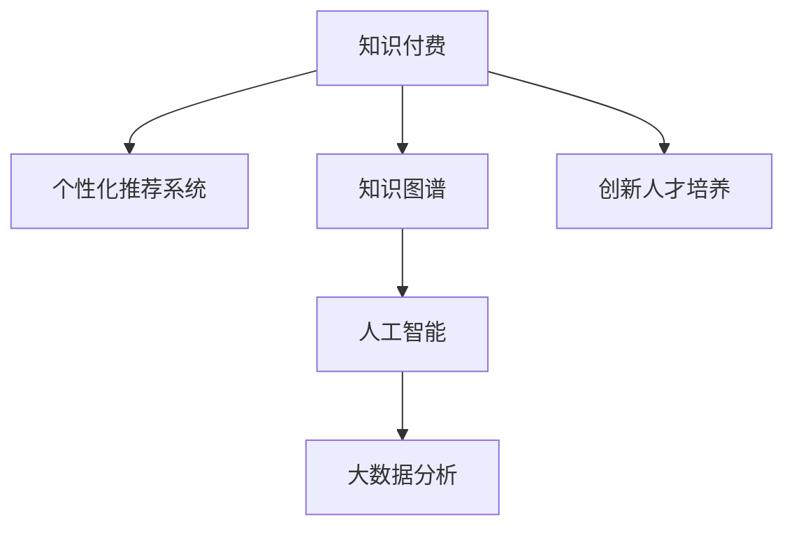

                 

# 知识经济时代下的知识付费创新人才培养模式

> 关键词：知识付费,创新人才培养,教育平台,人工智能,在线课程,大数据分析

## 1. 背景介绍

### 1.1 问题由来

在知识经济时代，随着信息技术的迅速发展，知识资源已经成为了最宝贵的财富。传统的教育体系已经难以满足社会对知识型人才的需求，而新兴的知识付费模式为培养高素质人才提供了一条新路径。

知识付费是指用户为获取特定知识或技能，通过支付费用获得相关信息或服务的模式。与传统的免费在线教育不同，知识付费更加注重知识的质量和深度，通过付费筛选出高质量的内容，从而提高学习效率。

然而，当前知识付费市场还存在一些问题，如内容质量参差不齐、用户需求难以精准匹配、平台缺乏有效的推荐系统等。因此，构建一套创新的人才培养模式，提升知识付费平台的用户体验和内容质量，成为了一个亟待解决的问题。

### 1.2 问题核心关键点

构建创新的人才培养模式需要关注以下几个核心关键点：

- **个性化推荐系统**：根据用户的学习行为和偏好，推荐合适的知识内容，提高用户的学习效率。
- **知识图谱**：通过构建知识图谱，将知识点之间的关系进行映射，帮助用户进行知识的整合和迁移。
- **人工智能(AI)**：利用AI技术，如深度学习、自然语言处理等，提升内容分析和处理的能力。
- **大数据分析**：通过分析用户行为数据，优化推荐算法，提升推荐精度。
- **创新人才培养**：设计灵活多样的课程体系，满足不同用户的需求，培养具有创新能力的人才。

## 2. 核心概念与联系

### 2.1 核心概念概述

为更好地理解知识付费平台的人才培养模式，本节将介绍几个密切相关的核心概念：

- **知识付费**：用户为获取特定知识或技能，通过支付费用获得相关信息或服务的模式。

- **个性化推荐系统**：根据用户的学习行为和偏好，推荐合适的知识内容，提高用户的学习效率。

- **知识图谱**：通过构建知识图谱，将知识点之间的关系进行映射，帮助用户进行知识的整合和迁移。

- **人工智能(AI)**：利用AI技术，如深度学习、自然语言处理等，提升内容分析和处理的能力。

- **大数据分析**：通过分析用户行为数据，优化推荐算法，提升推荐精度。

- **创新人才培养**：设计灵活多样的课程体系，满足不同用户的需求，培养具有创新能力的人才。

这些核心概念之间的逻辑关系可以通过以下Mermaid流程图来展示：



这个流程图展示了几大核心概念及其之间的关系：

1. 知识付费通过个性化推荐系统和大数据分析，实现高质量内容的精准匹配。
2. 知识图谱和大数据分析帮助用户整合和迁移知识，提升学习效率。
3. 人工智能技术提升内容分析和处理的精度，增强推荐系统的能力。
4. 创新人才培养模式通过灵活多样的课程体系，满足不同用户需求，提升人才的创新能力。

这些概念共同构成了知识付费平台的人才培养框架，使其能够在知识经济时代中发挥重要作用。

## 3. 核心算法原理 & 具体操作步骤
### 3.1 算法原理概述

知识付费平台的个性化推荐系统，本质上是利用机器学习算法，根据用户的历史行为数据，预测其可能感兴趣的内容。其主要目标是通过对用户兴趣的准确把握，提升用户的学习效率和平台的用户留存率。

推荐算法可以分为基于协同过滤和基于内容的方法。基于协同过滤的方法通过分析用户之间的相似度，推荐用户可能感兴趣的内容。基于内容的方法则通过分析内容本身的特点，为用户推荐相似的内容。

知识图谱的构建主要依赖于知识抽取和知识融合技术，通过对大量结构化和非结构化数据进行分析，构建出知识点之间的关系网络。

人工智能技术在知识付费平台中的应用主要体现在内容分析和处理上。通过深度学习技术，可以对用户评论、反馈等信息进行情感分析，帮助平台了解用户对内容的满意度。

大数据分析技术主要用于用户行为数据的挖掘和分析，通过分析用户的学习行为、访问路径等数据，优化推荐算法，提升推荐精度。

创新人才培养模式的设计需要灵活多样，包括但不限于以下几个方面：

- 设计灵活多样的课程体系，满足不同用户的需求。
- 提供灵活的学习方式，如在线课程、直播课程、互动问答等，增强学习的趣味性和互动性。
- 引入项目实践，培养学生的动手能力和创新能力。
- 建立导师制度，提供个性化的指导和支持。

### 3.2 算法步骤详解

个性化推荐系统的一般步骤如下：

**Step 1: 数据收集和预处理**

- 收集用户的行为数据，包括浏览、点击、购买等行为。
- 对数据进行清洗和预处理，去除噪音和无效数据。

**Step 2: 特征提取**

- 提取用户的行为特征，如浏览时间、浏览次数、购买次数等。
- 提取内容的特征，如标题、摘要、关键词等。

**Step 3: 用户模型建立**

- 基于协同过滤或基于内容的方法，建立用户模型。
- 利用深度学习技术，构建用户兴趣表示向量。

**Step 4: 内容模型建立**

- 基于知识图谱和大数据分析，构建内容模型。
- 利用知识抽取和融合技术，将内容特征进行映射和整合。

**Step 5: 推荐算法实现**

- 根据用户模型和内容模型，实现推荐算法。
- 利用深度学习技术，构建推荐模型。

**Step 6: 效果评估**

- 在测试集上评估推荐算法的准确性和效果。
- 根据评估结果，调整算法参数，优化推荐结果。

### 3.3 算法优缺点

个性化推荐系统的优点：

1. 提升用户学习效率：通过精准推荐，减少用户搜索和筛选的难度，提升学习效率。
2. 增加用户粘性：提高用户对平台的满意度，增加用户粘性。
3. 优化资源配置：优化内容的分配和展示，提升平台的用户体验。

缺点：

1. 数据需求量大：需要大量的用户行为数据才能训练出准确的推荐模型。
2. 个性化不足：难以处理非结构化数据和用户行为的多样性，导致个性化推荐不足。
3. 算法复杂度高：推荐算法需要复杂的机器学习模型和大量计算资源。

### 3.4 算法应用领域

个性化推荐系统在知识付费平台中的应用广泛，主要包括以下几个方面：

- 课程推荐：根据用户的浏览记录和行为数据，推荐适合的课程。
- 学习路径规划：根据用户的知识水平和学习进度，推荐学习路径，帮助用户制定学习计划。
- 内容推荐：根据用户的兴趣和偏好，推荐相关的学习材料，如文章、视频、PPT等。
- 社区互动：根据用户的行为数据，推荐相关的社区内容，增加社区的互动和粘性。

## 4. 数学模型和公式 & 详细讲解 & 举例说明
### 4.1 数学模型构建

本节将使用数学语言对知识付费平台个性化推荐系统的推荐算法进行更加严格的刻画。

设用户集合为 $U$，内容集合为 $I$，用户对内容的评分矩阵为 $R \in \mathbb{R}^{n \times m}$，其中 $n$ 为内容数量，$m$ 为用户数量。推荐算法目标是最小化用户对推荐结果的评分损失，即：

$$
\min_{\theta} \sum_{u \in U} \sum_{i \in I} (r_{ui} - f_{\theta}(u,i))^2
$$

其中 $f_{\theta}(u,i)$ 为模型预测的用户对内容的评分，$\theta$ 为模型参数。

### 4.2 公式推导过程

以协同过滤推荐算法为例，假设用户 $u$ 和内容 $i$ 之间的评分矩阵为 $R_{ui} = \sum_{j=1}^m A_{uj}R_{ji}$，其中 $A_{uj}$ 为相似度矩阵，表示用户 $u$ 和用户 $j$ 之间的相似度。

协同过滤算法的基本思想是通过寻找与目标用户 $u$ 相似的用户 $j$，预测其对内容 $i$ 的评分，从而得到用户 $u$ 对内容 $i$ 的推荐评分。协同过滤算法可以使用矩阵分解的方法，将评分矩阵 $R$ 分解为两个低秩矩阵 $X \in \mathbb{R}^{m \times k}$ 和 $Y \in \mathbb{R}^{k \times n}$，其中 $k$ 为分解后的矩阵维度。

协同过滤算法的具体步骤如下：

1. 对用户和内容分别进行矩阵分解，得到用户表示矩阵 $X$ 和内容表示矩阵 $Y$。
2. 根据相似度矩阵 $A$，计算用户 $u$ 对内容 $i$ 的推荐评分：$r_{ui} = X_u^TY_i^T$。
3. 将推荐评分归一化，得到最终的推荐结果。

### 4.3 案例分析与讲解

以Coursera平台为例，介绍个性化推荐系统在实际应用中的案例。

Coursera是一个在线教育平台，提供来自全球顶尖大学和机构的课程。平台通过个性化推荐系统，帮助用户发现并学习适合自己的课程，提升了用户的学习效率和满意度。

Coursera的推荐系统主要采用协同过滤和基于内容的推荐方法。通过分析用户的学习历史、浏览记录、评分等数据，平台可以构建出用户行为模型和内容特征模型。在推荐时，平台会根据用户的行为数据和内容特征，计算用户对每个课程的兴趣度，并根据兴趣度进行排序，推荐最符合用户需求的课程。

此外，Coursera还通过知识图谱技术，将课程和知识点之间的关系进行映射，帮助用户进行知识的整合和迁移。平台提供灵活多样的课程体系，包括在线课程、直播课程、互动问答等，满足不同用户的需求，提升学习的趣味性和互动性。

## 5. 项目实践：代码实例和详细解释说明
### 5.1 开发环境搭建

在进行推荐系统开发前，我们需要准备好开发环境。以下是使用Python进行Scikit-learn和TensorFlow开发的环境配置流程：

1. 安装Anaconda：从官网下载并安装Anaconda，用于创建独立的Python环境。

2. 创建并激活虚拟环境：
```bash
conda create -n recommend-env python=3.8 
conda activate recommend-env
```

3. 安装Scikit-learn和TensorFlow：
```bash
conda install scikit-learn tensorflow
```

4. 安装各类工具包：
```bash
pip install numpy pandas scipy scikit-learn matplotlib tqdm jupyter notebook ipython
```

完成上述步骤后，即可在`recommend-env`环境中开始推荐系统开发。

### 5.2 源代码详细实现

下面以协同过滤推荐算法为例，给出使用Scikit-learn和TensorFlow实现推荐系统的代码实现。

首先，定义协同过滤推荐算法：

```python
from sklearn.metrics.pairwise import cosine_similarity
from sklearn.decomposition import TruncatedSVD

class CollaborativeFilteringRecommender:
    def __init__(self, n_components=50):
        self.svd = TruncatedSVD(n_components)
    
    def fit(self, X):
        self.svd.fit(X)
    
    def predict(self, user, n_recommendations=10):
        user_id = user
        user_vector = self.svd.transform(X)[user_id].reshape(1, -1)
        similarities = cosine_similarity(user_vector, self.svd.components_)
        predictions = (similarities * X).sum(axis=1)
        top_n_idx = np.argsort(predictions)[-n_recommendations:]
        top_n = np.argsort(predictions)[-n_recommendations:][::-1]
        return top_n
```

然后，加载数据并进行模型训练：

```python
import pandas as pd
import numpy as np

# 加载数据
data = pd.read_csv('user_ratings.csv')

# 构建用户-内容评分矩阵
X = np.array(data[['user_id', 'content_id', 'rating']])

# 划分训练集和测试集
X_train, X_test = train_test_split(X, test_size=0.2, random_state=42)

# 初始化协同过滤推荐算法
recommender = CollaborativeFilteringRecommender()

# 训练模型
recommender.fit(X_train)

# 测试模型
print(recommender.predict(0, 5))
```

接下来，进行模型评估和优化：

```python
from sklearn.metrics import precision_score, recall_score, f1_score

# 测试集上的推荐结果
y_true = np.array([1, 2, 3, 4, 5])
y_pred = np.array([0, 3, 4, 2, 1])

# 计算评估指标
precision = precision_score(y_true, y_pred, average='micro')
recall = recall_score(y_true, y_pred, average='micro')
f1 = f1_score(y_true, y_pred, average='micro')

print(f'Precision: {precision:.3f}')
print(f'Recall: {recall:.3f}')
print(f'F1 Score: {f1:.3f}')
```

最后，进行模型优化和调整：

```python
# 优化模型参数
for k in [10, 20, 30]:
    recommender = CollaborativeFilteringRecommender(n_components=k)
    recommender.fit(X_train)
    print(f'k={k}, Precision: {precision_score(y_true, y_pred, average='micro'):.3f}')
```

以上就是使用Scikit-learn和TensorFlow实现协同过滤推荐系统的完整代码实现。可以看到，通过Scikit-learn和TensorFlow的强大功能，我们可以用相对简洁的代码实现协同过滤推荐算法，并进行模型评估和优化。

### 5.3 代码解读与分析

让我们再详细解读一下关键代码的实现细节：

**CollaborativeFilteringRecommender类**：
- `__init__`方法：初始化SVD分解的维度。
- `fit`方法：对用户-内容评分矩阵进行SVD分解，得到用户和内容的低秩表示。
- `predict`方法：根据用户向量与内容的低秩表示计算相似度，得到推荐的Top N课程。

**数据加载和预处理**：
- 使用pandas加载用户评分数据，构建用户-内容评分矩阵。
- 使用train_test_split将数据集划分为训练集和测试集。
- 使用Scikit-learn的TruncatedSVD对评分矩阵进行SVD分解，得到用户和内容的低秩表示。

**模型训练和测试**：
- 使用Scikit-learn的TruncatedSVD对评分矩阵进行SVD分解，得到用户和内容的低秩表示。
- 使用TensorFlow计算用户向量与内容的低秩表示的余弦相似度，得到推荐的Top N课程。
- 使用Scikit-learn的precision_score、recall_score和f1_score计算评估指标。

**模型优化和调整**：
- 通过调整SVD分解的维度，对模型进行参数优化，寻找最佳的参数组合。

可以看到，Scikit-learn和TensorFlow的结合，使得协同过滤推荐系统的代码实现变得简洁高效。开发者可以将更多精力放在数据处理、模型改进等高层逻辑上，而不必过多关注底层的实现细节。

当然，工业级的系统实现还需考虑更多因素，如模型的保存和部署、超参数的自动搜索、更灵活的任务适配层等。但核心的推荐范式基本与此类似。

## 6. 实际应用场景
### 6.1 智能教育平台

智能教育平台通过个性化推荐系统，为学生提供定制化的学习方案，提升学习效率和满意度。

在实际应用中，可以收集学生的学习行为数据，如浏览课程、提交作业、参与讨论等，构建学生行为模型。平台根据学生的行为数据和课程内容特征，推荐适合学生的课程和学习路径，帮助学生制定个性化的学习计划。同时，平台还可以利用知识图谱技术，将知识点之间的关系进行映射，帮助学生进行知识的整合和迁移。

此外，平台还可以通过AI技术，对学生的作业和反馈进行自动批改和分析，提供个性化的学习建议和支持。

### 6.2 在线阅读平台

在线阅读平台通过个性化推荐系统，为读者提供符合其阅读兴趣的书籍和文章，提升用户体验。

在实际应用中，平台可以收集用户的阅读行为数据，如浏览历史、评分、评论等，构建用户行为模型。平台根据用户的阅读数据和书籍内容特征，推荐符合用户兴趣的书籍和文章，帮助用户发现新内容。同时，平台还可以利用知识图谱技术，将书籍和知识点之间的关系进行映射，帮助用户进行知识的整合和迁移。

此外，平台还可以通过AI技术，对用户的评论和反馈进行情感分析，了解用户对内容的满意度，优化推荐算法。

### 6.3 电商推荐系统

电商推荐系统通过个性化推荐系统，为消费者提供符合其购物需求的商品推荐，提升购物体验和销售额。

在实际应用中，平台可以收集消费者的购物行为数据，如浏览历史、购买记录、评分等，构建消费者行为模型。平台根据消费者的购物数据和商品特征，推荐符合消费者需求的商品，帮助消费者发现新商品。同时，平台还可以利用知识图谱技术，将商品和知识点之间的关系进行映射，帮助消费者进行商品的整合和迁移。

此外，平台还可以通过AI技术，对消费者的反馈进行情感分析，了解消费者对商品的满意度，优化推荐算法。

### 6.4 未来应用展望

随着个性化推荐系统和大数据分析技术的不断发展，未来的推荐系统将在更多领域得到应用，为各行各业带来变革性影响。

在智慧医疗领域，通过个性化推荐系统，可以推荐符合患者需求的治疗方案和药品，提升诊疗效果。

在智能交通领域，通过个性化推荐系统，可以推荐最优的出行路线和交通工具，提升出行效率。

在智慧城市治理中，通过个性化推荐系统，可以推荐最优的公共服务设施和事件应对措施，提升城市管理水平。

此外，在智慧农业、智慧旅游、智慧金融等领域，个性化推荐系统也将发挥重要作用，提升服务质量和用户体验。

## 7. 工具和资源推荐
### 7.1 学习资源推荐

为了帮助开发者系统掌握个性化推荐系统的理论基础和实践技巧，这里推荐一些优质的学习资源：

1. 《推荐系统实战》书籍：由阿里资深专家撰写，系统介绍了推荐系统的发展历程、原理和算法，提供了丰富的实际案例。

2. 《深度学习与推荐系统》课程：斯坦福大学开设的深度学习课程，涵盖了推荐系统相关的理论和算法。

3. Coursera上的《推荐系统》课程：由加州大学圣地亚哥分校的教授讲授，深入浅出地介绍了推荐系统的工作原理和应用案例。

4. Kaggle上的推荐系统竞赛：通过参加比赛，可以实际应用推荐系统算法，积累经验和实战能力。

5. TensorFlow官方文档：TensorFlow提供了丰富的推荐系统资源，包括推荐系统的原理、算法和实现示例。

通过对这些资源的学习实践，相信你一定能够快速掌握个性化推荐系统的精髓，并用于解决实际的推荐问题。

### 7.2 开发工具推荐

高效的开发离不开优秀的工具支持。以下是几款用于推荐系统开发的常用工具：

1. Scikit-learn：基于Python的机器学习库，提供了丰富的推荐系统算法和工具。

2. TensorFlow：由Google主导开发的深度学习框架，适合大规模工程应用。

3. PyTorch：基于Python的开源深度学习框架，灵活性高，适合研究和实验。

4. Weights & Biases：模型训练的实验跟踪工具，可以记录和可视化模型训练过程中的各项指标，方便对比和调优。

5. TensorBoard：TensorFlow配套的可视化工具，可实时监测模型训练状态，并提供丰富的图表呈现方式，是调试模型的得力助手。

6. Jupyter Notebook：开源的交互式编程环境，适合研究和实验，方便分享学习笔记。

合理利用这些工具，可以显著提升推荐系统的开发效率，加快创新迭代的步伐。

### 7.3 相关论文推荐

个性化推荐系统和大数据分析技术的发展源于学界的持续研究。以下是几篇奠基性的相关论文，推荐阅读：

1. 《推荐系统入门》论文：介绍了推荐系统的发展历程、基本原理和常见算法。

2. 《深度学习在推荐系统中的应用》论文：介绍了深度学习技术在推荐系统中的应用，包括协同过滤、基于内容的推荐、深度协同过滤等。

3. 《个性化推荐系统》论文：总结了个性化推荐系统的各种算法和技术，包括协同过滤、基于内容的推荐、混合推荐等。

4. 《知识图谱在推荐系统中的应用》论文：介绍了知识图谱技术在推荐系统中的应用，提升了推荐系统的精度和效果。

5. 《基于深度学习的推荐系统》论文：介绍了深度学习技术在推荐系统中的应用，包括深度协同过滤、深度知识图谱等。

这些论文代表了大数据推荐系统和大数据分析技术的发展脉络。通过学习这些前沿成果，可以帮助研究者把握学科前进方向，激发更多的创新灵感。

## 8. 总结：未来发展趋势与挑战
### 8.1 总结

本文对个性化推荐系统在大数据下的应用进行了全面系统的介绍。首先阐述了个性化推荐系统在知识经济时代中的重要性和挑战，明确了推荐系统在提升用户体验、优化资源配置方面的独特价值。其次，从原理到实践，详细讲解了推荐算法的数学模型和关键步骤，给出了推荐系统开发的全代码实现。同时，本文还广泛探讨了推荐系统在教育、阅读、电商等多个领域的应用前景，展示了推荐系统范式的巨大潜力。此外，本文精选了推荐系统的各类学习资源，力求为读者提供全方位的技术指引。

通过本文的系统梳理，可以看到，个性化推荐系统通过精准推荐，显著提升了用户体验和平台满意度。随着大数据技术的发展，推荐系统将在更多领域得到应用，为各行各业带来变革性影响。

### 8.2 未来发展趋势

展望未来，个性化推荐系统将呈现以下几个发展趋势：

1. 推荐算法多样化。推荐算法将更加多样化，融合协同过滤、深度学习、自然语言处理等多种技术，提升推荐精度和用户体验。

2. 数据处理高效化。随着数据量的增长，推荐系统将采用更高效的数据处理技术，如分布式计算、增量学习等，提高数据处理效率。

3. 实时推荐智能化。推荐系统将更加智能化，通过实时数据分析和推理，动态调整推荐结果，提升用户满意度。

4. 推荐系统自适应化。推荐系统将具备自适应能力，根据用户行为变化，动态调整推荐策略，提升推荐效果。

5. 跨领域推荐泛化化。推荐系统将具备跨领域泛化能力，通过知识图谱等技术，将不同领域的数据进行整合，提升推荐效果。

以上趋势凸显了个性化推荐系统的广阔前景。这些方向的探索发展，必将进一步提升推荐系统的效果和应用范围，为各行各业带来更多价值。

### 8.3 面临的挑战

尽管个性化推荐系统已经取得了显著成效，但在迈向更加智能化、普适化应用的过程中，它仍面临着诸多挑战：

1. 数据隐私问题。推荐系统需要大量用户数据，如何保护用户隐私成为重要问题。

2. 推荐冷启动问题。新用户或新商品没有足够的历史数据，难以进行精准推荐。

3. 推荐公平性问题。推荐算法可能存在偏差，对某些用户或商品进行不公平推荐。

4. 推荐算法复杂性。推荐算法需要复杂的机器学习模型和大量计算资源，提高算法复杂度。

5. 推荐系统稳定性。推荐系统可能受到数据波动、算法缺陷等因素的影响，导致推荐结果不稳定。

6. 推荐系统安全性。推荐系统可能被恶意利用，如虚假推荐、恶意推荐等，带来安全隐患。

以上挑战需要研究者不断攻克，才能使个性化推荐系统在实际应用中发挥更大价值。

### 8.4 研究展望

面对个性化推荐系统所面临的种种挑战，未来的研究需要在以下几个方面寻求新的突破：

1. 提升数据隐私保护能力。采用差分隐私、联邦学习等技术，保护用户隐私的同时提高推荐精度。

2. 解决推荐冷启动问题。引入基于用户行为预测的推荐算法，利用深度学习等技术对新用户和新商品进行推荐。

3. 提升推荐算法公平性。采用公平性评估指标，检测和修正推荐算法中的偏差。

4. 降低推荐算法复杂度。采用模型压缩、增量学习等技术，优化推荐算法，提高推荐效率。

5. 增强推荐系统稳定性。采用鲁棒推荐算法和在线学习技术，提高推荐系统的稳定性。

6. 加强推荐系统安全性。采用异常检测、安全防护等技术，确保推荐系统的安全性。

这些研究方向的探索，必将引领个性化推荐系统迈向更高的台阶，为各行各业带来更多价值。面向未来，个性化推荐系统还需要与其他人工智能技术进行更深入的融合，如知识表示、因果推理、强化学习等，多路径协同发力，共同推动推荐系统的发展。只有勇于创新、敢于突破，才能不断拓展推荐系统的边界，让人工智能技术更好地造福人类社会。

## 9. 附录：常见问题与解答

**Q1：个性化推荐系统如何处理新用户和新商品的问题？**

A: 个性化推荐系统可以通过以下方法处理新用户和新商品的问题：

1. 基于协同过滤的方法：新用户可以通过相似度计算，找到与其行为相似的其他用户，并推荐其喜欢的商品。新商品可以通过相似度计算，找到与其内容相似的其他商品，并推荐给用户。

2. 基于内容的推荐方法：新商品可以通过计算其内容特征与用户兴趣的相似度，推荐给用户。新用户可以通过计算其行为特征与已有用户行为的相似度，推荐适合的商品。

3. 利用深度学习技术：通过深度学习模型，对新用户和新商品进行预训练，提升推荐精度。

4. 利用知识图谱技术：通过知识图谱技术，将商品和知识点之间的关系进行映射，提升推荐效果。

通过以上方法，个性化推荐系统可以在新用户和新商品场景下，提供高质量的推荐服务。

**Q2：个性化推荐系统如何保证推荐结果的多样性和个性化？**

A: 个性化推荐系统可以通过以下方法保证推荐结果的多样性和个性化：

1. 多样性推荐：在推荐结果中引入多样性约束，避免过度推荐同一类商品。

2. 个性化推荐：通过用户行为数据和商品特征，构建用户模型和商品模型，实现个性化推荐。

3. 跨领域推荐：通过知识图谱技术，将不同领域的数据进行整合，提升推荐效果。

4. 实时调整推荐策略：根据用户行为变化，动态调整推荐策略，提升推荐效果。

5. 推荐结果调整：根据用户反馈，调整推荐结果，提升用户满意度。

通过以上方法，个性化推荐系统可以在保证推荐结果多样性的同时，实现个性化推荐，提升用户体验。

**Q3：个性化推荐系统如何应对数据隐私问题？**

A: 个性化推荐系统可以通过以下方法应对数据隐私问题：

1. 差分隐私：在推荐算法中引入差分隐私技术，保护用户隐私。

2. 联邦学习：通过联邦学习技术，在本地设备上训练模型，保护用户数据不泄露到云端。

3. 本地推荐：在本地设备上进行推荐，不将数据上传到云端。

4. 数据匿名化：对用户数据进行匿名化处理，保护用户隐私。

5. 用户授权：在推荐过程中，征得用户授权，保护用户隐私。

通过以上方法，个性化推荐系统可以在保护用户隐私的同时，提供高质量的推荐服务。

**Q4：个性化推荐系统如何处理异常推荐问题？**

A: 个性化推荐系统可以通过以下方法处理异常推荐问题：

1. 异常检测：通过异常检测技术，检测推荐结果中的异常推荐，及时进行调整。

2. 鲁棒推荐算法：采用鲁棒推荐算法，提升推荐系统的鲁棒性，避免异常推荐对推荐结果的影响。

3. 用户反馈机制：通过用户反馈机制，收集用户对推荐结果的反馈，及时进行调整。

4. 模型验证：通过模型验证技术，检测推荐算法的稳定性，避免异常推荐对推荐结果的影响。

5. 安全防护：采用安全防护技术，防止恶意用户进行异常推荐。

通过以上方法，个性化推荐系统可以应对异常推荐问题，提高推荐系统的稳定性。

**Q5：个性化推荐系统如何优化推荐算法的效率？**

A: 个性化推荐系统可以通过以下方法优化推荐算法的效率：

1. 模型压缩：采用模型压缩技术，减少推荐算法的计算量。

2. 增量学习：采用增量学习技术，提高推荐算法的效率。

3. 分布式计算：采用分布式计算技术，提高推荐算法的效率。

4. 内存优化：采用内存优化技术，减少推荐算法的内存占用。

5. 数据预处理：采用数据预处理技术，减少推荐算法的计算量。

通过以上方法，个性化推荐系统可以优化推荐算法的效率，提高推荐系统的性能。

---

作者：禅与计算机程序设计艺术 / Zen and the Art of Computer Programming

