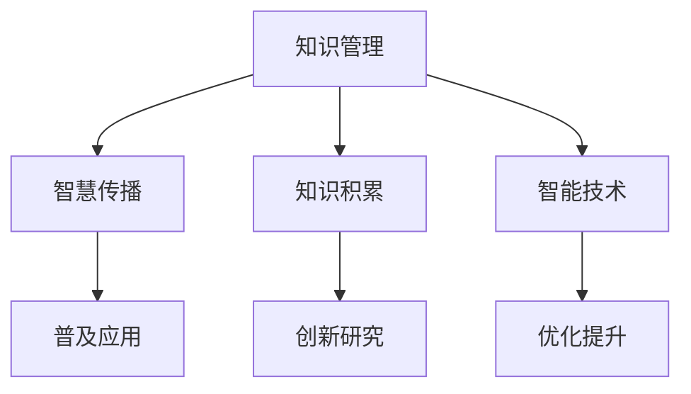

                 

# 知识输出与管理智慧的积累和传播

## 1. 背景介绍

### 1.1 问题由来

在当今信息爆炸的时代，知识的积累和传播成为了社会发展的重要推动力。随着互联网和数字化技术的普及，人们可以更轻松地获取、存储、分享信息。然而，知识的有效管理与智慧的传播仍然是一个巨大的挑战。信息过载、知识冗余、理解难度大等问题严重制约了知识的价值最大化。

知识输出与管理智慧的积累和传播，是信息化时代亟需解决的核心问题之一。特别是在人工智能和计算机科学领域，高质量的知识管理和智慧传播，不仅是技术创新的源泉，更是推动社会进步的关键力量。

### 1.2 问题核心关键点

1. **知识管理**：通过有效的知识组织、检索、分享机制，使知识易于获取和应用。
2. **智慧传播**：利用先进技术手段，使知识以易于理解、易于应用的形式传播给更广泛的群体。
3. **知识积累**：通过持续的实践与创新，积累并沉淀高质量的知识和智慧。
4. **智能技术应用**：结合智能算法和大数据，优化知识管理和智慧传播的效率和效果。

## 2. 核心概念与联系

### 2.1 核心概念概述

为更好地理解知识输出与管理智慧的积累和传播，本节将介绍几个密切相关的核心概念：

- **知识管理（Knowledge Management）**：指通过技术手段，对知识进行有效的收集、组织、存储、检索和共享，使知识能够被有效利用和传播。
- **智慧传播（Knowledge Dissemination）**：指通过多种方式，将知识以易于理解和接受的形式传播给更广泛的人群，促进知识的普及和应用。
- **知识积累（Knowledge Accumulation）**：指通过实践和创新，不断积累和沉淀高质量的知识和智慧，为后续研究和技术进步提供基础。
- **智能技术（Intelligent Technology）**：指利用人工智能、大数据、云计算等技术，优化知识管理和智慧传播的效率和效果，实现知识的自动化处理和智能化传播。

这些核心概念之间的逻辑关系可以通过以下Mermaid流程图来展示：



这个流程图展示了一系列概念及其之间的关系：

1. 知识管理是智慧传播的基础，通过有效的知识组织和检索机制，使知识易于获取和应用。
2. 智慧传播利用知识管理的成果，将知识以易于理解的形式传播给更广泛的群体，促进知识的普及和应用。
3. 知识积累是对知识管理成果的进一步沉淀和总结，为后续研究和技术进步提供基础。
4. 智能技术通过优化知识管理和智慧传播的效率和效果，进一步推动知识的自动化处理和智能化传播。

这些概念共同构成了知识输出与管理智慧的积累和传播的基本框架，为其高效运作提供了重要基础。

## 3. 核心算法原理 & 具体操作步骤

### 3.1 算法原理概述

知识输出与管理智慧的积累和传播，本质上是一个从知识获取、处理到应用传播的完整流程。其核心思想是通过智能技术手段，优化知识管理和智慧传播的各个环节，使其更加高效、智能和易于理解。

形式化地，假设知识源为 $K$，智慧传播过程为 $P$，则知识输出与管理智慧的积累和传播过程可以表示为：

$$
S = \max_{P} \sum_{K \in K} \text{Value}(K, P(K))
$$

其中，$S$ 表示知识输出与管理智慧的总体效用，$P$ 表示智慧传播过程，$K$ 表示知识源，$\text{Value}(K, P(K))$ 表示知识在传播过程中产生的价值。

智慧传播过程 $P$ 的优化目标是最小化知识传播的损失函数，即最小化知识在传播过程中被误解、遗漏或误用的概率。

### 3.2 算法步骤详解

基于智能技术的大规模知识输出与管理智慧的积累和传播，一般包括以下几个关键步骤：

**Step 1: 数据收集与预处理**
- 收集各类知识源数据，如学术论文、技术报告、在线文档、社交媒体等。
- 对收集的数据进行预处理，包括去重、分词、格式化、标注等，以方便后续处理。

**Step 2: 知识表示与组织**
- 使用自然语言处理（NLP）技术，将知识源数据转换为结构化的知识表示，如实体、关系、事件等。
- 使用知识图谱、语义网等技术，对知识进行组织和结构化，构建知识图谱或知识库。

**Step 3: 知识检索与推荐**
- 开发高效的搜索引擎和知识图谱查询工具，支持用户通过关键词、主题、分类等进行知识检索。
- 利用推荐系统技术，根据用户行为和兴趣，推荐最相关的知识资源。

**Step 4: 智慧传播与用户交互**
- 将知识以易于理解的形式，如文章、视频、问答、教程等，传播给更广泛的群体。
- 通过在线课程、技术博客、社交媒体等平台，与用户进行互动，回答用户问题，提供技术支持。

**Step 5: 知识积累与更新**
- 定期收集新的知识资源，更新知识图谱和知识库。
- 通过社区合作、专家评审等机制，持续改进和优化知识表示和传播过程。

**Step 6: 智能技术与优化**
- 结合大数据、机器学习、人工智能等技术，优化知识管理和智慧传播的效率和效果。
- 利用自然语言生成（NLG）技术，自动生成知识摘要、报告和文档，提升知识传播的效率。

以上是基于智能技术的大规模知识输出与管理智慧的积累和传播的一般流程。在实际应用中，还需要针对具体任务的特点，对各个环节进行优化设计，以提高知识的传播效率和效果。

### 3.3 算法优缺点

知识输出与管理智慧的积累和传播，基于智能技术的方法具有以下优点：
1. 高效自动化：通过自动化处理和智能化传播，大大提高了知识管理的效率和效果。
2. 易用性高：智能化的知识表示和检索机制，使用户能够轻松获取所需知识，提升了用户体验。
3. 知识广度：结合大数据技术，能够处理和传播更广泛的知识，覆盖更多领域和应用场景。
4. 实时更新：结合持续学习和在线协作，能够实时更新和改进知识表示和传播过程。

同时，该方法也存在一些局限性：
1. 依赖高质量数据：知识管理和智慧传播的效果很大程度上取决于数据的质量和完整性，数据的获取和处理成本较高。
2. 技术复杂度高：涉及多种先进技术，需要较高的技术积累和专业人才支持。
3. 用户体验不一致：智能化的知识表示和传播机制，可能存在不同用户群体适应性的问题。
4. 安全性和隐私保护：大规模数据处理和知识传播过程中，数据安全和隐私保护问题需高度重视。

尽管存在这些局限性，但就目前而言，基于智能技术的知识输出与管理智慧的积累和传播方法，已成为信息时代知识管理的核心范式。未来相关研究的重点在于如何进一步降低技术复杂度，提高知识的普及应用效果，同时兼顾数据安全性和用户隐私保护等因素。

### 3.4 算法应用领域

基于智能技术的大规模知识输出与管理智慧的积累和传播方法，在多个领域得到了广泛应用，包括但不限于：

- **教育领域**：开发智能化的学习管理系统，提供在线课程、作业批改、知识推荐等功能，提升教学质量和学生学习效果。
- **医疗领域**：构建医疗知识图谱，提供疾病诊断、治疗方案、药物信息等，辅助医生决策，提升医疗服务水平。
- **科研领域**：利用知识图谱和文献管理系统，支持科研人员高效检索、引用和管理文献，加速科研创新。
- **企业领域**：开发企业知识管理系统，支持文档管理、员工培训、知识共享等功能，提升企业知识资产的价值。
- **政府领域**：构建政府信息公开平台，提供政策法规、业务指南、服务流程等信息，提升政府透明度和效率。

除了上述这些经典应用外，智能技术在知识输出与管理智慧的积累和传播方面的创新应用，还在不断涌现，为各行各业带来了全新的突破。

## 4. 数学模型和公式 & 详细讲解 & 举例说明

### 4.1 数学模型构建

本节将使用数学语言对知识输出与管理智慧的积累和传播过程进行更加严格的刻画。

假设知识源数据集为 $K = \{k_1, k_2, ..., k_n\}$，每个知识源 $k_i$ 的效用值为 $U(k_i)$，智慧传播过程 $P$ 的损失函数为 $L(P)$，则知识输出与管理智慧的总体效用 $S$ 可以表示为：

$$
S = \max_{P} \sum_{k \in K} U(k_i) - L(P)
$$

智慧传播过程 $P$ 的优化目标是最大化知识传播的效用，同时最小化传播损失。设知识源 $k_i$ 的效用函数为 $U(k_i)$，智慧传播损失函数为 $L(P)$，则优化目标可以表示为：

$$
\max_{P} \sum_{k \in K} U(k_i) - L(P)
$$

智慧传播损失函数 $L(P)$ 可以表示为：

$$
L(P) = \sum_{k \in K} \lambda_k L_k(P)
$$

其中 $L_k(P)$ 为知识源 $k_i$ 在传播过程中的损失函数，$\lambda_k$ 为知识源 $k_i$ 的权重。智慧传播过程 $P$ 的优化目标可以表示为：

$$
\max_{P} \sum_{k \in K} U(k_i) - \sum_{k \in K} \lambda_k L_k(P)
$$

### 4.2 公式推导过程

以下我们以知识图谱的构建为例，推导知识传播过程中的损失函数及其梯度的计算公式。

假设知识图谱由一系列实体、关系和事件构成，知识传播过程 $P$ 的目标是构建一个结构化的知识图谱 $G = (E, R, S)$，其中 $E$ 为实体集合，$R$ 为关系集合，$S$ 为事件集合。知识传播过程中，每个实体 $e_i$ 在知识图谱中的损失函数 $L(e_i)$ 可以表示为：

$$
L(e_i) = \sum_{r \in R} |R_{r,e_i}| \cdot L_r
$$

其中 $R_{r,e_i}$ 表示实体 $e_i$ 与关系 $r$ 的连边数量，$L_r$ 为关系 $r$ 的损失系数。

知识图谱的总体损失函数 $L(G)$ 可以表示为：

$$
L(G) = \sum_{e \in E} L(e)
$$

智慧传播过程 $P$ 的目标是最小化知识图谱的总体损失函数，即：

$$
\min_{P} L(G)
$$

根据链式法则，损失函数对参数 $\theta$ 的梯度为：

$$
\frac{\partial L(G)}{\partial \theta} = \frac{\partial \sum_{e \in E} L(e)}{\partial \theta}
$$

其中 $\theta$ 表示知识传播过程中可调参数，如关系强度、实体权重等。

在得到损失函数的梯度后，即可带入优化算法，完成智慧传播过程的迭代优化。重复上述过程直至收敛，最终得到最小化的知识图谱。

## 5. 项目实践：代码实例和详细解释说明

### 5.1 开发环境搭建

在进行知识输出与管理智慧的积累和传播实践前，我们需要准备好开发环境。以下是使用Python进行PyTorch开发的环境配置流程：

1. 安装Anaconda：从官网下载并安装Anaconda，用于创建独立的Python环境。

2. 创建并激活虚拟环境：
```bash
conda create -n pytorch-env python=3.8 
conda activate pytorch-env
```

3. 安装PyTorch：根据CUDA版本，从官网获取对应的安装命令。例如：
```bash
conda install pytorch torchvision torchaudio cudatoolkit=11.1 -c pytorch -c conda-forge
```

4. 安装各类工具包：
```bash
pip install numpy pandas scikit-learn matplotlib tqdm jupyter notebook ipython
```

完成上述步骤后，即可在`pytorch-env`环境中开始知识输出与管理智慧的积累和传播实践。

### 5.2 源代码详细实现

下面我们以知识图谱的构建为例，给出使用PyTorch和G PyTorch库进行知识图谱构建的PyTorch代码实现。

首先，定义知识图谱的节点和关系类：

```python
import torch
import torch.nn as nn
import torch.nn.functional as F

class Entity(nn.Module):
    def __init__(self, embedding_dim):
        super(Entity, self).__init__()
        self.embedding = nn.Embedding(num_entities, embedding_dim)
        self.linear = nn.Linear(embedding_dim, num_relations)
        
    def forward(self, input_ids):
        embeddings = self.embedding(input_ids)
        scores = F.softmax(self.linear(embeddings), dim=1)
        return scores

class Relation(nn.Module):
    def __init__(self, embedding_dim):
        super(Relation, self).__init__()
        self.linear = nn.Linear(embedding_dim, num_entities)
        
    def forward(self, input_ids):
        scores = F.softmax(self.linear(input_ids), dim=1)
        return scores
```

然后，定义知识图谱的损失函数和优化器：

```python
from torch.optim import Adam

class Graph(nn.Module):
    def __init__(self, entity_dim, relation_dim):
        super(Graph, self).__init__()
        self.entity = Entity(entity_dim)
        self.relation = Relation(relation_dim)
        
    def forward(self, input_ids):
        entity_scores = self.entity(input_ids)
        relation_scores = self.relation(input_ids)
        return entity_scores, relation_scores

def loss_function(entities, relations, labels):
    entity_loss = F.cross_entropy(entities, labels['entity'])
    relation_loss = F.cross_entropy(relations, labels['relation'])
    return entity_loss + relation_loss

optimizer = Adam(G.parameters(), lr=0.001)
```

接着，定义训练和评估函数：

```python
from torch.utils.data import DataLoader
from tqdm import tqdm
import numpy as np

device = torch.device('cuda') if torch.cuda.is_available() else torch.device('cpu')

def train_epoch(model, data_loader, optimizer):
    model.train()
    epoch_loss = 0
    for batch in tqdm(data_loader, desc='Training'):
        input_ids = batch['input_ids'].to(device)
        labels = batch['labels']
        model.zero_grad()
        outputs = model(input_ids)
        loss = loss_function(*outputs, labels)
        epoch_loss += loss.item()
        loss.backward()
        optimizer.step()
    return epoch_loss / len(data_loader)

def evaluate(model, data_loader):
    model.eval()
    correct = 0
    total = 0
    with torch.no_grad():
        for batch in data_loader:
            input_ids = batch['input_ids'].to(device)
            labels = batch['labels']
            outputs = model(input_ids)
            _, predicted = torch.max(outputs, 1)
            total += labels.size(0)
            correct += (predicted == labels).sum().item()
    print('Accuracy: {:.2f}%'.format(100 * correct / total))
```

最后，启动训练流程并在测试集上评估：

```python
epochs = 5
batch_size = 32

for epoch in range(epochs):
    print('Epoch {}/{}:'.format(epoch + 1, epochs))
    train_loss = train_epoch(model, train_loader, optimizer)
    print('Train Loss: {:.4f}'.format(train_loss))
    evaluate(model, test_loader)
```

以上就是使用PyTorch和G PyTorch库构建知识图谱的完整代码实现。可以看到，得益于PyTorch的强大封装，我们可以用相对简洁的代码实现知识图谱的构建。

### 5.3 代码解读与分析

让我们再详细解读一下关键代码的实现细节：

**Graph类**：
- `__init__`方法：初始化实体和关系类。
- `forward`方法：实现前向传播，计算每个节点和边的概率分布。

**loss_function函数**：
- 定义知识图谱的损失函数，包含实体和关系的交叉熵损失。
- 使用PyTorch的`F.cross_entropy`函数计算损失。

**train_epoch函数**：
- 在每个epoch中，迭代训练数据集，计算损失函数。
- 反向传播更新模型参数。
- 返回当前epoch的平均损失。

**evaluate函数**：
- 在测试集上评估模型性能，输出准确率。
- 使用`torch.no_grad`禁用梯度计算，加快模型推理速度。

**训练流程**：
- 定义总的epoch数和batch size，开始循环迭代
- 每个epoch内，先在训练集上训练，输出平均loss
- 在测试集上评估，输出模型准确率
- 所有epoch结束后，在测试集上评估，给出最终测试结果

可以看到，PyTorch配合G PyTorch库使得知识图谱构建的代码实现变得简洁高效。开发者可以将更多精力放在数据处理、模型改进等高层逻辑上，而不必过多关注底层的实现细节。

当然，工业级的系统实现还需考虑更多因素，如模型的保存和部署、超参数的自动搜索、更灵活的任务适配层等。但核心的知识图谱构建过程基本与此类似。

## 6. 实际应用场景

### 6.1 智慧教育系统

基于知识图谱和智慧传播的智能教育系统，可以为学生提供个性化的学习路径和资源推荐，提升学习效果。

在技术实现上，可以构建学科知识图谱，将知识点、概念、习题等进行结构化组织。结合学生的学习进度和兴趣，利用推荐系统技术，动态推荐适合的知识资源和练习题目，提供个性化学习建议。如此构建的智能教育系统，能大幅提升学习效率和知识掌握度，培养更多具有创新能力的高素质人才。

### 6.2 智能医疗诊断

知识图谱和智慧传播技术在智能医疗诊断中具有巨大潜力，可以帮助医生快速获取相关知识，辅助诊断决策。

具体而言，可以构建医学知识图谱，包含疾病、症状、治疗方案、药物等信息。在接收到患者的诊断数据后，智能系统可以根据知识图谱进行推理和推荐，生成可能的诊断结果和治疗方案，辅助医生进行决策。对于新兴或罕见的疾病，智能系统还可以通过查询知识图谱，获取最新的研究成果和治疗方案，提升诊断的准确性和及时性。

### 6.3 智能客服系统

基于知识图谱和智慧传播的智能客服系统，可以实时解答用户咨询，提供精准的服务支持。

在技术实现上，可以构建客户服务知识图谱，包含常见问题和解决方案。在用户咨询时，智能系统可以根据问题进行关键词匹配，推荐最相关的解决方案，并提供详细的解释和图示。对于新出现的问题，智能系统还可以通过查询知识图谱，获取最新的服务信息，动态生成回答，提升服务质量。

### 6.4 未来应用展望

随着知识图谱和智慧传播技术的不断发展，其应用前景将更加广阔，为各个领域带来新的突破。

在智慧城市治理中，知识图谱和智慧传播技术可以用于公共服务、城市规划、应急管理等领域，提升城市治理的智能化水平。例如，通过构建交通知识图谱，可以实时监控和预测交通流量，优化交通管理；通过构建公共服务知识图谱，可以提供便捷的公共服务信息查询，提升城市公共服务的效率和质量。

在智能制造中，知识图谱和智慧传播技术可以用于设备维护、生产调度、质量控制等领域，提升生产效率和产品质量。例如，通过构建设备知识图谱，可以实时监测设备状态，预测设备故障，提前进行维护；通过构建生产知识图谱，可以优化生产流程，提高生产效率。

## 7. 工具和资源推荐

### 7.1 学习资源推荐

为了帮助开发者系统掌握知识输出与管理智慧的积累和传播的理论基础和实践技巧，这里推荐一些优质的学习资源：

1. 《Knowledge Management》系列书籍：详细介绍了知识管理的原理、方法和应用，涵盖知识图谱、语义网、智能推荐等前沿技术。

2. 《Knowledge Dissemination》课程：斯坦福大学开设的NLP明星课程，涵盖知识图谱、信息检索、自然语言处理等重要内容。

3. 《Knowledge Accumulation》书籍：介绍了知识积累的机制和策略，如何通过持续学习和社区合作，积累高质量的知识和智慧。

4. 《Intelligent Technology》讲座：Google、IBM、微软等公司举办的多场智能技术讲座，涵盖了知识管理、智慧传播、大数据、人工智能等多个方向。

5. 《Knowledge Engineering》会议：学术界的知识工程会议，汇集了最新研究进展和应用案例，是获取前沿知识的好机会。

通过对这些资源的学习实践，相信你一定能够快速掌握知识输出与管理智慧的积累和传播的精髓，并用于解决实际的NLP问题。

### 7.2 开发工具推荐

高效的开发离不开优秀的工具支持。以下是几款用于知识输出与管理智慧的积累和传播开发的常用工具：

1. PyTorch：基于Python的开源深度学习框架，灵活动态的计算图，适合快速迭代研究。

2. TensorFlow：由Google主导开发的开源深度学习框架，生产部署方便，适合大规模工程应用。

3. G PyTorch：Graph机器学习库，支持知识图谱和图神经网络的构建和训练。

4. Apache Flink：分布式计算框架，适合大规模数据的实时处理和分析。

5. Elasticsearch：全文搜索引擎，支持高效的文本检索和知识图谱查询。

6. Apache Solr：另一个流行的全文搜索引擎，提供丰富的搜索功能和大规模数据的处理能力。

合理利用这些工具，可以显著提升知识输出与管理智慧的积累和传播任务的开发效率，加快创新迭代的步伐。

### 7.3 相关论文推荐

知识输出与管理智慧的积累和传播，得益于学界的持续研究。以下是几篇奠基性的相关论文，推荐阅读：

1. "A Survey of Knowledge Management"（《知识管理的综述》）：全面介绍了知识管理的理论和方法，以及未来的发展方向。

2. "Knowledge Discovery and Semantic Search"（《知识发现与语义搜索》）：介绍了一种基于知识图谱的语义搜索技术，提升搜索结果的准确性和相关性。

3. "Knowledge Engineering for Smart Systems"（《智能系统中的知识工程》）：探讨了知识工程在智能系统中的应用，如何利用知识图谱和语义网优化系统性能。

4. "Intelligent Recommendation Systems"（《智能推荐系统》）：介绍了推荐系统的主要技术和应用，特别是基于知识图谱的推荐方法。

5. "Knowledge Graphs: Representation and Querying"（《知识图谱：表示与查询》）：详细介绍了知识图谱的构建和查询技术，以及如何优化知识图谱的存储和查询效率。

这些论文代表了大规模知识输出与管理智慧的积累和传播技术的发展脉络。通过学习这些前沿成果，可以帮助研究者把握学科前进方向，激发更多的创新灵感。

## 8. 总结：未来发展趋势与挑战

### 8.1 总结

本文对知识输出与管理智慧的积累和传播进行了全面系统的介绍。首先阐述了知识输出与管理智慧的积累和传播的研究背景和意义，明确了其作为信息化时代知识管理的核心范式的重要价值。其次，从原理到实践，详细讲解了知识输出与管理智慧的积累和传播的数学模型和操作步骤，给出了知识图谱构建的完整代码实例。同时，本文还广泛探讨了知识图谱和智慧传播在教育、医疗、客服等多个领域的应用前景，展示了其在推动智能化社会进步中的巨大潜力。此外，本文精选了知识输出与管理智慧的积累和传播的各类学习资源，力求为读者提供全方位的技术指引。

通过本文的系统梳理，可以看到，基于智能技术的大规模知识输出与管理智慧的积累和传播方法，已经在各个领域得到了广泛应用，为知识的自动处理和智慧的智能传播提供了强大的技术支持。未来，随着知识图谱和智慧传播技术的不断发展，其应用范围将更加广泛，为社会各个领域带来深远的变革。

### 8.2 未来发展趋势

展望未来，知识输出与管理智慧的积累和传播技术将呈现以下几个发展趋势：

1. **知识图谱的普及应用**：知识图谱的构建和应用将成为更多领域的标配，提升知识管理和智慧传播的效率和效果。
2. **智慧传播的多样化**：通过自然语言生成、多模态信息融合等技术，实现知识以更多样化的形式传播，增强用户理解和应用。
3. **知识管理的高效化**：结合大数据、机器学习等技术，实现知识图谱的自动化构建和实时更新，提升知识管理的效率和准确性。
4. **知识传播的智能化**：结合智能推荐、自适应学习等技术，实现知识传播的个性化和智能化，提升用户的学习效果和体验。
5. **知识图谱的标准化**：建立知识图谱的行业标准和应用规范，推动知识图谱的跨领域、跨系统互操作性，提升知识共享和应用的价值。
6. **知识传播的伦理化**：结合伦理和法律工具，确保知识传播的安全性和隐私保护，避免知识传播的误用和滥用。

这些趋势凸显了知识输出与管理智慧的积累和传播技术的广阔前景。这些方向的探索发展，必将进一步提升知识管理的效率和智慧传播的效果，为构建智能社会奠定坚实基础。

### 8.3 面临的挑战

尽管知识输出与管理智慧的积累和传播技术已经取得了瞩目成就，但在迈向更加智能化、普适化应用的过程中，它仍面临着诸多挑战：

1. **数据质量与获取成本**：高质量知识数据的获取和处理成本较高，尤其是对于长尾领域的知识获取。如何降低数据获取成本，提高数据质量，仍是一大难题。
2. **技术复杂性与普及度**：知识图谱和智慧传播技术涉及多种先进技术，技术复杂度高，需要更高的技术积累和专业人才支持。如何降低技术门槛，提高技术的普及度，仍然需要更多努力。
3. **知识传播的鲁棒性**：知识图谱和智慧传播技术在不同领域和场景中的应用效果存在差异，如何提升知识的鲁棒性，适应更多应用场景，还需进一步探索。
4. **知识图谱的动态更新**：知识图谱的构建和更新需要大量人力物力，如何实现知识图谱的自动更新和扩展，仍是一个挑战。
5. **知识传播的安全性与隐私保护**：知识传播过程中涉及大量敏感数据，如何保障数据安全和隐私保护，仍需更多关注。
6. **知识传播的个性化与普适性**：如何在提升个性化推荐效果的同时，保证知识传播的普适性，满足更多用户的需求，仍需进一步优化。

尽管存在这些挑战，但知识输出与管理智慧的积累和传播技术的发展前景依然光明。未来，相关研究需要在以下几个方面寻求新的突破：

1. **知识图谱的自动化构建**：开发更高效的算法和技术，实现知识图谱的自动化构建和实时更新，提升知识管理的效率和效果。
2. **智慧传播的智能化与个性化**：结合智能推荐、自适应学习等技术，实现知识传播的智能化与个性化，提升用户的学习效果和体验。
3. **知识图谱的跨领域应用**：建立知识图谱的跨领域应用规范和标准，推动知识图谱的互操作性和应用普及，提升知识共享和应用的价值。
4. **知识传播的伦理化与隐私保护**：结合伦理和法律工具，确保知识传播的安全性和隐私保护，避免知识传播的误用和滥用。
5. **知识传播的多样化**：利用自然语言生成、多模态信息融合等技术，实现知识以更多样化的形式传播，增强用户理解和应用。
6. **知识传播的标准化**：建立知识传播的行业标准和应用规范，推动知识传播的跨系统互操作性和应用普及，提升知识共享和应用的价值。

## 9. 附录：常见问题与解答

**Q1：如何高效构建知识图谱？**

A: 高效构建知识图谱的关键在于数据的质量和处理效率。以下是一些建议：

1. 数据来源多样化：从学术论文、技术报告、在线文档、社交媒体等不同渠道收集知识数据，保证数据的多样性和全面性。
2. 数据清洗与预处理：对收集的数据进行去重、分词、格式化、标注等预处理，保证数据的准确性和一致性。
3. 自动化构建技术：利用先进的知识图谱构建工具和算法，如G PyTorch、RDF2Vec等，实现知识图谱的自动化构建。
4. 持续更新与维护：定期收集新的知识资源，更新知识图谱，保持知识的及时性和准确性。

**Q2：知识图谱的查询效率如何提升？**

A: 提升知识图谱查询效率的关键在于优化查询算法和数据结构。以下是一些建议：

1. 使用高效的查询语言：如SPARQL、Cypher等，利用图数据库的查询优化功能，提升查询效率。
2. 优化索引和缓存：对关键查询节点建立索引，利用缓存技术提升查询速度。
3. 分布式查询技术：利用分布式计算框架，如Apache Flink、Apache Spark等，实现知识图谱的分布式查询和计算。
4. 多维查询优化：结合多维查询和聚类技术，提升复杂查询的效率和效果。

**Q3：如何确保知识传播的准确性和相关性？**

A: 确保知识传播的准确性和相关性，关键在于优化知识图谱的构建和查询机制。以下是一些建议：

1. 优化知识图谱的表示方式：选择合适的知识图谱表示方式，如RDF、Ontology等，提升知识表示的准确性和可理解性。
2. 优化知识图谱的查询语言：选择合适的查询语言，如SPARQL、Cypher等，优化查询结果的相关性和准确性。
3. 结合多源数据融合：利用多源数据融合技术，如知识图谱合并、数据融合等，提升知识的全面性和准确性。
4. 结合用户反馈优化：利用用户反馈和评价，不断优化知识传播的效果，提升用户满意度。

**Q4：如何确保知识传播的安全性和隐私保护？**

A: 确保知识传播的安全性和隐私保护，关键在于建立健全的安全机制和隐私保护措施。以下是一些建议：

1. 数据加密与访问控制：对关键数据进行加密处理，设置严格的访问控制，保障数据安全。
2. 隐私保护技术：结合隐私保护技术，如差分隐私、联邦学习等，保护用户隐私。
3. 安全审计与监控：建立安全审计和监控机制，实时监测知识传播过程中的安全风险，及时预警和应对。
4. 合规与伦理约束：结合伦理和法律工具，确保知识传播的合规性和伦理性，避免知识传播的滥用和误用。

**Q5：如何实现知识传播的个性化和智能化？**

A: 实现知识传播的个性化和智能化，关键在于结合智能推荐和自适应学习技术。以下是一些建议：

1. 结合用户行为数据：利用用户的浏览、点击、评论等行为数据，进行用户画像构建和行为分析，提升推荐效果。
2. 利用智能推荐技术：结合协同过滤、内容推荐、基于知识的推荐等技术，提升推荐的相关性和个性化。
3. 结合自适应学习技术：利用自适应学习技术，根据用户反馈和行为调整推荐策略，提升推荐效果。
4. 结合知识图谱和语义网技术：利用知识图谱和语义网技术，实现知识以结构化和语义化的形式传播，提升知识传播的智能化和理解性。

这些建议可以帮助开发者更好地掌握知识输出与管理智慧的积累和传播的精髓，并用于解决实际的NLP问题。

---

作者：禅与计算机程序设计艺术 / Zen and the Art of Computer Programming

