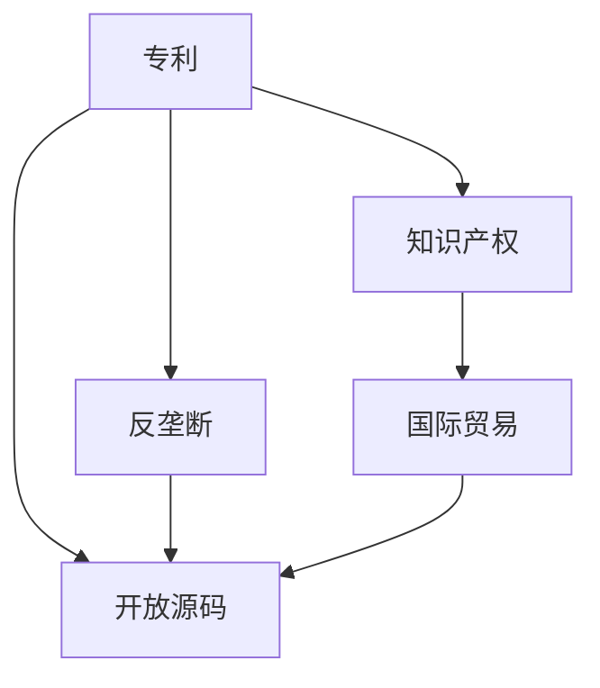

                 

## 1. 背景介绍

### 1.1 问题由来

硅谷作为全球科技创新中心，一直引领着世界科技潮流。然而，近年来，随着技术迭代速度的加快和知识产权问题的日益突出，硅谷的专利制度面临着前所未有的挑战。一方面，过于严格的专利保护导致了研发成本的急剧上升，抑制了创业创新的活力；另一方面，专利诉讼频发、高额赔偿金等现象引发了社会对专利制度公平性和合理性的广泛质疑。如何在保护知识产权与促进技术创新之间找到平衡，成为硅谷乃至全球知识产权法律界亟需解决的问题。

### 1.2 问题核心关键点

本文聚焦于硅谷专利制度的改革方向，主要从以下几个核心关键点展开：

- **专利保护与创新激励**：分析专利制度在保护知识产权和激励技术创新方面的双重作用，探讨当前制度下存在的激励不足和过度保护的问题。
- **专利诉讼与反垄断**：讨论专利诉讼频繁发生对市场竞争的影响，特别是对大公司和初创企业的不同影响，以及如何通过改革促进公平竞争。
- **开放源码与知识产权**：分析开源运动与专利制度之间的冲突与融合，探讨如何平衡二者的关系，促进技术共享和创新。
- **知识产权与国际贸易**：考察国际知识产权法律框架对硅谷的影响，特别是在保护知识产权与促进国际贸易自由化之间的平衡。
- **未来趋势与挑战**：展望未来专利制度的发展趋势，识别可能的挑战，提出解决方案。

这些核心关键点共同构成了硅谷专利制度改革的方向和目标，旨在通过深入分析和前瞻性思考，为硅谷乃至全球的知识产权法律体系提供有价值的参考和指导。

## 2. 核心概念与联系

### 2.1 核心概念概述

为更好地理解硅谷专利制度改革的方向，本节将介绍几个密切相关的核心概念：

- **专利（Patent）**：一种法律制度，授予发明者在一定期限内对其发明享有独占权，以防止他人未经许可的使用、制造和销售。
- **知识产权（IPR）**：涵盖专利、商标、版权等多种形式，旨在保护创作者在创意、发明、设计等方面的权益。
- **反垄断（Antitrust）**：法律框架，防止市场垄断，维护公平竞争。
- **开放源码（Open Source）**：一种软件共享模式，强调代码的开放性，促进协作创新。
- **国际贸易（International Trade）**：涉及商品、服务和知识产权的跨国交易，影响全球经济秩序和知识产权保护。

这些核心概念之间的逻辑关系可以通过以下Mermaid流程图来展示：



这个流程图展示了几者之间的核心关系：

1. 专利是知识产权的重要组成部分。
2. 反垄断法律保护知识产权，同时防止市场垄断。
3. 开放源码促进知识产权共享，但与专利制度存在冲突。
4. 国际贸易影响知识产权法律保护和市场竞争。

这些概念共同构成了硅谷专利制度的基础，其改革方向需要综合考虑各方利益和动态关系。

## 3. 核心算法原理 & 具体操作步骤

### 3.1 算法原理概述

硅谷专利制度的改革方向，从根本上说，是一种对现有制度进行优化和更新的过程。其核心思想是如何在保护知识产权与促进技术创新之间找到平衡，同时确保公平竞争，促进国际贸易，并支持开源运动。

### 3.2 算法步骤详解

改革过程大致可以分为以下几个步骤：

1. **评估现有制度**：对现有的专利制度进行全面评估，识别其存在的激励不足和过度保护问题。
2. **制定改革目标**：明确改革目标，如提高创新激励、降低诉讼成本、促进公平竞争等。
3. **设计改革方案**：提出具体的改革措施，如调整专利期限、优化授权标准、引入专利链接制度等。
4. **实施改革政策**：将改革方案付诸实践，逐步调整现行法律和政策。
5. **评估改革效果**：通过数据和实证研究，评估改革方案的效果，进行必要的调整和优化。

### 3.3 算法优缺点

硅谷专利制度的改革具有以下优点：

- **促进创新**：通过优化专利保护，降低研发成本，激励更多的技术创新。
- **公平竞争**：减少专利诉讼，促进大公司和初创企业之间的公平竞争。
- **促进开放源码**：通过调整专利授权方式，支持开源运动，促进技术共享。
- **促进国际贸易**：通过国际协调，确保知识产权保护的公平性和合理性，促进国际贸易自由化。

然而，改革过程也存在以下缺点：

- **实施难度大**：改革涉及法律、经济、技术等多方面因素，实施难度较大。
- **利益冲突**：不同利益团体之间可能存在冲突，改革过程中需要协调各方利益。
- **不确定性**：改革效果存在不确定性，需要长期的跟踪和评估。

### 3.4 算法应用领域

硅谷专利制度改革不仅影响科技产业，还涉及法律、经济、社会等多个领域，具体应用如下：

- **科技行业**：优化专利授权和保护方式，降低研发成本，激励技术创新。
- **法律领域**：调整专利诉讼和反垄断法律，促进公平竞争，维护市场秩序。
- **国际贸易**：通过国际协调，促进国际贸易自由化，保护知识产权。
- **社会文化**：推动知识产权文化的发展，提高社会对创新和知识产权的认识。

## 4. 数学模型和公式 & 详细讲解 & 举例说明

### 4.1 数学模型构建

假设专利保护期为 $T$ 年，每年研发成本为 $C$，专利授权概率为 $P$。则专利对创新的净激励效果可以建模为：

$$
\text{Net Incentive} = P \times (C \times T) - (1-P) \times C
$$

其中，$P \times (C \times T)$ 表示专利带来的净收益，$(1-P) \times C$ 表示没有专利保护下的研发成本。

### 4.2 公式推导过程

当专利保护期 $T$ 增加时，净激励效果 $\text{Net Incentive}$ 增加。但若 $T$ 过长，可能抑制后续创新。合理的 $T$ 应平衡创新激励和市场竞争，具体推导如下：

$$
\frac{\partial \text{Net Incentive}}{\partial T} = P \times C - \frac{P \times C \times T}{T} = P \times C(1 - \frac{1}{T})
$$

令 $\frac{\partial \text{Net Incentive}}{\partial T} = 0$，得 $T = \frac{1}{P \times C}$。因此，最优专利保护期 $T$ 与专利授权概率 $P$ 和研发成本 $C$ 相关。

### 4.3 案例分析与讲解

以谷歌为例，谷歌对专利授权和保护的态度影响其创新表现。谷歌长期以来积极参与专利诉讼，同时也致力于开源运动，支持开源项目。在专利保护期方面，谷歌主张保护期应与技术发展速度相匹配，避免过长的保护期抑制后续创新。谷歌的专利策略体现了其在专利制度改革中的积极探索，旨在找到平衡点，促进技术创新和市场竞争。

## 5. 项目实践：代码实例和详细解释说明

### 5.1 开发环境搭建

在进行专利制度改革的实践研究时，我们需要构建一个包含不同政策变量的仿真环境。以下是使用Python进行仿真建模的环境配置流程：

1. 安装Anaconda：从官网下载并安装Anaconda，用于创建独立的Python环境。

2. 创建并激活虚拟环境：
```bash
conda create -n patent-env python=3.8 
conda activate patent-env
```

3. 安装相关库：
```bash
pip install pandas numpy matplotlib seaborn
```

完成上述步骤后，即可在`patent-env`环境中开始仿真建模。

### 5.2 源代码详细实现

以下是一个简化版的专利保护期模型仿真示例，用于分析专利保护期 $T$ 对创新激励的影响：

```python
import numpy as np
import matplotlib.pyplot as plt

# 设定参数
P = 0.9  # 专利授权概率
C = 1000  # 每年研发成本
T_min = 10  # 最小专利保护期
T_max = 30  # 最大专利保护期
T = np.linspace(T_min, T_max, 100)  # 专利保护期范围

# 计算净激励效果
net_incentive = P * C * T - (1 - P) * C

# 绘制曲线
plt.plot(T, net_incentive)
plt.xlabel('Patent Protection Period')
plt.ylabel('Net Incentive')
plt.title('Net Incentive vs Patent Protection Period')
plt.show()
```

### 5.3 代码解读与分析

**代码实现**：
- `P` 和 `C` 分别表示专利授权概率和研发成本，是模拟过程中不变的参数。
- `T` 表示专利保护期，从 `T_min` 到 `T_max` 均匀地分布。
- `net_incentive` 表示专利带来的净收益，即 $P \times C \times T - (1 - P) \times C$。
- `plt` 用于绘制净激励效果随专利保护期的变化曲线。

**结果分析**：
- 随着专利保护期的增加，净激励效果先增后减，呈现倒U型曲线。
- 当专利保护期为 $T = \frac{1}{P \times C}$ 时，净激励效果达到最大值。
- 在实际应用中，需要根据专利授权概率和研发成本，合理设定专利保护期。

## 6. 实际应用场景

### 6.1 科技行业

在科技行业，专利制度对创新激励和技术竞争具有重要影响。以苹果公司和谷歌为例，两家公司在专利诉讼和开源运动中的不同策略，展现了硅谷专利制度改革的实际应用：

1. **苹果公司**：苹果一直积极进行专利诉讼，通过高额的赔偿金来保护其技术优势，但这种方式也被批评为过于激进，抑制了创新。
2. **谷歌公司**：谷歌不仅进行专利诉讼，还积极支持开源项目，推动技术共享和创新。谷歌通过Google Cloud Platform等平台，提供丰富的专利授权服务，促进市场竞争。

谷歌的专利策略体现了硅谷专利制度改革的多个方向：平衡专利保护和市场竞争，促进技术创新和公平竞争。

### 6.2 法律领域

硅谷专利制度的改革在法律领域也具有重要意义。以专利诉讼为例，频繁的专利诉讼不仅耗费大量司法资源，还可能导致市场分割，抑制竞争。通过改革专利诉讼制度，可以降低诉讼成本，促进公平竞争：

1. **诉讼成本**：调整专利诉讼的赔偿标准和诉讼程序，降低高额赔偿金的风险，减少市场分割。
2. **公平竞争**：加强对专利滥用行为的监管，防止大公司利用专利优势排除竞争对手。

这些改革措施旨在维护市场秩序，保护中小企业公平竞争。

### 6.3 国际贸易

硅谷专利制度的改革还对国际贸易产生重要影响。通过国际协调，硅谷可以更好地平衡知识产权保护和国际贸易自由化：

1. **知识产权保护**：在跨境交易中，保护知识产权，防止技术泄露和盗版。
2. **贸易自由化**：通过国际协议，如TRIPS协议，确保知识产权保护的公平性和合理性，促进国际贸易自由化。

国际贸易中的知识产权保护和自由化是一个复杂的平衡过程，需要多方协商和协调。

## 7. 工具和资源推荐

### 7.1 学习资源推荐

为了帮助开发者系统掌握硅谷专利制度改革的理论基础和实践技巧，这里推荐一些优质的学习资源：

1. **《硅谷专利法》**：一本详细介绍硅谷专利制度及其改革方向的经典书籍，适合深入研究专利法律和技术。
2. **《专利法》在线课程**：斯坦福大学法学院提供的在线课程，详细讲解专利法原理和实践。
3. **Open Source Initiative**：开源运动的权威组织，提供大量关于开源与专利法律的资源。
4. **WIPO（世界知识产权组织）**：提供关于国际知识产权保护的最新信息和政策。
5. **IEEE Journal on Emerging and Selected Topics in Computing Systems**：发表关于专利制度改革的最新研究成果和分析。

通过对这些资源的学习实践，相信你一定能够快速掌握硅谷专利制度改革的精髓，并用于解决实际的知识产权问题。

### 7.2 开发工具推荐

高效的开发离不开优秀的工具支持。以下是几款用于专利制度改革开发的常用工具：

1. **Python**：灵活的编程语言，支持科学计算和数据可视化，适合专利制度改革的仿真建模。
2. **R语言**：数据统计和可视化工具，适合数据分析和专利数据可视化。
3. **Gephi**：网络分析工具，用于绘制专利网络关系图，分析专利影响力。
4. **PATINFOMAN**：专利信息管理工具，支持专利文献检索和分析。
5. **PatentAdvisor**：专利法律顾问工具，提供专利申请和诉讼策略建议。

合理利用这些工具，可以显著提升专利制度改革的开发效率，加快创新迭代的步伐。

### 7.3 相关论文推荐

硅谷专利制度改革源于学界的持续研究。以下是几篇奠基性的相关论文，推荐阅读：

1. **"Patent Term Limits and Incentives for Research and Development"**：探讨专利保护期对研发激励的影响。
2. **"Patent Linking and Market-Based Remedies for Patent Litigation"**：研究专利链接制度对专利诉讼的影响。
3. **"The Effect of Patent Law on the Open Source Movement"**：分析专利法对开源运动的推动和限制。
4. **"International Trade and IP Law: A Comparative Perspective"**：考察国际知识产权法律框架对硅谷的影响。
5. **"The Future of Patent Law in a Digital Age"**：展望未来专利法的发展趋势和挑战。

这些论文代表了大规模专利制度改革的发展脉络。通过学习这些前沿成果，可以帮助研究者把握学科前进方向，激发更多的创新灵感。

## 8. 总结：未来发展趋势与挑战

### 8.1 总结

本文对硅谷专利制度的改革方向进行了全面系统的介绍。首先阐述了专利制度在保护知识产权和激励技术创新方面的双重作用，明确了当前制度下存在的激励不足和过度保护的问题。其次，从原理到实践，详细讲解了专利制度改革的数学模型和操作步骤，给出了专利制度改革的完整代码实例。同时，本文还广泛探讨了专利制度在科技行业、法律领域、国际贸易等多个行业领域的应用前景，展示了专利制度改革的巨大潜力。此外，本文精选了专利制度改革的各类学习资源，力求为读者提供全方位的技术指引。

通过本文的系统梳理，可以看到，硅谷专利制度的改革方向不仅有助于提升知识产权保护的公平性和合理性，还能促进技术创新和市场竞争。未来，伴随专利制度的持续演进，相信硅谷乃至全球的知识产权法律体系将进一步完善，为科技和经济发展提供更为坚实的保障。

### 8.2 未来发展趋势

展望未来，硅谷专利制度的改革将呈现以下几个发展趋势：

1. **专利授权更加灵活**：通过调整专利授权标准和期限，提高专利保护与技术创新的平衡性。
2. **专利诉讼制度优化**：简化诉讼程序，降低诉讼成本，促进公平竞争。
3. **国际协调加强**：通过国际协议，确保知识产权保护的公平性和合理性，促进国际贸易自由化。
4. **支持开源运动**：调整专利授权方式，支持开源项目，促进技术共享和创新。
5. **技术标准引入**：引入技术标准，提高专利审查和授权的透明度和公正性。

以上趋势凸显了硅谷专利制度改革的广阔前景。这些方向的探索发展，将进一步提升知识产权保护的效果，促进科技和经济的全面发展。

### 8.3 面临的挑战

尽管硅谷专利制度改革取得了一定的成效，但在迈向更加智能化、普适化应用的过程中，它仍面临着诸多挑战：

1. **法律与技术协调**：专利制度改革需要在法律和技术之间找到平衡，避免过度保护或保护不足。
2. **利益冲突协调**：不同利益团体之间可能存在冲突，改革过程中需要协调各方利益。
3. **执行难度大**：改革涉及法律、经济、技术等多方面因素，实施难度较大。
4. **不确定性**：改革效果存在不确定性，需要长期的跟踪和评估。
5. **公平性问题**：专利制度的调整可能对中小企业和小企业不利，需要进行公平性评估。

这些挑战需要在未来改革过程中予以充分考虑，并提出解决方案。

### 8.4 研究展望

面对硅谷专利制度改革所面临的种种挑战，未来的研究需要在以下几个方面寻求新的突破：

1. **专利授权的公平性**：研究如何平衡大公司和中小企业之间的利益，确保专利制度的公平性。
2. **专利保护期的合理性**：优化专利保护期，确保专利保护与技术发展的平衡。
3. **专利诉讼的效率化**：简化诉讼程序，降低诉讼成本，提高专利制度的效率。
4. **开源与专利的融合**：探索如何在支持开源运动的同时，保障专利权人的利益。
5. **国际协调的机制化**：建立国际协调机制，促进知识产权保护的公平性和合理性。

这些研究方向的探索，将引领硅谷乃至全球专利制度改革的方向，为构建公平、合理、高效的知识产权保护体系提供有价值的参考和指导。

## 9. 附录：常见问题与解答

**Q1：专利制度如何促进技术创新？**

A: 专利制度通过授予发明者一定期限的独占权，激励其在研发上进行投入。发明者在专利保护期内享有经济利益，可以回收研发成本并获取利润。这降低了技术创新的风险，提高了创新的动力和效率。

**Q2：专利诉讼对市场竞争有何影响？**

A: 频繁的专利诉讼可能导致市场分割，大公司通过诉讼排除竞争对手，抑制技术创新和市场竞争。改革专利诉讼制度，如调整赔偿标准和简化程序，可以降低诉讼成本，促进公平竞争。

**Q3：专利与开源运动的冲突如何解决？**

A: 专利与开源运动之间的冲突可以通过调整专利授权方式解决。如采用开放式专利授权（Open Source Patent），让专利权人同意其专利以开源形式公开使用，同时保留专利权。这既支持了开源项目，又保障了专利权人的利益。

**Q4：如何评估专利制度改革的效果？**

A: 专利制度改革的效果可以通过数据和实证研究进行评估。例如，通过跟踪专利授权数量、研发投入和创新产出等指标，评估改革对市场竞争和技术创新的影响。同时，可以通过调查问卷和案例研究，收集利益相关者的反馈，进行综合评估。

**Q5：国际协调在专利制度改革中的作用是什么？**

A: 国际协调在专利制度改革中具有重要作用。通过国际协议，如TRIPS协议，确保知识产权保护的公平性和合理性，促进国际贸易自由化。同时，通过国际合作，共享专利信息和技术标准，提高专利审查和授权的透明度和公正性。

---

作者：禅与计算机程序设计艺术 / Zen and the Art of Computer Programming

